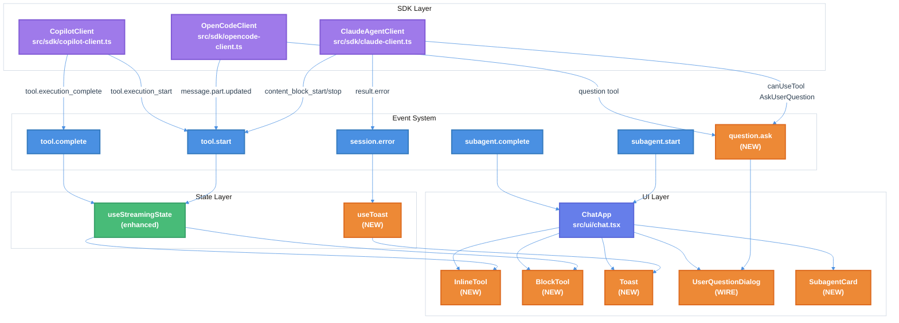

# Chat TUI Parity Implementation Technical Design Document

| Document Metadata      | Details                                         |
| ---------------------- | ----------------------------------------------- |
| Author(s)              | Developer                                       |
| Status                 | Draft (WIP)                                     |
| Team / Owner           | Atomic CLI                                      |
| Created / Last Updated | 2026-02-01                                      |

## 1. Executive Summary

This RFC proposes implementing feature parity between Atomic's Chat TUI and the native CLI experiences of Claude Code, OpenCode, and GitHub Copilot. The primary focus areas are: (1) **Real-time tool call visibility during streaming** (P1), (2) **Wiring AskUserQuestion for ambiguity resolution** (P2), (3) **InlineTool/BlockTool component distinction** (P2), (4) **Error toast notification system** (P2), and (5) **Subagent progress UI** (P3).

Currently, Atomic's Chat TUI operates in **no-permission mode** (auto-approve all tool execution) which is intentional for automated workflows. However, tool calls are invisible during streaming, and the `AskUserQuestion` dialog (for clarifying ambiguous user requirements) is not wired to the SDK. The proposed solution will enable real-time visibility of agent actions while preserving the no-permission auto-approve behavior.

**Research References:**
- `research/docs/2026-02-01-chat-tui-parity-implementation.md` - Primary research document
- `research/docs/2026-02-01-claude-code-ui-patterns-for-atomic.md` - UI patterns research

## 2. Context and Motivation

### 2.1 Current State

**Architecture:** Atomic's TUI (`src/ui/chat.tsx`) is a full-screen terminal chat interface built with OpenTUI/React. The chat handles message submission, streaming responses, tool execution display, and keyboard navigation. All three agents (Claude, OpenCode, Copilot) share the same TUI components.

**Current Components (from `src/ui/` - Research Section "Architecture Documentation"):**
```
ChatApp
├── AtomicHeader (logo, version, model)
├── WorkflowStatusBar (when workflow active)
├── scrollbox
│   ├── MessageBubble[] (user, assistant, system)
│   │   ├── LoadingIndicator (when streaming)
│   │   ├── ToolResult[] (per tool call)
│   │   └── TimestampDisplay (verbose mode)
│   ├── textarea (input)
│   └── Autocomplete (when / typed)
└── UserQuestionDialog (HITL overlay - NOT WIRED)
```

**Limitations (from Research "Implementation Gap Analysis"):**
- Tool calls are NOT visible during streaming - only final text appears
- `UserQuestionDialog` exists but `handleHumanInputRequired` is never invoked
- No error toast notifications - errors silently continue
- No InlineTool/BlockTool distinction for different tool display modes
- No subagent progress UI for Task tool executions

**Research Reference:** Section "Current Atomic Gaps vs Native CLIs" in `research/docs/2026-02-01-chat-tui-parity-implementation.md`

### 2.2 The Problem

**Important Design Decision: No-Permission Mode**

Per research findings: *"Atomic CLI runs all agents in NO-PERMISSION MODE (auto-approve). This is intentional and expected behavior. Permission prompts for tool execution (Read, Write, Bash, etc.) are NOT needed."*

The gaps are NOT about missing permission prompts. The gaps are:

| Problem | User Impact |
|---------|-------------|
| Tool calls invisible during streaming | Users can't see what the agent is doing in real-time |
| `AskUserQuestion` not wired | Agents can't ask clarifying questions when requirements are ambiguous |
| No error toasts | Errors are silent; users don't know when something fails |
| No tool display distinction | All tools render the same way; no collapsed/expanded patterns |
| No subagent progress | Task tool executions are invisible |

**Research Reference:** Section "Testing Results (2026-02-01)" documents live testing observations confirming these gaps.

### 2.3 Design Principle: AskUserQuestion vs Permission Prompts

From research:

> "The ONLY human-in-the-loop interaction needed is the `AskUserQuestion` tool, which is used for:
> - Clarifying ambiguous user requirements
> - Offering choices when multiple approaches exist
> - Getting user preferences during spec approval workflows
>
> This is fundamentally different from permission prompts - it's about **addressing ambiguity**, not **approving tool execution**."

This spec explicitly does NOT implement tool permission prompts. All tools remain auto-approved.

## 3. Goals and Non-Goals

### 3.1 Functional Goals

**Priority 1 - Real-time Tool Streaming (P1):**
- [ ] Emit `tool.start` events when Claude SDK emits `content_block_start` with `type: tool_use`
- [ ] Emit `tool.complete` events when Claude SDK emits `content_block_stop`
- [ ] Display tool calls inline during streaming with status indicator
- [ ] Wire OpenCode SSE events for tool visibility
- [ ] Wire Copilot `tool.execution_start`/`tool.execution_complete` events

**Priority 2 - AskUserQuestion for Ambiguity Resolution (P2):**
- [ ] Wire `AskUserQuestion` tool through `canUseTool` callback in Claude client
- [ ] Emit `question.ask` event with question data
- [ ] Wire existing `UserQuestionDialog` component to handle `question.ask` events
- [ ] Return user answers back to SDK via `updatedInput`
- [ ] Similar wiring for OpenCode `question` tool

**Priority 3 - InlineTool/BlockTool Components (P2):**
- [ ] Create `InlineTool` component for single-line display (Glob, Read, Grep, WebFetch, etc.)
- [ ] Create `BlockTool` component for bordered box display (Bash, Write, Edit, Task, etc.)
- [ ] Classify tools into inline vs block categories
- [ ] Update `ToolResult` to render appropriate component based on tool type

**Priority 4 - Error Toast System (P2):**
- [ ] Create `Toast` component with variant support (error, warning, info, success)
- [ ] Create `ToastProvider` context for managing toast state
- [ ] Subscribe to `session.error` events from SDK clients
- [ ] Display toast notifications for errors with auto-dismiss

**Priority 5 - Subagent Progress UI (P3):**
- [ ] Subscribe to `subagent.start` and `subagent.complete` events
- [ ] Display subagent cards inline during Task tool execution
- [ ] Show subagent type, description, and status

### 3.2 Non-Goals (Out of Scope)

- [ ] We will NOT implement tool permission prompts - all tools remain auto-approved
- [ ] We will NOT implement checkpoint/rewind functionality (P3 deferred)
- [ ] We will NOT implement custom status line configuration (P3 deferred)
- [ ] We will NOT change the verbose mode toggle (already implemented via Ctrl+O)
- [ ] We will NOT change the message queue system (already implemented)
- [ ] We will NOT implement permission mode cycling like Claude Code

## 4. Proposed Solution (High-Level Design)

### 4.1 System Architecture Diagram



### 4.2 Architectural Pattern

We are adopting an **Event-Driven Architecture** with **Component Specialization**:

- **Event-Driven:** SDK clients emit typed events that UI components subscribe to
- **Component Specialization:** Different tool types render with specialized components (InlineTool vs BlockTool)
- **Auto-Approve Pattern:** All tool executions are auto-approved; only `AskUserQuestion` requires human input

**Research Reference:** Section "SDK Research: Tool Call Rendering Patterns" in `research/docs/2026-02-01-chat-tui-parity-implementation.md`

### 4.3 Key Components

| Component | Responsibility | File Location | Status |
|-----------|----------------|---------------|--------|
| `ClaudeAgentClient` | Emit tool events from stream | `src/sdk/claude-client.ts` | Enhance |
| `OpenCodeClient` | Emit tool events from SSE | `src/sdk/opencode-client.ts` | Enhance |
| `CopilotClient` | Emit tool events | `src/sdk/copilot-client.ts` | Enhance |
| `InlineTool` | Single-line tool display | `src/ui/components/inline-tool.tsx` | NEW |
| `BlockTool` | Bordered box tool display | `src/ui/components/block-tool.tsx` | NEW |
| `Toast` | Notification display | `src/ui/components/toast.tsx` | NEW |
| `ToastProvider` | Toast state management | `src/ui/components/toast.tsx` | NEW |
| `SubagentCard` | Subagent progress display | `src/ui/components/subagent-card.tsx` | NEW |
| `UserQuestionDialog` | Question dialog (wire) | `src/ui/components/user-question-dialog.tsx` | WIRE |
| `useStreamingState` | Tool execution tracking | `src/ui/hooks/use-streaming-state.ts` | Enhance |

## 5. Detailed Design

### 5.1 API Interfaces

#### 5.1.1 Enhanced Event Types

**File:** `src/sdk/types.ts`

Add new event type for questions:

```typescript
/**
 * Event types emitted by coding agent sessions.
 */
export type EventType =
  | "session.start"
  | "session.idle"
  | "session.error"
  | "message.delta"
  | "message.complete"
  | "tool.start"
  | "tool.complete"
  | "subagent.start"
  | "subagent.complete"
  | "question.ask";     // NEW: AskUserQuestion event

/**
 * Event data for question.ask events
 */
export interface QuestionAskEventData extends BaseEventData {
  /** Questions to present to the user */
  questions: Array<{
    question: string;
    header: string;
    options: Array<{ label: string; description: string }>;
    multiSelect: boolean;
  }>;
  /** Callback ID for returning answers */
  callbackId: string;
}
```

#### 5.1.2 InlineTool Interface

**File:** `src/ui/components/inline-tool.tsx`

```typescript
/**
 * Tool classification for display mode.
 * Research Reference: OpenCode TUI Architecture
 */
export const INLINE_TOOLS = [
  "Glob",
  "Read",
  "Grep",
  "List",
  "WebFetch",
  "WebSearch",
  "LS",
  "ListMcpResourcesTool",
  "ReadMcpResourceTool",
] as const;

export const BLOCK_TOOLS = [
  "Bash",
  "Write",
  "Edit",
  "Task",
  "TodoWrite",
  "AskUserQuestion",
  "NotebookEdit",
] as const;

export interface InlineToolProps {
  /** Tool name */
  toolName: string;
  /** Current status */
  status: "pending" | "running" | "completed" | "error";
  /** Summary text (e.g., "Read package.json") */
  summary: string;
  /** Error message if status is error */
  error?: string;
}
```

#### 5.1.3 BlockTool Interface

**File:** `src/ui/components/block-tool.tsx`

```typescript
export interface BlockToolProps {
  /** Tool name */
  toolName: string;
  /** Current status */
  status: "pending" | "running" | "completed" | "error";
  /** Tool input */
  input: Record<string, unknown>;
  /** Tool output (when completed) */
  output?: unknown;
  /** Whether initially expanded */
  defaultExpanded?: boolean;
  /** Verbose mode override */
  verboseMode?: boolean;
  /** Child content for custom rendering */
  children?: React.ReactNode;
}
```

#### 5.1.4 Toast Interface

**File:** `src/ui/components/toast.tsx`

```typescript
/**
 * Toast notification for errors and status messages.
 * Research Reference: Section "Priority 4: Error Toast System"
 */
export interface Toast {
  /** Unique identifier */
  id: string;
  /** Toast variant determines styling */
  variant: "error" | "warning" | "info" | "success";
  /** Message to display */
  message: string;
  /** Auto-dismiss duration in ms (0 = no auto-dismiss) */
  duration?: number;
}

export interface ToastContextValue {
  /** Show a toast notification */
  showToast: (toast: Omit<Toast, "id">) => void;
  /** Dismiss a specific toast */
  dismissToast: (id: string) => void;
  /** Current toasts */
  toasts: Toast[];
}
```

#### 5.1.5 SubagentCard Interface

**File:** `src/ui/components/subagent-card.tsx`

```typescript
/**
 * Displays subagent progress during Task tool execution.
 */
export interface SubagentCardProps {
  /** Subagent ID */
  subagentId: string;
  /** Subagent type (e.g., "Explore", "Plan", "debugger") */
  subagentType: string;
  /** Task description */
  description: string;
  /** Current status */
  status: "pending" | "running" | "completed" | "error";
  /** Duration in ms (when completed) */
  durationMs?: number;
}
```

### 5.2 Data Model / Schema

#### 5.2.1 Enhanced ToolExecutionState

**File:** `src/ui/hooks/use-streaming-state.ts`

```typescript
/**
 * Extended tool execution state with display categorization.
 */
export interface ToolExecutionState {
  /** Tool name */
  toolName: string;
  /** Execution status */
  status: "pending" | "running" | "completed" | "error";
  /** Tool input parameters */
  input: unknown;
  /** Tool output (when completed) */
  output?: string;
  /** Error message (when error) */
  error?: string;
  /** Start timestamp */
  startedAt: number;
  /** Completion timestamp */
  completedAt?: number;
  /** Display mode based on tool classification */
  displayMode: "inline" | "block";
}
```

#### 5.2.2 SubagentExecutionState

**File:** `src/ui/hooks/use-streaming-state.ts`

```typescript
/**
 * Tracks subagent executions (Task tool).
 */
export interface SubagentExecutionState {
  /** Subagent ID */
  subagentId: string;
  /** Subagent type */
  subagentType: string;
  /** Task description */
  description: string;
  /** Current status */
  status: "pending" | "running" | "completed" | "error";
  /** Start timestamp */
  startedAt: number;
  /** Completion timestamp */
  completedAt?: number;
  /** Result summary */
  result?: string;
}
```

### 5.3 Algorithms and State Management

#### 5.3.1 Claude SDK Tool Event Extraction

**File:** `src/sdk/claude-client.ts`

The Claude SDK emits streaming events via `includePartialMessages: true`. Extract tool events from the stream:

```typescript
/**
 * Extract tool events from Claude SDK streaming.
 * Research Reference: Section "Priority 1: Real-time Tool Streaming"
 */
async *streamWithToolEvents(message: string): AsyncIterable<AgentMessage> {
  const options = {
    ...this.baseOptions,
    includePartialMessages: true,
  };

  for await (const msg of query({ prompt: message, options })) {
    if (msg.type === 'stream_event') {
      const event = msg.event;

      // Tool call starting
      if (event.type === 'content_block_start' &&
          event.content_block?.type === 'tool_use') {
        this.emitEvent('tool.start', this.currentSessionId, {
          toolName: event.content_block.name,
          toolInput: event.content_block.input,
        });
      }

      // Tool call completed
      if (event.type === 'content_block_stop' &&
          this.pendingToolUseId) {
        this.emitEvent('tool.complete', this.currentSessionId, {
          toolName: this.pendingToolName,
          success: true,
        });
      }
    }

    yield msg;
  }
}
```

#### 5.3.2 AskUserQuestion Wiring

**File:** `src/sdk/claude-client.ts`

Wire `AskUserQuestion` tool through `canUseTool` callback:

```typescript
/**
 * Handle AskUserQuestion tool for ambiguity resolution.
 * Research Reference: Section "Priority 2: Wire AskUserQuestion"
 *
 * NOTE: This is NOT a permission prompt. All other tools are auto-approved.
 * This only handles the case where the agent needs to ask clarifying questions.
 */
private buildCanUseTool(sessionId: string): CanUseTool {
  return async (toolName, input, { signal }) => {
    // AskUserQuestion - need human input for ambiguity resolution
    if (toolName === 'AskUserQuestion') {
      const callbackId = crypto.randomUUID();

      // Emit event for UI to show question dialog
      this.emitEvent('question.ask', sessionId, {
        questions: (input as AskUserQuestionInput).questions,
        callbackId,
      });

      // Wait for user response
      const answers = await this.waitForUserAnswers(callbackId, signal);

      // Return with filled answers
      return {
        behavior: 'allow',
        updatedInput: { ...input, answers },
      };
    }

    // ALL other tools auto-approved (no permission prompts)
    return { behavior: 'allow', updatedInput: input };
  };
}

/**
 * Wait for user answers with abort support.
 */
private async waitForUserAnswers(
  callbackId: string,
  signal: AbortSignal
): Promise<Record<string, string>> {
  return new Promise((resolve, reject) => {
    const handler = (answers: Record<string, string>) => {
      this.answerHandlers.delete(callbackId);
      resolve(answers);
    };

    this.answerHandlers.set(callbackId, handler);

    signal.addEventListener('abort', () => {
      this.answerHandlers.delete(callbackId);
      reject(new Error('Aborted'));
    });
  });
}

/**
 * Called by UI when user answers a question.
 */
public submitQuestionAnswer(callbackId: string, answers: Record<string, string>): void {
  const handler = this.answerHandlers.get(callbackId);
  if (handler) {
    handler(answers);
  }
}
```

#### 5.3.3 Tool Display Mode Classification

**File:** `src/ui/components/tool-result.tsx`

```typescript
/**
 * Determine display mode for a tool.
 * Research Reference: Section "Priority 3: InlineTool/BlockTool Components"
 */
function getToolDisplayMode(toolName: string): "inline" | "block" {
  const normalized = toolName.toLowerCase();

  // Check inline tools
  const inlineTools = [
    "glob", "read", "grep", "list", "ls",
    "webfetch", "websearch",
    "listmcpresourcestool", "readmcpresourcetool",
  ];

  if (inlineTools.some(t => normalized.includes(t))) {
    return "inline";
  }

  // Default to block for Bash, Write, Edit, Task, etc.
  return "block";
}
```

#### 5.3.4 Toast Auto-Dismiss Logic

**File:** `src/ui/components/toast.tsx`

```typescript
/**
 * Toast provider with auto-dismiss functionality.
 */
export function ToastProvider({ children }: { children: React.ReactNode }) {
  const [toasts, setToasts] = useState<Toast[]>([]);

  const showToast = useCallback((toast: Omit<Toast, "id">) => {
    const id = crypto.randomUUID();
    const duration = toast.duration ?? 5000;

    setToasts(prev => [...prev, { ...toast, id }]);

    // Auto-dismiss unless duration is 0
    if (duration > 0) {
      setTimeout(() => {
        setToasts(prev => prev.filter(t => t.id !== id));
      }, duration);
    }
  }, []);

  const dismissToast = useCallback((id: string) => {
    setToasts(prev => prev.filter(t => t.id !== id));
  }, []);

  return (
    <ToastContext.Provider value={{ toasts, showToast, dismissToast }}>
      {children}
    </ToastContext.Provider>
  );
}
```

### 5.4 Component Implementations

#### 5.4.1 InlineTool Component

**File:** `src/ui/components/inline-tool.tsx`

```typescript
/**
 * Single-line tool display for read-only operations.
 * Research Reference: OpenCode InlineTool pattern
 */
export function InlineTool({
  toolName,
  status,
  summary,
  error,
}: InlineToolProps): React.ReactNode {
  const { colors } = useTheme();

  const icon = getToolIcon(toolName);
  const statusColor = getStatusColor(status, colors);

  return (
    <box flexDirection="row" gap={1}>
      <text style={{ fg: colors.accent }}>{icon}</text>
      <text style={{ fg: statusColor }}>{summary}</text>
      {status === "running" && (
        <text style={{ fg: colors.muted }}>...</text>
      )}
      {status === "error" && error && (
        <text style={{ fg: colors.error }}> ({error})</text>
      )}
    </box>
  );
}

function getToolIcon(toolName: string): string {
  const icons: Record<string, string> = {
    Read: "📄",
    Glob: "🔍",
    Grep: "🔎",
    WebFetch: "🌐",
    WebSearch: "🔍",
    List: "📋",
    LS: "📂",
  };
  return icons[toolName] ?? "●";
}

function getStatusColor(
  status: "pending" | "running" | "completed" | "error",
  colors: ThemeColors
): string {
  switch (status) {
    case "pending": return colors.muted;
    case "running": return colors.accent;
    case "completed": return colors.muted;
    case "error": return colors.error;
  }
}
```

#### 5.4.2 BlockTool Component

**File:** `src/ui/components/block-tool.tsx`

```typescript
/**
 * Bordered box tool display for write/execute operations.
 * Research Reference: OpenCode BlockTool pattern
 */
export function BlockTool({
  toolName,
  status,
  input,
  output,
  defaultExpanded = false,
  verboseMode = false,
  children,
}: BlockToolProps): React.ReactNode {
  const { colors } = useTheme();
  const [expanded, setExpanded] = useState(verboseMode || defaultExpanded);

  // Update when verboseMode changes
  useEffect(() => {
    if (verboseMode) setExpanded(true);
  }, [verboseMode]);

  const icon = getToolIcon(toolName);
  const title = getToolTitle(toolName, input);
  const toggleChar = expanded ? "▼" : "▶";

  return (
    <box
      flexDirection="column"
      borderStyle="single"
      borderColor={colors.border}
      marginTop={1}
    >
      <box
        flexDirection="row"
        paddingLeft={1}
        paddingRight={1}
        onClick={() => setExpanded(!expanded)}
      >
        <text style={{ fg: colors.accent }}>{icon} </text>
        <text style={{ fg: colors.foreground, bold: true }}>{title}</text>
        <text style={{ fg: colors.muted }}> {toggleChar}</text>
        {status === "running" && (
          <text style={{ fg: colors.accent }}> ...</text>
        )}
        {status === "error" && (
          <text style={{ fg: colors.error }}> (error)</text>
        )}
      </box>
      {expanded && (
        <box paddingLeft={2} paddingRight={1}>
          {children ?? <DefaultBlockContent input={input} output={output} />}
        </box>
      )}
    </box>
  );
}
```

#### 5.4.3 Toast Component

**File:** `src/ui/components/toast.tsx`

```typescript
/**
 * Toast notification component.
 */
function ToastItem({ toast }: { toast: Toast }): React.ReactNode {
  const { colors } = useTheme();

  const variantColors: Record<Toast["variant"], string> = {
    error: colors.error,
    warning: colors.warning,
    info: colors.accent,
    success: colors.success,
  };

  const variantIcons: Record<Toast["variant"], string> = {
    error: "✗",
    warning: "⚠",
    info: "ℹ",
    success: "✓",
  };

  return (
    <box
      borderStyle="rounded"
      borderColor={variantColors[toast.variant]}
      paddingLeft={1}
      paddingRight={1}
      marginBottom={1}
    >
      <text style={{ fg: variantColors[toast.variant] }}>
        {variantIcons[toast.variant]} {toast.message}
      </text>
    </box>
  );
}

/**
 * Toast container positioned at top-right.
 */
export function ToastContainer(): React.ReactNode {
  const { toasts } = useToast();

  if (toasts.length === 0) return null;

  return (
    <box position="absolute" top={1} right={1} width={50}>
      {toasts.map(toast => (
        <ToastItem key={toast.id} toast={toast} />
      ))}
    </box>
  );
}
```

#### 5.4.4 SubagentCard Component

**File:** `src/ui/components/subagent-card.tsx`

```typescript
/**
 * Display subagent progress during Task tool execution.
 */
export function SubagentCard({
  subagentId,
  subagentType,
  description,
  status,
  durationMs,
}: SubagentCardProps): React.ReactNode {
  const { colors } = useTheme();

  const statusIcons: Record<SubagentCardProps["status"], string> = {
    pending: "○",
    running: "●",
    completed: "✓",
    error: "✗",
  };

  const statusColors: Record<SubagentCardProps["status"], string> = {
    pending: colors.muted,
    running: colors.accent,
    completed: colors.success,
    error: colors.error,
  };

  return (
    <box flexDirection="row" gap={1} paddingLeft={2}>
      <text style={{ fg: statusColors[status] }}>
        {statusIcons[status]}
      </text>
      <text style={{ fg: colors.accent, bold: true }}>
        {subagentType}
      </text>
      <text style={{ fg: colors.muted }}>
        {description.slice(0, 50)}{description.length > 50 ? "..." : ""}
      </text>
      {status === "completed" && durationMs && (
        <text style={{ fg: colors.muted }}>
          ({formatDuration(durationMs)})
        </text>
      )}
    </box>
  );
}
```

## 6. Alternatives Considered

| Option | Pros | Cons | Reason for Rejection |
|--------|------|------|---------------------|
| Option A: Add permission prompts | Matches Claude Code | Breaks automated workflows, not needed | **Rejected:** Atomic intentionally uses no-permission mode |
| Option B: Unified tool display | Simpler implementation | Loses visual distinction between tool types | **Rejected:** InlineTool/BlockTool provides better UX |
| Option C: Polling for tool status | Simple state management | Higher latency, misses events | **Rejected:** Event-driven is more responsive |
| **Option D: Event-driven with specialized components (Selected)** | **Real-time updates, clean separation** | **More complex wiring** | **Selected:** Best balance of UX and architecture |

## 7. Cross-Cutting Concerns

### 7.1 Security and Privacy

- **AskUserQuestion Scope:** Only `AskUserQuestion` requires human input; all tool executions remain auto-approved
- **No Credential Exposure:** Question answers are passed back via callback; not stored permanently
- **Event Isolation:** Events are scoped to session ID

### 7.2 Performance

- **Event Batching:** Consider batching rapid tool events within 16ms window (from OpenTUI AsyncQueue pattern)
- **Lazy Rendering:** BlockTool content only rendered when expanded
- **Toast Cleanup:** Auto-dismiss prevents memory leak from accumulated toasts

### 7.3 Testing Strategy

| Test Type | Coverage Area | Files |
|-----------|---------------|-------|
| Unit Tests | InlineTool rendering | `tests/ui/components/inline-tool.test.tsx` |
| Unit Tests | BlockTool expand/collapse | `tests/ui/components/block-tool.test.tsx` |
| Unit Tests | Toast auto-dismiss | `tests/ui/components/toast.test.tsx` |
| Unit Tests | Tool classification | `tests/ui/components/tool-result.test.tsx` |
| Integration | Claude tool event extraction | `tests/sdk/claude-client.test.ts` |
| Integration | AskUserQuestion flow | `tests/sdk/claude-client.test.ts` |
| Integration | Error toast subscription | `tests/ui/chat.test.tsx` |
| E2E | Full tool streaming visibility | `tests/e2e/chat-tool-streaming.test.ts` |

## 8. Migration, Rollout, and Testing

### 8.1 Deployment Strategy

- [ ] **Phase 1:** Enhance SDK clients with tool event extraction
- [ ] **Phase 2:** Create InlineTool and BlockTool components
- [ ] **Phase 3:** Wire AskUserQuestion through canUseTool
- [ ] **Phase 4:** Add Toast system and error subscription
- [ ] **Phase 5:** Add SubagentCard and subagent event handling
- [ ] **Phase 6:** Integration testing across all agents

### 8.2 Backward Compatibility

All changes are additive. Existing behavior is preserved:
- Tool execution remains auto-approved
- Verbose mode toggle (Ctrl+O) continues to work
- Message queue functionality unchanged
- Existing ToolResult component enhanced, not replaced

### 8.3 Test Plan

**Unit Tests:**
- [ ] InlineTool renders with all status variants
- [ ] BlockTool expands/collapses correctly
- [ ] Tool classification returns correct display mode
- [ ] Toast auto-dismisses after duration
- [ ] SubagentCard shows correct status icons

**Integration Tests:**
- [ ] Claude client emits tool.start on content_block_start
- [ ] Claude client emits tool.complete on content_block_stop
- [ ] AskUserQuestion triggers question.ask event
- [ ] User answers are returned to SDK
- [ ] session.error triggers toast

**E2E Tests:**
- [ ] Tool calls visible during streaming (all agents)
- [ ] Question dialog appears for AskUserQuestion
- [ ] Error toast shows on SDK errors
- [ ] Subagent cards appear during Task execution

## 9. Implementation Guide

### 9.1 Files to Create

| File | Purpose |
|------|---------|
| `src/ui/components/inline-tool.tsx` | Single-line tool display |
| `src/ui/components/block-tool.tsx` | Bordered box tool display |
| `src/ui/components/toast.tsx` | Toast notification system |
| `src/ui/components/subagent-card.tsx` | Subagent progress display |
| `tests/ui/components/inline-tool.test.tsx` | InlineTool tests |
| `tests/ui/components/block-tool.test.tsx` | BlockTool tests |
| `tests/ui/components/toast.test.tsx` | Toast tests |
| `tests/ui/components/subagent-card.test.tsx` | SubagentCard tests |

### 9.2 Files to Modify

| File | Changes |
|------|---------|
| `src/sdk/types.ts` | Add `question.ask` event type and data interface |
| `src/sdk/claude-client.ts` | Enable `includePartialMessages`, extract tool events, wire `canUseTool` for AskUserQuestion |
| `src/sdk/opencode-client.ts` | Wire tool events from SSE, handle question tool |
| `src/sdk/copilot-client.ts` | Wire `tool.execution_start`/`complete` events |
| `src/ui/chat.tsx` | Subscribe to events, render specialized tool components, integrate ToastProvider |
| `src/ui/components/tool-result.tsx` | Use InlineTool/BlockTool based on classification |
| `src/ui/components/user-question-dialog.tsx` | Wire to question.ask events |
| `src/ui/components/index.ts` | Export new components |
| `src/ui/hooks/use-streaming-state.ts` | Add subagent tracking, display mode |

### 9.3 Event Wiring Summary

| Agent | Tool Start Source | Tool Complete Source | Question Source |
|-------|-------------------|---------------------|-----------------|
| Claude | `content_block_start` (type: tool_use) | `content_block_stop` | `canUseTool(AskUserQuestion)` |
| OpenCode | `message.part.updated` (status: running) | `message.part.updated` (status: completed) | `question` tool via Bus |
| Copilot | `tool.execution_start` event | `tool.execution_complete` event | N/A (no equivalent) |

## 10. Open Questions / Unresolved Issues

- [ ] **OpenCode Question Tool:** How is the question tool response mechanism different from Claude's canUseTool? Need to verify OpenCode SDK API.
- [ ] **Copilot Question Support:** Does Copilot SDK have an equivalent to AskUserQuestion? May not be supported.
- [ ] **Event Batching:** Should we batch rapid tool events (e.g., multiple Grep calls)? OpenTUI uses 16ms batching.
- [ ] **Toast Stacking:** Should toasts stack or replace each other? Current design stacks.
- [ ] **Subagent Nesting:** Can Task tools spawn other Task tools? How deep should nesting display go?

---

## Appendix A: SDK Event Mapping

### A.1 Claude SDK Events

**Research Reference:** Section "Claude Agent SDK v2 Details" in research document

| SDK Event | Atomic Event | Data Extraction |
|-----------|--------------|-----------------|
| `content_block_start` (type: tool_use) | `tool.start` | `{ toolName: content_block.name, toolInput: content_block.input }` |
| `content_block_stop` | `tool.complete` | `{ toolName: <tracked>, success: true }` |
| `message_stop` (stop_reason: error) | `session.error` | `{ error: <stop_reason_details> }` |

### A.2 OpenCode SDK Events

**Research Reference:** Section "OpenCode SDK Architecture" in research document

| SDK Event | Atomic Event | Data Extraction |
|-----------|--------------|-----------------|
| `message.part.updated` (status: running) | `tool.start` | `{ toolName: part.tool, toolInput: part.input }` |
| `message.part.updated` (status: completed) | `tool.complete` | `{ toolName: part.tool, toolResult: part.output }` |
| `message.part.updated` (status: error) | `tool.complete` | `{ toolName: part.tool, error: part.error }` |
| `session.error` | `session.error` | `{ error: payload.error }` |

### A.3 Copilot SDK Events

**Research Reference:** Section "Copilot SDK Events" in TUI spec appendix

| SDK Event | Atomic Event | Data Extraction |
|-----------|--------------|-----------------|
| `tool.execution_start` | `tool.start` | `{ toolName: data.toolName, toolInput: data.arguments }` |
| `tool.execution_complete` | `tool.complete` | `{ toolName: data.toolName, toolResult: data.result }` |
| `session.error` | `session.error` | `{ error: data.error }` |

---

## Appendix B: Related Specs

| Spec | Relationship |
|------|--------------|
| `specs/claude-code-ui-patterns-enhancement.md` | Covers message queuing, verbose mode, timing display - complementary to this spec |
| `specs/tui-command-autocomplete-system.md` | Covers slash command system - foundation for TUI |

---

## 11. Success Metrics

| Metric | Current | Target | Measurement |
|--------|---------|--------|-------------|
| Tool visibility during streaming | Not visible | Real-time visible | Visual verification |
| AskUserQuestion handling | Not wired | Dialog appears | Integration test |
| Error notification | Silent | Toast shown | Integration test |
| Tool display modes | Single mode | Inline/Block | Visual verification |
| Subagent progress | Not shown | Cards visible | Visual verification |

## 12. References

### Research Documents

- `research/docs/2026-02-01-chat-tui-parity-implementation.md` - Primary research with gap analysis
- `research/docs/2026-02-01-claude-code-ui-patterns-for-atomic.md` - UI patterns and OpenTUI components
- `research/docs/2026-01-31-claude-agent-sdk-research.md` - Claude SDK streaming details
- `research/docs/2026-01-31-opencode-sdk-research.md` - OpenCode event system
- `research/docs/2026-01-31-github-copilot-sdk-research.md` - Copilot SDK events

### Implementation Files

| File | Description |
|------|-------------|
| `src/ui/chat.tsx` | Main chat component (lines 625-1404) |
| `src/ui/components/tool-result.tsx` | Existing tool result component |
| `src/ui/components/user-question-dialog.tsx` | Existing question dialog (needs wiring) |
| `src/ui/hooks/use-streaming-state.ts` | Streaming state management |
| `src/sdk/claude-client.ts` | Claude SDK client |
| `src/sdk/opencode-client.ts` | OpenCode SDK client |
| `src/sdk/copilot-client.ts` | Copilot SDK client |
| `src/sdk/types.ts` | SDK event types |
