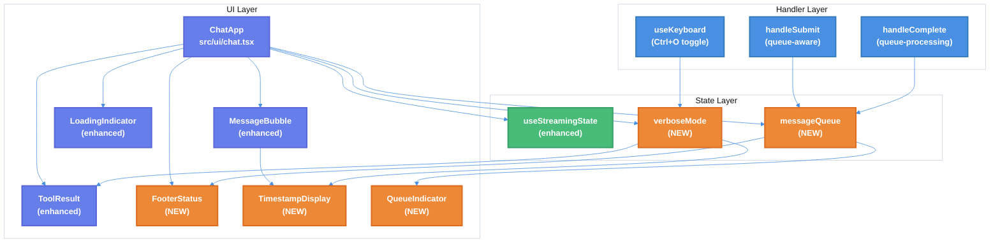

# Claude Code UI Patterns Enhancement Technical Design Document

| Document Metadata      | Details     |
| ---------------------- | ----------- |
| Author(s)              | Developer   |
| Status                 | Draft (WIP) |
| Team / Owner           | Atomic CLI  |
| Created / Last Updated | 2026-02-01  |

## 1. Executive Summary

This RFC proposes enhancing Atomic's terminal chat UI to match Claude Code CLI's user experience patterns. The enhancements focus on five key areas: message queuing (allowing input during streaming), collapsible tool outputs (default collapsed with expand hint), execution timing display, verbose mode toggle, and spinner verb customization.

Currently, Atomic blocks user input during streaming responses and displays tool outputs in an expanded format that can overwhelm the chat view. The proposed solution will improve UX by enabling message queuing (reducing perceived latency), collapsing tool outputs by default (cleaner chat history), and adding timing metadata (better debugging experience).

**Research Reference:** `research/docs/2026-02-01-claude-code-ui-patterns-for-atomic.md`

## 2. Context and Motivation

### 2.1 Current State

**Architecture:** Atomic's TUI (`src/ui/chat.tsx`) is a full-screen terminal chat interface built with OpenTUI/React. The chat loop handles message submission, streaming responses, tool execution display, and keyboard navigation.

**Current Chat Flow (`src/ui/chat.tsx:1080-1164`):**

```
User Input → handleSubmit() → [blocked if isStreaming] → session.stream(content) → Display Response
```

**Current Components:**

- `AtomicHeader` (`src/ui/chat.tsx:48-67`) - Block letter logo with gradient styling
- `MessageBubble` (`src/ui/chat.tsx:453-543`) - Message rendering with role-based styling
- `LoadingIndicator` (`src/ui/chat.tsx:321-380`) - Wave animation with dots
- `ToolResult` (`src/ui/components/tool-result.tsx`) - Tool execution display with expand/collapse
- `Autocomplete` (`src/ui/components/autocomplete.tsx`) - Slash command suggestions
- `WorkflowStatusBar` (`src/ui/components/workflow-status-bar.tsx`) - Workflow progress display

**Limitations:**

- Input is blocked during streaming via `isStreaming` guard in `handleSubmit` (`src/ui/chat.tsx:1085-1087`)
- Tool outputs are not default-collapsed; no keyboard toggle for verbose mode
- No timestamp or duration display on messages
- Loading indicator uses fixed animation without customizable verbs
- No footer status line showing permission mode or queue count

**Research Reference:** Section 2 "Atomic's Current UI Implementation" documents the current feature matrix and gaps.

### 2.2 The Problem

- **User Impact:** Users cannot compose follow-up messages while waiting for responses; must wait for completion before typing
- **Visual Clutter:** Tool outputs expand inline, making it difficult to follow conversation flow
- **Debugging:** No timing information visible to help identify slow operations
- **Feedback:** Generic loading animation provides no context about what the assistant is doing

**Research Reference:** Section 1 "Claude Code CLI UI Observations" documents the target UX patterns from Claude Code CLI.

## 3. Goals and Non-Goals

### 3.1 Functional Goals

**Priority 1 - Message Queuing:**

- [ ] Remove `isStreaming` guard from message submission
- [ ] Add `messageQueue` state to track pending messages
- [ ] Process queued messages sequentially after each response completes
- [ ] Display visual indicator for queued messages

**Priority 2 - Collapsible Tool Outputs:**

- [ ] Default tool outputs to collapsed state
- [ ] Show summary line with tool name and result count (e.g., "Read 2 files")
- [ ] Display "(ctrl+o to expand)" hint on collapsed outputs

**Priority 3 - Verbose Mode Toggle:**

- [ ] Add `verboseMode` state (boolean, default: false)
- [ ] Implement Ctrl+O keyboard shortcut to toggle verbose mode
- [ ] When verbose: expand all tool outputs, show timestamps and model name
- [ ] Display mode indicator in footer

**Priority 4 - Timing Display:**

- [ ] Track message start/end timestamps
- [ ] Calculate and store duration per message
- [ ] Display timestamp and model name (right-aligned) in verbose mode

**Priority 5 - Spinner Verb Customization:**

- [ ] Define configurable array of spinner verbs
- [ ] Display random verb during loading (e.g., "Thinking...", "Analyzing...")
- [ ] Update `LoadingIndicator` component to support verb display

**Priority 6 - Footer Status Line:**

- [ ] Create `FooterStatus` component
- [ ] Display permission mode with icon
- [ ] Show queued message count when > 0
- [ ] Display keyboard shortcut hints

### 3.2 Non-Goals (Out of Scope)

- [ ] We will NOT implement queue persistence across sessions
- [ ] We will NOT add configurable queue size limits (unlimited for now)
- [ ] We will NOT implement user-configurable spinner verbs via settings file (hardcoded list)
- [ ] We will NOT implement permission mode cycling like Claude Code (no permission modes yet)
- [ ] We will NOT change the overall chat layout or header design

## 4. Proposed Solution (High-Level Design)

### 4.1 System Architecture Diagram



### 4.2 Architectural Pattern

We are adopting an **Enhanced State Machine Pattern** with **Queue-Based Message Processing**:

- **State Machine:** The chat component manages multiple related states (streaming, verbose mode, queue) with coordinated transitions
- **Queue Pattern:** Messages submitted during streaming are queued and processed FIFO after current response completes
- **Observer Pattern:** Verbose mode state propagates to child components (ToolResult, MessageBubble) for coordinated display

**Research Reference:** Section 4 "Message Queuing Implementation Strategy" and Section 3 "OpenTUI Components Available for Reuse" detail the AsyncQueue pattern.

### 4.3 Key Components

| Component          | Responsibility                       | File Location                             | Status  |
| ------------------ | ------------------------------------ | ----------------------------------------- | ------- |
| `ChatApp`          | Main container with state management | `src/ui/chat.tsx`                         | Enhance |
| `MessageBubble`    | Render messages with optional timing | `src/ui/chat.tsx`                         | Enhance |
| `ToolResult`       | Display tool output with collapse    | `src/ui/components/tool-result.tsx`       | Enhance |
| `LoadingIndicator` | Animated spinner with verb           | `src/ui/chat.tsx`                         | Enhance |
| `FooterStatus`     | Permission mode and queue indicator  | `src/ui/components/footer-status.tsx`     | NEW     |
| `TimestampDisplay` | Right-aligned timestamp + model      | `src/ui/components/timestamp-display.tsx` | NEW     |
| `QueueIndicator`   | Show queued messages                 | `src/ui/components/queue-indicator.tsx`   | NEW     |
| `useMessageQueue`  | Hook for queue state management      | `src/ui/hooks/use-message-queue.ts`       | NEW     |

## 5. Detailed Design

### 5.1 API Interfaces

#### 5.1.1 QueuedMessage Interface

**File:** `src/ui/hooks/use-message-queue.ts`

```typescript
/**
 * Represents a message waiting to be sent.
 */
export interface QueuedMessage {
  /** Unique identifier for the queued message */
  id: string;
  /** Message content */
  content: string;
  /** Timestamp when the message was queued */
  queuedAt: string;
}

/**
 * Return type for useMessageQueue hook.
 */
export interface UseMessageQueueReturn {
  /** Current queued messages */
  queue: QueuedMessage[];
  /** Add a message to the queue */
  enqueue: (content: string) => void;
  /** Remove and return the next message */
  dequeue: () => QueuedMessage | undefined;
  /** Clear all queued messages */
  clear: () => void;
  /** Number of queued messages */
  count: number;
}
```

#### 5.1.2 Enhanced ChatMessage Interface

**File:** `src/ui/chat.tsx`

```typescript
/**
 * Enhanced chat message with timing metadata.
 */
export interface ChatMessage {
  /** Existing fields... */
  id: string;
  role: "user" | "assistant" | "system";
  content: string;
  timestamp: string;
  streaming?: boolean;

  /** NEW: Duration in milliseconds from send to complete */
  durationMs?: number;
  /** NEW: Model ID that generated this message */
  modelId?: string;
  /** NEW: When streaming started (for duration calculation) */
  streamingStartedAt?: string;
}
```

#### 5.1.3 VerboseModeState Interface

**File:** `src/ui/chat.tsx`

```typescript
/**
 * Verbose mode configuration.
 */
export interface VerboseModeState {
  /** Whether verbose mode is enabled */
  enabled: boolean;
  /** Show timestamps on messages */
  showTimestamps: boolean;
  /** Show model name on messages */
  showModel: boolean;
  /** Default expand state for tool outputs */
  defaultToolExpanded: boolean;
}
```

#### 5.1.4 FooterStatusProps Interface

**File:** `src/ui/components/footer-status.tsx`

```typescript
/**
 * Props for the FooterStatus component.
 */
export interface FooterStatusProps {
  /** Whether verbose mode is enabled */
  verboseMode: boolean;
  /** Whether streaming is active */
  isStreaming: boolean;
  /** Number of queued messages */
  queuedCount: number;
  /** Current model ID */
  modelId?: string;
}
```

#### 5.1.5 Enhanced ToolResultProps Interface

**File:** `src/ui/components/tool-result.tsx`

```typescript
/**
 * Enhanced props for ToolResult component.
 */
export interface ToolResultProps {
  /** Existing props... */
  toolName: string;
  input: Record<string, unknown>;
  output: unknown;
  status: ToolExecutionStatus;

  /** NEW: Override initial expanded state */
  initialExpanded?: boolean;
  /** NEW: Maximum lines when collapsed */
  maxCollapsedLines?: number;
  /** NEW: Show expand hint text */
  showExpandHint?: boolean;
  /** NEW: Custom expand hint text */
  expandHint?: string;
  /** NEW: Verbose mode - forces expanded */
  verboseMode?: boolean;
}
```

### 5.2 Data Model / Schema

#### 5.2.1 State Updates to ChatApp

```typescript
// Existing state
const [messages, setMessages] = useState<ChatMessage[]>(initialMessages);
const [isStreaming, setIsStreaming] = useState(false);

// NEW: Verbose mode state
const [verboseMode, setVerboseMode] = useState(false);

// NEW: Message queue hook
const { queue, enqueue, dequeue, count: queueCount } = useMessageQueue();

// NEW: Model ID tracking (passed from session)
const [currentModelId, setCurrentModelId] = useState<string | undefined>(
  modelId,
);
```

#### 5.2.2 Timestamp Tracking

```typescript
// Track when streaming starts for duration calculation
const streamingStartRef = useRef<number | null>(null);

const handleStreamStart = (messageId: string) => {
  streamingStartRef.current = Date.now();
  // ... existing logic
};

const handleStreamComplete = () => {
  const duration = streamingStartRef.current
    ? Date.now() - streamingStartRef.current
    : undefined;

  if (streamingMessageIdRef.current && duration) {
    setMessages((prev) =>
      prev.map((msg) =>
        msg.id === streamingMessageIdRef.current
          ? { ...msg, durationMs: duration, modelId: currentModelId }
          : msg,
      ),
    );
  }

  streamingStartRef.current = null;
  // ... existing logic + queue processing
};
```

### 5.3 Algorithms and State Management

#### 5.3.1 Message Queue Processing

```typescript
/**
 * Process next message from queue after stream completion.
 * Called from handleStreamComplete.
 */
const processNextQueuedMessage = useCallback(() => {
  const nextMessage = dequeue();
  if (nextMessage) {
    // Small delay to allow UI to update
    setTimeout(() => {
      handleSendMessage(nextMessage.content);
    }, 50);
  }
}, [dequeue, handleSendMessage]);
```

**State Machine:**

```
IDLE → [user submits] → STREAMING → [complete] → CHECK_QUEUE
                                                      ↓
                                              queue empty? → IDLE
                                              queue has items? → STREAMING (next message)
```

#### 5.3.2 Verbose Mode Toggle

```typescript
/**
 * Toggle verbose mode with Ctrl+O.
 */
const handleKeyboard = useCallback(
  (event: KeyEvent) => {
    // Ctrl+O: Toggle verbose mode
    if (event.ctrl && event.name === "o") {
      setVerboseMode((prev) => !prev);
      return;
    }
    // ... existing keyboard handling
  },
  [
    /* deps */
  ],
);
```

#### 5.3.3 Tool Summary Generation

```typescript
/**
 * Generate summary text for collapsed tool output.
 */
function getToolSummary(
  toolName: string,
  input: Record<string, unknown>,
  output: unknown,
): string {
  switch (toolName) {
    case "Read":
      const filePath = input.file_path as string;
      const fileName = filePath?.split("/").pop() ?? "file";
      return `Read ${fileName}`;

    case "Glob":
      const pattern = input.pattern as string;
      const matches = Array.isArray(output) ? output.length : 0;
      return `Glob ${pattern} (${matches} match${matches !== 1 ? "es" : ""})`;

    case "Grep":
      const searchPattern = input.pattern as string;
      return `Grep "${searchPattern.slice(0, 20)}${searchPattern.length > 20 ? "..." : ""}"`;

    case "Bash":
      const command = input.command as string;
      const shortCmd = command?.slice(0, 30) ?? "command";
      return `Ran ${shortCmd}${command?.length > 30 ? "..." : ""}`;

    case "Edit":
      const editPath = input.file_path as string;
      const editFile = editPath?.split("/").pop() ?? "file";
      return `Edited ${editFile}`;

    case "Write":
      const writePath = input.file_path as string;
      const writeFile = writePath?.split("/").pop() ?? "file";
      return `Wrote ${writeFile}`;

    case "Task":
      const description = input.description as string;
      return `Task: ${description?.slice(0, 30) ?? "agent"}${description?.length > 30 ? "..." : ""}`;

    default:
      return `${toolName}`;
  }
}
```

#### 5.3.4 Duration Formatting

```typescript
/**
 * Format duration for display.
 * Based on OpenTUI pattern from research.
 */
function formatDuration(ms: number): string {
  if (ms < 1000) return `${ms}ms`;
  if (ms < 60000) return `${(ms / 1000).toFixed(1)}s`;
  const min = Math.floor(ms / 60000);
  const sec = Math.round((ms % 60000) / 1000);
  return `${min}m ${sec}s`;
}

/**
 * Format timestamp for display.
 */
function formatTimestamp(isoString: string): string {
  const date = new Date(isoString);
  return date.toLocaleTimeString("en-US", {
    hour: "2-digit",
    minute: "2-digit",
    hour12: true,
  });
}
```

## 6. Alternatives Considered

| Option                                    | Pros                                     | Cons                                      | Reason for Rejection                                           |
| ----------------------------------------- | ---------------------------------------- | ----------------------------------------- | -------------------------------------------------------------- |
| Option A: Block input during streaming    | Simple, no queue management              | Poor UX, users wait idle                  | Current behavior; Claude Code allows typing during streaming   |
| Option B: Debounced queue                 | Reduces rapid duplicate messages         | Adds complexity, unexpected delay         | Users expect immediate queue on Enter                          |
| Option C: Parallel message processing     | Fastest responses                        | Complex state management, race conditions | Sequential is simpler and matches Claude Code behavior         |
| **Option D: Sequential queue (Selected)** | **Matches Claude Code UX, simple state** | **Slight delay between queued messages**  | **Selected:** Best balance of UX and implementation complexity |

| Option                                     | Pros                                  | Cons                                        | Reason for Rejection                                         |
| ------------------------------------------ | ------------------------------------- | ------------------------------------------- | ------------------------------------------------------------ |
| Option A: Always expanded tool outputs     | Full visibility                       | Visual clutter, hard to follow conversation | Current behavior; Claude Code uses collapsed default         |
| **Option B: Default collapsed (Selected)** | **Clean UI, user controls expansion** | **Requires extra action to see details**    | **Selected:** Matches Claude Code pattern with Ctrl+O toggle |
| Option C: Smart collapse based on size     | Automatic decision                    | Unpredictable behavior                      | Users prefer consistent behavior                             |

## 7. Cross-Cutting Concerns

### 7.1 Performance

- **Queue Memory:** Queue stores full message content; large messages could consume memory
  - Mitigation: Messages are typically small (< 10KB); queue is cleared on processing
- **Re-renders:** Verbose mode toggle affects multiple components
  - Mitigation: Use React.memo for MessageBubble and ToolResult components
- **Timer Management:** LoadingIndicator uses setInterval for animation
  - Mitigation: Existing cleanup via useEffect return; no changes needed

### 7.2 Accessibility

- **Keyboard Navigation:** Ctrl+O is standard terminal shortcut (may conflict with "open" in some terminals)
  - Mitigation: Document the shortcut; consider fallback key binding
- **Screen Readers:** Collapsed tool outputs should announce their collapsed state
  - Mitigation: Include aria-expanded attribute equivalent in text output

### 7.3 Testing Strategy

| Test Type       | Coverage Area                  | Files                                            |
| --------------- | ------------------------------ | ------------------------------------------------ |
| Unit Tests      | useMessageQueue hook           | `tests/ui/hooks/use-message-queue.test.ts`       |
| Unit Tests      | getToolSummary function        | `tests/ui/components/tool-result.test.tsx`       |
| Unit Tests      | formatDuration/formatTimestamp | `tests/ui/utils/format.test.ts`                  |
| Component Tests | FooterStatus rendering         | `tests/ui/components/footer-status.test.tsx`     |
| Component Tests | TimestampDisplay rendering     | `tests/ui/components/timestamp-display.test.tsx` |
| Integration     | Message queuing flow           | `tests/ui/chat.test.tsx`                         |
| Integration     | Verbose mode toggle            | `tests/ui/chat.test.tsx`                         |

## 8. Migration, Rollout, and Testing

### 8.1 Deployment Strategy

- [ ] Phase 1: Implement useMessageQueue hook and integrate into ChatApp
- [ ] Phase 2: Enhance ToolResult with default collapsed state and summary
- [ ] Phase 3: Add Ctrl+O verbose mode toggle
- [ ] Phase 4: Add TimestampDisplay and duration tracking
- [ ] Phase 5: Implement FooterStatus component
- [ ] Phase 6: Add spinner verb customization

### 8.2 Rollback Strategy

All changes are UI-only and do not affect data persistence or API contracts. Rollback involves reverting the code changes; no data migration needed.

### 8.3 Test Plan

- **Unit Tests:**
  - [ ] useMessageQueue: enqueue, dequeue, clear, count
  - [ ] getToolSummary: all tool types with various inputs
  - [ ] formatDuration: edge cases (ms, seconds, minutes)
  - [ ] formatTimestamp: various timezone handling

- **Integration Tests:**
  - [ ] Message queuing: submit during streaming, queue processes after completion
  - [ ] Verbose mode: Ctrl+O toggles tool expansion and timestamp visibility
  - [ ] FooterStatus: updates queue count in real-time

- **Manual Testing:**
  - [ ] Visual verification of collapsed tool outputs
  - [ ] Keyboard shortcut works in various terminal emulators
  - [ ] Loading indicator shows verb text

## 9. Implementation Guide

### 9.1 Files to Create

| File                                             | Purpose                               |
| ------------------------------------------------ | ------------------------------------- |
| `src/ui/hooks/use-message-queue.ts`              | Message queue state management hook   |
| `src/ui/components/footer-status.tsx`            | Footer status line component          |
| `src/ui/components/timestamp-display.tsx`        | Timestamp and model display component |
| `src/ui/components/queue-indicator.tsx`          | Queued message indicator component    |
| `src/ui/utils/format.ts`                         | Duration and timestamp formatting     |
| `tests/ui/hooks/use-message-queue.test.ts`       | Queue hook tests                      |
| `tests/ui/components/footer-status.test.tsx`     | Footer status tests                   |
| `tests/ui/components/timestamp-display.test.tsx` | Timestamp display tests               |
| `tests/ui/utils/format.test.ts`                  | Format utility tests                  |

### 9.2 Files to Modify

| File                                | Changes                                                                         |
| ----------------------------------- | ------------------------------------------------------------------------------- |
| `src/ui/chat.tsx`                   | Add verboseMode state, queue integration, Ctrl+O handler, enhance MessageBubble |
| `src/ui/components/tool-result.tsx` | Add verboseMode prop, default collapsed, summary generation                     |
| `src/ui/components/index.ts`        | Export new components                                                           |
| `src/ui/hooks/index.ts`             | Export useMessageQueue (create if doesn't exist)                                |

### 9.3 Code Changes Detail

#### 9.3.1 ChatApp State Changes (`src/ui/chat.tsx`)

```typescript
// Add after existing state declarations (~line 586)
const [verboseMode, setVerboseMode] = useState(false);
const { queue, enqueue, dequeue, count: queueCount } = useMessageQueue();
const streamingStartRef = useRef<number | null>(null);
```

#### 9.3.2 handleSubmit Modification (`src/ui/chat.tsx:1080-1164`)

```typescript
const handleSubmit = useCallback(() => {
  const value = textareaRef.current?.plainText ?? "";
  const trimmedValue = value.trim();
  if (!trimmedValue) return;

  // Clear textarea
  if (textareaRef.current) {
    textareaRef.current.gotoBufferHome();
    textareaRef.current.gotoBufferEnd({ select: true });
    textareaRef.current.deleteChar();
  }

  // If streaming, queue the message instead of blocking
  if (isStreaming) {
    enqueue(trimmedValue);
    return;
  }

  // ... rest of existing handleSubmit logic
}, [isStreaming, enqueue /* existing deps */]);
```

#### 9.3.3 handleComplete Enhancement (`src/ui/chat.tsx`)

```typescript
const handleComplete = useCallback(() => {
  // Calculate duration
  const duration = streamingStartRef.current
    ? Date.now() - streamingStartRef.current
    : undefined;

  const messageId = streamingMessageIdRef.current;
  if (messageId) {
    setMessages((prev) =>
      prev.map((msg) =>
        msg.id === messageId
          ? {
              ...msg,
              streaming: false,
              durationMs: duration,
              modelId: currentModelId,
            }
          : msg,
      ),
    );
  }

  streamingMessageIdRef.current = null;
  streamingStartRef.current = null;
  setIsStreaming(false);

  // Process next queued message
  const nextMessage = dequeue();
  if (nextMessage) {
    setTimeout(() => {
      handleSendMessage(nextMessage.content);
    }, 50);
  }
}, [dequeue, handleSendMessage, currentModelId]);
```

#### 9.3.4 Keyboard Handler Enhancement (`src/ui/chat.tsx:965-1073`)

```typescript
// Add to existing useKeyboard callback:

// Ctrl+O: Toggle verbose mode
if (event.ctrl && event.name === "o") {
  setVerboseMode((prev) => !prev);
  return;
}
```

#### 9.3.5 ToolResult Enhancement (`src/ui/components/tool-result.tsx`)

```typescript
// Update component signature
export function ToolResult({
  toolName,
  input,
  output,
  status,
  initialExpanded = false, // Change default to false
  maxCollapsedLines = 3,
  showExpandHint = true,
  expandHint = "(ctrl+o to expand)",
  verboseMode = false,
}: ToolResultProps): React.ReactNode {
  // Force expanded when verboseMode is true
  const [expanded, setExpanded] = useState(verboseMode || initialExpanded);

  // Update when verboseMode changes
  useEffect(() => {
    if (verboseMode) setExpanded(true);
  }, [verboseMode]);

  // ... rest of component with summary line when collapsed
}
```

## 10. Open Questions / Unresolved Issues

- [ ] **Queue Limit:** Should there be a maximum queue size? Research suggests unlimited for now
- [ ] **Queue Persistence:** Should queued messages survive session restart? Marked as non-goal
- [ ] **Verbose Mode Default:** Should verbose mode default to on or off? Spec says off; verify with team
- [ ] **Spinner Verbs:** Should verbs be user-configurable? Marked as non-goal; hardcoded list for now
- [ ] **Ctrl+O Conflict:** Does Ctrl+O conflict with terminal emulator bindings? May need alternative key
- [ ] **Permission Handler Wiring:** SDK permission handlers exist but are not connected to UserQuestionDialog

**Research Reference:** Section "Open Questions" in research document lists these same questions.

---

## Appendix A: SDK Permission Handler Integration

### A.1 Current Gap Analysis (2026-02-01 Research)

The SDK research revealed that **human-in-the-loop permission handlers exist but are not wired to the UI**.

**Components that exist:**

- `UserQuestionDialog` (`src/ui/components/user-question-dialog.tsx`) - Ready for use
- `handleHumanInputRequired` callback in ChatApp (line 758) - Not invoked
- SDK permission handlers in all three clients

**Missing wiring:**

| SDK      | Permission API                              | Integration Status               |
| -------- | ------------------------------------------- | -------------------------------- |
| Claude   | `PreToolUse` hook with `permissionDecision` | Not connected to UI              |
| Copilot  | `setPermissionHandler()` callback           | Factory functions exist, not set |
| OpenCode | Permission field in SSE events              | Events not surfaced to UI        |

### A.2 Proposed Permission Integration

**Claude Client (`src/sdk/claude-client.ts`):**

```typescript
// Add to buildNativeHooks()
PermissionRequest: [
  {
    hooks: [
      async (input, toolUseID, { signal }) => {
        // Emit event for UI to handle
        this.emitEvent("permission.request", sessionId, {
          toolUseID,
          toolName: input.tool_name,
          toolInput: input.tool_input,
          suggestions: input.permission_suggestions,
        });

        // Wait for UI decision with abort support
        const decision = await this.waitForPermissionDecision(
          toolUseID,
          signal,
        );

        return {
          permissionDecision: decision.action,
          permissionDecisionReason: decision.reason,
        };
      },
    ],
  },
];
```

**Copilot Client (`src/sdk/copilot-client.ts`):**

```typescript
// In createSession(), set the permission handler
this.setPermissionHandler(async (request) => {
  this.emitEvent("permission.request", sessionId, {
    requestId: request.id,
    toolName: request.toolName,
    arguments: request.arguments,
  });

  const decision = await this.waitForPermissionDecision(request.id);

  return decision.approved
    ? { kind: "approved" }
    : { kind: "denied-interactively-by-user" };
});
```

**ChatApp Integration (`src/ui/chat.tsx`):**

```typescript
// Subscribe to permission events
useEffect(() => {
  const unsubscribe = client.on("permission.request", (event) => {
    addPendingQuestion({
      header: `Permission: ${event.data.toolName}`,
      question: `Allow ${event.data.toolName} to execute?`,
      options: [
        { label: "Allow once", value: "once" },
        { label: "Allow always", value: "always" },
        { label: "Reject", value: "reject" },
      ],
      multiSelect: false,
      metadata: {
        type: "permission",
        requestId: event.data.toolUseID || event.data.requestId,
      },
    });
  });

  return unsubscribe;
}, [client, addPendingQuestion]);
```

### A.3 InlineTool/BlockTool Component Design

Based on OpenCode's TUI architecture, add display mode distinction:

**InlineTool (single-line display):**

```typescript
const INLINE_TOOLS = ["Glob", "Read", "Grep", "List", "WebFetch", "WebSearch"];

function InlineTool({ toolName, status, summary, accentColor, mutedColor }) {
  const icon = getToolIcon(toolName);
  const statusColor = status === "completed" ? mutedColor : accentColor;

  return (
    <box flexDirection="row" gap={1}>
      <text style={{ fg: accentColor }}>{icon}</text>
      <text style={{ fg: statusColor }}>{summary}</text>
      {status === "pending" && <text style={{ fg: mutedColor }}>...</text>}
    </box>
  );
}
```

**BlockTool (bordered box with content):**

```typescript
const BLOCK_TOOLS = ["Bash", "Write", "Edit", "Task", "TodoWrite", "Question"];

function BlockTool({ toolName, input, output, status, children, expanded, onToggle }) {
  return (
    <box flexDirection="column" borderStyle="single" borderColor={borderColor}>
      <box flexDirection="row" onClick={onToggle}>
        <text style={{ bold: true }}>{toolName}</text>
        <text style={{ fg: mutedColor }}>{expanded ? "▼" : "▶"}</text>
      </box>
      {expanded && (
        <box paddingLeft={1}>
          {children}
        </box>
      )}
    </box>
  );
}
```

### A.4 Error Toast System Design

Add toast notifications for SDK errors:

```typescript
// src/ui/components/toast.tsx
interface Toast {
  id: string;
  variant: "error" | "warning" | "info" | "success";
  message: string;
  duration?: number;
}

function ToastProvider({ children }) {
  const [toasts, setToasts] = useState<Toast[]>([]);

  const showToast = useCallback((toast: Omit<Toast, "id">) => {
    const id = crypto.randomUUID();
    setToasts(prev => [...prev, { ...toast, id }]);

    if (toast.duration !== 0) {
      setTimeout(() => {
        setToasts(prev => prev.filter(t => t.id !== id));
      }, toast.duration ?? 5000);
    }
  }, []);

  return (
    <ToastContext.Provider value={{ showToast }}>
      {children}
      <box position="absolute" top={0} right={0}>
        {toasts.map(toast => (
          <ToastItem key={toast.id} {...toast} />
        ))}
      </box>
    </ToastContext.Provider>
  );
}
```

**Integration in ChatApp:**

```typescript
// Subscribe to error events
useEffect(() => {
  const unsubscribe = client.on("session.error", (event) => {
    showToast({
      variant: "error",
      message: event.data.error || "An error occurred",
    });
  });

  return unsubscribe;
}, [client, showToast]);
```

## 11. Success Metrics

| Metric                      | Current  | Target    | Measurement               |
| --------------------------- | -------- | --------- | ------------------------- |
| Input responsiveness        | Blocked  | Always    | Can type during streaming |
| Tool output default state   | Expanded | Collapsed | Visual verification       |
| Verbose toggle availability | None     | Ctrl+O    | Keyboard shortcut works   |
| Timing visibility           | Hidden   | Verbose   | Shows in verbose mode     |

## 12. References

- **Primary Research:** `research/docs/2026-02-01-claude-code-ui-patterns-for-atomic.md`
- **OpenTUI AsyncQueue Pattern:** Section 3 of research document
- **Existing TUI Spec:** `specs/tui-command-autocomplete-system.md`
- **Current Implementation:** `src/ui/chat.tsx`, `src/ui/components/tool-result.tsx`
