# CLI Agent Rename Technical Design Document

| Document Metadata      | Details         |
| ---------------------- | --------------- |
| Author(s)              | lavaman131      |
| Status                 | Draft (WIP)     |
| Team / Owner           | flora131/atomic |
| Created / Last Updated | 2026-01-20      |

## 1. Executive Summary

This spec defines the implementation of renaming CLI agent identifiers from `claude-code` to `claude` and from `copilot-cli` to `copilot`. The change simplifies CLI usage by aligning agent key names with their underlying command names. This is a breaking change affecting ~250+ references across ~28 files, but the impact is contained to the codebase itself with no external API surface.

**Research Reference:** [research/docs/2026-01-20-cli-agent-rename-research.md](../research/docs/2026-01-20-cli-agent-rename-research.md)

## 2. Context and Motivation

### 2.1 Current State

The Atomic CLI currently uses the following agent key identifiers:

| Agent Key      | Display Name       | Underlying Command |
| -------------- | ------------------ | ------------------ |
| `claude-code`  | Claude Code        | `claude`           |
| `opencode`     | OpenCode           | `opencode`         |
| `copilot-cli`  | GitHub Copilot CLI | `copilot`          |

**Primary Definition** (`src/config.ts:26-70`):

```typescript
const AGENT_KEYS = ["claude-code", "opencode", "copilot-cli"] as const;
export type AgentKey = (typeof AGENT_KEYS)[number];

export const AGENT_CONFIG: Record<AgentKey, AgentConfig> = {
  "claude-code": { name: "Claude Code", cmd: "claude", ... },
  "opencode": { name: "OpenCode", cmd: "opencode", ... },
  "copilot-cli": { name: "GitHub Copilot CLI", cmd: "copilot", ... },
};
```

**Limitations:**

- `claude-code` and `copilot-cli` are longer than necessary
- Agent keys don't match their underlying command names, causing confusion
- Users must remember arbitrary key names rather than intuitive command names

### 2.2 The Problem

- **User Experience:** `atomic --agent claude-code` is verbose; `atomic --agent claude` is simpler
- **Cognitive Load:** Users must remember that `claude-code` maps to the `claude` command
- **Consistency:** The `opencode` agent key already matches its command name; `claude-code` and `copilot-cli` do not

## 3. Goals and Non-Goals

### 3.1 Functional Goals

- [ ] Rename `claude-code` → `claude` in `AGENT_KEYS` and `AGENT_CONFIG`
- [ ] Rename `copilot-cli` → `copilot` in `AGENT_KEYS` and `AGENT_CONFIG`
- [ ] Update all source code references (help text, JSDoc examples)
- [ ] Update all test files to use new agent keys
- [ ] Update README documentation with new CLI examples
- [ ] All tests pass after rename
- [ ] Build completes successfully

### 3.2 Non-Goals (Out of Scope)

- [ ] We will NOT add backward compatibility aliases for old names
- [ ] We will NOT add deprecation warnings for old names
- [ ] We will NOT update historical spec documents (they serve as a historical record)
- [ ] We will NOT update historical research documents (they serve as a historical record)
- [ ] We will NOT change the `opencode` agent key (already matches command name)

## 4. Proposed Solution (High-Level Design)

### 4.1 System Architecture Diagram

```mermaid
%%{init: {'theme':'base', 'themeVariables': { 'primaryColor':'#f8f9fa','primaryTextColor':'#2c3e50','primaryBorderColor':'#4a5568','lineColor':'#4a90e2','secondaryColor':'#ffffff','tertiaryColor':'#e9ecef','background':'#f5f7fa','mainBkg':'#f8f9fa','nodeBorder':'#4a5568','clusterBkg':'#ffffff','clusterBorder':'#cbd5e0','edgeLabelBackground':'#ffffff'}}}%%

flowchart TB
    classDef primary fill:#5a67d8,stroke:#4c51bf,stroke-width:3px,color:#ffffff,font-weight:600
    classDef source fill:#4a90e2,stroke:#357abd,stroke-width:2.5px,color:#ffffff,font-weight:600
    classDef test fill:#667eea,stroke:#5a67d8,stroke-width:2.5px,color:#ffffff,font-weight:600
    classDef docs fill:#48bb78,stroke:#38a169,stroke-width:2.5px,color:#ffffff,font-weight:600
    classDef optional fill:#718096,stroke:#4a5568,stroke-width:2.5px,color:#ffffff,font-weight:600,stroke-dasharray:6 3

    subgraph Phase1["Phase 1: Core Changes (Breaking)"]
        Config["src/config.ts<br><b>AGENT_KEYS definition</b><br><i>Source of truth</i>"]:::primary
    end

    subgraph Phase2["Phase 2: Source Code Updates"]
        Index["src/index.ts<br><i>Help text examples</i>"]:::source
        RunAgent["src/commands/run-agent.ts<br><i>JSDoc examples</i>"]:::source
        ArgParser["src/utils/arg-parser.ts<br><i>JSDoc examples</i>"]:::source
    end

    subgraph Phase3["Phase 3: Test Updates"]
        Routing["tests/routing.test.ts<br><i>~60+ references</i>"]:::test
        Init["tests/init.test.ts<br><i>~20 references</i>"]:::test
        CLI["tests/cli.test.ts<br><i>3 references</i>"]:::test
        RunAgentTest["tests/run-agent.test.ts<br><i>~15 references</i>"]:::test
        ConfigTest["tests/config.test.ts<br><i>~10 references</i>"]:::test
        Display["tests/display-order.test.ts<br><i>~12 references</i>"]:::test
        E2E["tests/e2e/cli-init-display.test.ts<br><i>~6 references</i>"]:::test
    end

    subgraph Phase4["Phase 4: Documentation"]
        README["README.md<br><i>~20 references</i>"]:::docs
    end

    subgraph Phase5["Phase 5: Optional (Lower Priority)"]
        Scripts[".github/ shell scripts<br><i>Comments only</i>"]:::optional
        Specs["specs/ documents<br><i>Historical record</i>"]:::optional
        Research["research/ documents<br><i>Historical record</i>"]:::optional
    end

    Config --> Index
    Config --> RunAgent
    Config --> ArgParser
    Config --> Routing
    Config --> Init
    Config --> CLI
    Config --> RunAgentTest
    Config --> ConfigTest
    Config --> Display
    Config --> E2E
    Config --> README
    Config -.-> Scripts
    Config -.-> Specs
    Config -.-> Research
```



### 4.2 Architectural Pattern

**Single Source of Truth Pattern**: All agent keys derive from the `AGENT_KEYS` constant in `src/config.ts`. Changing this definition automatically updates the `AgentKey` type union, and all validation flows use `key in AGENT_CONFIG`, ensuring consistency.

**Research Reference:** Section "Architecture Documentation" in [research/docs/2026-01-20-cli-agent-rename-research.md](../research/docs/2026-01-20-cli-agent-rename-research.md)

### 4.3 Key Components

| Component           | Responsibility         | Change Required                          |
| ------------------- | ---------------------- | ---------------------------------------- |
| `src/config.ts`     | Agent key definitions  | Rename keys in `AGENT_KEYS` and config   |
| `src/index.ts`      | Help text              | Update CLI examples                      |
| `src/commands/*.ts` | Command implementations| Update JSDoc examples                    |
| `src/utils/*.ts`    | Utility functions      | Update JSDoc examples                    |
| `tests/*.ts`        | Test suites            | Update all agent key references          |
| `README.md`         | User documentation     | Update CLI examples and agent table      |

## 5. Detailed Design

### 5.1 Core Configuration Changes

**Before** (`src/config.ts:26-70`):

```typescript
const AGENT_KEYS = ["claude-code", "opencode", "copilot-cli"] as const;
export type AgentKey = (typeof AGENT_KEYS)[number];
// Type: "claude-code" | "opencode" | "copilot-cli"

export const AGENT_CONFIG: Record<AgentKey, AgentConfig> = {
  "claude-code": {
    name: "Claude Code",
    cmd: "claude",
    // ...
  },
  "copilot-cli": {
    name: "GitHub Copilot CLI",
    cmd: "copilot",
    // ...
  },
};
```

**After**:

```typescript
const AGENT_KEYS = ["claude", "opencode", "copilot"] as const;
export type AgentKey = (typeof AGENT_KEYS)[number];
// Type: "claude" | "opencode" | "copilot"

export const AGENT_CONFIG: Record<AgentKey, AgentConfig> = {
  claude: {
    name: "Claude Code",
    cmd: "claude",
    // ...
  },
  copilot: {
    name: "GitHub Copilot CLI",
    cmd: "copilot",
    // ...
  },
};
```

### 5.2 Help Text Updates

**Before** (`src/index.ts:58-62`):

```
Examples:
  atomic init -a claude-code    # Setup Claude Code
  atomic -a claude-code         # Run Claude Code
  atomic -a claude-code -- "fix the bug"
```

**After**:

```
Examples:
  atomic init -a claude         # Setup Claude Code
  atomic -a claude              # Run Claude Code
  atomic -a claude -- "fix the bug"
```

### 5.3 JSDoc Updates

**Before** (`src/commands/run-agent.ts:31-49`):

```typescript
/**
 * @param agentKey The agent key (e.g., "claude-code", "opencode", "copilot-cli")
 * @example
 * await runAgentCommand("claude-code");
 */
```

**After**:

```typescript
/**
 * @param agentKey The agent key (e.g., "claude", "opencode", "copilot")
 * @example
 * await runAgentCommand("claude");
 */
```

### 5.4 Test File Updates

All test files must update their agent key references. The key patterns are:

| Pattern                  | Replacement           |
| ------------------------ | --------------------- |
| `"claude-code"`          | `"claude"`            |
| `"copilot-cli"`          | `"copilot"`           |
| `"Claude-Code"` (case)   | `"Claude"` (case)     |

**Example Test Update** (`tests/cli.test.ts:34-36`):

```typescript
// Before
expect(keys).toContain("claude-code");
expect(keys).toContain("copilot-cli");

// After
expect(keys).toContain("claude");
expect(keys).toContain("copilot");
```

**Example Type Definition Update** (`tests/init.test.ts`):

```typescript
// Before
type AgentKey = "claude-code" | "opencode" | "copilot-cli";

// After
type AgentKey = "claude" | "opencode" | "copilot";
```

### 5.5 README Updates

**Before** (`README.md:248-250`):

```markdown
| Agent              | CLI Command                  |
| ------------------ | ---------------------------- |
| Claude Code        | `atomic --agent claude-code` |
| GitHub Copilot CLI | `atomic --agent copilot-cli` |
```

**After**:

```markdown
| Agent              | CLI Command               |
| ------------------ | ------------------------- |
| Claude Code        | `atomic --agent claude`   |
| GitHub Copilot CLI | `atomic --agent copilot`  |
```

## 6. Alternatives Considered

| Option                              | Pros                            | Cons                                      | Reason for Rejection                                      |
| ----------------------------------- | ------------------------------- | ----------------------------------------- | --------------------------------------------------------- |
| **A: Keep current names**           | No changes needed               | Confusing, inconsistent with cmd names    | User experience is the problem we're solving              |
| **B: Add aliases for both names**   | Backward compatible             | Complexity, two names for same thing      | Adds confusion; clean break is simpler                    |
| **C: Deprecation period with warnings** | Gentle transition           | Extended maintenance burden, complexity   | Internal tool with no external consumers; not needed      |
| **D: Rename to match cmd names (Selected)** | Consistent, intuitive    | Breaking change                           | **Selected:** Simplicity outweighs breaking change cost   |

## 7. Cross-Cutting Concerns

### 7.1 Security and Privacy

- **No security impact**: This is a pure refactoring of internal identifiers
- **Input validation**: `isValidAgent()` type guard continues to work unchanged
- **No network requests**: All operations remain local

### 7.2 Observability Strategy

- **No additional logging needed**: Existing logging works with new key names
- **Error messages**: Will automatically use new key names via `getAgentKeys()`

### 7.3 Backward Compatibility

- **Breaking change**: This is intentionally a breaking change
- **No migration path**: Users must update their commands from `atomic --agent claude-code` to `atomic --agent claude`
- **Documentation**: README will be updated to reflect new usage

### 7.4 Type Safety

The `AgentKey` type is automatically updated when `AGENT_KEYS` changes:

```typescript
const AGENT_KEYS = ["claude", "opencode", "copilot"] as const;
export type AgentKey = (typeof AGENT_KEYS)[number];
// Automatically becomes: "claude" | "opencode" | "copilot"
```

Any code using invalid agent keys will fail TypeScript compilation.

## 8. Migration, Rollout, and Testing

### 8.1 Deployment Strategy

This is a single-commit change with no phased rollout:

1. Update all code in a single commit
2. Ensure all tests pass
3. Merge to main

### 8.2 Test Plan

#### Unit Tests

All existing tests must pass after the rename. Key test files:

- `tests/config.test.ts` - Agent key validation
- `tests/init.test.ts` - Agent selection and initialization
- `tests/run-agent.test.ts` - Agent spawning
- `tests/cli.test.ts` - CLI argument parsing

#### Integration Tests

- `tests/routing.test.ts` - Command routing with new agent names
- `tests/display-order.test.ts` - Display ordering with new keys

#### End-to-End Tests

- `tests/e2e/cli-init-display.test.ts` - Full CLI flows

#### Manual Verification

- [ ] `atomic --agent claude` runs Claude Code
- [ ] `atomic --agent copilot` runs GitHub Copilot CLI
- [ ] `atomic -a claude` (short form) works
- [ ] `atomic init -a claude` sets up Claude Code
- [ ] `atomic --agent claude-code` shows "Unknown agent" error
- [ ] `atomic --help` shows new agent names

### 8.3 Verification Commands

```bash
# Run all tests
bun test

# Type check
bun run typecheck

# Lint
bun run lint

# Build
bun run build
```

## 9. Open Questions / Resolved Questions

### Resolved Questions

1. **Backward Compatibility**: No aliases will be added for old names. This is a clean break.

2. **Migration Period**: No deprecation period. The change is immediate.

3. **Historical Documents**: Spec and research documents will NOT be updated. They serve as historical records of the original implementation.

### Open Questions

- [ ] **Shell script comments**: Should we update comments in `.github/` shell scripts that reference `copilot-cli`? (Lower priority)

## 10. Implementation File Changes

| File                                 | Change Type | Description                          |
| ------------------------------------ | ----------- | ------------------------------------ |
| `src/config.ts`                      | Modify      | Rename agent keys (source of truth)  |
| `src/index.ts`                       | Modify      | Update help text examples            |
| `src/commands/run-agent.ts`          | Modify      | Update JSDoc examples                |
| `src/utils/arg-parser.ts`            | Modify      | Update JSDoc examples (14 locations) |
| `tests/routing.test.ts`              | Modify      | Update ~60+ references               |
| `tests/init.test.ts`                 | Modify      | Update ~20 references + type defs    |
| `tests/cli.test.ts`                  | Modify      | Update 3 references                  |
| `tests/run-agent.test.ts`            | Modify      | Update ~15 references                |
| `tests/config.test.ts`               | Modify      | Update ~10 references                |
| `tests/display-order.test.ts`        | Modify      | Update ~12 references                |
| `tests/e2e/cli-init-display.test.ts` | Modify      | Update ~6 references                 |
| `README.md`                          | Modify      | Update ~20 references                |

**Total: ~250+ references across 12 files**

## 11. Code References

### Primary Files (Must Change)

- `src/config.ts:26` - `AGENT_KEYS` array definition
- `src/config.ts:30` - `"claude-code"` config object key
- `src/config.ts:58` - `"copilot-cli"` config object key

### Secondary Files (Source Code)

- `src/index.ts:58-62` - Help text examples (4 lines)
- `src/commands/run-agent.ts:31-49` - JSDoc examples (4 lines)
- `src/utils/arg-parser.ts:14-175` - JSDoc examples (14 lines)

### Test Files

- `tests/routing.test.ts` - ~60+ references
- `tests/init.test.ts` - ~20 references + type definitions
- `tests/cli.test.ts` - 3 references
- `tests/run-agent.test.ts` - ~15 references
- `tests/config.test.ts` - ~10 references
- `tests/display-order.test.ts` - ~12 references
- `tests/e2e/cli-init-display.test.ts` - ~6 references

### Documentation

- `README.md` - ~20 references

### Files That Do NOT Need Changes

The following files contain `claude-code` but reference external GitHub Actions:

- `.github/workflows/pr-description.yml:22` - `uses: anthropics/claude-code-action@v1`
- `.github/workflows/ci.yml:80` - `uses: anthropics/claude-code-action@v1`

These reference the Anthropic GitHub Action, NOT our CLI agent key.
