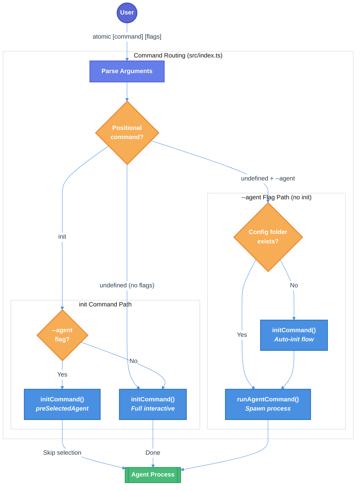

# CLI Auto-Initialize Agent Config Technical Design Document

| Document Metadata      | Details         |
| ---------------------- | --------------- |
| Author(s)              | lavaman131      |
| Status                 | Draft (WIP)     |
| Team / Owner           | flora131/atomic |
| Created / Last Updated | 2026-01-19      |

## 1. Executive Summary

This spec defines the implementation of auto-initialization behavior for the `atomic --agent` (or `-a`) command. Currently, `atomic --agent [name]` immediately attempts to spawn the agent process, failing if the config folder doesn't exist. The proposed solution adds conditional initialization: if the agent's config folder is missing, the CLI will automatically run the init flow before spawning the agent. Additionally, `atomic init --agent [name]` will provide a streamlined setup that skips the agent selection prompt.

**Note:** Throughout this document, `--agent` and `-a` are interchangeable. The short form `-a` is an alias for `--agent` and works identically in all contexts.

**Research Reference:** [research/docs/2026-01-19-cli-auto-init-agent.md](../research/docs/2026-01-19-cli-auto-init-agent.md)

## 2. Context and Motivation

### 2.1 Current State

The Atomic CLI currently supports two main flows:

| Command                            | Behavior                                                 |
| ---------------------------------- | -------------------------------------------------------- |
| `atomic` / `atomic init`           | Full interactive setup with agent selection              |
| `atomic --agent [name]` / `-a`     | Directly spawns agent process (requires config to exist) |

**Current Architecture** ([specs/atomic-cli-implementation.md](./atomic-cli-implementation.md)):

- Entry point at `src/index.ts:54-106` parses arguments and routes commands
- `src/commands/init.ts:50-181` handles interactive setup
- `src/commands/run-agent.ts:24-57` handles agent spawning

**Limitations:**

- `atomic --agent claude-code` fails if `.claude/` doesn't exist (no auto-setup)
- No way to skip the agent selection prompt when you know which agent you want
- Current routing checks `--agent` flag before positional commands, preventing `atomic init --agent` from working as expected

### 2.2 The Problem

- **User Impact:** New users running `atomic --agent claude-code` see confusing errors when config doesn't exist
- **Developer Experience:** No streamlined way to initialize a specific agent without going through the selection prompt
- **Workflow Friction:** Users must run `atomic init` first, select agent, then run `atomic --agent` - two separate commands

## 3. Goals and Non-Goals

### 3.1 Functional Goals

- [ ] `atomic --agent [name]` / `atomic -a [name]` auto-runs init if agent's config folder doesn't exist
- [ ] `atomic init --agent [name]` / `atomic init -a [name]` skips selection prompt
- [ ] Maintain backward compatibility with existing `atomic` and `atomic init` behavior
- [ ] Update help text to document new behaviors (showing both `--agent` and `-a` forms)

### 3.2 Non-Goals (Out of Scope)

- [ ] We will NOT check if config folder has all required files (folder existence only)
- [ ] We will NOT add config merging or updating (still overwrite-only)
- [ ] We will NOT change the agent spawning behavior after successful init

## 4. Proposed Solution (High-Level Design)

### 4.1 System Architecture Diagram



### 4.2 Architectural Pattern

**Strategy Pattern with Conditional Execution**: The CLI routes to different initialization strategies based on:

1. Whether `init` subcommand is present
2. Whether `--agent` flag is provided
3. Whether config folder exists

**Research Reference:** Section "Proposed Data Flow" in [research/docs/2026-01-19-cli-auto-init-agent.md](../research/docs/2026-01-19-cli-auto-init-agent.md)

### 4.3 Key Components

| Component                   | Responsibility               | Change Required                                                                                        |
| --------------------------- | ---------------------------- | ------------------------------------------------------------------------------------------------------ |
| `src/index.ts`              | Entry point, command routing | Reorder routing to check positional commands first; pass `--agent` to init when `init` subcommand used |
| `src/commands/init.ts`      | Interactive setup flow       | Add `preSelectedAgent` option to skip selection prompt                                                 |
| `src/commands/run-agent.ts` | Agent spawning               | Add config folder check; call init if missing                                                          |

## 5. Detailed Design

### 5.1 Command Interface Changes

**Updated Command Structure:**

```
atomic                          # Same as `atomic init` (unchanged)
atomic init                     # Full interactive setup (unchanged)
atomic init --agent <name>      # Streamlined init - skips selection prompt (NEW)
atomic init -a <name>           # Short form of above (NEW)
atomic --agent <name>           # Conditional: init if needed, then spawn (CHANGED)
atomic -a <name>                # Short form of above (CHANGED)
atomic --version, -v            # Show version (unchanged)
atomic --help, -h               # Show help (unchanged)
```

**Behavior Matrix:**

| Command                                        | Config Exists | Behavior                                          |
| ---------------------------------------------- | ------------- | ------------------------------------------------- |
| `atomic init`                                  | N/A           | Full interactive setup (always runs)              |
| `atomic init --agent claude-code` / `init -a`  | N/A           | Streamlined setup - skip selection, run full init |
| `atomic --agent claude-code` / `-a`            | No            | Auto-init with pre-selected agent, then spawn     |
| `atomic --agent claude-code` / `-a`            | Yes           | Spawn agent directly                              |

### 5.2 Interface Changes

**`InitOptions` Extension** (`src/commands/init.ts:24-26`):

```typescript
interface InitOptions {
  showBanner?: boolean;
  preSelectedAgent?: AgentKey; // NEW: Skip selection if provided
}
```

### 5.3 Routing Logic Changes

**Current routing order** (`src/index.ts:68-101`):

1. `--version`
2. `--help`
3. `--agent` ← processes before positional commands
4. Positional commands

**Proposed routing order:**

1. `--version`
2. `--help`
3. Positional commands ← check first, pass `--agent` to init if present
4. `--agent` (only when no positional command)

**Implementation** (`src/index.ts`):

```typescript
// After --version and --help handling...

// Handle positional commands FIRST
const command = positionals[0];

switch (command) {
  case undefined:
    // No positional command
    if (typeof values.agent === "string") {
      // atomic --agent [name] → run with conditional init
      const exitCode = await runAgentCommand(values.agent);
      process.exit(exitCode);
    }
    // atomic → full interactive init (unchanged behavior)
    await initCommand({ showBanner: !values["no-banner"] });
    break;

  case "init":
    // atomic init [--agent name] → init with optional pre-selection
    await initCommand({
      showBanner: !values["no-banner"],
      preSelectedAgent: values.agent as AgentKey | undefined,
    });
    break;

  default:
    console.error(`Unknown command: ${command}`);
    process.exit(1);
}
```

### 5.4 Init Command Modification

**Selection Logic** (`src/commands/init.ts:65-81`):

```typescript
let agentKey: AgentKey;

if (options.preSelectedAgent) {
  // Pre-selected agent - skip selection prompt
  if (!isValidAgent(options.preSelectedAgent)) {
    cancel(`Unknown agent: ${options.preSelectedAgent}`);
    process.exit(1);
  }
  agentKey = options.preSelectedAgent;
  log.info(`Configuring ${AGENT_CONFIG[agentKey].name}...`);
} else {
  // Interactive selection (existing code)
  const agentKeys = getAgentKeys();
  const agentOptions = agentKeys.map((key) => ({
    value: key,
    label: AGENT_CONFIG[key].name,
    hint: AGENT_CONFIG[key].install_url.replace("https://", ""),
  }));

  const selectedAgent = await select({
    message: "Select a coding agent to configure:",
    options: agentOptions,
  });

  if (isCancel(selectedAgent)) {
    cancel("Operation cancelled.");
    process.exit(0);
  }

  agentKey = selectedAgent as AgentKey;
}
```

### 5.5 Run Agent Command Modification

**Config Detection** (`src/commands/run-agent.ts`):

```typescript
import { join } from "path";
import { pathExists } from "../utils/copy";
import { initCommand } from "./init";

export async function runAgentCommand(agentKey: string): Promise<number> {
  // Validate agent key (existing code)
  if (!isValidAgent(agentKey)) {
    const safeKey = sanitizeForDisplay(agentKey);
    console.error(`Unknown agent: ${safeKey}`);
    console.error(`Available agents: ${getAgentKeys().join(", ")}`);
    return 1;
  }

  const agent = AGENT_CONFIG[agentKey as AgentKey];

  // NEW: Check if config folder exists
  const configFolder = join(process.cwd(), agent.folder);
  if (!(await pathExists(configFolder))) {
    // Config not found - run init with pre-selected agent
    log.info(`${agent.folder} not found. Running setup...`);
    await initCommand({
      preSelectedAgent: agentKey as AgentKey,
      showBanner: false, // Skip banner for cleaner auto-init experience
    });
  }

  // Check if command is installed (existing code)
  if (!isCommandInstalled(agent.cmd)) {
    console.error(`${agent.name} is not installed.`);
    console.error(`Install at: ${agent.install_url}`);
    return 1;
  }

  // Spawn agent process (existing code)
  const cmd = [agent.cmd, ...agent.additional_flags];
  const proc = Bun.spawn(cmd, {
    stdin: "inherit",
    stdout: "inherit",
    stderr: "inherit",
    cwd: process.cwd(),
  });

  const exitCode = await proc.exited;
  return exitCode;
}
```

### 5.6 Help Text Update

**Updated help output** (`src/index.ts`):

```typescript
if (values.help) {
  showHelp();
  return;
}

// In showHelp() function or inline:
console.log(`
atomic - AI coding agent configuration installer

Usage:
  atomic                        Interactive setup (same as 'atomic init')
  atomic init                   Interactive setup with agent selection
  atomic init --agent <name>    Setup specific agent (skip selection)
  atomic --agent <name>         Run agent (auto-setup if needed)
  atomic --version              Show version
  atomic --help                 Show this help

Options:
  -a, --agent <name>    Agent name: claude-code, opencode, copilot-cli
  -v, --version         Show version number
  -h, --help            Show this help
  --no-banner           Skip ASCII banner display

Examples:
  atomic                        # Start interactive setup
  atomic init -a claude-code    # Setup Claude Code directly (short form)
  atomic init --agent opencode  # Setup OpenCode directly (long form)
  atomic -a claude-code         # Run Claude Code (setup if needed, short form)
  atomic --agent claude-code    # Run Claude Code (setup if needed, long form)
`);
```

## 6. Alternatives Considered

| Option                                    | Pros                         | Cons                             | Reason for Rejection                             |
| ----------------------------------------- | ---------------------------- | -------------------------------- | ------------------------------------------------ |
| **A: Always require `atomic init` first** | Simple, no code changes      | Poor UX, two commands needed     | User friction is the problem we're solving       |
| **B: Separate `atomic setup` command**    | Clear separation of concerns | Yet another command to remember  | Overcomplicates the CLI                          |
| **C: Auto-init with confirmation prompt** | Explicit user consent        | Breaks non-interactive workflows | `atomic --agent` should be scriptable            |
| **D: Check for all required files**       | More robust detection        | Complex logic, edge cases        | Over-engineering; folder existence is sufficient |

## 7. Cross-Cutting Concerns

### 7.1 Security and Privacy

- **Input validation**: Agent name validated via `isValidAgent()` type guard
- **Input sanitization**: `sanitizeForDisplay()` removes ANSI escapes and control chars
- **No network requests**: All operations remain local
- **File permissions**: Respects existing permissions when copying

### 7.2 Observability Strategy

- **Info logging**: `log.info()` messages when auto-init triggers
- **Error messages**: Clear messages when agent validation fails
- **Spinner feedback**: Existing spinner from init command provides progress

### 7.3 Error Handling

| Scenario                | Current Behavior    | Proposed Behavior                   |
| ----------------------- | ------------------- | ----------------------------------- |
| Invalid agent name      | Error + exit 1      | Same (no change)                    |
| Config folder missing   | Error + exit 1      | Auto-run init, then continue        |
| Init cancelled by user  | Exit 0              | Exit 0 (abort agent spawn)          |
| Init fails (file error) | Exit with error     | Exit with error (abort agent spawn) |
| Agent not installed     | Error + install URL | Same (no change)                    |

## 8. Migration, Rollout, and Testing

### 8.1 Deployment Strategy

This is a backward-compatible enhancement. Existing commands continue to work:

- `atomic` / `atomic init` → unchanged
- `atomic --agent <name>` → enhanced with auto-init

### 8.2 Test Plan

#### Unit Tests

```typescript
// tests/init.test.ts
import { test, expect, mock } from "bun:test";

test("initCommand uses preSelectedAgent when provided", async () => {
  // Mock @clack/prompts to verify select() is NOT called
  const selectMock = mock(() => {});

  await initCommand({
    preSelectedAgent: "claude-code",
    showBanner: false,
  });

  expect(selectMock).not.toHaveBeenCalled();
});

test("initCommand rejects invalid preSelectedAgent", async () => {
  await expect(
    initCommand({
      preSelectedAgent: "invalid-agent" as AgentKey,
      showBanner: false,
    }),
  ).rejects.toThrow();
});
```

```typescript
// tests/run-agent.test.ts
import { test, expect, mock } from "bun:test";
import { runAgentCommand } from "../src/commands/run-agent";
import * as copyUtils from "../src/utils/copy";

test("runAgentCommand calls initCommand when config folder missing", async () => {
  // Mock pathExists to return false
  mock.module("../src/utils/copy", () => ({
    pathExists: () => Promise.resolve(false),
  }));

  const initMock = mock(() => Promise.resolve());
  mock.module("../src/commands/init", () => ({
    initCommand: initMock,
  }));

  await runAgentCommand("claude-code");

  expect(initMock).toHaveBeenCalledWith({
    preSelectedAgent: "claude-code",
    showBanner: false,
  });
});

test("runAgentCommand skips init when config folder exists", async () => {
  mock.module("../src/utils/copy", () => ({
    pathExists: () => Promise.resolve(true),
  }));

  const initMock = mock(() => Promise.resolve());
  mock.module("../src/commands/init", () => ({
    initCommand: initMock,
  }));

  await runAgentCommand("claude-code");

  expect(initMock).not.toHaveBeenCalled();
});
```

#### Integration Tests

```typescript
// tests/routing.test.ts
import { test, expect } from "bun:test";
import { parseArgs } from "util";

test("parses 'init --agent claude-code' correctly", () => {
  const { values, positionals } = parseArgs({
    args: ["init", "--agent", "claude-code"],
    options: {
      agent: { type: "string", short: "a" },
    },
    strict: false,
    allowPositionals: true,
  });

  expect(positionals[0]).toBe("init");
  expect(values.agent).toBe("claude-code");
});

test("parses 'init -a claude-code' correctly (short form)", () => {
  const { values, positionals } = parseArgs({
    args: ["init", "-a", "claude-code"],
    options: {
      agent: { type: "string", short: "a" },
    },
    strict: false,
    allowPositionals: true,
  });

  expect(positionals[0]).toBe("init");
  expect(values.agent).toBe("claude-code");
});

test("parses '--agent claude-code' without init", () => {
  const { values, positionals } = parseArgs({
    args: ["--agent", "claude-code"],
    options: {
      agent: { type: "string", short: "a" },
    },
    strict: false,
    allowPositionals: true,
  });

  expect(positionals[0]).toBeUndefined();
  expect(values.agent).toBe("claude-code");
});

test("parses '-a claude-code' without init (short form)", () => {
  const { values, positionals } = parseArgs({
    args: ["-a", "claude-code"],
    options: {
      agent: { type: "string", short: "a" },
    },
    strict: false,
    allowPositionals: true,
  });

  expect(positionals[0]).toBeUndefined();
  expect(values.agent).toBe("claude-code");
});
```

#### End-to-End Tests (Manual)

- [ ] `atomic init --agent claude-code` skips selection, runs full init
- [ ] `atomic init -a opencode` (short `-a` flag) works correctly
- [ ] `atomic --agent claude-code` in empty dir triggers auto-init
- [ ] `atomic -a claude-code` in empty dir triggers auto-init (short form)
- [ ] `atomic --agent claude-code` with existing `.claude/` spawns directly
- [ ] `atomic -a claude-code` with existing `.claude/` spawns directly (short form)
- [ ] `atomic --agent invalid` shows error with available agents
- [ ] `atomic -a invalid` shows error with available agents (short form)
- [ ] Cancelling auto-init (Ctrl+C) aborts agent spawn
- [ ] `atomic --help` shows both `--agent` and `-a` forms in usage

## 9. Open Questions / Unresolved Issues

- [ ] **Banner for `atomic init --agent`**: Should the banner be shown when running `atomic init --agent [name]`? Current proposal: Yes (it's an explicit init command).

- [ ] **Incomplete config detection**: What if the folder exists but is missing files? Current proposal: Don't check - folder existence is sufficient. Users can delete and re-run if needed.

- [ ] **Error recovery**: If init fails during auto-init (via `atomic --agent`), should we retry or abort? Current proposal: Abort with error - user should investigate.

## 10. Implementation File Changes

| File                        | Change Type | Description                                                                  |
| --------------------------- | ----------- | ---------------------------------------------------------------------------- |
| `src/index.ts`              | Modify      | Reorder routing logic, pass `--agent` to init when `init` subcommand present |
| `src/commands/init.ts`      | Modify      | Add `preSelectedAgent` to `InitOptions`, conditional selection logic         |
| `src/commands/run-agent.ts` | Modify      | Add config folder check, call init if missing                                |
| `tests/init.test.ts`        | Add         | Unit tests for preSelectedAgent behavior                                     |
| `tests/run-agent.test.ts`   | Modify      | Tests for auto-init behavior                                                 |
| `tests/routing.test.ts`     | Add         | Tests for argument parsing with init subcommand                              |

## 11. Code References

- `src/index.ts:54-106` - Entry point and command routing
- `src/index.ts:80-84` - Current `--agent` handling (needs reordering)
- `src/commands/init.ts:24-26` - `InitOptions` interface (needs extension)
- `src/commands/init.ts:65-81` - Agent selection prompt (needs conditional skip)
- `src/commands/run-agent.ts:24-57` - `runAgentCommand()` (needs config check)
- `src/config.ts:25-60` - `AGENT_CONFIG` with folder definitions
- `src/utils/copy.ts:169-176` - `pathExists()` utility
