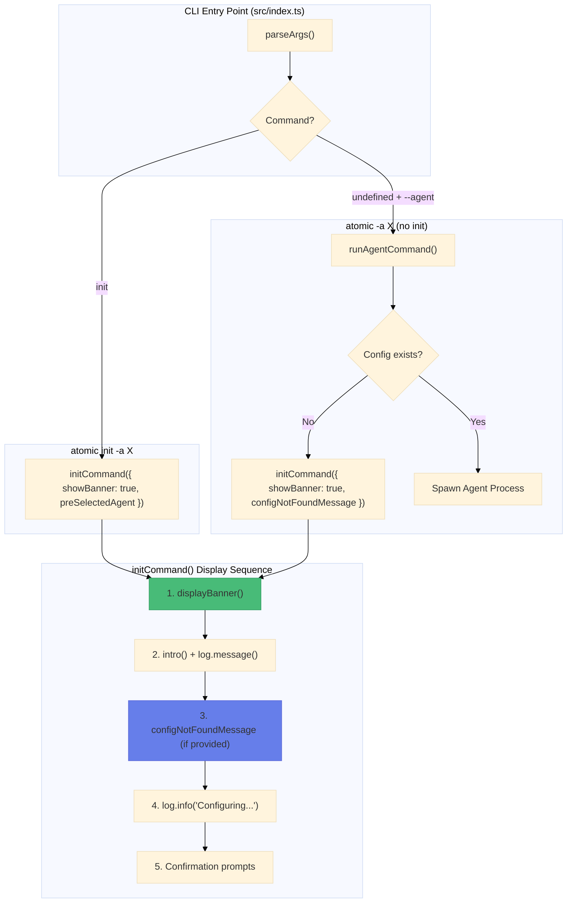

# CLI Banner Ordering Fix - Technical Design Document

| Document Metadata      | Details                                      |
| ---------------------- | -------------------------------------------- |
| Author(s)              | lavaman131                                   |
| Status                 | Draft (WIP)                                  |
| Team / Owner           | Atomic CLI                                   |
| Created / Last Updated | 2026-01-19                                   |
| Related Research       | `research/2026-01-19-cli-ordering-fix.md`    |

## 1. Executive Summary

This spec proposes fixing the display ordering issue when running `atomic init -a [agent_name]` or `atomic -a [agent_name]` for uninitialized agents. Currently, the ".claude not found. Running setup..." message appears before the banner and intro text. The fix ensures proper visual hierarchy: banner first, intro text second, then informational messages. This improves the user experience by presenting branding consistently before operational status messages.

## 2. Context and Motivation

### 2.1 Current State

**Architecture:** The CLI has two entry paths for agent initialization (see `research/2026-01-19-cli-ordering-fix.md`):

1. `atomic init -a [agent_name]` - Direct init with pre-selected agent
2. `atomic -a [agent_name]` - Run agent with conditional init if config missing

**Current Display Flow for `atomic -a [agent_name]` (uninitialized):**

```
1. runAgentCommand() logs ".claude not found. Running setup..."
2. initCommand() called with showBanner: false
3. intro() displays "Atomic: Automated Procedures..."
4. log.message() displays description
5. log.info() displays "Configuring Claude Code..."
```

**Limitations:**

- `log.info()` in `runAgentCommand()` executes BEFORE `initCommand()` is called (`src/commands/run-agent.ts:45`)
- `showBanner: false` is passed to `initCommand()`, preventing banner display entirely (`src/commands/run-agent.ts:48`)
- The visual hierarchy is broken - status messages appear before branding

### 2.2 The Problem

**User Impact:**

- Users see operational messages before understanding what tool they're using
- The ASCII banner (branding) is never shown during auto-init flow
- Inconsistent experience between `atomic init -a X` and `atomic -a X`

**Current Output:**
```
●  .claude not found. Running setup...
┌  Atomic: Automated Procedures and Memory for AI Coding Agents
│
│  Enable multi-hour autonomous coding sessions with the Ralph Wiggum
│  Method using research, plan, implement methodology.
│
●  Configuring Claude Code...
```

**Expected Output:**
```
[ASCII BANNER - if terminal >= 79x27]

┌  Atomic: Automated Procedures and Memory for AI Coding Agents
│
│  Enable multi-hour autonomous coding sessions with the Ralph Wiggum
│  Method using research, plan, implement methodology.
│
●  .claude not found. Running setup...
│
●  Configuring Claude Code...
```

## 3. Goals and Non-Goals

### 3.1 Functional Goals

- [ ] Banner and intro text appear BEFORE any operational status messages
- [ ] ".claude not found. Running setup..." message appears AFTER intro text
- [ ] Banner displays only when terminal >= 79 cols x 27 rows
- [ ] Banner does NOT display when agent is already initialized (`atomic -a X` with existing config)
- [ ] Consistent display behavior between `atomic init -a X` and `atomic -a X` (for uninitialized agents)

### 3.2 Non-Goals (Out of Scope)

- [ ] We will NOT change the banner display logic (terminal size checks, color support)
- [ ] We will NOT modify the ASCII banner content or styling
- [ ] We will NOT change the message wording (keep ".claude not found. Running setup...")
- [ ] We will NOT add visual separators or change log types

## 4. Proposed Solution (High-Level Design)

### 4.1 System Architecture Diagram



### 4.2 Architectural Pattern

We are adopting **Option B** from the research: Add a `configNotFoundMessage` parameter to `initCommand()` to display after intro text. This centralizes all display logic in `initCommand()` and removes display calls from `runAgentCommand()`.

Reference: `research/2026-01-19-cli-ordering-fix.md`, Implementation Approach section.

### 4.3 Key Components

| Component                    | Responsibility                            | File                         | Change Required                                           |
| ---------------------------- | ----------------------------------------- | ---------------------------- | --------------------------------------------------------- |
| `runAgentCommand()`          | Runs agent with conditional init          | `src/commands/run-agent.ts`  | Remove `log.info()`, pass `showBanner: true` and message  |
| `initCommand()`              | Interactive setup with banner/intro       | `src/commands/init.ts`       | Add `configNotFoundMessage` option, display after intro   |
| `InitOptions` interface      | Options for init command                  | `src/commands/init.ts`       | Add `configNotFoundMessage?: string`                      |
| `displayBanner()`            | ASCII banner with terminal size check     | `src/utils/banner/banner.ts` | No changes needed                                         |

## 5. Detailed Design

### 5.1 API Interfaces

**Updated `InitOptions` Interface:**

Location: `src/commands/init.ts:24-27`

```typescript
interface InitOptions {
  showBanner?: boolean;
  preSelectedAgent?: AgentKey;
  configNotFoundMessage?: string;  // NEW: Message to show after intro (e.g., ".claude not found")
}
```

### 5.2 Code Changes

#### 5.2.1 Modify `runAgentCommand()`

Location: `src/commands/run-agent.ts:42-50`

**Current Code:**
```typescript
const configFolder = join(process.cwd(), agent.folder);
if (!(await pathExists(configFolder))) {
  // Config not found - run init with pre-selected agent
  log.info(`${agent.folder} not found. Running setup...`);
  await initCommand({
    preSelectedAgent: agentKey as AgentKey,
    showBanner: false, // Skip banner for cleaner auto-init experience
  });
}
```

**Proposed Code:**
```typescript
const configFolder = join(process.cwd(), agent.folder);
if (!(await pathExists(configFolder))) {
  // Config not found - run init with pre-selected agent
  // Banner and intro will display first, then this message
  await initCommand({
    preSelectedAgent: agentKey as AgentKey,
    showBanner: true,  // Changed: Show banner during auto-init
    configNotFoundMessage: `${agent.folder} not found. Running setup...`,  // NEW: Pass message to display after intro
  });
}
```

**Changes:**
1. Remove `log.info()` call (line 45)
2. Change `showBanner: false` to `showBanner: true` (line 48)
3. Add `configNotFoundMessage` parameter (new line)

#### 5.2.2 Modify `initCommand()`

Location: `src/commands/init.ts:51-76`

**Current Code (relevant section):**
```typescript
export async function initCommand(options: InitOptions = {}): Promise<void> {
  const { showBanner = true } = options;

  // Display banner
  if (showBanner) {
    displayBanner();
    console.log(); // Add spacing after banner
  }

  // Show intro
  intro("Atomic: Automated Procedures and Memory for AI Coding Agents");
  log.message(
    "Enable multi-hour autonomous coding sessions with the Ralph Wiggum\nMethod using research, plan, implement methodology."
  );

  // Select agent
  let agentKey: AgentKey;

  if (options.preSelectedAgent) {
    // Pre-selected agent - validate and skip selection prompt
    if (!isValidAgent(options.preSelectedAgent)) {
      cancel(`Unknown agent: ${options.preSelectedAgent}`);
      process.exit(1);
    }
    agentKey = options.preSelectedAgent;
    log.info(`Configuring ${AGENT_CONFIG[agentKey].name}...`);
  } else {
    // Interactive selection...
  }
```

**Proposed Code:**
```typescript
export async function initCommand(options: InitOptions = {}): Promise<void> {
  const { showBanner = true, configNotFoundMessage } = options;  // NEW: Destructure new option

  // Display banner
  if (showBanner) {
    displayBanner();
    console.log(); // Add spacing after banner
  }

  // Show intro
  intro("Atomic: Automated Procedures and Memory for AI Coding Agents");
  log.message(
    "Enable multi-hour autonomous coding sessions with the Ralph Wiggum\nMethod using research, plan, implement methodology."
  );

  // NEW: Show config not found message if provided (after intro, before agent selection)
  if (configNotFoundMessage) {
    log.info(configNotFoundMessage);
  }

  // Select agent
  let agentKey: AgentKey;

  if (options.preSelectedAgent) {
    // Pre-selected agent - validate and skip selection prompt
    if (!isValidAgent(options.preSelectedAgent)) {
      cancel(`Unknown agent: ${options.preSelectedAgent}`);
      process.exit(1);
    }
    agentKey = options.preSelectedAgent;
    log.info(`Configuring ${AGENT_CONFIG[agentKey].name}...`);
  } else {
    // Interactive selection...
  }
```

**Changes:**
1. Destructure `configNotFoundMessage` from options (line 52)
2. Add conditional display of `configNotFoundMessage` after intro/description (new lines after line 64)

### 5.3 Display Sequence After Fix

**For `atomic -a claude-code` (uninitialized):**

```
[ASCII BANNER]                                    ← displayBanner() if terminal >= 79x27

┌  Atomic: Automated Procedures and Memory...     ← intro()
│
│  Enable multi-hour autonomous coding...         ← log.message()
│
●  .claude not found. Running setup...            ← log.info(configNotFoundMessage) [NEW POSITION]
│
●  Configuring Claude Code...                     ← log.info("Configuring...")
│
◆  Install Claude Code config files to...?        ← confirm()
```

**For `atomic init -a claude-code`:**

```
[ASCII BANNER]                                    ← displayBanner()

┌  Atomic: Automated Procedures and Memory...     ← intro()
│
│  Enable multi-hour autonomous coding...         ← log.message()
│
●  Configuring Claude Code...                     ← log.info("Configuring...")
│
◆  Install Claude Code config files to...?        ← confirm()
```

Note: No "not found" message because `atomic init` always runs init regardless of existing config.

**For `atomic -a claude-code` (already initialized):**

```
[No banner, no intro - directly spawns agent]
```

## 6. Alternatives Considered

| Option | Pros | Cons | Reason for Rejection |
|--------|------|------|---------------------|
| **Option A:** Move display logic into `runAgentCommand()` | Direct fix, minimal changes | Duplicates display logic from `initCommand()` (banner, intro, message) | Violates DRY principle, harder to maintain |
| **Option B:** Add `configNotFoundMessage` to `initCommand()` (Selected) | Centralized display logic, clean interface | Slightly more complex interface | **Selected:** Best separation of concerns |
| **Option C:** Have `initCommand()` re-check `pathExists` internally | Proper display order, centralized logic | Duplicates the `pathExists` check already done in `runAgentCommand()` | Unnecessary duplication of filesystem check |

Reference: `research/2026-01-19-cli-ordering-fix.md`, Implementation Approach section.

## 7. Cross-Cutting Concerns

### 7.1 Observability Strategy

- No new metrics or logging required
- Existing @clack/prompts logging functions (`log.info()`, `log.message()`) are sufficient
- Display ordering can be verified visually during testing

### 7.2 Backwards Compatibility

- `configNotFoundMessage` is optional - existing callers are unaffected
- `showBanner` default remains `true` - no behavioral change for direct `initCommand()` calls
- `atomic init -a X` behavior unchanged (banner + intro + configuring message)

### 7.3 Terminal Compatibility

Banner display respects existing terminal size checks (`src/utils/banner/constants.ts:46-50`):
- Minimum 79 columns
- Minimum 27 rows
- Falls back gracefully (no banner if too small)

## 8. Migration, Rollout, and Testing

### 8.1 Deployment Strategy

- Single atomic change (no phased rollout needed)
- No feature flags required
- Changes are backwards compatible

### 8.2 Test Plan

**Unit Tests (recommended additions to `tests/init.test.ts`):**

1. **Test `initCommand` with `configNotFoundMessage`:**
   - Verify message is displayed after intro
   - Verify message is NOT displayed when not provided

2. **Test display ordering:**
   - Mock console output
   - Verify banner appears before intro
   - Verify `configNotFoundMessage` appears after intro and before "Configuring..."

**Integration Tests:**

1. **Test `atomic -a claude-code` with no `.claude` folder:**
   - Verify banner displays (mock terminal size >= 79x27)
   - Verify intro displays
   - Verify ".claude not found. Running setup..." displays after intro
   - Verify "Configuring Claude Code..." displays after

2. **Test `atomic -a claude-code` with existing `.claude` folder:**
   - Verify NO banner displays
   - Verify NO intro displays
   - Verify agent spawns directly

**Manual Tests:**

1. Run `atomic -a claude-code` in empty directory (no `.claude`)
   - Expected: Banner, intro, "not found" message, prompts
2. Run `atomic init -a claude-code` in empty directory
   - Expected: Banner, intro, "Configuring..." message, prompts (no "not found" message)
3. Run `atomic -a claude-code` in directory with existing `.claude`
   - Expected: Agent spawns directly (no banner, no intro)

### 8.3 Decision Matrix for Banner Display

Reference: `research/2026-01-19-cli-ordering-fix.md`, Architecture Documentation section.

| Command            | Agent Status        | Terminal Size | Show Banner | Show Intro | Show "Not Found" |
| ------------------ | ------------------- | ------------- | ----------- | ---------- | ---------------- |
| `atomic init -a X` | Not initialized     | >= 79x27      | Yes         | Yes        | No               |
| `atomic init -a X` | Not initialized     | < 79x27       | No          | Yes        | No               |
| `atomic init -a X` | Already initialized | >= 79x27      | Yes         | Yes        | No               |
| `atomic init -a X` | Already initialized | < 79x27       | No          | Yes        | No               |
| `atomic -a X`      | Not initialized     | >= 79x27      | Yes         | Yes        | Yes              |
| `atomic -a X`      | Not initialized     | < 79x27       | No          | Yes        | Yes              |
| `atomic -a X`      | Already initialized | Any           | No          | No         | No               |

## 9. Open Questions / Unresolved Issues

Based on open questions from `research/2026-01-19-cli-ordering-fix.md`:

- [x] **Should `atomic init -a [agent_name]` show ".claude not found" when already initialized?**
  - Decision: No. The "not found" message is only for auto-init flow (`atomic -a X`). When user explicitly runs `atomic init`, they're intentionally running setup regardless of existing config.

- [x] **Message wording consistency:**
  - Decision: Keep current wording ".claude not found. Running setup..." - it's clear and concise.

- [x] **Should there be a visual separator between intro and "not found" message?**
  - Decision: No separator needed. The @clack/prompts `log.info()` format provides sufficient visual distinction with the bullet point prefix (●).

## 10. Implementation Summary

| File                         | Line(s) | Change Description                                                |
| ---------------------------- | ------- | ----------------------------------------------------------------- |
| `src/commands/init.ts`       | 24-27   | Add `configNotFoundMessage?: string` to `InitOptions` interface   |
| `src/commands/init.ts`       | 52      | Destructure `configNotFoundMessage` from options                  |
| `src/commands/init.ts`       | ~65     | Add conditional `log.info(configNotFoundMessage)` after intro     |
| `src/commands/run-agent.ts`  | 45      | Remove `log.info()` call                                          |
| `src/commands/run-agent.ts`  | 48      | Change `showBanner: false` to `showBanner: true`                  |
| `src/commands/run-agent.ts`  | ~49     | Add `configNotFoundMessage` parameter to `initCommand()` call     |

**Estimated Scope:** ~15 lines changed across 2 files.
