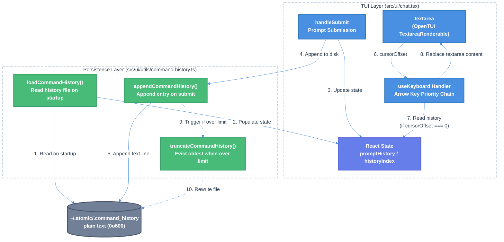

# Command History Persistence for Chat TUI

| Document Metadata      | Details     |
| ---------------------- | ----------- |
| Author(s)              | Developer   |
| Status                 | Draft (WIP) |
| Team / Owner           | Atomic CLI  |
| Created / Last Updated | 2026-02-17  |

## 1. Executive Summary

This RFC proposes adding cross-session command history persistence to the Atomic TUI chat interface. Currently, the prompt history system in `src/ui/chat.tsx` is in-memory only — all history is lost when the process exits. The proposed solution introduces a new `src/ui/utils/command-history.ts` module that persists submitted prompts to `~/.atomic/.command_history` using a plain text format with backslash continuation for multi-line entries (modeled after `~/.zsh_history`). Additionally, the up/down arrow history navigation will be gated on `cursorOffset === 0`, so that arrow keys navigate multi-line text when the cursor is mid-content and only recall history entries when the cursor is at position 0. There is no explicit "history mode" — `cursorOffset === 0` is the sole signal that determines whether an arrow key press navigates history or navigates within the text.

**Research Reference:** `research/docs/2026-02-17-command-history-persistence-tui.md`

## 2. Context and Motivation

### 2.1 Current State

**Architecture:** The Atomic TUI (`src/ui/chat.tsx`) uses an in-memory `promptHistory` state (`string[]`) with a `historyIndex` pointer and a `savedInputRef` to preserve the user's current draft when navigating history. This system was built as part of the autocomplete feature (see `specs/tui-command-autocomplete-system.md`), which explicitly listed cross-session persistence as a **non-goal** (line 69).

**Current In-Memory History System** (`src/ui/chat.tsx:1719-1723`):

```typescript
const [promptHistory, setPromptHistory] = useState<string[]>([]);
const [historyIndex, setHistoryIndex] = useState(-1);
const savedInputRef = useRef<string>("");
```

Prompts are appended on submit with consecutive-duplicate deduplication (`src/ui/chat.tsx:4886-4890`). Up/down arrow keys navigate history when certain conditions are met (no autocomplete, no queue editing, no streaming), but the cursor position within the textarea is **not** checked — pressing up anywhere in the text triggers history navigation.

**Existing Persistence Patterns:** The codebase already uses `~/.atomic/` for global persistence (`settings.json`, `tools/`, `workflows/sessions/`) and has file persistence utilities in `src/ui/utils/conversation-history-buffer.ts` that demonstrate the project's approach to file I/O.

**Reference:** `research/docs/2026-02-17-command-history-persistence-tui.md`, Sections 1-5

### 2.2 The Problem

- **User Impact:** Users lose their prompt history every time they exit the TUI. Frequently-used prompts must be retyped from scratch each session. This is a friction point for power users who rely on history recall (as in shell environments like zsh/bash).
- **UX Issue:** Up/down arrows trigger history navigation regardless of cursor position, which conflicts with multi-line text editing. Users cannot use arrow keys to navigate within multi-line prompts without accidentally triggering history recall.
- **Precedent:** Both `~/.zsh_history` and Copilot CLI's `command-history-state.json` persist command history across sessions. Users expect this behavior from a terminal-based tool.

**Reference:** `research/docs/2026-02-17-command-history-persistence-tui.md`, Section 7 (Copilot reference), Section 8 (zsh reference)

## 3. Goals and Non-Goals

### 3.1 Functional Goals

- [ ] Create a `src/ui/utils/command-history.ts` module for reading/writing persistent command history
- [ ] Persist submitted prompts to `~/.atomic/.command_history` in plain text with backslash continuation
- [ ] Load persisted history into `promptHistory` state on TUI startup
- [ ] Append new prompts to the history file on each submit
- [ ] Enforce a configurable maximum history size (default: 1000 entries) with oldest-first eviction
- [ ] Gate up/down arrow history navigation on `cursorOffset === 0` so that arrows navigate within multi-line text at other cursor positions
- [ ] Deduplicate consecutive identical entries (maintain current behavior)
- [ ] Handle multi-line prompts using backslash continuation (trailing `\` joins with next line)
- [ ] Set file permissions to `0o600` (owner read/write only) for security
- [ ] Use best-effort (silent failure) error handling consistent with existing persistence patterns

### 3.2 Non-Goals (Out of Scope)

- [ ] We will NOT implement history search (e.g., Ctrl+R reverse incremental search)
- [ ] We will NOT add timestamps or metadata to history entries in this version
- [ ] We will NOT implement global deduplication (only consecutive dedup, matching current behavior)
- [ ] We will NOT add a `/history` slash command for browsing history
- [ ] We will NOT implement per-project history (single global file only)
- [ ] We will NOT differentiate between slash commands and regular prompts — all submitted input is persisted

## 4. Proposed Solution (High-Level Design)

### 4.1 System Architecture Diagram



### 4.2 Architectural Pattern

The persistence layer follows the **append-only log** pattern (similar to `~/.zsh_history`):

- **Writes:** Append a single text line (or continuation block) per submitted prompt (O(1) write)
- **Reads:** Full file read on startup only (O(n) once)
- **Truncation:** Periodic rewrite when entry count exceeds the configured limit

This pattern avoids the overhead of rewriting the entire file on every submit while keeping startup cost minimal for typical history sizes (< 1000 entries).

**Reference:** `research/docs/2026-02-17-command-history-persistence-tui.md`, Section 6

### 4.3 Key Components

| Component               | Responsibility                                  | Location                          | Justification                                                    |
| ----------------------- | ----------------------------------------------- | --------------------------------- | ---------------------------------------------------------------- |
| `command-history.ts`    | Persistent history I/O (load, append, truncate) | `src/ui/utils/command-history.ts` | Follows existing util pattern in `src/ui/utils/` |
| `chat.tsx` (startup)    | Load persisted history into React state         | `src/ui/chat.tsx` (useEffect)     | State initialization on mount                                    |
| `chat.tsx` (submit)     | Append to disk on prompt submission             | `src/ui/chat.tsx` (handleSubmit)  | Write-through on each submit                                     |
| `chat.tsx` (arrow keys) | Add `cursorOffset === 0` gate                   | `src/ui/chat.tsx` (useKeyboard)   | Conditional history vs. text navigation                          |

## 5. Detailed Design

### 5.1 File Format: `~/.atomic/.command_history`

**Format:** Plain text with backslash continuation for multi-line entries, modeled after `~/.zsh_history`.

Each entry is one logical line. Single-line prompts occupy one line. Multi-line prompts use a trailing backslash (`\`) to indicate continuation on the next line:

```
explain the authentication flow
refactor the user service to use dependency injection
fix the bug in the payment handler\
and add proper error handling
```

**Parsing rules:**

- Read the file line by line
- If a line ends with `\`, strip the backslash, append a `\n`, and join with the next line
- Otherwise, the line is a complete entry
- Literal backslashes at end of input are escaped as `\\` on write (so a prompt ending in `\` becomes `\\` in the file, which does NOT trigger continuation)

**Writing rules:**

- For single-line prompts: write the string followed by `\n`
- For multi-line prompts: replace each internal `\n` with `\\\n` (backslash + newline) so that continuation lines are joined on read
- Escape any trailing `\` in the original prompt as `\\` to avoid false continuation

**Rationale for plain text over NDJSON:**

- Human-readable with `cat` / `head` / `tail` — no JSON encoding
- Familiar convention from `~/.zsh_history`
- Append-only writes without reading/rewriting the full file
- Simpler implementation — no `JSON.stringify` / `JSON.parse` needed

**File properties:**

- **Path:** `~/.atomic/.command_history` (leading dot for hidden file convention)
- **Permissions:** `0o600` (owner read/write only)
- **Encoding:** UTF-8
- **Max entries:** 1000 (hardcoded)

**Reference:** `research/docs/2026-02-17-command-history-persistence-tui.md`, Sections 6-8

### 5.2 Module: `src/ui/utils/command-history.ts`

```typescript
// Public API

/** Load all command history entries from disk. Returns string[] (oldest first). */
export function loadCommandHistory(): string[];

/** Append a single command to the history file. Skips if empty. */
export function appendCommandHistory(command: string): void;

/** Get the history file path: ~/.atomic/.command_history */
export function getCommandHistoryPath(): string;

/** Clear the history file (for testing). */
export function clearCommandHistory(): void;
```

**Implementation details:**

1. **`getCommandHistoryPath()`**: Uses `homedir()` from `node:os` (consistent with `settings.ts:57`), returns `join(home, ".atomic", ".command_history")`. Respects `ATOMIC_SETTINGS_HOME` env var for testability.

2. **`loadCommandHistory()`**:
    - Read file with `readFileSync` (sync is acceptable — startup-only, < 1000 lines)
    - Parse lines with backslash continuation: lines ending in `\` (but not `\\`) are joined with the next line via `\n`
    - Unescape trailing `\\` back to `\`
    - Filter empty entries
    - Return `string[]` (oldest first)
    - On error (missing file): return `[]` silently
    - If entry count exceeds max, return only the last N entries and rewrite the file (lazy truncation)

3. **`appendCommandHistory(command)`**:
    - Skip if `command.trim()` is empty
    - Ensure `~/.atomic/` directory exists (`mkdirSync` with `recursive: true`)
    - Escape any trailing `\` in the command as `\\`
    - Replace internal `\n` with `\\\n` (backslash + newline) for continuation
    - `appendFileSync` with the encoded string + `"\n"`
    - Silent failure on write error

4. **`clearCommandHistory()`**:
    - `writeFileSync` with empty string
    - Used for testing only

**Constants:**

```typescript
const DEFAULT_MAX_HISTORY = 1000;
const FILE_MODE = 0o600;
```

### 5.3 Integration: `src/ui/chat.tsx` Changes

#### 5.3.1 Startup: Load History

Add a `useEffect` to load persisted history on mount:

```typescript
// In ChatApp component, after state declarations
useEffect(() => {
    const persisted = loadCommandHistory();
    if (persisted.length > 0) {
        setPromptHistory(persisted);
    }
}, []);
```

This runs once on mount and populates the in-memory state with entries from previous sessions.

#### 5.3.2 Submit: Append to Disk

In the `handleSubmit` function (around line 4886-4890), after updating in-memory history, append to disk:

```typescript
// After setPromptHistory(prev => { ... })
appendCommandHistory(trimmedValue);
```

All submitted input — including slash commands like `/help` or `/clear` — is persisted to history. The `appendCommandHistory` function only skips empty strings.

#### 5.3.3 Arrow Keys: Cursor Position Gate

Modify the up arrow history handler (`src/ui/chat.tsx:4340`) to check cursor position:

**Current:**

```typescript
if (event.name === "up" && !workflowState.showAutocomplete && !isEditingQueue && !isStreaming && messageQueue.count === 0 && promptHistory.length > 0) {
```

**Proposed:**

```typescript
if (
    event.name === "up" &&
    !workflowState.showAutocomplete &&
    !isEditingQueue &&
    !isStreaming &&
    messageQueue.count === 0 &&
    promptHistory.length > 0
) {
    const textarea = textareaRef.current;
    if (textarea && textarea.cursorOffset === 0) {
        // ... existing history navigation logic
    }
    // If cursorOffset !== 0, fall through to textarea's internal handling
}
```

Similarly, modify the down arrow handler (`src/ui/chat.tsx:4367`) to also require `cursorOffset === 0`:

```typescript
if (
    event.name === "down" &&
    !workflowState.showAutocomplete &&
    !isEditingQueue &&
    !isStreaming &&
    messageQueue.count === 0 &&
    historyIndex >= 0
) {
    const textarea = textareaRef.current;
    if (textarea && textarea.cursorOffset === 0) {
        // ... existing forward history navigation logic
    }
    // If cursorOffset !== 0, fall through to textarea's internal handling
    // This allows editing recalled multi-line prompts with arrow keys
}
```

**Key design principle — no explicit history mode:** There is no separate "history mode" flag or state. On every arrow key press, the system checks `cursorOffset === 0` as the sole gate. If the cursor is at position 0 and the other preconditions are met (`promptHistory.length > 0` for up, `historyIndex >= 0` for down), history navigation occurs. If the cursor is at any other position, the arrow key falls through to the textarea's internal cursor movement — regardless of the current value of `historyIndex`. This means a user can recall a multi-line prompt via up arrow (at `cursorOffset === 0`), then move the cursor into the text to edit it, and arrow keys will navigate within the text naturally. To continue cycling through history, the user moves the cursor back to position 0.

**Edge case — empty textarea:** When the textarea is empty, `cursorOffset` is 0, so pressing up will correctly recall the most recent history entry. This matches expected shell behavior (pressing up on an empty prompt recalls the last command).

**Reference:** `research/docs/2026-02-17-command-history-persistence-tui.md`, Sections 2-4, 10

### 5.4 History Index Transitions

There is no explicit "history mode." The `historyIndex` state variable (`-1` = no history entry recalled, `>= 0` = a history entry is displayed) is the only indicator, and every arrow key press independently checks `cursorOffset === 0` before acting on it.

```
                    ┌─────────────────────────┐
                    │   historyIndex = -1     │
                    │   User typing...        │
                    └────────┬────────────────┘
                             │
                    Up arrow AND cursorOffset === 0
                    AND promptHistory.length > 0
                             │
                             ▼
                    ┌─────────────────────────┐
                    │   historyIndex >= 0     │
                    │   savedInput stored      │
                    │   Recalled entry shown   │
          ┌────────┤                         ├────────┐
          │        └─────────────────────────┘        │
          │                                           │
    Up @ offset=0                              Down @ offset=0
    AND historyIndex > 0                      AND historyIndex < len-1
    → Decrement index                         → Increment index
    → Show older entry                        → Show newer entry
          │                                           │
          └──────────►  Update historyIndex  ◄────────┘
                             │
                    Down @ offset=0
                    AND historyIndex === len-1
                             │
                             ▼
                    ┌─────────────────────────┐
                    │   historyIndex = -1     │
                    │   Restore savedInput    │
                    └─────────────────────────┘

At ANY point: if cursorOffset !== 0, arrow keys navigate
within the text (textarea internal handling) and historyIndex
is untouched. The user can edit a recalled prompt freely,
then move cursor to position 0 to resume history cycling.
```

When `historyIndex` first transitions from `-1` to `>= 0`, the user's current input is saved to `savedInputRef`. When `historyIndex` returns to `-1` (pressing down past the most recent entry at `cursorOffset === 0`), the saved input is restored. The `cursorOffset === 0` check is evaluated on every individual keypress — there is no latching or modal state.

## 6. Alternatives Considered

| Option                                                                    | Pros                                                                           | Cons                                                                                | Reason for Rejection / Selection                                                                    |
| ------------------------------------------------------------------------- | ------------------------------------------------------------------------------ | ----------------------------------------------------------------------------------- | --------------------------------------------------------------------------------------------------- |
| **A: JSON array file** (like Copilot's `command-history-state.json`)      | Simple format; single `JSON.parse` call                                        | Must read+rewrite entire file on every append; not crash-safe                       | Append-only writes are required for performance and crash safety                                    |
| **B: NDJSON strings**                                                     | Append-only; crash-safe; handles multi-line via JSON encoding                  | Not human-readable with `cat`; unnecessary JSON overhead for simple strings         | Plain text is simpler and more familiar for a history file                                          |
| **C: SQLite database**                                                    | Full query capability; built-in dedup and limits                               | Heavy dependency for a simple use case; overkill for < 1000 string entries          | Violates the principle of minimal complexity                                                        |
| **D: Plain text, no multi-line support**                                  | Simplest possible format                                                       | Truncates multi-line prompts or requires ignoring them entirely                     | Multi-line prompts are common in AI chat and must be preserved                                      |
| **E: Plain text with backslash continuation (Selected)**                  | Human-readable; append-only; familiar zsh convention; handles multi-line       | Requires escaping trailing backslashes; slightly more complex parse than single-line | **Selected:** Best balance of simplicity, human-readability, and multi-line support                 |

**Reference:** `research/docs/2026-02-17-command-history-persistence-tui.md`, Section 12 (Design Considerations)

## 7. Cross-Cutting Concerns

### 7.1 Security and Privacy

- **File Permissions:** The history file is created with `0o600` (owner read/write only), matching the permission model of `~/.zsh_history`.
- **Sensitive Content:** Users may submit prompts containing sensitive information (API keys, passwords). The history file stores prompts verbatim. This is the same risk model as `~/.zsh_history` and `~/.bash_history` — the user's home directory security is the boundary.
- **No network transmission:** History is local-only; never sent to any server.

### 7.2 Error Handling

All file I/O operations use silent failure (try/catch with empty catch blocks), consistent with the existing patterns in `settings.ts`. Command history is best-effort — the TUI functions normally even if persistence fails (read-only filesystem, disk full, etc.).

### 7.3 Performance

- **Startup:** Single synchronous file read. For 1000 entries averaging 100 characters each, the file is ~100KB — trivially fast.
- **Submit:** Single `appendFileSync` call per prompt submission. This is a blocking I/O operation but negligible in latency (< 1ms for a single line write). The user is already waiting for the AI response, so this is imperceptible.
- **Memory:** History is stored in React state as `string[]`. 1000 strings averaging 100 characters is ~100KB of memory — negligible.

## 8. Migration, Rollout, and Testing

### 8.1 Deployment Strategy

- [ ] **Phase 1:** Implement `command-history.ts` module with unit tests
- [ ] **Phase 2:** Integrate into `chat.tsx` — startup loading, submit appending, cursor position gate
- [ ] **Phase 3:** Manual QA testing in the TUI (multi-line prompts, history recall, restart persistence, edge cases)

### 8.2 Data Migration Plan

No migration is needed. The feature is purely additive:

- On first run, the history file does not exist. `loadCommandHistory()` returns `[]`.
- As the user submits prompts, the file is created and populated.
- The in-memory history from the current session is merged with the persisted history (persisted entries load first, then session entries append).

### 8.3 Backward Compatibility

The existing in-memory behavior is fully preserved. The only behavioral change is the `cursorOffset === 0` gate on arrow keys, which is a UX improvement (not a regression). If the history file is deleted or corrupted, the TUI falls back to empty history (current behavior).

### 8.4 Test Plan

**Unit Tests** (`src/ui/utils/command-history.test.ts`):

- [ ] `loadCommandHistory()` returns `[]` when file doesn't exist
- [ ] `loadCommandHistory()` correctly parses single-line entries
- [ ] `loadCommandHistory()` handles empty lines gracefully (skips them)
- [ ] `appendCommandHistory()` creates directory and file if missing
- [ ] `appendCommandHistory()` appends text line to existing file
- [ ] `appendCommandHistory()` skips empty strings
- [ ] `appendCommandHistory()` persists slash commands (e.g., `/help`, `/clear`)
- [ ] `appendCommandHistory()` writes multi-line strings with backslash continuation
- [ ] `loadCommandHistory()` joins backslash continuation lines into multi-line entries
- [ ] Round-trip: prompts with trailing backslashes are escaped and restored correctly
- [ ] `clearCommandHistory()` empties the file
- [ ] Truncation: when file exceeds max entries, `loadCommandHistory()` returns only the last N and rewrites file

**Integration Tests** (in existing `chat.tsx` test files or new):

- [ ] Arrow up at `cursorOffset === 0` with history entries triggers history navigation
- [ ] Arrow up at `cursorOffset > 0` does NOT trigger history navigation (falls through to textarea)
- [ ] Arrow down at `cursorOffset === 0` while `historyIndex >= 0` navigates forward
- [ ] Prompt submission calls `appendCommandHistory` with the submitted text
- [ ] Slash commands are persisted to history like any other input

## 9. Resolved Design Decisions

The following questions were raised during spec review and resolved:

- [x] **Cursor position for down arrow:** Down arrow **also requires `cursorOffset === 0`** (same gate as up arrow). There is no explicit "history mode" — `cursorOffset === 0` is checked on every arrow key press independently. This allows the user to edit recalled multi-line prompts using arrow keys at any cursor position. To continue cycling through history, the user moves the cursor back to position 0.
- [x] **History across agents:** A **single shared file** (`~/.atomic/.command_history`) is used for all agent types (claude, opencode, copilot). Most prompts are agent-agnostic, and a unified history is simpler and more useful.
- [x] **Empty line deduplication:** **No extra filtering** in the persistence layer. The existing submit handler's non-empty check and `appendCommandHistory()`'s empty-string skip are sufficient.
- [x] **History limit configurability:** **Hardcoded default** of 1000 entries. A constant `DEFAULT_MAX_HISTORY = 1000` is used without settings.json configurability. This matches zsh's default HISTSIZE and can be made configurable in a future iteration if needed.
