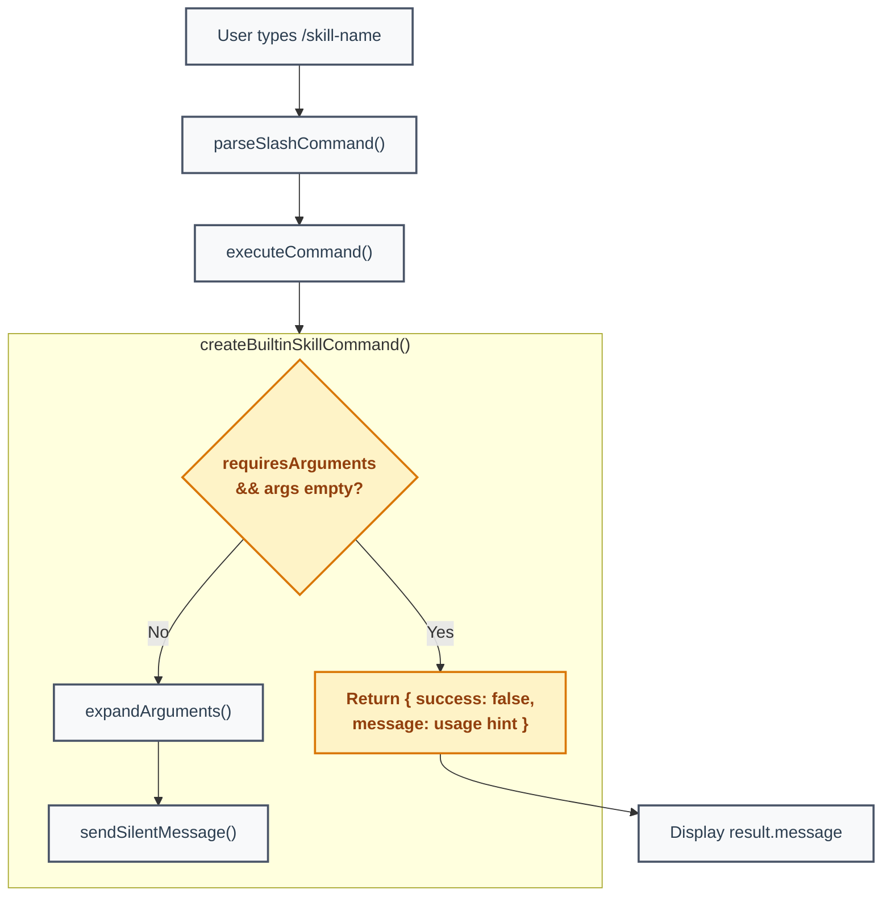

# Command Required Arguments Validation - Technical Design Document

| Document Metadata      | Details                         |
| ---------------------- | ------------------------------- |
| Author(s)              | Developer                       |
| Status                 | Implemented                     |
| Team / Owner           | TUI                             |
| Created / Last Updated | 2026-02-08                      |

## 1. Executive Summary

Skill commands (`/research-codebase`, `/create-spec`, `/create-feature-list`, `/explain-code`, `/prompt-engineer`) silently proceed when invoked without required arguments, substituting the literal string `[no arguments provided]` into the prompt. This wastes an LLM turn and confuses users. This spec proposes adding a `requiresArguments` field to the `BuiltinSkill` interface and validation logic to the `createBuiltinSkillCommand()` and `createSkillCommand()` factories so that commands return an immediate error message when required arguments are missing -- matching the existing `/ralph` validation pattern.

## 2. Context and Motivation

### 2.1 Current State

The command system uses factory functions to create `CommandDefinition` objects from skill/workflow/agent definitions. The `/ralph` command (created by `createRalphCommand()` in `src/ui/commands/workflow-commands.ts:780-930`) validates arguments inside its `execute()` function and returns `{ success: false, message: "..." }` when validation fails. This is the established pattern.

Skill commands, however, have no argument validation. Both `createBuiltinSkillCommand()` (`src/ui/commands/skill-commands.ts:1624-1642`) and `createSkillCommand()` (`src/ui/commands/skill-commands.ts:1577-1612`) always return `{ success: true }` and send the expanded prompt regardless of whether arguments were provided.

The `expandArguments()` function (`src/ui/commands/skill-commands.ts:1548-1550`) replaces `$ARGUMENTS` with the args string, falling back to `"[no arguments provided]"` when args is empty. This means typing `/research-codebase` with no arguments sends a prompt containing the literal text `[no arguments provided]` to the LLM.

*Reference: [research/docs/2026-02-08-command-required-args-validation.md](../research/docs/2026-02-08-command-required-args-validation.md) -- Section "2. Current Skill Command Behavior"*

### 2.2 The Problem

- **User Impact:** Users get no feedback when they forget arguments. The command appears to work but produces poor or irrelevant LLM output because the prompt contains placeholder text instead of real arguments.
- **Resource Waste:** Each missed argument burns an LLM API call with a malformed prompt.
- **Inconsistency:** `/ralph` validates arguments and gives clear error messages; skill commands do not. Users experience inconsistent behavior across the command system.

## 3. Goals and Non-Goals

### 3.1 Functional Goals

- [ ] Add a `requiresArguments` field to the `BuiltinSkill` interface.
- [ ] Set `requiresArguments: true` on skills that need arguments: `research-codebase`, `create-spec`, `create-feature-list`, `explain-code`, `prompt-engineer`.
- [ ] Add validation in `createBuiltinSkillCommand()` to check for empty args when `requiresArguments` is true and return `{ success: false, message: "..." }` with usage instructions.
- [ ] Add the same validation in `createSkillCommand()` for the builtin skill path.
- [ ] Error messages must include the command name, what's expected, and a usage example (matching `/ralph` error style).

### 3.2 Non-Goals (Out of Scope)

- [ ] Agent command validation (`createAgentCommand()` in `src/ui/commands/agent-commands.ts:1622-1648`) -- separate concern, not addressed here.
- [ ] Visual distinction for error messages (e.g., red text via `"system"` role) -- the current `"assistant"` role display matches existing `/ralph` behavior and is acceptable.
- [ ] Formalizing the `argumentHint` bracket convention (`[arg]` = optional vs `<arg>` = required) -- nice-to-have but not needed for this change.
- [ ] Adding `requiresArguments` to the `CommandDefinition` interface -- validation stays inside `execute()` per existing convention.

## 4. Proposed Solution (High-Level Design)

### 4.1 Architecture

No new components or architectural changes. This is a surgical addition to existing factory functions, following the established validation pattern from `/ralph`.



### 4.2 Key Design Decision

Validation is placed **inside the `execute()` function body** of the factory-created command, not at the framework/registry level. This is consistent with how `/ralph` handles validation (`src/ui/commands/workflow-commands.ts:865-869`) and requires no changes to `CommandDefinition`, `CommandResult`, or the registry dispatch logic.

*Reference: [research/docs/2026-02-08-command-required-args-validation.md](../research/docs/2026-02-08-command-required-args-validation.md) -- Section "7. The CommandDefinition Interface" and "Validation Pattern Convention"*

## 5. Detailed Design

### 5.1 Interface Change

**File:** `src/ui/commands/skill-commands.ts:45-58`

Add `requiresArguments` to `BuiltinSkill`:

```typescript
export interface BuiltinSkill {
  name: string;
  description: string;
  aliases?: string[];
  prompt: string;
  hidden?: boolean;
  argumentHint?: string;
  /** If true, the command will return an error when invoked without arguments */
  requiresArguments?: boolean;
}
```

### 5.2 Skill Definitions Update

**File:** `src/ui/commands/skill-commands.ts` (BUILTIN_SKILLS array)

Add `requiresArguments: true` to these skills:

| Skill Name             | `argumentHint`         | Line (approx) |
| ---------------------- | ---------------------- | -------------- |
| `research-codebase`    | `[research-question]`  | 319            |
| `create-spec`          | `[research-path]`      | 525            |
| `create-feature-list`  | `[spec-path]`          | 763            |
| `explain-code`         | `[code-path]`          | 908            |
| `prompt-engineer`      | `[prompt-description]` | 1115           |

Skills that remain **without** `requiresArguments`:
- `commit` -- works without args (auto-detects changes)
- `implement-feature` -- reads from `feature-list.json` automatically
- `create-gh-pr` -- auto-detects changes
- `testing-anti-patterns` -- hidden utility skill

### 5.3 Validation in `createBuiltinSkillCommand()`

**File:** `src/ui/commands/skill-commands.ts:1624-1642`

Add an early-return check before `expandArguments()`:

```typescript
function createBuiltinSkillCommand(skill: BuiltinSkill): CommandDefinition {
  return {
    name: skill.name,
    description: skill.description,
    category: "skill",
    aliases: skill.aliases,
    hidden: skill.hidden,
    argumentHint: skill.argumentHint,
    execute: (args: string, context: CommandContext): CommandResult => {
      const skillArgs = args.trim();

      // Validate required arguments
      if (skill.requiresArguments && !skillArgs) {
        return {
          success: false,
          message: `Missing required argument.\nUsage: /${skill.name} ${skill.argumentHint || "<args>"}`,
        };
      }

      const expandedPrompt = expandArguments(skill.prompt, skillArgs);
      context.sendSilentMessage(expandedPrompt);
      return { success: true };
    },
  };
}
```

### 5.4 Validation in `createSkillCommand()`

**File:** `src/ui/commands/skill-commands.ts:1577-1612`

Add the same check in the builtin skill branch:

```typescript
function createSkillCommand(metadata: SkillMetadata): CommandDefinition {
  return {
    name: metadata.name,
    description: metadata.description,
    category: "skill",
    aliases: metadata.aliases,
    hidden: metadata.hidden,
    execute: (args: string, context: CommandContext): CommandResult => {
      const skillArgs = args.trim();

      const builtinSkill = getBuiltinSkill(metadata.name);
      if (builtinSkill) {
        // Validate required arguments for builtin skills
        if (builtinSkill.requiresArguments && !skillArgs) {
          return {
            success: false,
            message: `Missing required argument.\nUsage: /${builtinSkill.name} ${builtinSkill.argumentHint || "<args>"}`,
          };
        }

        const expandedPrompt = expandArguments(builtinSkill.prompt, skillArgs);
        context.sendSilentMessage(expandedPrompt);
        return { success: true };
      }

      // Fallback: send slash command to agent's native skill system
      const invocationMessage = skillArgs
        ? `/${metadata.name} ${skillArgs}`
        : `/${metadata.name}`;
      context.sendSilentMessage(invocationMessage);
      return { success: true };
    },
  };
}
```

### 5.5 Error Message Format

Error messages follow the `/ralph` convention:

```
Missing required argument.
Usage: /research-codebase [research-question]
```

The `argumentHint` field provides the usage portion. If `argumentHint` is not set (shouldn't happen for skills with `requiresArguments: true`, but as a fallback), `<args>` is used.

## 6. Alternatives Considered

| Option | Pros | Cons | Reason for Rejection |
| ------ | ---- | ---- | -------------------- |
| A: Validate in `expandArguments()` | Single change point | Breaks separation of concerns; `expandArguments` is a pure string utility, not a validation layer. Would need to return an error type instead of string. | Mixes validation with template expansion. |
| B: Add `requiresArguments` to `CommandDefinition` and validate in `executeCommand()` | Framework-level, consistent for all command types | Violates existing convention (validation in `execute()` body). Requires changes to `registry.ts` and `chat.tsx`. Over-engineering for the current need. | Too broad a change for a targeted fix. |
| C: Validate inside `execute()` with `requiresArguments` on `BuiltinSkill` (Selected) | Follows `/ralph` pattern exactly. Minimal change surface. Per-skill opt-in. No framework changes needed. | Duplicated check in two factories (`createBuiltinSkillCommand` and `createSkillCommand`). | **Selected:** Minimal, consistent, proven pattern. |

## 7. Cross-Cutting Concerns

### 7.1 Backward Compatibility

- Skills without `requiresArguments` (or `requiresArguments: false`) are completely unaffected.
- The `BuiltinSkill` interface change is additive (optional field) -- no breaking changes.
- The `expandArguments()` function is unchanged.

### 7.2 Error Display

Error messages render as `"assistant"` role messages in chat (same as `/ralph` errors). This is handled by existing logic in `src/ui/chat.tsx` (~line 1945) where `result.message` is displayed regardless of `result.success` value.

*Reference: [research/docs/2026-02-08-command-required-args-validation.md](../research/docs/2026-02-08-command-required-args-validation.md) -- Section "3. How Command Results Are Displayed"*

## 8. Testing

### 8.1 Unit Tests

Tests should be added in a new file `src/ui/__tests__/skill-command-validation.test.ts`:

1. **Required args missing:** For each skill with `requiresArguments: true`, invoke the command with empty args and assert `{ success: false }` with a message containing `"Missing required argument"` and `"Usage:"`.
2. **Required args provided:** For each skill with `requiresArguments: true`, invoke with non-empty args and assert `{ success: true }` and that `sendSilentMessage` was called.
3. **Optional args (no requiresArguments):** For skills like `commit`, invoke with empty args and assert `{ success: true }` (no validation error).
4. **createSkillCommand builtin path:** Verify the same validation applies when a builtin skill is accessed via the `createSkillCommand` factory.

### 8.2 Manual Testing

- [ ] Type `/research-codebase` with no arguments -- should see error message with usage hint.
- [ ] Type `/research-codebase how does auth work` -- should proceed normally.
- [ ] Type `/create-spec` with no arguments -- should see error message.
- [ ] Type `/commit` with no arguments -- should proceed normally (no validation).

## 9. Implementation Steps

1. Add `requiresArguments?: boolean` to the `BuiltinSkill` interface (`src/ui/commands/skill-commands.ts:45-58`).
2. Add `requiresArguments: true` to the 5 skill definitions in `BUILTIN_SKILLS` (`src/ui/commands/skill-commands.ts`).
3. Add the validation check to `createBuiltinSkillCommand()` (`src/ui/commands/skill-commands.ts:1624-1642`).
4. Add the validation check to `createSkillCommand()` (`src/ui/commands/skill-commands.ts:1577-1612`).
5. Write unit tests in `src/ui/__tests__/skill-command-validation.test.ts`.
6. Run `bun typecheck && bun lint && bun test` to verify.

## 10. Open Questions / Unresolved Issues

- [ ] Should the `argumentHint` bracket convention be updated to use `<arg>` (required) vs `[arg]` (optional) for visual consistency? Currently all hints use `[arg]` even for required arguments. This is cosmetic and can be addressed separately.
- [ ] Should agent commands (`createAgentCommand()`) also get similar validation? The research notes this as a separate concern. Can be a follow-up task.
