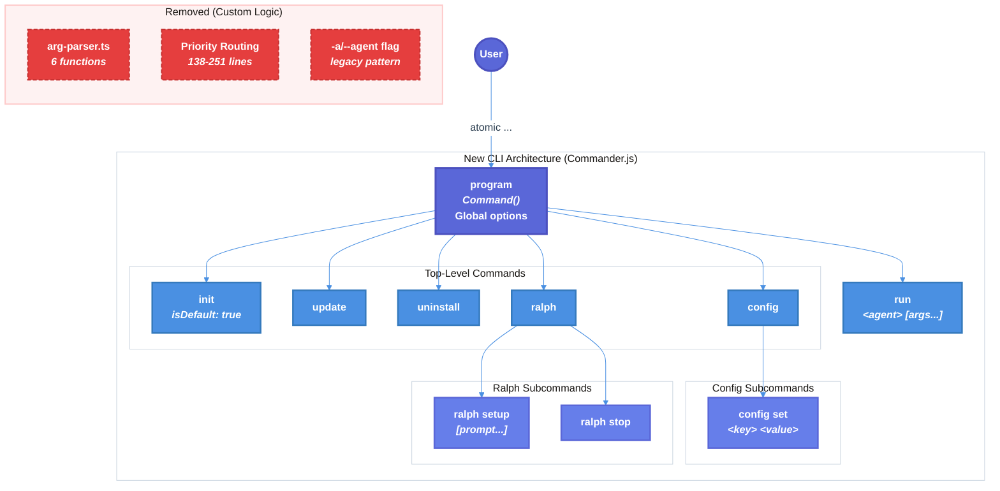

# Commander.js Migration Technical Design Document

| Document Metadata      | Details         |
| ---------------------- | --------------- |
| Author(s)              | lavaman131      |
| Status                 | Draft (WIP)     |
| Team / Owner           | flora131/atomic |
| Created / Last Updated | 2026-01-25      |

## 1. Executive Summary

This RFC proposes migrating the Atomic CLI from Node.js `parseArgs` with custom argument handling to **Commander.js** with TypeScript type inference via `@commander-js/extra-typings`. The current implementation uses ~300 lines of custom routing logic (`src/index.ts:130-349`) and ~270 lines of argument parsing utilities (`src/utils/arg-parser.ts`) to handle priority-based routing, subcommands, and `--` separator passthrough.

**Key changes:**
- Replace legacy `-a/--agent` flag pattern with explicit `run` command (e.g., `atomic run claude`)
- Make `ralph` a top-level command only (remove `atomic -a claude ralph` pattern)
- Eliminate ~50% of CLI logic through declarative Commander.js API
- Improve type safety via inferred action handler parameters

**Breaking changes are acceptable** - this is a clean-slate migration prioritizing simplicity over backward compatibility.

**Research Reference:** [research/docs/2026-01-25-commander-js-migration.md](../research/docs/2026-01-25-commander-js-migration.md)

## 2. Context and Motivation

### 2.1 Current State

The Atomic CLI uses a **priority-based routing system** with three levels of precedence:

```
Raw Args → isInitWithSeparator? → Error (fail fast)
         ↓ No
         → isAgentRunMode? → Custom agent routing → runAgentCommand
         ↓ No
         → parseArgs → Command switch → Command handlers
```

**Architecture:**
- **Entry Point:** `src/index.ts:130-349` - Main CLI routing with switch statement
- **Arg Parser Utilities:** `src/utils/arg-parser.ts` - 6 custom functions for argument handling
- **Commands:** 5 commands (init, config, update, uninstall, ralph) + special "agent run mode"

**Current Code References:**

| Component                      | Location                          | Purpose                                        |
| ------------------------------ | --------------------------------- | ---------------------------------------------- |
| Priority routing               | `src/index.ts:138-251`            | Agent run mode detection, fail-fast validation |
| parseArgs config               | `src/index.ts:253-270`            | Option definitions                             |
| Command switch                 | `src/index.ts:296-340`            | Command dispatch                               |
| `isAgentRunMode()`             | `src/utils/arg-parser.ts:19-31`   | Detects `--agent` without `init`               |
| `extractAgentName()`           | `src/utils/arg-parser.ts:45-72`   | Extracts agent from `-a`/`--agent`             |
| `extractAgentArgs()`           | `src/utils/arg-parser.ts:138-146` | Gets args after `--` separator                 |
| `detectMissingSeparatorArgs()` | `src/utils/arg-parser.ts:199-266` | Warns about missing `--`                       |

**Limitations:**
1. **Complex routing logic** - Priority-based routing with special cases for ralph command adds cognitive overhead
2. **Custom separator handling** - Manual `--` separator parsing duplicates Commander.js built-in functionality
3. **Type safety gaps** - `parseArgs` returns `Record<string, string | boolean | undefined>`, requiring manual type assertions
4. **Difficult extensibility** - Adding new subcommands requires modifying multiple functions
5. **Error handling duplication** - Custom error messages for each edge case

### 2.2 The Problem

- **Developer Experience:** Adding new commands requires understanding the priority-based routing system and modifying 3+ files
- **Type Safety:** Current implementation uses `as` casts for parsed options (`values.agent as AgentKey | undefined`)
- **Maintenance Burden:** 270 lines of custom arg-parsing utilities that duplicate Commander.js functionality
- **Inconsistent Patterns:** Ralph command has special-case routing (`src/index.ts:186-220`) instead of following standard command patterns

## 3. Goals and Non-Goals

### 3.1 Functional Goals

- [x] Replace Node.js `parseArgs` with Commander.js declarative command definitions
- [x] Implement type-safe action handlers using `@commander-js/extra-typings`
- [x] Migrate all 6 commands to Commander.js command pattern
- [x] Handle `--` separator passthrough using `.passThroughOptions()`
- [x] Support subcommand hierarchies for `config` and `ralph`
- [x] Simplify CLI interface by removing legacy patterns (breaking changes allowed)
- [x] Preserve custom error messages for user-friendly feedback

### 3.2 Non-Goals (Out of Scope)

- [ ] We will NOT migrate to a different CLI framework (e.g., yargs, oclif)
- [ ] We will NOT implement shell completions in this phase
- [ ] We will NOT add new commands (migration only)
- [ ] We will NOT change telemetry behavior
- [ ] We will NOT maintain backward compatibility (breaking changes are acceptable)

## 4. Proposed Solution (High-Level Design)

### 4.1 System Architecture Diagram



### 4.2 Architectural Pattern

**Commander.js Command Pattern:** Replace priority-based routing with declarative command definitions. Commander.js handles:

1. **Command matching** - Automatically routes to correct command handler
2. **Option parsing** - Extracts typed options from arguments
3. **Subcommands** - Native support for nested commands (config set, ralph setup)
4. **Passthrough** - Built-in `--` separator handling with `.passThroughOptions()`
5. **Help generation** - Automatic `--help` output

**Research Reference:** Section 2 "Commander.js TypeScript Patterns" and Section 10 "Complete Migration Example"

### 4.3 Key Components

| Component            | Current                               | Proposed                                | Justification                       |
| -------------------- | ------------------------------------- | --------------------------------------- | ----------------------------------- |
| Entry point          | `src/index.ts` (349 lines)            | `src/cli.ts` (~150 lines)               | Declarative Commander.js setup      |
| Arg parser utils     | `src/utils/arg-parser.ts` (267 lines) | **Deleted**                             | Commander.js handles natively       |
| Command registration | Switch statement                      | `.command()` / `.addCommand()`          | Type-safe, declarative              |
| Option types         | Manual `as` casts                     | `@commander-js/extra-typings` inference | Compile-time type safety            |
| Agent run mode       | `-a/--agent` flag + special routing   | `run <agent>` command                   | Explicit command, cleaner semantics |

## 5. Detailed Design

### 5.1 Dependencies

```bash
bun add commander @commander-js/extra-typings
```

**Package Versions:**
- `commander`: ^12.x (latest stable)
- `@commander-js/extra-typings`: ^12.x (matches commander version)

**Research Reference:** Section 2 "Installation"

### 5.2 Type Definitions

```typescript
// src/types/cli.ts

import type { AgentKey } from '../config';

/** Global CLI options available on all commands */
export interface GlobalOptions {
  agent?: string;
  force?: boolean;
  yes?: boolean;
  banner: boolean; // from --no-banner negatable
  uploadTelemetry?: boolean;
}

/** Init command specific options (inherits global) */
export interface InitOptions extends GlobalOptions {
  // No additional options
}

/** Uninstall command specific options */
export interface UninstallOptions {
  dryRun?: boolean;
  keepConfig?: boolean;
}

/** Ralph setup subcommand options */
export interface RalphSetupOptions {
  maxIterations?: number;
  completionPromise?: string;
  featureList: string; // default: 'research/feature-list.json'
}
```

### 5.3 Program Setup with Type Inference

```typescript
// src/cli.ts
#!/usr/bin/env bun

import { Command, Option } from '@commander-js/extra-typings';
import { VERSION } from './version';
import { AGENT_CONFIG, isValidAgent, type AgentKey } from './config';
import { COLORS } from './utils/colors';

const program = new Command();

// Program metadata
program
  .name('atomic')
  .description('Configuration management for coding agents')
  .version(VERSION, '-v, --version')
  .showHelpAfterError('(run atomic --help for usage)')
  .configureOutput({
    outputError: (str, write) => write(`${COLORS.red}${str}${COLORS.reset}`),
  });

// Global options (inherited by all commands)
program
  .option('-f, --force', 'overwrite all config files including CLAUDE.md/AGENTS.md')
  .option('-y, --yes', 'auto-confirm all prompts')
  .option('--no-banner', 'skip ASCII banner display')
  .addOption(new Option('--upload-telemetry').hideHelp());
```

**Research Reference:** Section 4 "Option Handling Patterns" and Section 9 "Hidden Options"

### 5.4 Init Command (Default)

```typescript
// src/cli.ts (continued)

import { initCommand } from './commands/init';

program
  .command('init', { isDefault: true })
  .description('Interactive setup with agent selection')
  .option('-a, --agent <name>', `pre-select agent: ${Object.keys(AGENT_CONFIG).join(', ')}`)
  .action(async (options, command) => {
    const globalOpts = command.optsWithGlobals();
    await initCommand({
      showBanner: globalOpts.banner !== false,
      preSelectedAgent: options.agent as AgentKey | undefined,
      force: globalOpts.force,
      yes: globalOpts.yes,
    });
  });
```

**Note:** The `{ isDefault: true }` option makes `init` run when no command is specified, so `atomic` equals `atomic init`. The `-a/--agent` option is now local to `init` for pre-selecting an agent during setup.

**Research Reference:** Section 3 "Default Command (No Subcommand)"

### 5.5 Config Command with Subcommands

```typescript
// src/cli.ts (continued)

import { configCommand } from './commands/config';

const config = program
  .command('config')
  .description('Manage configuration (e.g., telemetry settings)');

config
  .command('set')
  .description('Set a configuration value')
  .argument('<key>', 'configuration key (e.g., telemetry)')
  .argument('<value>', 'value to set (e.g., true, false)')
  .action((key, value) => {
    configCommand('set', key, value);
  });
```

**Research Reference:** Section 3 "Subcommand Pattern for `config`"

### 5.6 Update and Uninstall Commands

```typescript
// src/cli.ts (continued)

import { updateCommand } from './commands/update';
import { uninstallCommand } from './commands/uninstall';

program
  .command('update')
  .description('Self-update to latest version (binary installs only)')
  .action(async () => {
    await updateCommand();
  });

program
  .command('uninstall')
  .description('Remove atomic installation (binary installs only)')
  .option('--dry-run', 'preview what would be removed without removing')
  .option('--keep-config', 'keep configuration data, only remove binary')
  .action(async (options, command) => {
    const globalOpts = command.optsWithGlobals();
    await uninstallCommand({
      dryRun: options.dryRun,
      yes: globalOpts.yes,
      keepConfig: options.keepConfig,
    });
  });
```

### 5.7 Ralph Command with Subcommands

Ralph requires specifying which agent to use via `-a/--agent` (currently only supports `claude`).

```typescript
// src/cli.ts (continued)

import { ralphSetup, ralphStop } from './commands/ralph';

function parseIterations(value: string): number {
  const parsed = parseInt(value, 10);
  if (isNaN(parsed) || parsed < 0) {
    throw new Error('Must be a non-negative integer');
  }
  return parsed;
}

const ralph = program
  .command('ralph')
  .description('Self-referential development loop for coding agents');

ralph
  .command('setup')
  .description('Initialize and start a Ralph loop')
  .requiredOption('-a, --agent <name>', 'agent to use (currently: claude)')
  .argument('[prompt...]', 'initial prompt to start the loop')
  .option('--max-iterations <n>', 'maximum iterations before auto-stop', parseIterations)
  .option('--completion-promise <text>', 'promise phrase (use quotes for multi-word)')
  .option('--feature-list <path>', 'path to feature list JSON', 'research/feature-list.json')
  .action(async (prompt, options) => {
    // Validate agent (currently only claude supported)
    if (options.agent !== 'claude') {
      console.error(`${COLORS.red}Error: Ralph currently only supports 'claude' agent${COLORS.reset}`);
      process.exit(1);
    }

    const args: string[] = [];
    if (options.maxIterations !== undefined) {
      args.push('--max-iterations', String(options.maxIterations));
    }
    if (options.completionPromise) {
      args.push('--completion-promise', options.completionPromise);
    }
    if (options.featureList !== 'research/feature-list.json') {
      args.push('--feature-list', options.featureList);
    }
    args.push(...prompt);
    await ralphSetup(args);
  });

ralph
  .command('stop')
  .description('Stop hook handler (called automatically by hooks)')
  .requiredOption('-a, --agent <name>', 'agent to use (currently: claude)')
  .action(async (options) => {
    if (options.agent !== 'claude') {
      console.error(`${COLORS.red}Error: Ralph currently only supports 'claude' agent${COLORS.reset}`);
      process.exit(1);
    }
    await ralphStop();
  });
```

**Usage:**
```bash
atomic ralph setup -a claude "implement feature X"
atomic ralph stop --agent claude
```

**Research Reference:** Section 3 "Subcommand Pattern for `ralph`" and Section 4 "Custom Parsing"

### 5.8 Run Command (Replaces `--agent` Flag)

The `run` command is the new explicit way to run an agent. This replaces the legacy `-a/--agent` flag pattern with a proper subcommand.

**New syntax:** `atomic run <agent> [-- args...]`
**Old syntax (removed):** `atomic --agent <name> [-- args...]`

```typescript
// src/cli.ts (continued)

import { runAgentCommand } from './commands/run-agent';

program
  .command('run')
  .description('Run a configured agent')
  .argument('<agent>', `agent to run: ${Object.keys(AGENT_CONFIG).join(', ')}`)
  .argument('[args...]', 'arguments to pass to the agent')
  .passThroughOptions()
  .allowUnknownOption()
  .action(async (agent, args, options, command) => {
    const globalOpts = command.optsWithGlobals();

    // Validate agent name
    if (!isValidAgent(agent)) {
      const validAgents = Object.keys(AGENT_CONFIG).join(', ');
      console.error(`${COLORS.red}Error: Unknown agent '${agent}'${COLORS.reset}`);
      console.error(`Valid agents: ${validAgents}`);
      process.exit(1);
    }

    // Run agent with passthrough arguments
    const exitCode = await runAgentCommand(agent, args, {
      force: globalOpts.force,
      yes: globalOpts.yes,
    });
    process.exit(exitCode);
  });
```

**Benefits of `run` command over `--agent` flag:**
1. **Explicit semantics** - Clear that you're running an agent, not configuring
2. **Simpler parsing** - No special-case routing for flags vs commands
3. **Better help output** - Shows as a proper command in `--help`
4. **Consistent with other CLIs** - Follows `<tool> run <target>` pattern (e.g., `npm run`, `docker run`)

**Research Reference:** Section 6 "Agent Run Mode Migration" - Option C (Separate 'run' Subcommand)

### 5.9 Entry Point

```typescript
// src/cli.ts (continued)

import { spawn } from 'child_process';
import { cleanupWindowsLeftoverFiles } from './utils/cleanup';
import { isTelemetryEnabledSync } from './utils/telemetry';

function spawnTelemetryUpload(): void {
  if (process.env.ATOMIC_TELEMETRY_UPLOAD === '1') return;
  if (!isTelemetryEnabledSync()) return;

  try {
    const scriptPath = process.argv[1] ?? 'atomic';
    const child = spawn(process.execPath, [scriptPath, '--upload-telemetry'], {
      detached: true,
      stdio: 'ignore',
      env: { ...process.env, ATOMIC_TELEMETRY_UPLOAD: '1' },
    });
    if (child.unref) child.unref();
  } catch {
    // Fail silently
  }
}

async function main(): Promise<void> {
  await cleanupWindowsLeftoverFiles();

  try {
    await program.parseAsync();
  } catch (error) {
    if (error instanceof Error) {
      console.error(`${COLORS.red}Error: ${error.message}${COLORS.reset}`);
    }
    spawnTelemetryUpload();
    process.exit(1);
  }

  spawnTelemetryUpload();
}

main();
```

**Research Reference:** Section 8 "Async Action Handlers"

### 5.10 Argument Handling and the `--` Separator

The `--` separator disambiguates **atomic CLI arguments** from **coding agent arguments**. This is important when agent arguments look like flags that Commander.js might try to interpret.

#### When `--` is Required

Use `--` when passing flags or options to the agent that could be confused with atomic options:

```bash
# Without --, Commander.js might interpret --help as atomic's help
atomic run claude -- --help
# agent = "claude", args = ["--help"] (passed to Claude)

# Without --, -f might be interpreted as atomic's --force
atomic run claude -- -f some-file.txt
# agent = "claude", args = ["-f", "some-file.txt"]
```

#### When `--` is Optional

For simple prompts and slash commands that don't start with `-`, the separator is optional:

```bash
# These are equivalent - no ambiguity
atomic run claude /commit "fix bug"
atomic run claude -- /commit "fix bug"
# agent = "claude", args = ["/commit", "fix bug"]

# Prompt without flags - separator optional
atomic run claude "fix the authentication bug"
atomic run claude -- "fix the authentication bug"
```

#### Implementation

The `.passThroughOptions()` and `.allowUnknownOption()` on the `run` command ensure that:
1. Arguments after `--` are never interpreted by Commander.js
2. Unknown flags before `--` trigger an error (invalid atomic option)

```typescript
program
  .command('run')
  .argument('<agent>', 'agent to run')
  .argument('[args...]', 'arguments to pass to the agent (use -- before flags)')
  .passThroughOptions()
  .allowUnknownOption()
  // ...
```

**Note:** The complex missing-separator detection logic from `src/utils/arg-parser.ts` is no longer needed because Commander.js handles this natively.

### 5.11 Files to Delete/Update

After migration, the following files need changes:

| File                                   | Action     | Reason                                                                 |
| -------------------------------------- | ---------- | ---------------------------------------------------------------------- |
| `src/utils/arg-parser.ts`              | **Delete** | All 6 functions replaced by Commander.js                               |
| `src/index.ts`                         | **Delete** | Replaced by `src/cli.ts` with Commander.js                             |
| `plugins/ralph/commands/ralph-loop.md` | **Update** | Change `atomic -a claude ralph setup` → `atomic ralph setup -a claude` |
| `plugins/ralph/hooks/hooks.json`       | **Update** | Change `atomic -a claude ralph stop` → `atomic ralph stop -a claude`   |
| `README.md`                            | **Update** | Update all CLI examples to use new `run` command and ralph syntax      |

### 5.12 Help Output Comparison

**Current (manual):**
```
atomic - Configuration management for coding agents

USAGE:
  atomic                             Interactive setup (same as 'atomic init')
  atomic init                        Interactive setup with agent selection
  ...
```

**Proposed (Commander.js auto-generated):**
```
Usage: atomic [options] [command]

Configuration management for coding agents

Options:
  -v, --version         output the version number
  -f, --force           overwrite all config files including CLAUDE.md/AGENTS.md
  -y, --yes             auto-confirm all prompts
  --no-banner           skip ASCII banner display
  -h, --help            display help for command

Commands:
  init [options]              Interactive setup with agent selection (default)
  run <agent> [-- args...]    Run a configured agent (use -- before agent flags)
  config                      Manage configuration (e.g., telemetry settings)
  update                      Self-update to latest version (binary installs only)
  uninstall [options]         Remove atomic installation (binary installs only)
  ralph                       Self-referential development loop for coding agents
  help [command]              display help for command
```

**Note:** Commander.js auto-generates help. Custom help text can be added with `.addHelpText()` if needed for examples section.

## 6. Alternatives Considered

| Option                         | Pros                                                               | Cons                                                      | Reason for Rejection                                  |
| ------------------------------ | ------------------------------------------------------------------ | --------------------------------------------------------- | ----------------------------------------------------- |
| **A: Keep current parseArgs**  | No migration effort, already working                               | Type safety issues, complex routing logic, hard to extend | Maintenance burden outweighs stability                |
| **B: yargs**                   | Mature, TypeScript support                                         | Larger bundle (~200KB vs ~80KB), different API style      | Commander.js is lighter and sufficient                |
| **C: oclif**                   | Full CLI framework, plugin support                                 | Overkill for simple CLI, steep learning curve             | Too complex for our needs                             |
| **D: Commander.js (Selected)** | Lightweight, native TypeScript, familiar API, built-in subcommands | Additional dependency                                     | **Selected:** Best balance of features and simplicity |

**Research Reference:** Section 11 "Bun Compatibility" confirms Commander.js works with Bun runtime.

## 7. Cross-Cutting Concerns

### 7.1 Security and Privacy

- **No change** - CLI operates locally, no network requests except telemetry (opt-out)
- **Input validation** - Commander.js validates option types automatically
- **Passthrough safety** - Agent args still passed through without modification

### 7.2 Observability Strategy

- **Error messages** - Preserve current user-friendly error messages using `.configureOutput()`
- **Debug mode** - `DEBUG=1` environment variable continues to work
- **Telemetry** - No change to telemetry behavior

### 7.3 Breaking Changes

This migration introduces breaking changes to simplify the CLI interface. The following patterns are removed:

| Old Syntax (Removed)                | New Syntax                        | Reason                               |
| ----------------------------------- | --------------------------------- | ------------------------------------ |
| `atomic -a claude`                  | `atomic run claude`               | Explicit command is clearer          |
| `atomic --agent claude`             | `atomic run claude`               | Explicit command is clearer          |
| `atomic -a claude -- /commit "msg"` | `atomic run claude /commit "msg"` | Simpler, `--` optional               |
| `atomic -a claude ralph setup`      | `atomic ralph setup -a claude`    | Ralph is top-level with agent option |

**New command patterns:**

| Usage                                   | Behavior                          |
| --------------------------------------- | --------------------------------- |
| `atomic`                                | Runs init (default)               |
| `atomic init`                           | Runs init explicitly              |
| `atomic init -a claude`                 | Runs init with pre-selected agent |
| `atomic run claude`                     | Runs Claude agent                 |
| `atomic run claude /commit "msg"`       | Runs Claude with args             |
| `atomic config set telemetry false`     | Sets telemetry config             |
| `atomic update`                         | Self-updates                      |
| `atomic uninstall --dry-run`            | Preview uninstall                 |
| `atomic ralph setup -a claude "prompt"` | Starts Ralph loop for Claude      |
| `atomic ralph stop -a claude`           | Stops Ralph loop for Claude       |
| `atomic --version`                      | Shows version                     |
| `atomic --help`                         | Shows help                        |

## 8. Migration, Rollout, and Testing

### 8.1 Deployment Strategy

- [ ] **Phase 1:** Create `src/cli.ts` with Commander.js implementation
- [ ] **Phase 2:** Update `package.json` bin to point to new entry point
- [ ] **Phase 3:** Update tests to use new CLI syntax (`run` command)
- [ ] **Phase 4:** Delete `src/index.ts` and `src/utils/arg-parser.ts`
- [ ] **Phase 5:** Update documentation (README, help text)

### 8.2 Test Plan

#### Unit Tests

```typescript
// tests/cli-commander.test.ts
import { describe, test, expect } from 'bun:test';
import { program } from '../src/cli';

describe('Commander.js CLI', () => {
  test('parses init command with agent option', () => {
    // Mock parseAsync and verify options
  });

  test('parses agent run mode with passthrough args', () => {
    // Verify args after -- are captured
  });

  test('validates agent name', () => {
    // Verify unknown agent shows error
  });
});
```

#### Integration Tests

Tests in `tests/routing.test.ts` will need updates to use the new `run` command syntax. This is expected due to the breaking changes.

#### End-to-End Tests

| Test Case             | Command                               | Expected                             |
| --------------------- | ------------------------------------- | ------------------------------------ |
| Default command       | `atomic`                              | Runs init                            |
| Explicit init         | `atomic init`                         | Runs init                            |
| Agent pre-selection   | `atomic init -a claude`               | Runs init with Claude selected       |
| Run agent             | `atomic run claude`                   | Runs Claude (auto-init if needed)    |
| Run with args         | `atomic run claude /commit`           | Passes /commit to Claude             |
| Run with prompt       | `atomic run claude "fix bug"`         | Passes prompt to Claude              |
| Run with -- separator | `atomic run claude -- --help`         | Passes --help to Claude (not atomic) |
| Run flag passthrough  | `atomic run claude -- -f file.txt`    | Passes -f to Claude (not atomic)     |
| Config subcommand     | `atomic config set telemetry false`   | Sets telemetry                       |
| Ralph setup           | `atomic ralph setup -a claude "test"` | Runs ralph setup for Claude          |
| Ralph stop            | `atomic ralph stop -a claude`         | Stops ralph loop for Claude          |
| Ralph missing agent   | `atomic ralph setup "test"`           | Shows error: agent required          |
| Version flag          | `atomic --version`                    | Shows version                        |
| Help flag             | `atomic --help`                       | Shows help                           |
| Run help              | `atomic run --help`                   | Shows run command help               |
| Unknown command       | `atomic foo`                          | Shows error + help hint              |
| Unknown agent         | `atomic run unknown`                  | Shows error with valid agents        |

### 8.3 Rollback Plan

If issues arise, revert to previous `src/index.ts` implementation. The old code remains functional until Phase 4 deletion.

## 9. Resolved Design Decisions

The following questions from the research document have been resolved:

1. **Ralph Command Access Path:**
   - **Decision:** Ralph is a top-level command only (`atomic ralph setup`)
   - **Rationale:** No backward compatibility needed; cleaner to have ralph as its own command

2. **Agent Run Mode Syntax:**
   - **Decision:** Use explicit `run` command (`atomic run claude`)
   - **Rationale:** Follows established CLI patterns (`npm run`, `docker run`), clearer semantics

3. **Separator Handling:**
   - **Decision:** `--` separator is optional with `run` command
   - **Rationale:** Variadic arguments capture everything after agent name naturally

4. **Error Messages:**
   - **Decision:** Preserve user-friendly error messages via `.configureOutput()`
   - **Rationale:** Good UX should be maintained regardless of implementation

## 10. Open Questions / Unresolved Issues

1. **Help Text Customization:** Should we add examples section to auto-generated help?
   - **Options:** Use `.addHelpText('after', '...')` for examples
   - **Recommendation:** Add examples for `run` command showing common patterns

2. **Init Agent Option:** Should `-a/--agent` on init remain, or should users always go through interactive selection?
   - **Current decision:** Keep `-a` on init for scripting/automation use cases
   - **Alternative:** Remove and require interactive selection always

## 11. Implementation Checklist

### Phase 1: Setup

- [ ] Install dependencies: `bun add commander @commander-js/extra-typings`
- [ ] Create `src/types/cli.ts` with type definitions
- [ ] Create `src/cli.ts` with program setup

### Phase 2: Command Migration

- [ ] Migrate init command (with `isDefault: true`, local `-a` option)
- [ ] Migrate config command with `set` subcommand
- [ ] Migrate update command
- [ ] Migrate uninstall command with `--dry-run`, `--keep-config`
- [ ] Migrate ralph command with `setup`, `stop` subcommands
- [ ] Add new `run` command with variadic args

### Phase 3: Cleanup Legacy Patterns

- [ ] Remove global `-a/--agent` option (now local to `init`)
- [ ] Remove special-case ralph routing via agent flag
- [ ] Delete `src/utils/arg-parser.ts` (all 6 functions)

### Phase 4: Testing

- [ ] Update `tests/routing.test.ts` for new `run` command syntax
- [ ] Add Commander.js specific unit tests
- [ ] Run manual E2E tests for all use cases
- [ ] Test on Windows, macOS, Linux

### Phase 5: Update Ralph Plugin

The Ralph plugin uses the old `atomic -a claude ralph` syntax in its command and hook files:

- [ ] Update `plugins/ralph/commands/ralph-loop.md`:
  - Change `atomic -a claude ralph setup $ARGUMENTS` → `atomic ralph setup -a claude $ARGUMENTS`
  - Update `allowed-tools` from `Bash(atomic -a claude ralph*)` → `Bash(atomic ralph*)`
- [ ] Update `plugins/ralph/hooks/hooks.json`:
  - Change `atomic -a claude ralph stop` → `atomic ralph stop -a claude`

### Phase 6: Update README

The README needs updates to reflect the new CLI syntax:

- [ ] Update "Quick Start" section:
  - Change `atomic -a claude` → `atomic run claude`
  - Change `atomic -a claude -- /commit` → `atomic run claude /commit`
- [ ] Update "Running Agents" section:
  - Document new `run` command syntax
  - Explain `--` separator for passing flags to agent
- [ ] Update "Ralph Loop" section:
  - Change `atomic -a claude ralph setup` → `atomic ralph setup -a claude`
  - Change `atomic -a claude ralph stop` → `atomic ralph stop -a claude`
- [ ] Update any command examples throughout the document
- [ ] Add migration note for users upgrading from previous versions

### Phase 7: Cleanup

- [ ] Update `package.json` bin entry
- [ ] Delete `src/index.ts`
- [ ] Delete `src/utils/arg-parser.ts`
- [ ] Update any imports

## 12. File Structure (Post-Migration)

```
src/
├── cli.ts                 # New Commander.js entry point (~150 lines)
├── config.ts              # Agent configuration (unchanged)
├── version.ts             # Version constant (unchanged)
├── types/
│   └── cli.ts             # CLI type definitions (new)
├── commands/
│   ├── init.ts            # Init command handler (unchanged)
│   ├── config.ts          # Config command handler (unchanged)
│   ├── update.ts          # Update command handler (unchanged)
│   ├── uninstall.ts       # Uninstall command handler (unchanged)
│   ├── ralph.ts           # Ralph command handler (unchanged)
│   └── run-agent.ts       # Run agent handler (unchanged)
└── utils/
    ├── banner.ts          # Banner display (unchanged)
    ├── cleanup.ts         # Windows cleanup (unchanged)
    ├── colors.ts          # ANSI colors (unchanged)
    ├── copy.ts            # File operations (unchanged)
    ├── detect.ts          # Command detection (unchanged)
    └── telemetry/         # Telemetry utils (unchanged)
    # DELETED: arg-parser.ts

tests/
├── cli-commander.test.ts  # New Commander.js tests
├── routing.test.ts        # Updated for new `run` command syntax
└── ...                    # Other existing tests

plugins/ralph/
├── commands/
│   └── ralph-loop.md      # Updated: `atomic ralph setup -a claude` (was `atomic -a claude ralph setup`)
└── hooks/
    └── hooks.json         # Updated: `atomic ralph stop -a claude` (was `atomic -a claude ralph stop`)

README.md                  # Updated: all CLI examples use new syntax
```

**Lines of Code Impact:**
- **Removed:** ~270 lines (arg-parser.ts) + ~200 lines (index.ts routing logic)
- **Added:** ~120 lines (cli.ts) + ~30 lines (types/cli.ts)
- **Net reduction:** ~320 lines (~50% reduction in CLI logic)

**Complexity Reduction:**
- No more priority-based routing with special cases
- No more manual `--` separator detection
- No more special ralph routing via agent flag
- Single, declarative command structure
