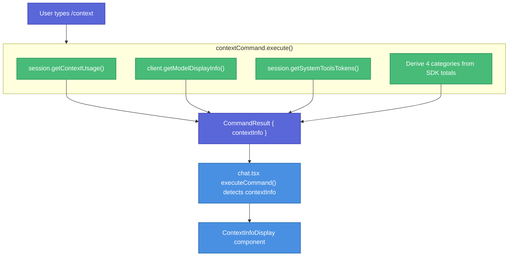

# /context Command for Session Context Usage Display

| Document Metadata      | Details     |
| ---------------------- | ----------- |
| Author(s)              | Developer   |
| Status                 | Draft (WIP) |
| Team / Owner           | Atomic CLI  |
| Created / Last Updated | 2026-02-09  |

## 1. Executive Summary

This spec proposes two related changes: (1) fixing the hardcoded 200k `maxTokens` in all three SDK clients by extracting real context window sizes from each SDK's native APIs, and (2) adding a `/context` builtin command that displays a comprehensive overview of the current session's context window usage -- model info, accurate token usage with a visual bar, and itemized breakdowns of MCP servers, custom agents, memory files, and skills with estimated token costs. The SDK fix is a prerequisite for the command to display accurate usage percentages.

> **Research reference:** `research/docs/2026-02-09-166-context-command-session-usage.md`

## 2. Context and Motivation

### 2.1 Current State

- The `Session` interface exposes `getContextUsage()` returning `ContextUsage` with `inputTokens`, `outputTokens`, `maxTokens`, and `usagePercentage` (`src/sdk/types.ts:184-193`).
- `CodingAgentClient.getModelDisplayInfo()` returns model name and tier (`src/sdk/types.ts:62-67`).
- All three SDK clients (Claude, Copilot, OpenCode) hardcode `maxTokens: 200000` in their `getContextUsage()` implementations.
- MCP server discovery exists via `discoverMcpConfigs()` (`src/utils/mcp-config.ts:130-157`).
- Skills and agents are registered in `globalRegistry` with category metadata and embedded prompt content.
- Memory files (CLAUDE.md, copilot-instructions.md, AGENTS.md) are loaded by SDK clients during initialization.
- No unified view exists for understanding how much of the context window each component consumes.

### 2.2 The Problem

- **User Impact:** Users have no visibility into what is consuming their context window, making it hard to optimize long sessions or debug context-limit errors.
- **Technical Debt:** Context window sizes are hardcoded to 200k across all three clients, ignoring real values available from SDK APIs.

## 3. Goals and Non-Goals

### 3.1 Functional Goals

- [ ] **Fix hardcoded context window sizes everywhere:** Replace hardcoded `200000` in all three SDK clients' `getContextUsage()` with real values from each SDK's native APIs. Also fix the model listing layer (`model-operations.ts`, `model-transform.ts`) so `/model list` and the model selector dialog display real context window sizes from the SDKs instead of hardcoded `SUPPORTED_MODELS` or `DEFAULT_LIMITS` fallbacks.
- [ ] Register `/context` as a builtin command following the existing pattern in `src/ui/commands/builtin-commands.ts`.
- [ ] Display model name/tier and total token usage with a visual usage bar using the real context window size.
- [ ] Show a **four-category token breakdown** using precise SDK-reported token counts: **System/Tools** (pre-message context), **Messages** (conversation content), **Free Space** (remaining capacity), and **Buffer** (autocompact reservation).
- [ ] Render the output via a dedicated `ContextInfoDisplay` component (pattern: `McpServerListIndicator`).

### 3.2 Non-Goals (Out of Scope)

- [ ] We will NOT show per-component token breakdowns (individual agent, skill, MCP tool token counts). The four high-level categories provide precise totals from SDK data without estimation.
- [ ] We will NOT add real-time auto-updating of the display (it's a snapshot when the command runs).

## 4. Proposed Solution (High-Level Design)

### 4.1 System Architecture Diagram



### 4.2 Architectural Pattern

Follows the existing **Command-Result-Component** pattern established by `/mcp`:

1. Command `execute()` gathers data and returns `CommandResult` with a custom field.
2. `chat.tsx` `executeCommand()` detects the custom field and attaches data to the message state.
3. A dedicated React component renders the data within the chat message.

> **Research reference:** `research/docs/2026-02-09-166-context-command-session-usage.md` (Section 7: UI Rendering Capabilities, and the Component Data Flow diagram)

### 4.3 Key Components

| Component            | Responsibility                                           | File                                         | Justification                                         |
| -------------------- | -------------------------------------------------------- | -------------------------------------------- | ----------------------------------------------------- |
| `contextCommand`     | Read SDK token data, compute 4 categories                | `src/ui/commands/builtin-commands.ts`        | Follows existing builtin command pattern              |
| `ContextInfoDisplay` | Render context usage UI with visual bar and 4 categories | `src/ui/components/context-info-display.tsx` | Follows `McpServerListIndicator` component pattern    |
| `CommandResult`      | Extended with `contextInfo` field                        | `src/ui/commands/registry.ts`                | Pattern matches `mcpServers` field on `CommandResult` |

## 5. Detailed Design

### 5.1 Fix Hardcoded `maxTokens` in SDK Clients

All three SDK clients hardcode `maxTokens: 200000` in their `getContextUsage()` methods. Each SDK already provides APIs that surface the real context window size, but the data is currently ignored. The fix is to capture these values eagerly and store them in session state. **If the real context window size cannot be obtained, this is a bug — the code must throw rather than silently fall back to a hardcoded default.**

#### 5.1.1 Claude Client (`src/sdk/claude-client.ts`)

**Data source:** `SDKResultMessage.modelUsage[modelName].contextWindow`

The `SDKResultMessage` (delivered at the end of every query) contains a `modelUsage` field — a `Record<string, ModelUsage>` keyed by model name. Each `ModelUsage` includes:

```typescript
// From @anthropic-ai/claude-agent-sdk SDK types
type ModelUsage = {
  inputTokens: number;
  outputTokens: number;
  cacheReadInputTokens: number;
  cacheCreationInputTokens: number;
  webSearchRequests: number;
  costUSD: number;
  contextWindow: number;    // <-- real context window size
  maxOutputTokens: number;
};
```

**Current gap:** The `processMessage()` method at `src/sdk/claude-client.ts:552-565` already casts to `SDKResultMessage` but only checks `result.subtype` for error handling — it never reads `result.modelUsage`.

**Fix:** In `processMessage()`, when `sdkMessage.type === "result"`, extract `contextWindow` from `modelUsage` and store it in `ClaudeSessionState`:

1. Add `contextWindow: number | null` to `ClaudeSessionState`, initialized to `null`.
2. In the `sdkMessage.type === "result"` block (`src/sdk/claude-client.ts:552`), extract `contextWindow` from `result.modelUsage`. Use `this.detectedModel` (already captured from `system.init` at line 529-533) as the lookup key, or take the first entry if the key isn't found. If `modelUsage` is missing or empty, throw an error — the SDK guarantees this field on result messages.
3. In `getContextUsage()` (`src/sdk/claude-client.ts:486-496`), read `state.contextWindow`. If it is `null` (meaning no query has completed yet and thus no result message has been received), throw an error: `"Context window size unavailable: no query has completed. Send a message before calling getContextUsage()."` — callers must not invoke `getContextUsage()` before the session has exchanged at least one message.

#### 5.1.2 Copilot Client (`src/sdk/copilot-client.ts`)

**Data source (Option A — preferred):** `listModels()` → `model.capabilities.limits.max_context_window_tokens`

The `getModelDisplayInfo()` method at `src/sdk/copilot-client.ts:828-857` already calls `this.sdkClient.listModels()` and reads the first model's `name`/`id`, but ignores `capabilities.limits`:

```typescript
// From @github/copilot-sdk types
interface ModelCapabilities {
  supports: { vision: boolean; reasoningEffort: boolean };
  limits: {
    max_prompt_tokens?: number;
    max_context_window_tokens: number;  // <-- real context window size
  };
}
```

**Data source (Option B — event-based):** `session.usage_info` event → `event.data.tokenLimit`

The SDK emits `session.usage_info` events with `tokenLimit` and `currentTokens`, but `mapSdkEventToEventType()` at `src/sdk/copilot-client.ts:124-140` does not include this event type, so it is silently dropped.

**Fix (using both sources):**

1. Add `contextWindow: number | null` to the Copilot session state, initialized to `null`.
2. **Eagerly populate during session creation:** Call `listModels()` and extract `capabilities.limits.max_context_window_tokens` for the active model. This call is already made in `getModelDisplayInfo()` — factor the `listModels()` call so it is invoked during session creation and the context window is stored immediately. If `listModels()` fails or returns no models, throw an error: `"Failed to resolve context window size from Copilot SDK listModels()"`.
3. In `handleSdkEvent()` (`src/sdk/copilot-client.ts:409`), add a handler for `session.usage_info` events to update `state.contextWindow` with the latest `event.data.tokenLimit` (the event may refine the value during the session):
   ```typescript
   if (event.type === "session.usage_info" && state) {
     state.contextWindow = event.data.tokenLimit;
   }
   ```
4. In `getContextUsage()` (`src/sdk/copilot-client.ts:381-389`), read `state.contextWindow`. If it is `null`, throw an error: `"Context window size unavailable: listModels() did not return model limits."` — this indicates a bug in session initialization.

#### 5.1.3 OpenCode Client (`src/sdk/opencode-client.ts`)

**Data source:** `provider.list()` → `model.limit.context`

The `getModelDisplayInfo()` method at `src/sdk/opencode-client.ts:1212-1248` already calls `configClient.config.providers()` to get the default model name, but ignores the model's `limit.context`. The `provider.list()` endpoint returns:

```typescript
// From @opencode-ai/sdk types
type Model = {
  limit: {
    context: number;    // <-- real context window size
    input?: number;
    output: number;
  };
  // ... other fields
};
```

The model transform layer (`src/models/model-transform.ts:185-219`) already extracts `model.limit?.context` into the internal `Model.limits.context` field via `fromOpenCodeModel()`, but this data only flows into the `/model list` display — not into session `getContextUsage()`.

**Fix:**

1. Add `contextWindow: number | null` to the OpenCode session state, initialized to `null`.
2. **Eagerly populate during session creation:** Look up the active model's context limit via `provider.list()`. The active model ID is already tracked in session state, and `getModelDisplayInfo()` already calls `config.providers()`. Factor the provider lookup so it runs during session creation and stores `model.limit.context` immediately. If the provider list call fails or the active model is not found, throw an error: `"Failed to resolve context window size from OpenCode provider.list() for model '${modelId}'"`.
3. In `getContextUsage()` (`src/sdk/opencode-client.ts:1008-1019`), read `sessionState.contextWindow`. If it is `null`, throw an error: `"Context window size unavailable: provider.list() did not return model limits."` — this indicates a bug in session initialization.

#### 5.1.4 Summary of SDK Changes

| Client   | File                        | Hardcoded Line             | Data Source                                                                                                                   | Capture Point                                                     | On Failure                                                                               |
| -------- | --------------------------- | -------------------------- | ----------------------------------------------------------------------------------------------------------------------------- | ----------------------------------------------------------------- | ---------------------------------------------------------------------------------------- |
| Claude   | `claude-client.ts:489`      | `const maxTokens = 200000` | `SDKResultMessage.modelUsage[model].contextWindow`                                                                            | `processMessage()` when `type === "result"`                       | Throw if `modelUsage` missing; throw in `getContextUsage()` if called before first query |
| Copilot  | `copilot-client.ts:387-388` | `maxTokens: 200000`        | `listModels()` `.capabilities.limits.max_context_window_tokens` (eager), `session.usage_info` `.data.tokenLimit` (refinement) | Session creation for `listModels()`; `handleSdkEvent()` for event | Throw if `listModels()` fails or returns no models                                       |
| OpenCode | `opencode-client.ts:1013`   | `const maxTokens = 200000` | `provider.list()` → `model.limit.context`                                                                                     | Session creation                                                  | Throw if `provider.list()` fails or model not found                                      |

### 5.2 Fix Hardcoded Context Windows in Model Listing (`/model` command and selector)

The `/model list` command and the interactive model selector dialog both display context window sizes per model. These values currently come from `listAvailableModels()` in `src/models/model-operations.ts`, which suffers from three problems:

1. **Claude listing never calls the SDK** — `listModelsForClaude()` (`model-operations.ts:226-230`) returns `SUPPORTED_MODELS.claude` directly (hardcoded 200k for all models).
2. **`DEFAULT_LIMITS.context: 200000`** is used as a silent fallback in both `fromCopilotModelInfo()` and `fromOpenCodeModel()` when the SDK response is missing limits.
3. **`SUPPORTED_MODELS`** constant (`model-operations.ts:72-172`) contains hardcoded context limits that go stale as models are updated.

The UI already renders context sizes correctly when the data is accurate — `formatGroupedModels()` at `builtin-commands.ts:419-421` shows `"200k ctx"` annotations, and `ModelSelectorDialog` at `model-selector-dialog.tsx:96-110` uses `formatContextSize()` to display `"200k"` or `"1.0M"` badges. The problem is upstream in the data.

#### 5.2.1 Claude Model Listing

**Problem:** `listModelsForClaude()` returns `SUPPORTED_MODELS.claude` without calling the SDK. The `fromClaudeModelInfo()` transform at `model-transform.ts:76-92` exists but is never invoked — and even if it were, it assigns `limits: DEFAULT_LIMITS` because the Claude SDK's `supportedModels()` only returns `{ value, displayName, description }` with no context window field.

**However**, the `SDKResultMessage.modelUsage[model].contextWindow` (same data source used for the session fix in §5.1.1) does provide the real context window per model. The challenge is that this is only available after a query completes, not pre-query.

**Fix:** Use `SDKResultMessage.modelUsage` to populate real context limits on `Model` objects. Store the latest `contextWindow` values captured from result messages in client-level state (not just session state). When `listModelsForClaude()` is called:
1. Start from `SUPPORTED_MODELS.claude` as the base list (since `supportedModels()` doesn't provide limits).
2. Overlay any `contextWindow` values previously captured from `SDKResultMessage.modelUsage` during prior queries.
3. If no queries have ever completed (fresh startup), throw an error: `"Context window sizes unavailable for Claude models: no query has completed yet."` Callers must not display model listings without real data.

Alternatively, if the Claude Agent SDK is updated to expose context window in `supportedModels()` in the future, `fromClaudeModelInfo()` should be updated to extract it.

#### 5.2.2 Copilot Model Listing

**Problem:** `fromCopilotModelInfo()` at `model-transform.ts:130` falls back to `DEFAULT_LIMITS.context` (200k) when `capabilities.limits.maxContextWindowTokens` is missing. `listModelsForCopilot()` at `model-operations.ts:236-262` falls back to `SUPPORTED_MODELS.copilot` when the SDK call fails.

**Fix:** In `fromCopilotModelInfo()`, remove the `DEFAULT_LIMITS.context` fallback. If `capabilities.limits.max_context_window_tokens` is missing, throw an error: `"Copilot model '${modelInfo.id}' missing context window in capabilities.limits"`. The Copilot SDK guarantees this field on `ModelCapabilities.limits` (`max_context_window_tokens: number` — not optional).

In `listModelsForCopilot()`, remove the `SUPPORTED_MODELS.copilot` fallbacks. If `listModels()` fails, propagate the error instead of silently returning stale data.

#### 5.2.3 OpenCode Model Listing

**Problem:** `fromOpenCodeModel()` at `model-transform.ts:205` falls back to `DEFAULT_LIMITS.context` (200k) when `model.limit?.context` is missing. `listModelsForOpenCode()` at `model-operations.ts:269-310` falls back to `SUPPORTED_MODELS.opencode` on any failure.

**Fix:** In `fromOpenCodeModel()`, remove the `DEFAULT_LIMITS.context` fallback. If `model.limit?.context` is missing or zero, throw an error: `"OpenCode model '${modelID}' from provider '${providerID}' missing context window in limit"`. The OpenCode SDK's `Model.limit.context` is a required `number` field in the API schema.

In `listModelsForOpenCode()`, remove the `SUPPORTED_MODELS.opencode` fallbacks. If `provider.list()` fails, propagate the error.

#### 5.2.4 Remove `SUPPORTED_MODELS` and `DEFAULT_LIMITS`

After the above changes, `SUPPORTED_MODELS` at `model-operations.ts:72-172` and `DEFAULT_LIMITS` at `model-transform.ts:66-69` become dead code. Delete both. All context window sizes must come from the SDKs — there should be no hardcoded fallback path.

> **Note:** If a hardcoded model list is still needed for offline/disconnected scenarios, this should be an explicit separate feature with its own error handling, not a silent fallback that masks SDK failures.

#### 5.2.5 Summary of Model Listing Changes

| File                                     | Change                                                                                                 | Rationale                                  |
| ---------------------------------------- | ------------------------------------------------------------------------------------------------------ | ------------------------------------------ |
| `src/models/model-operations.ts:72-172`  | Delete `SUPPORTED_MODELS`                                                                              | Stale hardcoded data masks SDK failures    |
| `src/models/model-operations.ts:203-219` | Remove try/catch fallback in `listAvailableModels()`                                                   | Errors must propagate                      |
| `src/models/model-operations.ts:226-230` | `listModelsForClaude()`: overlay real `contextWindow` from captured `modelUsage`; throw if unavailable | Claude SDK doesn't expose limits pre-query |
| `src/models/model-operations.ts:236-262` | `listModelsForCopilot()`: remove `SUPPORTED_MODELS` fallbacks, propagate errors                        | SDK call must succeed                      |
| `src/models/model-operations.ts:269-310` | `listModelsForOpenCode()`: remove `SUPPORTED_MODELS` fallbacks, propagate errors                       | SDK call must succeed                      |
| `src/models/model-transform.ts:66-69`    | Delete `DEFAULT_LIMITS`                                                                                | No more silent fallbacks                   |
| `src/models/model-transform.ts:76-92`    | `fromClaudeModelInfo()`: accept `contextWindow` parameter or remove function                           | Currently dead code with wrong defaults    |
| `src/models/model-transform.ts:130`      | `fromCopilotModelInfo()`: throw if `maxContextWindowTokens` missing                                    | SDK guarantees this field                  |
| `src/models/model-transform.ts:205`      | `fromOpenCodeModel()`: throw if `model.limit?.context` missing                                         | SDK guarantees this field                  |

### 5.3 Thread `getModelDisplayInfo()` onto `CommandContext`

The `/context` command needs the model name and tier for its header display. `CodingAgentClient.getModelDisplayInfo()` already exists (`src/sdk/types.ts:509-514`) but is not accessible from `CommandContext`. Currently, model/tier are resolved once in `chatCommand()` (`src/commands/chat.ts:180`) and passed as static strings to `ChatUIConfig` — the callback itself is not threaded through.

**Fix: Add a `getModelDisplayInfo` callback to `CommandContext`.**

1. **`src/ui/commands/registry.ts`** — Add to `CommandContext`:
   ```typescript
   /** Resolve current model display info (name + tier) from the SDK client. */
   getModelDisplayInfo?: () => Promise<ModelDisplayInfo>;
   ```

2. **`src/ui/chat.tsx`** — `ChatAppProps` already receives `model` and `tier` as static strings, but these can go stale if the user switches models mid-session. Instead:
   - Add `getModelDisplayInfo?: () => Promise<ModelDisplayInfo>` to `ChatAppProps`.
   - In the `CommandContext` construction block (lines 2178-2351), wire it through:
     ```typescript
     getModelDisplayInfo: props.getModelDisplayInfo,
     ```

3. **`src/ui/index.ts`** — `startChatUI()` receives the `client: CodingAgentClient` at line 194. Pass the callback:
   ```typescript
   getModelDisplayInfo: () => client.getModelDisplayInfo(),
   ```

This gives the `/context` command access to `context.getModelDisplayInfo()` for live model info without passing the entire `CodingAgentClient` into the command layer.

### 5.4 Type Definitions (Command and Component)

**Add to `src/ui/commands/registry.ts` — `CommandResult` interface:**

```typescript
/** Context usage info to display via ContextInfoDisplay */
contextInfo?: ContextDisplayInfo;
```

**New interface (in `src/ui/components/context-info-display.tsx` or `src/ui/commands/registry.ts`):**

```typescript
interface ContextDisplayInfo {
  model: string;
  tier: string;
  maxTokens: number;
  /** Four precise token categories — must sum to maxTokens */
  systemTools: number;   // Pre-message context: system prompt + tool defs + agents + skills + MCP + memory
  messages: number;      // Conversation content (all user + assistant messages)
  freeSpace: number;     // Remaining available capacity
  buffer: number;        // Autocompact buffer reservation
}
```

All four values are derived from precise SDK-reported token counts (see §5.5). No character-based estimation is used.

### 5.5 Command Implementation

**File: `src/ui/commands/builtin-commands.ts`**

Add `contextCommand` to the `builtinCommands` array. The `execute()` function:

1. Check that `context.session` is not null (return error message if no active session).
2. Call `context.session.getContextUsage()` for `inputTokens`, `outputTokens`, and `maxTokens`.
3. Call `context.session.getSystemToolsTokens()` for the system/tools baseline (see §5.5.1).
4. Call `context.getModelDisplayInfo()` to resolve the current model name and tier (see §5.3).
5. Compute the four categories (see §5.5.2).
6. Return `CommandResult` with `contextInfo` populated.

#### 5.5.1 Tracking System/Tools Baseline

The "System/Tools" category represents everything loaded into the context window before the user sends any message: system prompt, tool definitions, agent prompts, skill definitions, MCP tool schemas, and memory files. This is the **pre-message baseline** — the token cost of the context window before any conversation content.

Each SDK provides precise mechanisms to derive this value without estimation:

**Claude Client (`src/sdk/claude-client.ts`):**

The Claude SDK caches system prompt and tool definitions across turns. `SDKResultMessage.modelUsage[model]` (see §5.1.1) includes:
- `cacheCreationInputTokens`: tokens written to cache (first turn — the system content is tokenized and cached).
- `cacheReadInputTokens`: tokens read from cache (subsequent turns — the cached system content is reused).

These cache token counts precisely equal the system/tools baseline because the Claude SDK caches exactly the system prompt + tool definitions.

**Implementation:** In `processMessage()` (`src/sdk/claude-client.ts:552`), when `sdkMessage.type === "result"`, extract cache tokens from `result.modelUsage`:
```typescript
const modelKey = this.detectedModel ?? Object.keys(result.modelUsage)[0];
const mu = result.modelUsage[modelKey];
// First turn: system content written to cache. Subsequent turns: read from cache.
state.systemToolsBaseline = mu.cacheCreationInputTokens > 0
  ? mu.cacheCreationInputTokens
  : mu.cacheReadInputTokens;
```

Store as `systemToolsBaseline: number | null` in `ClaudeSessionState` (init `null`). Updated on every result message to stay current if system content changes mid-session (e.g., MCP tools added).

**Copilot Client (`src/sdk/copilot-client.ts`):**

The Copilot SDK emits a `session.usage_info` event after `createSession()` completes (before any user message is sent). This event provides:
- `currentTokens`: the current token count in the context — at this point, only the system prompt + tool definitions have been loaded.
- `tokenLimit`: the context window size.

**Implementation:**
1. Add `"session.usage_info"` to `mapSdkEventToEventType()` (`src/sdk/copilot-client.ts:125-141`) — currently this event type is not in the mapping, so it is silently dropped.
2. In `handleSdkEvent()` (`src/sdk/copilot-client.ts:409`), capture the pre-message baseline:
   ```typescript
   if (event.type === "session.usage_info" && state) {
     // Before any user message, currentTokens = system + tools baseline
     if (state.systemToolsBaseline === null) {
       state.systemToolsBaseline = event.data.currentTokens;
     }
     state.contextWindow = event.data.tokenLimit;
   }
   ```
3. Additionally, `assistant.usage` on completed turns provides `cacheWriteTokens` and `cacheReadTokens` (`src/sdk/copilot-client.ts:410-496` — currently only `inputTokens`/`outputTokens` are extracted). Capture these as a secondary refinement:
   ```typescript
   if (event.type === "assistant.usage") {
     const cache = event.data.cacheWriteTokens ?? event.data.cacheReadTokens ?? 0;
     if (cache > 0) {
       state.systemToolsBaseline = cache;
     }
   }
   ```

Store as `systemToolsBaseline: number | null` in session state (init `null`).

**OpenCode Client (`src/sdk/opencode-client.ts`):**

The OpenCode SDK reports per-prompt token usage in `result.data.info?.tokens` (`src/sdk/opencode-client.ts:959-963`), which includes:
- `input`: total input tokens for the turn.
- `output`: output tokens for the turn.
- `cache.write`: tokens written to cache (system content tokenized on first prompt).
- `cache.read`: tokens read from cache (system content reused on subsequent prompts).

OpenCode loads system prompt and tools per-prompt (not at session creation), so the cache tokens from the first completed prompt precisely represent the system/tools baseline.

**Implementation:** In the stream processing block (`src/sdk/opencode-client.ts:958-963`), extract cache tokens:
```typescript
const tokens = result.data.info?.tokens;
if (tokens) {
  sessionState.inputTokens = tokens.input ?? sessionState.inputTokens;
  sessionState.outputTokens = tokens.output ?? 0;
  // Capture system/tools baseline from cache tokens
  const cacheTokens = (tokens.cache?.write ?? 0) + (tokens.cache?.read ?? 0);
  if (cacheTokens > 0) {
    sessionState.systemToolsBaseline = cacheTokens;
  }
}
```

Store as `systemToolsBaseline: number | null` in session state (init `null`).

**New method on `Session` interface (`src/sdk/types.ts`):**

Add to the `Session` interface:

```typescript
/** Returns the token count for system prompt + tools (pre-message baseline). */
getSystemToolsTokens(): number;
```

Each SDK client implements this by returning the stored `systemToolsBaseline` value. Throws if called before the baseline has been captured (i.e., before the first query completes or before `session.usage_info` is received).

#### 5.5.2 Computing the Four Categories

The autocompact buffer ratio is set to **40%** of `maxTokens`, meaning compaction triggers at **60%** context window usage. This matches the existing `DEFAULT_CONTEXT_THRESHOLD = 60` at `src/graph/nodes.ts:1298` and `contextWindowThreshold: 60` in `DEFAULT_GRAPH_CONFIG` at `src/graph/types.ts:642`.

```typescript
/** Compaction triggers at 60% usage — buffer is the remaining 40%. */
const CONTEXT_COMPACTION_THRESHOLD = 0.60;

const usage = session.getContextUsage();       // { inputTokens, outputTokens, maxTokens }
const systemTools = session.getSystemToolsTokens(); // pre-message baseline

// Buffer: the 40% of maxTokens reserved beyond the compaction threshold.
const buffer = Math.floor(usage.maxTokens * (1 - CONTEXT_COMPACTION_THRESHOLD));

// Messages: total tokens consumed by conversation content.
// inputTokens includes system + messages, so subtract the baseline.
// outputTokens is entirely message content.
const messages = (usage.inputTokens - systemTools) + usage.outputTokens;

// Free space: what remains after system, messages, and buffer.
const freeSpace = Math.max(0, usage.maxTokens - systemTools - messages - buffer);
```

`CONTEXT_COMPACTION_THRESHOLD` is a shared constant (not per-SDK) since Atomic's graph layer already enforces 60% uniformly across all backends. Individual SDK compaction mechanisms (Copilot's `backgroundCompactionThreshold: 0.80`, OpenCode's server-side `session.summarize()`) operate independently — this constant controls the **display** of available vs. reserved space.

### 5.6 Command Result Processing

**File: `src/ui/chat.tsx` — in `executeCommand()` function (near line ~2432):**

Add a block after the `mcpServers` handling that detects `result.contextInfo` and attaches it to the message state, following the exact pattern used for `mcpServers`:

```typescript
if (result.contextInfo) {
  const contextInfo = result.contextInfo;
  setMessages((prev) => {
    const lastMsg = prev[prev.length - 1];
    if (lastMsg && lastMsg.role === "assistant") {
      return [...prev.slice(0, -1), { ...lastMsg, contextInfo }];
    }
    const msg = createMessage("assistant", "");
    msg.contextInfo = contextInfo;
    return [...prev, msg];
  });
}
```

The `ChatMessage` type (or equivalent message type used in `chat.tsx`) needs a `contextInfo?: ContextDisplayInfo` field added.

### 5.7 Component Design: `ContextInfoDisplay`

**File: `src/ui/components/context-info-display.tsx`**

A React component that renders context usage data using OpenTUI primitives (`<box>`, `<text>`, `<span>`).

**Layout:**

```
/context
└ Context Usage
  ● claude-opus-4-6 · 160k/200k tokens (80%)
  [████████████████████████████████░░░░░░░░]

  System/Tools:  18.1k (11%)
  Messages:      33.1k (21%)
  Free Space:    70.4k (44%)
  Buffer:        38.4k (24%)
```

**Layout structure:**

1. **Header**: Model name, total used tokens / max tokens, and usage percentage.
2. **Visual usage bar**: 40-character bar showing filled vs empty proportions.
3. **Four-category breakdown**: Each category with token count and percentage of `maxTokens`.

**Visual usage bar implementation:**

Use `<text>` with `<span>` elements for colored segments (following `GradientText` pattern at `src/ui/chat.tsx:250-268`):
- Filled segments (`█`) colored based on usage percentage.
- Empty segments (`░`) colored with `theme.colors.muted`.
- Bar width: 40 characters.

**Color scheme for the bar:**
- 0-60%: `theme.colors.success` (green)
- 60-85%: `theme.colors.warning` or yellow
- 85-100%: `theme.colors.error` (red)

**Category display:**
- Each row: `Category:  Nk (X%)`
- Right-align the token counts and percentages for readability.
- Use `theme.colors.muted` for labels, `theme.colors.primary` for values.

**Component props:**

```typescript
interface ContextInfoDisplayProps {
  contextInfo: ContextDisplayInfo;
}
```

### 5.8 Message Type Extension

The message type used in `chat.tsx` needs extension. Find the `ChatMessage` (or equivalent) interface and add:

```typescript
contextInfo?: ContextDisplayInfo;
```

Then, in the message rendering section of `chat.tsx`, add a conditional render:

```typescript
{msg.contextInfo && <ContextInfoDisplay contextInfo={msg.contextInfo} />}
```

This follows the exact pattern used for `msg.mcpServers && <McpServerListIndicator servers={msg.mcpServers} />`.

### 5.9 Component Registration

Export `ContextInfoDisplay` from `src/ui/components/index.ts` barrel file.

## 6. Alternatives Considered

| Option                                           | Pros                                              | Cons                                                              | Reason for Rejection                                                                       |
| ------------------------------------------------ | ------------------------------------------------- | ----------------------------------------------------------------- | ------------------------------------------------------------------------------------------ |
| Per-component token estimation (4 chars/token)   | Shows individual agent/skill/MCP tool token costs | ~20-30% error per item; false precision; adds complexity          | SDK-reported totals give precise high-level categories without estimation                  |
| Per-component breakdown with Project/User groups | Detailed visibility into what consumes context    | Requires `source` on `CommandDefinition`, complex types and UI    | High-level 4-category breakdown is sufficient; per-component detail adds noise             |
| Claude `countTokens()` API                       | Accurate per-component counts for Claude          | Adds latency, only works for Claude, rate-limited                 | Unnecessary — SDK already reports aggregate totals precisely                               |
| Overlay/dialog instead of inline                 | More space for detailed info                      | Breaks consistency with `/mcp`, `/model` patterns                 | Inline message rendering is the established pattern                                        |
| Real-time updating display                       | Always current                                    | Requires polling, complex state management                        | Snapshot is simpler and sufficient; users can re-run `/context`                            |
| Keep hardcoded 200k, fix later                   | Simpler initial implementation                    | Silently masks SDK integration bugs; inaccurate usage percentages | All three SDKs guarantee this data; a missing value is a bug that must surface immediately |

## 7. Cross-Cutting Concerns

### 7.1 Error Handling

- If `context.session` is null (no active session), return `{ success: false, message: "No active session. Send a message first." }`.
- If `getSystemToolsTokens()` throws (no query has completed yet), return `{ success: false, message: "Send a message first so token usage can be measured." }`.
- If any SDK-provided value is negative or inconsistent (e.g., `inputTokens < systemToolsTokens`), clamp to zero and display a warning.

### 7.2 Performance

- **Context window capture (SDK changes):** Claude captures `contextWindow` from the result message at the end of each query — zero additional API calls. Copilot calls `listModels()` eagerly during session creation (one call, cached). OpenCode calls `provider.list()` eagerly during session creation (one call, cached). Both Copilot and OpenCode already make similar calls in `getModelDisplayInfo()` — this can be factored to avoid duplication.
- **System/tools baseline:** Captured from the first query's result — zero additional API calls. Stored in session state and reused.
- The `/context` command makes no API calls and no filesystem reads. All data comes from values already in session state.

## 8. Implementation Plan

### 8.1 File Changes

| File                                         | Change Type | Description                                                                                                                                                                                                  |
| -------------------------------------------- | ----------- | ------------------------------------------------------------------------------------------------------------------------------------------------------------------------------------------------------------ |
| `src/sdk/types.ts`                           | Modify      | Add `getSystemToolsTokens(): number` to `Session` interface                                                                                                                                                  |
| `src/sdk/claude-client.ts`                   | Modify      | Add `contextWindow` and `systemToolsBaseline` to session state; capture from `SDKResultMessage.modelUsage` cache tokens; implement `getSystemToolsTokens()`                                                  |
| `src/sdk/copilot-client.ts`                  | Modify      | Add `contextWindow` and `systemToolsBaseline` to session state; add `session.usage_info` to event mapping; capture `currentTokens` pre-message and `cacheWriteTokens`/`cacheReadTokens`; implement `getSystemToolsTokens()` |
| `src/sdk/opencode-client.ts`                 | Modify      | Add `contextWindow` and `systemToolsBaseline` to session state; capture `cache.write`/`cache.read` from `result.data.info?.tokens`; implement `getSystemToolsTokens()`                                       |
| `src/models/model-transform.ts`              | Modify      | Delete `DEFAULT_LIMITS`; update `fromCopilotModelInfo()` and `fromOpenCodeModel()` to throw if context limits missing; update or remove `fromClaudeModelInfo()`                                              |
| `src/models/model-operations.ts`             | Modify      | Delete `SUPPORTED_MODELS`; remove silent fallbacks in `listAvailableModels()` and per-SDK methods; propagate errors; update `listModelsForClaude()` to use captured `contextWindow` from SDK result messages |
| `src/ui/commands/registry.ts`                | Modify      | Add `contextInfo?: ContextDisplayInfo` to `CommandResult`; add `getModelDisplayInfo?: () => Promise<ModelDisplayInfo>` to `CommandContext`                                                                    |
| `src/ui/commands/builtin-commands.ts`        | Modify      | Add `contextCommand` definition and register in `builtinCommands` array                                                                                                                                      |
| `src/ui/components/context-info-display.tsx` | Create      | New `ContextInfoDisplay` component + `ContextDisplayInfo` types                                                                                                                                              |
| `src/ui/components/index.ts`                 | Modify      | Export `ContextInfoDisplay`                                                                                                                                                                                  |
| `src/ui/chat.tsx`                            | Modify      | Add `getModelDisplayInfo` to `ChatAppProps`; wire through to `CommandContext`; handle `contextInfo` in `executeCommand()`; add to message type; render component                                              |
| `src/ui/index.ts`                            | Modify      | Pass `getModelDisplayInfo: () => client.getModelDisplayInfo()` callback to `ChatApp`                                                                                                                         |

### 8.2 Implementation Steps

**Phase 1: Fix hardcoded context windows and add system/tools baseline tracking in SDK clients**

- [ ] Step 1: **Add `getSystemToolsTokens()` to `Session` interface** in `src/sdk/types.ts`.
- [ ] Step 2: **Claude client** — Add `contextWindow: number | null` and `systemToolsBaseline: number | null` to `ClaudeSessionState` (init `null`). In `processMessage()`, when `sdkMessage.type === "result"`, extract `contextWindow` from `result.modelUsage[model].contextWindow` (throw if missing). Capture `systemToolsBaseline` from `cacheCreationInputTokens` (first turn, when > 0) or `cacheReadInputTokens` (subsequent turns). Update on every result message to stay current. Store `contextWindow` values at the client level for model listing. In `getContextUsage()`, throw if `state.contextWindow` is `null`. Implement `getSystemToolsTokens()` returning `state.systemToolsBaseline` (throw if `null`).
- [ ] Step 3: **Copilot client** — Add `contextWindow: number | null` and `systemToolsBaseline: number | null` to session state (init `null`). Eagerly resolve `contextWindow` via `listModels()` → `capabilities.limits.max_context_window_tokens` during session creation (throw if it fails). Add `"session.usage_info"` to `mapSdkEventToEventType()` so the event is no longer silently dropped. In `handleSdkEvent()`, capture `systemToolsBaseline` from `session.usage_info` → `event.data.currentTokens` (pre-message baseline); also update `contextWindow` from `event.data.tokenLimit`. Additionally, capture `cacheWriteTokens`/`cacheReadTokens` from `assistant.usage` events as a secondary refinement of the baseline. Implement `getSystemToolsTokens()`.
- [ ] Step 4: **OpenCode client** — Add `contextWindow: number | null` and `systemToolsBaseline: number | null` to session state (init `null`). Eagerly resolve `contextWindow` via `provider.list()` → `model.limit.context` during session creation (throw if it fails). In the stream processing block (`src/sdk/opencode-client.ts:958-963`), extract `cache.write` and `cache.read` from `result.data.info?.tokens` and store as `systemToolsBaseline`. Implement `getSystemToolsTokens()`.

**Phase 2: Fix hardcoded context windows in model listing**

- [ ] Step 5: **Delete `DEFAULT_LIMITS`** from `model-transform.ts`. Update `fromCopilotModelInfo()` to throw if `maxContextWindowTokens` is missing. Update `fromOpenCodeModel()` to throw if `model.limit?.context` is missing. Update or remove `fromClaudeModelInfo()`.
- [ ] Step 6: **Delete `SUPPORTED_MODELS`** from `model-operations.ts`. Remove all try/catch fallbacks to `SUPPORTED_MODELS` in `listAvailableModels()`, `listModelsForCopilot()`, and `listModelsForOpenCode()`. Propagate errors.
- [ ] Step 7: **Update `listModelsForClaude()`** to overlay real `contextWindow` values captured from `SDKResultMessage.modelUsage` onto the base model list. Throw if no context window data is available yet.

**Phase 3: Thread `getModelDisplayInfo()` onto `CommandContext`**

- [ ] Step 8: Add `getModelDisplayInfo?: () => Promise<ModelDisplayInfo>` to `CommandContext` in `src/ui/commands/registry.ts`.
- [ ] Step 9: Add `getModelDisplayInfo?: () => Promise<ModelDisplayInfo>` to `ChatAppProps` in `src/ui/chat.tsx`.
- [ ] Step 10: In `src/ui/index.ts` `startChatUI()`, pass `getModelDisplayInfo: () => client.getModelDisplayInfo()` to `ChatApp`.
- [ ] Step 11: In `src/ui/chat.tsx` `CommandContext` construction, wire `getModelDisplayInfo: props.getModelDisplayInfo`.

**Phase 4: `/context` command and UI**

- [ ] Step 12: Define `ContextDisplayInfo` type in the new component file.
- [ ] Step 13: Add `contextInfo` field to `CommandResult` in `registry.ts`.
- [ ] Step 14: Implement `contextCommand` in `builtin-commands.ts`:
  - Call `session.getContextUsage()` for `inputTokens`, `outputTokens`, `maxTokens`.
  - Call `session.getSystemToolsTokens()` for the system/tools baseline.
  - Call `context.getModelDisplayInfo()` for model name and tier.
  - Compute the four categories using `CONTEXT_COMPACTION_THRESHOLD = 0.60`.
- [ ] Step 15: Add `contextCommand` to the `builtinCommands` array.
- [ ] Step 16: Create `ContextInfoDisplay` React component with model header, visual usage bar, and four-category breakdown.
- [ ] Step 17: Export from `src/ui/components/index.ts`.
- [ ] Step 18: Extend message type in `chat.tsx` with `contextInfo` field.
- [ ] Step 19: Add `contextInfo` handling in `executeCommand()` in `chat.tsx` (attach to message state).
- [ ] Step 20: Add `ContextInfoDisplay` rendering in the message rendering section of `chat.tsx`.

### 8.3 Test Plan

- **SDK Client Unit Tests** (per-client test files):
  - `tests/sdk/claude-client.test.ts`:
    - Test that `getContextUsage()` throws if called before any query completes.
    - Test that after processing an `SDKResultMessage` with `modelUsage[model].contextWindow = 128000`, `getContextUsage()` returns `maxTokens: 128000`.
    - Test that `usagePercentage` is correctly calculated using the real context window.
    - Test that `processMessage()` throws if `result.modelUsage` is missing or empty on a result message.
    - Test that `getSystemToolsTokens()` throws if called before first query completes.
    - Test that `getSystemToolsTokens()` returns `cacheCreationInputTokens` after first turn (when `cacheCreationInputTokens > 0`).
    - Test that `getSystemToolsTokens()` returns `cacheReadInputTokens` after subsequent turns (when `cacheCreationInputTokens === 0`).
    - Test that `systemToolsBaseline` updates on every result message (tracks changes if system content changes mid-session).
  - `tests/sdk/copilot-client.test.ts`:
    - Test that session creation throws if `listModels()` fails or returns no models.
    - Test that after successful session creation with `listModels()` returning `max_context_window_tokens: 128000`, `getContextUsage()` returns `maxTokens: 128000`.
    - Test that a `session.usage_info` event with `tokenLimit: 64000` updates `maxTokens` to `64000`.
    - Test that `session.usage_info` event `currentTokens` is captured as `systemToolsBaseline` (pre-message).
    - Test that `assistant.usage` `cacheWriteTokens`/`cacheReadTokens` refine `systemToolsBaseline` when > 0.
    - Test that `session.usage_info` events are no longer silently dropped (event mapping updated).
    - Test that `getSystemToolsTokens()` throws if called before `session.usage_info` is received.
  - `tests/sdk/opencode-client.test.ts`:
    - Test that session creation throws if `provider.list()` fails or the active model is not found.
    - Test that after successful session creation with `provider.list()` returning `limit.context: 128000`, `getContextUsage()` returns `maxTokens: 128000`.
    - Test that `getSystemToolsTokens()` returns `cache.write` tokens from first prompt's `result.data.info?.tokens`.
    - Test that `getSystemToolsTokens()` returns `cache.read` tokens on subsequent prompts.
    - Test that `getSystemToolsTokens()` throws if called before first prompt completes.

- **Model Listing Unit Tests** (`src/models/__tests__/model-transform.test.ts`, `src/models/__tests__/model-operations.test.ts`):
  - Test `fromCopilotModelInfo()` throws when `capabilities.limits.maxContextWindowTokens` is missing.
  - Test `fromCopilotModelInfo()` correctly extracts `max_context_window_tokens` when present.
  - Test `fromOpenCodeModel()` throws when `model.limit.context` is missing or zero.
  - Test `fromOpenCodeModel()` correctly extracts `model.limit.context` when present.
  - Test `listModelsForClaude()` throws if no `contextWindow` data has been captured.
  - Test `listModelsForClaude()` returns models with real context limits after result message data is captured.
  - Test `listModelsForCopilot()` propagates errors from `listModels()` (no fallback to `SUPPORTED_MODELS`).
  - Test `listModelsForOpenCode()` propagates errors from `provider.list()` (no fallback to `SUPPORTED_MODELS`).
  - Test that `SUPPORTED_MODELS` and `DEFAULT_LIMITS` no longer exist (compilation check).

- **Command Unit Tests** (`tests/ui/commands/builtin-commands.test.ts`):
  - Test `contextCommand` returns `{ success: false }` when `session` is null.
  - Test `contextCommand` returns `{ success: false }` when `getSystemToolsTokens()` throws (no query completed).
  - Test `contextCommand` returns valid `contextInfo` with all four categories summing to `maxTokens`.
  - Test that `messages` is computed as `(inputTokens - systemTools) + outputTokens`.
  - Test that `buffer` is `Math.floor(maxTokens * 0.40)` (40% of context window).
  - Test that `freeSpace` is clamped to zero when usage exceeds `maxTokens - buffer`.
  - Test that `contextCommand` calls `context.getModelDisplayInfo()` and populates `model` and `tier` from the result.

- **Component Tests** (`tests/ui/components/context-info-display.test.tsx`):
  - Test `ContextInfoDisplay` renders model name and tier.
  - Test usage bar renders correct number of filled/empty segments.
  - Test color thresholds (green < 60%, yellow 60-85%, red > 85%).
  - Test all four category rows render with correct token counts and percentages.
  - Test token formatting (e.g., `18.1k`, `70.4k`).

- **Integration Tests** (`tests/ui/chat-command-execution.test.ts`):
  - Test `/context` command result with `contextInfo` attaches data to message state.
  - Test `ContextInfoDisplay` renders within chat message flow.

## 9. Open Questions / Unresolved Issues

All questions have been resolved:

- [x] **`CommandContext` model access**: Resolved in §5.3. Add `getModelDisplayInfo?: () => Promise<ModelDisplayInfo>` callback to `CommandContext`, threaded from `CodingAgentClient` through `startChatUI()` → `ChatAppProps` → `CommandContext`. The `/context` command calls `context.getModelDisplayInfo()` for live model name and tier.
- [x] **Autocompact buffer ratio**: Resolved in §5.5.2. Use `CONTEXT_COMPACTION_THRESHOLD = 0.60` — compaction triggers at 60% of `maxTokens`, so the buffer is 40%. This matches the existing `DEFAULT_CONTEXT_THRESHOLD = 60` at `src/graph/nodes.ts:1298`.
- [x] **Visual design**: Resolved in §5.7. Use Atomic's visual language (OpenTUI primitives, theme colors) with a minimal layout: model header, 40-char visual bar, and four-category breakdown.
- [x] **Copilot/OpenCode system/tools baseline accuracy**: Resolved in §5.5.1. All three SDKs provide precise cache token counts that exactly represent the system/tools baseline — no first-turn `inputTokens` approximation needed. Claude: `cacheCreationInputTokens`/`cacheReadInputTokens` from `modelUsage`. Copilot: `session.usage_info` → `currentTokens` (pre-message) + `cacheWriteTokens`/`cacheReadTokens` from `assistant.usage`. OpenCode: `cache.write`/`cache.read` from `result.data.info?.tokens`.
