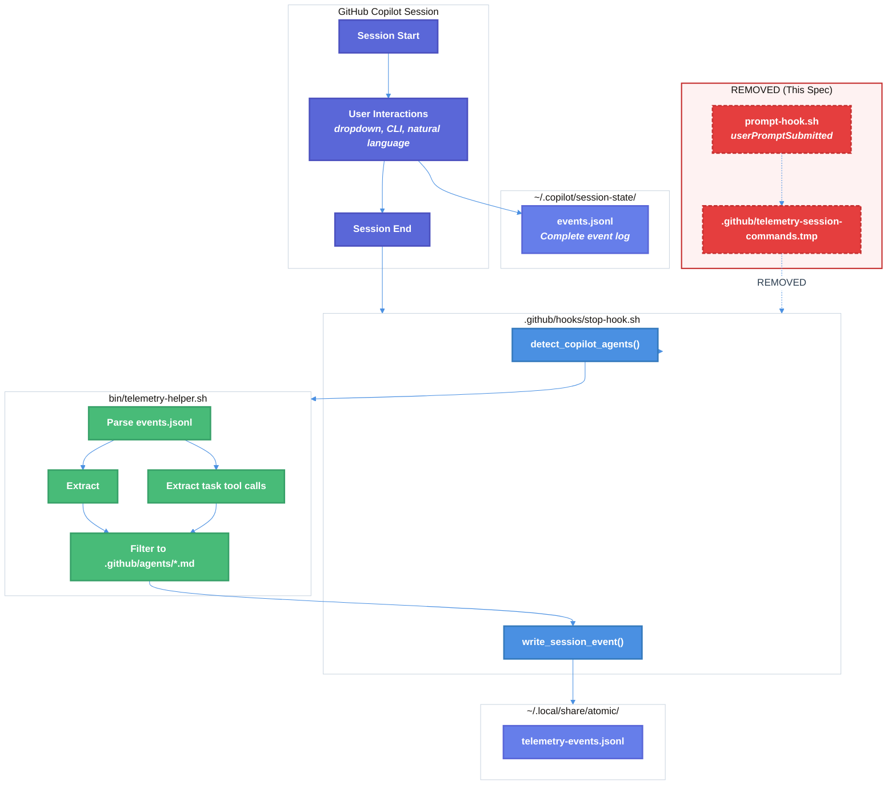

# Copilot Agent Detection Refactoring Technical Design Document

| Document Metadata      | Details                                                                |
| ---------------------- | ---------------------------------------------------------------------- |
| Author(s)              | flora131                                                               |
| Status                 | Draft (WIP)                                                            |
| Team / Owner           | flora131/atomic                                                        |
| Created / Last Updated | 2026-01-24                                                             |

## 1. Executive Summary

This spec proposes refactoring the GitHub Copilot telemetry system to replace slash command detection with instruction header-based agent detection. The current implementation uses a two-hook architecture (prompt submission + session end) with temp file communication to track slash commands—this is unnecessary and unreliable for Copilot. The new approach parses `events.jsonl` from Copilot's session state directory to detect which custom agents (from `.github/agents/`) were invoked. This eliminates the `userPromptSubmitted` hook, removes temp file dependencies, and provides accurate agent usage telemetry without adding per-prompt latency.

**Research Reference:** [research/docs/2026-01-24-copilot-agent-detection-refactoring.md](../research/docs/2026-01-24-copilot-agent-detection-refactoring.md)

## 2. Context and Motivation

### 2.1 Current State

The Copilot telemetry system uses a **Mediator Pattern** with temp file communication between two hooks:

```
┌─────────────────────────────────────────────────────────────────────────┐
│ CURRENT ARCHITECTURE                                                     │
├─────────────────────────────────────────────────────────────────────────┤
│                                                                          │
│  userPromptSubmitted hook (prompt-hook.sh)                               │
│       │                                                                  │
│       ▼                                                                  │
│  extract_commands(prompt) → Regex matching for /slash-commands           │
│       │                                                                  │
│       ▼                                                                  │
│  .github/telemetry-session-commands.tmp  ← Mediator (temp file)          │
│       │                                                                  │
│       ▼                                                                  │
│  sessionEnd hook (stop-hook.sh:217-244)                                  │
│       │                                                                  │
│       └── write_session_event("copilot", ACCUMULATED_COMMANDS)           │
│                                                                          │
└─────────────────────────────────────────────────────────────────────────┘
```

**Architecture:**
- `.github/hooks/hooks.json:13-19` - Configures `userPromptSubmitted` hook
- `.github/hooks/prompt-hook.sh` - Extracts slash commands from each prompt
- `.github/hooks/stop-hook.sh:217-244` - Reads temp file and writes telemetry
- `bin/telemetry-helper.sh:119-163` - `extract_commands()` function for regex matching

**Limitations:**
- **Wrong detection target:** Detects slash commands (e.g., `/commit`), not custom agent invocations
- **Hardcoded agent type:** Always records `"copilot"` with no granularity on which `.github/agents/*.md` agent was used
- **Per-prompt latency:** Hook runs on every prompt submission, adding overhead
- **Brittle communication:** Temp file is race-condition-prone and can be orphaned

### 2.2 The Problem

- **Telemetry Gap:** We cannot track which custom agents (e.g., `explain-code`, `create-spec`, `implement-feature`) are being used in Copilot sessions
- **Data Quality:** Slash command tracking is meaningless for Copilot—users invoke agents via dropdown, natural language, or CLI flags, not by typing `/slash-commands`
- **Performance:** Running a hook on every prompt submission adds latency without value
- **Maintenance Burden:** Two hooks + temp file is more complex than necessary

**Critical Insight from Research:** GitHub Copilot stores complete session events in `~/.copilot/session-state/<session-id>/events.jsonl`. Agent invocations can be detected by:
1. Parsing `<agent_instructions>` in `transformedContent` (dropdown/CLI invocations)
2. Extracting `agent_type` from `task` tool calls (natural language invocations)

See: [research/docs/2026-01-24-copilot-agent-detection-findings.md](../research/docs/2026-01-24-copilot-agent-detection-findings.md)

## 3. Goals and Non-Goals

### 3.1 Functional Goals

- [ ] Remove `userPromptSubmitted` hook from Copilot configuration
- [ ] Delete `.github/hooks/prompt-hook.sh` (entire file)
- [ ] Remove temp file logic from `.github/hooks/stop-hook.sh`
- [ ] Implement `detect_copilot_agents()` function in `bin/telemetry-helper.sh`
- [ ] Detect agents from `events.jsonl` using instruction header parsing
- [ ] Detect agents from `task` tool calls for natural language invocations
- [ ] Filter detected agents to only those with `.github/agents/<name>.md` files
- [ ] Preserve event repetition (no deduplication) to track usage frequency
- [ ] Maintain backward compatibility with existing telemetry event schema

### 3.2 Non-Goals (Out of Scope)

- [ ] We will NOT modify Claude Code telemetry (`.claude/hooks/telemetry-stop.sh`)
- [ ] We will NOT modify OpenCode telemetry (`.opencode/plugin/telemetry.ts`)
- [ ] We will NOT change the `AgentSessionEvent` schema field names (keep `commands` for backward compatibility)
- [ ] We will NOT implement Windows PowerShell support in this iteration
- [ ] We will NOT add dynamic header mapping generation (static lookup table is acceptable)
- [ ] We will NOT parse multiple sessions (only most recent session)

## 4. Proposed Solution (High-Level Design)

### 4.1 System Architecture Diagram



### 4.2 Architectural Pattern

**Strategy Pattern:** The `detect_copilot_agents()` function encapsulates the agent detection algorithm, making it interchangeable if detection logic needs to change. Each agent type (Claude, OpenCode, Copilot) has its own detection strategy without affecting others.

**Hook Isolation by Directory:**
```
Copilot:   .github/hooks/stop-hook.sh    ← Configured in .github/hooks/hooks.json
Claude:    .claude/hooks/telemetry-stop.sh ← Configured in .claude/settings.json
OpenCode:  .opencode/plugin/telemetry.ts  ← Plugin event system
```

### 4.3 Key Components

| Component | Responsibility | Technology | Justification |
|-----------|---------------|------------|---------------|
| `detect_copilot_agents()` | Parse events.jsonl for agent invocations | Bash + jq | Consistent with existing shell-based hooks |
| `AGENT_INSTRUCTION_HEADERS` | Map instruction header text to agent names | Bash associative array | Static lookup for maintainability |
| `stop-hook.sh` (modified) | Call detection function at session end | Bash | Existing hook, minimal changes |

## 5. Detailed Design

### 5.1 Files to Delete

| File | Reason |
|------|--------|
| `.github/hooks/prompt-hook.sh` | No longer needed—slash command accumulation removed |

### 5.2 Files to Modify

#### 5.2.1 `.github/hooks/hooks.json`

**Remove lines 13-19** (`userPromptSubmitted` hook):

```diff
 {
   "version": 1,
   "hooks": {
     "sessionStart": [
       {
         "type": "command",
         "bash": "./.github/scripts/start-ralph-session.sh",
         "powershell": "./.github/scripts/start-ralph-session.ps1",
         "cwd": ".",
         "timeoutSec": 10
       }
     ],
-    "userPromptSubmitted": [
-      {
-        "type": "command",
-        "bash": "./.github/hooks/prompt-hook.sh",
-        "cwd": ".",
-        "timeoutSec": 5
-      }
-    ],
     "sessionEnd": [
       {
         "type": "command",
         "bash": "./.github/hooks/stop-hook.sh",
         "powershell": "./.github/hooks/stop-hook.ps1",
         "cwd": ".",
         "timeoutSec": 30
       }
     ]
   }
 }
```

#### 5.2.2 `.github/hooks/stop-hook.sh`

**Replace telemetry section (lines 210-244):**

**Before:**
```bash
# ============================================================================
# TELEMETRY TRACKING
# ============================================================================
# Track agent session telemetry (Atomic slash commands used)
# Commands are accumulated during the session via userPromptSubmitted hook
# and read from temp file here at session end.

TELEMETRY_HELPER="$PROJECT_ROOT/bin/telemetry-helper.sh"
COMMANDS_TEMP_FILE=".github/telemetry-session-commands.tmp"

# Source telemetry helper if available
if [[ -f "$TELEMETRY_HELPER" ]]; then
  # shellcheck source=../../bin/telemetry-helper.sh
  source "$TELEMETRY_HELPER"

  if is_telemetry_enabled; then
    # Read accumulated commands from temp file (populated by userPromptSubmitted hook)
    # Keep all occurrences to track actual usage frequency (no deduplication)
    ACCUMULATED_COMMANDS=""
    if [[ -f "$COMMANDS_TEMP_FILE" ]]; then
      # Read all commands and convert to comma-separated (preserving duplicates for usage tracking)
      ACCUMULATED_COMMANDS=$(cat "$COMMANDS_TEMP_FILE" | tr '\n' ',' | sed 's/,$//')
    fi

    # Write telemetry event with accumulated commands
    write_session_event "copilot" "$ACCUMULATED_COMMANDS"

    # Clean up temp file
    rm -f "$COMMANDS_TEMP_FILE"

    # Spawn upload process
    # Atomic file operations prevent duplicate uploads even if multiple processes spawn
    spawn_upload_process
  fi
fi
```

**After:**
```bash
# ============================================================================
# TELEMETRY TRACKING
# ============================================================================
# Track agent session telemetry by detecting custom agents from events.jsonl
# Agents are detected from instruction headers or task tool calls in Copilot's
# session state directory.

TELEMETRY_HELPER="$PROJECT_ROOT/bin/telemetry-helper.sh"

# Source telemetry helper if available
if [[ -f "$TELEMETRY_HELPER" ]]; then
  # shellcheck source=../../bin/telemetry-helper.sh
  source "$TELEMETRY_HELPER"

  if is_telemetry_enabled; then
    # Detect agents from Copilot session events.jsonl
    DETECTED_AGENTS=$(detect_copilot_agents)

    # Write telemetry event with detected agents
    write_session_event "copilot" "$DETECTED_AGENTS"

    # Spawn upload process
    spawn_upload_process
  fi
fi
```

#### 5.2.3 `bin/telemetry-helper.sh`

**Add new function after `extract_commands()` (around line 165):**

```bash
# ============================================================================
# COPILOT AGENT DETECTION
# ============================================================================

# Agent instruction header mappings
# Maps the header text found in <agent_instructions> to the agent filename (without .md)
# These headers come from the H1 line or first content line after frontmatter in agent files
declare -A AGENT_INSTRUCTION_HEADERS=(
  # Agents with explicit H1 headers
  ["Analyze and Explain Code Functionality"]="explain-code"
  ["Smart Git Commit"]="commit"
  ["Create Pull Request Command"]="create-gh-pr"
  ["Research Codebase"]="research-codebase"
  ["Cancel Ralph"]="cancel-ralph"
  ["Ralph Wiggum Help"]="ralph-help"
  ["Ralph Loop Command"]="ralph-loop"

  # Agents without H1 headers - use first distinctive text from content
  # These need to match the text injected into transformedContent
  ["You are tasked with creating a spec"]="create-spec"
  ["You are tasked with creating a detailed"]="create-feature-list"
  ["You are tasked with implementing a SINGLE feature"]="implement-feature"
  ["You are tasked with conducting comprehensive research"]="research-codebase"
)

# Detect agents from Copilot session events.jsonl
# Parses the most recent session's events to find agent invocations
# Returns: comma-separated list of detected agent names (preserving duplicates)
detect_copilot_agents() {
  local copilot_state_dir="$HOME/.copilot/session-state"

  # Early exit if Copilot state directory doesn't exist
  if [[ ! -d "$copilot_state_dir" ]]; then
    return
  fi

  # Find the most recent session directory
  local latest_session
  latest_session=$(ls -td "$copilot_state_dir"/*/ 2>/dev/null | head -1)

  if [[ -z "$latest_session" ]]; then
    return
  fi

  local events_file="$latest_session/events.jsonl"

  if [[ ! -f "$events_file" ]]; then
    return
  fi

  local found_agents=()

  # Parse events.jsonl line by line
  while IFS= read -r line; do
    [[ -z "$line" ]] && continue

    # Check event type
    local event_type
    event_type=$(echo "$line" | jq -r '.type // empty' 2>/dev/null)

    # Method 1: Check user.message for <agent_instructions> in transformedContent
    # This handles dropdown invocation and CLI --agent flag
    if [[ "$event_type" == "user.message" ]]; then
      local transformed_content
      transformed_content=$(echo "$line" | jq -r '.data.transformedContent // empty' 2>/dev/null)

      if [[ -n "$transformed_content" ]] && [[ "$transformed_content" == *"<agent_instructions>"* ]]; then
        # Try to match against known instruction headers
        for header in "${!AGENT_INSTRUCTION_HEADERS[@]}"; do
          if [[ "$transformed_content" == *"$header"* ]]; then
            local agent_name="${AGENT_INSTRUCTION_HEADERS[$header]}"
            # Only include if .github/agents/<agent>.md exists
            if [[ -f ".github/agents/${agent_name}.md" ]]; then
              found_agents+=("$agent_name")
            fi
            break  # Only one agent per user.message
          fi
        done
      fi
    fi

    # Method 2: Check assistant.message for task tool calls with agent_type
    # This handles natural language invocations like "use explain-code to..."
    if [[ "$event_type" == "assistant.message" ]]; then
      # Extract agent_type from task tool calls
      local agent_types
      agent_types=$(echo "$line" | jq -r '.data.toolRequests[]? | select(.name == "task") | .arguments.agent_type // empty' 2>/dev/null)

      for agent_name in $agent_types; do
        if [[ -n "$agent_name" ]] && [[ -f ".github/agents/${agent_name}.md" ]]; then
          found_agents+=("$agent_name")
        fi
      done
    fi

    # Method 3: Check tool.execution_complete for agent_name in telemetry
    # This is a fallback that captures agents from tool telemetry
    if [[ "$event_type" == "tool.execution_complete" ]]; then
      local tool_agent_name
      tool_agent_name=$(echo "$line" | jq -r '.data.toolTelemetry.properties.agent_name // empty' 2>/dev/null)

      if [[ -n "$tool_agent_name" ]] && [[ -f ".github/agents/${tool_agent_name}.md" ]]; then
        found_agents+=("$tool_agent_name")
      fi
    fi

  done < "$events_file"

  # Return comma-separated list (preserving duplicates for frequency tracking)
  if [[ ${#found_agents[@]} -gt 0 ]]; then
    printf '%s\n' "${found_agents[@]}" | tr '\n' ',' | sed 's/,$//'
  fi
}
```

### 5.3 Agent Header Mapping Details

The mapping between agent files and detection patterns is critical. Based on analysis of `.github/agents/*.md` files:

| Agent File | Detection Pattern | Pattern Source |
|------------|-------------------|----------------|
| `explain-code.md` | `"Analyze and Explain Code Functionality"` | H1 header (line 14) |
| `commit.md` | `"Smart Git Commit"` | H1 header (line 9) |
| `create-gh-pr.md` | `"Create Pull Request Command"` | H1 header (line 9) |
| `research-codebase.md` | `"Research Codebase"` | H1 header (line 9) |
| `cancel-ralph.md` | `"Cancel Ralph"` | H1 header |
| `ralph-help.md` | `"Ralph Wiggum Help"` | H1 header |
| `ralph-loop.md` | `"Ralph Loop Command"` | H1 header |
| `create-spec.md` | `"You are tasked with creating a spec"` | First content line |
| `create-feature-list.md` | `"You are tasked with creating a detailed"` | First content line |
| `implement-feature.md` | `"You are tasked with implementing a SINGLE feature"` | First content line |

**Note:** Some agents (codebase-analyzer, codebase-locator, etc.) have no distinctive headers. These are sub-agents typically invoked by other agents, so they may appear in Method 2 (task tool calls) but not Method 1 (instruction headers).

### 5.4 Detection Algorithm Flow

```
┌─────────────────────────────────────────────────────────────────────────┐
│ detect_copilot_agents() Algorithm                                        │
├─────────────────────────────────────────────────────────────────────────┤
│                                                                          │
│  1. Find latest session: ~/.copilot/session-state/                       │
│     └── Sort by modification time, take most recent                      │
│                                                                          │
│  2. Parse events.jsonl line by line:                                     │
│                                                                          │
│     For each event:                                                      │
│     ├── IF type == "user.message":                                       │
│     │   └── IF transformedContent contains "<agent_instructions>":       │
│     │       └── Match against AGENT_INSTRUCTION_HEADERS                  │
│     │           └── IF agent file exists: add to found_agents            │
│     │                                                                    │
│     ├── IF type == "assistant.message":                                  │
│     │   └── Extract agent_type from task tool calls                      │
│     │       └── IF agent file exists: add to found_agents                │
│     │                                                                    │
│     └── IF type == "tool.execution_complete":                            │
│         └── Extract agent_name from toolTelemetry                        │
│             └── IF agent file exists: add to found_agents                │
│                                                                          │
│  3. Return comma-separated list (preserving duplicates)                  │
│                                                                          │
└─────────────────────────────────────────────────────────────────────────┘
```

### 5.5 Event Schema Compatibility

The existing `AgentSessionEvent` schema is preserved:

```typescript
interface AgentSessionEvent {
  anonymousId: string;
  eventId: string;
  sessionId: string;
  eventType: "agent_session";
  timestamp: string;
  agentType: "copilot" | "claude" | "opencode";
  commands: string[];     // Now contains agent names, not slash commands
  commandCount: number;   // Count of agent invocations
  platform: string;
  atomicVersion: string;
  source: "session_hook";
}
```

**Example output after refactoring:**
```json
{
  "anonymousId": "abc123",
  "eventId": "def456",
  "sessionId": "def456",
  "eventType": "agent_session",
  "timestamp": "2026-01-24T10:30:00Z",
  "agentType": "copilot",
  "commands": ["explain-code", "commit", "explain-code"],
  "commandCount": 3,
  "platform": "darwin",
  "atomicVersion": "0.5.0",
  "source": "session_hook"
}
```

## 6. Alternatives Considered

| Option | Pros | Cons | Reason for Rejection |
|--------|------|------|---------------------|
| **A: Keep userPromptSubmitted hook** | No changes needed | Detects wrong thing (slash commands), adds latency | Current approach is fundamentally flawed for Copilot |
| **B: Real-time file watching** | Immediate detection | Complex, race conditions, resource overhead | Over-engineered for telemetry use case |
| **C: Parse events.jsonl at session end (Selected)** | Simple, accurate, no latency per-prompt | Reads file at end only | **Selected:** Matches our telemetry cadence |
| **D: Dynamic header extraction from agent files** | Auto-updates with agent changes | More complex, may have parsing edge cases | Maintenance overhead not justified; static map is simpler |

## 7. Cross-Cutting Concerns

### 7.1 Security and Privacy

- **No New Data Collection:** This change restructures how we detect agents, not what we collect
- **Agent Names Only:** Only agent names are recorded, no user prompts or content
- **Local File Access:** Only reads from `~/.copilot/session-state/`, which Copilot already creates
- **Consent Check:** `is_telemetry_enabled()` is called before any detection or writing

### 7.2 Observability Strategy

- **Logging:** Detection failures silently return empty string (Null Object Pattern)
- **Debugging:** `echo` statements to stderr can be added temporarily for troubleshooting
- **Validation:** After deployment, compare telemetry data quality vs. before

### 7.3 Scalability and Capacity Planning

- **Event File Size:** `events.jsonl` can grow large for long sessions; reading line-by-line avoids memory issues
- **Performance:** jq parsing is fast; detection runs once at session end only
- **No Network Impact:** Detection is entirely local

### 7.4 Design Principles Applied (GoF)

1. **Strategy Pattern:** `detect_copilot_agents()` encapsulates the detection algorithm
2. **Template Method:** `write_session_event()` provides consistent event structure
3. **Null Object:** Empty string return when no agents detected (vs. null/error)
4. **Single Responsibility:** Each function has one job

## 8. Migration, Rollout, and Testing

### 8.1 Deployment Strategy

- [ ] **Phase 1:** Implement changes on feature branch
- [ ] **Phase 2:** Manual testing with all three invocation methods (dropdown, CLI, natural language)
- [ ] **Phase 3:** Code review and merge to main
- [ ] **Phase 4:** Monitor telemetry data quality post-deployment

### 8.2 Data Migration Plan

No data migration needed. The change affects how new events are generated, not historical data.

### 8.3 Test Plan

**Unit Tests:**
- [ ] `detect_copilot_agents()` returns empty when no session directory exists
- [ ] `detect_copilot_agents()` returns empty when events.jsonl is missing
- [ ] `detect_copilot_agents()` extracts agent from `<agent_instructions>` correctly
- [ ] `detect_copilot_agents()` extracts agent_type from task tool calls correctly
- [ ] `detect_copilot_agents()` filters to only existing agent files
- [ ] `detect_copilot_agents()` preserves duplicates for frequency tracking

**Integration Tests:**
- [ ] End-to-end test with mock events.jsonl file
- [ ] Verify hooks.json loads correctly after removing userPromptSubmitted

**Manual Tests:**
- [ ] Invoke agent via dropdown → verify detection
- [ ] Invoke agent via `copilot --agent=explain-code --prompt "..."` → verify detection
- [ ] Invoke agent via natural language "use explain-code to..." → verify detection
- [ ] Verify no telemetry written when telemetry disabled

## 9. Open Questions / Unresolved Issues

### 9.1 Flagged Items for Review

1. **Header Mapping Completeness:** The `AGENT_INSTRUCTION_HEADERS` mapping may be incomplete. Some agents without H1 headers use their first content line as the detection pattern. **Recommendation:** Audit all 17 agent files and verify detection patterns work.

2. **Sub-agent Detection:** Agents like `codebase-analyzer` are typically invoked as sub-agents via `task` tool calls. The current design captures these in Method 2, but they won't appear in Method 1. **Question:** Should sub-agents be tracked separately or filtered out? Answer: If we log the subagents its okay for now, no need to filter out or try to include.

3. **Multiple Sessions:** The current design only reads the most recent session. If Copilot supports parallel sessions, we may miss data. **Question:** Is this a real scenario, and if so, should we track all active sessions? Answer: It's unlikely that sessions end at the exact same time even if parallel so we just take this as it is.

4. **Windows Support:** The PowerShell equivalent (`stop-hook.ps1`) is not addressed in this spec. **Question:** Is Windows Copilot CLI used in this project, and if so, should we update it simultaneously? Answer: We'll do windows after.

5. **Performance:** Reading `events.jsonl` at session end adds latency (likely <100ms). **Question:** Is this acceptable, or should we consider caching during session? Answer: This is acceptable.

### 9.2 Resolved Decisions

- ✅ **Event Schema:** Keep `commands` field name for backward compatibility (decided)
- ✅ **Duplicate Handling:** Preserve duplicates to track usage frequency (decided)
- ✅ **Detection Priority:** Try instruction header first, then task tool calls, then tool telemetry (decided)

---

## Appendix A: Complete File Deletion List

| File | Lines of Code | Action |
|------|---------------|--------|
| `.github/hooks/prompt-hook.sh` | 57 | DELETE |

## Appendix B: Complete File Modification Summary

| File | Lines Changed | Nature of Change |
|------|---------------|------------------|
| `.github/hooks/hooks.json` | -7 | Remove userPromptSubmitted block |
| `.github/hooks/stop-hook.sh` | -15, +8 | Replace temp file logic with detect function |
| `bin/telemetry-helper.sh` | +75 | Add detect_copilot_agents() function |

## Appendix C: Files Unchanged (Verification Checklist)

- [ ] `.claude/hooks/telemetry-stop.sh` - No changes (Claude Code uses different detection)
- [ ] `.opencode/plugin/telemetry.ts` - No changes (OpenCode uses different mechanism)
- [ ] `src/utils/telemetry/*.ts` - No changes (TypeScript code unaffected)
- [ ] `.github/agents/*.md` - No changes (agent files are only read, not modified)
