# Atomic CLI Cross-Platform Support Technical Design Document

| Document Metadata      | Details         |
| ---------------------- | --------------- |
| Author(s)              | Alex Lavaee     |
| Status                 | Draft (WIP)     |
| Team / Owner           | flora131/atomic |
| Created / Last Updated | 2026-01-20      |

## 1. Executive Summary

This RFC proposes improvements to the Atomic CLI's cross-platform compatibility, specifically addressing **two critical Windows issues** identified through testing and user reports: (1) agent commands not executing on Windows due to command path resolution, and (2) unexpected file overwriting behavior during re-initialization. The proposed solution involves using resolved command paths from `Bun.which()` when spawning processes, normalizing path separators in exclusion matching, and refining the `--force` flag behavior. With this change, `--force` will overwrite config folder files but **always preserve** `CLAUDE.md` and `AGENTS.md` to protect user customizations. These changes will enable reliable Windows operation while maintaining existing Unix behavior.

**Research Reference:** [research/docs/2026-01-20-cross-platform-support.md](../research/docs/2026-01-20-cross-platform-support.md)

## 2. Context and Motivation

### 2.1 Current State

The Atomic CLI demonstrates **strong cross-platform design intent** with several well-implemented patterns:

- **Platform Detection**: Centralized in `src/utils/detect.ts` with `isWindows()`, `isMacOS()`, `isLinux()` functions
- **Path Handling**: Primarily uses `path.join()`, `path.resolve()`, `path.relative()`, and `path.sep`
- **Process Spawning**: Uses `Bun.spawn()` with command arrays (not shell strings)
- **Script Filtering**: Automatically excludes platform-opposite scripts (`.ps1` on Unix, `.sh` on Windows)

**Architecture:**

```
src/
├── index.ts              # Entry point, CLI routing
├── config.ts             # Agent definitions (AgentConfig)
├── commands/
│   ├── init.ts           # Interactive setup, file copying
│   └── run-agent.ts      # Agent spawning
└── utils/
    ├── detect.ts         # Platform detection (isWindows, isCommandInstalled)
    ├── copy.ts           # File operations (copyDir, copyFile)
    └── merge.ts          # JSON merging
```

**Limitations (per research findings):**

| Issue                                         | Location           | Impact                              |
| --------------------------------------------- | ------------------ | ----------------------------------- |
| Command path not resolved before spawn        | `run-agent.ts:104` | Agent commands fail on Windows      |
| Hardcoded forward slash in exclusion matching | `copy.ts:78`       | Exclusions may not match on Windows |
| Force flag bypasses file preservation         | `init.ts:228-230`  | User files unexpectedly overwritten |

### 2.2 The Problem

**Research Reference:** Section "Follow-up Research [2026-01-20]" in the research document details both reported issues.

#### Issue 1: Agent Commands Not Working on Windows

- **Reported Behavior**: Commands like `atomic -a opencode -- run --command commit` work on macOS/Linux but fail on Windows
- **Root Cause**: On Windows, commands like `opencode` may be installed as `opencode.cmd` or `opencode.exe`. While `Bun.which()` can find them, `Bun.spawn()` is called with the bare command name instead of the resolved path.

**Code Evidence** ([detect.ts:11-13](../src/utils/detect.ts) vs [run-agent.ts:104](../src/commands/run-agent.ts)):

```typescript
// detect.ts - checks if command exists
export function isCommandInstalled(cmd: string): boolean {
  return Bun.which(cmd) !== null;  // Returns full path like "C:\...\opencode.cmd"
}

// run-agent.ts - spawns with bare command name (PROBLEM)
const cmd = [agent.cmd, ...flags, ...agentArgs];  // Uses "opencode", not resolved path
const proc = Bun.spawn(cmd, {...});
```

#### Issue 2: CLAUDE.md and AGENTS.md Overwritten

- **Reported Behavior**: Files marked in `preserve_files` are overwritten when user confirms "Overwrite config files?"
- **Root Cause**: The confirmation prompt asks about "config files" but the `shouldForce` flag it sets bypasses ALL preservation logic, including for root-level files like `CLAUDE.md` and `AGENTS.md`.

**Code Evidence** ([init.ts:178-199](../src/commands/init.ts)):

```typescript
// User says "Yes" to overwrite config folder
if (folderExists && !shouldForce) {
  const update = await confirm({
    message: `${agent.folder} already exists. Overwrite config files?`,  // Misleading
    // ...
  });
  shouldForce = true;  // This bypasses preserve_files check later
}

// Later, at line 228-230:
if (shouldForce) {
  await copyFile(srcFile, destFile);  // Bypasses preservation!
  continue;
}
```

#### Issue 3: Path Separator Mismatch (Potential)

- **Location**: `copy.ts:78`
- **Problem**: Uses hardcoded forward slash (`/`) in exclusion path matching, but `path.relative()` returns backslash-separated paths on Windows.

```typescript
// copy.ts:78 - potential issue on Windows
if (relativePath === ex || relativePath.startsWith(`${ex}/`)) {
```

## 3. Goals and Non-Goals

### 3.1 Functional Goals

- [ ] **G1**: Agent commands execute successfully on Windows by using resolved command paths
- [ ] **G2**: File preservation (`preserve_files`) works correctly regardless of force/overwrite confirmation
- [ ] **G3**: Path exclusion matching works correctly with Windows backslash paths
- [ ] **G4**: Maintain 100% backward compatibility on Unix systems
- [ ] **G5**: Clear user messaging distinguishing "config folder overwrite" from "root file overwrite"

### 3.2 Non-Goals (Out of Scope)

- [ ] We will NOT add new platform-specific features (WSL integration beyond detection)
- [ ] We will NOT change the file copy mechanism (Bun.file/Bun.write)
- [ ] We will NOT add symlink creation on Windows (current dereference approach is correct)
- [ ] We will NOT add Windows-specific shell invocation (cmd.exe, powershell.exe)
- [ ] We will NOT address the @clack/prompts stdin raw mode issue (#408) - upstream dependency

## 4. Proposed Solution (High-Level Design)

### 4.1 System Architecture Diagram

```mermaid
%%{init: {'theme':'base', 'themeVariables': { 'primaryColor':'#f8f9fa','primaryTextColor':'#2c3e50','primaryBorderColor':'#4a5568','lineColor':'#4a90e2','secondaryColor':'#ffffff','tertiaryColor':'#e9ecef','background':'#f5f7fa','mainBkg':'#f8f9fa','nodeBorder':'#4a5568','clusterBkg':'#ffffff','clusterBorder':'#cbd5e0','edgeLabelBackground':'#ffffff'}}}%%

flowchart TB
    classDef fixed fill:#48bb78,stroke:#38a169,stroke-width:2.5px,color:#ffffff,font-weight:600
    classDef current fill:#4a90e2,stroke:#357abd,stroke-width:2.5px,color:#ffffff,font-weight:600
    classDef external fill:#718096,stroke:#4a5568,stroke-width:2.5px,color:#ffffff,font-weight:600,stroke-dasharray:6 3

    subgraph Changes["Proposed Changes"]
        direction TB
        
        subgraph Fix1["Fix 1: Command Resolution"]
            WhichCheck["Bun.which(cmd)"]:::current
            ResolvedPath["Use resolved path<br>in Bun.spawn()"]:::fixed
            WhichCheck -->|"Returns full path"| ResolvedPath
        end
        
        subgraph Fix2["Fix 2: Preserve Logic"]
            UserConfirm["User confirms<br>'Overwrite config?'"]:::current
            ForceFlag["shouldForce = true"]:::current
            PreserveCheck["Check preserve_files<br>BEFORE force copy"]:::fixed
            UserConfirm --> ForceFlag
            ForceFlag --> PreserveCheck
        end
        
        subgraph Fix3["Fix 3: Path Separator"]
            RelativePath["path.relative()"]:::current
            Normalize["Normalize to<br>forward slashes"]:::fixed
            ExcludeMatch["Exclusion matching"]:::current
            RelativePath --> Normalize
            Normalize --> ExcludeMatch
        end
    end

    subgraph Impact["Impact"]
        Windows["Windows<br>Commands work"]:::fixed
        Preserve["Files preserved<br>correctly"]:::fixed
        PathMatch["Exclusions work<br>cross-platform"]:::fixed
    end

    Fix1 --> Windows
    Fix2 --> Preserve
    Fix3 --> PathMatch
```



### 4.2 Architectural Pattern

We are adopting a **Defense in Depth** pattern where:

1. **Command Resolution**: Resolve paths at the earliest point (detection) and use them at the latest point (spawning)
2. **File Preservation**: Preservation logic takes precedence over force flags for designated files
3. **Path Normalization**: Normalize paths to a canonical form before comparison

### 4.3 Key Components

| Component      | Change                                              | File:Line     | Justification                                                       |
| -------------- | --------------------------------------------------- | ------------- | ------------------------------------------------------------------- |
| `detect.ts`    | Add `getCommandPath()` function                     | New function  | Returns resolved path from `Bun.which()` for use in spawn           |
| `run-agent.ts` | Use resolved path in `Bun.spawn()`                  | Line 104      | Ensures Windows `.cmd`/`.exe` wrappers are invoked correctly        |
| `init.ts`      | Separate config folder force from preserve_files    | Lines 178-247 | Maintains user customizations regardless of config overwrite choice |
| `copy.ts`      | Normalize path separators before exclusion matching | Line 78       | Ensures exclusions work on Windows                                  |

## 5. Detailed Design

### 5.1 Fix 1: Command Path Resolution

**Research Reference:** Section "Issue 1: Agent Commands Not Working on Windows" in the research document.

#### New Utility Function

**File:** `src/utils/detect.ts`

```typescript
/**
 * Get the full path to a command
 * Returns null if command is not installed
 * 
 * On Windows, this resolves to the full path including extension
 * (e.g., "C:\Users\...\opencode.cmd")
 */
export function getCommandPath(cmd: string): string | null {
  return Bun.which(cmd);
}
```

#### Modified Agent Spawning

**File:** `src/commands/run-agent.ts` (Lines 92-116)

**Before:**

```typescript
// Check if command is installed
if (!isCommandInstalled(agent.cmd)) {
  console.error(`Error: ${agent.name} is not installed.`);
  console.error(`Install it from: ${agent.install_url}`);
  return 1;
}

// Build the command with flags and user-provided arguments
const flags = agent.additional_flags.map((flag) =>
  flag === "." ? process.cwd() : flag
);
const cmd = [agent.cmd, ...flags, ...agentArgs];  // Uses bare name

const proc = Bun.spawn(cmd, {...});
```

**After:**

```typescript
import { getCommandPath } from "../utils/detect";

// Get the resolved command path (handles Windows .cmd/.exe wrappers)
const cmdPath = getCommandPath(agent.cmd);
if (!cmdPath) {
  console.error(`Error: ${agent.name} is not installed.`);
  console.error(`Install it from: ${agent.install_url}`);
  return 1;
}

// Build the command with resolved path, flags, and user-provided arguments
const flags = agent.additional_flags.map((flag) =>
  flag === "." ? process.cwd() : flag
);
const cmd = [cmdPath, ...flags, ...agentArgs];  // Uses resolved path

if (isDebug) {
  console.error(`[atomic:debug] Resolved command path: ${cmdPath}`);
  console.error(`[atomic:debug] Spawning command: ${cmd.join(" ")}`);
}

const proc = Bun.spawn(cmd, {
  stdin: "inherit",
  stdout: "inherit", 
  stderr: "inherit",
  cwd: process.cwd(),
});
```

### 5.2 Fix 2: File Preservation Logic

**Research Reference:** Section "Issue 2: CLAUDE.md and AGENTS.md Overwritten on Windows" in the research document.

#### Conceptual Change

The current implementation conflates two distinct behaviors:

1. **Config folder overwrite**: Overwrite files inside `.claude/`, `.opencode/`, `.github/`
2. **Root file overwrite**: Overwrite `CLAUDE.md`, `AGENTS.md` at project root

The fix separates these concerns:

- `--force` (or `-f`): Overwrites ALL files **except** `preserve_files` (CLAUDE.md, AGENTS.md)
- `preserve_files`: Always protected, regardless of `--force` flag

#### Force Flag Behavior Matrix

| File Type           | Example                  | Without `--force`  | With `--force`     |
| ------------------- | ------------------------ | ------------------ | ------------------ |
| Config folder files | `.claude/settings.json`  | Skip if exists     | **Overwrite**      |
| Config folder files | `.opencode/agents/*.md`  | Skip if exists     | **Overwrite**      |
| Merge files         | `.mcp.json`              | Merge if exists    | Merge if exists    |
| **Preserve files**  | `CLAUDE.md`, `AGENTS.md` | **Skip if exists** | **Skip if exists** |
| New files           | Any file not at dest     | Copy               | Copy               |

**Key Point**: The `--force` flag enables overwriting of config folder contents and non-preserved additional files, but **never** overwrites files in `preserve_files`. This protects user customizations in `CLAUDE.md` and `AGENTS.md`.

#### Modified Additional Files Loop

**File:** `src/commands/init.ts` (Lines 216-247)

**Before:**

```typescript
// Copy additional files with preservation and merge logic
for (const file of agent.additional_files) {
  const srcFile = join(configRoot, file);
  const destFile = join(targetDir, file);

  if (!(await pathExists(srcFile))) continue;

  const destExists = await pathExists(destFile);
  const shouldPreserve = agent.preserve_files.includes(file);
  const shouldMerge = agent.merge_files.includes(file);

  // Force flag (or user-confirmed overwrite) bypasses all preservation/merge logic
  if (shouldForce) {
    await copyFile(srcFile, destFile);
    continue;
  }

  // Handle merge files (e.g., .mcp.json)
  if (shouldMerge && destExists) {
    await mergeJsonFile(srcFile, destFile);
    continue;
  }

  // Handle preserve files (e.g., CLAUDE.md, AGENTS.md)
  if (shouldPreserve && destExists) {
    continue;
  }

  // Default: copy the file
  await copyFile(srcFile, destFile);
}
```

**After:**

```typescript
// Copy additional files with preservation and merge logic
// 
// --force behavior:
//   - DOES overwrite: config folder files, non-preserved additional files
//   - Does NOT overwrite: preserve_files (CLAUDE.md, AGENTS.md)
//
for (const file of agent.additional_files) {
  const srcFile = join(configRoot, file);
  const destFile = join(targetDir, file);

  if (!(await pathExists(srcFile))) continue;

  const destExists = await pathExists(destFile);
  const shouldPreserve = agent.preserve_files.includes(file);
  const shouldMerge = agent.merge_files.includes(file);

  // CRITICAL: preserve_files (CLAUDE.md, AGENTS.md) are NEVER overwritten
  // This is intentional - even --force doesn't override these files
  // Rationale: These contain user customizations that should never be lost
  if (shouldPreserve && destExists) {
    if (isDebug) {
      console.error(`[atomic:debug] Preserving user file: ${file}`);
    }
    continue;
  }

  // Handle merge files (e.g., .mcp.json)
  // Merge happens regardless of force - we want to add new entries while keeping existing
  if (shouldMerge && destExists) {
    await mergeJsonFile(srcFile, destFile);
    continue;
  }

  // For non-preserved, non-merged files: --force DOES overwrite these
  if (!destExists || shouldForce) {
    await copyFile(srcFile, destFile);
  }
  // Otherwise skip - preserve user's existing file
}
```

#### Updated User Prompt (Optional Enhancement)

**File:** `src/commands/init.ts` (Lines 181-186)

**Before:**

```typescript
const update = await confirm({
  message: `${agent.folder} already exists. Overwrite config files?`,
  initialValue: true,
  active: "Yes, overwrite",
  inactive: "No, cancel",
});
```

**After:**

```typescript
const update = await confirm({
  message: `${agent.folder} already exists. Update config files? (Your CLAUDE.md/AGENTS.md will be preserved)`,
  initialValue: true,
  active: "Yes, update",
  inactive: "No, cancel",
});
```

### 5.3 Fix 3: Path Separator Normalization

**Research Reference:** Section "Potential Cross-Platform Issue" regarding hardcoded forward slash at `copy.ts:78`.

#### New Utility Function

**File:** `src/utils/copy.ts`

```typescript
/**
 * Normalize path separators to forward slashes for consistent comparison
 * This ensures exclusion patterns work on both Windows (backslash) and Unix (forward slash)
 */
function normalizePath(p: string): string {
  return p.replace(/\\/g, "/");
}
```

#### Modified Exclusion Check

**File:** `src/utils/copy.ts` (Lines 66-84)

**Before:**

```typescript
function shouldExclude(
  relativePath: string,
  name: string,
  exclude: string[]
): boolean {
  if (exclude.includes(name)) {
    return true;
  }

  for (const ex of exclude) {
    if (relativePath === ex || relativePath.startsWith(`${ex}/`)) {
      return true;
    }
  }

  return false;
}
```

**After:**

```typescript
function shouldExclude(
  relativePath: string,
  name: string,
  exclude: string[]
): boolean {
  // Check if the name matches any exclusion
  if (exclude.includes(name)) {
    return true;
  }

  // Normalize path separators for cross-platform comparison
  // On Windows, path.relative() returns backslash-separated paths
  const normalizedPath = normalizePath(relativePath);

  // Check if the normalized relative path starts with any exclusion
  for (const ex of exclude) {
    const normalizedEx = normalizePath(ex);
    if (normalizedPath === normalizedEx || normalizedPath.startsWith(`${normalizedEx}/`)) {
      return true;
    }
  }

  return false;
}
```

### 5.4 Summary of Code Changes

| File                        | Line(s) | Change Type       | Description                                                   |
| --------------------------- | ------- | ----------------- | ------------------------------------------------------------- |
| `src/utils/detect.ts`       | New     | Add function      | `getCommandPath()` - returns resolved path from `Bun.which()` |
| `src/commands/run-agent.ts` | 92-116  | Modify            | Use `getCommandPath()` instead of bare command name           |
| `src/commands/init.ts`      | 216-247 | Modify            | Check `preserve_files` BEFORE applying force flag             |
| `src/commands/init.ts`      | 181-186 | Modify (optional) | Update prompt message to clarify preservation                 |
| `src/utils/copy.ts`         | New     | Add function      | `normalizePath()` - normalizes separators to `/`              |
| `src/utils/copy.ts`         | 66-84   | Modify            | Use `normalizePath()` in exclusion matching                   |

## 6. Alternatives Considered

| Option                                            | Pros                        | Cons                                                        | Reason for Rejection                                                   |
| ------------------------------------------------- | --------------------------- | ----------------------------------------------------------- | ---------------------------------------------------------------------- |
| **A: Shell invocation on Windows**                | Reliable command resolution | Platform-specific code paths, security concerns             | Adds complexity, Bun.spawn with resolved path is simpler               |
| **B: Check file extension and append on Windows** | Explicit control            | Fragile - doesn't handle all cases (.cmd, .exe, .bat, .ps1) | `Bun.which()` already does this correctly                              |
| **C: Add `--preserve-user-files` flag**           | Explicit user control       | Changes CLI interface, users may not know to use it         | Default behavior should be safe; `--force` already exists for override |
| **D: Use `path.sep` in exclusion matching**       | Platform-native             | Still requires handling both separators in exclude patterns | Normalizing to `/` is simpler and more predictable                     |
| **E: Keep force flag as-is, document behavior**   | No code changes             | Poor UX - users lose work unexpectedly                      | User experience should be intuitive without reading docs               |

## 7. Cross-Cutting Concerns

### 7.1 Security and Privacy

- **No new attack vectors**: Changes are internal refactoring
- **Path traversal protection**: Existing `isPathSafe()` function unchanged
- **Input validation**: `sanitizeForDisplay()` for user input unchanged
- **No elevated permissions**: Symlink dereferencing avoids Windows permission issues (unchanged)

### 7.2 Observability Strategy

- **Debug logging**: Existing `DEBUG=1` environment variable provides visibility
- **New debug messages**: Add resolved command path logging in `run-agent.ts`
- **Preservation logging**: Add optional debug message when files are preserved

### 7.3 Scalability and Capacity Planning

- **Performance impact**: Negligible - `Bun.which()` is already called, we're just using its result
- **Memory impact**: None - no new data structures
- **Backward compatibility**: 100% - Unix behavior unchanged

### 7.4 Platform-Specific Behavior Matrix

| Behavior                     | Windows                                    | macOS                        | Linux                        |
| ---------------------------- | ------------------------------------------ | ---------------------------- | ---------------------------- |
| Command resolution           | Uses `.cmd`/`.exe` path from `Bun.which()` | Uses path from `Bun.which()` | Uses path from `Bun.which()` |
| Script filtering             | Copies `.ps1`, skips `.sh`                 | Copies `.sh`, skips `.ps1`   | Copies `.sh`, skips `.ps1`   |
| Path separator in exclusions | Normalized to `/`                          | Already `/`                  | Already `/`                  |
| Symlinks                     | Dereferenced to files                      | Dereferenced to files        | Dereferenced to files        |
| WSL warning                  | Shown if WSL not installed                 | N/A                          | N/A                          |
| File preservation            | Always respected                           | Always respected             | Always respected             |

## 8. Migration, Rollout, and Testing

### 8.1 Deployment Strategy

- [ ] **Phase 1**: Implement fixes in feature branch
- [ ] **Phase 2**: Manual testing on Windows, macOS, Linux
- [ ] **Phase 3**: Merge to main branch
- [ ] **Phase 4**: Publish updated npm package

No data migration required - changes are behavioral only.

### 8.2 Test Plan

#### Unit Tests

**File:** `tests/detect.test.ts`

```typescript
import { test, expect, describe } from "bun:test";
import { getCommandPath, isCommandInstalled } from "../src/utils/detect";

describe("getCommandPath", () => {
  test("returns path for installed command", () => {
    const path = getCommandPath("bun");
    expect(path).not.toBeNull();
    expect(path).toContain("bun");
  });

  test("returns null for non-existent command", () => {
    const path = getCommandPath("nonexistent-command-xyz-12345");
    expect(path).toBeNull();
  });

  test("is consistent with isCommandInstalled", () => {
    const installed = isCommandInstalled("bun");
    const path = getCommandPath("bun");
    expect(installed).toBe(path !== null);
  });
});
```

**File:** `tests/copy.test.ts`

```typescript
import { test, expect, describe } from "bun:test";

// Test normalizePath (need to export or test via shouldExclude)
describe("path exclusion matching", () => {
  test("matches with forward slash paths (Unix)", () => {
    // Simulate Unix path.relative() output
    const relativePath = "subdir/file.txt";
    const exclude = ["subdir"];
    // Should match
  });

  test("matches with backslash paths (Windows)", () => {
    // Simulate Windows path.relative() output
    const relativePath = "subdir\\file.txt";
    const exclude = ["subdir"];
    // Should match after normalization
  });

  test("exact path match works cross-platform", () => {
    const relativePath = "node_modules";
    const exclude = ["node_modules"];
    // Should match
  });
});
```

**File:** `tests/init.test.ts`

```typescript
import { test, expect, describe, beforeEach, afterEach } from "bun:test";
import { mkdtemp, rm, writeFile, readFile, mkdir } from "fs/promises";
import { join } from "path";
import { tmpdir } from "os";

describe("file preservation with --force flag", () => {
  let tempDir: string;

  beforeEach(async () => {
    tempDir = await mkdtemp(join(tmpdir(), "atomic-test-"));
  });

  afterEach(async () => {
    await rm(tempDir, { recursive: true, force: true });
  });

  test("CLAUDE.md is NOT overwritten even with --force flag", async () => {
    // Setup: Create existing CLAUDE.md with custom content
    const existingContent = "# My Custom Content\nDo not overwrite!";
    await writeFile(join(tempDir, "CLAUDE.md"), existingContent);
    
    // TODO: Call init logic with force=true
    
    // Verify: Custom content should be preserved (--force does NOT affect preserve_files)
    const content = await readFile(join(tempDir, "CLAUDE.md"), "utf-8");
    expect(content).toBe(existingContent);
  });

  test("AGENTS.md is NOT overwritten even with --force flag", async () => {
    // Setup: Create existing AGENTS.md with custom content
    const existingContent = "# My Custom Agents\nDo not overwrite!";
    await writeFile(join(tempDir, "AGENTS.md"), existingContent);
    
    // TODO: Call init logic with force=true for opencode agent
    
    // Verify: Custom content should be preserved
    const content = await readFile(join(tempDir, "AGENTS.md"), "utf-8");
    expect(content).toBe(existingContent);
  });

  test("config folder files ARE overwritten with --force flag", async () => {
    // Setup: Create existing settings.json with old content
    await mkdir(join(tempDir, ".claude"), { recursive: true });
    const oldContent = '{"old": true}';
    await writeFile(join(tempDir, ".claude", "settings.json"), oldContent);
    
    // TODO: Call init logic with force=true
    
    // Verify: settings.json SHOULD be overwritten (--force affects non-preserve files)
    const content = await readFile(join(tempDir, ".claude", "settings.json"), "utf-8");
    expect(content).not.toBe(oldContent);
  });
});
```

#### Integration Tests

**Windows-specific manual testing checklist:**

- [ ] `atomic -a opencode` spawns OpenCode successfully
- [ ] `atomic -a claude` spawns Claude Code successfully
- [ ] `atomic -a copilot` spawns GitHub Copilot CLI successfully
- [ ] `atomic -a opencode -- run --command commit` passes arguments correctly
- [ ] Re-running `atomic init` with existing config preserves `CLAUDE.md`/`AGENTS.md`
- [ ] Using `--force` or `-f` flag:
  - [ ] DOES overwrite `.claude/` or `.opencode/` config folder contents
  - [ ] Does NOT overwrite `CLAUDE.md` (preserve_files)
  - [ ] Does NOT overwrite `AGENTS.md` (preserve_files)
- [ ] Files in `exclude` list are properly excluded on Windows

#### End-to-End Tests

**Scenario 1: Fresh Install on Windows**
```powershell
# Clean directory
mkdir test-project && cd test-project
atomic init
# Select OpenCode
# Verify .opencode/ created with .ps1 scripts only
# Verify AGENTS.md created
```

**Scenario 2: Re-Install with Customized Files**
```powershell
# In existing project with customized AGENTS.md
echo "Custom content" >> AGENTS.md
atomic init
# Confirm "Yes, update"
# Verify AGENTS.md unchanged
# Verify .opencode/ files updated
```

**Scenario 3: Force Flag Behavior**
```powershell
# In existing project with customized AGENTS.md
echo "My custom instructions" > AGENTS.md
echo '{"custom": true}' > .opencode/settings.local.json

# Run with --force flag
atomic init --force
# Select OpenCode

# Verify AGENTS.md is UNCHANGED (preserve_files protected)
cat AGENTS.md  # Should show "My custom instructions"

# Verify config folder files ARE overwritten
cat .opencode/settings.local.json  # Should be overwritten with new content
```

**Scenario 4: Agent Command with Arguments**
```powershell
atomic -a opencode -- run --command commit
# Verify OpenCode launches with correct arguments
```

## 9. Open Questions / Unresolved Issues

- [x] **Q1: Should `--force` override `preserve_files`?** *(RESOLVED)*
  - **Decision**: No - `--force` overwrites everything EXCEPT `preserve_files` (CLAUDE.md, AGENTS.md)
  - **Rationale**: These files contain user customizations that should never be lost without explicit action
  - **Future**: If users need to force-overwrite preserved files, add a `--force-all` flag

- [ ] **Q2: Should we add a `--no-preserve` flag?**
  - Would allow users to explicitly request overwriting `preserve_files`
  - **Recommendation**: Not needed initially; can add based on user feedback

- [ ] **Q3: Should the @clack/prompts stdin issue be worked around?**
  - Issue #408: stdin raw mode not restored after `spinner.stop()` on Windows 11
  - **Recommendation**: Monitor upstream; implement workaround only if users report issues

- [ ] **Q4: Should we log which files were preserved/skipped?**
  - Would improve transparency for users
  - **Recommendation**: Add to normal (non-debug) output after copy completes

## 10. Implementation Checklist

```
[ ] 1. Add getCommandPath() to src/utils/detect.ts
[ ] 2. Update run-agent.ts to use resolved command path
[ ] 3. Add tests for command path resolution
[ ] 4. Reorder preserve_files check in init.ts
[ ] 5. Update confirmation prompt message (optional)
[ ] 6. Add tests for file preservation
[ ] 7. Add normalizePath() to src/utils/copy.ts
[ ] 8. Update shouldExclude() to normalize paths
[ ] 9. Add tests for cross-platform exclusion matching
[ ] 10. Manual testing on Windows
[ ] 11. Manual testing on macOS/Linux (regression)
[ ] 12. Update documentation if needed
```

## 11. References

- **Research Document**: [research/docs/2026-01-20-cross-platform-support.md](../research/docs/2026-01-20-cross-platform-support.md)
- **Bun.which() Documentation**: https://bun.sh/docs/api/globals#bun-which
- **Bun.spawn() Documentation**: https://bun.sh/docs/api/spawn
- **Node.js path module**: https://nodejs.org/api/path.html
- **@clack/prompts**: https://github.com/bombshell-dev/clack
