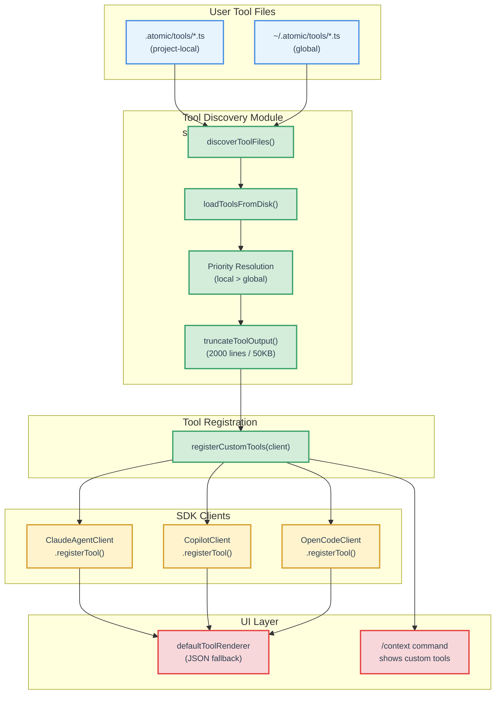

# Custom Tools Directory Technical Design Document

| Document Metadata      | Details                                                  |
| ---------------------- | -------------------------------------------------------- |
| Author(s)              | Developer                                                |
| Status                 | Draft (WIP)                                              |
| Team / Owner           | Atomic CLI                                               |
| Created / Last Updated | 2026-02-09                                               |
| Issue                  | https://github.com/flora131/atomic/issues/165            |
| Research               | `research/docs/2026-02-09-165-custom-tools-directory.md` |

## 1. Executive Summary

This spec proposes adding support for user-defined TypeScript tools in `~/.atomic/tools/` (global) and `.atomic/tools/` (project-local) directories. Each `.ts` file exports one or more tools via a `tool()` helper function from an `@atomic/plugin` package. At session creation time, discovered tools are registered with the active SDK client via the existing `CodingAgentClient.registerTool()` interface, making them available to Claude, Copilot, and OpenCode agents without any SDK-specific authoring. Project-local tools override same-named global tools. This spec also includes a breaking change to `ToolDefinition.handler` to accept a `ToolContext` second parameter, and makes `OpenCodeClient.registerTool()` functional by wrapping custom tools in an MCP server registered via the OpenCode SDK's `mcp.add()` API.

## 2. Context and Motivation

### 2.1 Current State

Atomic CLI supports three extension mechanisms for user customization:

- **Skills** (`SKILL.md` files): Prompt-injection commands discovered from `.claude/skills/`, `.opencode/skills/`, `.github/skills/`, `.atomic/skills/`, and their global equivalents. These inject text into the conversation but cannot execute code.
- **Workflows** (`.ts` files): Full graph-based workflow definitions in `.atomic/workflows/` that are dynamically imported and registered as slash commands.
- **MCP Servers** (config-based): External tool servers configured via `.mcp.json`, `mcp-config.json`, or `opencode.json` that provide tools over the MCP protocol.

There is currently **no mechanism** for users to define lightweight, in-process tools that can be invoked by the LLM without standing up an MCP server. The only built-in custom tool is `TodoWrite` (`src/sdk/tools/todo-write.ts`), which is hardcoded at `src/commands/chat.ts:171-172`.

### 2.2 The Problem

- **User Impact:** Users who want to give the LLM access to project-specific operations (e.g., running a linter, querying a database, calling an internal API) must either set up a full MCP server or modify Atomic's source code.
- **Developer Experience:** OpenCode already supports a `tool()` helper pattern for custom tools in `.opencode/tools/`. Atomic should offer equivalent functionality to maintain feature parity.
- **Extensibility Gap:** Skills can only inject prompts; workflows define multi-step graphs. There is no middle ground for single-operation tools that the LLM can invoke directly.

## 3. Goals and Non-Goals

### 3.1 Functional Goals

- [ ] Discover `.ts` tool files from `.atomic/tools/` (project-local) and `~/.atomic/tools/` (global)
- [ ] Dynamically import tool modules and extract tool definitions via named/default exports
- [ ] Register discovered tools with all three SDK clients via `CodingAgentClient.registerTool()`
- [ ] Provide a `tool()` helper function (from `@atomic/plugin` or inline utility) for type-safe tool authoring with Zod schemas
- [ ] Implement project-local-over-global priority for same-named tools
- [ ] Display custom tools in `/context` output alongside built-in and MCP tools
- [ ] Custom tools render in the TUI via the existing `defaultToolRenderer` fallback

### 3.2 Non-Goals (Out of Scope)

- [ ] Custom tool UI renderers — custom tools will use the generic JSON renderer; custom renderers are a future enhancement
- [ ] Hot-reload of tools during an active session — tools are re-discovered per session creation, but not hot-reloaded mid-session
- [ ] `@atomic/plugin` as a published npm package — the `tool()` helper will be an internal module initially; npm publishing is a separate effort
- [ ] Tool permission/approval UI — custom tools execute with the same permission model as built-in tools (controlled by `PermissionMode` and `canUseTool`)

## 4. Proposed Solution (High-Level Design)

### 4.1 System Architecture



### 4.2 Architectural Pattern

The design follows the **Filesystem Discovery + Dynamic Import** pattern already established by workflows (`src/ui/commands/workflow-commands.ts:219-344`) and skills (`src/ui/commands/skill-commands.ts:1663-1906`). Specifically:

1. **Discovery**: Scan known directory paths for `.ts` files (like workflows)
2. **Loading**: Dynamic `import()` of TypeScript modules via Bun (like workflows)
3. **Priority**: Local-over-global name resolution (like skills and workflows)
4. **Registration**: Feed into the existing `CodingAgentClient.registerTool()` interface

### 4.3 Key Components

| Component                    | Responsibility                                                     | Location                        | Justification                                     |
| ---------------------------- | ------------------------------------------------------------------ | ------------------------------- | ------------------------------------------------- |
| `tool()` helper              | Type-safe tool authoring with Zod schemas                          | `src/sdk/tools/plugin.ts`       | Internal module; avoids npm publish requirement   |
| `discoverToolFiles()`        | Scan `.atomic/tools/` directories                                  | `src/sdk/tools/discovery.ts`    | Mirrors `discoverWorkflowFiles()` pattern         |
| `loadToolsFromDisk()`        | Dynamic import + priority resolution                               | `src/sdk/tools/discovery.ts`    | Mirrors `loadWorkflowsFromDisk()` pattern         |
| `registerCustomTools()`      | Bridge: discovered tools → `client.registerTool()`                 | `src/sdk/tools/discovery.ts`    | Orchestrates the full pipeline                    |
| `getDiscoveredCustomTools()` | Expose loaded tool names for `/context`                            | `src/sdk/tools/discovery.ts`    | Matches `getDiscoveredSkillDirectories()` pattern |
| `truncateToolOutput()`       | Enforce 2000-line / 50KB output limit on tool results              | `src/sdk/tools/truncate.ts`     | Matches OpenCode's `Truncate.output()` pattern    |
| `zodToJsonSchema()`          | Convert Zod schemas to JSON Schema for `ToolDefinition.inputSchema`| `src/sdk/tools/schema-utils.ts` | Bridges user Zod schemas to unified interface     |

## 5. Detailed Design

### 5.1 The `tool()` Helper Function

**File:** `src/sdk/tools/plugin.ts`

The `tool()` function is a typed identity function that provides IDE autocompletion and type inference for tool authors. It mirrors the OpenCode `tool()` helper (ref: research §8a).

```typescript
import { z } from "zod";

/**
 * Context passed to tool execute functions.
 * Modeled after OpenCode's ToolContext (packages/plugin/src/tool.ts).
 * This is the same ToolContext exported from src/sdk/types.ts.
 */
export interface ToolContext {
  /** Active session ID */
  sessionID: string;
  /** Current message ID within the session */
  messageID: string;
  /** Agent type executing the tool (e.g., "claude", "copilot", "opencode") */
  agent: string;
  /** Current working directory — prefer over process.cwd() for resolving relative paths */
  directory: string;
  /** Abort signal for cancellation — tools should check this for long-running operations */
  abort: AbortSignal;
}

/**
 * Input shape for the tool() helper.
 */
export interface ToolInput<Args extends z.ZodRawShape> {
  description: string;
  args: Args;
  execute: (
    args: z.infer<z.ZodObject<Args>>,
    context: ToolContext
  ) => Promise<string> | string;
}

/**
 * Type-safe tool definition helper.
 * Identity function that provides IDE autocompletion and type inference.
 * Mirrors OpenCode's tool() from @opencode-ai/plugin.
 */
export function tool<Args extends z.ZodRawShape>(
  input: ToolInput<Args>
): ToolInput<Args> {
  return input;
}

// Re-export zod as tool.schema for convenience (matches OpenCode's tool.schema)
tool.schema = z;
```

> **OpenCode reference**: OpenCode's `ToolContext` also includes `worktree`, `metadata()`, and `ask()` callbacks. These are omitted from the initial Atomic implementation because: (1) Atomic does not have a worktree concept separate from `directory`, (2) `metadata()` requires UI integration for real-time tool status updates which is a future enhancement, (3) `ask()` for per-tool permission requests is handled by the SDK-level `canUseTool`/`PermissionMode` system. These fields can be added in a backwards-compatible way later.

**User-authored tool example** (`.atomic/tools/lint.ts`):

```typescript
import { tool } from "@atomic/plugin";

export default tool({
  description: "Run the project linter on a file and return results",
  args: {
    filePath: tool.schema.string().describe("Path to the file to lint"),
  },
  async execute(args, context) {
    const proc = Bun.spawn(["bun", "lint", args.filePath], {
      cwd: context.directory,
    });
    const output = await new Response(proc.stdout).text();
    return output;
  },
});
```

### 5.2 `@atomic/plugin` Import Resolution

Users import `tool` from `"@atomic/plugin"`. Rather than publishing an npm package, this is resolved at runtime via **`Bun.plugin()`** with an `onResolve` hook. This approach was chosen because:

- `tsconfig.json` `paths` only apply to files within the project root — they do not resolve for global tools at `~/.atomic/tools/`
- `Bun.plugin()` intercepts module resolution globally at runtime, working uniformly for both project-local and global tool files
- Atomic is distributed as a compiled binary (`bun build --compile`) or installed via `bun install -g @bastani/atomic`, so the plugin.ts source path is known relative to the CLI entrypoint

**Implementation** — registered once at startup in `src/sdk/tools/discovery.ts`, before any tool files are imported:

```typescript
import { resolve, dirname } from "path";

/**
 * Register the @atomic/plugin module alias via Bun.plugin().
 * Must be called before any dynamic import() of user tool files.
 *
 * Resolves `import { tool } from "@atomic/plugin"` to the absolute
 * path of src/sdk/tools/plugin.ts, regardless of where the importing
 * file is located on disk.
 */
export function registerAtomicPluginAlias(): void {
  const pluginPath = resolve(dirname(import.meta.path), "plugin.ts");

  Bun.plugin({
    name: "atomic-plugin-resolver",
    setup(build) {
      build.onResolve({ filter: /^@atomic\/plugin$/ }, () => ({
        path: pluginPath,
      }));
    },
  });
}
```

This is called once during `registerCustomTools()` before `loadToolsFromDisk()`. The `onResolve` hook intercepts any `import("@atomic/plugin")` from any file on disk and redirects it to the absolute path of the bundled `plugin.ts`. This works for:

- **Project-local tools** (`.atomic/tools/*.ts`) — resolved via the Bun plugin
- **Global tools** (`~/.atomic/tools/*.ts`) — resolved via the same Bun plugin
- **Compiled binary distribution** — `import.meta.path` resolves to the compiled binary's embedded module path; `plugin.ts` is included in the binary via `"files"` in `package.json`

> **OpenCode comparison**: OpenCode uses a different approach — it publishes `@opencode-ai/plugin` as an npm package and runs `installDependencies()` (effectively `bun add @opencode-ai/plugin`) in tool directories before importing. This gives standard node_modules resolution but requires network access and modifies the user's directory. Atomic uses `Bun.plugin()` instead because: (1) `@atomic/plugin` is not published to npm yet (non-goal for v1), (2) modifying user directories is undesirable, and (3) `Bun.plugin()` provides zero-setup resolution without network access. If `@atomic/plugin` is published to npm in the future, the `Bun.plugin()` approach can coexist — tools importing from the npm package would resolve via node_modules, while the Bun plugin acts as a fallback for tools that don't have it installed.

### 5.3 Tool Discovery

**File:** `src/sdk/tools/discovery.ts`

Only the `tools/` directory name is accepted (not `tool/`). This avoids ambiguity and is consistent with the plural naming convention used elsewhere in Atomic (e.g., `workflows/`, `skills/`).

```typescript
import { existsSync, readdirSync } from "fs";
import { join } from "path";
import { homedir } from "os";

export type ToolSource = "local" | "global";

export interface DiscoveredToolFile {
  path: string;
  filename: string;
  source: ToolSource;
}

const HOME = homedir();

export const TOOL_SEARCH_PATHS = [
  // Project-local (highest priority)
  ".atomic/tools",
  // Global user tools
  join(HOME, ".atomic", "tools"),
] as const;
```

**`discoverToolFiles()`**: Scans `TOOL_SEARCH_PATHS` for `.ts` and `.js` files. Local tools are collected before global tools to enable first-found-wins deduplication (matching the workflow pattern at `workflow-commands.ts:254-277`).

```typescript
export function discoverToolFiles(): DiscoveredToolFile[] {
  const discovered: DiscoveredToolFile[] = [];
  const cwd = process.cwd();

  for (let i = 0; i < TOOL_SEARCH_PATHS.length; i++) {
    const rawPath = TOOL_SEARCH_PATHS[i]!;
    const searchPath = rawPath.startsWith("/") ? rawPath : join(cwd, rawPath);
    const source: ToolSource = i === 0 ? "local" : "global";

    if (!existsSync(searchPath)) continue;

    try {
      const files = readdirSync(searchPath);
      for (const file of files) {
        if (file.endsWith(".ts") || file.endsWith(".js")) {
          discovered.push({
            path: join(searchPath, file),
            filename: file.replace(/\.(ts|js)$/, ""),
            source,
          });
        }
      }
    } catch {
      // Skip inaccessible directories
    }
  }

  return discovered;
}
```

### 5.4 Tool Loading and Priority Resolution

**`loadToolsFromDisk()`**: Dynamically imports each discovered `.ts` file and extracts `ToolDefinition` objects. Naming convention:

- **Default export** → tool name is the filename (e.g., `lint.ts` → `lint`)
- **Named exports** → tool name is `<filename>_<exportName>` (e.g., `weather.ts` exporting `getTemp` → `weather_getTemp`)

The `_` (single underscore) separator is used for named exports. This follows the OpenCode convention (research §8c) and is consistent with the existing codebase where `_` is used for compound identifiers at the tool/telemetry level (e.g., `atomic_command` telemetry events, OpenCode MCP tool naming `{server}_{tool}`). The `__` double underscore is reserved for MCP tool names (`mcp__<server>__<tool>` per `parseMcpToolName()` at `src/ui/tools/registry.ts:515`).

Local tools override global tools with the same name.

```typescript
import type { ToolDefinition } from "../types.ts";
import { zodToJsonSchema } from "./schema-utils.ts"; // Zod → JSON Schema converter

export interface LoadedCustomTool {
  definition: ToolDefinition;
  source: ToolSource;
  filePath: string;
}

export async function loadToolsFromDisk(): Promise<LoadedCustomTool[]> {
  const discovered = discoverToolFiles();
  const loaded: LoadedCustomTool[] = [];
  const loadedNames = new Set<string>();

  for (const { path, filename, source } of discovered) {
    try {
      const module = await import(path);

      for (const [exportName, exportValue] of Object.entries(module)) {
        if (!isToolExport(exportValue)) continue;

        const toolName =
          exportName === "default" ? filename : `${filename}_${exportName}`;

        // Local takes priority over global (first-found-wins)
        if (loadedNames.has(toolName)) continue;
        loadedNames.add(toolName);

        const definition = convertToToolDefinition(toolName, exportValue);
        loaded.push({ definition, source, filePath: path });
      }
    } catch (err) {
      console.warn(`Failed to load tool from ${path}: ${err}`);
    }
  }

  return loaded;
}
```

**`isToolExport()`**: Type guard that narrows a module export to `ToolInput<z.ZodRawShape>` by checking for required fields (`description` as string, `args` as object, `execute` as function).

**`convertToToolDefinition()`**: Bridges the user-authored `ToolInput<Args>` (Zod-based) to the unified `ToolDefinition` (JSON Schema-based). The handler receives and forwards the `ToolContext` from the updated `ToolDefinition.handler` signature (see §5.11). Output is truncated to prevent oversized tool results from consuming the LLM's context window (see §5.13):

```typescript
function convertToToolDefinition(
  name: string,
  toolInput: ToolInput<z.ZodRawShape>
): ToolDefinition {
  const zodSchema = z.object(toolInput.args);
  const jsonSchema = zodToJsonSchema(zodSchema);

  return {
    name,
    description: toolInput.description,
    inputSchema: jsonSchema,
    handler: async (
      input: Record<string, unknown>,
      context: ToolContext
    ): Promise<ToolHandlerResult> => {
      const parsed = zodSchema.parse(input);
      const result = await toolInput.execute(parsed, context);
      const output = typeof result === "string" ? result : JSON.stringify(result);
      return truncateToolOutput(output);
    },
  };
}
```

### 5.5 Zod Dependency and JSON Schema Conversion

**Zod version**: Zod 4.3.6 is already resolved in the lockfile as a transitive dependency of `@github/copilot-sdk` (`"zod": "^4.3.6"`) and `@anthropic-ai/claude-agent-sdk` (`"zod": "^4.0.0"`). Add `"zod": "^4.3.6"` as a **direct dependency** in `package.json` to make the import explicit and avoid breakage if transitive dependencies change:

```json
{
  "dependencies": {
    "zod": "^4.3.6"
  }
}
```

**Zod-to-JSON Schema conversion** — **File:** `src/sdk/tools/schema-utils.ts`

A lightweight utility to convert Zod schemas to JSON Schema for `ToolDefinition.inputSchema`. This bridges the gap identified in the research (§9e) where the Claude SDK uses Zod internally but the unified interface uses JSON Schema.

Zod 4.x includes a built-in `z.toJSONSchema()` method. Use this directly rather than adding an external `zod-to-json-schema` package:

```typescript
import { z } from "zod";

/** JSON Schema representation of a Zod schema */
export type JsonSchema = Record<string, string | boolean | number | JsonSchema | JsonSchema[]>;

export function zodToJsonSchema(schema: z.ZodType): JsonSchema {
  return z.toJSONSchema(schema) as JsonSchema;
}
```

If `z.toJSONSchema()` is not available in the resolved Zod version, fall back to adding `zod-to-json-schema` as a dependency.

### 5.6 Registration Orchestrator

**`registerCustomTools()`**: Called from `src/commands/chat.ts` after client creation, before `client.start()`. Registers the `@atomic/plugin` Bun module alias before importing any tool files.

```typescript
let discoveredCustomTools: LoadedCustomTool[] = [];
let pluginAliasRegistered = false;

export async function registerCustomTools(
  client: CodingAgentClient
): Promise<number> {
  // Register the @atomic/plugin alias once (idempotent)
  if (!pluginAliasRegistered) {
    registerAtomicPluginAlias();
    pluginAliasRegistered = true;
  }

  discoveredCustomTools = await loadToolsFromDisk();

  for (const { definition } of discoveredCustomTools) {
    client.registerTool(definition);
  }

  return discoveredCustomTools.length;
}

export function getDiscoveredCustomTools(): LoadedCustomTool[] {
  return discoveredCustomTools;
}
```

### 5.7 Integration Point — `src/commands/chat.ts`

The registration call is inserted after client creation and existing tool registration:

```typescript
// src/commands/chat.ts (modified)
const client = createClientForAgentType(agentType);

// Register TodoWrite tool for agents that don't have it built-in
if (agentType === "copilot") {
  client.registerTool(createTodoWriteTool());
}

// Discover and register custom tools from .atomic/tools/
const customToolCount = await registerCustomTools(client);
if (customToolCount > 0) {
  console.log(`Loaded ${customToolCount} custom tool(s)`);
}

await client.start();
```

### 5.8 Initialization Ordering and Session Resume

Custom tool registration happens within the `chatCommand` flow, **not** in `initializeCommandsAsync()`. This is because tools need a client instance to register with, and clients are created per-session. The updated flow:

```
initializeCommandsAsync():
  1. registerBuiltinCommands()
  2. loadWorkflowsFromDisk()
  3. registerWorkflowCommands()
  4. registerSkillCommands()
  5. discoverAndRegisterDiskSkills()
  6. registerAgentCommands()

chatCommand():
  7. createClientForAgentType()
  8. registerTool(createTodoWriteTool())   // existing
  9. registerCustomTools(client)            // NEW
  10. client.start()
  11. createSession() or resumeSession()
```

**Re-discovery on session resume**: When resuming a session via `client.resumeSession()`, custom tools are **re-discovered from disk** rather than preserving the original tool set. This is the expected behavior because:

1. Users may have added, modified, or removed tools between sessions
2. The resume flow already re-injects registered tools into the session (ref: `claude-client.ts:645-649`, `copilot-client.ts:695`)
3. Stale tool definitions from a previous session would cause confusing errors

`registerCustomTools(client)` is called before both `createSession()` and `resumeSession()`, ensuring the tool set always reflects the current state of disk. The `Bun.plugin()` alias is registered once and persists for the process lifetime.

### 5.9 `/context` Command Integration

The `/context` command should display custom tools alongside built-in and MCP tools. `getDiscoveredCustomTools()` provides the data:

```
Custom Tools:
  lint (local) — Run the project linter on a file and return results
  deploy (global) — Deploy to staging environment
```

### 5.10 Data Flow Summary

```
.atomic/tools/lint.ts
  │
  ├─ discoverToolFiles()          → { path, filename: "lint", source: "local" }
  │
  ├─ import(".atomic/tools/lint.ts")
  │   └─ default export: { description, args: { filePath: z.string() }, execute }
  │
  ├─ convertToToolDefinition("lint", export)
  │   ├─ zodToJsonSchema(z.object({ filePath: z.string() }))
  │   │   → { type: "object", properties: { filePath: { type: "string" } } }
  │   └─ → ToolDefinition { name: "lint", inputSchema: {...}, handler: wrapped+truncated }
  │
  ├─ client.registerTool(toolDefinition)
  │   ├─ Claude: createSdkMcpServer("tool-lint") → injected into mcpServers
  │   ├─ Copilot: pushed to registeredTools[] → converted and injected into session.tools
  │   └─ OpenCode: bundled into "atomic-custom-tools" MCP server → registered via mcp.add()
  │
  └─ LLM invokes "lint" tool
      ├─ handler(input, context) called with { sessionID, messageID, agent, directory, abort }
      ├─ Zod validates input
      ├─ execute({ filePath: "src/index.ts" }, context) runs
      ├─ Returns linter output string
      ├─ truncateToolOutput() enforces 2000-line / 50KB limit
      └─ UI renders via defaultToolRenderer (JSON input/output display)
```

### 5.11 Breaking Change: `ToolDefinition.handler` Context Parameter

The current `ToolDefinition.handler` signature (`src/sdk/types.ts:483`) is:

```typescript
handler: (input: unknown) => unknown | Promise<unknown>;  // current — overly loose
```

This spec introduces a **breaking change** to add a `ToolContext` second parameter:

```typescript
// src/sdk/types.ts (updated)
export interface ToolContext {
  /** Active session ID */
  sessionID: string;
  /** Current message ID within the session */
  messageID: string;
  /** Agent type executing the tool (e.g., "claude", "copilot", "opencode") */
  agent: string;
  /** Current working directory — prefer over process.cwd() for resolving relative paths */
  directory: string;
  /** Abort signal for cancellation — tools should check this for long-running operations */
  abort: AbortSignal;
}

/** Serializable result returned by a tool handler */
export type ToolHandlerResult = string | Record<string, unknown>;

export interface ToolDefinition {
  name: string;
  description: string;
  inputSchema: Record<string, unknown>;
  handler: (
    input: Record<string, unknown>,
    context: ToolContext
  ) => ToolHandlerResult | Promise<ToolHandlerResult>;
}
```

`ToolContext` is exported from `src/sdk/types.ts` alongside `ToolDefinition` and re-exported from `src/sdk/tools/plugin.ts` for user tool authors. The interface is modeled after OpenCode's `ToolContext` (`packages/plugin/src/tool.ts`) — see §5.1 for the OpenCode reference note on omitted fields.

**Blast radius** — Only 4 call sites need updating:

1. **`src/sdk/claude-client.ts:764-766`** — Claude's `registerTool()` wrapper must construct and pass a `ToolContext`. The Claude SDK's internal handler receives untyped args from the MCP protocol; cast to `Record<string, unknown>` at the boundary. `sessionID` and `messageID` are obtained from the session state available in the handler closure:
   ```typescript
   handler: async (args: Record<string, unknown>, _extra: Record<string, unknown>) => {
     const context: ToolContext = {
       sessionID: this.currentSession?.id ?? "",
       messageID: this.currentMessageId ?? "",
       agent: "claude",
       directory: this.clientOptions.directory ?? process.cwd(),
       abort: this.currentAbortController?.signal ?? new AbortController().signal,
     };
     const result = await tool.handler(args, context);
     // ...
   }
   ```

2. **`src/sdk/copilot-client.ts:533`** — Copilot's `convertTool()` must pass context. Session state is accessed via the client instance:
   ```typescript
   handler: async (args: Record<string, unknown>) => {
     const context: ToolContext = {
       sessionID: this.currentSession?.id ?? "",
       messageID: this.currentMessageId ?? "",
       agent: "copilot",
       directory: this.clientOptions.directory ?? process.cwd(),
       abort: this.currentAbortController?.signal ?? new AbortController().signal,
     };
     return tool.handler(args, context);
   }
   ```

3. **`src/sdk/opencode-client.ts:1090`** — OpenCode's `registerTool()` updated in §5.12 below. Note: for the MCP bridge approach, `ToolContext` fields are serialized into the MCP server script's environment, with `sessionID` and `messageID` passed as tool invocation metadata.

4. **`src/sdk/tools/todo-write.ts:76`** — Update the `createTodoWriteTool()` handler signature:
   ```typescript
   handler: (input: Record<string, unknown>, _context: ToolContext): ToolHandlerResult => {
     const todos = input.todos as TodoItem[];
     // existing logic unchanged
   }
   ```

### 5.12 OpenCode Tool Injection via MCP

**Problem**: `OpenCodeClient.registerTool()` (`src/sdk/opencode-client.ts:1090-1094`) currently stores tools in a `Map` but does not inject them into the OpenCode server. The OpenCode server is a separate process that only learns about tools through its own discovery (`.opencode/tools/`) or MCP servers registered via `sdkClient.mcp.add()` (ref: `src/sdk/opencode-client.ts:610-649`).

**Solution**: Bundle all registered custom tools into a single stdio MCP server script and register it with the OpenCode server via `mcp.add()`. This mirrors how the Claude client wraps tools as MCP servers (`createSdkMcpServer()` at `claude-client.ts:790`), adapted for OpenCode's server-level MCP registration.

**Implementation**:

1. **Generate a temporary MCP server script** that serves all registered tools over stdio. The script is a minimal Bun program that reads JSON-RPC requests from stdin and dispatches to tool handlers:

   ```typescript
   // src/sdk/tools/opencode-mcp-bridge.ts
   import type { ToolDefinition, ToolContext } from "../types.ts";

   /**
    * Create a temporary .ts file that serves registered tools as an MCP stdio server.
    * Returns the path to the generated script.
    */
   export async function createToolMcpServerScript(
     tools: ToolDefinition[]
   ): Promise<string> {
     const tmpDir = join(homedir(), ".atomic", ".tmp");
     mkdirSync(tmpDir, { recursive: true });

     const scriptPath = join(tmpDir, `custom-tools-mcp-${Date.now()}.ts`);
     const toolDefs = tools.map(t => ({
       name: t.name,
       description: t.description,
       inputSchema: t.inputSchema,
     }));

     // Generate a self-contained MCP server script
     const script = generateMcpServerScript(toolDefs);
     writeFileSync(scriptPath, script);
     return scriptPath;
   }
   ```

2. **Update `OpenCodeClient.registerTool()`** to store tools and mark registration as pending:

   ```typescript
   registerTool(tool: ToolDefinition): void {
     this.registeredTools.set(tool.name, tool);
   }
   ```

3. **Update `OpenCodeClient.createSession()`** to register the MCP bridge before session creation:

   ```typescript
   async createSession(config: SessionConfig = {}): Promise<Session> {
     // Register custom tools as an MCP server
     if (this.registeredTools.size > 0) {
       await this.registerToolsMcpServer();
     }

     // Register MCP servers from config
     if (config.mcpServers && config.mcpServers.length > 0) {
       await this.registerMcpServers(config.mcpServers);
     }

     // ... existing session creation
   }

   private async registerToolsMcpServer(): Promise<void> {
     if (!this.sdkClient) return;

     const tools = Array.from(this.registeredTools.values());
     const scriptPath = await createToolMcpServerScript(tools);

     await this.sdkClient.mcp.add({
       directory: this.clientOptions.directory,
       name: "atomic-custom-tools",
       config: {
         type: "local" as const,
         command: ["bun", "run", scriptPath],
         enabled: true,
       },
     });
   }
   ```

4. **Same approach for `resumeSession()`** — call `registerToolsMcpServer()` before resuming.

5. **Process-exit cleanup** — Remove generated MCP bridge scripts when the Atomic process exits. The codebase already uses a `cleanupHandlers` array pattern (`src/ui/index.ts:742-755`) that runs on `SIGINT`/`SIGTERM` and normal exit. `createToolMcpServerScript()` returns the path, which is tracked for deletion:

   ```typescript
   // src/sdk/tools/opencode-mcp-bridge.ts
   const generatedScripts: string[] = [];

   export async function createToolMcpServerScript(
     tools: ToolDefinition[]
   ): Promise<string> {
     const tmpDir = join(homedir(), ".atomic", ".tmp");
     mkdirSync(tmpDir, { recursive: true });

     const scriptPath = join(tmpDir, `custom-tools-mcp-${Date.now()}.ts`);
     // ... generate and write script ...

     generatedScripts.push(scriptPath);
     return scriptPath;
   }

   /**
    * Remove all generated MCP bridge scripts.
    * Called during process cleanup (SIGINT/SIGTERM/normal exit).
    */
   export function cleanupMcpBridgeScripts(): void {
     for (const scriptPath of generatedScripts) {
       try {
         unlinkSync(scriptPath);
       } catch {
         // File may already be deleted or inaccessible
       }
     }
     generatedScripts.length = 0;

     // Remove the .tmp directory if empty
     const tmpDir = join(homedir(), ".atomic", ".tmp");
     try {
       rmdirSync(tmpDir);
     } catch {
       // Directory not empty or doesn't exist — ignore
     }
   }
   ```

   The cleanup function is wired into the UI's existing cleanup flow at `src/ui/index.ts`:

   ```typescript
   // src/ui/index.ts — inside startChatUI(), after tool registration
   state.cleanupHandlers.push(() => {
     cleanupMcpBridgeScripts();
   });
   ```

   This ensures scripts are removed on `SIGINT` (Ctrl+C), `SIGTERM`, and normal session exit, matching the existing signal handler pattern at `src/ui/index.ts:738-739`.

**Alternative considered**: Writing tool files to `.opencode/tools/` for native discovery. Rejected because it modifies the user's config directory as a side effect and creates cleanup concerns.

### 5.13 Output Truncation

**File:** `src/sdk/tools/truncate.ts`

Custom tool handlers may return arbitrarily large output (e.g., a linter dumping thousands of lines, a database query returning a large result set). Without truncation, oversized tool results consume the LLM's context window and degrade response quality. This is modeled after OpenCode's `Truncate.output()` function (`packages/opencode/src/util/truncate.ts`), which enforces limits at 2000 lines and 50KB.

```typescript
/** Maximum number of lines in tool output before truncation */
const MAX_OUTPUT_LINES = 2000;
/** Maximum byte size of tool output before truncation */
const MAX_OUTPUT_BYTES = 50_000; // 50KB

/**
 * Truncate tool output to prevent oversized results from consuming
 * the LLM's context window. Matches OpenCode's Truncate.output() behavior.
 *
 * When truncation occurs, a notice is appended indicating how much was removed.
 */
export function truncateToolOutput(output: string): string {
  const lines = output.split("\n");

  // Truncate by line count
  if (lines.length > MAX_OUTPUT_LINES) {
    const truncated = lines.slice(0, MAX_OUTPUT_LINES).join("\n");
    return `${truncated}\n\n[truncated: ${lines.length - MAX_OUTPUT_LINES} lines omitted]`;
  }

  // Truncate by byte size
  const byteLength = new TextEncoder().encode(output).length;
  if (byteLength > MAX_OUTPUT_BYTES) {
    // Binary search for the cut point that fits within the byte limit
    let lo = 0;
    let hi = output.length;
    while (lo < hi) {
      const mid = (lo + hi + 1) >>> 1;
      if (new TextEncoder().encode(output.slice(0, mid)).length <= MAX_OUTPUT_BYTES) {
        lo = mid;
      } else {
        hi = mid - 1;
      }
    }
    return `${output.slice(0, lo)}\n\n[truncated: output exceeded ${MAX_OUTPUT_BYTES} bytes]`;
  }

  return output;
}
```

> **OpenCode reference**: OpenCode saves the full untruncated output to disk (`$HOME/.opencode/sessions/<id>/output/<tool-call-id>.txt`) so users can inspect the complete result. This is a future enhancement for Atomic — initially, only the truncated output is returned and the full output is not persisted.

## 6. Alternatives Considered

| Option                                                             | Pros                                                                | Cons                                                                                                  | Reason for Rejection                                                            |
| ------------------------------------------------------------------ | ------------------------------------------------------------------- | ----------------------------------------------------------------------------------------------------- | ------------------------------------------------------------------------------- |
| A: MCP servers only                                                | No new code needed; MCP is the standard extension mechanism         | Requires running a separate server process; high friction for simple tools                            | Too heavy for lightweight tools; poor DX for single-function tools              |
| B: JSON-based tool definitions                                     | Simpler parsing; no dynamic import needed                           | Cannot define handler logic; would need a separate handler mechanism                                  | Tools need executable code; JSON can't express handlers                         |
| C: Zod schemas in `ToolDefinition` (replace JSON Schema)           | Cleaner DX; SDK-native for Claude                                   | Breaking change to `ToolDefinition` interface; Copilot SDK accepts both but OpenCode uses JSON Schema | Would break the existing unified interface and all three client implementations |
| **D: `tool()` helper with Zod, convert to JSON Schema (Selected)** | Clean authoring DX; no breaking changes; follows OpenCode precedent | Requires Zod-to-JSON-Schema conversion                                                                | **Selected**: Best DX without breaking the existing interface                   |

## 7. Cross-Cutting Concerns

### 7.1 Security

- **Code Execution**: Custom tools execute arbitrary TypeScript code in the Bun process. This is equivalent to the existing workflow system (`workflow-commands.ts:321` — `await import(path)`) and inherits the same trust model: users are responsible for the code in their `.atomic/` directories.
- **Tool Permissions**: Custom tools are subject to the same `PermissionMode` and `canUseTool` checks as built-in tools. The Claude SDK's `canUseTool` callback (`claude-client.ts:210-268`) applies to MCP-wrapped custom tools.
- **Input Validation**: Zod schema validation in the handler ensures type safety. Malformed input from the LLM is rejected with a parse error.

### 7.2 Error Handling

- **Import Failures**: If a tool file fails to import (syntax error, missing dependency), a warning is logged and the tool is skipped. Other tools continue loading.
- **Runtime Errors**: If a tool handler throws during execution, the error is caught by the SDK client's tool execution wrapper and surfaced as a tool error result to the LLM.
- **Schema Validation Errors**: If the LLM provides input that doesn't match the Zod schema, `zodSchema.parse()` throws a `ZodError`, which is caught and returned as an error result.

### 7.3 Observability

Custom tool executions flow through the existing telemetry pipeline:
- `tool.start` / `tool.complete` events (ref: research §11)
- Telemetry tracks `sdk.tool.started`, `sdk.tool.completed`, `sdk.tool.failed` events (`src/telemetry/sdk-integration.ts`)
- Tool names in telemetry events identify custom tools by their registered name

## 8. Migration, Rollout, and Testing

### 8.1 Deployment Strategy

This feature includes a breaking change to `ToolDefinition.handler` (§5.11). All internal call sites are updated in the same PR. No external consumers exist — `ToolDefinition` is an internal interface.

- [ ] Phase 1: Update `ToolDefinition.handler` signature and all call sites (§5.11)
- [ ] Phase 2: Add `zod` as a direct dependency, add `src/sdk/tools/plugin.ts`, `src/sdk/tools/discovery.ts`, `src/sdk/tools/schema-utils.ts`, and `src/sdk/tools/truncate.ts`
- [ ] Phase 3: Wire `registerCustomTools()` into `src/commands/chat.ts`
- [ ] Phase 4: Update `OpenCodeClient` to inject tools via MCP bridge with process-exit cleanup (§5.12)
- [ ] Phase 5: Add build test for compiled binary `import.meta.path` resolution (§8.2)
- [ ] Phase 6: Users create `.atomic/tools/` directories and add `.ts` files; tools are automatically discovered on session start

### 8.2 Test Plan

**Unit Tests** (`tests/sdk/tools/`):

- [ ] `discovery.test.ts` — `discoverToolFiles()` finds `.ts` files in project-local and global paths; skips non-`.ts` files; handles missing directories
- [ ] `discovery.test.ts` — `loadToolsFromDisk()` imports valid tool modules; skips invalid exports; applies local-over-global priority
- [ ] `plugin.test.ts` — `tool()` returns the input unchanged (identity function); `tool.schema` is Zod
- [ ] `schema-utils.test.ts` — `zodToJsonSchema()` correctly converts string, number, boolean, array, object, enum, optional, and described schemas
- [ ] `truncate.test.ts` — `truncateToolOutput()` passes through output under limits; truncates at 2000 lines with notice; truncates at 50KB with notice; handles empty strings and single-line output

**Integration Tests** (`tests/sdk/`):

- [ ] Custom tools are registered with `ClaudeAgentClient` and appear in session MCP servers
- [ ] Custom tools are registered with `CopilotClient` and appear in session tools
- [ ] Custom tools are registered with `OpenCodeClient` and registered via MCP bridge
- [ ] Custom tool handlers receive `ToolContext` with correct `sessionID`, `messageID`, `agent`, `directory`, and `abort` fields
- [ ] `TodoWrite` handler works with the updated `(input, context)` signature
- [ ] `Bun.plugin()` alias resolves `@atomic/plugin` for files outside the project root
- [ ] Tools are re-discovered on session resume (modified tool file is picked up)
- [ ] Tool output exceeding 2000 lines or 50KB is truncated before returning to the LLM
- [ ] `cleanupMcpBridgeScripts()` removes generated scripts; `.tmp` directory removed when empty
- [ ] `cleanupMcpBridgeScripts()` is idempotent (no error if called twice or if files already deleted)

**Build Tests** (`tests/build/`):

- [ ] `compiled-binary-plugin-alias.test.ts` — Build a compiled binary with `bun build src/cli.ts --compile --outfile /tmp/atomic-test-binary`, then run it with a test tool in a temporary `.atomic/tools/` directory. Verify that `import.meta.path` inside `registerAtomicPluginAlias()` resolves to a path containing `plugin.ts` and that the `@atomic/plugin` import succeeds from the test tool file. This validates that `Bun.plugin()` `onResolve` works correctly within compiled binaries where `import.meta.path` points to the embedded module rather than a filesystem path.

**E2E Tests** (`tests/e2e/`):

- [ ] Start a session with a `.atomic/tools/` directory containing a test tool; verify the LLM can invoke it and receives the result
- [ ] Verify `/context` displays custom tools
- [ ] Verify custom tools work with all three agents (Claude, Copilot, OpenCode)
- [ ] Verify MCP bridge scripts in `~/.atomic/.tmp/` are cleaned up after session exit

## 9. Resolved Design Decisions

All design questions have been resolved:

| Question | Decision | Section |
|---|---|---|
| `@atomic/plugin` import resolution for global tools | Use `Bun.plugin()` with `onResolve` hook — works for both local and global tools uniformly. OpenCode's `installDependencies` pattern documented as context; can coexist if `@atomic/plugin` is published to npm later | §5.2 |
| OpenCode tool passthrough | Included in this spec — wrap custom tools in a stdio MCP server and register via `sdkClient.mcp.add()` | §5.12 |
| `ToolContext` expansion | Clean breaking change — update `ToolDefinition.handler` to `(input, context: ToolContext)` across all 4 call sites. `ToolContext` includes `sessionID`, `messageID`, `agent`, `directory`, `abort` (modeled after OpenCode's ToolContext) | §5.1, §5.11 |
| Zod dependency version | Add `"zod": "^4.3.6"` as direct dependency — matches the version already resolved in the lockfile | §5.5 |
| Re-discovery on session resume | Re-discover from disk on every session start/resume — prevents stale tool definitions | §5.8 |
| Named export naming convention | Use `_` (single underscore) separator: `<filename>_<exportName>` — matches OpenCode convention and existing codebase patterns | §5.4 |
| MCP bridge script cleanup | Remove on process exit via `cleanupMcpBridgeScripts()` wired into `state.cleanupHandlers` — covers SIGINT, SIGTERM, and normal exit | §5.12 |
| Compiled binary `import.meta.path` | Verified via build test: compile binary, run with test tool, assert `@atomic/plugin` resolves | §8.2 |
| Tool directory naming | Only `tools/` is accepted (not `tool/`) — consistent with Atomic's plural naming convention (`workflows/`, `skills/`) | §5.3 |
| Output truncation | Truncate at 2000 lines / 50KB (matching OpenCode's `Truncate.output`). Full output persistence to disk is a future enhancement | §5.13 |
