# Emoji & Unicode Icon Centralization and Standardization

| Document Metadata      | Details                  |
| ---------------------- | ------------------------ |
| Author(s)              | Developer                |
| Status                 | Draft (WIP)              |
| Team / Owner           | Atomic CLI               |
| Created / Last Updated | 2026-02-13 / 2026-02-13 |

## 1. Executive Summary

This spec proposes centralizing ~40+ hardcoded Unicode icon definitions scattered across 15+ UI component files into a single `src/ui/constants/icons.ts` module, and replacing 5 icons with terminal-safe equivalents from the project's target icon set. Currently, identical status icon constants (`○`/`●`/`✕`) are duplicated across 4+ files with no shared source of truth, and the sub-status connector `⎿` is hardcoded inline in 5+ locations. This creates maintenance burden, inconsistency risk, and test fragility — as demonstrated by the [104 test failures caused by the previous emoji→Unicode migration](../research/docs/2026-02-12-bun-test-failures-root-cause-analysis.md). The proposed centralized icon module eliminates duplication, enables future icon changes via single-point edits, and aligns 5 non-standard icons with the terminal-safe Unicode target set.

> **Research basis:** [`research/docs/2026-02-13-emoji-unicode-icon-usage-catalog.md`](../research/docs/2026-02-13-emoji-unicode-icon-usage-catalog.md)

## 2. Context and Motivation

### 2.1 Current State

The Atomic TUI uses **zero traditional emoji** (🔥, ✅, 🚀) in source code. All visual indicators use ~40+ distinct Unicode symbols (geometric shapes, braille characters, box-drawing, mathematical symbols). The icon architecture follows a **decentralized inline pattern** with partial constant extraction:

- **Status icons**: Extracted to `Record<Status, string>` constants per component — consistent vocabulary (`○`/`●`/`✕`) but **duplicated across 4+ files**
- **Tool icons**: Centralized in [`src/ui/tools/registry.ts`](../src/ui/tools/registry.ts) as `ToolRenderer.icon` properties
- **Tree characters**: Extracted to `TREE_CHARS` constant in [`parallel-agents-tree.tsx`](../src/ui/components/parallel-agents-tree.tsx)
- **Spinner frames**: Extracted to `SPINNER_FRAMES` constant in [`chat.tsx`](../src/ui/chat.tsx)
- **All other icons**: Hardcoded inline at point of use (sub-status connectors, arrows, separators, checkboxes, etc.)

There is **no centralized icon module** or theme-based icon configuration. To replace an icon globally, each occurrence must be individually located and updated.

> **Reference:** The previous emoji→Unicode migration ([`research/docs/2026-02-12-bun-test-failures-root-cause-analysis.md`](../research/docs/2026-02-12-bun-test-failures-root-cause-analysis.md)) changed tool icons from emoji (`📄`→`≡`, `💻`→`$`, `📝`→`►`, `🔍`→`◆`, `🔎`→`★`, `🔧`→`▶`) but left tests unupdated, causing [104 test failures](../specs/bun-test-failures-remediation.md). This directly demonstrates the cost of not having importable icon constants.

**Constant Definition Locations (Duplicated):**

| File | Constant | Icons Defined |
|------|----------|---------------|
| [`src/ui/components/tool-result.tsx:41-47`](../src/ui/components/tool-result.tsx) | `STATUS_ICONS` | `○`, `●`, `✕` |
| [`src/ui/components/parallel-agents-tree.tsx:80-87`](../src/ui/components/parallel-agents-tree.tsx) | `STATUS_ICONS` | `○`, `●`, `◌`, `✕` |
| [`src/ui/components/task-list-indicator.tsx:46-51`](../src/ui/components/task-list-indicator.tsx) | `TASK_STATUS_ICONS` | `○`, `●`, `✕` |
| [`src/ui/components/mcp-server-list.tsx:56`](../src/ui/components/mcp-server-list.tsx) | inline ternary | `●`, `○` |
| [`src/ui/components/skill-load-indicator.tsx:45`](../src/ui/components/skill-load-indicator.tsx) | inline ternary | `●`, `✕` |
| [`src/ui/utils/transcript-formatter.ts:136`](../src/ui/utils/transcript-formatter.ts) | inline selection | `●`, `○`, `✕` |

### 2.2 The Problem

- **Duplication**: Status icons (`○`/`●`/`✕`) are independently defined in 6+ files. A change to the error icon requires editing each file individually.
- **Test fragility**: Tests assert literal icon characters (e.g., `expect(renderer.icon).toBe("►")`). Without importable constants, any icon change breaks tests that must be manually hunted down — as proven by the [104-test-failure incident](../research/docs/2026-02-12-bun-test-failures-root-cause-analysis.md).
- **Inline magic strings**: The sub-status connector `⎿` appears as a hardcoded magic string in 5+ locations ([`chat.tsx:1300,1343`](../src/ui/chat.tsx), [`parallel-agents-tree.tsx:287+`](../src/ui/components/parallel-agents-tree.tsx), [`task-list-indicator.tsx:95`](../src/ui/components/task-list-indicator.tsx), [`transcript-formatter.ts:90,189`](../src/ui/utils/transcript-formatter.ts)) with no constant name documenting its semantic meaning.
- **Non-standard icons**: 5 icons (`✕`, `⎿`, `☑`, `☐`, `□`) are not in the project's terminal-safe target icon set and could render inconsistently across terminal emulators.

> **Reference:** [`research/docs/2026-02-12-sdk-ui-standardization-research.md`](../research/docs/2026-02-12-sdk-ui-standardization-research.md) and [`research/docs/2026-02-12-sdk-ui-standardization-comprehensive.md`](../research/docs/2026-02-12-sdk-ui-standardization-comprehensive.md) both document the need for cross-SDK icon consistency, confirming that icons must render identically across Claude, OpenCode, and Copilot backends.

## 3. Goals and Non-Goals

### 3.1 Functional Goals

- [ ] Create a centralized icon module at `src/ui/constants/icons.ts` exporting all shared icon constants
- [ ] Deduplicate status icon definitions: all 6+ files import from the central module instead of defining their own
- [ ] Centralize tree-drawing characters, sub-status connectors, spinner frames, arrow indicators, and checkbox symbols as named exports
- [ ] Replace 5 non-standard icons with terminal-safe equivalents (see §5.2)
- [ ] Update all test files to import icon constants instead of asserting hardcoded literal characters
- [ ] Zero visual regression: the TUI must render identically after centralization (except for the 5 intentional icon replacements)

### 3.2 Non-Goals (Out of Scope)

- [ ] We will NOT move tool-specific icons out of `src/ui/tools/registry.ts` — the tool registry pattern is working well and is the correct location for tool-specific rendering logic
- [ ] We will NOT modify the banner/logo block art in `src/utils/banner/constants.ts` — these are decorative bitmap art, not semantic icons
- [ ] We will NOT change emoji usage in test data (🌍, 👋, 🎉) or documentation (✅, ❌, ⚠️) — these are not rendered in the application
- [ ] We will NOT build a theme-switchable icon system (e.g., Nerd Fonts vs. Unicode fallback) — this is a future enhancement
- [ ] We will NOT modify animation timing or color logic — only icon character values are in scope
- [ ] We will NOT modify Mermaid diagram template icons in `src/ui/commands/skill-commands.ts:377-390` — these are documentation examples

## 4. Proposed Solution (High-Level Design)

### 4.1 Architecture Overview

```mermaid
%%{init: {'theme':'base', 'themeVariables': { 'primaryColor':'#f8f9fa','primaryTextColor':'#2c3e50','primaryBorderColor':'#4a5568','lineColor':'#4a90e2','secondaryColor':'#ffffff','tertiaryColor':'#e9ecef'}}}%%

flowchart TB
    classDef newModule fill:#48bb78,stroke:#38a169,stroke-width:2.5px,color:#ffffff,font-weight:600
    classDef consumer fill:#4a90e2,stroke:#357abd,stroke-width:2px,color:#ffffff,font-weight:600
    classDef existing fill:#718096,stroke:#4a5568,stroke-width:2px,color:#ffffff,font-weight:600
    classDef test fill:#667eea,stroke:#5a67d8,stroke-width:2px,color:#ffffff,font-weight:600

    IconModule["<b>src/ui/constants/icons.ts</b><br><i>NEW — Single source of truth</i><br>STATUS_ICONS · TREE_CHARS<br>CONNECTORS · SPINNERS<br>ARROWS · CHECKBOXES"]:::newModule

    subgraph Components["UI Components (Consumers)"]
        direction TB
        ToolResult["tool-result.tsx"]:::consumer
        AgentsTree["parallel-agents-tree.tsx"]:::consumer
        TaskList["task-list-indicator.tsx"]:::consumer
        McpList["mcp-server-list.tsx"]:::consumer
        SkillLoad["skill-load-indicator.tsx"]:::consumer
        Chat["chat.tsx"]:::consumer
        QueueInd["queue-indicator.tsx"]:::consumer
        CtxInfo["context-info-display.tsx"]:::consumer
        UserQDlg["user-question-dialog.tsx"]:::consumer
        ModelDlg["model-selector-dialog.tsx"]:::consumer
        BlinkInd["animated-blink-indicator.tsx"]:::consumer
    end

    subgraph Utils["UI Utilities (Consumers)"]
        Transcript["transcript-formatter.ts"]:::consumer
    end

    subgraph Registry["Tool Registry (Unchanged)"]
        ToolReg["tools/registry.ts<br><i>Keeps tool-specific icons</i>"]:::existing
    end

    subgraph Tests["Test Files (Import Constants)"]
        ToolResultTest["tool-result.test.tsx"]:::test
        RegistryTest["registry.test.ts"]:::test
    end

    IconModule --> Components
    IconModule --> Utils
    IconModule --> Tests
    ToolReg -.->|"imports shared icons<br>(✓, ○, ●, □)"| IconModule

    style Components fill:#ffffff,stroke:#cbd5e0,stroke-width:2px
    style Utils fill:#ffffff,stroke:#cbd5e0,stroke-width:2px
    style Registry fill:#ffffff,stroke:#cbd5e0,stroke-width:2px,stroke-dasharray:6 3
    style Tests fill:#ffffff,stroke:#cbd5e0,stroke-width:2px
```



### 4.2 Architectural Pattern

We are adopting a **Centralized Constants** pattern — a single module exports all shared icon definitions as `as const` objects. Components import what they need. This is the same pattern already used successfully for the theme system (`src/ui/theme.tsx`) and tool registry (`src/ui/tools/registry.ts`).

### 4.3 Key Components

| Component | Responsibility | Change Type |
|-----------|---------------|-------------|
| `src/ui/constants/icons.ts` | Single source of truth for all shared icon characters | **NEW** |
| `src/ui/components/tool-result.tsx` | Tool execution status display | Remove local `STATUS_ICONS`, import from icons module |
| `src/ui/components/parallel-agents-tree.tsx` | Agent tree with status indicators | Remove local `STATUS_ICONS` + `TREE_CHARS`, import from icons module |
| `src/ui/components/task-list-indicator.tsx` | Task list status display | Remove local `TASK_STATUS_ICONS`, import from icons module |
| `src/ui/components/mcp-server-list.tsx` | MCP server enabled/disabled | Replace inline ternary with imported constants |
| `src/ui/components/skill-load-indicator.tsx` | Skill loading status | Replace inline ternary with imported constants |
| `src/ui/utils/transcript-formatter.ts` | Transcript text formatting | Replace inline icon selections with imported constants |
| `src/ui/chat.tsx` | Main chat component | Import spinner, connectors, arrows from icons module |
| `src/ui/tools/registry.ts` | Tool icon definitions | Import shared icons (✓, ○, ●, □) for todo status display |
| Test files (7+) | Icon assertions | Import constants instead of hardcoded literals |

## 5. Detailed Design

### 5.1 Central Icon Module: `src/ui/constants/icons.ts`

The new module exports categorized icon constants. All values use `as const` for type narrowing.

```typescript
// src/ui/constants/icons.ts

// ── Status Indicators ──────────────────────────────────────────
export const STATUS = {
  pending: "○",       // U+25CB White Circle
  active: "●",        // U+25CF Black Circle
  error: "✗",         // U+2717 Ballot X (replaces ✕ U+2715)
  background: "◌",    // U+25CC Dotted Circle
  selected: "◉",      // U+25C9 Fisheye
  success: "✓",       // U+2713 Check Mark
} as const;

// ── Tree Drawing ───────────────────────────────────────────────
export const TREE = {
  branch: "├─",       // U+251C + U+2500
  lastBranch: "└─",   // U+2514 + U+2500
  vertical: "│ ",     // U+2502
  space: "  ",
} as const;

// ── Connectors ─────────────────────────────────────────────────
export const CONNECTOR = {
  subStatus: "╰",     // U+2570 Rounded bottom-left (replaces ⎿ U+23BF)
  horizontal: "─",    // U+2500
  roundedTopLeft: "╭", // U+256D
  roundedTopRight: "╮", // U+256E
} as const;

// ── Arrows ─────────────────────────────────────────────────────
export const ARROW = {
  right: "→",         // U+2192
  up: "↑",            // U+2191
  down: "↓",          // U+2193
} as const;

// ── Prompt & Selection ─────────────────────────────────────────
export const PROMPT = {
  cursor: "❯",        // U+276F Heavy right-pointing angle
  editPrefix: "›",    // U+203A Single right-pointing angle
} as const;

// ── Spinner Frames (Braille) ───────────────────────────────────
export const SPINNER_FRAMES = [
  "⣾", "⣽", "⣻", "⢿", "⡿", "⣟", "⣯", "⣷",
] as const;

export const SPINNER_COMPLETE = "⣿"; // U+28FF Full braille block

// ── Progress Bar ───────────────────────────────────────────────
export const PROGRESS = {
  filled: "█",        // U+2588 Full block
  empty: "░",         // U+2591 Light shade
} as const;

// ── Checkbox ───────────────────────────────────────────────────
export const CHECKBOX = {
  checked: "✔",       // U+2714 Heavy Check Mark (replaces ☑ U+2611)
  unchecked: "○",     // U+25CB White Circle (replaces ☐ U+2610)
} as const;

// ── Misc ───────────────────────────────────────────────────────
export const MISC = {
  separator: "·",     // U+00B7 Middle dot
  ellipsis: "…",      // U+2026 Horizontal ellipsis
  warning: "⚠",       // U+26A0 Warning sign
  thinking: "∴",      // U+2234 Therefore
  queue: "⋮",         // U+22EE Vertical ellipsis
  collapsed: "▾",     // U+25BE Down-pointing small triangle
} as const;
```

### 5.2 Icon Replacements (5 Changes)

These replacements align non-standard icons with the terminal-safe target set.

> **Reference:** Full migration mapping in [`research/docs/2026-02-13-emoji-unicode-icon-usage-catalog.md` §Migration Mapping Summary](../research/docs/2026-02-13-emoji-unicode-icon-usage-catalog.md).

| # | Current | Codepoint | Replacement | Codepoint | Rationale | Affected Files |
|---|---------|-----------|-------------|-----------|-----------|----------------|
| 1 | `✕` | U+2715 Multiplication X | `✗` | U+2717 Ballot X | Target set uses `✗` for "Failure" — same visual weight, correct semantic meaning | `tool-result.tsx:45`, `task-list-indicator.tsx:50`, `skill-load-indicator.tsx:45`, `transcript-formatter.ts:136` |
| 2 | `⎿` | U+23BF Terminal graphic | `╰` | U+2570 Rounded bottom-left | Target set includes `╰` — visually similar connector for sub-status lines, better terminal support | `chat.tsx:1300,1343`, `parallel-agents-tree.tsx:287+`, `task-list-indicator.tsx:95`, `transcript-formatter.ts:90,189` |
| 3 | `☑` | U+2611 Ballot Box w/ Check | `✔` | U+2714 Heavy Check Mark | Target set "Success (bold)" — cleaner rendering in most terminal emulators | `chat.tsx:1263,4772`, `tools/registry.ts:719` |
| 4 | `☐` | U+2610 Ballot Box | `○` | U+25CB White Circle | Aligns with existing pending convention (`○` already used for pending state) | `chat.tsx:1262` |
| 5 | `□` | U+25A1 White Square | `○` | U+25CB White Circle | Aligns pending state with existing `○` pattern used throughout | `tools/registry.ts:732` |

### 5.3 Consumer Migration Pattern

Each consumer file follows the same migration pattern:

**Before (duplicated local constant):**
```typescript
// src/ui/components/tool-result.tsx
const STATUS_ICONS: Record<ToolExecutionStatus, string> = {
  pending: "○",
  running: "●",
  completed: "●",
  error: "✕",
  interrupted: "●",
};
```

**After (imported from central module):**
```typescript
// src/ui/components/tool-result.tsx
import { STATUS } from "../constants/icons.js";

const STATUS_ICONS: Record<ToolExecutionStatus, string> = {
  pending: STATUS.pending,
  running: STATUS.active,
  completed: STATUS.active,
  error: STATUS.error,
  interrupted: STATUS.active,
};
```

Components retain their own typed mapping (since status enum variants differ per component) but reference centralized character values, eliminating magic strings.

### 5.4 Test Migration Pattern

**Before (hardcoded assertion):**
```typescript
expect(renderer.icon).toBe("►");
```

**After (imported constant):**
```typescript
import { STATUS, CHECKBOX } from "../../src/ui/constants/icons.js";

// For tool icons: still assert literal (tool-specific, defined in registry)
expect(renderer.icon).toBe("►");

// For status icons: use imported constant
expect(statusIcon).toBe(STATUS.active);
```

> **Note:** Tool-specific icons (`≡`, `$`, `△`, `►`, `◆`, `★`, `▶`, `§`, `◉`) remain in the tool registry and are NOT moved to the central module. Tests asserting these continue to use literal values or can import from the registry.

### 5.5 File-by-File Change Summary

| File | Change Description |
|------|-------------------|
| `src/ui/constants/icons.ts` | **NEW** — Central icon module with all exports |
| `src/ui/components/tool-result.tsx` | Remove `STATUS_ICONS` definition, import `STATUS` from icons module |
| `src/ui/components/parallel-agents-tree.tsx` | Remove `STATUS_ICONS` + `TREE_CHARS` definitions, import from icons module |
| `src/ui/components/task-list-indicator.tsx` | Remove `TASK_STATUS_ICONS`, import `STATUS` + `CONNECTOR` from icons module |
| `src/ui/components/mcp-server-list.tsx` | Replace inline `"●"` / `"○"` ternary with `STATUS.active` / `STATUS.pending` |
| `src/ui/components/skill-load-indicator.tsx` | Replace inline `"●"` / `"✕"` ternary with `STATUS.active` / `STATUS.error` |
| `src/ui/components/animated-blink-indicator.tsx` | Import `STATUS.active` + `MISC.separator` for blink alternation |
| `src/ui/components/context-info-display.tsx` | Import `STATUS.active` + `PROGRESS` for progress bar rendering |
| `src/ui/components/queue-indicator.tsx` | Import `PROMPT.cursor` + `MISC.queue` |
| `src/ui/components/user-question-dialog.tsx` | Import `PROMPT.cursor` + `STATUS.success` + `CONNECTOR` |
| `src/ui/components/model-selector-dialog.tsx` | Import `PROMPT.cursor` + `ARROW` + `CONNECTOR.horizontal` |
| `src/ui/utils/transcript-formatter.ts` | Import `STATUS`, `CONNECTOR`, `MISC`, `PROMPT` — replace all inline icons |
| `src/ui/chat.tsx` | Import `SPINNER_FRAMES`, `SPINNER_COMPLETE`, `CONNECTOR`, `ARROW`, `PROMPT`, `CHECKBOX`, `MISC` — replace inline definitions and magic strings |
| `src/ui/tools/registry.ts` | Import `STATUS.success`, `STATUS.selected`, `CHECKBOX` for todo status rendering (lines 719, 732) |
| `tests/ui/components/tool-result.test.tsx` | Import `STATUS` for status icon assertions |
| `tests/ui/tools/registry.test.ts` | Import relevant constants for icon assertions |
| `tests/ui/components/queue-indicator.test.tsx` | Update any icon-related assertions |

## 6. Alternatives Considered

| Option | Pros | Cons | Reason for Rejection |
|--------|------|------|---------------------|
| **A: Keep status quo (no centralization)** | Zero effort, no risk of regression | Continued duplication, test fragility, inconsistency risk | Does not address the root cause of the [104-test-failure incident](../research/docs/2026-02-12-bun-test-failures-root-cause-analysis.md) |
| **B: Full theme-based icon system** (icons as theme properties alongside colors) | Maximum flexibility, supports Nerd Fonts and fallback modes | Over-engineered for current needs, adds runtime complexity, requires theme provider changes | Premature abstraction — no current requirement for icon theming |
| **C: Centralized constants module (Selected)** | Single source of truth, importable by tests, minimal runtime impact, preserves existing patterns | Requires touching 15+ files in one change | **Selected:** Best balance of maintainability gain vs. implementation complexity |
| **D: Merge into existing `src/ui/theme.tsx`** | Keeps all visual concerns together | Theme module is already large; icons are character constants not color values; conflates two concerns | Violates single responsibility — icons are structural, not stylistic |

## 7. Cross-Cutting Concerns

### 7.1 Terminal Compatibility

All replacement icons (`✗`, `╰`, `✔`, `○`) are standard Unicode characters with broad terminal support:

- **Target terminals**: iTerm2, Terminal.app, Windows Terminal, Alacritty, Kitty, GNOME Terminal, xterm-256color
- **Fallback risk**: `╰` (U+2570) is in the Box Drawing Unicode block — supported by all modern monospace fonts and terminal emulators
- **Testing**: Visual verification should be performed on at least 2 terminal emulators before merging

> **Reference:** [`research/docs/2026-01-20-cross-platform-support.md`](../research/docs/2026-01-20-cross-platform-support.md) documents cross-platform terminal considerations for the project.

### 7.2 Testing Strategy

- **Test migration**: All test files asserting icon characters must be updated to import from `src/ui/constants/icons.ts`
- **Snapshot tests**: Any snapshot tests containing icon characters will need regeneration
- **Visual verification**: Manual visual check of the TUI after changes to confirm no rendering regressions
- **Icon replacement verification**: Specifically verify the `⎿` → `╰` change does not break alignment in tree views and sub-status lines

### 7.3 Backward Compatibility

- **Transcript format**: The `transcript-formatter.ts` output format will change for the 5 replaced icons. If transcripts are stored/compared, this is a breaking change for those consumers.
- **No API impact**: Icons are internal UI rendering — no external API contracts are affected.

## 8. Migration, Rollout, and Testing

### 8.1 Deployment Strategy

This is a single atomic change (no feature flag needed):

- [ ] Phase 1: Create `src/ui/constants/icons.ts` with all icon exports
- [ ] Phase 2: Update all consumer components to import from the new module (no icon changes yet — pure refactor)
- [ ] Phase 3: Apply the 5 icon replacements in the central module (single-point change)
- [ ] Phase 4: Update all test assertions to use imported constants
- [ ] Phase 5: Run full test suite (`bun test`) and visual verification

### 8.2 Test Plan

- **Unit Tests**: Run `bun test` — all 3,268 tests must pass after migration
- **Type Check**: Run `bun typecheck` — ensure all imports resolve and types are correct
- **Lint**: Run `bun lint` — ensure no linting violations from new module
- **Visual Verification**: Launch TUI (`bun run src/cli.ts chat`) and verify:
  - Status indicators render correctly (pending, running, completed, error states)
  - Tree connectors display properly in agent tree view
  - Sub-status connector (`╰`) aligns correctly replacing `⎿`
  - Spinner animation works as before
  - Progress bars render correctly
  - Checkbox rendering in markdown content

## 9. Open Questions / Unresolved Issues

- [ ] **`⎿` → `╰` visual alignment**: The `⎿` (U+23BF) character has specific vertical alignment properties. Replacing with `╰` (U+2570) may alter the visual appearance of sub-status lines. This requires visual testing in the TUI before finalizing. Should we keep `⎿` if `╰` doesn't align as well?
- [ ] **Checkbox semantics**: Should `☐`/`☑` be replaced with `○`/`✔` from the target set, or kept for their stronger checkbox semantics in markdown rendering? The research document flags this as an open question.
- [ ] **`▾` collapse indicator**: The current `▾` (U+25BE) is not in the target set. Should it be replaced with `↓` (U+2193) or kept as-is? The research recommends keeping it.
- [ ] **`›` edit mode prefix**: Used in `queue-indicator.tsx:151` — should this be replaced with `❮` (U+276E) from the target set, or kept as-is?
- [ ] **Test scope**: Should test files that use icons purely as test data (e.g., `🌍`, `👋` in `chat.test.ts`) be left untouched, or should they also import from the icons module?
- [ ] **Re-export from registry**: Should `src/ui/tools/registry.ts` re-export its tool icons for test consumption, or should tests continue to assert tool icon literals?
- [ ] **Banner art scope**: The [research catalog](../research/docs/2026-02-13-emoji-unicode-icon-usage-catalog.md) explicitly excludes banner block art from scope. Confirm this is the correct decision.

## Appendix A: Related Research

| Document | Relevance |
|----------|-----------|
| [`research/docs/2026-02-13-emoji-unicode-icon-usage-catalog.md`](../research/docs/2026-02-13-emoji-unicode-icon-usage-catalog.md) | **Primary** — Complete catalog of all icon usage with migration mapping |
| [`research/docs/2026-02-12-bun-test-failures-root-cause-analysis.md`](../research/docs/2026-02-12-bun-test-failures-root-cause-analysis.md) | Documents the 104-test-failure incident caused by the previous emoji→Unicode migration without test updates |
| [`research/docs/2026-02-12-sdk-ui-standardization-research.md`](../research/docs/2026-02-12-sdk-ui-standardization-research.md) | UI standardization patterns across SDKs — confirms tool registry as canonical icon source |
| [`research/docs/2026-02-12-sdk-ui-standardization-comprehensive.md`](../research/docs/2026-02-12-sdk-ui-standardization-comprehensive.md) | Comprehensive SDK UI standardization — documents animation timing and color requirements |
| [`research/docs/2026-02-01-claude-code-ui-patterns-for-atomic.md`](../research/docs/2026-02-01-claude-code-ui-patterns-for-atomic.md) | Claude Code design reference that established the `⎿` connector and status dot patterns |
| [`research/docs/2026-02-05-subagent-ui-opentui-independent-context.md`](../research/docs/2026-02-05-subagent-ui-opentui-independent-context.md) | Sub-agent UI research showing component-scoped icon constants |
| [`research/docs/2026-02-08-skill-loading-from-configs-and-ui.md`](../research/docs/2026-02-08-skill-loading-from-configs-and-ui.md) | Skill loading UI with status icon usage |
| [`research/docs/2026-01-20-cross-platform-support.md`](../research/docs/2026-01-20-cross-platform-support.md) | Cross-platform terminal considerations for Unicode rendering |
