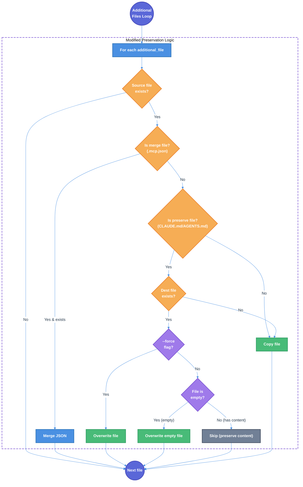

# Force Flag Modification Technical Design Document

| Document Metadata      | Details         |
| ---------------------- | --------------- |
| Author(s)              | Alex Lavaee     |
| Status                 | Draft (WIP)     |
| Team / Owner           | flora131/atomic |
| Created / Last Updated | 2026-01-20      |

## 1. Executive Summary

This RFC proposes modifying the behavior of the `--force`/`-f` flags in the `atomic init` command to enable complete file overwriting, including preserved files like `CLAUDE.md` and `AGENTS.md`. Currently, the force flag is **intentionally ignored** for preserved files, which prevents users from performing a full reset of their configuration. The proposed changes:

1. **With `--force`/`-f`**: Overwrite ALL files, including `CLAUDE.md`/`AGENTS.md` (removing the current bypass)
2. **Without force**: Only preserve files that exist **AND have non-empty content** (empty files will be overwritten)

This gives users explicit control over full configuration resets while protecting actual user customizations from accidental loss.

**Research Reference:** [research/docs/2026-01-20-force-flag-modification-research.md](../research/docs/2026-01-20-force-flag-modification-research.md)

## 2. Context and Motivation

### 2.1 Current State

The init command's preservation logic at `src/commands/init.ts:227-234` **intentionally bypasses** the force flag for preserved files:

```typescript
// src/commands/init.ts:227-234 (CURRENT)
// IMPORTANT: Preserved files (CLAUDE.md, AGENTS.md) are NEVER overwritten,
// even with --force flag. This protects user customizations intentionally.
if (shouldPreserve && destExists) {
  if (process.env.DEBUG === "1") {
    console.log(`[DEBUG] Preserving user file: ${file}`);
  }
  continue;  // ← BYPASSES FORCE FLAG
}
```

**Key observation from research:** The preservation check happens **BEFORE** the force flag check at lines 242-246, meaning preserved files are skipped regardless of the `--force` flag.

**Reference:** [research/docs/2026-01-20-force-flag-modification-research.md - "Critical observation"](../research/docs/2026-01-20-force-flag-modification-research.md)

### 2.2 The Problem

- **User Impact:** Users cannot perform a complete configuration reset even with explicit `--force` flag
- **Workflow Friction:** When template files are updated, users cannot easily sync their `CLAUDE.md`/`AGENTS.md` to the new defaults
- **Unexpected Behavior:** The `--force` flag semantics are inconsistent - it overwrites some files but not others
- **Empty File Issue:** Newly created but empty `CLAUDE.md`/`AGENTS.md` files are preserved unnecessarily, blocking template copy

### 2.3 Force Flag Data Flow (Current)

From the research document:

```
CLI Input: "atomic init --force" or "atomic -a claude -f"
    │
    ▼
src/index.ts:147 - parseArgs() or src/utils/arg-parser.ts:86 hasForceFlag()
    │
    ▼
src/commands/init.ts:178 - shouldForce = options.force ?? false
    │
    ├─────────────────────────────────────────────┐
    │                                             │
    ▼                                             ▼
src/commands/init.ts:211-214                src/commands/init.ts:227-252
copyDirPreserving({ force })                Additional files loop
    │                                             │
    ▼                                             ▼
Lines 90-91: if (!destExists || force)      Lines 227-234: BYPASSES force
             copyFile()                     for preserved files
```

**Reference:** [research/docs/2026-01-20-force-flag-modification-research.md - "Force Flag Data Flow"](../research/docs/2026-01-20-force-flag-modification-research.md)

### 2.4 Agent Configuration Context

| Agent       | `preserve_files` | `additional_files`           |
| ----------- | ---------------- | ---------------------------- |
| claude-code | `["CLAUDE.md"]`  | `["CLAUDE.md", ".mcp.json"]` |
| opencode    | `["AGENTS.md"]`  | `["AGENTS.md"]`              |
| copilot-cli | `["AGENTS.md"]`  | `["AGENTS.md"]`              |

**Reference:** `src/config.ts:29-70`

## 3. Goals and Non-Goals

### 3.1 Functional Goals

- [ ] `--force`/`-f` flag overwrites ALL files including `CLAUDE.md` and `AGENTS.md`
- [ ] Without force, preserved files that exist **AND are empty** (0 bytes or whitespace-only) are overwritten with template
- [ ] Without force, preserved files that exist **AND have content** are preserved (current behavior)
- [ ] New `isFileEmpty()` utility function added to `src/utils/copy.ts`
- [ ] Updated tests reflecting new force flag behavior
- [ ] Debug messages distinguish between "preserved (non-empty)" and "overwriting (empty)"
- [ ] Config folder files (`.claude/`, `.opencode/`, `.github/`) always overwrite template files, preserving only user's custom files not in template

### 3.2 Non-Goals (Out of Scope)

- [ ] We will NOT change the behavior for merge files (`.mcp.json`) - they continue to merge
- [ ] We will NOT add interactive prompts when force-overwriting preserved files
- [ ] We will NOT apply empty file check to config folder files (only to `CLAUDE.md`/`AGENTS.md` additional files)
- [ ] We will NOT add special symlink handling for the empty file check (treat symlinks normally)
- [ ] We will NOT update help text for `--force` flag (current text is sufficient)

## 4. Proposed Solution (High-Level Design)

### 4.1 System Architecture Diagram



### 4.2 Behavioral Pattern

**Force-Respecting Preservation with Empty File Detection**

The implementation modifies the existing preservation logic with two key changes:

1. **Force flag check added**: Preserved files CAN be overwritten when `--force` is specified
2. **Empty file detection**: Preserved files that exist but are empty/whitespace-only are treated as "not customized" and can be safely overwritten

### 4.3 Behavior Matrix (New vs Current)

**Additional Files (`CLAUDE.md`/`AGENTS.md`):**

| Scenario                                         | Current Behavior | New Behavior     |
| ------------------------------------------------ | ---------------- | ---------------- |
| `init` (no flag, CLAUDE.md exists & has content) | Skip             | Skip (preserved) |
| `init` (no flag, CLAUDE.md exists & is empty)    | Skip             | **Overwrite**    |
| `init` (no flag, CLAUDE.md doesn't exist)        | Copy             | Copy             |
| `init --force` (CLAUDE.md exists)                | **Skip**         | **Overwrite**    |
| `init --force` (CLAUDE.md doesn't exist)         | Copy             | Copy             |

**Config Folder Files (`.claude/`, `.opencode/`, `.github/`):**

| Scenario                                            | Current Behavior      | New Behavior          |
| --------------------------------------------------- | --------------------- | --------------------- |
| Template file exists, dest doesn't                  | Copy                  | Copy                  |
| Template file exists, dest exists (no force)        | **Skip (preserve)**   | **Overwrite**         |
| Template file exists, dest exists (with force)      | Overwrite             | Overwrite             |
| User's custom file (not in template)                | Preserved             | Preserved             |

**Reference:** [research/docs/2026-01-20-force-flag-modification-research.md - "Behavior Matrix After Changes"](../research/docs/2026-01-20-force-flag-modification-research.md)

### 4.4 Config Folder Behavior Clarification

The `copyDirPreserving` function (lines 63-97) handles files in `.claude/`, `.opencode/`, `.github/` folders. The behavior is:

| Scenario | Behavior |
|----------|----------|
| Template file exists, destination doesn't | Copy template file |
| Template file exists, destination exists | **Always overwrite** with template (no preservation) |
| User's custom file (not in template) | **Preserve** (not touched) |
| With `--force` flag | Same behavior (force only affects `CLAUDE.md`/`AGENTS.md`) |

**Key principle:** Config folder files from the template are always updated, but user's custom files (commands, agents, skills not in template) are never deleted or modified.

### 4.5 Key Components

| Component              | Responsibility       | Change Required                                                |
| ---------------------- | -------------------- | -------------------------------------------------------------- |
| `src/commands/init.ts` | Preservation logic   | Modify lines 227-234 to check force flag and file emptiness    |
| `src/commands/init.ts` | Config folder copy   | Modify `copyDirPreserving` to always overwrite template files  |
| `src/utils/copy.ts`    | File utilities       | Add `isFileEmpty()` utility function                           |
| `tests/init.test.ts`   | Init command tests   | Update force+preserve test, add empty file tests               |
| `tests/copy.test.ts`   | Copy utility tests   | Add tests for `isFileEmpty()`                                  |

## 5. Detailed Design

### 5.1 New Utility Function: `isFileEmpty()`

**Location:** `src/utils/copy.ts`

```typescript
/**
 * Check if a file exists and is empty (0 bytes or only whitespace)
 * @param path - Path to the file to check
 * @returns true if file is empty or whitespace-only, false otherwise
 */
export async function isFileEmpty(path: string): Promise<boolean> {
  try {
    const file = Bun.file(path);
    const size = file.size;
    
    // Zero-byte files are definitely empty
    if (size === 0) return true;
    
    // Check for whitespace-only content (small files only for performance)
    if (size < 1024) {
      const content = await file.text();
      return content.trim().length === 0;
    }
    
    // Larger files with content are not empty
    return false;
  } catch {
    // Treat errors as "empty" to allow overwrite
    return true;
  }
}
```

**Design Decisions:**

1. **Whitespace check**: Files containing only whitespace (spaces, newlines, tabs) are considered empty since they have no meaningful user content
2. **Size threshold**: Only check content for files under 1KB to avoid performance issues
3. **Error handling**: Errors (e.g., permission issues) treated as "empty" to favor overwriting - if we can't read it, let the copy operation handle the error

**Reference:** [research/docs/2026-01-20-force-flag-modification-research.md - "Change 2: Add Empty File Check Utility"](../research/docs/2026-01-20-force-flag-modification-research.md)

### 5.2 Modified Preservation Logic

**Location:** `src/commands/init.ts:227-234`

**Current Code:**
```typescript
// IMPORTANT: Preserved files (CLAUDE.md, AGENTS.md) are NEVER overwritten,
// even with --force flag. This protects user customizations intentionally.
if (shouldPreserve && destExists) {
  if (process.env.DEBUG === "1") {
    console.log(`[DEBUG] Preserving user file: ${file}`);
  }
  continue;
}
```

**New Code:**
```typescript
// With --force: overwrite ALL files including preserved files
// Without --force: preserve files that exist AND have content
if (shouldPreserve && destExists && !shouldForce) {
  // Check if file is empty - empty files should be overwritten
  const isEmpty = await isFileEmpty(destFile);
  if (!isEmpty) {
    if (process.env.DEBUG === "1") {
      console.log(`[DEBUG] Preserving non-empty user file: ${file}`);
    }
    continue;
  }
  // Empty file - fall through to copy
  if (process.env.DEBUG === "1") {
    console.log(`[DEBUG] Overwriting empty preserved file: ${file}`);
  }
}
```

**Key Changes:**

1. **Added `!shouldForce` condition**: Force flag now bypasses the entire preservation block
2. **Added empty file check**: Non-force mode only preserves files with actual content
3. **Updated debug logging**: Distinguishes between "preserved (non-empty)" and "overwriting (empty)"

**Reference:** [research/docs/2026-01-20-force-flag-modification-research.md - "Change 1: Modify Preservation to Respect Force Flag"](../research/docs/2026-01-20-force-flag-modification-research.md)

### 5.3 Required Import Addition

**Location:** `src/commands/init.ts` (imports section)

```typescript
import { copyFile, pathExists, isFileEmpty } from "../utils/copy";
```

### 5.4 Modified `copyDirPreserving` Behavior

**Location:** `src/commands/init.ts:63-97`

The `copyDirPreserving` function needs to be modified to **always overwrite** template files while preserving user's custom files.

**Current Code:**
```typescript
// src/commands/init.ts:88-96
const destExists = await pathExists(destPath);

// Only copy if destination doesn't exist OR force flag is set
if (!destExists || force) {
  await copyFile(srcPath, destPath);
}
// Otherwise skip - preserve user's existing file
```

**New Code:**
```typescript
// src/commands/init.ts:88-96
// Always overwrite files that exist in template
// User's custom files (not in template) are automatically preserved
// since we only iterate over source files
await copyFile(srcPath, destPath);
```

**Key Change:** Remove the `!destExists || force` condition - template files are always copied/overwritten. This ensures users get the latest template configurations while their custom commands, agents, and skills (which don't exist in the template) are preserved.

**Note:** The `force` parameter is no longer needed for `copyDirPreserving` since it always overwrites. The force flag only affects `CLAUDE.md`/`AGENTS.md` preservation logic.

### 5.5 Help Text (No Change Required)

The current help text is sufficient:
```
-f, --force           Overwrite all files including CLAUDE.md/AGENTS.md
```

## 6. Alternatives Considered

| Option                                           | Pros                                                 | Cons                                             | Reason for Rejection                                            |
| ------------------------------------------------ | ---------------------------------------------------- | ------------------------------------------------ | --------------------------------------------------------------- |
| **A: Keep current behavior**                     | Protects user files unconditionally                  | `--force` becomes misleading, can't reset config | Users expect `--force` to actually force                        |
| **B: Add `--force-all` flag**                    | Backward compatible                                  | Yet another flag, confusing UX                   | Over-complicates CLI for niche use case                         |
| **C: Interactive confirmation for force**        | Explicit user consent                                | Breaks automation, adds friction                 | Force flag implies user already consented                       |
| **D: Modify force + add empty check (Selected)** | Intuitive `--force` semantics, protects real content | Changes existing behavior                        | **Selected:** Best balance of expected semantics and protection |

## 7. Cross-Cutting Concerns

### 7.1 Security and Privacy

- **No new attack surface**: Only affects local file operations
- **Same permission model**: Respects existing file system permissions
- **User consent model**: `--force` requires explicit user action

### 7.2 Backward Compatibility

**This is a behavioral change affecting two areas:**

**1. Force flag behavior for preserved files:**

| Scenario                               | Before    | After            |
| -------------------------------------- | --------- | ---------------- |
| `init --force` with existing CLAUDE.md | Preserved | **Overwritten**  |
| `init` with empty CLAUDE.md            | Preserved | **Overwritten**  |
| `init` with non-empty CLAUDE.md        | Preserved | Preserved (same) |

**2. Config folder file handling (`.claude/`, `.opencode/`, `.github/`):**

| Scenario                                       | Before              | After               |
| ---------------------------------------------- | ------------------- | ------------------- |
| `init` with existing `.claude/settings.json`   | Preserved           | **Overwritten**     |
| `init` with user's custom command file         | Preserved           | Preserved (same)    |
| `init --force` with existing config files      | Overwritten         | Overwritten (same)  |

**Migration Note:** Users who modified template config files (like `settings.json`) will have their changes overwritten. Custom files not in the template are safe.

**Migration Note:** Users who previously relied on `--force` NOT overwriting preserved files will experience different behavior. However, the new behavior aligns with reasonable expectations of what `--force` should do.

### 7.3 Observability Strategy

- **Debug logging**: Existing debug mode (`DEBUG=1`) will show whether files are preserved or overwritten
- **Updated debug messages**: Distinguish between "non-empty" preservation and "empty" overwrites

## 8. Migration, Rollout, and Testing

### 8.1 Deployment Strategy

This change can be deployed immediately:
- No feature flag required (change aligns with expected CLI semantics)
- Breaking change for `--force` behavior is intentional and documented
- Users who need old behavior can simply not use `--force`

### 8.2 Test Plan

#### Unit Tests - `isFileEmpty()` (`tests/copy.test.ts`)

```typescript
import { isFileEmpty } from "../src/utils/copy";

describe("isFileEmpty", () => {
  test("returns true for 0-byte file", async () => {
    const path = await createTempFile("");
    expect(await isFileEmpty(path)).toBe(true);
  });

  test("returns true for whitespace-only file", async () => {
    const path = await createTempFile("   \n\t  \n  ");
    expect(await isFileEmpty(path)).toBe(true);
  });

  test("returns false for file with content", async () => {
    const path = await createTempFile("# My Instructions");
    expect(await isFileEmpty(path)).toBe(false);
  });

  test("returns false for file with minimal content", async () => {
    const path = await createTempFile("x");
    expect(await isFileEmpty(path)).toBe(false);
  });

  test("returns true for non-existent file", async () => {
    expect(await isFileEmpty("/nonexistent/path")).toBe(true);
  });
});
```

#### Unit Tests - Preservation Logic (`tests/init.test.ts`)

**Update existing test at lines 197-215:**

```typescript
// BEFORE: Expected wasSkipped to be true
// AFTER: Expected wasSkipped to be false (force should override)
test("preservation logic: preserved files ARE overwritten with force=true", () => {
  const preserveFiles = ["CLAUDE.md", "AGENTS.md"];
  const file = "CLAUDE.md";
  const destExists = true;
  const shouldForce = true;

  const shouldPreserve = preserveFiles.includes(file);

  let wasSkipped = false;
  // NEW LOGIC: force flag bypasses preservation
  if (shouldPreserve && destExists && !shouldForce) {
    wasSkipped = true;
  }

  expect(wasSkipped).toBe(false);  // Force overrides preservation
});
```

**Add new tests:**

```typescript
test("preservation logic: non-empty preserved files skip copy without force", async () => {
  const destFile = await createTempFile("# User content");
  const shouldForce = false;
  
  const isEmpty = await isFileEmpty(destFile);
  const shouldSkip = !shouldForce && !isEmpty;
  
  expect(shouldSkip).toBe(true);
});

test("preservation logic: empty preserved files are overwritten without force", async () => {
  const destFile = await createTempFile("");
  const shouldForce = false;
  
  const isEmpty = await isFileEmpty(destFile);
  const shouldSkip = !shouldForce && !isEmpty;
  
  expect(shouldSkip).toBe(false);  // Empty files not skipped
});

test("preservation logic: whitespace-only preserved files are overwritten", async () => {
  const destFile = await createTempFile("   \n  \t  ");
  const shouldForce = false;
  
  const isEmpty = await isFileEmpty(destFile);
  const shouldSkip = !shouldForce && !isEmpty;
  
  expect(shouldSkip).toBe(false);  // Whitespace-only not skipped
});
```

#### Integration Tests

**Force Flag Behavior:**
- [ ] `atomic init --force` with existing `CLAUDE.md` overwrites the file
- [ ] `atomic init -f` with existing `AGENTS.md` overwrites the file
- [ ] `atomic -a claude-code -f` auto-init force overwrites `CLAUDE.md`

**Empty File Detection:**
- [ ] `atomic init` with empty `CLAUDE.md` (0 bytes) overwrites with template
- [ ] `atomic init` with whitespace-only `AGENTS.md` overwrites with template
- [ ] `atomic init` with content in `CLAUDE.md` preserves user content

**Config Folder Behavior:**
- [ ] `atomic init` always overwrites template files in `.claude/` folder
- [ ] `atomic init` preserves user's custom files in `.claude/commands/` not in template
- [ ] `atomic init` preserves user's custom files in `.claude/agents/` not in template
- [ ] `atomic init` preserves user's custom files in `.claude/skills/` not in template
- [ ] Re-running `atomic init` updates `.claude/settings.json` to latest template version

## 9. Resolved Questions

All open questions from the research document have been resolved:

- [x] **Definition of "empty"**: Whitespace-only files (spaces, newlines, tabs only) are considered empty. **Confirmed.**

- [x] **Help text update**: No update needed - current help text is sufficient. **Resolved: No change.**

- [x] **Debug logging updates**: Yes, debug messages should distinguish between "preserved (non-empty)" and "overwriting (empty)". **Resolved: Implemented in new code.**

- [x] **Config folder files**: Config folder files (`.claude/`, `.opencode/`, `.github/`) should **always overwrite** template files. No empty file check needed - those files are always updated. User's custom files (not in template) are preserved automatically. **Resolved: Update `copyDirPreserving` to always overwrite.**

- [x] **Symlink handling**: No special handling needed - treat symlinks normally. **Resolved: No special handling.**

**Reference:** [research/docs/2026-01-20-force-flag-modification-research.md - "Open Questions"](../research/docs/2026-01-20-force-flag-modification-research.md)

## 10. Implementation File Changes

| File                   | Change Type | Description                                                                         |
| ---------------------- | ----------- | ----------------------------------------------------------------------------------- |
| `src/utils/copy.ts`    | Modify      | Add `isFileEmpty()` utility function                                                |
| `src/commands/init.ts` | Modify      | Update preservation logic at lines 227-234 to respect force flag and check emptiness |
| `src/commands/init.ts` | Modify      | Update `copyDirPreserving` at lines 63-97 to always overwrite template files        |
| `tests/copy.test.ts`   | Modify      | Add tests for `isFileEmpty()` function                                              |
| `tests/init.test.ts`   | Modify      | Update force+preserve test (line 227), add empty file tests, add config folder tests |

## 11. Code References

### Core Implementation Files
- `src/commands/init.ts:227-234` - Preservation logic for additional files (main change point)
- `src/commands/init.ts:217-252` - Additional files handling loop
- `src/commands/init.ts:178` - Force flag extraction (`shouldForce`)
- `src/commands/init.ts:63-97` - `copyDirPreserving` function (change to always overwrite template files)

### Configuration
- `src/config.ts:29-70` - `AGENT_CONFIG` with `preserve_files`
- `src/config.ts:38` - Claude `preserve_files: ["CLAUDE.md"]`
- `src/config.ts:55` - OpenCode `preserve_files: ["AGENTS.md"]`

### CLI Entry Points
- `src/index.ts:147` - Force flag in `parseArgs` options
- `src/index.ts:48` - Help text for `-f`/`--force`
- `src/utils/arg-parser.ts:86-93` - `hasForceFlag()` utility

### Utility Functions
- `src/utils/copy.ts:189-198` - `pathExists()` function
- `src/utils/copy.ts:43-51` - `copyFile()` function

### Tests
- `tests/init.test.ts:197-215` - Preservation with force test (needs update)
- `tests/init.test.ts:163-277` - File preservation logic tests
- `tests/routing.test.ts:449-478` - `hasForceFlag()` tests

## 12. Related Research Documents

- [research/docs/2026-01-20-force-flag-modification-research.md](../research/docs/2026-01-20-force-flag-modification-research.md) - Primary research document
- [research/docs/2026-01-20-init-config-merge-behavior.md](../research/docs/2026-01-20-init-config-merge-behavior.md) - Config merge behavior context
- [research/docs/2026-01-19-cli-auto-init-agent.md](../research/docs/2026-01-19-cli-auto-init-agent.md) - Auto-init behavior
