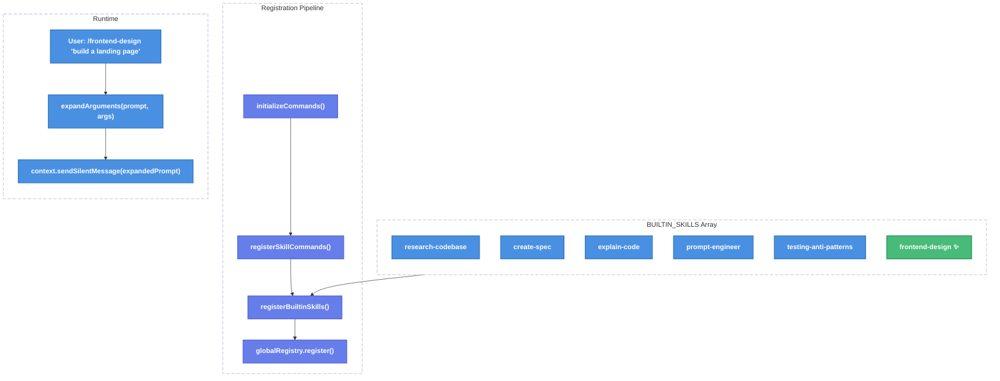

# Frontend Design Built-in Skill Integration

| Document Metadata      | Details     |
| ---------------------- | ----------- |
| Author(s)              | Developer   |
| Status                 | Draft (WIP) |
| Team / Owner           | Atomic CLI  |
| Created / Last Updated | 2026-02-14  |

## 1. Executive Summary

The `frontend-design` skill currently exists as a standalone Markdown file (`frontend-design.md`) at the project root. This spec proposes embedding it as a built-in skill in the `BUILTIN_SKILLS` array within `src/ui/commands/skill-commands.ts`, following the identical pattern used by the existing 5 built-in skills (`research-codebase`, `create-spec`, `explain-code`, `prompt-engineer`, `testing-anti-patterns`). This will make `frontend-design` available as a `/frontend-design` slash command across all agent SDKs (OpenCode, Claude Agent, Copilot) without requiring disk-based discovery, and will surface it automatically in the system prompt for agent awareness.

## 2. Context and Motivation

### 2.1 Current State

The Atomic CLI has a dual-layer skill system ([ref: research/docs/2026-02-14-frontend-design-builtin-skill-integration.md](../research/docs/2026-02-14-frontend-design-builtin-skill-integration.md)):

- **Built-in skills**: Embedded in the `BUILTIN_SKILLS` array in `src/ui/commands/skill-commands.ts:72-1101`. These are TypeScript objects implementing the `BuiltinSkill` interface with inline prompt content. They register automatically during `initializeCommands()` → `registerSkillCommands()` → `registerBuiltinSkills()`.
- **Disk-based skills**: Loaded from `SKILL.md` files discovered in `.claude/skills/`, `.opencode/skills/`, `.github/skills/`, and global paths. These use the `SKILL_DEFINITIONS` legacy array as fallback metadata.

The `frontend-design` skill content currently lives at `frontend-design.md` in the project root with YAML frontmatter (`name: frontend-design`, `description: ...`) and a comprehensive prompt body covering design thinking, typography, color, motion, spatial composition, and anti-patterns for generic AI aesthetics.

**Limitations:**
- The skill is not registered as a slash command — users cannot invoke it via `/frontend-design`.
- Agents are unaware of its existence since it does not appear in `buildCapabilitiesSystemPrompt()` output.
- The root-level `frontend-design.md` file sits outside the standard skill discovery paths.

### 2.2 The Problem

- **User Impact:** Users referencing `AGENTS.md` instructions (e.g., "Fix UI issues by referencing your frontend-design skill") have no built-in `/frontend-design` command available.
- **Agent Impact:** The agent cannot auto-discover or invoke the skill, reducing design quality of generated frontends.
- **Consistency:** All other core skills are embedded in `BUILTIN_SKILLS`; `frontend-design` is the only one still at project root as a loose Markdown file.

## 3. Goals and Non-Goals

### 3.1 Functional Goals

- [x] Register `frontend-design` as a built-in skill via the `BUILTIN_SKILLS` array.
- [x] Make `/frontend-design` available as a slash command in the TUI with optional arguments.
- [x] Skill prompt supports `$ARGUMENTS` placeholder for user-provided design requirements.
- [x] Skill appears in the system prompt capabilities section automatically (`buildCapabilitiesSystemPrompt()`).
- [x] Skill works with all three agent SDKs (OpenCode, Claude Agent, Copilot).

### 3.2 Non-Goals (Out of Scope)

- [ ] We will NOT implement disk-based skill discovery for `frontend-design` (built-in only).
- [ ] We will NOT modify the `frontend-design.md` source file content — the prompt is embedded as-is.
- [ ] We will NOT add `frontend-design` to the `SKILL_DEFINITIONS` legacy array (it will be built-in only).
- [ ] We will NOT create a new `SKILL.md` directory structure for this skill.
- [ ] We will NOT implement any new UI components or modify the skill loading indicator.

## 4. Proposed Solution (High-Level Design)

### 4.1 System Architecture Diagram

The change is a single addition to the existing `BUILTIN_SKILLS` array. No architectural changes required.



### 4.2 Architectural Pattern

No new pattern introduced. This follows the **exact same "Embedded Built-in Skill"** pattern used by all 5 existing built-in skills ([ref: research/docs/2026-02-14-frontend-design-builtin-skill-integration.md, §3 Skill Registration Pipeline](../research/docs/2026-02-14-frontend-design-builtin-skill-integration.md)).

### 4.3 Key Components

| Component                         | Responsibility                                     | Location                                      | Change Required                         |
| --------------------------------- | -------------------------------------------------- | --------------------------------------------- | --------------------------------------- |
| `BUILTIN_SKILLS` array            | Holds all embedded skill definitions               | `src/ui/commands/skill-commands.ts:72-1101`   | Add new entry before closing `];`       |
| `BuiltinSkill` interface          | Type definition for skill objects                  | `src/ui/commands/skill-commands.ts:47-60`     | None (reuse as-is)                      |
| `createBuiltinSkillCommand()`     | Creates `CommandDefinition` from `BuiltinSkill`    | `src/ui/commands/skill-commands.ts:1228-1254` | None (reuse as-is)                      |
| `registerBuiltinSkills()`         | Registers all built-in skills with global registry | `src/ui/commands/skill-commands.ts:1289-1296` | None (automatic)                        |
| `expandArguments()`               | Replaces `$ARGUMENTS` in prompt                    | `src/ui/commands/skill-commands.ts:1144-1145` | None (reuse as-is)                      |
| `buildCapabilitiesSystemPrompt()` | Lists skills in agent system prompt                | `src/ui/index.ts:32-72`                       | None (automatic for category `"skill"`) |

## 5. Detailed Design

### 5.1 New `BUILTIN_SKILLS` Entry

Add the following entry to the `BUILTIN_SKILLS` array at `src/ui/commands/skill-commands.ts`, immediately before the closing `];` at line 1101:

```typescript
{
  name: "frontend-design",
  description: "Create distinctive, production-grade frontend interfaces with high design quality",
  aliases: ["fd", "design"],
  argumentHint: "<requirements>",
  prompt: `This skill guides creation of distinctive, production-grade frontend interfaces that avoid generic "AI slop" aesthetics. Implement real working code with exceptional attention to aesthetic details and creative choices.

The user provides frontend requirements: $ARGUMENTS

## Design Thinking

Before coding, understand the context and commit to a BOLD aesthetic direction:
- **Purpose**: What problem does this interface solve? Who uses it?
- **Tone**: Pick an extreme: brutally minimal, maximalist chaos, retro-futuristic, organic/natural, luxury/refined, playful/toy-like, editorial/magazine, brutalist/raw, art deco/geometric, soft/pastel, industrial/utilitarian, etc. There are so many flavors to choose from. Use these for inspiration but design one that is true to the aesthetic direction.
- **Constraints**: Technical requirements (framework, performance, accessibility).
- **Differentiation**: What makes this UNFORGETTABLE? What's the one thing someone will remember?

**CRITICAL**: Choose a clear conceptual direction and execute it with precision. Bold maximalism and refined minimalism both work - the key is intentionality, not intensity.

Then implement working code (HTML/CSS/JS, React, Vue, etc.) that is:
- Production-grade and functional
- Visually striking and memorable
- Cohesive with a clear aesthetic point-of-view
- Meticulously refined in every detail

## Frontend Aesthetics Guidelines

Focus on:
- **Typography**: Choose fonts that are beautiful, unique, and interesting. Avoid generic fonts like Arial and Inter; opt instead for distinctive choices that elevate the frontend's aesthetics; unexpected, characterful font choices. Pair a distinctive display font with a refined body font.
- **Color & Theme**: Commit to a cohesive aesthetic. Use CSS variables for consistency. Dominant colors with sharp accents outperform timid, evenly-distributed palettes.
- **Motion**: Use animations for effects and micro-interactions. Prioritize CSS-only solutions for HTML. Use Motion library for React when available. Focus on high-impact moments: one well-orchestrated page load with staggered reveals (animation-delay) creates more delight than scattered micro-interactions. Use scroll-triggering and hover states that surprise.
- **Spatial Composition**: Unexpected layouts. Asymmetry. Overlap. Diagonal flow. Grid-breaking elements. Generous negative space OR controlled density.
- **Backgrounds & Visual Details**: Create atmosphere and depth rather than defaulting to solid colors. Add contextual effects and textures that match the overall aesthetic. Apply creative forms like gradient meshes, noise textures, geometric patterns, layered transparencies, dramatic shadows, decorative borders, custom cursors, and grain overlays.

NEVER use generic AI-generated aesthetics like overused font families (Inter, Roboto, Arial, system fonts), cliched color schemes (particularly purple gradients on white backgrounds), predictable layouts and component patterns, and cookie-cutter design that lacks context-specific character.

Interpret creatively and make unexpected choices that feel genuinely designed for the context. No design should be the same. Vary between light and dark themes, different fonts, different aesthetics. NEVER converge on common choices (Space Grotesk, for example) across generations.

**IMPORTANT**: Match implementation complexity to the aesthetic vision. Maximalist designs need elaborate code with extensive animations and effects. Minimalist or refined designs need restraint, precision, and careful attention to spacing, typography, and subtle details. Elegance comes from executing the vision well.

Remember: Claude is capable of extraordinary creative work. Don't hold back, show what can truly be created when thinking outside the box and committing fully to a distinctive vision.`,
},
```

### 5.2 Field Mapping from Source

The prompt content is sourced from `frontend-design.md` at the project root ([ref: research/docs/2026-02-14-frontend-design-builtin-skill-integration.md, §8](../research/docs/2026-02-14-frontend-design-builtin-skill-integration.md)):

| `BuiltinSkill` Field | Source                                                | Value                                                                                 |
| -------------------- | ----------------------------------------------------- | ------------------------------------------------------------------------------------- |
| `name`               | Frontmatter `name`                                    | `"frontend-design"`                                                                   |
| `description`        | Frontmatter `description` (truncated for readability) | `"Create distinctive, production-grade frontend interfaces with high design quality"` |
| `aliases`            | New (not in source)                                   | `["fd", "design"]`                                                                    |
| `argumentHint`       | New (not in source)                                   | `"<requirements>"`                                                                    |
| `requiredArguments`  | Omitted (optional usage)                              | `undefined` — skill works with or without arguments                                   |
| `prompt`             | Markdown body (below frontmatter)                     | Full prompt content with `$ARGUMENTS` replacing the original user-context sentence    |

### 5.3 `$ARGUMENTS` Integration

The original `frontend-design.md` body includes the line:

> "The user provides frontend requirements: a component, page, application, or interface to build."

This is replaced with:

> "The user provides frontend requirements: $ARGUMENTS"

At invocation time, `expandArguments()` ([ref: skill-commands.ts:1144-1145](../src/ui/commands/skill-commands.ts)) substitutes `$ARGUMENTS` with user-provided text or `"[no arguments provided]"` if empty.

### 5.4 Pinned Status Decision

`frontend-design` should **NOT** be added to `PINNED_BUILTIN_SKILLS` ([ref: skill-commands.ts:1345-1348](../src/ui/commands/skill-commands.ts)). Rationale:

- Unlike `prompt-engineer` and `testing-anti-patterns` which encode methodology, `frontend-design` encodes aesthetic preferences that users may reasonably want to override with project-specific design systems.
- Allowing disk-based override (project-level `.claude/skills/frontend-design/SKILL.md`) gives teams the flexibility to customize the design approach.
- The priority system already handles this: project (3) > user (2) > builtin (1).

### 5.5 Invocation Examples

```
/frontend-design build a landing page for a SaaS product
/frontend-design create a dashboard with dark theme and data visualizations
/frontend-design                        # Works without args
/fd responsive navigation component     # Via alias
/design portfolio site with brutalist aesthetic  # Via alias
```

### 5.6 System Prompt Output

After registration, `buildCapabilitiesSystemPrompt()` will automatically include:

```
Skills (invoke with /skill-name):
  /research-codebase <research-question> - Document codebase as-is...
  /create-spec <research-path> - Create a detailed execution plan...
  /explain-code <code-path> - Explain code functionality in detail.
  /prompt-engineer <prompt-description> - Skill: Create, improve, or optimize prompts...
  /testing-anti-patterns - Skill: Identify and prevent testing anti-patterns...
  /frontend-design <requirements> - Create distinctive, production-grade frontend interfaces...
```

## 6. Alternatives Considered

| Option                                  | Pros                                                                                                              | Cons                                                                                                      | Reason for Rejection                                                                                                                         |
| --------------------------------------- | ----------------------------------------------------------------------------------------------------------------- | --------------------------------------------------------------------------------------------------------- | -------------------------------------------------------------------------------------------------------------------------------------------- |
| A: Disk-based SKILL.md                  | Standard format; overridable per-project; follows Agent Skills spec                                               | Requires implementing disk discovery (not yet built); adds startup I/O; skill content split from codebase | Disk-based discovery is not yet implemented. Built-in embedding is the established pattern for core skills.                                  |
| B: Add to `SKILL_DEFINITIONS` (legacy)  | Simple metadata entry                                                                                             | No embedded prompt; requires disk file for content; legacy system being phased out                        | Legacy array is for backward compatibility only. New skills should use `BUILTIN_SKILLS`.                                                     |
| C: Embed in `BUILTIN_SKILLS` (Selected) | Zero additional infrastructure; automatic registration; consistent with 5 existing skills; immediate availability | Prompt content embedded in TypeScript file (large string); changes require code deploy                    | **Selected.** Matches established pattern. All core skills use this approach. Prompt stability (rarely changes) makes embedding appropriate. |
| D: Keep as root-level `.md` file        | No code changes needed                                                                                            | Not discoverable; not invokable; agents unaware; inconsistent with other skills                           | Does not solve the core problem of discoverability and invocability.                                                                         |

## 7. Cross-Cutting Concerns

### 7.1 SDK Compatibility

The built-in skill system works identically across all three SDKs ([ref: research/docs/2026-02-14-frontend-design-builtin-skill-integration.md, §9](../research/docs/2026-02-14-frontend-design-builtin-skill-integration.md)):

- **OpenCode**: Skills registered via `globalRegistry` are available as slash commands. No SDK-specific passthrough needed.
- **Claude Agent**: Skills appear in system prompt. Claude Agent SDK auto-discovers via `settingSources`.
- **Copilot**: Skills are passed via `skillDirectories` in `SessionConfig` at `src/sdk/copilot-client.ts:732-786`. Built-in skills with embedded prompts are handled by the Atomic command system, NOT by SDK passthrough.

### 7.2 Skill Load UI

The `SkillLoadIndicator` component at `src/ui/components/skill-load-indicator.tsx` automatically renders loading/loaded/error states for all registered skills ([ref: research/docs/2026-02-08-skill-loading-from-configs-and-ui.md](../research/docs/2026-02-08-skill-loading-from-configs-and-ui.md)). No changes needed.

### 7.3 Override Behavior

Per the priority system ([ref: research/docs/2026-02-08-skill-loading-from-configs-and-ui.md](../research/docs/2026-02-08-skill-loading-from-configs-and-ui.md)):

```
project (3)  >  user (2)  >  builtin (1)
```

A project-level `frontend-design` skill in `.claude/skills/frontend-design/SKILL.md` will override the built-in version (since `frontend-design` is NOT pinned).

## 8. Migration, Rollout, and Testing

### 8.1 Deployment Strategy

This is a single-step change with no phased rollout needed:

- [x] Phase 1: Add entry to `BUILTIN_SKILLS` array.
- [x] Phase 2: Verify registration via `bun typecheck` and `bun lint`.
- [x] Phase 3: Manual verification: launch TUI, confirm `/frontend-design` appears in slash command autocomplete.

### 8.2 Data Migration Plan

No data migration required. The root-level `frontend-design.md` file can remain as documentation/reference. It is not consumed by the built-in skill system.

### 8.3 Test Plan

- **Unit Tests:** Verify `getBuiltinSkill("frontend-design")` returns the correct `BuiltinSkill` object. Verify aliases `"fd"` and `"design"` resolve correctly.
- **Integration Tests:** Verify `registerBuiltinSkills()` registers `frontend-design` in `globalRegistry`. Verify `expandArguments()` correctly substitutes `$ARGUMENTS` in the prompt.
- **End-to-End Tests:** Launch TUI with `bun run src/cli.ts chat -a copilot` (or `claude`/`opencode`), type `/frontend-design build a card component`, confirm prompt is sent to agent and response contains frontend code with design considerations.

## 9. Open Questions / Unresolved Issues

- [x] **Should `frontend-design` require arguments?** → **Decision: No.** Unlike `create-spec` or `explain-code` which need a target, `frontend-design` can work as a general design guide without arguments. `$ARGUMENTS` gracefully falls back to `"[no arguments provided]"`.
- [x] **Should aliases be added?** → **Decision: Yes.** Aliases `["fd", "design"]` provide convenient shortcuts consistent with other skills having aliases (e.g., `research-codebase` → `research`, `create-spec` → `spec`).
- [ ] **Should `frontend-design.md` at project root be removed after embedding?** → Recommendation: Keep it as documentation reference but document that the canonical source is now `BUILTIN_SKILLS`. Final decision deferred to implementation.
- [ ] **Should a `SKILL_DEFINITIONS` entry be added for disk-based fallback?** → Recommendation: No. The legacy array is being phased out. Skills already in `BUILTIN_SKILLS` should not be duplicated in `SKILL_DEFINITIONS` ([ref: research/docs/2026-02-14-frontend-design-builtin-skill-integration.md, §6](../research/docs/2026-02-14-frontend-design-builtin-skill-integration.md)).

## Appendix: Implementation Checklist

1. Open `src/ui/commands/skill-commands.ts`
2. Locate the `BUILTIN_SKILLS` array closing bracket at line ~1101
3. Add the new `frontend-design` entry object before `];`
4. Run `bun typecheck` — expect no errors
5. Run `bun lint` — expect no errors
6. Run `bun test` — expect no regressions
7. Manual smoke test: `bun run src/cli.ts chat`, type `/frontend-design`, confirm autocomplete and execution

## Research References

- [research/docs/2026-02-14-frontend-design-builtin-skill-integration.md](../research/docs/2026-02-14-frontend-design-builtin-skill-integration.md) — Primary research: full skill integration pipeline documentation
- [research/docs/2026-02-08-skill-loading-from-configs-and-ui.md](../research/docs/2026-02-08-skill-loading-from-configs-and-ui.md) — Skill loading from configs, priority system, SKILL.md format, UI indicator
- [research/docs/2026-02-02-atomic-builtin-workflows-research.md](../research/docs/2026-02-02-atomic-builtin-workflows-research.md) — Built-in commands, skills, and workflows research
- [research/docs/2026-02-05-pluggable-workflows-sdk-design.md](../research/docs/2026-02-05-pluggable-workflows-sdk-design.md) — Pluggable SDK design for commands and skills
- [frontend-design.md](../frontend-design.md) — Source skill content to embed
