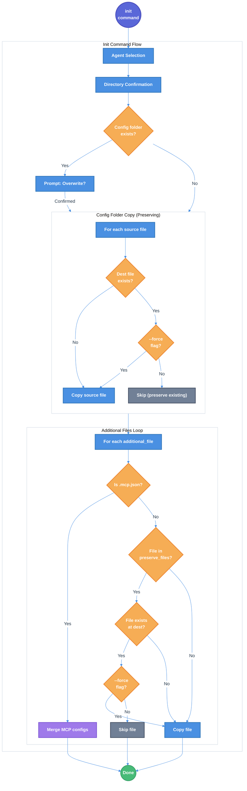

# Init Command Config Merge Behavior Technical Design Document

| Document Metadata      | Details         |
| ---------------------- | --------------- |
| Author(s)              | lavaman131      |
| Status                 | Draft (WIP)     |
| Team / Owner           | flora131/atomic |
| Created / Last Updated | 2026-01-20      |

## 1. Executive Summary

This spec defines the implementation of selective file preservation during the `atomic init` command. Currently, `init` performs a complete overwrite of all configuration files, deleting user customizations in `CLAUDE.md`, `AGENTS.md`, and `.mcp.json`. The proposed solution modifies the init behavior to:

1. **Skip** `CLAUDE.md` and `AGENTS.md` if they already exist in the target directory
2. **Merge** `.mcp.json` - preserving user's existing MCP server configurations while adding CLI-managed entries
3. **Preserve** custom files inside config folders (`.claude/`, `.opencode/`, `.github/`) that don't have matching source files
4. **Maintain** exclusion patterns for config directories (`.github/workflows`, `.github/dependabot.yml`)

This preserves user customizations (project instructions, MCP servers, custom commands/agents/skills) while ensuring CLI-managed files stay up-to-date. **This is a breaking change from previous behavior.**

**Research Reference:** [research/docs/2026-01-20-init-config-merge-behavior.md](../research/docs/2026-01-20-init-config-merge-behavior.md)

## 2. Context and Motivation

### 2.1 Current State

The init command (`src/commands/init.ts:52-201`) follows a **destructive overwrite** pattern:

1. Agent selection (lines 73-103)
2. Directory confirmation (lines 108-121)
3. Overwrite confirmation prompt if folder exists (lines 123-144)
4. **Complete folder deletion** (lines 154-157)
5. Config folder copy with exclusions (lines 159-163)
6. Additional files copy - always overwrites (lines 165-173)

**Current folder deletion behavior:**

```typescript
// src/commands/init.ts:154-157
if (folderExists) {
  await rm(targetFolder, { recursive: true, force: true });
}
```

**Current additional files behavior:**

```typescript
// src/commands/init.ts:165-173
for (const file of agent.additional_files) {
  const srcFile = join(configRoot, file);
  const destFile = join(targetDir, file);

  if (await pathExists(srcFile)) {
    await copyFile(srcFile, destFile); // Always overwrites
  }
}
```

This was an **intentional design decision** documented in prior specs:

- `specs/atomic-cli-implementation.md` (Non-Goals): "We will NOT implement config merging for existing folders (overwrite only)"
- `specs/cli-auto-init-agent.md` (Non-Goals): "We will NOT add config merging or updating (still overwrite-only)"

### 2.2 The Problem

- **User Impact:** Running `atomic init` after customizing `CLAUDE.md` or `AGENTS.md` destroys all project-specific instructions
- **Workflow Friction:** Users must manually back up and restore customization files before re-initializing
- **Common Scenario:** User wants to update CLI-managed config files (agents, commands, skills) without losing their project documentation

### 2.3 Agent Configuration Context

| Agent Key     | Folder      | additional_files             | User-Customizable |
| ------------- | ----------- | ---------------------------- | ----------------- |
| `claude-code` | `.claude`   | `["CLAUDE.md", ".mcp.json"]` | `CLAUDE.md`       |
| `opencode`    | `.opencode` | `["AGENTS.md"]`              | `AGENTS.md`       |
| `copilot-cli` | `.github`   | `["AGENTS.md"]`              | `AGENTS.md`       |

**Reference:** `src/config.ts:25-60`

## 3. Goals and Non-Goals

### 3.1 Functional Goals

- [ ] `CLAUDE.md` is preserved (not overwritten) if it already exists when running `init`
- [ ] `AGENTS.md` is preserved (not overwritten) if it already exists when running `init`
- [ ] `.mcp.json` is merged - user's existing MCP servers are preserved, CLI-managed entries are added/updated
- [ ] Custom files inside config folders (commands, agents, skills) are preserved if no matching source file exists
- [ ] Optional `-f`/`--force` flag to overwrite all files including preserved ones (skips merge, does full overwrite)
- [ ] **Breaking change** - previous full-overwrite behavior is replaced with preservation/merge behavior

### 3.2 Non-Goals (Out of Scope)

- [ ] We will NOT implement merge/diff behavior for `CLAUDE.md`/`AGENTS.md` (skip-only, no content merging)
- [ ] We will NOT add interactive prompts asking "overwrite this file?" for each file
- [ ] We will NOT provide a migration path - this is a breaking change

## 4. Proposed Solution (High-Level Design)

### 4.1 System Architecture Diagram



### 4.2 Architectural Pattern

**Preservation-First Approach with Selective Merge**

The implementation uses a three-tier strategy:

1. **Preserving folder copy** - Copy config folder contents, but skip files that already exist at destination (preserves user's custom commands, agents, skills)
2. **Preserve additional files** - Skip `CLAUDE.md`/`AGENTS.md` if they exist (never overwrite user's project instructions)
3. **Merge `.mcp.json`** - Deep merge MCP server configurations, preserving user's custom servers while updating CLI-managed entries
4. **Force flag override** - `-f`/`--force` bypasses all preservation and merge logic, performing full overwrite

This approach was chosen because:

- Users may have custom commands, agents, or skills in config folders that should not be lost
- `.mcp.json` may contain user-configured MCP servers alongside CLI-managed ones
- `CLAUDE.md`/`AGENTS.md` are fully user-customizable project instructions
- Breaking change is acceptable - no migration path needed

**Research Reference:** Section "Alternative Approach: Keep Full Overwrite for Folder, Only Preserve Additional Files" in [research/docs/2026-01-20-init-config-merge-behavior.md](../research/docs/2026-01-20-init-config-merge-behavior.md)

### 4.3 Key Components

| Component              | Responsibility                  | Change Required                                                                     |
| ---------------------- | ------------------------------- | ----------------------------------------------------------------------------------- |
| `src/config.ts`        | Agent configuration definitions | Add `preserve_files` and `merge_files` arrays to `AgentConfig` interface            |
| `src/commands/init.ts` | Interactive setup flow          | Add preserving folder copy, .mcp.json merge logic, add `--force` support            |
| `src/utils/merge.ts`   | JSON merge utilities            | **New file** - implement deep merge for `.mcp.json` MCP server configurations       |
| `src/index.ts`         | Entry point, argument parsing   | Add `--force` flag to argument parser                                               |
| `tests/init.test.ts`   | Init command tests              | Add tests for preservation, folder preservation, and merge behavior                 |
| `tests/merge.test.ts`  | Merge utility tests             | **New file** - Add tests for `.mcp.json` merge logic                                |

## 5. Detailed Design

### 5.1 Command Interface Changes

**Updated Command Structure:**

```
atomic init                     # Interactive setup, preserves CLAUDE.md/AGENTS.md
atomic init -f                  # Interactive setup, overwrites ALL files (NEW)
atomic init --force             # Interactive setup, overwrites ALL files (NEW)
atomic init --agent <name>      # Streamlined init, preserves CLAUDE.md/AGENTS.md
atomic init --agent <name> -f   # Streamlined init, overwrites ALL (NEW)
atomic --agent <name>           # Auto-init if needed, preserves CLAUDE.md/AGENTS.md
atomic --agent <name> -f        # Auto-init if needed, overwrites ALL (NEW)
```

**Behavior Matrix:**

| Command                            | CLAUDE.md/AGENTS.md exists | Result                       |
| ---------------------------------- | -------------------------- | ---------------------------- |
| `atomic init`                      | No                         | Copy from template           |
| `atomic init`                      | Yes                        | **Skip** (preserve existing) |
| `atomic init -f` / `--force`       | Yes                        | Overwrite with template      |
| `atomic --agent claude-code`       | No                         | Copy from template           |
| `atomic --agent claude-code`       | Yes                        | **Skip** (preserve existing) |
| `atomic --agent claude-code -f`    | Yes                        | Overwrite with template      |

### 5.2 Interface Changes

**Extended `AgentConfig` Interface** (`src/config.ts:5-20`):

```typescript
export interface AgentConfig {
  name: string;
  cmd: string;
  additional_flags: string[];
  folder: string;
  install_url: string;
  exclude: string[];
  additional_files: string[];
  preserve_files: string[]; // NEW: Files to skip if they exist (e.g., CLAUDE.md, AGENTS.md)
  merge_files: string[];    // NEW: Files to merge instead of overwrite (e.g., .mcp.json)
}
```

**Extended `InitOptions` Interface** (`src/commands/init.ts:24-28`):

```typescript
interface InitOptions {
  showBanner?: boolean;
  preSelectedAgent?: AgentKey;
  configNotFoundMessage?: string;
  force?: boolean; // NEW: Force overwrite of preserved files
}
```

### 5.3 Configuration Changes

**Updated `AGENT_CONFIG`** (`src/config.ts:25-60`):

```typescript
export const AGENT_CONFIG: Record<AgentKey, AgentConfig> = {
  "claude-code": {
    name: "Claude Code",
    cmd: "claude",
    additional_flags: [],
    folder: ".claude",
    install_url: "https://docs.anthropic.com/en/docs/claude-code",
    exclude: [".DS_Store"],
    additional_files: ["CLAUDE.md", ".mcp.json"],
    preserve_files: ["CLAUDE.md"], // NEW: Skip if exists
    merge_files: [".mcp.json"],    // NEW: Merge instead of overwrite
  },
  opencode: {
    name: "OpenCode",
    cmd: "opencode",
    additional_flags: [],
    folder: ".opencode",
    install_url: "https://opencode.ai",
    exclude: [
      "node_modules",
      ".gitignore",
      "bun.lock",
      "package.json",
      ".DS_Store",
    ],
    additional_files: ["AGENTS.md"],
    preserve_files: ["AGENTS.md"], // NEW: Skip if exists
    merge_files: [],               // NEW: No merge files for opencode
  },
  "copilot-cli": {
    name: "GitHub Copilot CLI",
    cmd: "gh",
    additional_flags: ["copilot"],
    folder: ".github",
    install_url: "https://docs.github.com/en/copilot",
    exclude: ["workflows", "dependabot.yml", ".DS_Store"],
    additional_files: ["AGENTS.md"],
    preserve_files: ["AGENTS.md"], // NEW: Skip if exists
    merge_files: [],               // NEW: No merge files for copilot-cli
  },
};
```

### 5.4 Init Command Logic Changes

**5.4.1 Preserving Folder Copy** (`src/commands/init.ts`):

Replace the current folder deletion + copy with a preserving copy:

```typescript
// OLD: Delete and replace entire folder
// if (folderExists) {
//   await rm(targetFolder, { recursive: true, force: true });
// }
// await copyDir(srcFolder, targetFolder, { exclude: agent.exclude });

// NEW: Preserving folder copy - only copy files that don't exist at destination
async function copyDirPreserving(
  src: string,
  dest: string,
  options: { exclude?: string[]; force?: boolean }
): Promise<void> {
  await mkdir(dest, { recursive: true });

  const entries = await readdir(src, { withFileTypes: true });

  for (const entry of entries) {
    const srcPath = join(src, entry.name);
    const destPath = join(dest, entry.name);

    // Skip excluded files/directories
    if (options.exclude?.includes(entry.name)) continue;

    if (entry.isDirectory()) {
      await copyDirPreserving(srcPath, destPath, options);
    } else {
      const destExists = await pathExists(destPath);

      // Only copy if destination doesn't exist OR force flag is set
      if (!destExists || options.force) {
        await copyFile(srcPath, destPath);
      }
      // Otherwise skip - preserve user's existing file
    }
  }
}

// Usage in init command
await copyDirPreserving(srcFolder, targetFolder, {
  exclude: agent.exclude,
  force: options.force,
});
```

**5.4.2 Additional Files with Preservation and Merge** (`src/commands/init.ts:165-200`):

```typescript
// Copy additional files with preservation and merge logic
for (const file of agent.additional_files) {
  const srcFile = join(configRoot, file);
  const destFile = join(targetDir, file);

  if (!(await pathExists(srcFile))) continue;

  const destExists = await pathExists(destFile);
  const shouldPreserve = agent.preserve_files?.includes(file);
  const shouldMerge = agent.merge_files?.includes(file);

  // Force flag bypasses all preservation/merge logic
  if (options.force) {
    await copyFile(srcFile, destFile);
    continue;
  }

  // Handle merge files (e.g., .mcp.json)
  if (shouldMerge && destExists) {
    await mergeJsonFile(srcFile, destFile);
    continue;
  }

  // Handle preserve files (e.g., CLAUDE.md, AGENTS.md)
  if (shouldPreserve && destExists) {
    // Skip - preserve user's customization (no log message)
    continue;
  }

  // Default: copy the file
  await copyFile(srcFile, destFile);
}
```

**5.4.3 MCP JSON Merge Logic** (`src/utils/merge.ts`):

```typescript
import { readFile, writeFile } from "fs/promises";

interface McpConfig {
  mcpServers?: Record<string, unknown>;
  [key: string]: unknown;
}

/**
 * Merge source .mcp.json into destination .mcp.json
 * - Preserves all existing MCP servers in destination
 * - Adds/updates MCP servers from source
 * - Preserves other top-level keys from destination
 */
export async function mergeJsonFile(
  srcPath: string,
  destPath: string
): Promise<void> {
  const srcContent = await readFile(srcPath, "utf-8");
  const destContent = await readFile(destPath, "utf-8");

  const srcConfig: McpConfig = JSON.parse(srcContent);
  const destConfig: McpConfig = JSON.parse(destContent);

  // Deep merge mcpServers - source values override destination for same keys
  const mergedServers = {
    ...destConfig.mcpServers,
    ...srcConfig.mcpServers,
  };

  // Merge top-level config - preserve destination's other keys
  const mergedConfig: McpConfig = {
    ...destConfig,
    ...srcConfig,
    mcpServers: mergedServers,
  };

  await writeFile(destPath, JSON.stringify(mergedConfig, null, 2) + "\n");
}
```

### 5.5 Argument Parser Changes

**Add `--force` flag** (`src/index.ts`):

```typescript
const { values, positionals } = parseArgs({
  args: Bun.argv.slice(2),
  options: {
    version: { type: "boolean", short: "v" },
    help: { type: "boolean", short: "h" },
    agent: { type: "string", short: "a" },
    "no-banner": { type: "boolean" },
    force: { type: "boolean", short: "f" }, // NEW
  },
  strict: false,
  allowPositionals: true,
});
```

**Pass `force` option to init commands:**

```typescript
// In init command routing
await initCommand({
  showBanner: !values["no-banner"],
  preSelectedAgent: values.agent as AgentKey | undefined,
  force: values.force, // NEW
});

// In run-agent auto-init
await initCommand({
  preSelectedAgent: agentKey as AgentKey,
  showBanner: false,
  configNotFoundMessage: `${agent.folder} not found. Setting up ${agent.name}...`,
  force: values.force, // NEW
});
```

### 5.6 Help Text Update

**Updated help output:**

```
Options:
  -a, --agent <name>    Agent name: claude-code, opencode, copilot-cli
  -f, --force           Overwrite all files including CLAUDE.md/AGENTS.md
  -v, --version         Show version number
  -h, --help            Show this help
  --no-banner           Skip ASCII banner display
```

## 6. Alternatives Considered

| Option                                        | Pros                           | Cons                                         | Reason for Rejection                                     |
| --------------------------------------------- | ------------------------------ | -------------------------------------------- | -------------------------------------------------------- |
| **A: Interactive per-file prompts**           | Maximum user control           | Tedious UX, breaks automation                | Too many prompts for a single operation                  |
| **B: Backup files before overwrite**          | Never lose data                | Creates clutter (`CLAUDE.md.bak`), confusing | Implicit file creation is unexpected                     |
| **C: Merge file contents**                    | Preserve both old and new      | Complex logic, potential conflicts           | Over-engineering for simple docs                         |
| **D: Skip all additional files if any exist** | Simple logic                   | Can't update `.mcp.json` when needed         | Too coarse-grained                                       |
| **E: Preserve list in config (Selected)**     | Configurable, explicit, simple | Requires config schema change                | **Selected:** Best balance of simplicity and flexibility |

## 7. Cross-Cutting Concerns

### 7.1 Security and Privacy

- **No new attack surface**: Only affects local file operations
- **Same permission model**: Respects existing file permissions
- **No data exfiltration**: All operations remain local

### 7.2 Observability Strategy

- **Silent operation**: No user feedback when files are preserved or merged
- **No new error conditions**: Preservation and merge are silent on success
- **Debug visibility**: File existence checks and merge operations logged at debug level (if debug mode added)

### 7.3 Backward Compatibility

**This is a breaking change.** The init command behavior changes significantly:

| Scenario                              | Before                 | After                                   |
| ------------------------------------- | ---------------------- | --------------------------------------- |
| Fresh install                         | Copies all files       | Same - copies all files                 |
| Re-init without customization         | Overwrites all         | Same - overwrites all                   |
| Re-init with `CLAUDE.md` changes      | Overwrites (data loss) | **Preserves** (no data loss)            |
| Re-init with `.mcp.json` changes      | Overwrites (data loss) | **Merges** (preserves user's servers)   |
| Re-init with custom files in `.claude/` | Overwrites (data loss) | **Preserves** (keeps custom files)      |
| Re-init with `-f`/`--force`           | N/A (flag didn't exist)| Overwrites all (explicit override)      |

**No Migration Path:** This is an intentional breaking change. Users who relied on full-overwrite behavior must now use `-f`/`--force` explicitly.

## 8. Migration, Rollout, and Testing

### 8.1 Deployment Strategy

This is a **breaking change**. Rollout is immediate upon release:

- No feature flag required
- No migration path - this is intentionally breaking
- `-f`/`--force` provides escape hatch for users wanting full overwrite behavior
- Documentation updated to explain new behavior

### 8.2 Test Plan

#### Unit Tests

**New tests for `src/commands/init.ts`:**

```typescript
// tests/init.test.ts

test("preserves CLAUDE.md when it exists (claude-code)", async () => {
  // Setup: Create target dir with existing CLAUDE.md
  const targetDir = await createTempDir();
  const claudeMdPath = join(targetDir, "CLAUDE.md");
  await writeFile(claudeMdPath, "# My Custom Instructions");

  // Act: Run init with claude-code
  await initCommand({
    preSelectedAgent: "claude-code",
    showBanner: false,
  });

  // Assert: CLAUDE.md preserved
  const content = await Bun.file(claudeMdPath).text();
  expect(content).toBe("# My Custom Instructions");
});

test("preserves AGENTS.md when it exists (opencode)", async () => {
  const targetDir = await createTempDir();
  const agentsMdPath = join(targetDir, "AGENTS.md");
  await writeFile(agentsMdPath, "# Custom OpenCode Instructions");

  await initCommand({
    preSelectedAgent: "opencode",
    showBanner: false,
  });

  const content = await Bun.file(agentsMdPath).text();
  expect(content).toBe("# Custom OpenCode Instructions");
});

test("overwrites CLAUDE.md with --force flag", async () => {
  const targetDir = await createTempDir();
  const claudeMdPath = join(targetDir, "CLAUDE.md");
  await writeFile(claudeMdPath, "# My Custom Instructions");

  await initCommand({
    preSelectedAgent: "claude-code",
    showBanner: false,
    force: true,
  });

  const content = await Bun.file(claudeMdPath).text();
  expect(content).not.toBe("# My Custom Instructions");
});

test("merges .mcp.json preserving user's MCP servers", async () => {
  const targetDir = await createTempDir();
  const mcpJsonPath = join(targetDir, ".mcp.json");

  // User has custom MCP server
  await writeFile(mcpJsonPath, JSON.stringify({
    mcpServers: {
      "my-custom-server": { command: "custom-cmd" }
    }
  }, null, 2));

  await initCommand({
    preSelectedAgent: "claude-code",
    showBanner: false,
  });

  // Both user's server and CLI servers should exist
  const content = JSON.parse(await Bun.file(mcpJsonPath).text());
  expect(content.mcpServers["my-custom-server"]).toBeDefined();
  // CLI-managed servers also present (from template)
});

test("overwrites .mcp.json with --force flag (no merge)", async () => {
  const targetDir = await createTempDir();
  const mcpJsonPath = join(targetDir, ".mcp.json");

  await writeFile(mcpJsonPath, JSON.stringify({
    mcpServers: { "my-custom-server": { command: "custom-cmd" } }
  }, null, 2));

  await initCommand({
    preSelectedAgent: "claude-code",
    showBanner: false,
    force: true,
  });

  const content = JSON.parse(await Bun.file(mcpJsonPath).text());
  expect(content.mcpServers["my-custom-server"]).toBeUndefined();
});

test("copies CLAUDE.md when it does not exist", async () => {
  const targetDir = await createTempDir();
  // No pre-existing CLAUDE.md

  await initCommand({
    preSelectedAgent: "claude-code",
    showBanner: false,
  });

  expect(await pathExists(join(targetDir, "CLAUDE.md"))).toBe(true);
});

test("preserves custom files in .claude folder", async () => {
  const targetDir = await createTempDir();
  const claudeDir = join(targetDir, ".claude");
  await mkdir(claudeDir, { recursive: true });

  // User has custom command file
  const customCmd = join(claudeDir, "commands", "my-custom-command.md");
  await mkdir(join(claudeDir, "commands"), { recursive: true });
  await writeFile(customCmd, "# My Custom Command");

  await initCommand({
    preSelectedAgent: "claude-code",
    showBanner: false,
  });

  // Custom command should still exist
  const content = await Bun.file(customCmd).text();
  expect(content).toBe("# My Custom Command");
});

test("overwrites custom files in .claude folder with --force", async () => {
  const targetDir = await createTempDir();
  const claudeDir = join(targetDir, ".claude");
  await mkdir(claudeDir, { recursive: true });

  // User has file that also exists in template
  const existingFile = join(claudeDir, "settings.json");
  await writeFile(existingFile, '{"custom": true}');

  await initCommand({
    preSelectedAgent: "claude-code",
    showBanner: false,
    force: true,
  });

  // File should be overwritten with template version
  const content = await Bun.file(existingFile).text();
  expect(content).not.toContain('"custom": true');
});
```

**New tests for `src/config.ts`:**

```typescript
// tests/config.test.ts

test("all agents have preserve_files array", () => {
  const keys = getAgentKeys();
  for (const key of keys) {
    const config = getAgentConfig(key);
    expect(Array.isArray(config.preserve_files)).toBe(true);
  }
});

test("all agents have merge_files array", () => {
  const keys = getAgentKeys();
  for (const key of keys) {
    const config = getAgentConfig(key);
    expect(Array.isArray(config.merge_files)).toBe(true);
  }
});

test("claude-code preserves CLAUDE.md and merges .mcp.json", () => {
  const config = getAgentConfig("claude-code");
  expect(config.preserve_files).toContain("CLAUDE.md");
  expect(config.preserve_files).not.toContain(".mcp.json");
  expect(config.merge_files).toContain(".mcp.json");
});

test("opencode preserves AGENTS.md", () => {
  const config = getAgentConfig("opencode");
  expect(config.preserve_files).toContain("AGENTS.md");
});

test("copilot-cli preserves AGENTS.md", () => {
  const config = getAgentConfig("copilot-cli");
  expect(config.preserve_files).toContain("AGENTS.md");
});
```

**New tests for `src/utils/merge.ts`:**

```typescript
// tests/merge.test.ts

test("mergeJsonFile preserves destination MCP servers", async () => {
  const srcPath = await createTempFile(JSON.stringify({
    mcpServers: { "cli-server": { command: "cli-cmd" } }
  }));
  const destPath = await createTempFile(JSON.stringify({
    mcpServers: { "user-server": { command: "user-cmd" } }
  }));

  await mergeJsonFile(srcPath, destPath);

  const result = JSON.parse(await Bun.file(destPath).text());
  expect(result.mcpServers["user-server"]).toBeDefined();
  expect(result.mcpServers["cli-server"]).toBeDefined();
});

test("mergeJsonFile source overrides destination for same keys", async () => {
  const srcPath = await createTempFile(JSON.stringify({
    mcpServers: { "shared-server": { command: "new-cmd" } }
  }));
  const destPath = await createTempFile(JSON.stringify({
    mcpServers: { "shared-server": { command: "old-cmd" } }
  }));

  await mergeJsonFile(srcPath, destPath);

  const result = JSON.parse(await Bun.file(destPath).text());
  expect(result.mcpServers["shared-server"].command).toBe("new-cmd");
});

test("mergeJsonFile preserves destination top-level keys", async () => {
  const srcPath = await createTempFile(JSON.stringify({
    mcpServers: {}
  }));
  const destPath = await createTempFile(JSON.stringify({
    mcpServers: {},
    customKey: "user-value"
  }));

  await mergeJsonFile(srcPath, destPath);

  const result = JSON.parse(await Bun.file(destPath).text());
  expect(result.customKey).toBe("user-value");
});
```

#### Integration Tests

**New tests for argument parsing:**

```typescript
// tests/routing.test.ts

test("parses --force flag", () => {
  const { values } = parseArgs({
    args: ["init", "--force"],
    options: {
      force: { type: "boolean", short: "f" },
    },
    strict: false,
    allowPositionals: true,
  });

  expect(values.force).toBe(true);
});

test("parses -f short flag", () => {
  const { values } = parseArgs({
    args: ["init", "-f"],
    options: {
      force: { type: "boolean", short: "f" },
    },
    strict: false,
    allowPositionals: true,
  });

  expect(values.force).toBe(true);
});

test("parses combined flags: -a claude-code -f", () => {
  const { values } = parseArgs({
    args: ["-a", "claude-code", "-f"],
    options: {
      agent: { type: "string", short: "a" },
      force: { type: "boolean", short: "f" },
    },
    strict: false,
    allowPositionals: true,
  });

  expect(values.agent).toBe("claude-code");
  expect(values.force).toBe(true);
});
```

#### End-to-End Tests

**File Preservation:**
- [ ] `atomic init` with existing `CLAUDE.md` preserves content
- [ ] `atomic init -f` with existing `CLAUDE.md` overwrites content
- [ ] `atomic init --force` with existing `CLAUDE.md` overwrites content
- [ ] `atomic init -a opencode` with existing `AGENTS.md` preserves content
- [ ] `atomic -a claude-code` auto-init with existing `CLAUDE.md` preserves content
- [ ] `atomic -a claude-code -f` auto-init overwrites `CLAUDE.md`

**MCP JSON Merge:**
- [ ] `atomic init` with existing `.mcp.json` merges user's MCP servers
- [ ] `atomic init` merges CLI servers into existing `.mcp.json`
- [ ] `atomic init -f` overwrites `.mcp.json` completely (no merge)
- [ ] Same-key MCP servers are updated with CLI values during merge

**Folder Content Preservation:**
- [ ] `atomic init` preserves custom files in `.claude/commands/`
- [ ] `atomic init` preserves custom files in `.claude/agents/`
- [ ] `atomic init` preserves custom files in `.claude/skills/`
- [ ] `atomic init -f` overwrites all files in `.claude/` folder
- [ ] Files that exist in both source and destination are skipped (not overwritten)

**Silent Operation:**
- [ ] No log messages when files are preserved or merged (silent operation)

## 9. Resolved Questions

All open questions have been resolved:

- [x] **Should `.mcp.json` be preserved?** **Resolved: Merge instead of overwrite.** User's existing MCP servers are preserved, CLI-managed entries are added/updated.

- [x] **User feedback on skip?** **Resolved: No feedback.** Silent operation - no log messages when files are preserved or merged.

- [x] **Force overwrite flag?** **Resolved: Yes.** `-f`/`--force` flag bypasses all preservation and merge logic.

- [x] **What about folder contents?** **Resolved: Preserve custom files.** Files inside `.claude/`, `.opencode/`, `.github/` are preserved if they don't have a matching source file being copied.

- [x] **Migration path?** **Resolved: No migration path.** This is an intentional breaking change.

## 10. Implementation File Changes

| File                    | Change Type | Description                                                                         |
| ----------------------- | ----------- | ----------------------------------------------------------------------------------- |
| `src/config.ts`         | Modify      | Add `preserve_files` and `merge_files` to `AgentConfig` interface and definitions   |
| `src/commands/init.ts`  | Modify      | Add preserving folder copy, merge logic, extend `InitOptions` with `force`          |
| `src/utils/merge.ts`    | **New**     | Implement `mergeJsonFile()` for `.mcp.json` merge logic                             |
| `src/index.ts`          | Modify      | Add `-f`/`--force` flag to argument parser, pass to init commands                   |
| `tests/init.test.ts`    | Modify      | Add tests for preservation, folder preservation, and merge behavior                 |
| `tests/config.test.ts`  | Modify      | Add tests for `preserve_files` and `merge_files` configuration                      |
| `tests/merge.test.ts`   | **New**     | Add tests for `.mcp.json` merge logic                                               |
| `tests/routing.test.ts` | Modify      | Add tests for `-f`/`--force` flag parsing                                           |

## 11. Code References

- `src/commands/init.ts:52-201` - Full `initCommand()` implementation
- `src/commands/init.ts:154-157` - Folder deletion logic (to be replaced with preserving copy)
- `src/commands/init.ts:165-173` - Additional files copy loop (to be modified for preserve/merge)
- `src/config.ts:5-20` - `AgentConfig` interface (to add `preserve_files` and `merge_files`)
- `src/config.ts:25-60` - `AGENT_CONFIG` definitions (to add `preserve_files` and `merge_files`)
- `src/index.ts:54-106` - Entry point and argument parsing (to add `-f`/`--force`)
- `src/utils/copy.ts:169-176` - `pathExists()` utility (used for existence check)
- `src/utils/merge.ts` - **New file** for `.mcp.json` merge logic
- `tests/copy.test.ts:33-43` - File overwrite test (confirms current behavior)
