# Legacy Code Removal & Skills Migration Cleanup — Technical Design Document

| Document Metadata      | Details                                                                         |
| ---------------------- | ------------------------------------------------------------------------------- |
| Author(s)              | Developer                                                                       |
| Status                 | Draft (WIP)                                                                     |
| Team / Owner           | Atomic CLI                                                                      |
| Created / Last Updated | 2026-02-17                                                                      |

## 1. Executive Summary

The Atomic CLI codebase has migrated from a "commands" pattern (`.claude/commands/*.md`, `.opencode/command/*.md`) to a "skills" pattern (`.claude/skills/<name>/SKILL.md`, `.opencode/skills/<name>/SKILL.md`, `.github/skills/<name>/SKILL.md`). While skills are correctly cross-synced and discovered across all three SDK directories, numerous legacy artifacts remain: source code referencing old `commands/` directories, on-disk legacy command files, stale README documentation, tombstone comments, unused type/function exports, backward-compatibility shims with no consumers, and a CI distribution gap where `.github/agents/` is excluded from both npm packages and binary release archives. This spec defines the cleanup work required to complete the migration, remove dead code, and close the CI distribution gap.

> **Research reference:** [research/docs/2026-02-17-legacy-code-removal-skills-migration.md](../research/docs/2026-02-17-legacy-code-removal-skills-migration.md)

## 2. Context and Motivation

### 2.1 Current State

The "materialize-then-discover" architecture is fully operational:

1. **Builtin skills** are hardcoded in the `BUILTIN_SKILLS` array in `skill-commands.ts` with embedded prompts
2. **Materialization** writes these as `SKILL.md` files to all three SDK directories (`.claude/skills/`, `.opencode/skills/`, `.github/skills/`)
3. **Cross-sync** propagates non-builtin skills across all three directories
4. **Discovery** reads back all `SKILL.md` files and registers them as slash commands with priority resolution
5. **Agent discovery** separately reads `.md` files from all three `agents/` directories

All 11 skills and 9 agents are present and consistent across all three SDK configuration directories. The new directory-based `SKILL.md` pattern is the canonical system.

> **Research reference:** See "Atomic's Discovery Flow" and "Current Skill Discovery Architecture" sections in the research document.

### 2.2 The Problem

Despite the migration being functionally complete, the codebase retains multiple legacy artifacts:

- **Active source code** in `src/commands/init.ts` still references `"commands"`/`"command"` subfolder names for Claude and OpenCode agents, causing SCM variant reconciliation during `atomic init` to target non-existent or legacy directories instead of the current `skills/` directories.
- **On-disk legacy files** in `.opencode/command/` duplicate content already available in `.opencode/skills/` and are shipped to users via both npm and binary distribution channels.
- **Dead code** — unused types (`SkillMetadata`), unused functions (`initializeCommands` sync variant), unused exports (12+ symbols in `skill-commands.ts`), backward-compatibility re-exports with zero consumers, and tombstone comments clutter the codebase.
- **CI distribution gap** — `.github/agents/` (9 agent definition files) is excluded from both `package.json` `files` and the publish workflow's config archive, meaning Copilot CLI users do not receive agent definitions.
- **Stale documentation** in `README.md` references the old `commands/` directory structure.

> **Research reference:** See "Detailed Findings" sections 1-11 and "CI/CD Config Distribution Audit" in the research document.

## 3. Goals and Non-Goals

### 3.1 Functional Goals

- [ ] Update `getCommandsSubfolder()` in `src/commands/init.ts` to return `"skills"` for all agent types, ensuring SCM variant reconciliation targets the correct directories during `atomic init`.
- [ ] Rename the `commandsSubfolder` field in `ReconcileScmVariantsOptions` to `skillsSubfolder` (or similar) to reflect the new semantics.
- [ ] Update tests in `src/commands/init.test.ts` to exercise the directory-based skills pattern for all three agents (Claude, OpenCode, Copilot).
- [ ] Delete legacy `.opencode/command/` directory and its 4 command files from the repository.
- [ ] Remove unused type `SkillMetadata` from `skill-commands.ts` and its re-export from `index.ts`.
- [ ] Remove unused synchronous `initializeCommands()` from `src/ui/commands/index.ts` and its re-export from `src/ui/index.ts`.
- [ ] Remove tombstone comments from `skill-commands.ts` (lines 1262-1268, 1296).
- [ ] Remove unused backward-compatibility re-export of `parseMarkdownFrontmatter` from `agent-commands.ts`.
- [ ] Reduce export visibility of internal-only symbols in `skill-commands.ts` (remove `export` keyword from symbols with zero external consumers).
- [ ] Remove corresponding re-exports from `src/ui/commands/index.ts` for de-exported symbols.
- [ ] Fix stale line-number reference in `src/sdk/tools/discovery.ts:9` comment.
- [ ] Remove unused `"custom"` value from `CommandCategory` type in `registry.ts` (note: `"file"` and `"folder"` ARE actively used in `src/ui/chat.tsx:229`).
- [ ] Update stale README documentation at lines 477-481 to reflect the skills directory structure.
- [ ] Close the `.github/agents/` distribution gap by adding it to both `package.json` `files` and the publish workflow config archive step.

### 3.2 Non-Goals (Out of Scope)

- [ ] We will NOT refactor the "materialize-then-discover" architecture itself — the current pattern works correctly.
- [ ] We will NOT modify the skill priority resolution system or skill discovery paths.
- [ ] We will NOT add new skills, agents, or commands.
- [ ] We will NOT change the cross-sync mechanism in `materializeBuiltinSkillsForSdk()`.
- [ ] We will NOT modify SDK-specific agent frontmatter formats.

## 4. Proposed Solution (High-Level Design)

### 4.1 Change Categories

The changes fall into four categories with no architectural impact — this is a cleanup operation:

```mermaid
%%{init: {'theme':'base', 'themeVariables': { 'primaryColor':'#f8f9fa','primaryTextColor':'#2c3e50','primaryBorderColor':'#4a5568','lineColor':'#4a90e2','secondaryColor':'#ffffff','tertiaryColor':'#e9ecef'}}}%%

flowchart TB
    classDef category fill:#5a67d8,stroke:#4c51bf,stroke-width:2.5px,color:#ffffff,font-weight:600
    classDef item fill:#667eea,stroke:#5a67d8,stroke-width:1.5px,color:#ffffff,font-size:12px

    A["Legacy Code Removal<br>& Skills Migration Cleanup"]:::category

    B["Category 1:<br>Init Flow Update"]:::category
    C["Category 2:<br>Dead Code Removal"]:::category
    D["Category 3:<br>CI Distribution Fix"]:::category
    E["Category 4:<br>Documentation Update"]:::category

    B1["Update getCommandsSubfolder()"]:::item
    B2["Rename commandsSubfolder field"]:::item
    B3["Update init tests"]:::item

    C1["Delete .opencode/command/"]:::item
    C2["Remove SkillMetadata type"]:::item
    C3["Remove initializeCommands sync"]:::item
    C4["Remove tombstone comments"]:::item
    C5["De-export internal symbols"]:::item
    C6["Remove backward-compat re-exports"]:::item
    C7["Fix stale comments"]:::item
    C8["Remove unused CommandCategory value"]:::item

    D1["Add .github/agents to package.json"]:::item
    D2["Add .github/agents to publish.yml"]:::item

    E1["Update README table"]:::item

    A --> B & C & D & E
    B --> B1 & B2 & B3
    C --> C1 & C2 & C3 & C4 & C5 & C6 & C7 & C8
    D --> D1 & D2
    E --> E1
```



### 4.2 Key Design Decision: `getCommandsSubfolder()` Replacement

The `reconcileScmVariants()` function already handles directory-based entries correctly — `rm({ recursive: true, force: true })` at `init.ts:125` deletes both flat files and directories, and `isManagedScmEntry()` at lines 79-81 matches both `"gh-commit.md"` (flat file name) and `"gh-commit"` (directory name). Therefore, the only change needed is updating `getCommandsSubfolder()` to return `"skills"` for all agents, and renaming the function/field to reflect the new semantics.

> **Research reference:** See "Code References" section and Finding #1 in the research document.

## 5. Detailed Design

### 5.1 Category 1: Init Flow Update

#### 5.1.1 Remove `getCommandsSubfolder()` and Inline `"skills"`

**File:** `src/commands/init.ts:58-77`

Delete the `getCommandsSubfolder()` function entirely (including its JSDoc at lines 58-65). All agents now use `"skills"` — there is no need for a per-agent mapping function.

#### 5.1.2 Rename `ReconcileScmVariantsOptions.commandsSubfolder`

**File:** `src/commands/init.ts:83-89`

Rename the field from `commandsSubfolder` to `skillsSubfolder` in the interface and all call sites/consumers:

```typescript
interface ReconcileScmVariantsOptions {
  scmType: SourceControlType;
  agentFolder: string;
  skillsSubfolder: string;  // was: commandsSubfolder
  targetDir: string;
  configRoot: string;
}
```

Update the variable usage inside `reconcileScmVariants()` at lines 99-100 from `commandsSubfolder` to `skillsSubfolder`.

Update the call site at line 362-369 to inline `"skills"`:

```typescript
await reconcileScmVariants({
  scmType,
  agentFolder: agent.folder,
  skillsSubfolder: "skills",
  targetDir,
  configRoot,
});
```

#### 5.1.3 Update Tests

**File:** `src/commands/init.test.ts`

- **Test 1 (lines 19-53):** Convert from flat `.md` files in `.claude/commands/` to directory-based skills in `.claude/skills/`. Use the existing `makeSkillDir()` helper (lines 13-17). Change `commandsSubfolder: "commands"` to `skillsSubfolder: "skills"`.
- **Test 2 (lines 55-89):** Already exercises the directory-based pattern for `.github/skills/`. Update the field name from `commandsSubfolder` to `skillsSubfolder`.
- **Test 3 (lines 91-110):** Convert from `.opencode/command/` to `.opencode/skills/`. Change `commandsSubfolder: "command"` to `skillsSubfolder: "skills"`.

### 5.2 Category 2: Dead Code Removal

#### 5.2.1 Delete `.opencode/command/` Directory

Remove the 4 legacy command files from the repository:

- `.opencode/command/gh-commit.md`
- `.opencode/command/gh-create-pr.md`
- `.opencode/command/sl-commit.md`
- `.opencode/command/sl-submit-diff.md`

These are exact duplicates of the skills now available in `.opencode/skills/gh-commit/SKILL.md`, etc. (with identical body content, only frontmatter differs between the old `description`+`agent` format and the new `name`+`description` format).

> **Research reference:** See Finding #3 and "Extra Files" section in the research document.

#### 5.2.2 Remove `SkillMetadata` Interface

**File:** `src/ui/commands/skill-commands.ts:37-44`

Delete the `SkillMetadata` interface definition. It has zero consumers — the current system uses `BuiltinSkill` (line 53-66) and `DiskSkillDefinition` (line 1554-1562) instead.

**File:** `src/ui/commands/index.ts:81`

Remove the `type SkillMetadata` re-export line.

> **Research reference:** See Finding #7 in the research document.

#### 5.2.3 Remove Synchronous `initializeCommands()`

**File:** `src/ui/commands/index.ts:107-127`

Delete the `initializeCommands()` function and its JSDoc. Only the async variant `initializeCommandsAsync()` (lines 139-167) is called anywhere in the codebase (at `src/ui/index.ts:1346`). The sync variant lacks agent command registration, disk skill discovery, builtin skill materialization, and disk workflow loading.

**File:** `src/ui/index.ts:1731`

Remove the `initializeCommands` re-export.

> **Research reference:** See Finding #9 in the research document.

#### 5.2.4 Remove Tombstone Comments

**File:** `src/ui/commands/skill-commands.ts`

Delete the following comment blocks:

- Lines 1262-1268: `SKILL DEFINITIONS (legacy) — REMOVED` tombstone block
- Line 1296: `Legacy createSkillCommand() factory removed` tombstone comment

> **Research reference:** See Finding #5 in the research document.

#### 5.2.5 De-export Internal-Only Symbols

**File:** `src/ui/commands/skill-commands.ts`

Remove the `export` keyword from the following symbols that have zero external consumers (they are only used internally within the same file):

| Symbol | Line | Action |
|---|---|---|
| `builtinSkillCommands` | 1357 | Remove `export` |
| `registerBuiltinSkills()` | 1367 | Remove `export` |
| `expandArguments` | 1830 | Remove the `export { expandArguments }` re-export |
| `getDiscoveredSkillDirectories()` | 1762 | Remove `export` |
| `discoverSkillFiles()` | 1583 | Remove `export` |
| `parseSkillFile()` | 1633 | Remove `export` |
| `shouldSkillOverride()` | 1564 | Remove `export` |
| `loadSkillContent()` | 1689 | Remove `export` |
| `SKILL_DISCOVERY_PATHS` | 1519 | Remove `export` |
| `GLOBAL_SKILL_PATHS` | 1525 | Remove `export` |
| `PINNED_BUILTIN_SKILLS` | 1533 | Remove `export` |
| `BUILTIN_SKILLS_WITH_LOAD_UI` | 1542 | Remove `export` |

**File:** `src/ui/commands/index.ts`

Remove the corresponding re-exports for all symbols that were re-exported through this barrel file (lines 72-80):

- `getDiscoveredSkillDirectories` (line 72)
- `discoverSkillFiles` (line 73)
- `parseSkillFile` (line 74)
- `shouldSkillOverride` (line 75)
- `loadSkillContent` (line 76)
- `SKILL_DISCOVERY_PATHS` (line 77)
- `GLOBAL_SKILL_PATHS` (line 78)
- `PINNED_BUILTIN_SKILLS` (line 79)
- `BUILTIN_SKILLS_WITH_LOAD_UI` (line 80)

> **Research reference:** See Finding #8 and the "Unused Exports" table in the research document.

#### 5.2.6 Remove Backward-Compat Re-export

**File:** `src/ui/commands/agent-commands.ts:91-92`

Remove the backward-compatibility re-export of `parseMarkdownFrontmatter`:

```typescript
// Re-export for backward compatibility  ← DELETE this comment
export { parseMarkdownFrontmatter } from "../../utils/markdown.ts";  ← DELETE this line
```

All consumers import directly from `../../utils/markdown.ts`. The local import at line 94 is used internally and should be kept.

> **Research reference:** See Finding #10 in the research document.

#### 5.2.7 Fix Stale Comment Reference

**File:** `src/sdk/tools/discovery.ts:8-9`

Update the line-number references in the JSDoc comment to reflect current function locations, or remove specific line numbers and reference function names instead:

```typescript
/**
 * Follows the same Filesystem Discovery + Dynamic Import pattern as
 * workflows (loadWorkflowsFromDisk in workflow-commands.ts) and skills
 * (discoverAndRegisterDiskSkills in skill-commands.ts).
 */
```

> **Research reference:** See Finding #6 in the research document.

#### 5.2.8 Remove Unused `CommandCategory` Value

**File:** `src/ui/commands/registry.ts:244`

Remove `"custom"` from the `CommandCategory` union type. No runtime code assigns this value to any command — it only appears in a JSDoc example at line 512.

**Important:** Do NOT remove `"file"` or `"folder"` — these are actively used in `src/ui/chat.tsx:229` for `@`-mention file suggestion categories.

Update the sort priority map at line 465 to remove the `custom: 4` entry.

### 5.3 Category 3: CI Distribution Fix

#### 5.3.1 Add `.github/agents` to npm Package

**File:** `package.json:22-27`

Add `.github/agents` to the `files` array:

```json
"files": [
    "src",
    ".claude",
    ".opencode",
    ".github/skills",
    ".github/agents"
],
```

#### 5.3.2 Add `.github/agents` to Publish Workflow

**File:** `.github/workflows/publish.yml:85-86`

Add a `cp` command after the `.github/skills` copy:

```yaml
mkdir -p config-staging/.github
cp -r .github/skills config-staging/.github/
cp -r .github/agents config-staging/.github/
```

> **Research reference:** See "The `.github/agents/` Gap" section in the research document.

### 5.4 Category 4: Documentation Update

#### 5.4.1 Update README Table

**File:** `README.md:477-481`

Update the table to reflect the current skills-based directory structure. Change the column header from "Commands" to "Skills" and update the paths:

```markdown
| Agent          | Folder       | Skills               | Context File |
| -------------- | ------------ | -------------------- | ------------ |
| Claude Code    | `.claude/`   | `.claude/skills/`    | `CLAUDE.md`  |
| OpenCode       | `.opencode/` | `.opencode/skills/`  | `AGENTS.md`  |
| GitHub Copilot | `.github/`   | `.github/skills/`    | `AGENTS.md`  |
```

## 6. Alternatives Considered

| Option | Pros | Cons | Reason for Rejection |
|---|---|---|---|
| Option A: Keep legacy code paths for backward compatibility | Zero risk of breaking anything | Accumulates technical debt; confusing to new contributors; ships dead code to users | The migration is complete — the legacy paths serve no function and waste distribution bandwidth. |
| Option B: Gradual removal over multiple PRs | Lower blast radius per PR | Prolongs the inconsistent state; more review overhead | The changes are all independent and low-risk — a single well-organized PR is cleaner. |
| Option C: Single comprehensive cleanup (Selected) | Complete removal in one pass; consistent final state; smaller review surface when logically grouped | Larger single PR | **Selected:** All changes are mechanical removals with no behavioral impact. A single commit per category keeps the history clean. |

## 7. Cross-Cutting Concerns

### 7.1 Security and Privacy

No security implications. This is a cleanup of internal code paths with no changes to authentication, authorization, or data handling. The `.github/agents/` distribution fix ships agent definitions that are already present in `.claude/agents/` and `.opencode/agents/`.

### 7.2 Observability Strategy

No new metrics or logging needed. The existing debug-level logging in `reconcileScmVariants()` (line 106) will continue to function.

### 7.3 Backward Compatibility Risk

- **`SkillMetadata` type removal:** Zero external consumers verified by grep. No breaking change.
- **`initializeCommands()` removal:** Zero callers. Only async variant is used. No breaking change.
- **De-exported symbols from `skill-commands.ts`:** All 12 symbols have zero external consumers. No breaking change.
- **`parseMarkdownFrontmatter` re-export removal:** Zero consumers of this re-export path. No breaking change.
- **`.opencode/command/` deletion:** OpenCode SDK discovers skills from `.opencode/skills/` (the new pattern). The legacy `command/` directory is a duplicate. Users who installed via npm/binary will stop receiving the duplicate files.
- **`CommandCategory` `"custom"` removal:** No runtime code assigns this value. No breaking change.

## 8. Migration, Rollout, and Testing

### 8.1 Deployment Strategy

This is a cleanup operation with no runtime behavioral changes. It can be deployed as a standard release with no feature flags or staged rollout.

- [ ] Phase 1: Submit PR with all changes grouped by category (init flow, dead code, CI, docs).
- [ ] Phase 2: Verify CI passes (lint, typecheck, tests).
- [ ] Phase 3: Merge and release.

### 8.2 Test Plan

- **Unit Tests:**
  - [ ] All three tests in `src/commands/init.test.ts` updated and passing with `skillsSubfolder: "skills"` and directory-based entries for all agents.
  - [ ] Full test suite passes: `bun test` (no regressions from dead code removal).
- **Type Checking:**
  - [ ] `bun typecheck` passes after removing exports, types, and re-exports.
- **Linting:**
  - [ ] `bun lint` passes with no new warnings.
- **Manual Verification:**
  - [ ] Run `atomic init` with both GitHub and Sapling SCM types and verify that the correct skill directories are kept and the non-selected variants are removed from `.claude/skills/`, `.opencode/skills/`, and `.github/skills/`.
  - [ ] Verify `npm pack --dry-run` output includes `.github/agents/` files.
  - [ ] Verify `.opencode/command/` is no longer present in the repository.

### 8.3 File Change Summary

| File | Change Type | Description |
|---|---|---|
| `src/commands/init.ts` | Modified | Remove `getCommandsSubfolder()`, rename field, inline `"skills"` |
| `src/commands/init.test.ts` | Modified | Update tests to use skills pattern |
| `.opencode/command/*.md` (4 files) | Deleted | Remove legacy command files |
| `src/ui/commands/skill-commands.ts` | Modified | Remove `SkillMetadata`, tombstones, de-export 12 symbols |
| `src/ui/commands/index.ts` | Modified | Remove 10 re-exports, `initializeCommands`, `SkillMetadata` |
| `src/ui/index.ts` | Modified | Remove `initializeCommands` re-export |
| `src/ui/commands/agent-commands.ts` | Modified | Remove backward-compat re-export |
| `src/ui/commands/registry.ts` | Modified | Remove `"custom"` from `CommandCategory` |
| `src/sdk/tools/discovery.ts` | Modified | Fix stale comment |
| `package.json` | Modified | Add `.github/agents` to `files` |
| `.github/workflows/publish.yml` | Modified | Add `.github/agents` copy step |
| `README.md` | Modified | Update commands table to skills |

## 9. Open Questions / Unresolved Issues

All questions have been resolved:

- [x] **Q1:** Should `getSkillsSubfolder()` be simplified to just inline `"skills"` everywhere, or should the function be retained as an extensibility point?
  - **Resolution:** Inline `"skills"` everywhere. Remove the function entirely and use the string literal directly. If a future agent needs a different name, a function can be re-introduced then.
- [x] **Q2:** Should the `.opencode/command/` directory deletion be done in this PR or in a separate preparatory PR?
  - **Resolution:** Same PR. Include the deletion alongside all other cleanup changes to keep the migration complete in one pass.
- [x] **Q3:** Should the unused `"custom"` value in `CommandCategory` be removed now, or preserved for future use?
  - **Resolution:** Remove now. It can be re-added if a feature needs it — keeping dead code "just in case" is counter to the cleanup goals.
- [x] **Q4:** For the `.github/agents/` CI distribution fix, should we include the entire `.github` directory or continue selectively?
  - **Resolution:** Selective inclusion. Keep listing `.github/skills` and `.github/agents` explicitly to prevent accidentally shipping CI infrastructure files (`.github/workflows/`, `.github/dependabot.yml`) to end users.
