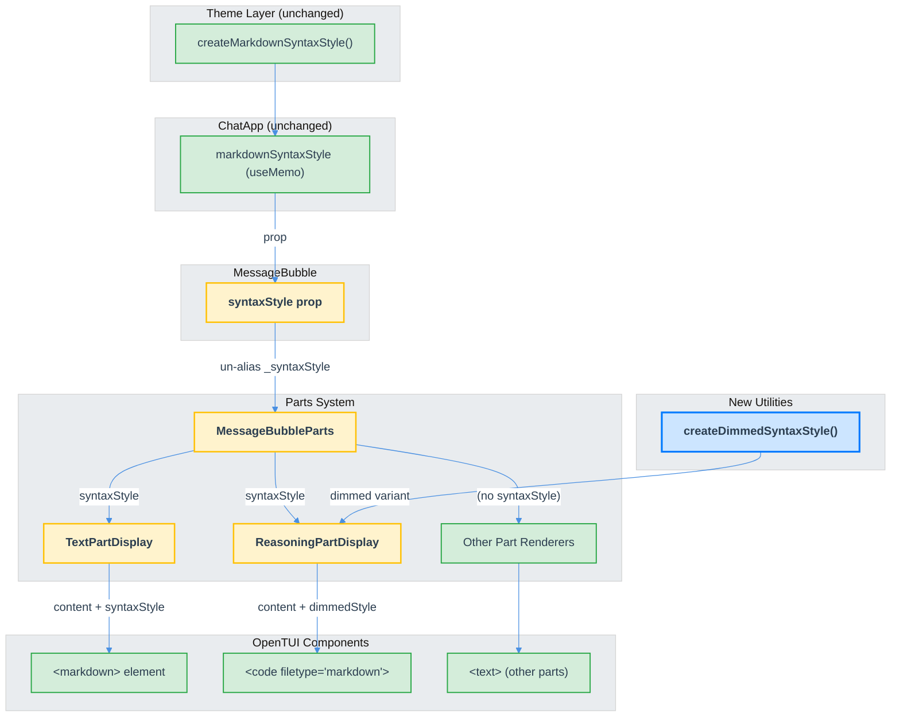

# Markdown Rendering for Parts-Based Rendering System — Technical Design Document

| Document Metadata      | Details     |
| ---------------------- | ----------- |
| Author(s)              | Developer   |
| Status                 | Draft (WIP) |
| Team / Owner           | Atomic TUI  |
| Created / Last Updated | 2026-02-17  |

## 1. Executive Summary

The Atomic TUI renders all agent text responses as **plain text** via `<text>` elements in `TextPartDisplay` and `ReasoningPartDisplay`, despite having a fully implemented `createMarkdownSyntaxStyle()` function and an instantiated `markdownSyntaxStyle` value that is passed to `MessageBubble` but never threaded to the parts-based renderers. OpenTUI provides two production-ready components — `<markdown>` (rich structural rendering) and `<code filetype="markdown">` (tree-sitter-based highlighting) — both supporting streaming mode. This spec proposes replacing plain `<text>` elements in `TextPartDisplay` and `ReasoningPartDisplay` with `<markdown>` components, wiring the existing `syntaxStyle` prop through `MessageBubbleParts` to individual part renderers, and adding a dimmed syntax style variant for reasoning content. No new dependencies are required; all infrastructure already exists in the codebase.

**Supersedes:** [`specs/markdown-rendering-tui.md`](markdown-rendering-tui.md) (2026-02-09), which was written before the parts-based rendering system was implemented and references the old monolithic `MessageBubble` architecture.

## 2. Context and Motivation

### 2.1 Current State

The codebase has evolved through two architectural phases:

**Phase 1 (pre-parts, ~Feb 2026):** `MessageBubble` directly rendered content via a `syntaxStyle ? <markdown> : <text>` conditional. The original spec ([`specs/markdown-rendering-tui.md`](markdown-rendering-tui.md)) targeted this architecture.

**Phase 2 (current, parts-based):** Messages are decomposed into a `Part[]` array dispatched via `PART_REGISTRY` ([`src/ui/components/parts/registry.tsx:22`](../src/ui/components/parts/registry.tsx)). Each part type has an independent renderer component. The old conditional rendering path no longer exists — `MessageBubble` delegates entirely to `MessageBubbleParts`.

The rendering pipeline is:

```
SDK stream → handleStreamMessage() → handleTextDelta() → Part[] (TextPart/ReasoningPart)
  → MessageBubbleParts → PART_REGISTRY dispatch
  → TextPartDisplay → <text>{plainText}</text>         ← THE GAP
  → ReasoningPartDisplay → <text>{plainText}</text>     ← THE GAP
```

**What exists and works:**

| Component                                    | Status                              | Location                                 |
| -------------------------------------------- | ----------------------------------- | ---------------------------------------- |
| `createMarkdownSyntaxStyle()`                | Implemented, uses Catppuccin colors | `src/ui/theme.tsx:468`                   |
| `markdownSyntaxStyle` via `useMemo`          | Created in `ChatApp`                | `src/ui/chat.tsx:1715`                   |
| `syntaxStyle` prop passed to `MessageBubble` | Passed but unused (`_syntaxStyle`)  | `src/ui/chat.tsx:5140` → `chat.tsx:1414` |
| `@opentui/react` `<markdown>` JSX element    | Installed (`^0.1.79`)               | `package.json`                           |
| `@opentui/core` `MarkdownRenderable`         | Installed (`^0.1.79`)               | `package.json`                           |
| `TextPart.isStreaming` flag                  | Working                             | `src/ui/parts/types.ts`                  |
| `useThrottledValue` for render throttling    | Working (100ms)                     | `src/ui/hooks/use-throttled-value.ts`    |
| `<scrollbox>` with sticky scroll             | Working                             | `src/ui/chat.tsx`                        |

**What is broken/missing:**

| Gap                                            | Description                                                               |
| ---------------------------------------------- | ------------------------------------------------------------------------- |
| `_syntaxStyle` unused in `MessageBubble`       | Destructured with underscore prefix, never forwarded to parts             |
| `MessageBubbleParts` has no `syntaxStyle` prop | Parts system was built without markdown awareness                         |
| `TextPartDisplay` uses plain `<text>`          | `src/ui/components/parts/text-part-display.tsx:35`                        |
| `ReasoningPartDisplay` uses plain `<text>`     | `src/ui/components/parts/reasoning-part-display.tsx:31`                   |
| No dimmed syntax style for reasoning           | OpenCode uses `subtleSyntax()` with 0.6 opacity; Atomic has no equivalent |

**Research reference:** [`research/docs/2026-02-16-markdown-rendering-research.md`](../research/docs/2026-02-16-markdown-rendering-research.md) — Comprehensive analysis of OpenTUI markdown components, OpenCode reference implementation, SDK response formats, and the rendering pipeline.

### 2.2 The Problem

- **User Impact:** Agent responses display raw markdown syntax (`**bold**`, `` `code` ``, `# heading`, `- list items`) as plain text, making code explanations, structured responses, and formatted output difficult to read in the terminal.
- **Wasted Infrastructure:** The `createMarkdownSyntaxStyle()` function at `theme.tsx:468` creates a full Catppuccin-themed `SyntaxStyle` with 24+ scope mappings. The `markdownSyntaxStyle` is instantiated at `chat.tsx:1715` and passed as a prop at `chat.tsx:5140`. All of this work is discarded because `MessageBubble` aliases it as `_syntaxStyle`.
- **Parity Gap:** OpenCode (which also uses OpenTUI) renders all text responses with `<code filetype="markdown">` by default and `<markdown>` behind an experimental flag, with full streaming and syntax highlighting support ([`research/docs/2026-02-16-markdown-rendering-research.md` §3](../research/docs/2026-02-16-markdown-rendering-research.md)).

## 3. Goals and Non-Goals

### 3.1 Functional Goals

- [ ] Replace `<text>` with `<markdown>` in `TextPartDisplay` for all assistant text responses
- [ ] Replace `<text>` with `<code filetype="markdown">` (dimmed variant) in `ReasoningPartDisplay` for reasoning/thinking content
- [ ] Wire existing `syntaxStyle` prop from `MessageBubble` through `MessageBubbleParts` to individual part renderers
- [ ] Support streaming markdown rendering via the `streaming` prop (already available from `part.isStreaming`)
- [ ] Enable `conceal` mode to hide markdown syntax markers for cleaner output
- [ ] Create a dimmed `SyntaxStyle` variant for reasoning content (following OpenCode's `subtleSyntax()` pattern)
- [ ] Maintain visual consistency between dark and light themes using the existing Catppuccin palette
- [ ] Preserve the status bullet (`●`) prefix on text parts

### 3.2 Non-Goals (Out of Scope)

- [ ] Feature flag or `<markdown>` vs `<code filetype="markdown">` toggle for text parts — we will use `<markdown>` directly (the richer option)
- [ ] User-configurable markdown theme or `SyntaxStyle` overrides
- [ ] Markdown rendering for user messages (remain plain `<text>`)
- [ ] Image rendering beyond alt text (terminal limitation)
- [ ] Task list checkbox unicode substitution (`☐`/`☑`) — deferrable to a follow-up
- [ ] Thinking visibility toggle keybinding (`Ctrl+Shift+T`) — the parts-based system already renders `ReasoningPart` inline; visibility is controlled by collapsing/expanding
- [ ] Changes to the streaming data flow or SDK clients — all SDKs already deliver text as plain strings that contain markdown

## 4. Proposed Solution (High-Level Design)

### 4.1 System Architecture Diagram



### 4.2 Architectural Pattern

**Prop Threading Pattern** — The `syntaxStyle` already flows from `ChatApp` → `MessageBubble`. This spec extends that flow through `MessageBubbleParts` → individual part renderers. Only `TextPartDisplay` and `ReasoningPartDisplay` consume the prop; all other part renderers ignore it (they don't render markdown content).

### 4.3 Key Components

| Component                             | Responsibility                                                         | File                                                 | Change Type      |
| ------------------------------------- | ---------------------------------------------------------------------- | ---------------------------------------------------- | ---------------- |
| `MessageBubble`                       | Un-alias `_syntaxStyle` to `syntaxStyle`, pass to `MessageBubbleParts` | `src/ui/chat.tsx:1414`                               | **Modified**     |
| `MessageBubbleParts`                  | Accept and forward `syntaxStyle` to part renderers                     | `src/ui/components/parts/message-bubble-parts.tsx`   | **Modified**     |
| `PART_REGISTRY` / `PartRenderer` type | Update type to accept optional `syntaxStyle` prop                      | `src/ui/components/parts/registry.tsx`               | **Modified**     |
| `TextPartDisplay`                     | Replace `<text>` with `<markdown>`                                     | `src/ui/components/parts/text-part-display.tsx`      | **Modified**     |
| `ReasoningPartDisplay`                | Replace `<text>` with `<code filetype="markdown">` using dimmed style  | `src/ui/components/parts/reasoning-part-display.tsx` | **Modified**     |
| `createDimmedSyntaxStyle()`           | Create opacity-reduced `SyntaxStyle` for reasoning content             | `src/ui/theme.tsx`                                   | **New function** |

### 4.4 Rendering Component Selection Rationale

**TextPartDisplay → `<markdown>`:**

- Agent text responses contain full markdown: headings, code blocks, tables, lists, links, bold/italic
- `<markdown>` (MarkdownRenderable) parses with `marked` and creates structural sub-renderables (code blocks get dedicated `CodeRenderable` with tree-sitter highlighting, tables get proper layouts, lists get styled markers)
- This matches OpenCode's experimental mode and provides the richest rendering fidelity
- Streaming mode uses `parseMarkdownIncremental()` for efficient token reuse

**ReasoningPartDisplay → `<code filetype="markdown">`:**

- Reasoning/thinking content is typically less structured (stream-of-consciousness, shorter)
- `<code filetype="markdown">` is simpler and lighter — uses tree-sitter's markdown grammar for syntax highlighting without creating sub-renderables
- Matches OpenCode's reasoning rendering pattern (lines 1337-1368 of their session component)
- The dimmed styling communicates "secondary content" vs the primary response

**Research reference:** [`research/docs/2026-02-16-markdown-rendering-research.md` §2](../research/docs/2026-02-16-markdown-rendering-research.md) — Comparison table of `<markdown>` vs `<code filetype="markdown">` capabilities.

## 5. Detailed Design

### 5.1 Prop Threading: `MessageBubble` → `MessageBubbleParts` → Part Renderers

#### 5.1.1 Un-alias `_syntaxStyle` in `MessageBubble`

**File:** `src/ui/chat.tsx:1414`

Currently, `MessageBubble` destructures `syntaxStyle` as `_syntaxStyle` (unused):

```tsx
// BEFORE
export function MessageBubble({ message, isLast, syntaxStyle: _syntaxStyle, ... }: MessageBubbleProps) {
```

Change to use the prop actively and pass it to `MessageBubbleParts`:

```tsx
// AFTER
export function MessageBubble({ message, isLast, syntaxStyle, ... }: MessageBubbleProps) {
```

Then at `chat.tsx:1504` where `MessageBubbleParts` is rendered:

```tsx
// BEFORE
<MessageBubbleParts message={renderableMessage} />

// AFTER
<MessageBubbleParts message={renderableMessage} syntaxStyle={syntaxStyle} />
```

#### 5.1.2 Update `MessageBubbleParts` to Accept and Forward `syntaxStyle`

**File:** `src/ui/components/parts/message-bubble-parts.tsx`

```tsx
import type { SyntaxStyle } from "@opentui/core";

export interface MessageBubblePartsProps {
    message: ChatMessage;
    syntaxStyle?: SyntaxStyle; // NEW
}

export function MessageBubbleParts({
    message,
    syntaxStyle,
}: MessageBubblePartsProps): React.ReactNode {
    const parts = message.parts ?? [];

    if (parts.length === 0) {
        return null;
    }

    return (
        <box flexDirection="column" gap={SPACING.ELEMENT}>
            {parts.map((part, index) => {
                const Renderer = PART_REGISTRY[part.type];
                if (!Renderer) return null;
                return (
                    <Renderer
                        key={part.id}
                        part={part}
                        isLast={index === parts.length - 1}
                        syntaxStyle={syntaxStyle} // NEW — forwarded to all renderers
                    />
                );
            })}
        </box>
    );
}
```

#### 5.1.3 Update `PartRenderer` Type in Registry

**File:** `src/ui/components/parts/registry.tsx`

```tsx
import type { SyntaxStyle } from "@opentui/core";

export type PartRenderer = (props: {
    part: any;
    isLast: boolean;
    syntaxStyle?: SyntaxStyle; // NEW — optional, only consumed by text/reasoning
}) => React.ReactNode;
```

All existing part renderers (`ToolPartDisplay`, `AgentPartDisplay`, etc.) will receive `syntaxStyle` but can ignore it — adding an extra prop to a React component that doesn't destructure it is harmless.

### 5.2 `TextPartDisplay`: Replace `<text>` with `<markdown>`

**File:** `src/ui/components/parts/text-part-display.tsx`

```tsx
import React, { useMemo } from "react";
import type { SyntaxStyle } from "@opentui/core";
import type { TextPart } from "../../parts/types.ts";
import { useThrottledValue } from "../../hooks/use-throttled-value.ts";
import { useThemeColors } from "../../theme.tsx";
import { STATUS } from "../../constants/icons.ts";

export interface TextPartDisplayProps {
    part: TextPart;
    syntaxStyle?: SyntaxStyle;
}

export function TextPartDisplay({ part, syntaxStyle }: TextPartDisplayProps) {
    const colors = useThemeColors();
    const displayContent = useThrottledValue(
        part.content,
        part.isStreaming ? 100 : 0,
    );

    // Strip leading newlines so the bullet indicator always has text beside it
    const trimmedContent = displayContent?.replace(/^\n+/, "");

    if (!trimmedContent) {
        return null;
    }

    return (
        <box flexDirection="column">
            <box flexDirection="row">
                <box flexShrink={0}>
                    <text style={{ fg: colors.foreground }}>
                        {STATUS.active}{" "}
                    </text>
                </box>
                <box flexShrink={1}>
                    {syntaxStyle ? (
                        <markdown
                            content={trimmedContent}
                            syntaxStyle={syntaxStyle}
                            streaming={part.isStreaming}
                            conceal={true}
                        />
                    ) : (
                        <text style={{ fg: colors.foreground }}>
                            {trimmedContent}
                        </text>
                    )}
                </box>
            </box>
        </box>
    );
}
```

**Design decisions:**

- **Fallback path preserved:** If `syntaxStyle` is undefined (e.g., external consumers), falls back to plain `<text>`. This prevents regressions.
- **`conceal={true}`:** Hides markdown syntax markers (`#`, `*`, backticks) for cleaner output. The rendered result shows styled text without the raw markdown sigils.
- **`streaming={part.isStreaming}`:** Enables incremental parsing via `parseMarkdownIncremental()`, reusing unchanged tokens from previous parse passes.
- **`useThrottledValue` remains:** The 100ms throttle during streaming prevents excessive re-renders. The throttled value is passed to `<markdown>` which handles its own incremental diff internally.
- **Status bullet stays outside `<markdown>`:** The `●` prefix is in a separate `<box flexShrink={0}>` so it doesn't get parsed as markdown content. The markdown element is in a sibling `<box flexShrink={1}>` to allow proper text wrapping.

**Research reference:** [`research/docs/2026-02-16-markdown-rendering-research.md` §8](../research/docs/2026-02-16-markdown-rendering-research.md) — Implementation Pattern 2 (`<markdown>` pattern from OpenCode experimental mode).

### 5.3 `ReasoningPartDisplay`: Replace `<text>` with `<code filetype="markdown">`

**File:** `src/ui/components/parts/reasoning-part-display.tsx`

```tsx
import React from "react";
import type { SyntaxStyle } from "@opentui/core";
import type { ReasoningPart } from "../../parts/types.ts";
import { useThemeColors, createDimmedSyntaxStyle } from "../../theme.tsx";
import { SPACING } from "../../constants/spacing.ts";

export interface ReasoningPartDisplayProps {
    part: ReasoningPart;
    isLast: boolean;
    syntaxStyle?: SyntaxStyle;
}

export function ReasoningPartDisplay({
    part,
    syntaxStyle,
}: ReasoningPartDisplayProps): React.ReactNode {
    const colors = useThemeColors();
    const durationLabel =
        part.durationMs > 0 ? `${(part.durationMs / 1000).toFixed(1)}s` : "";

    // Create a dimmed variant for reasoning content (0.6 opacity on foregrounds)
    const dimmedStyle = syntaxStyle
        ? createDimmedSyntaxStyle(syntaxStyle, 0.6)
        : undefined;

    return (
        <box flexDirection="column">
            <text style={{ fg: colors.muted }}>
                {part.isStreaming
                    ? "Thinking..."
                    : `Thought${durationLabel ? ` (${durationLabel})` : ""}`}
            </text>
            {part.content && (
                <box marginLeft={SPACING.INDENT}>
                    {dimmedStyle ? (
                        <code
                            filetype="markdown"
                            drawUnstyledText={false}
                            streaming={part.isStreaming}
                            syntaxStyle={dimmedStyle}
                            content={part.content}
                            conceal={true}
                            fg={colors.muted}
                        />
                    ) : (
                        <text style={{ fg: colors.muted }}>{part.content}</text>
                    )}
                </box>
            )}
        </box>
    );
}
```

**Design decisions:**

- **`<code filetype="markdown">` instead of `<markdown>`:** Reasoning content is secondary and benefits from lighter rendering. Tree-sitter highlighting adds visual structure without the full structural decomposition of `<markdown>`. This follows OpenCode's pattern ([`research/docs/2026-02-16-markdown-rendering-research.md` §3](../research/docs/2026-02-16-markdown-rendering-research.md), lines 1337-1368).
- **`drawUnstyledText={false}`:** Prevents a flash of unstyled text while tree-sitter WASM initializes — content only appears once highlighting is ready.
- **`fg={colors.muted}`:** Sets the base foreground color for any text not covered by syntax highlighting scopes, maintaining the dimmed appearance.
- **Dimmed syntax style:** `createDimmedSyntaxStyle()` applies 0.6 opacity to all foreground colors, visually distinguishing reasoning from the main response.

### 5.4 `createDimmedSyntaxStyle()`: Dimmed Variant for Reasoning

**File:** `src/ui/theme.tsx` (new export, adjacent to `createMarkdownSyntaxStyle()`)

This function creates a new `SyntaxStyle` where all foreground colors have their alpha channel reduced, producing a "muted" version for secondary content like reasoning/thinking.

```tsx
/**
 * Create a dimmed variant of a SyntaxStyle by reducing the alpha channel
 * of all foreground colors. Used for reasoning/thinking content display.
 *
 * @param baseStyle - The SyntaxStyle to dim
 * @param opacity - Alpha multiplier (0.0 to 1.0), default 0.6
 * @returns A new SyntaxStyle with reduced-opacity foreground colors
 */
export function createDimmedSyntaxStyle(
    baseStyle: SyntaxStyle,
    opacity: number = 0.6,
): SyntaxStyle {
    // Re-create the style from the same scope definitions but with dimmed foregrounds.
    // Since SyntaxStyle is a native Zig-backed object, we rebuild using the same
    // scope names from createMarkdownSyntaxStyle() but with alpha-multiplied RGBA values.
    //
    // NOTE: Implementation depends on whether SyntaxStyle exposes an API to clone/modify
    // styles, or whether we need to re-create from scratch. Two approaches:
    //
    // Approach A (preferred): If SyntaxStyle has a clone/transform API
    //   return baseStyle.withDimmedForegrounds(opacity);
    //
    // Approach B (fallback): Re-create with dimmed colors
    //   Re-call createMarkdownSyntaxStyle() parameters but multiply alpha
    return createDimmedMarkdownSyntaxStyle(opacity);
}
```

Since `SyntaxStyle` is a native Zig-backed object and may not expose a transformation API, the practical implementation creates a parallel set of dimmed styles:

```tsx
function createDimmedMarkdownSyntaxStyle(opacity: number): SyntaxStyle {
    // Use the same Catppuccin scope mappings as createMarkdownSyntaxStyle()
    // but with RGBA alpha set to the opacity multiplier
    const dimFg = (hex: string) => {
        const rgba = RGBA.fromHex(hex);
        return RGBA.rgba(rgba.r, rgba.g, rgba.b, Math.round(rgba.a * opacity));
    };

    // ... same scope definitions as createMarkdownSyntaxStyle() but using dimFg()
}
```

**Research reference:** [`research/docs/2026-02-16-markdown-rendering-research.md` §3](../research/docs/2026-02-16-markdown-rendering-research.md) — OpenCode's `subtleSyntax()` applies `thinkingOpacity` (default 0.6) to all foreground colors' alpha channels.

**Implementation note:** The exact implementation of `createDimmedSyntaxStyle()` depends on the `RGBA` API available in `@opentui/core`. If `RGBA` only supports `fromHex()` construction (not component-level access), an alternative is to pre-compute the dimmed hex values at style-creation time. The implementer should check the `RGBA` class API and choose the simplest approach.

### 5.5 Data Model / Schema

No data model changes required. The `Part` discriminated union (`src/ui/parts/types.ts`) already has all necessary fields:

| Part Type       | Field                  | Usage for Markdown                                        |
| --------------- | ---------------------- | --------------------------------------------------------- |
| `TextPart`      | `content: string`      | Markdown source text passed to `<markdown content={...}>` |
| `TextPart`      | `isStreaming: boolean` | Passed as `streaming` prop for incremental parsing        |
| `ReasoningPart` | `content: string`      | Markdown source text passed to `<code content={...}>`     |
| `ReasoningPart` | `isStreaming: boolean` | Passed as `streaming` prop                                |

The `SyntaxStyle` instance is not stored in the data model — it flows as a React prop from `ChatApp` → `MessageBubble` → `MessageBubbleParts` → part renderers.

### 5.6 Streaming Behavior

The streaming pipeline works as follows:

1. SDK client yields `{ type: "text", content: deltaString }` via `handleStreamMessage()` (`src/ui/index.ts:1037`)
2. `handleTextDelta()` (`src/ui/parts/handlers.ts:23`) appends the delta to the current `TextPart.content` and sets `isStreaming: true`
3. `TextPartDisplay` reads `part.content` through `useThrottledValue` (100ms throttle during streaming)
4. The throttled value is passed to `<markdown content={trimmedContent} streaming={true}>`
5. `MarkdownRenderable` calls `parseMarkdownIncremental()` which reuses unchanged tokens from the previous parse, only re-parsing the trailing 2 "unstable" tokens
6. When streaming completes, `isStreaming` becomes `false`, the throttle drops to 0ms, and `<markdown streaming={false}>` does a final complete parse

This is functionally identical to OpenCode's streaming pipeline but uses React + `useThrottledValue` instead of SolidJS + `batch()`.

**Performance consideration:** The 100ms throttle in `useThrottledValue` means `<markdown>` receives content updates at most ~10 times/second during streaming. This is well within the performance envelope — OpenCode uses 16ms batching (60fps) with no reported issues. The incremental parser in `MarkdownRenderable` handles partial content gracefully, including incomplete code fences and tables.

## 6. Alternatives Considered

| Option                                                    | Pros                                                     | Cons                                                                                                                     | Reason for Rejection                                                                                                                    |
| --------------------------------------------------------- | -------------------------------------------------------- | ------------------------------------------------------------------------------------------------------------------------ | --------------------------------------------------------------------------------------------------------------------------------------- |
| `<code filetype="markdown">` for text parts               | Simpler, lower overhead, proven default in OpenCode      | No structural rendering (tables are flat text, code blocks lack dedicated highlighting, lists lack styled markers)       | `<markdown>` provides significantly better rendering fidelity for agent responses which are heavy on code blocks and structured content |
| External markdown library (marked-terminal, markdansi)    | Well-tested in wider ecosystem                           | Duplicates OpenTUI's built-in capability, breaks streaming integration, adds dependency, bypasses OpenTUI rendering tree | OpenTUI already bundles `marked` and handles streaming natively                                                                         |
| React Context instead of prop threading                   | Avoids adding `syntaxStyle` param to every part renderer | Over-engineered for a single prop; Context adds re-render scope; prop is only consumed by 2 of 9 renderers               | Prop threading is simpler and more explicit                                                                                             |
| Single `<markdown>` for both text and reasoning           | Consistent rendering                                     | Cannot apply dimmed styling; reasoning should be visually secondary                                                      | Using different components (`<markdown>` vs `<code>`) with different style variants clearly separates primary and secondary content     |
| Feature flag for `<markdown>` vs `<code>` (like OpenCode) | User choice, safer rollout                               | Added complexity; no mechanism for feature flags in Atomic currently                                                     | Can be added later if rendering issues are found; start with `<markdown>` as the only path                                              |

## 7. Cross-Cutting Concerns

### 7.1 Performance

- **`SyntaxStyle` creation:** Already memoized via `useMemo` in `ChatApp` (`chat.tsx:1715`). Recomputed only on theme change (rare event). No additional cost from this spec.
- **`createDimmedSyntaxStyle`:** Should also be memoized. The `ReasoningPartDisplay` component will need a `useMemo` to avoid recreating the dimmed style on every render. The existing `syntaxStyle` reference can serve as the dependency.
- **Markdown parsing (streaming):** `MarkdownRenderable` uses `parseMarkdownIncremental()` which reuses tokens from the previous parse. Only the trailing 2 tokens are re-parsed per content update. Combined with the 100ms `useThrottledValue` throttle, this limits parsing to ~10 times/second during streaming.
- **Tree-sitter highlighting:** Initialized lazily via a singleton Web Worker (`getTreeSitterClient()`). First code block has WASM init cost; subsequent highlights reuse the singleton. This is existing OpenTUI behavior, not new overhead.
- **Memory:** `MarkdownRenderable` creates child renderables (one per markdown block). For very long responses, this could grow. However, the existing message windowing system (`src/ui/utils/message-window.ts`) limits the number of visible messages, bounding the renderable count.

### 7.2 Theme Integration

- Both dark and light themes produce valid `SyntaxStyle` instances via the existing `createMarkdownSyntaxStyle()` function in `theme.tsx:468`
- Dark theme uses Catppuccin Mocha colors; light theme uses Catppuccin Latte colors
- Theme toggle triggers `useMemo` recomputation of `markdownSyntaxStyle` (already implemented at `chat.tsx:1715`)
- The dimmed variant for reasoning inherits the same theme-aware colors with reduced opacity
- No new color slots are added to `ThemeColors`

### 7.3 Backwards Compatibility

- The `syntaxStyle` prop remains optional everywhere — if undefined, all renderers fall back to plain `<text>`
- The `PartRenderer` type change (adding optional `syntaxStyle`) is additive — existing renderers that don't destructure it are unaffected
- No SDK client changes, no data model changes, no streaming pipeline changes
- External consumers of `MessageBubble` that don't pass `syntaxStyle` get the same plain text behavior as before

### 7.4 Accessibility

- The existing Catppuccin-based `SyntaxStyle` in `theme.tsx:468` already handles light theme contrast with dedicated Latte palette colors (validated against WCAG AA 4.5:1 minimum in the prior spec)
- The `conceal` mode hides visual syntax markers but the content remains in the terminal buffer for screen readers
- Bold/italic attributes are preserved through the ANSI rendering pipeline

## 8. Migration, Rollout, and Testing

### 8.1 Deployment Strategy

No phased rollout needed. The change is safe because:

1. The `<markdown>` and `<code>` elements are production-tested in OpenTUI and used by OpenCode
2. The `syntaxStyle` fallback ensures graceful degradation to plain `<text>` if anything goes wrong
3. No feature flags or staged rollout needed — the change is binary (works or falls back)

### 8.2 Test Plan

**Unit Tests:**

- `createDimmedSyntaxStyle()` produces a valid `SyntaxStyle` with reduced-opacity foregrounds
- `TextPartDisplay` renders `<markdown>` when `syntaxStyle` is provided, `<text>` when not
- `TextPartDisplay` passes `streaming={true}` when `part.isStreaming` is `true`
- `ReasoningPartDisplay` renders `<code filetype="markdown">` when `syntaxStyle` is provided
- `MessageBubbleParts` forwards `syntaxStyle` to all part renderers

**Integration Tests (manual terminal verification):**

- Streaming markdown renders incrementally without visual artifacts
- Code blocks inside markdown responses get tree-sitter syntax highlighting
- Tables render with proper column alignment
- Bold, italic, headings, links, and lists render with correct styling
- Reasoning content is visually dimmed compared to main response text
- Theme toggle updates all markdown colors
- Long responses with many code blocks do not degrade scroll performance

**End-to-End Tests:**

- Full agent conversation with markdown-heavy response (code blocks, headings, lists, tables)
- All three SDKs (Claude, OpenCode, Copilot) produce correctly rendered markdown
- `conceal` mode hides syntax markers (`#`, `*`, backticks)
- Status bullet `●` prefix is preserved and properly aligned with markdown content

## 9. Implementation Order

The implementation should follow this sequence, with each step being independently committable:

1. **`src/ui/theme.tsx`** — Add `createDimmedSyntaxStyle()` function (pure function, no dependencies on other changes)
2. **`src/ui/components/parts/registry.tsx`** — Update `PartRenderer` type to include optional `syntaxStyle` prop
3. **`src/ui/components/parts/message-bubble-parts.tsx`** — Add `syntaxStyle` to `MessageBubblePartsProps`, forward to renderers
4. **`src/ui/chat.tsx`** — Un-alias `_syntaxStyle` in `MessageBubble`, pass `syntaxStyle` to `MessageBubbleParts`
5. **`src/ui/components/parts/text-part-display.tsx`** — Replace `<text>` with `<markdown>` (with `syntaxStyle` fallback)
6. **`src/ui/components/parts/reasoning-part-display.tsx`** — Replace `<text>` with `<code filetype="markdown">` using dimmed style

Steps 1-4 are plumbing changes with no visual effect. Steps 5-6 produce the visible rendering change.

## 10. Open Questions / Unresolved Issues

- [ ] **`RGBA` component access:** Does `RGBA.fromHex()` return an object with `.r`, `.g`, `.b`, `.a` properties, or is it opaque? This determines whether `createDimmedSyntaxStyle()` can multiply the alpha channel directly or needs a different approach (e.g., pre-computing dimmed hex strings). The implementer should inspect the `@opentui/core` `RGBA` class.
- [ ] **`<markdown>` + `<box flexDirection="row">` layout:** The status bullet `●` is in a flex row alongside the markdown content. Does `MarkdownRenderable` (which creates its own child renderables for blocks) interact correctly with the flex row layout? If it creates block-level elements (headings, code blocks) that break the row, the bullet may need to be moved outside the row or placed differently. This should be verified visually during implementation.
- [ ] **`conceal` mode and copy/paste:** When `conceal={true}` hides markdown markers, are the original characters still in the terminal buffer for copy/paste? Or does concealing remove them entirely? If removed, users who copy-paste code from agent responses may lose formatting. The implementer should test this behavior.
- [ ] **Performance with very large code blocks:** OpenTUI's `<markdown>` delegates fenced code blocks to individual `CodeRenderable` instances with tree-sitter highlighting. For responses containing many large code blocks, the tree-sitter WASM worker queue could back up. The implementer should stress-test with multi-thousand-line responses.

## 11. Key Files Reference

| File                                                 | Line(s) | Role in This Spec                                                   |
| ---------------------------------------------------- | ------- | ------------------------------------------------------------------- |
| `src/ui/components/parts/text-part-display.tsx`      | 35      | **Primary change** — replace `<text>` with `<markdown>`             |
| `src/ui/components/parts/reasoning-part-display.tsx` | 31      | **Primary change** — replace `<text>` with `<code>`                 |
| `src/ui/components/parts/message-bubble-parts.tsx`   | 26-48   | **Prop threading** — add `syntaxStyle` prop, forward to renderers   |
| `src/ui/components/parts/registry.tsx`               | 20      | **Type change** — update `PartRenderer` type                        |
| `src/ui/chat.tsx`                                    | 1414    | **Un-alias** — change `_syntaxStyle` to `syntaxStyle`               |
| `src/ui/chat.tsx`                                    | 1504    | **Prop pass** — add `syntaxStyle` to `MessageBubbleParts`           |
| `src/ui/chat.tsx`                                    | 1715    | **Existing** — `markdownSyntaxStyle` creation (unchanged)           |
| `src/ui/chat.tsx`                                    | 5140    | **Existing** — `syntaxStyle={markdownSyntaxStyle}` prop (unchanged) |
| `src/ui/theme.tsx`                                   | 468-535 | **Existing** — `createMarkdownSyntaxStyle()` (unchanged)            |
| `src/ui/theme.tsx`                                   | (new)   | **New** — `createDimmedSyntaxStyle()`                               |
| `src/ui/parts/types.ts`                              | 50-56   | **Reference** — `TextPart` with `content` and `isStreaming`         |
| `src/ui/hooks/use-throttled-value.ts`                | 20      | **Reference** — 100ms streaming throttle (unchanged)                |

### Research Documents Referenced

| Document                                                                                                                                | Relevance                                                                                |
| --------------------------------------------------------------------------------------------------------------------------------------- | ---------------------------------------------------------------------------------------- |
| [`research/docs/2026-02-16-markdown-rendering-research.md`](../research/docs/2026-02-16-markdown-rendering-research.md)                 | **Primary research** — OpenTUI components, OpenCode patterns, SDK analysis, gap analysis |
| [`research/docs/2026-02-09-opentui-markdown-capabilities.md`](../research/docs/2026-02-09-opentui-markdown-capabilities.md)             | OpenTUI `MarkdownRenderable` and `CodeRenderable` capabilities                           |
| [`research/docs/2026-02-16-opentui-rendering-architecture.md`](../research/docs/2026-02-16-opentui-rendering-architecture.md)           | Full OpenTUI rendering pipeline (TextBuffer, SyntaxStyle, tree-sitter)                   |
| [`research/docs/2026-02-16-opencode-message-rendering-patterns.md`](../research/docs/2026-02-16-opencode-message-rendering-patterns.md) | OpenCode's markdown rendering patterns (reference implementation)                        |
| [`research/tickets/2026-02-09-171-markdown-rendering-tui.md`](../research/tickets/2026-02-09-171-markdown-rendering-tui.md)             | Original ticket analysis (Issue #171)                                                    |
| [`specs/markdown-rendering-tui.md`](markdown-rendering-tui.md)                                                                          | Prior spec (superseded by this document)                                                 |
