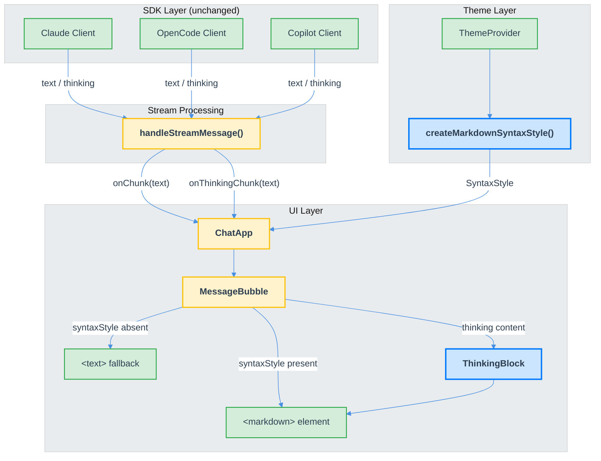

# Markdown Rendering for TUI (Issue #171) — Technical Design Document

| Document Metadata      | Details     |
| ---------------------- | ----------- |
| Author(s)              | Developer   |
| Status                 | Draft (WIP) |
| Team / Owner           | Atomic TUI  |
| Created / Last Updated | 2026-02-09  |

## 1. Executive Summary

The Atomic TUI renders all assistant messages as plain text despite having a fully wired `<markdown>` rendering path through OpenTUI's `MarkdownRenderable`. The `syntaxStyle` prop required to activate markdown rendering is never provided to `ChatApp`, so the conditional always takes the plain `<text>` fallback. Additionally, thinking/reasoning content from all three agent SDKs (Claude, OpenCode, Copilot) is silently dropped at the UI integration layer. This spec proposes two changes: (1) create and provide a theme-aware `SyntaxStyle` instance to activate markdown rendering, and (2) surface thinking content with a collapsible, markdown-rendered UI section. These changes affect `src/ui/theme.tsx`, `src/ui/index.ts`, `src/ui/chat.tsx`, and no external libraries are required.

## 2. Context and Motivation

### 2.1 Current State

The rendering pipeline is fully built but dormant:

```
SDK stream → handleStreamMessage() → onChunk → ChatMessage.content → MessageBubble
  → syntaxStyle ? <markdown> : <text>
  → syntaxStyle is always undefined
  → plain <text> fallback is always taken
```

The `<markdown>` JSX element at `src/ui/chat.tsx:1189-1193` supports CommonMark rendering with streaming, Tree-sitter syntax highlighting, conceal mode, headings, bold/italic, code blocks, tables, blockquotes, lists, and links. All of this is inactive because `startChatUI()` at `src/ui/index.ts:848` never passes a `syntaxStyle` prop to `ChatApp`, and `ChatUIConfig` has no field for it.

A separate `inputSyntaxStyle` instance exists at `src/ui/chat.tsx:858-863` for slash-command highlighting in the input textarea, proving the `SyntaxStyle` API works in the codebase.

**Reference:** [research/tickets/2026-02-09-171-markdown-rendering-tui.md](../research/tickets/2026-02-09-171-markdown-rendering-tui.md) — Full architecture analysis and data flow documentation.

### 2.2 The Problem

- **User Impact:** Assistant responses display raw markdown syntax (e.g., `**bold**`, `` `code` ``, `# heading`) as plain text, degrading readability for code explanations, structured lists, and formatted output.
- **Thinking Content Loss:** All three SDKs yield `{ type: "thinking" }` messages, but `handleStreamMessage()` at `src/ui/index.ts:611-640` has no branch for `message.type === "thinking"` — these messages are silently dropped. Users cannot see the agent's reasoning process.
- **Technical Debt:** The full rendering path (`<markdown>`, `buildContentSegments()`, streaming mode, `CodeBlock` component) is implemented but untested in production due to the missing `syntaxStyle` prop.

## 3. Goals and Non-Goals

### 3.1 Functional Goals

- [ ] Activate markdown rendering for all assistant messages by providing a `SyntaxStyle` instance to `ChatApp`
- [ ] Create a theme-aware `SyntaxStyle` that derives colors from the existing `ThemeColors` palette (`src/ui/theme.tsx`)
- [ ] Support streaming markdown rendering during active agent responses
- [ ] Surface thinking/reasoning content from all three SDKs with a collapsible UI section
- [ ] Provide a global keybinding (`Ctrl+Shift+T`) to toggle thinking block visibility across all messages
- [ ] Apply unicode substitution for GFM task list checkboxes (`- [ ]` → `☐`, `- [x]` → `☑`)
- [ ] Maintain visual consistency between dark and light themes

### 3.2 Non-Goals (Out of Scope)

- [ ] Custom markdown rendering via external libraries (OpenTUI's built-in `<markdown>` is used)
- [ ] User-configurable markdown theme or SyntaxStyle overrides
- [ ] Markdown rendering for user messages (remain plain `<text>`)
- [ ] Image rendering beyond alt text (terminal limitation)
- [ ] Deep nested list testing (implicit support, not explicitly validated)

## 4. Proposed Solution (High-Level Design)

### 4.1 System Architecture



### 4.2 Architectural Pattern

The solution follows an **activation pattern** — the rendering infrastructure already exists and is activated by providing the missing `SyntaxStyle` dependency. The thinking content feature follows an **extension pattern** — adding a new data channel (`onThinkingChunk`) parallel to the existing `onChunk` channel.

### 4.3 Key Components

| Component                        | Responsibility                                    | File               | Change Type      |
| -------------------------------- | ------------------------------------------------- | ------------------ | ---------------- |
| `createMarkdownSyntaxStyle()`    | Create theme-aware `SyntaxStyle` for markdown     | `src/ui/theme.tsx` | **New function** |
| `ChatUIConfig`                   | Add optional `syntaxStyle` field                  | `src/ui/index.ts`  | **Modified**     |
| `startChatUI()`                  | Create and pass `SyntaxStyle` to `ChatApp`        | `src/ui/index.ts`  | **Modified**     |
| `handleStreamMessage()`          | Add `"thinking"` branch, call `onThinkingChunk`   | `src/ui/index.ts`  | **Modified**     |
| `ChatMessage`                    | Add `thinking?: string` field                     | `src/ui/chat.tsx`  | **Modified**     |
| `ChatApp`                        | Wire thinking chunk handler, create `SyntaxStyle` | `src/ui/chat.tsx`  | **Modified**     |
| `MessageBubble`                  | Render thinking block above main content          | `src/ui/chat.tsx`  | **Modified**     |
| `preprocessTaskListCheckboxes()` | Unicode checkbox substitution                     | `src/ui/chat.tsx`  | **New function** |
| `Ctrl+Shift+T` keybinding        | Toggle thinking block visibility globally         | `src/ui/chat.tsx`  | **New handler**  |

## 5. Detailed Design

### 5.1 Feature 1: Activate Markdown Rendering

#### 5.1.1 Create `createMarkdownSyntaxStyle()` in `src/ui/theme.tsx`

A new exported function that creates a `SyntaxStyle` instance from the current theme colors. This bridges the gap between the hex-string-based `ThemeColors` and the `RGBA`-based `SyntaxStyle` API.

**Approach**: Use `SyntaxStyle.fromStyles()` with `RGBA.fromHex()` to map theme colors to markdown syntax groups.

```typescript
import { SyntaxStyle, RGBA } from "@opentui/core";

/**
 * Light theme overrides for WCAG AA compliance (≥4.5:1 against #FFFFFF).
 * The raw light ThemeColors fail contrast for most colors (accent #B8878A = 3.06:1,
 * muted #7A7A8C = 4.21:1, border #E8C4C4 = 1.60:1, etc.). These overrides darken
 * each color to meet the 4.5:1 threshold while preserving the same hue family.
 */
const lightThemeOverrides = {
  accent:      "#8B5E61",  // headings, keywords, type — was #B8878A (3.06:1), now ~5.2:1
  muted:       "#5A5A6C",  // inline code, comments, punctuation — was #7A7A8C (4.21:1), now ~5.7:1
  success:     "#3D6B4D",  // strings — was #5A886A (4.07:1), now ~6.0:1
  userMessage: "#3D6B89",  // links, functions — was #5A8AA8 (3.73:1), now ~5.2:1
  warning:     "#7A6A3D",  // numbers — was #A89060 (3.08:1), now ~5.0:1
  border:      "#8B6666",  // list markers — was #E8C4C4 (1.60:1), now ~4.6:1
};

export function createMarkdownSyntaxStyle(colors: ThemeColors, isDark: boolean): SyntaxStyle {
  // For light theme, use WCAG-compliant overrides instead of raw ThemeColors
  const c = isDark ? {
    accent: colors.accent,
    muted: colors.muted,
    success: colors.success,
    userMessage: colors.userMessage,
    warning: colors.warning,
    border: colors.border,
    foreground: colors.foreground,
  } : {
    accent: lightThemeOverrides.accent,
    muted: lightThemeOverrides.muted,
    success: lightThemeOverrides.success,
    userMessage: lightThemeOverrides.userMessage,
    warning: lightThemeOverrides.warning,
    border: lightThemeOverrides.border,
    foreground: colors.foreground,  // black on white is already 21:1
  };

  return SyntaxStyle.fromStyles({
    // Headings — accent color with bold
    "markup.heading.1": { fg: RGBA.fromHex(c.accent), bold: true },
    "markup.heading.2": { fg: RGBA.fromHex(c.accent), bold: true },
    "markup.heading.3": { fg: RGBA.fromHex(c.accent), bold: true },
    "markup.heading.4": { fg: RGBA.fromHex(c.accent) },
    "markup.heading.5": { fg: RGBA.fromHex(c.accent) },
    "markup.heading.6": { fg: RGBA.fromHex(c.accent), dim: true },

    // Inline code
    "markup.raw": { fg: RGBA.fromHex(c.muted) },

    // List markers
    "markup.list": { fg: RGBA.fromHex(c.border) },

    // Links
    "markup.link": { fg: RGBA.fromHex(c.userMessage), underline: true },

    // Bold and italic — actual OpenTUI scope names (not "markup.bold")
    "markup.strong": { bold: true },
    "markup.italic": { italic: true },
    "markup.strikethrough": {},  // inherits strikethrough from MarkdownRenderable

    // Blockquotes and thematic breaks
    "punctuation.special": { fg: RGBA.fromHex(c.muted) },

    // Table border color (used by MarkdownRenderable for table pipes)
    "conceal": { fg: RGBA.fromHex(c.muted) },

    // Code block syntax highlighting tokens (consumed by Tree-sitter via CodeRenderable)
    keyword: { fg: RGBA.fromHex(c.accent), bold: true },
    string: { fg: RGBA.fromHex(c.success) },
    comment: { fg: RGBA.fromHex(c.muted), italic: true },
    variable: { fg: RGBA.fromHex(c.foreground) },
    "function": { fg: RGBA.fromHex(c.userMessage) },
    number: { fg: RGBA.fromHex(c.warning) },
    type: { fg: RGBA.fromHex(c.accent) },
    operator: { fg: RGBA.fromHex(c.foreground) },
    punctuation: { fg: RGBA.fromHex(c.muted) },
    constant: { fg: RGBA.fromHex(c.warning) },
    property: { fg: RGBA.fromHex(c.foreground) },
    boolean: { fg: RGBA.fromHex(c.warning) },

    // Default text color
    default: { fg: RGBA.fromHex(c.foreground) },
  });
}
```

**Design decisions:**
- Map markdown syntax groups to existing theme colors rather than introducing new color slots — keeps the `ThemeColors` interface unchanged
- Headings use the `accent` color (dusty rose) for visual hierarchy
- Code syntax tokens map to semantically appropriate theme colors (strings → success/green, keywords → accent, comments → muted)
- **Light theme uses darkened color overrides** for WCAG AA compliance. The raw light `ThemeColors` fail contrast against white for 6 of 7 colors (worst: `border` at 1.60:1). The `isDark` parameter selects between raw colors (dark theme, light text on dark background) and darkened overrides (light theme, dark text on white background)
- **Scope names validated against OpenTUI source**: `markup.strong` (not `markup.bold`), `punctuation.special` for blockquote/thematic break markers, `conceal` for table borders. Additional code scopes (`constant`, `property`, `boolean`) added for richer highlighting. The base-name fallback in `SyntaxStyle.getStyle()` means `punctuation` covers `punctuation.bracket`, `punctuation.delimiter`, and `punctuation.special` as a baseline

**Reference:** [research/docs/2026-02-09-opentui-markdown-capabilities.md](../research/docs/2026-02-09-opentui-markdown-capabilities.md) — SyntaxStyle configuration patterns and scope names.

#### 5.1.2 Modify `ChatUIConfig` in `src/ui/index.ts`

Add an optional `syntaxStyle` field:

```typescript
export interface ChatUIConfig {
  // ... existing fields ...
  syntaxStyle?: SyntaxStyle;
}
```

#### 5.1.3 Create SyntaxStyle in `ChatApp` (preferred) or `startChatUI()`

Two options for where to create the `SyntaxStyle` instance:

**Option A (Recommended): Inside `ChatApp` using `useMemo` + theme context**

Create the `SyntaxStyle` inside `ChatApp` as a memoized value derived from the current theme. This allows the style to update when the user toggles themes.

```typescript
// In ChatApp component body
const { theme } = useTheme();
const markdownSyntaxStyle = useMemo(
  () => createMarkdownSyntaxStyle(theme.colors, theme.isDark),
  [theme]
);
```

This eliminates the need to thread `syntaxStyle` through `ChatUIConfig` and `startChatUI()` — the component creates its own based on the active theme.

**Option B: In `startChatUI()`**

Create the instance once and pass it as a prop. Simpler but does not react to theme changes.

**Recommendation:** Option A. It keeps the `SyntaxStyle` lifecycle tied to the theme context and avoids prop drilling through `ChatUIConfig`.

#### 5.1.4 Task List Checkbox Preprocessing

Add a utility function to convert GFM task list syntax to unicode characters before passing content to `<markdown>`:

```typescript
function preprocessTaskListCheckboxes(content: string): string {
  return content
    .replace(/^(\s*[-*+]\s+)\[ \]/gm, "$1☐")
    .replace(/^(\s*[-*+]\s+)\[[xX]\]/gm, "$1☑");
}
```

Apply this in `MessageBubble` before the `<markdown>` element's `content` prop:

```typescript
<markdown
  content={preprocessTaskListCheckboxes(trimmedContent)}
  syntaxStyle={markdownSyntaxStyle}
  streaming={isActivelyStreaming}
/>
```

**Reference:** [research/tickets/2026-02-09-171-markdown-rendering-tui.md — Q5](../research/tickets/2026-02-09-171-markdown-rendering-tui.md) — OpenTUI `renderListChunks` has no checkbox handler; unicode substitution is the documented workaround.

### 5.2 Feature 2: Surface Thinking/Reasoning Content

#### 5.2.1 Extend `handleStreamMessage()` in `src/ui/index.ts`

Add a fourth branch for `message.type === "thinking"` and a new callback parameter:

```typescript
// Updated signature
interface StreamMessageOptions {
  onChunk: (chunk: string) => void;
  onThinkingChunk: (chunk: string) => void;  // NEW
  onToolStart: (...) => void;
  onToolComplete: (...) => void;
  onComplete: () => void;
}

// In the stream iteration loop (src/ui/index.ts:611-640)
for await (const message of abortableStream) {
  if (message.type === "text" && typeof message.content === "string") {
    onChunk(message.content);
  } else if (message.type === "thinking" && typeof message.content === "string") {
    onThinkingChunk(message.content);  // NEW
  } else if (message.type === "tool_use" && ...) {
    // existing
  } else if (message.type === "tool_result" && ...) {
    // existing
  }
}
```

#### 5.2.2 Extend `ChatMessage` Interface in `src/ui/chat.tsx`

Add a field to accumulate thinking content separately from main content:

```typescript
export interface ChatMessage {
  // ... existing fields ...
  thinking?: string;  // Accumulated thinking/reasoning content
}
```

#### 5.2.3 Wire Thinking Chunks in `sendMessage` Callback

In the `sendMessage` callback at `src/ui/chat.tsx:3358-3486`, add a `handleThinkingChunk` alongside `handleChunk`:

```typescript
const handleThinkingChunk = (chunk: string) => {
  setMessages((prev) =>
    prev.map((msg) =>
      msg.id === assistantMessageId
        ? { ...msg, thinking: (msg.thinking ?? "") + chunk }
        : msg
    )
  );
};
```

Pass this as the `onThinkingChunk` callback to `onStreamMessage`.

#### 5.2.4 Render Thinking Block in `MessageBubble`

Add a collapsible thinking section above the main content in assistant messages. Collapsed by default, styled with dimmed/muted text:

```tsx
// Inside MessageBubble, before the main content segments
const thinkingVisible = showThinking || toolOutputsExpanded || message.streaming;

{message.thinking && (
  <box marginBottom={1}>
    <box flexDirection="row">
      <text style={{ fg: colors.muted, dim: true }}>
        {thinkingVisible ? "▼" : "▶"} Thinking
      </text>
    </box>
    {thinkingVisible && (
      <box marginLeft={2}>
        <markdown
          content={message.thinking}
          syntaxStyle={markdownSyntaxStyle}
          streaming={message.streaming}
        />
      </box>
    )}
  </box>
)}
```

**State management:** Thinking block visibility is controlled by two global boolean states in `ChatApp`: `showThinking` (toggled by `Ctrl+Shift+T`) and `toolOutputsExpanded` (toggled by `Ctrl+O`). Either being `true` expands thinking blocks. This is not per-message local state — both keybindings affect all messages simultaneously. Both states default to `false` (collapsed).

**Streaming behavior:** Thinking content typically streams before the main response. During streaming, the thinking section auto-expands (via `message.streaming`), then collapses when the stream completes — unless `showThinking` or `toolOutputsExpanded` is `true`.

**Reference:** [research/tickets/2026-02-09-171-markdown-rendering-tui.md — Q4](../research/tickets/2026-02-09-171-markdown-rendering-tui.md) — Detailed analysis of thinking content handling across all three SDKs and the gap in `handleStreamMessage()`.

### 5.3 Feature 3: Thinking Visibility Toggle (Ctrl+Shift+T)

#### 5.3.1 Keybinding Conflict Analysis

`Ctrl+T` is already taken — it toggles the todo panel at `src/ui/chat.tsx:2848-2852`:

```typescript
// Ctrl+T - toggle todo list panel visibility
if (event.ctrl && event.name === "t") {
  setShowTodoPanel(prev => !prev);
  return;
}
```

The existing keybinding map (from `src/ui/chat.tsx:2681-3338`) has these `Ctrl+<key>` bindings occupied:
- `Ctrl+C` — copy / interrupt / exit
- `Ctrl+O` — toggle tool output expansion (expanded to also control thinking visibility — see below)
- `Ctrl+T` — toggle todo panel
- `Ctrl+J` — insert newline
- `Ctrl+V` — paste
- `Ctrl+Shift+C` — copy selected
- `Ctrl+Shift+V` — paste

**Selected keybinding: `Ctrl+Shift+T`** — a natural modifier extension of `Ctrl+T` (T for "todo", Shift+T for "thinking"). The `Ctrl+Shift+` prefix is already established in the codebase (`Ctrl+Shift+C` for copy, `Ctrl+Shift+V` for paste).

**`Ctrl+O` also expands thinking:** `Ctrl+O` is the "show all output" toggle. When `toolOutputsExpanded` is `true`, thinking blocks should also be visible — users pressing `Ctrl+O` expect to see everything the agent produced. `Ctrl+Shift+T` provides fine-grained control over thinking alone.

#### 5.3.2 Global State in `ChatApp`

Add a `showThinking` state variable in `ChatApp`:

```typescript
const [showThinking, setShowThinking] = useState(false);
```

Pass both `showThinking` and the existing `toolOutputsExpanded` to `MessageBubble`:

```typescript
<MessageBubble
  key={msg.id}
  message={msg}
  showThinking={showThinking}
  toolOutputsExpanded={toolOutputsExpanded}  // already passed
  // ... existing props
/>
```

#### 5.3.3 Keybinding Registration

Add the handler in the global `useKeyboard` callback, adjacent to the existing `Ctrl+T` and `Ctrl+O` handlers (around `src/ui/chat.tsx:2848`):

```typescript
// Ctrl+Shift+T - toggle thinking/reasoning block visibility
if (event.ctrl && event.shift && event.name === "t") {
  setShowThinking(prev => !prev);
  return;
}
```

This must be placed **before** the `Ctrl+T` handler to ensure the shift-modified version is checked first (since `Ctrl+Shift+T` also has `event.ctrl === true` and `event.name === "t"`).

#### 5.3.4 Thinking Block Visibility Logic in `MessageBubble`

The thinking block renders when:
1. `message.thinking` is non-empty, **AND**
2. Any of the following is `true`:
   - `showThinking` — user pressed `Ctrl+Shift+T` (thinking-specific toggle)
   - `toolOutputsExpanded` — user pressed `Ctrl+O` (show-all toggle)
   - `message.streaming` — auto-expand during active streaming

```tsx
const thinkingVisible = showThinking || toolOutputsExpanded || message.streaming;

{message.thinking && (
  <box marginBottom={1}>
    <box flexDirection="row">
      <text style={{ fg: colors.muted, dim: true }}>
        {thinkingVisible ? "▼" : "▶"} Thinking
      </text>
    </box>
    {thinkingVisible && (
      <box marginLeft={2}>
        <markdown
          content={message.thinking}
          syntaxStyle={markdownSyntaxStyle}
          streaming={message.streaming}
        />
      </box>
    )}
  </box>
)}
```

This means `Ctrl+O` acts as "expand everything" (tool outputs + thinking), while `Ctrl+Shift+T` provides independent control over thinking blocks alone. When the user collapses via `Ctrl+O`, thinking also collapses — unless `showThinking` is independently toggled on.

#### 5.3.5 Status Bar Indicator

When `showThinking` is `true`, display a subtle indicator in the status bar or input area so the user knows thinking blocks are expanded. This follows the pattern of `toolOutputsExpanded` which similarly toggles a global visibility state. The indicator can be a simple text label like `[Thinking: ON]` in the muted color.

### 5.4 Data Model

#### Updated `ChatMessage` Interface

| Field       | Type                             | Change   | Description                         |
| ----------- | -------------------------------- | -------- | ----------------------------------- |
| `id`        | `string`                         | Existing |                                     |
| `role`      | `MessageRole`                    | Existing |                                     |
| `content`   | `string`                         | Existing | Main response text                  |
| `thinking`  | `string \| undefined`            | **New**  | Accumulated thinking/reasoning text |
| `timestamp` | `string`                         | Existing |                                     |
| `streaming` | `boolean \| undefined`           | Existing |                                     |
| `toolCalls` | `MessageToolCall[] \| undefined` | Existing |                                     |
| ...         | ...                              | Existing | All other fields unchanged          |

No schema migration needed — `ChatMessage` is an in-memory React state object with no persistence.

### 5.5 Content Flow Diagrams

#### Markdown Rendering Activation

```
Before (current):
  syntaxStyle = undefined → <text wrapMode="char">{content}</text>

After (proposed):
  syntaxStyle = createMarkdownSyntaxStyle(theme) → <markdown content={...} syntaxStyle={...} streaming={...} />
```

#### Thinking Content Flow

```
SDK yields { type: "thinking", content: "..." }
  ↓
handleStreamMessage() → onThinkingChunk(content)
  ↓
handleThinkingChunk() → setMessages(msg.thinking += chunk)
  ↓
MessageBubble checks: showThinking || toolOutputsExpanded || message.streaming
  ↓ (visible)                          ↓ (hidden)
ThinkingBlock (<markdown>)        "▶ Thinking" (collapsed)
                                       ↓
                               User presses Ctrl+O or Ctrl+Shift+T
                                       ↓
                               blocks expand (Ctrl+O expands all,
                               Ctrl+Shift+T toggles thinking only)
```

## 6. Alternatives Considered

| Option                                                 | Pros                        | Cons                                                                                                    | Reason for Rejection                                            |
| ------------------------------------------------------ | --------------------------- | ------------------------------------------------------------------------------------------------------- | --------------------------------------------------------------- |
| External markdown library (markdansi, marked-terminal) | Proven, well-tested         | Duplicates OpenTUI's built-in capability, adds dependency, breaks streaming integration                 | OpenTUI already bundles `marked` and handles streaming natively |
| `Bun.markdown` built-in                                | Zero deps, SIMD-accelerated | Produces HTML output, would need ANSI conversion layer, doesn't integrate with OpenTUI's rendering tree | Would bypass the existing `<markdown>` JSX element entirely     |
| Create `SyntaxStyle` in `startChatUI()`                | Simpler, no hook dependency | Cannot react to theme changes (dark/light toggle)                                                       | Theme-aware approach is more robust                             |
| Merge thinking into `content` field                    | No schema change needed     | Cannot distinguish thinking from response text for collapsing/styling                                   | Thinking needs independent rendering and collapse control       |
| Thinking as separate `ChatMessage`                     | Clean separation            | Breaks the 1-message-per-turn model, complicates streaming state                                        | Adding a field to the existing message is simpler               |

**Reference:** [research/docs/2026-02-09-terminal-markdown-libraries.md](../research/docs/2026-02-09-terminal-markdown-libraries.md) — Full survey of external markdown libraries in the ecosystem, confirming OpenTUI's built-in approach is optimal.

## 7. Cross-Cutting Concerns

### 7.1 Performance

- **SyntaxStyle creation:** `createMarkdownSyntaxStyle()` is called once per theme change (rare). Memoized via `useMemo` — negligible cost.
- **Markdown parsing:** OpenTUI's `MarkdownRenderable` uses `marked` for lexing with incremental parsing in streaming mode. This is the same parser already bundled in `@opentui/core`. No additional parsing overhead.
- **Tree-sitter highlighting:** Initialized lazily via a singleton fallback (`getTreeSitterClient()`). First code block highlight has WASM init cost; subsequent highlights reuse the singleton. This is existing behavior.
- **Thinking content accumulation:** Same string concatenation pattern as `content` (`msg.thinking + chunk`). No different performance characteristics.
- **Task list checkbox regex:** Two simple regex replacements per render, applied only to text segments. Negligible cost.

### 7.2 Theme Integration

- Dark and light themes both produce valid `SyntaxStyle` instances because `RGBA.fromHex()` works with any hex color string
- Theme toggle triggers `useMemo` recomputation of `markdownSyntaxStyle`
- No new color slots are added to `ThemeColors` — existing colors are repurposed semantically

### 7.3 Backwards Compatibility

- The `syntaxStyle` prop on `ChatAppProps` remains optional — external consumers (if any) are unaffected
- The `thinking` field on `ChatMessage` is optional — existing code that creates `ChatMessage` objects does not need updating
- The `onThinkingChunk` callback is a new parameter — callers that don't provide it simply don't receive thinking content (no breaking change)
- The `<text>` fallback path still works if `syntaxStyle` is somehow undefined

## 8. Migration, Rollout, and Testing

### 8.1 Deployment Strategy

No phased rollout needed — this is a TUI feature that activates when the code is deployed. There is no feature flag mechanism. The change is safe because:

1. The `<markdown>` element is already in the JSX tree and tested by OpenTUI upstream
2. The only new code paths are `createMarkdownSyntaxStyle()` (a pure function) and the thinking content pipeline (additive)
3. Fallback to `<text>` still exists if `syntaxStyle` is somehow falsy

### 8.2 Test Plan

**Unit Tests:**
- `createMarkdownSyntaxStyle()` produces a valid `SyntaxStyle` with both dark and light theme inputs
- `preprocessTaskListCheckboxes()` correctly substitutes `[ ]` and `[x]`/`[X]` in various markdown contexts (nested lists, mixed content, edge cases)
- `handleThinkingChunk` accumulates thinking content correctly on the `ChatMessage` object
- `Ctrl+Shift+T` toggles `showThinking` state and does not interfere with `Ctrl+T` (todo panel)
- `Ctrl+O` expanding `toolOutputsExpanded` also makes thinking blocks visible

**Integration Tests:**
- Streaming markdown renders incrementally without visual artifacts (manual verification in terminal)
- Theme toggle updates markdown heading/link/code colors
- Thinking content from each SDK (Claude, OpenCode, Copilot) surfaces in the UI
- `Ctrl+Shift+T` expands/collapses all thinking blocks across all messages simultaneously
- `Ctrl+O` expands both tool outputs and thinking blocks; collapsing via `Ctrl+O` hides both (unless `showThinking` is independently on)

**End-to-End Tests:**
- Full agent conversation with markdown-heavy response (code blocks, headings, lists, tables)
- Thinking block auto-expands during streaming, collapses when stream completes
- `Ctrl+Shift+T` re-expands thinking blocks after stream completes
- `Ctrl+O` shows thinking traces alongside expanded tool outputs
- Task list checkboxes display as unicode characters

## 9. Implementation Order

The implementation should follow this sequence:

1. **`src/ui/theme.tsx`** — Add `createMarkdownSyntaxStyle()` function (pure function, no dependencies on other changes)
2. **`src/ui/chat.tsx` — ChatMessage interface** — Add `thinking?: string` field
3. **`src/ui/chat.tsx` — ChatApp component** — Create `markdownSyntaxStyle` via `useMemo` + `useTheme`, add `showThinking` state
4. **`src/ui/chat.tsx` — MessageBubble** — Add `preprocessTaskListCheckboxes()` and apply to `<markdown>` content prop
5. **`src/ui/chat.tsx` — MessageBubble** — Add collapsible thinking block rendering with `showThinking` prop
6. **`src/ui/chat.tsx` — useKeyboard handler** — Add `Ctrl+Shift+T` keybinding (before existing `Ctrl+T` handler)
7. **`src/ui/index.ts` — handleStreamMessage()** — Add `"thinking"` branch and `onThinkingChunk` callback
8. **`src/ui/chat.tsx` — sendMessage callback** — Wire `handleThinkingChunk` to `onStreamMessage`

Steps 1-4 can be done independently. Steps 5-6 depend on step 3. Steps 7-8 depend on step 2.

## 10. Resolved Questions

### 10.1 Content trimming edge case

**Resolution: Replace `trimStart()` with `.replace(/^\n+/, "")` to strip leading blank lines only.**

The `trimStart()` at `src/ui/chat.tsx:1138` exists to prevent blank lines at the top of text segments. In the plain `<text>` branch this also prevented double-indentation from the inline bullet prefix, but in the `<markdown>` branch the bullet is in a separate flex box — horizontal whitespace in the content is not a layout concern.

However, `trimStart()` strips all leading whitespace, including spaces and tabs that could be structurally significant in markdown. While fenced code blocks (`` ``` ``) are not affected (the fence delimiter is what matters, not leading whitespace), two edge cases break:
- **Indented code blocks** (4+ leading spaces) would lose their indentation and render as plain paragraphs
- **Nested list items** at the start of a segment could lose their nesting level

`buildContentSegments()` splits content at tool-call character offsets (`contentOffsetAtStart`), not at structural markdown boundaries. A segment can start mid-code-block or mid-list if a tool call fires during streaming.

The fix: `.replace(/^\n+/, "")` strips only leading newlines (blank lines), preserving horizontal whitespace on the first content line. This is a single-line change in `MessageBubble`.

### 10.2 Thinking auto-collapse timing

**Resolution: Auto-collapse when the stream completes (`message.streaming` becomes `false`).**

The visibility expression `showThinking || toolOutputsExpanded || message.streaming` already implements this correctly. During streaming, `message.streaming` is `true` for the entire duration (both thinking and text phases), so the thinking block stays expanded throughout. When the stream finalizes and `message.streaming` becomes `false`, the block collapses — unless the user has independently toggled `showThinking` or `toolOutputsExpanded`.

This is the right timing because:
- Auto-collapsing when the first text chunk arrives (mid-stream) would be jarring — the user may still be reading the thinking content
- Thinking content is archival once the response is complete — collapsing it puts focus on the actual response
- The user has two escape hatches: `Ctrl+Shift+T` (thinking-only) and `Ctrl+O` (expand all) to re-expand at any time

No code change needed — the current design is correct as-is.

### 10.3 SyntaxStyle scope coverage

**Resolution: Validated against OpenTUI source. Fixed `markup.bold` → `markup.strong`, added `punctuation.special`, `conceal`, `constant`, `property`, `boolean`.**

The scope names were audited against the actual string literals in `@opentui/core`:

**MarkdownRenderable hardcoded scopes** (in `index.js:8197-8603`):
- `default`, `markup.raw` (codespan), `markup.strong` (bold), `markup.italic` (emphasis), `markup.strikethrough`, `markup.link`, `markup.link.label`, `markup.link.url`, `markup.heading.1`-`markup.heading.6`, `markup.heading` (table headers), `markup.list`, `punctuation.special` (blockquote `>` prefix, thematic break `---`), `conceal` (table border color)

**Tree-sitter `.scm` capture names** (for code blocks):
- JS: `variable`, `property`, `function`, `function.method`, `function.builtin`, `constructor`, `constant`, `constant.builtin`, `comment`, `string`, `number`, `keyword`, `operator`, `punctuation.bracket`, `punctuation.delimiter`, `punctuation.special`
- TS adds: `type`, `type.builtin`, `boolean`, `variable.member`, `variable.parameter`, `keyword.*` subtypes
- Zig adds: `character`, `number.float`, `module`

**Key fix**: The spec originally used `markup.bold` — this scope does not exist in OpenTUI. The actual scope is `markup.strong` (used by both `MarkdownRenderable` at line 8248 and the Tree-sitter markdown inline query). The `createMarkdownSyntaxStyle()` function has been corrected.

**Fallback behavior**: `SyntaxStyle.getStyle()` splits on `.` and falls back to the first segment (e.g., `punctuation.bracket` → `punctuation`). This means the base `punctuation` scope covers all punctuation subtypes, and the base `keyword` scope covers all keyword subtypes, without needing to enumerate every variant.

### 10.4 Light theme contrast

**Resolution: `createMarkdownSyntaxStyle()` now uses WCAG-compliant darkened color overrides when `isDark` is `false`.**

Contrast ratios of the raw light `ThemeColors` against `#FFFFFF` (WCAG AA requires ≥ 4.5:1 for normal text):

| Color         | Hex       | Ratio   | Result                 |
| ------------- | --------- | ------- | ---------------------- |
| `accent`      | `#B8878A` | 3.06:1  | FAIL                   |
| `muted`       | `#7A7A8C` | 4.21:1  | FAIL                   |
| `success`     | `#5A886A` | 4.07:1  | FAIL                   |
| `userMessage` | `#5A8AA8` | 3.73:1  | FAIL                   |
| `warning`     | `#A89060` | 3.08:1  | FAIL                   |
| `border`      | `#E8C4C4` | 1.60:1  | FAIL (even large text) |
| `foreground`  | `#000000` | 21.00:1 | PASS                   |

The `isDark` parameter (previously reserved for "future use") now selects between raw `ThemeColors` (dark theme — light text on dark background has no contrast issue) and a `lightThemeOverrides` object with darkened hex values in the same hue families, each meeting ≥ 4.5:1 against white. The overrides are defined as constants in `theme.tsx` alongside `createMarkdownSyntaxStyle()` and do not modify `ThemeColors` itself — they only affect markdown rendering in the light theme.
