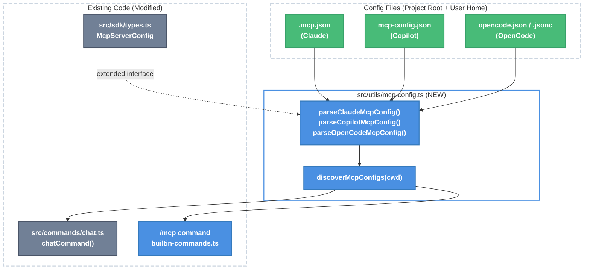

# MCP Support and Discovery for Config Files

| Document Metadata      | Details                                               |
| ---------------------- | ----------------------------------------------------- |
| Author(s)              | Developer                                             |
| Status                 | Draft (WIP)                                           |
| Team / Owner           | Atomic TUI                                            |
| Created / Last Updated | 2026-02-08                                            |
| Issue                  | [#164](https://github.com/flora131/atomic/issues/164) |
| Branch                 | lavaman131/feature/tui                                |

## 1. Executive Summary

This spec adds multi-format MCP config discovery, a `/mcp` slash command, and an extended `McpServerConfig` type to the Atomic TUI. Currently, only `.mcp.json` (Claude format) is read — and only inline in `chatCommand`. The Copilot (`mcp-config.json`) and OpenCode (`opencode.json`) config formats are never parsed. There is no `/mcp` command for users to view or toggle MCP servers. This spec proposes: (1) a new `src/utils/mcp-config.ts` module with parsers for all three config formats and a unified discovery function, (2) extending `McpServerConfig` with `headers`, `enabled`, `cwd`, and `timeout` fields, (3) refactoring `chatCommand` to use the discovery function, (4) adding a `/mcp` slash command to display server status and toggle servers, and (5) adding a `showMcpOverlay` flag to `CommandResult` for future modal UI support.

> **Primary Research**: [research/docs/2026-02-08-164-mcp-support-discovery.md](../research/docs/2026-02-08-164-mcp-support-discovery.md)
> **Prior Spec**: [specs/mcp-tool-calling-opentui.md](./mcp-tool-calling-opentui.md) — covers SDK-level MCP passthrough and tool rendering (separate effort, partially implemented)

## 2. Context and Motivation

### 2.1 Current State

**Config loading is hardcoded to Claude format only:**
- `src/commands/chat.ts:177-194` reads `.mcp.json` from `process.cwd()` and maps entries to `McpServerConfig[]` — but only the Claude format (`mcpServers` key, `type`/`command`/`args`/`env`/`url` fields).
- Copilot's `mcp-config.json` (repo-level `.copilot/mcp-config.json` or user-level `~/.copilot/mcp-config.json`) is never read.
- OpenCode's `opencode.json` or `.opencode/opencode.json` (uses `mcp` key, `local`/`remote` types, `command: string[]`, `environment` instead of `env`) is never read.

**No `/mcp` command exists:**
- The 6 built-in commands are: `/help`, `/theme`, `/clear`, `/compact`, `/exit`, `/model` (`src/ui/commands/builtin-commands.ts:438-445`).
- No way for users to view discovered MCP servers, their connection status, or toggle them on/off.

**`McpServerConfig` is missing fields needed for cross-SDK normalization:**
- Current interface at `src/sdk/types.ts:26-39` lacks `headers` (needed for auth tokens in SSE/HTTP), `cwd` (Copilot's working directory), `timeout` (Copilot/OpenCode), and `enabled` (OpenCode toggle).
- The `chatCommand` inline parser at `src/commands/chat.ts:183-191` already silently drops `headers` from `.mcp.json` entries.

**SDK clients already consume `McpServerConfig[]` correctly:**
- Claude client (`src/sdk/claude-client.ts:270-289`) branches on `server.url` vs `server.command` and maps to the SDK's `McpStdioServerConfig`/`McpHttpServerConfig`/`McpSSEServerConfig`.
- Copilot client (`src/sdk/copilot-client.ts:641-661`) maps `McpServerConfig[]` to `Record<string, MCPServerConfig>`.
- OpenCode client handles MCP server-side via `.opencode/opencode.json` — no client-side passthrough needed.

### 2.2 The Problem

- **User Impact:** Users with Copilot or OpenCode MCP configs get no MCP tools in their sessions. They must manually duplicate their config into `.mcp.json`.
- **Discoverability:** No in-session way to see which MCP servers are configured, whether they're connected, or toggle them.
- **Data Loss:** `headers` field is silently dropped during config parsing, breaking authenticated MCP servers.

## 3. Goals and Non-Goals

### 3.1 Functional Goals

- [ ] Parse MCP configs from all three SDK formats: `.mcp.json` (Claude), `mcp-config.json` (Copilot), `opencode.json`/`opencode.jsonc` (OpenCode)
- [ ] Auto-discover config files in project root and user-level directories
- [ ] Normalize all formats to extended `McpServerConfig` (with `headers`, `enabled`, `cwd`, `timeout`)
- [ ] Refactor `chatCommand` to use the discovery module instead of inline `.mcp.json` parsing
- [ ] Add `/mcp` slash command that displays discovered servers with name, type, enabled status
- [ ] Support `/mcp` toggle to enable/disable individual servers by name

### 3.2 Non-Goals (Out of Scope)

- [ ] Live MCP server connection status display (requires SDK-level status APIs — deferred to `/context` command effort)
- [ ] Adding/removing MCP servers from within the TUI (use file-based config or CLI tools)
- [ ] Unified MCP management layer that bypasses SDK-native mechanisms
- [ ] OAuth flow support for MCP servers
- [ ] Environment variable expansion (`${VAR}`, `{env:VAR}`) in config values

## 4. Proposed Solution (High-Level Design)

### 4.1 System Architecture



### 4.2 Key Components

| Component                      | Responsibility                                                 | Location                              | Status       |
| ------------------------------ | -------------------------------------------------------------- | ------------------------------------- | ------------ |
| `McpServerConfig` (extended)   | Unified type with all cross-SDK fields                         | `src/sdk/types.ts:26-39`              | Modify       |
| Config parsers                 | Parse each SDK's config format to `McpServerConfig[]`          | `src/utils/mcp-config.ts`             | **New file** |
| `discoverMcpConfigs()`         | Auto-discover and merge configs from all sources               | `src/utils/mcp-config.ts`             | **New file** |
| `chatCommand` refactor         | Replace inline `.mcp.json` parsing with `discoverMcpConfigs()` | `src/commands/chat.ts:177-194`        | Modify       |
| `/mcp` command                 | Display and toggle MCP servers                                 | `src/ui/commands/builtin-commands.ts` | Add          |
| `CommandResult.showMcpOverlay` | Flag for MCP overlay UI                                        | `src/ui/commands/registry.ts:138-161` | Modify       |

## 5. Detailed Design

### 5.1 Extend `McpServerConfig` (`src/sdk/types.ts:26-39`)

Add missing fields identified in [research](../research/docs/2026-02-08-164-mcp-support-discovery.md#missing-fields):

```typescript
export interface McpServerConfig {
  /** Unique identifier for the MCP server */
  name: string;
  /** Transport type: stdio for local processes, http/sse for remote servers */
  type?: "stdio" | "http" | "sse";
  /** Command to launch the MCP server (required for stdio transport) */
  command?: string;
  /** Arguments to pass to the MCP server command */
  args?: string[];
  /** Environment variables for the MCP server process */
  env?: Record<string, string>;
  /** URL for HTTP/SSE transport */
  url?: string;
  /** HTTP headers for authenticated remote servers (SSE/HTTP only) */
  headers?: Record<string, string>;
  /** Working directory for stdio server process */
  cwd?: string;
  /** Connection timeout in milliseconds */
  timeout?: number;
  /** Whether the server is enabled (default: true) */
  enabled?: boolean;
}
```

**Impact on SDK clients:**
- Claude client (`src/sdk/claude-client.ts:270-289`): Pass `headers` for SSE/HTTP servers. Already branches on transport type correctly.
- Copilot client (`src/sdk/copilot-client.ts:641-661`): Pass `headers`, `cwd`, `timeout` fields. Copilot SDK supports all of these.
- OpenCode client: No changes needed — MCP is server-side.

### 5.2 Config Discovery Module (`src/utils/mcp-config.ts` — NEW)

This is the only new file in the spec. It contains format-specific parsers and a unified discovery function.

#### JSONC Support

All parsers use `Bun.JSONC.parse()` instead of `JSON.parse()`. JSONC is a superset of JSON that allows `//` comments, `/* */` block comments, and trailing commas. Since JSONC is a strict superset, `Bun.JSONC.parse()` handles both `.json` and `.jsonc` files transparently.

This is important because OpenCode explicitly supports `opencode.jsonc` (it uses the `jsonc-parser` npm package internally and iterates over both `opencode.json` and `opencode.jsonc` filenames during config loading). Bun has built-in JSONC support via `Bun.JSONC.parse()` since v1.3.6 — no external dependencies needed.

Using `Bun.JSONC.parse()` universally (even for `.mcp.json` and `mcp-config.json`) is a low-risk improvement: users who add comments to any config file won't get silent parse failures.

#### 5.2.1 Claude Parser: `parseClaudeMcpConfig()`

Reads `.mcp.json` format. Key path: `mcpServers` (object of named server configs).

```typescript
/**
 * Parse Claude Code MCP config (.mcp.json).
 * Format: { "mcpServers": { "<name>": { type?, command?, args?, env?, url?, headers? } } }
 */
export function parseClaudeMcpConfig(filePath: string): McpServerConfig[] {
  try {
    const raw = readFileSync(filePath, "utf-8");
    const parsed = Bun.JSONC.parse(raw);
    if (!parsed.mcpServers || typeof parsed.mcpServers !== "object") return [];
    return Object.entries(parsed.mcpServers).map(([name, cfg]) => ({
      name,
      type: cfg.type as McpServerConfig["type"],
      command: cfg.command as string | undefined,
      args: cfg.args as string[] | undefined,
      env: cfg.env as Record<string, string> | undefined,
      url: cfg.url as string | undefined,
      headers: cfg.headers as Record<string, string> | undefined,
      enabled: true,
    }));
  } catch {
    return [];
  }
}
```

This extracts and generalizes the inline parsing currently at `src/commands/chat.ts:179-191`. The existing code silently drops `headers` — this parser preserves it.

#### 5.2.2 Copilot Parser: `parseCopilotMcpConfig()`

Reads `mcp-config.json` format. Key path: `mcpServers`. Copilot uses `"local"` type alias for stdio.

```typescript
/**
 * Parse Copilot CLI MCP config (mcp-config.json).
 * Format: { "mcpServers": { "<name>": { type, command?, args?, env?, url?, headers?, cwd?, tools?, timeout? } } }
 * Maps "local" type to "stdio".
 */
export function parseCopilotMcpConfig(filePath: string): McpServerConfig[] {
  try {
    const raw = readFileSync(filePath, "utf-8");
    const parsed = Bun.JSONC.parse(raw);
    if (!parsed.mcpServers || typeof parsed.mcpServers !== "object") return [];
    return Object.entries(parsed.mcpServers).map(([name, cfg]) => {
      const type = cfg.type === "local" ? "stdio" : (cfg.type as McpServerConfig["type"]);
      return {
        name,
        type,
        command: cfg.command as string | undefined,
        args: cfg.args as string[] | undefined,
        env: cfg.env as Record<string, string> | undefined,
        url: cfg.url as string | undefined,
        headers: cfg.headers as Record<string, string> | undefined,
        cwd: cfg.cwd as string | undefined,
        timeout: cfg.timeout as number | undefined,
        enabled: true,
      };
    });
  } catch {
    return [];
  }
}
```

Per [research](../research/docs/2026-02-08-164-mcp-support-discovery.md#copilot-cli-mcp-configjson): Copilot uses the same `command`/`args` split as Claude. The `tools` field (filter) and Copilot-specific fields are intentionally not mapped — they are SDK-specific behaviors.

#### 5.2.3 OpenCode Parser: `parseOpenCodeMcpConfig()`

Reads `opencode.json` / `opencode.jsonc` format. Key path: `mcp`. Has significant field differences from Claude/Copilot. OpenCode itself supports JSONC via the `jsonc-parser` npm package and iterates over both `opencode.jsonc` and `opencode.json` filenames during config loading.

```typescript
/**
 * Parse OpenCode MCP config (opencode.json, opencode.jsonc, or .opencode/opencode.json).
 * Supports JSONC (comments + trailing commas) via Bun.JSONC.parse().
 * Format: { "mcp": { "<name>": { type, command?, url?, environment?, enabled?, timeout? } } }
 * Maps "local" -> "stdio", "remote" -> "http".
 * Splits "command: string[]" into command (first) + args (rest).
 * Maps "environment" to "env".
 */
export function parseOpenCodeMcpConfig(filePath: string): McpServerConfig[] {
  try {
    const raw = readFileSync(filePath, "utf-8");
    const parsed = Bun.JSONC.parse(raw);
    if (!parsed.mcp || typeof parsed.mcp !== "object") return [];
    return Object.entries(parsed.mcp).map(([name, cfg]) => {
      const type = cfg.type === "local" ? "stdio"
        : cfg.type === "remote" ? "http"
        : (cfg.type as McpServerConfig["type"]);

      // OpenCode schema enforces command: string[] (Zod: z.string().array()).
      // Defensively handle string input: split on whitespace to normalize.
      let command: string | undefined;
      let args: string[] | undefined;
      if (Array.isArray(cfg.command)) {
        command = cfg.command[0];
        args = cfg.command.slice(1);
      } else if (typeof cfg.command === "string") {
        const parts = cfg.command.trim().split(/\s+/);
        command = parts[0];
        args = parts.slice(1);
      }

      return {
        name,
        type,
        command,
        args,
        env: (cfg.environment ?? cfg.env) as Record<string, string> | undefined,
        url: cfg.url as string | undefined,
        headers: cfg.headers as Record<string, string> | undefined,
        timeout: cfg.timeout as number | undefined,
        enabled: cfg.enabled !== false, // default true
      };
    });
  } catch {
    return [];
  }
}
```

Per [research](../research/docs/2026-02-08-164-mcp-support-discovery.md#opencode-opencodejson--opencodeopencodejson): OpenCode uses `"local"`/`"remote"` instead of `"stdio"`/`"http"`, `command: string[]` instead of `command` + `args`, and `environment` instead of `env`. OpenCode's Zod schema strictly enforces `command` as `z.string().array()`, and the CLI's `mcp add` command splits user-provided strings into arrays before saving. The defensive `string` handling above covers hand-edited configs that don't match the schema.

#### 5.2.4 Discovery Function: `discoverMcpConfigs()`

Scans all known config locations and merges results, deduplicating by server name (last wins):

```typescript
/**
 * Discover and load MCP server configs from all known config file locations.
 * Deduplicates by server name — later sources override earlier ones.
 *
 * Discovery order (lowest to highest priority):
 * 1. User-level configs (~/.claude/.mcp.json, ~/.copilot/mcp-config.json, ~/.github/mcp-config.json)
 * 2. Project-level configs (.mcp.json, .copilot/mcp-config.json, .github/mcp-config.json, opencode.json, opencode.jsonc, .opencode/opencode.json)
 *
 * @param cwd - Project root directory (defaults to process.cwd())
 * @returns Deduplicated array of McpServerConfig
 */
export function discoverMcpConfigs(cwd?: string): McpServerConfig[] {
  const projectRoot = cwd ?? process.cwd();
  const homeDir = process.env.HOME ?? process.env.USERPROFILE ?? "";

  const sources: McpServerConfig[] = [];

  // User-level configs (lowest priority)
  sources.push(...parseClaudeMcpConfig(join(homeDir, ".claude", ".mcp.json")));
  sources.push(...parseCopilotMcpConfig(join(homeDir, ".copilot", "mcp-config.json")));
  sources.push(...parseCopilotMcpConfig(join(homeDir, ".github", "mcp-config.json")));

  // Project-level configs (higher priority — override user-level)
  sources.push(...parseClaudeMcpConfig(join(projectRoot, ".mcp.json")));
  sources.push(...parseCopilotMcpConfig(join(projectRoot, ".copilot", "mcp-config.json")));
  sources.push(...parseCopilotMcpConfig(join(projectRoot, ".github", "mcp-config.json")));
  sources.push(...parseOpenCodeMcpConfig(join(projectRoot, "opencode.json")));
  sources.push(...parseOpenCodeMcpConfig(join(projectRoot, "opencode.jsonc")));
  sources.push(...parseOpenCodeMcpConfig(join(projectRoot, ".opencode", "opencode.json")));

  // Deduplicate by name (last wins)
  const byName = new Map<string, McpServerConfig>();
  for (const server of sources) {
    byName.set(server.name, server);
  }

  // Filter out disabled servers
  return Array.from(byName.values()).filter(s => s.enabled !== false);
}
```

Per [research](../research/docs/2026-02-08-164-mcp-support-discovery.md#files-to-scan): The config discovery table lists all file paths and their SDK associations. The `opencode.jsonc` path is added here to match OpenCode's own config loader, which iterates over both `.jsonc` and `.json` variants.

### 5.3 Refactor `chatCommand` (`src/commands/chat.ts:177-194`)

Replace the inline `.mcp.json` parsing with a call to `discoverMcpConfigs()`:

**Before** (current code at `src/commands/chat.ts:177-194`):
```typescript
// Read MCP server config from .mcp.json
let mcpServers: McpServerConfig[] | undefined;
try {
  const raw = readFileSync(join(process.cwd(), ".mcp.json"), "utf-8");
  const parsed = JSON.parse(raw) as { mcpServers?: Record<string, Record<string, unknown>> };
  if (parsed.mcpServers) {
    mcpServers = Object.entries(parsed.mcpServers).map(([name, cfg]) => ({
      name,
      type: cfg.type as McpServerConfig["type"],
      command: cfg.command as string | undefined,
      args: cfg.args as string[] | undefined,
      env: cfg.env as Record<string, string> | undefined,
      url: cfg.url as string | undefined,
    }));
  }
} catch {
  // No .mcp.json or invalid -- continue without MCP
}
```

**After**:
```typescript
import { discoverMcpConfigs } from "../utils/mcp-config.ts";

// Discover MCP server configs from all known config formats
const mcpServers = discoverMcpConfigs();
```

The `readFileSync` and `join` imports for MCP can be removed from `chat.ts` if they are not used elsewhere in the file. The `discoverMcpConfigs()` call replaces 15 lines with 1.

### 5.4 `/mcp` Slash Command (`src/ui/commands/builtin-commands.ts`)

Add a new builtin command that displays discovered MCP servers and supports toggling:

```typescript
/**
 * /mcp - Display and manage MCP servers.
 *
 * Subcommands:
 *   (no args)    - List all discovered MCP servers with status
 *   enable <n>   - Enable a server by name
 *   disable <n>  - Disable a server by name
 */
export const mcpCommand: CommandDefinition = {
  name: "mcp",
  description: "View and toggle MCP servers",
  category: "builtin",
  argumentHint: "[enable|disable <server>]",
  execute: (args: string, _context: CommandContext): CommandResult => {
    const servers = discoverMcpConfigs();
    const trimmed = args.trim().toLowerCase();

    // No args: list servers
    if (!trimmed) {
      if (servers.length === 0) {
        return {
          success: true,
          message: "No MCP servers found.\n\nAdd servers via `.mcp.json`, `.copilot/mcp-config.json`, `.github/mcp-config.json`, or `.opencode/opencode.json`.",
        };
      }

      const lines: string[] = ["**MCP Servers**", ""];
      for (const server of servers) {
        const transport = server.type ?? (server.url ? "http" : "stdio");
        const target = server.url ?? server.command ?? "—";
        const status = server.enabled !== false ? "●" : "○";
        lines.push(`  ${status} **${server.name}** (${transport})`);
        lines.push(`    ${target}`);
      }
      lines.push("");
      lines.push("Use `/mcp enable <name>` or `/mcp disable <name>` to toggle.");
      return { success: true, message: lines.join("\n") };
    }

    // enable/disable subcommands
    const parts = trimmed.split(/\s+/);
    const subcommand = parts[0];
    const serverName = parts.slice(1).join(" ");

    if ((subcommand === "enable" || subcommand === "disable") && serverName) {
      const found = servers.find(s => s.name.toLowerCase() === serverName.toLowerCase());
      if (!found) {
        return {
          success: false,
          message: `MCP server '${serverName}' not found. Run /mcp to see available servers.`,
        };
      }
      // Note: Toggle is session-scoped only. Persistent toggle requires config file edit.
      return {
        success: true,
        message: `MCP server '${found.name}' ${subcommand}d for this session.`,
        stateUpdate: {
          mcpToggle: { name: found.name, enabled: subcommand === "enable" },
        } as unknown as CommandResult["stateUpdate"],
      };
    }

    return {
      success: false,
      message: "Usage: /mcp, /mcp enable <server>, /mcp disable <server>",
    };
  },
};
```

**Registration:** Add `mcpCommand` to the `builtinCommands` array at `src/ui/commands/builtin-commands.ts:438`:

```typescript
export const builtinCommands: CommandDefinition[] = [
  helpCommand,
  themeCommand,
  clearCommand,
  compactCommand,
  exitCommand,
  modelCommand,
  mcpCommand,  // NEW
];
```

### 5.5 `CommandResult` Extension (`src/ui/commands/registry.ts:138-161`)

Add an optional field for future MCP overlay support:

```typescript
export interface CommandResult {
  // ... existing fields ...
  /** If true, show the MCP server overlay/dialog */
  showMcpOverlay?: boolean;
}
```

This follows the pattern of `showModelSelector` and prepares for a future modal MCP UI (similar to OpenCode's approach documented in [research](../research/docs/2026-02-08-164-mcp-support-discovery.md#opencode-mcp)).

### 5.6 SDK Client Updates for Extended Fields

#### Claude Client (`src/sdk/claude-client.ts:270-289`)

Pass `headers` for SSE/HTTP servers:

```typescript
if (server.url && server.type === "sse") {
  options.mcpServers[server.name] = {
    type: "sse" as const,
    url: server.url,
    headers: server.headers,  // NEW
  };
} else if (server.url) {
  options.mcpServers[server.name] = {
    type: "http" as const,
    url: server.url,
    headers: server.headers,  // NEW
  };
} else if (server.command) {
  options.mcpServers[server.name] = {
    type: "stdio" as const,
    command: server.command,
    args: server.args,
    env: server.env,
  };
}
```

#### Copilot Client (`src/sdk/copilot-client.ts:641-661`)

Pass `headers`, `cwd`, `timeout`:

```typescript
mcpServers: config.mcpServers
  ? Object.fromEntries(
      config.mcpServers.map((s) => {
        if (s.url) {
          return [s.name, {
            type: (s.type === "sse" ? "sse" : "http") as "http" | "sse",
            url: s.url,
            headers: s.headers,   // NEW
            tools: ["*"],
            timeout: s.timeout,   // NEW
          }];
        }
        return [s.name, {
          type: "stdio" as const,
          command: s.command ?? "",
          args: s.args ?? [],
          env: s.env,
          cwd: s.cwd,            // NEW
          tools: ["*"],
          timeout: s.timeout,    // NEW
        }];
      })
    )
  : undefined,
```

## 6. Alternatives Considered

| Option                                                                   | Pros                              | Cons                                                                                   | Reason for Rejection                                                                                                       |
| ------------------------------------------------------------------------ | --------------------------------- | -------------------------------------------------------------------------------------- | -------------------------------------------------------------------------------------------------------------------------- |
| Keep inline parsing in `chatCommand`                                     | No new files                      | Duplicated if other commands need MCP config; can't support multi-format               | Multi-format support requires shared parsers. The existing inline code is already 15 lines and growing.                    |
| Agent-type-aware discovery (only read Claude config for Claude sessions) | Minimal parsing per session       | Users expect all their MCP servers regardless of agent; cross-agent consistency breaks | Unified approach is simpler and matches user expectations. Servers that don't apply to a given SDK are harmlessly ignored. |
| Interactive modal UI for `/mcp` (like OpenCode)                          | Richer UX with toggles and search | Larger implementation scope; requires OpenTUI dialog component work                    | Inline text output is the MVP. The `showMcpOverlay` flag in `CommandResult` prepares for future modal UI.                  |
| Store toggle state in config files                                       | Persistent across sessions        | Modifying user config files is risky; different SDKs have different formats            | Session-scoped toggles are safer for MVP. Persistent toggles can be added later.                                           |

## 7. Cross-Cutting Concerns

### 7.1 Error Handling

- All config file reads are wrapped in `try/catch` — missing or malformed files are silently skipped.
- Invalid JSON/JSONC in config files produces no error message. This is intentional: the user may have config files for SDKs they're not using.
- Using `Bun.JSONC.parse()` for all formats means comments and trailing commas in any config file are tolerated gracefully.
- The `/mcp` command always succeeds for listing (returns empty list if no configs found).

### 7.2 Backward Compatibility

- **`McpServerConfig` extension is additive** — all new fields are optional. Existing code that constructs `McpServerConfig` without the new fields continues to work.
- **`chatCommand` refactor is transparent** — the output (`McpServerConfig[]`) is the same shape, now with additional fields populated.
- **`chatCommand` currently drops `headers`** — the refactor is strictly an improvement (preserves more data).
- **SDK clients that don't use new fields** simply ignore them (TypeScript allows extra properties in mapped objects).

### 7.3 Security

- Config files are read from known paths only (project root and `$HOME`). No user-supplied paths.
- `headers` may contain auth tokens. These are passed to SDK clients in-memory and never logged or displayed in the `/mcp` command output.
- Environment variable expansion is explicitly out of scope for this spec. Values like `${API_KEY}` are passed as literal strings.

## 8. Migration, Rollout, and Testing

### 8.1 Deployment Strategy

No phased rollout needed — this is a non-breaking additive change. All new functionality is opt-in:
- Users without Copilot/OpenCode config files see no change.
- The `/mcp` command is available immediately but harmless if no MCP configs exist.

### 8.2 Test Plan

**Unit Tests (new file: `tests/utils/mcp-config.test.ts`):**
- [ ] `parseClaudeMcpConfig()`: valid `.mcp.json` with stdio, http, sse servers; missing file returns `[]`; malformed JSON returns `[]`; preserves `headers` field
- [ ] `parseCopilotMcpConfig()`: valid `mcp-config.json` with `"local"` type mapped to `"stdio"`; `cwd` and `timeout` preserved; missing file returns `[]`
- [ ] `parseOpenCodeMcpConfig()`: valid `opencode.json` with `"local"` mapped to `"stdio"`, `"remote"` mapped to `"http"`; `command: string[]` split into `command` + `args`; `command` as plain `string` split on whitespace; `environment` mapped to `env`; `enabled: false` respected; missing file returns `[]`; JSONC with comments and trailing commas parses correctly (covers `opencode.jsonc`)
- [ ] `discoverMcpConfigs()`: merges from multiple sources; later sources override earlier by name; disabled servers filtered out; user-level configs loaded (incl. `~/.github/mcp-config.json`); project-level configs override user-level; `.github/mcp-config.json` at project level discovered

**Unit Tests (existing file: `tests/ui/commands/builtin-commands.test.ts`):**
- [ ] `/mcp` with no servers returns empty message
- [ ] `/mcp` with servers returns formatted list
- [ ] `/mcp enable <name>` returns success for known server
- [ ] `/mcp enable <name>` returns error for unknown server
- [ ] `/mcp disable <name>` returns success for known server

**Integration Tests:**
- [ ] `chatCommand` with `.mcp.json` present: `mcpServers` passed to `SessionConfig`
- [ ] `chatCommand` with no config files: `mcpServers` is empty array
- [ ] `chatCommand` with `.mcp.json` + `.opencode/opencode.json`: both configs merged, deduplicated

## 9. Files Changed

| File                                         | Change Type | Description                                                     |
| -------------------------------------------- | ----------- | --------------------------------------------------------------- |
| `src/sdk/types.ts`                           | Modify      | Add `headers`, `cwd`, `timeout`, `enabled` to `McpServerConfig` |
| `src/utils/mcp-config.ts`                    | **New**     | Config parsers and discovery function                           |
| `src/commands/chat.ts`                       | Modify      | Replace inline `.mcp.json` parsing with `discoverMcpConfigs()`  |
| `src/ui/commands/builtin-commands.ts`        | Modify      | Add `/mcp` command and register it                              |
| `src/ui/commands/registry.ts`                | Modify      | Add `showMcpOverlay` to `CommandResult`                         |
| `src/sdk/claude-client.ts`                   | Modify      | Pass `headers` for SSE/HTTP servers                             |
| `src/sdk/copilot-client.ts`                  | Modify      | Pass `headers`, `cwd`, `timeout` fields                         |
| `tests/utils/mcp-config.test.ts`             | **New**     | Unit tests for config parsers and discovery                     |
| `tests/ui/commands/builtin-commands.test.ts` | Modify      | Add `/mcp` command tests                                        |

## 10. Resolved Questions

### 10.1 Session-scoped toggle persistence

**Decision:** Pass toggle state to `SessionConfig`. When a server is toggled off via `/mcp disable <name>`, filter it out of the `mcpServers` array before the next `SessionConfig` is constructed. The server's tool descriptions will already be loaded for the current session (since MCP tool discovery happens at session init), so mid-session toggles only take effect on the next session or reconnect. This is acceptable for MVP.

### 10.2 Claude auto-discovery overlap

**Decision:** Safe to pass — no duplicate connections.

The Claude Agent SDK's `Options.mcpServers` is typed as `Record<string, McpServerConfig>` — a name-keyed dictionary ([`docs/claude-agent-sdk/typescript-sdk.md:118`](../docs/claude-agent-sdk/typescript-sdk.md)). When `settingSources: ["project"]` auto-discovers `.mcp.json` servers, and `chatCommand` also passes the same servers via `Options.mcpServers`, the SDK merges them by key. Per the SDK docs: "Programmatic options (like `agents`, `allowedTools`) always override filesystem settings" ([`docs/claude-agent-sdk/typescript-sdk.md:278`](../docs/claude-agent-sdk/typescript-sdk.md)). So a server named `"deepwiki"` from both sources resolves to a single entry — the programmatic one takes precedence.

No special Claude-specific filtering is needed. The discovery module can safely pass all discovered servers for all SDK backends.

### 10.3 Copilot config location

**Decision:** `~/.copilot/mcp-config.json` is confirmed stable — the Copilot SDK documents and tests against this path (confirmed via [deepwiki for github/copilot-sdk](https://deepwiki.com/github/copilot-sdk)). Additionally, `~/.github/mcp-config.json` has been added as a discovery path (both user-level and project-level) per request. The discovery function now checks:

- User-level: `~/.copilot/mcp-config.json`, `~/.github/mcp-config.json`
- Project-level: `.copilot/mcp-config.json`, `.github/mcp-config.json`

### 10.4 OpenCode `command` type edge case

**Decision:** Handle both `string[]` and `string` defensively.

OpenCode's Zod schema strictly enforces `command` as `z.string().array()` (confirmed via [deepwiki for sst/opencode](https://deepwiki.com/sst/opencode)). The CLI's `mcp add` command splits user input strings into arrays before saving to config. However, hand-edited configs may contain a plain string. The parser now handles both:

```typescript
if (Array.isArray(cfg.command)) {
  command = cfg.command[0];
  args = cfg.command.slice(1);
} else if (typeof cfg.command === "string") {
  const parts = cfg.command.trim().split(/\s+/);
  command = parts[0];
  args = parts.slice(1);
}
```

This follows the principle of being liberal in what we accept while the canonical format remains `string[]`.

### 10.5 `/mcp` command access to session — Live status API design

**Decision:** Implement a `getMcpServerStatus()` abstraction in the SDK layer that normalizes the different status APIs across all three backends.

**Per-SDK status APIs (researched):**

| SDK              | Method                      | Return Type                 | Status Values                                                                                     |
| ---------------- | --------------------------- | --------------------------- | ------------------------------------------------------------------------------------------------- |
| Claude Agent SDK | `query().mcpServerStatus()` | `McpServerStatus[]`         | `connected`, `failed`, `needs-auth`, `pending`                                                    |
| OpenCode SDK     | `client.mcp.status()`       | `Record<string, McpStatus>` | `connected`, `disabled`, `failed` (+ error), `needs_auth`, `needs_client_registration` (+ error)  |
| Copilot SDK      | `client.getState()`         | `ConnectionState`           | `disconnected`, `connecting`, `connected`, `error` (client-level only, no per-server granularity) |

The Claude SDK also exposes MCP server status in the `SDKSystemMessage` (type `system`, subtype `init`) at session start via the `mcp_servers` field: `{ name: string; status: string }[]` ([`docs/claude-agent-sdk/typescript-sdk.md:517-521`](../docs/claude-agent-sdk/typescript-sdk.md)).

OpenCode additionally supports `mcp.connect()` and `mcp.disconnect()` methods for toggling individual servers at runtime, and the `sync.data.mcp` reactive object for UI observation.

**Normalized type for Atomic TUI:**

```typescript
/** Unified MCP server status across all SDK backends */
export interface McpServerStatusInfo {
  name: string;
  status: "connected" | "pending" | "failed" | "disabled" | "needs-auth" | "unknown";
  error?: string;
  serverInfo?: { name: string; version: string };
}
```

**Status mapping per SDK:**

| SDK Status                           | Normalized Status                           |
| ------------------------------------ | ------------------------------------------- |
| Claude `connected`                   | `connected`                                 |
| Claude `pending`                     | `pending`                                   |
| Claude `failed`                      | `failed`                                    |
| Claude `needs-auth`                  | `needs-auth`                                |
| OpenCode `connected`                 | `connected`                                 |
| OpenCode `disabled`                  | `disabled`                                  |
| OpenCode `failed`                    | `failed` (with `error`)                     |
| OpenCode `needs_auth`                | `needs-auth`                                |
| OpenCode `needs_client_registration` | `needs-auth` (with `error`)                 |
| Copilot `connected`                  | `connected` (all servers assumed connected) |
| Copilot `connecting`                 | `pending` (all servers assumed pending)     |
| Copilot `disconnected` / `error`     | `unknown` (no per-server info)              |

**Implementation approach for `/mcp` with live status:**

The `/mcp` command will accept an optional `CommandContext` field providing access to the active session's SDK client. The command handler calls the normalized `getMcpServerStatus()` method and merges the result with `discoverMcpConfigs()` to produce a combined view showing both discovered config and live connection status.

For Copilot, since there is no per-server status API, the command will show the config-level enabled/disabled state only, with no connection indicator. This is a known limitation of the Copilot SDK.

This live status feature is deferred to a follow-up implementation after the core discovery and `/mcp` command land.
