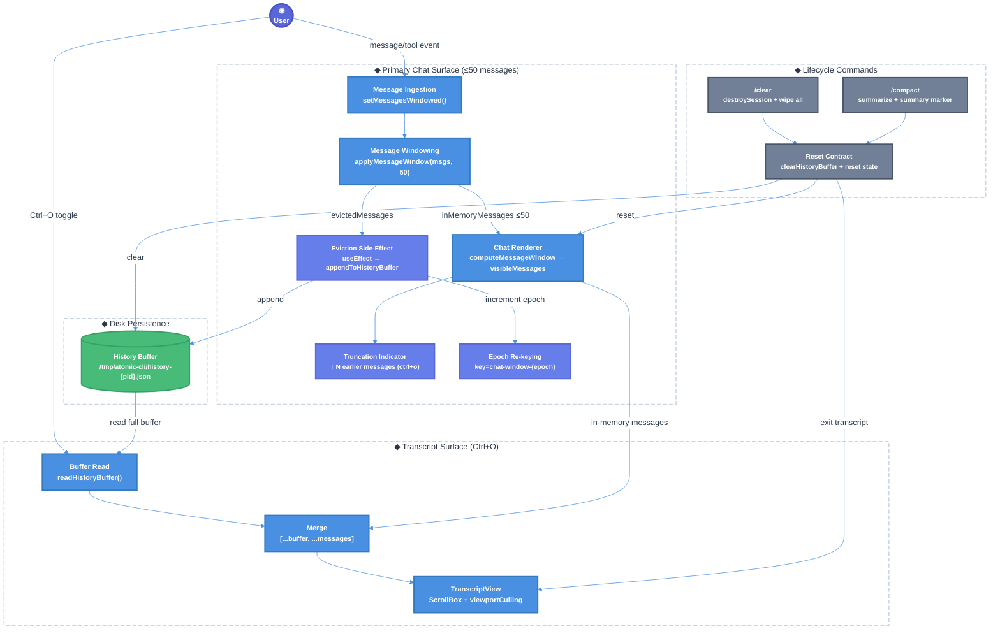

# Message Truncation & Dual-View System Technical Design Document / RFC

| Document Metadata      | Details                                    |
| ---------------------- | ------------------------------------------ |
| Author(s)              | Developer                                  |
| Status                 | Draft (WIP)                                |
| Team / Owner           | Atomic CLI                                 |
| Created / Last Updated | 2026-02-17                                 |

## 1. Executive Summary

This RFC formalizes and hardens Atomic's three-tier message display architecture: a bounded 50-message in-memory chat pane, a disk-backed eviction buffer for overflow persistence, and a full-screen Ctrl+O transcript view that merges both layers for complete session history. The system already exists in working form; this spec addresses three unresolved performance and reliability concerns identified in research[^r1]: (1) enabling viewport culling in the TranscriptView for long histories, (2) introducing a size-aware history buffer strategy to prevent unbounded memory consumption on Ctrl+O toggle, and (3) mitigating the visual flash caused by epoch-based ScrollBox re-keying during active scrolling. The `/clear` and `/compact` lifecycle commands are formalized as a unified reset contract. Expected impact is improved rendering performance in long sessions, bounded memory usage across all views, and a documented behavioral contract with regression test coverage.

## 2. Context and Motivation

**Research Reference:** `research/docs/2026-02-17-message-truncation-dual-view-system.md`[^r1]

**Prior Spec:** `specs/opentui-opencode-message-truncation-parity.md`[^r2]

### 2.1 Current State

Atomic implements a split-history architecture with three layers[^r1]:

```
┌─────────────────────────────────────────┐
│ Layer 1: In-Memory (≤50 messages)       │
│   - React state: messages[]             │
│   - Bounded by applyMessageWindow()     │
│   - Renders in main chat scrollbox      │
├─────────────────────────────────────────┤
│ Layer 2: Disk Buffer (evicted messages) │
│   - /tmp/atomic-cli/history-{pid}.json  │
│   - appendToHistoryBuffer() on eviction │
│   - Deduplication by message ID         │
├─────────────────────────────────────────┤
│ Layer 3: Full Transcript (Ctrl+O)       │
│   - readHistoryBuffer() + messages      │
│   - Rendered in TranscriptView          │
│   - All messages, no cap                │
└─────────────────────────────────────────┘
```

**Key implementation locations:**
- `src/ui/chat.tsx:878` — `MAX_VISIBLE_MESSAGES = 50`
- `src/ui/utils/message-window.ts:23-56` — Core windowing logic (`computeMessageWindow`, `applyMessageWindow`)
- `src/ui/utils/conversation-history-buffer.ts:15-90` — Disk-backed history persistence
- `src/ui/components/transcript-view.tsx:73-139` — Full transcript rendering
- `src/ui/chat.tsx:3472-3502` — `/clear` and `/compact` command handling
- `src/ui/chat.tsx:4050-4052` — Ctrl+O keybinding

**Architecture:**
- Main chat uses `setMessagesWindowed` (`chat.tsx:1807-1821`) to atomically apply the 50-message cap
- Evicted messages are deferred to a `useEffect` (`chat.tsx:1824-1837`) that writes them to disk via `appendToHistoryBuffer`
- The truncation indicator ("↑ N earlier messages in transcript (ctrl+o)") renders at `chat.tsx:5071-5086`
- Transcript mode merges `readHistoryBuffer() + messages` at `chat.tsx:5136-5144`
- ScrollBox re-keying via `messageWindowEpoch` at `chat.tsx:5150` forces clean scroll position on eviction

### 2.2 The Problem

Three unresolved issues exist in the current implementation[^r1]:

1. **TranscriptView viewport culling disabled:** `viewportCulling={false}` is explicitly set in `TranscriptView` (`transcript-view.tsx:94`). For sessions with hundreds of messages, this means every element renders even when off-screen. While transcript elements are flat `<text>` nodes (lower cost than full `MessageBubble` components), long sessions will see degraded rendering performance.

2. **Unbounded history buffer:** The disk-backed buffer at `/tmp/atomic-cli/history-{pid}.json` has no size limit. `readHistoryBuffer()` deserializes the entire JSON file into memory on every Ctrl+O toggle. For sessions exceeding thousands of messages, this produces a significant memory spike and parsing delay.

3. **Epoch re-keying flash:** The `key={`chat-window-${messageWindowEpoch}`}` pattern at `chat.tsx:5150` destroys and recreates the ScrollBox on every eviction batch. This ensures clean scroll state but can produce a visible flash if evictions occur during active user scrolling.

### 2.3 Comparison with OpenCode

OpenCode's TUI uses a simpler approach[^r1]:

| Aspect | OpenCode TUI | Atomic |
|---|---|---|
| Message cap | 100 | 50 |
| Eviction strategy | Drop oldest, no persistence | Evict to disk, persist for Ctrl+O |
| Full history view | Not available | Ctrl+O TranscriptView |
| Truncation indicator | None | "↑ N earlier messages in transcript (ctrl+o)" |
| /clear behavior | Navigate to new session (old intact) | Destroy session + wipe all views |
| /compact behavior | LLM summarize + prune tool outputs | LLM summarize + clear both views + add summary marker |
| Render optimization | No culling (renders all in memory) | `viewportCulling=true` in main chat, `false` in transcript |

Atomic's approach is strictly more capable but introduces the three concerns above that OpenCode avoids by not persisting or rendering history beyond the cap.

## 3. Goals and Non-Goals

### 3.1 Functional Goals

- [ ] **G1:** Enable viewport culling in TranscriptView for sessions exceeding a configurable threshold, maintaining rendering performance as history grows.
- [ ] **G2:** Introduce a bounded or streaming history buffer read strategy so Ctrl+O toggle does not load the entire buffer into memory at once for very large sessions.
- [ ] **G3:** Mitigate the epoch re-keying visual flash by evaluating alternative scroll-position-reset strategies.
- [ ] **G4:** Formalize the `/clear` and `/compact` lifecycle reset contract with explicit postcondition assertions.
- [ ] **G5:** Expand parity test coverage to lock the three-tier architecture behavior against regressions.
- [ ] **G6:** Document the dual-view state machine (normal chat ↔ transcript mode) with clear transition rules.

### 3.2 Non-Goals (Out of Scope)

- [ ] We will NOT implement OpenCode web-style paginated "Load Earlier" controls in the main chat view.
- [ ] We will NOT change the 50-message cap in this iteration.
- [ ] We will NOT add remote persistence, cross-session sync, or search-within-transcript features.
- [ ] We will NOT redesign the TranscriptView visual layout (it remains a flat scrollable list of formatted transcript lines).
- [ ] We will NOT implement auto-compaction threshold changes (that is a separate concern tracked elsewhere).

## 4. Proposed Solution (High-Level Design)

### 4.1 System Architecture Diagram



### 4.2 Architectural Pattern

**Split-History with Dual Rendering Surfaces and Bounded Persistence**

The pattern extends the existing three-tier architecture[^r1] with:
1. **Viewport-culled transcript rendering** — enabling OpenTUI's binary-search culling (`O(log n)`) in TranscriptView when message count exceeds a threshold.
2. **Size-aware buffer read** — bounding memory consumption when reconstructing full transcript.
3. **Smooth epoch transitions** — reducing visual disruption during eviction-triggered ScrollBox recreation.

### 4.3 Key Components

| Component | Responsibility | Technology | Justification |
|---|---|---|---|
| `message-window.ts` | Deterministic windowing (compute/apply) | TypeScript utility | Pure functions, unit-testable, no side effects |
| `conversation-history-buffer.ts` | Disk persistence for evicted messages | JSON temp file (Node/Bun fs) | Simple, process-scoped, survives React re-renders |
| `TranscriptView` | Full transcript rendering with Ctrl+O | OpenTUI ScrollBox + React | Dedicated surface isolates heavy rendering from main chat |
| `chat.tsx` windowing path | Orchestrate eviction, epoch, rendering | React state + useEffect | Central state coordinator for dual surfaces |
| `/clear` + `/compact` handlers | Lifecycle reset | Command framework | Single source of truth for reset postconditions |

## 5. Detailed Design

### 5.1 State Model

| State Element | Type | Location | Constraints | Description |
|---|---|---|---|---|
| `messages` | `ChatMessage[]` | `chat.tsx:1601` | `≤ MAX_VISIBLE_MESSAGES` | Active in-memory message array |
| `trimmedMessageCount` | `number` | `chat.tsx:1602` | `>= 0` | Cumulative count of messages evicted to disk |
| `transcriptMode` | `boolean` | `chat.tsx:1647` | UI toggle flag | Whether Ctrl+O transcript view is active |
| `messageWindowEpoch` | `number` | `chat.tsx` | Monotonically increasing | ScrollBox re-key trigger on eviction |
| `pendingEvictionsRef` | `Ref<{messages, count}[]>` | `chat.tsx` | Transient, flushed by useEffect | Deferred eviction queue for pure state updates |
| `historyBuffer` (disk) | JSON file | `/tmp/atomic-cli/history-{pid}.json` | Append-only until reset | Persisted evicted messages |
| `compactionSummary` | `string \| null` | `chat.tsx` | Optional | Summary baseline after `/compact` |

### 5.2 Message Ingestion and Windowing Flow

```
New message arrives
  → setMessagesWindowed(prev => [...prev, msg])
    → applyMessageWindow(nextMessages, 50)
      → if overflow: push to pendingEvictionsRef
      → return inMemoryMessages (≤50)
    → useEffect fires:
      → appendToHistoryBuffer(evicted)
      → setTrimmedMessageCount += evictedCount
      → setMessageWindowEpoch += 1

Render cycle:
  → computeMessageWindow(messages, trimmedCount + pendingCount)
    → visibleMessages (≤50), hiddenMessageCount
  → if hiddenMessageCount > 0: show "↑ N earlier messages" indicator
  → map visibleMessages to MessageBubble components
```

The `setMessagesWindowed` callback (`chat.tsx:1807-1821`) keeps the state updater pure by accumulating evictions into `pendingEvictionsRef`, then a separate `useEffect` (`chat.tsx:1824-1837`) processes the deferred side-effects (disk I/O + counter updates)[^r1].

### 5.3 Ctrl+O Transcript Toggle

```
Ctrl+O toggle (chat.tsx:4050-4052):
  → transcriptMode = !transcriptMode
  → if true: render TranscriptView with [...readHistoryBuffer(), ...messages]
  → if false: render normal chat view
```

**TranscriptView** (`transcript-view.tsx`) renders the merged history in a `<scrollbox>` with `stickyScroll={true}` and `stickyStart="bottom"`. Messages are formatted via `formatTranscript()` into typed `TranscriptLine[]` structures[^r1].

### 5.4 `/clear` and `/compact` Lifecycle Contract

#### `/clear` Postconditions

| State | After `/clear` |
|---|---|
| `messages` | `[]` (empty) |
| `trimmedMessageCount` | `0` |
| `transcriptMode` | `false` (force exit) |
| `historyBuffer` (disk) | Empty array `[]` |
| `compactionSummary` | `null` |
| `parallelAgents` | `[]` |
| Session | Destroyed via `onResetSession()` |

#### `/compact` Postconditions

| State | After `/compact` |
|---|---|
| `messages` | `[]` (empty) |
| `trimmedMessageCount` | `0` |
| `historyBuffer` (disk) | Single compaction summary marker |
| `compactionSummary` | Summary text from LLM |
| Session | Preserved (summarized, not destroyed) |

Both commands follow the same `clearMessages` handler path (`chat.tsx:3490-3502`), with `/clear` additionally triggering `destroySession` (`chat.tsx:3472-3487`)[^r1].

### 5.5 Proposed Change: Enable Viewport Culling in TranscriptView

**Decision: Unconditional culling**

**Current:** `viewportCulling={false}` at `transcript-view.tsx:94`

**Proposed:** Enable `viewportCulling={true}` unconditionally.

**Rationale:** OpenTUI's viewport culling uses binary search `O(log n)` to find overlapping children, with benchmarks showing < 10ms for 1,000 elements and < 50ms for 10,000[^r1]. The TranscriptView renders flat `<text>` elements (not complex `MessageBubble` components), so per-element cost is already low — but for very long sessions (hundreds+ of messages), culling still provides meaningful savings. OpenTUI short-circuits culling for < 16 elements, so there is zero overhead for short histories.

**Implementation approach:**
- Change `viewportCulling` from `false` to `true` in `TranscriptView`
- Verify that `stickyScroll` + `stickyStart="bottom"` behavior remains correct with culling enabled
- Ensure transcript lines maintain correct measurement for culling's binary search (elements must have deterministic heights)

### 5.6 Proposed Change: NDJSON Streaming History Buffer

**Decision: NDJSON streaming format**

**Current:** `readHistoryBuffer()` deserializes the entire JSON array file on every Ctrl+O toggle. `appendToHistoryBuffer()` reads the full file, appends, then writes back the entire array.

**Proposed:** Switch the history buffer from a single JSON array to newline-delimited JSON (NDJSON) format.

**NDJSON format:**
```
{"id":"msg-001","role":"user","content":"...","timestamp":1708123456}\n
{"id":"msg-002","role":"assistant","content":"...","timestamp":1708123460}\n
```

**Implementation approach:**
- **Write path (`appendToHistoryBuffer`):** Append new messages as individual JSON lines (`JSON.stringify(msg) + "\n"`) using `Bun.file().writer()` or `fs.appendFileSync`. No need to read-modify-write the entire file.
- **Read path (`readHistoryBuffer`):** Read the file as a stream, parsing lines incrementally via `Bun.file().text()` then `split("\n").filter(Boolean).map(JSON.parse)`. This enables future optimization to read only the last N lines.
- **Replace path (`replaceHistoryBuffer`):** Write all messages as NDJSON lines, replacing the file content entirely.
- **Clear path (`clearHistoryBuffer`):** Truncate the file to empty (same as current).
- **Compaction path (`appendCompactionSummary`):** Clear then append a single summary line.
- **Deduplication:** Current dedup-by-ID logic in `appendToHistoryBuffer` (`conversation-history-buffer.ts:22-37`) reads existing IDs. With NDJSON, maintain an in-memory `Set<string>` of written IDs (populated on first read) to avoid re-reading the file on every append.
- **Migration:** On first read, detect format (starts with `[` = JSON array, else NDJSON). If JSON array, read normally and continue appending in NDJSON for new evictions. The full file will be NDJSON after the next `/clear` or `/compact` reset.

### 5.7 Proposed Change: Debounced Epoch Re-keying

**Decision: Debounce epoch increment**

**Current:** `key={`chat-window-${messageWindowEpoch}`}` forces full ScrollBox destruction/recreation on every eviction batch. The `useEffect` at `chat.tsx:1824-1837` may increment `messageWindowEpoch` multiple times if several eviction batches are queued.

**Proposed:** Ensure the eviction side-effect processes all pending evictions in a single pass and increments `messageWindowEpoch` exactly once per effect execution, regardless of how many eviction batches are queued.

**Implementation approach:**
- In the eviction `useEffect`, loop through all `pendingEvictionsRef.current` entries, accumulate total evicted count, and call `setMessageWindowEpoch(e => e + 1)` once at the end (not per batch)
- This is largely how the current code already works (`chat.tsx:1824-1837`), but verify there are no code paths that increment epoch multiple times per render cycle
- Add a guard to ensure the epoch only increments when `totalEvicted > 0` (already present but worth asserting in tests)

## 6. Alternatives Considered

| Option | Pros | Cons | Reason for Rejection |
|---|---|---|---|
| **A: Unbounded in-memory history** | Simplest model, no disk I/O | Memory grows without bound; long sessions risk OOM | Violates bounded-resource goals |
| **B: OpenCode-style hard cap (no history)** | Zero complexity for history management | Users lose access to earlier context entirely | Atomic's Ctrl+O transcript is a differentiating feature |
| **C: OpenCode web-style paginated timeline** | Rich UI with "Load Earlier" controls | Significant UX complexity; requires turn-based render window, idle backfill, and pagination state | Overbuilt for TUI context; transcript view is sufficient |
| **D: Split-history with hardening (Selected)** | Preserves existing architecture, addresses specific performance gaps | Requires targeted changes to culling, buffer reads, and epoch logic | **Selected:** Lowest risk, highest clarity, directly addresses research findings |

## 7. Cross-Cutting Concerns

### 7.1 Security and Privacy

- The history buffer at `/tmp/atomic-cli/history-{pid}.json` may contain sensitive prompt content, tool outputs, and API responses
- `/clear` and `/compact` must fully wipe or replace the buffer — partial clears that leave stale data accessible via Ctrl+O are a privacy concern
- No new external data flows are introduced
- **Mandated:** File permissions on the buffer must be set to `0600` (owner read/write only) when creating the file. This applies to both the initial file creation and any replacement writes (e.g., after `/compact`)

### 7.2 Observability Strategy

- **Debug logging:** Log eviction counts, buffer file sizes, and read times on Ctrl+O toggle
- **Metrics (if telemetry enabled):** Track `transcript_view_message_count`, `history_buffer_size_bytes`, `ctrl_o_load_time_ms`
- **Assertions:** Post-reset assertions after `/clear` and `/compact` to verify all state elements match documented postconditions

### 7.3 Performance Characteristics

| Scenario | Current | After Changes |
|---|---|---|
| Main chat render (≤50 msgs) | `viewportCulling=true`, bounded | No change |
| Ctrl+O with 100 messages | Renders all, no culling | Culling enabled, ~same speed (under threshold) |
| Ctrl+O with 1,000 messages | Renders all, potential lag | Culling: < 10ms overhead; paginated read: bounded memory |
| Eviction during scrolling | Full ScrollBox recreate (flash) | Debounced/conditional re-key (reduced flash) |

### 7.4 OpenTUI ScrollBox Configuration Comparison

| Property | Main Chat (`chat.tsx:5149`) | TranscriptView (current) | TranscriptView (proposed) |
|---|---|---|---|
| `stickyScroll` | `true` | `true` | `true` |
| `stickyStart` | `"bottom"` | `"bottom"` | `"bottom"` |
| `viewportCulling` | default (`true`) | `false` | `true` |
| `scrollY` | `true` | `true` | `true` |
| `scrollX` | `false` | `false` | `false` |

## 8. Migration, Rollout, and Testing

### 8.1 Deployment Strategy

- [ ] **Phase 1:** Enable viewport culling in TranscriptView. Verify stickyScroll behavior with culling on. This is the lowest-risk change.
- [ ] **Phase 2:** Implement bounded history buffer read strategy (paginated or capped). Update `readHistoryBuffer()` and `TranscriptView` to support the chosen approach.
- [ ] **Phase 3:** Implement epoch re-keying smoothing. Debounce or conditionalize the epoch increment to reduce flash during active scrolling.
- [ ] **Phase 4:** Add comprehensive parity tests and formalize the `/clear` + `/compact` postcondition contract.

### 8.2 Data Migration Plan

- No schema migration required
- History buffer format change (if NDJSON is chosen) would require a one-time migration path or version check on read
- If paginated read is chosen, the existing JSON array format remains compatible — only the read logic changes
- Backward compatibility: existing sessions continue working; only new evictions use the updated path

### 8.3 Test Plan

**Unit Tests:**
- `computeMessageWindow` correctness for edge cases (0 messages, exactly 50, 51, 200)
- `applyMessageWindow` eviction boundary correctness
- History buffer: append, read, clear, replace, deduplication
- `/clear` postcondition assertions (all state elements reset)
- `/compact` postcondition assertions (buffer contains only summary marker)

**Integration Tests:**
- Main chat shows truncation indicator after 51st message
- Ctrl+O renders merged transcript (buffer + in-memory) with correct message count
- `/clear` removes both visible and transcript context
- `/compact` resets context and retains summary baseline only
- Ctrl+O → `/compact` → Ctrl+O shows only summary + new messages
- Viewport culling: TranscriptView with 500+ messages renders within acceptable frame time

**End-to-End Tests:**
- Long conversation scenario (>50 messages) → verify truncation indicator → Ctrl+O → verify full history
- Sequence: chat → Ctrl+O → `/compact` → Ctrl+O → `/clear` → Ctrl+O
- Rapid message ingestion (simulate streaming) → verify no epoch flash during stickyScroll
- Buffer persistence: evict messages → kill process → restart → verify buffer file exists

## 9. Open Questions / Unresolved Issues

Resolved decisions (2026-02-17):

- [x] **Q1: Viewport culling compatibility** — **Unconditional.** Enable `viewportCulling={true}` always. OpenTUI short-circuits for < 16 elements, so no overhead for short histories.

- [x] **Q2: History buffer bounding strategy** — **NDJSON streaming format.** Switch from JSON array to newline-delimited JSON for append efficiency and incremental parsing. Enables future partial reads without deserializing the entire file.

- [x] **Q3: Epoch re-keying strategy** — **Debounce epoch increment.** Ensure the eviction side-effect increments `messageWindowEpoch` exactly once per flush cycle, regardless of how many eviction batches are queued.

- [x] **Q4: History buffer file permissions** — **Yes, mandate `0600`.** Explicitly set restrictive permissions when creating the buffer file as defense-in-depth for sensitive prompt/tool content.

## Research Citations

[^r1]: `research/docs/2026-02-17-message-truncation-dual-view-system.md` — Primary research document covering the three-tier architecture, OpenCode comparison, OpenTUI primitives, and open questions.

[^r2]: `specs/opentui-opencode-message-truncation-parity.md` — Prior spec formalizing the split-history pattern and reset contract. This RFC extends it with performance hardening.

[^r3]: `research/docs/2026-02-15-opentui-opencode-message-truncation-research.md` — Earlier truncation research confirming the 50-message cap and dual-view architecture.

[^r4]: `research/docs/2026-02-16-opentui-rendering-architecture.md` — OpenTUI rendering pipeline documentation, including viewport culling benchmarks.

[^r5]: `research/docs/2026-02-16-opencode-message-rendering-patterns.md` — OpenCode message part rendering patterns for comparison.
