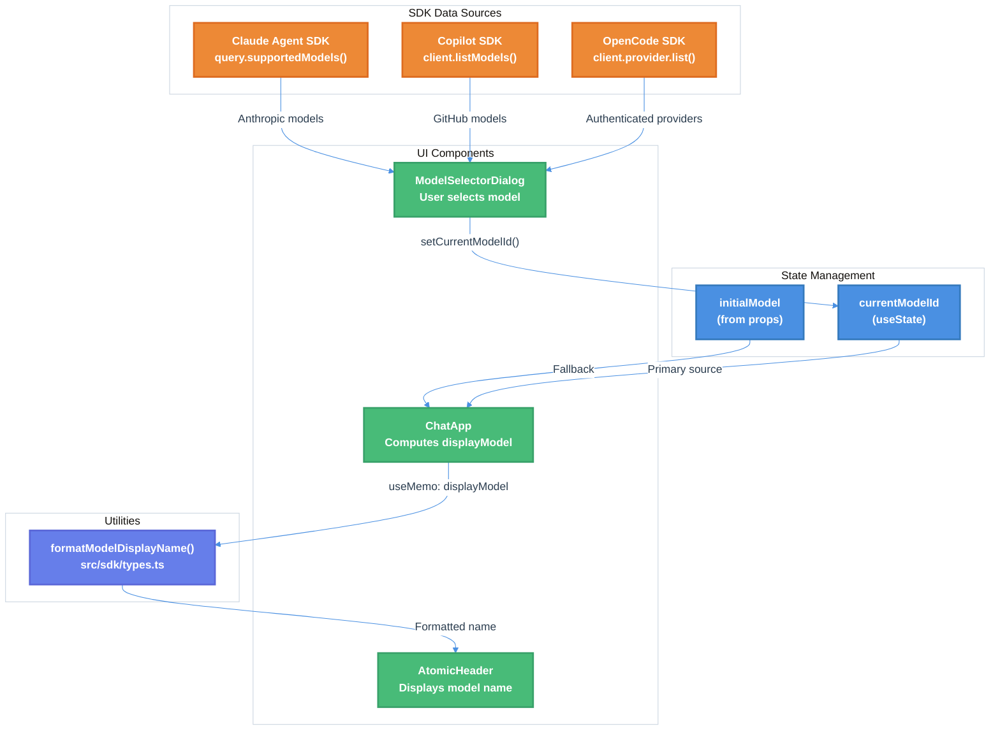

# Model Command Header Update and Provider-Specific Filtering Technical Design Document

| Document Metadata      | Details     |
| ---------------------- | ----------- |
| Author(s)              | Developer   |
| Status                 | Draft (WIP) |
| Team / Owner           | Atomic CLI  |
| Created / Last Updated | 2026-02-05  |

## 1. Executive Summary

This RFC addresses a **static header model display bug** in the Atomic TUI where the header model name does not update when users change models via the `/model` command. The solution connects the existing `currentModelId` state to the `AtomicHeader` component. Additionally, this spec ensures **provider-specific model filtering** for each agent type using their respective SDKs:

- **Claude**: Uses `@anthropic-ai/claude-agent-sdk` → `query.supportedModels()` for Anthropic models
- **OpenCode**: Uses `@opencode-ai/sdk` → `client.provider.list()` for authenticated providers
- **Copilot**: Uses `@github/copilot-sdk` → `client.listModels()` for GitHub models

**Research Reference:** `research/docs/2026-02-05-model-command-header-update-research.md`

## 2. Context and Motivation

### 2.1 Current State

**Architecture:** The `AtomicHeader` component receives the `model` prop statically from `ChatAppProps`, which is set once during initial render. A separate `currentModelId` state exists and is updated when users change models, but this state is not connected to the header display.

**Current Data Flow:**

```
chat.ts (model option) → ChatApp props (static) → AtomicHeader (static display)

ModelSelector → currentModelId (useState) → NOWHERE (not connected to header)
```

**Limitations:**

- Header displays static model name from initialization, never updates
- `currentModelId` state tracks model changes but is not used for display
- OpenCode agent shows all providers' models regardless of authentication status

### 2.2 The Problem

- **User Impact:** Users see outdated model information in the header after changing models via `/model` command, causing confusion about which model is active
- **UX Degradation:** Header displays "Opus 4.5" even when user has switched to "Sonnet 4.5"
- **Model Selection Noise:** OpenCode users see models from providers they cannot access due to missing API keys

**Research Reference:** Sections 1-4 of `research/docs/2026-02-05-model-command-header-update-research.md`

## 3. Goals and Non-Goals

### 3.1 Functional Goals

- [ ] Connect `currentModelId` state to `AtomicHeader` model display
- [ ] Update header reactively when model changes via `/model` command
- [ ] Use `formatModelDisplayName()` utility for human-readable model names in header
- [ ] OpenCode: Filter models to only show authenticated providers based on environment variables
- [ ] Verify Claude filtering restricts to `['anthropic']` provider only
- [ ] Verify Copilot filtering restricts to `['github-copilot', 'github-models']` providers only

### 3.2 Non-Goals (Out of Scope)

- [ ] We will NOT add model change events to Claude SDK - use existing state management
- [ ] We will NOT modify the `AtomicHeader` component interface - only change how `model` prop is computed
- [ ] We will NOT implement fuzzy model name matching - exact display name formatting only
- [ ] We will NOT use models.dev API - the SDKs provide authenticated model lists directly
- [ ] We will NOT reimplement authentication/provider logic - we use existing SDKs (see Section 5.2):
  - Claude: `@anthropic-ai/claude-agent-sdk` → `query.supportedModels()`
  - Copilot: `@github/copilot-sdk` → `client.listModels()`
  - OpenCode: `@opencode-ai/sdk` → `client.provider.list()`

## 4. Proposed Solution (High-Level Design)

### 4.1 System Architecture Diagram



### 4.2 Proposed Model State Flow

**Before (Current - Broken):**

```
┌─────────────────┐    Initial    ┌─────────────────┐
│  chat.ts        │──────────────▶│  ChatApp props  │
│  (model option) │               │  (static model) │
└─────────────────┘               └─────────────────┘
                                          │
                                          ▼
                                  ┌─────────────────┐
                                  │  AtomicHeader   │
                                  │  (static model) │  ← NEVER UPDATES
                                  └─────────────────┘
```

**After (Proposed - Fixed):**

```
┌─────────────────┐    Initial    ┌─────────────────┐
│  chat.ts        │──────────────▶│  initialModel   │
│  (model option) │               │  (prop)         │
└─────────────────┘               └─────────────────┘
                                          │
                                          ▼
                                  ┌─────────────────┐
│  ModelSelector  │──────────────▶│  currentModelId │
│  Dialog         │   setModel    │  (useState)     │
└─────────────────┘               └─────────────────┘
                                          │
                                          ▼
                                  ┌─────────────────┐
                                  │  displayModel   │
                                  │  (useMemo)      │
                                  └─────────────────┘
                                          │
                                          ▼
                                  ┌─────────────────┐
                                  │  AtomicHeader   │
                                  │  (reactive)     │  ← NOW UPDATES
                                  └─────────────────┘
```

### 4.3 Architectural Pattern

We are adopting a **Derived State Pattern**:

- The header model display is computed from `currentModelId` state using `useMemo`
- Falls back to initial `model` prop when `currentModelId` is undefined
- Uses existing `formatModelDisplayName()` utility for consistent display names
- No changes to component interfaces required

### 4.4 Key Components

| Component                  | Responsibility                     | File Location                    | Change Type |
| -------------------------- | ---------------------------------- | -------------------------------- | ----------- |
| `ChatApp`                  | Compute displayModel via useMemo   | `src/ui/chat.tsx`                | Modify      |
| `AtomicHeader`             | Display model name                 | `src/ui/chat.tsx`                | No change   |
| `formatModelDisplayName()` | Format model ID to display name    | `src/sdk/types.ts`               | No change   |
| `UnifiedModelOperations`   | SDK-based model listing per agent  | `src/models/model-operations.ts` | Modify      |
| `listModelsForClaude()`    | Use Claude Agent SDK               | `src/models/model-operations.ts` | New         |
| `listModelsForCopilot()`   | Use Copilot SDK                    | `src/models/model-operations.ts` | New         |
| `listModelsForOpenCode()`  | Use OpenCode SDK                   | `src/models/model-operations.ts` | New         |
| `getDefaultModel()`        | Get current/default model from SDK | `src/models/model-operations.ts` | New         |

## 5. Detailed Design

### 5.1 Header Model Display Update

**File:** `src/ui/chat.tsx`

#### 5.1.1 Add Derived State for Display Model

Add a `useMemo` hook after the `currentModelId` state declaration (around line 904):

```typescript
// src/ui/chat.tsx - After line 904
import { formatModelDisplayName } from "../sdk/types.js";

// Existing state
const [currentModelId, setCurrentModelId] = useState<string | undefined>(
  undefined,
);

// NEW: Compute display model name reactively
const displayModel = useMemo(() => {
  if (currentModelId) {
    return formatModelDisplayName(currentModelId);
  }
  return model; // Fallback to initial prop
}, [currentModelId, model]);
```

#### 5.1.2 Update Header Usage

Modify the `AtomicHeader` usage (around line 2119-2125):

```diff
{/* Header */}
<AtomicHeader
  version={version}
-  model={model}
+  model={displayModel}
  tier={tier}
  workingDir={workingDir}
/>
```

### 5.2 SDK-Based Model Listing for All Agents

**File:** `src/models/model-operations.ts`

Instead of manually implementing provider filtering and authentication checks, each agent type has an SDK that provides authenticated model listing.

#### 5.2.1 SDK Model Listing Methods

| Agent        | SDK Package                      | List Models               | Get Default/Current Model                  |
| ------------ | -------------------------------- | ------------------------- | ------------------------------------------ |
| **Claude**   | `@anthropic-ai/claude-agent-sdk` | `query.supportedModels()` | `SDKSystemMessage.model` (from init event) |
| **Copilot**  | `@github/copilot-sdk`            | `client.listModels()`     | `session.start` event → `selectedModel`    |
| **OpenCode** | `@opencode-ai/sdk`               | `client.provider.list()`  | `defaultModel()` or `Config.model`         |

**References:**

- [Claude Agent SDK TypeScript Docs](https://platform.claude.com/docs/en/agent-sdk/typescript)
- [DeepWiki: github/copilot-sdk](https://deepwiki.com/github/copilot-sdk)
- [DeepWiki: sst/opencode](https://deepwiki.com/sst/opencode)

#### 5.2.2 Getting the Default/Current Model

Each SDK provides a way to determine which model is currently selected or will be used by default:

**Claude Agent SDK:**

```typescript
// The SDKSystemMessage (init) includes the current model
for await (const msg of query) {
  if (msg.type === "system" && msg.subtype === "init") {
    console.log("Current model:", msg.model);
    // e.g., "claude-sonnet-4-5-20250929"
  }
}
```

**Copilot SDK:**

```typescript
// The session.start event includes selectedModel
const session = await client.createSession({
  /* config */
});
// If no model specified, Copilot CLI uses a sensible default
// The session start event reveals which model was selected
```

**OpenCode SDK:**

```typescript
// defaultModel() resolves the model from config or best available
import { defaultModel } from "@opencode-ai/sdk";

const model = await defaultModel();
// Checks in order:
// 1. cfg.model from opencode.json (format: "provider_id/model_id")
// 2. Lists providers and selects best model via sort()

// Or read directly from config
const cfg = await Config.get();
const configuredModel = cfg.model; // e.g., "anthropic/claude-sonnet-4-5"
```

#### 5.2.3 SDK Return Types

**Claude Agent SDK:**

```typescript
// From @anthropic-ai/claude-agent-sdk
type ModelInfo = {
  value: string; // Model ID (e.g., "claude-sonnet-4-5-20250929")
  displayName: string; // Human-readable name (e.g., "Sonnet 4.5")
  description: string; // Model description
};

// Usage: query.supportedModels(): Promise<ModelInfo[]>
```

**Copilot SDK:**

```typescript
// From @github/copilot-sdk
type ModelInfo = {
  id: string; // e.g., "claude-sonnet-4.5"
  name: string; // Display name
  capabilities: {
    supports: string[];
    limits: Record<string, number>;
  };
  policy: unknown;
  billing: unknown;
  supportedReasoningEfforts: string[];
  defaultReasoningEffort: string;
};

// Usage: client.listModels(): Promise<ModelInfo[]>
```

**OpenCode SDK:**

```typescript
// From @opencode-ai/sdk
type Provider = {
  id: string;
  name: string;
  source: "env" | "config" | "custom" | "api";
  env: string[];
  options: Record<string, unknown>;
  models: Record<string, Model>;
};

type Model = {
  id: string;
  name: string;
  cost?: { input: number; output: number };
  limit?: { context: number; output: number };
  // ... additional fields
};

// Usage: client.provider.list(): Promise<Provider[]>
```

#### 5.2.4 Implementation

```typescript
// src/models/model-operations.ts

import { query } from "@anthropic-ai/claude-agent-sdk";
import { CopilotClient } from "@github/copilot-sdk";
import { createOpencodeClient } from "@opencode-ai/sdk";

class UnifiedModelOperations {
  private agentType: AgentType;

  async listAvailableModels(): Promise<Model[]> {
    switch (this.agentType) {
      case "claude":
        return this.listModelsForClaude();
      case "copilot":
        return this.listModelsForCopilot();
      case "opencode":
        return this.listModelsForOpenCode();
    }
  }

  // Claude: Use Agent SDK's supportedModels()
  private async listModelsForClaude(): Promise<Model[]> {
    const q = query({ prompt: "", options: {} });
    const models = await q.supportedModels();

    return models.map((m) => ({
      id: m.value,
      name: m.displayName,
      provider: "anthropic",
      description: m.description,
    }));
  }

  // Copilot: Use Copilot SDK's listModels()
  private async listModelsForCopilot(): Promise<Model[]> {
    const client = new CopilotClient();
    const authStatus = await client.getAuthStatus();

    if (!authStatus.isAuthenticated) {
      return []; // No models available if not authenticated
    }

    const models = await client.listModels();

    return models.map((m) => ({
      id: m.id,
      name: m.name,
      provider: "github-copilot",
      capabilities: m.capabilities,
    }));
  }

  // OpenCode: Use OpenCode SDK's provider.list()
  private async listModelsForOpenCode(): Promise<Model[]> {
    const client = createOpencodeClient();
    const providers = await client.provider.list();

    const models: Model[] = [];
    for (const provider of Object.values(providers)) {
      for (const [modelId, model] of Object.entries(provider.models)) {
        models.push({
          id: modelId,
          name: model.name,
          provider: provider.id,
          contextWindow: model.limit?.context,
          maxOutputTokens: model.limit?.output,
        });
      }
    }
    return models;
  }
}
```

### 5.3 Data Model / Schema

No database or persistent storage changes required. The changes are purely in-memory state management.

#### 5.3.1 State Dependencies

| State Variable   | Type                  | Source                 | Consumers                |
| ---------------- | --------------------- | ---------------------- | ------------------------ |
| `model`          | `string`              | ChatAppProps (initial) | displayModel fallback    |
| `currentModelId` | `string \| undefined` | useState (runtime)     | displayModel computation |
| `displayModel`   | `string`              | useMemo (derived)      | AtomicHeader             |

### 5.4 Import Statement Update

**File:** `src/ui/chat.tsx`

Ensure `formatModelDisplayName` is imported:

```typescript
// Add to existing imports from "../sdk/types.js"
import {
  // ... existing imports
  formatModelDisplayName,
} from "../sdk/types.js";
```

## 6. Alternatives Considered

| Option                             | Pros                                    | Cons                                         | Reason for Rejection                                   |
| ---------------------------------- | --------------------------------------- | -------------------------------------------- | ------------------------------------------------------ |
| Option A: Pass currentModelId prop | Simple prop threading                   | Requires interface change to AtomicHeader    | Unnecessary interface change; useMemo is cleaner       |
| Option B: Use React Context        | Global state access                     | Overkill for single value; adds complexity   | Not worth the architecture change                      |
| Option C: useMemo (Selected)       | No interface changes; reactive; minimal | Requires import of formatModelDisplayName    | **Selected:** Minimal changes, uses existing utilities |
| Option D: Event-based updates      | Decoupled components                    | Complex; Claude SDK lacks model change event | Too complex for a simple display update                |

## 7. Cross-Cutting Concerns

### 7.1 Security and Privacy

- **Environment Variables:** Only checks for presence of API keys, does not log or expose values
- **No New Secrets:** No new secrets or credentials introduced
- **Data Protection:** Model names are retrieved directly from authenticated SDK connections; no external API calls to third-party services

### 7.2 Observability Strategy

- **No Additional Metrics:** This is a UI state fix, no new observability needed
- **Existing Logging:** Model selection already logged via `addMessage()` calls

### 7.3 Scalability and Capacity Planning

- **Performance:** `useMemo` prevents unnecessary re-renders; only recomputes when dependencies change
- **Memory:** Single additional string state variable; negligible impact
- **CPU:** `formatModelDisplayName()` is a simple string manipulation; O(1) complexity

### 7.4 Cross-Platform Compatibility

Cross-platform support is handled by the `@opencode-ai/sdk` `Provider.list()` function, which internally manages:

- `auth.json` path resolution across Linux, macOS, and Windows
- `opencode.json` project config discovery
- Environment variable checking
- XDG Base Directory Specification compliance

**No custom cross-platform code required** - we delegate to the SDK which already handles this correctly.

## 8. Migration, Rollout, and Testing

### 8.1 Deployment Strategy

- [ ] Phase 1: Implement header update fix in development branch
- [ ] Phase 2: Add OpenCode authentication filtering
- [ ] Phase 3: Add unit tests for new functionality
- [ ] Phase 4: Manual QA testing for all agent types
- [ ] Phase 5: Merge to main branch

### 8.2 Data Migration Plan

No data migration required - this is a stateless UI update.

### 8.3 Test Plan

#### 8.3.1 Unit Tests

**File:** `src/ui/__tests__/chat-header-model.test.tsx`

```typescript
describe("ChatApp header model display", () => {
  it("should display initial model when currentModelId is undefined", () => {
    // Render ChatApp with model="Opus 4.5"
    // Assert header displays "Opus 4.5"
  });

  it("should update header when model is changed via /model command", () => {
    // Render ChatApp
    // Simulate model selection to "claude-sonnet-4-5-20250929"
    // Assert header displays "Sonnet 4.5"
  });

  it("should format model ID correctly using formatModelDisplayName", () => {
    // Test various model ID formats
    expect(formatModelDisplayName("claude-opus-4-5-20251101")).toBe("Opus 4.5");
    expect(formatModelDisplayName("claude-sonnet-4-5-20250929")).toBe(
      "Sonnet 4.5",
    );
    expect(formatModelDisplayName("claude-haiku-4-5-20250929")).toBe(
      "Haiku 4.5",
    );
  });
});
```

**File:** `src/models/__tests__/model-operations.test.ts`

```typescript
describe("UnifiedModelOperations", () => {
  describe("Claude agent", () => {
    it("should call supportedModels() from Claude Agent SDK", async () => {
      const mockModels = [
        {
          value: "claude-sonnet-4-5",
          displayName: "Sonnet 4.5",
          description: "",
        },
      ];
      jest.spyOn(query, "supportedModels").mockResolvedValue(mockModels);

      const ops = new UnifiedModelOperations("claude");
      const models = await ops.listAvailableModels();

      expect(query.supportedModels).toHaveBeenCalled();
      expect(models.every((m) => m.provider === "anthropic")).toBe(true);
    });

    it("should map SDK ModelInfo to our Model type", async () => {
      const ops = new UnifiedModelOperations("claude");
      const models = await ops.listAvailableModels();

      for (const model of models) {
        expect(model).toHaveProperty("id");
        expect(model).toHaveProperty("name");
        expect(model).toHaveProperty("provider");
      }
    });
  });

  describe("Copilot agent", () => {
    it("should call listModels() from Copilot SDK", async () => {
      const mockModels = [{ id: "gpt-4", name: "GPT-4", capabilities: {} }];
      jest.spyOn(client, "listModels").mockResolvedValue(mockModels);
      jest
        .spyOn(client, "getAuthStatus")
        .mockResolvedValue({ isAuthenticated: true });

      const ops = new UnifiedModelOperations("copilot");
      const models = await ops.listAvailableModels();

      expect(client.getAuthStatus).toHaveBeenCalled();
      expect(client.listModels).toHaveBeenCalled();
    });

    it("should return empty array when not authenticated", async () => {
      jest
        .spyOn(client, "getAuthStatus")
        .mockResolvedValue({ isAuthenticated: false });

      const ops = new UnifiedModelOperations("copilot");
      const models = await ops.listAvailableModels();

      expect(models).toEqual([]);
    });
  });

  describe("OpenCode agent", () => {
    it("should call provider.list() from OpenCode SDK", async () => {
      const mockProviders = {
        anthropic: {
          id: "anthropic",
          name: "Anthropic",
          models: {
            "claude-sonnet-4-5": {
              id: "claude-sonnet-4-5",
              name: "Sonnet 4.5",
            },
          },
        },
      };
      jest.spyOn(client.provider, "list").mockResolvedValue(mockProviders);

      const ops = new UnifiedModelOperations("opencode");
      const models = await ops.listAvailableModels();

      expect(client.provider.list).toHaveBeenCalled();
      expect(models.some((m) => m.provider === "anthropic")).toBe(true);
    });

    it("should only return models from authenticated providers", async () => {
      const ops = new UnifiedModelOperations("opencode");
      const models = await ops.listAvailableModels();

      // All returned models should be from providers the SDK authenticated
      expect(models.length).toBeGreaterThan(0);
    });
  });
});
```

#### 8.3.2 Integration Tests

```typescript
describe("Model selector to header integration", () => {
  it("should update header display after model selection", async () => {
    // 1. Start chat with default model
    // 2. Execute /model command
    // 3. Select different model
    // 4. Verify header updates to new model name
  });
});
```

#### 8.3.3 End-to-End Tests

Manual testing scenarios:

| Scenario                                    | Steps                                                    | Expected Result                                |
| ------------------------------------------- | -------------------------------------------------------- | ---------------------------------------------- |
| Header updates on model change (Claude)     | Start with Opus, run `/model`, select Sonnet             | Header changes from "Opus 4.5" to "Sonnet 4.5" |
| Header updates on model change (OpenCode)   | Start with default, run `/model`, select different model | Header reflects new model name                 |
| OpenCode shows only authenticated providers | Authenticate via `/connect`, run `/model`                | Only authenticated provider models appear      |
| OpenCode respects disabled_providers        | Add provider to disabled_providers in opencode.json      | Provider models do NOT appear in selector      |
| Claude shows only Anthropic models          | Run `/model` as Claude agent                             | Only Anthropic models in list                  |
| Copilot shows only GitHub models            | Run `/model` as Copilot agent                            | Only GitHub provider models in list            |

## 9. Open Questions / Unresolved Issues

- [x] **Tier display update:** The `tier` prop (e.g., "Claude Max", "Free") may also need updating when models change. Should we track `currentTier` state as well?

No, the tier information is not even displayed in the header.

- [x] **SDK dependencies:** Using three SDKs adds dependencies. Should we verify they're already included, or add them to package.json?
  - `@anthropic-ai/claude-agent-sdk` for Claude
  - `@github/copilot-sdk` for Copilot
  - `@opencode-ai/sdk` for OpenCode

Make sure they are installed with `bun`.

- [x] **SDK caching:** Each SDK may cache data internally. Should we expose a way to refresh/invalidate caches (e.g., after authentication changes)?

No, abstract as much as possible to the underlying SDK, don't bother with this.

- [x] **Model type mapping:** Each SDK returns its own `Model`/`ModelInfo` type. We need to map these to our internal `Model` type - should we create a shared adapter layer?

It makes sense to create a shared adapter for the future and is better design.

- [x] **Copilot authentication flow:** The Copilot SDK requires authentication via `getAuthStatus()`. How should we handle the unauthenticated case in the model selector UI?

Fail fast, if no auth is detected when launching `-a copilot`, show an error screen in the TUI with OpenTUI.

## 10. Code References

| Purpose                 | File Path                        | Line Numbers |
| ----------------------- | -------------------------------- | ------------ |
| AtomicHeader component  | `src/ui/chat.tsx`                | 573-605      |
| AtomicHeader usage      | `src/ui/chat.tsx`                | 2119-2125    |
| currentModelId state    | `src/ui/chat.tsx`                | 904          |
| Model selection handler | `src/ui/chat.tsx`                | 1385-1396    |
| formatModelDisplayName  | `src/sdk/types.ts`               | 65-108       |
| UnifiedModelOperations  | `src/models/model-operations.ts` | 72-179       |
| Provider filters        | `src/models/model-operations.ts` | 101-105      |
| ChatApp props interface | `src/ui/chat.tsx`                | 842-867      |

## 11. Implementation Checklist

### Phase 0: Remove models.dev Dependencies

The SDKs provide all necessary model listing functionality. Remove the models.dev integration entirely:

- [ ] Delete `src/models/models-dev.ts` — models.dev API client
- [ ] Delete `src/models/models-snapshot.ts` — static snapshot from models.dev
- [ ] Delete `src/models/model-transform.ts` — transformation utilities for models.dev data
- [ ] Delete `scripts/generate-models-snapshot.ts` — script that fetches from models.dev API
- [ ] Update `src/models/model-operations.ts` — remove models.dev imports and usage
- [ ] Update `src/ui/commands/builtin-commands.ts` — remove any models.dev references
- [ ] Update tests in `src/ui/commands/__tests__/model-list-integration.test.ts`
- [ ] Update `tests/performance/performance-validation.test.ts` — remove models.dev references
- [ ] Remove any models.dev-related entries from `package.json` scripts

### Phase 1: Header Update Fix

- [ ] Import `formatModelDisplayName` in `src/ui/chat.tsx`
- [ ] Add `displayModel` useMemo computation
- [ ] Update `AtomicHeader` to use `displayModel` prop
- [ ] Manual verification: header updates on model change

### Phase 2: SDK-Based Model Listing (All Agents)

#### Phase 2a: Claude Agent SDK Integration

- [ ] Verify `@anthropic-ai/claude-agent-sdk` is available or add to dependencies
- [ ] Add `listModelsForClaude()` method using `query.supportedModels()`
- [ ] Map SDK's `ModelInfo` type to our internal `Model` type
- [ ] Manual verification: Claude models listed correctly

#### Phase 2b: Copilot SDK Integration

- [ ] Verify `@github/copilot-sdk` is available or add to dependencies
- [ ] Add `listModelsForCopilot()` method using `client.listModels()`
- [ ] Handle authentication check via `client.getAuthStatus()`
- [ ] Map SDK's `ModelInfo` type to our internal `Model` type
- [ ] Manual verification: Copilot models listed correctly (only when authenticated)

#### Phase 2c: OpenCode SDK Integration

- [ ] Verify `@opencode-ai/sdk` is available or add to dependencies
- [ ] Add `listModelsForOpenCode()` method using `client.provider.list()`
- [ ] Map SDK's `Provider` and `Model` types to our internal types
- [ ] Manual verification: authenticated providers shown correctly

### Phase 3: Testing

- [ ] Add unit tests for displayModel computation
- [ ] Add unit tests for SDK integration (mock `Provider.list()`)
- [ ] Run full test suite
- [ ] Manual E2E testing for all three agent types

## 12. External References

### Documentation

- [Claude Model Configuration](https://code.claude.com/docs/en/model-config)
- [GitHub Copilot Supported Models](https://docs.github.com/en/copilot/reference/ai-models/supported-models)

### Research

- `research/docs/2026-02-05-model-command-header-update-research.md` - Primary research document
- `research/docs/2026-02-03-model-params-workflow-nodes-message-queuing.md` - Model selector implementation
- [DeepWiki: OpenCode Authentication](https://deepwiki.com/sst/opencode) - auth.json structure and multi-source auth system

### Related Specs

- `specs/model-params-workflow-nodes-message-queuing.md` - Original model selector spec
