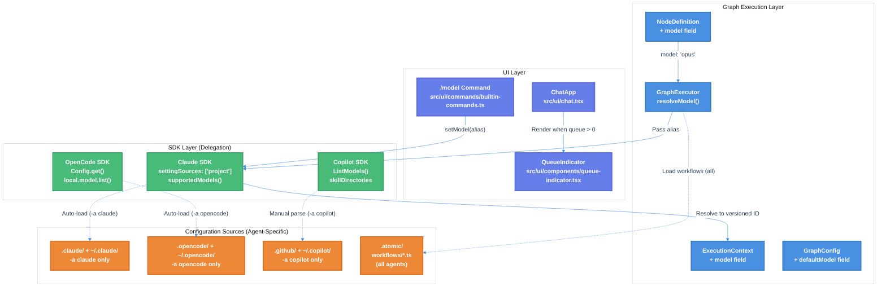

# Model Parameters, Workflow Nodes, and Message Queuing Technical Design Document

| Document Metadata      | Details     |
| ---------------------- | ----------- |
| Author(s)              | Alex Lavaee |
| Status                 | Draft (WIP) |
| Team / Owner           | Atomic CLI  |
| Created / Last Updated | 2026-02-03  |

## 1. Executive Summary

This RFC proposes six enhancements to the Atomic CLI with an **SDK-First architecture** that delegates to SDK abstractions wherever possible:

1. **Per-node model configuration** - Extend `NodeDefinition` with `model` field using `providerID/modelID` format from models.dev (e.g., `anthropic/claude-sonnet-4-5`). Claude aliases (`opus`, `sonnet`, `haiku`) resolve to models.dev IDs.
2. **Custom workflows** - Loaded from `.atomic/workflows/*.ts` files that export a factory function. This is the ONLY Atomic-specific config format.
3. **Agent-specific configuration loading** - **SDK-First**: Each agent type (`-a claude`, `-a opencode`, `-a copilot`) loads configs exclusively from its own directory. Claude SDK auto-loads via `settingSources: ['project']` from `.claude/`, OpenCode SDK auto-loads via `Config.get()` from `.opencode/`, Copilot requires manual parsing from `.github/`. **No cross-SDK config merging occurs.**
4. **`/model` command** - ALL SDKs use unified [models.dev](https://models.dev) for model discovery (not individual SDK methods). Models use `providerID/modelID` format. Claude aliases (`opus`, `sonnet`, `haiku`) resolve to models.dev IDs.
5. **Message queuing UI** - Infrastructure exists (`useMessageQueue` hook) but lacks UI integration. Implement Claude Code's "Boundary-aware Queuing" UX pattern.
6. **Permissions** - **None**: Atomic auto-approves all tool executions (no permission prompts). `AskUserQuestion` is HIL for gathering input, not a permission mechanism.

**Research Reference:** `research/docs/2026-02-03-model-params-workflow-nodes-message-queuing.md`

## 2. Context and Motivation

### 2.1 Current State

**Architecture:** The Atomic CLI provides a unified interface across three coding agent SDKs (Claude, OpenCode, Copilot) with a graph-based workflow execution engine.

**Current Model Configuration Flow:**
```
AgentNodeConfig.sessionConfig.model → SessionConfig.model → SDK client options
```

**Limitations:**
- **No per-node model override**: Model must be specified via `sessionConfig`, not at the node level
- **No `/model` command**: Users cannot switch models mid-session via slash command
- **Message queue UI missing**: `QueueIndicator` component exists but is not rendered
- **Manual config loading**: Custom loaders duplicate what SDKs can do automatically

**Current Graph Node Interface (`src/graph/types.ts:277-295`):**
```typescript
export interface NodeDefinition<TState extends BaseState = BaseState> {
  id: NodeId;
  type: NodeType;
  execute: NodeExecuteFn<TState>;
  retry?: RetryConfig;
  name?: string;
  description?: string;
  // NOTE: No model field exists currently
}
```

### 2.2 The Problem

- **User Impact:** Cannot select models inline, no visual feedback for queued messages, steep learning curve for workflow customization
- **Developer Impact:** Must manually configure models per session, cannot leverage SDK auto-loading
- **Technical Debt:** Duplicated config loading code that SDKs already handle

**Research Reference:** Section 1 (Model Parameter for Workflow Nodes), Section 5 (Message Queuing Implementation)

### 2.3 Agent-Specific Configuration Model

**IMPORTANT:** Atomic does NOT merge configs across different agent SDKs. Each agent type selected via the `-a` flag loads configs exclusively from its own directories:

| Agent Flag    | Config Directories                            | Priority       |
| ------------- | --------------------------------------------- | -------------- |
| `-a claude`   | `.claude/` (local), `~/.claude/` (global)     | Local > Global |
| `-a opencode` | `.opencode/` (local), `~/.opencode/` (global) | Local > Global |
| `-a copilot`  | `.github/` (local), `~/.copilot/` (global)    | Local > Global |

**Within an agent type**, when the same agent/skill/command name exists in both local and global directories, the **local project config takes priority**.

**Example:**
- If both `.claude/agents/my-agent.md` and `~/.claude/agents/my-agent.md` exist, the local version is used
- If only `~/.claude/agents/my-agent.md` exists, it's still registered and available
- Running `-a claude` will NEVER load agents from `.github/` or `.opencode/`

## 3. Goals and Non-Goals

### 3.1 Functional Goals

- [ ] Add `model` field to `NodeDefinition` interface using `providerID/modelID` format (e.g., `anthropic/claude-sonnet-4-5`)
- [ ] Add `model` field to `ExecutionContext` for runtime model resolution
- [ ] Add `defaultModel` field to `GraphConfig` for graph-wide defaults
- [ ] Implement models.dev integration for unified model discovery across ALL agent types
- [ ] Implement `/model` command with `list`, `refresh`, and model switching
- [ ] Render `QueueIndicator` component in `ChatApp` when messages are queued
- [ ] Add queue editing support (up-arrow navigation, placeholder change)
- [ ] Configure SDK `settingSources` for automatic config loading (agent-specific)
- [ ] Parse Copilot agents from `.github/agents/*.md` when `-a copilot` is used (SDK doesn't auto-load)

### 3.2 Non-Goals (Out of Scope)

- [ ] We will NOT create custom config formats - only `.atomic/workflows/` is Atomic-specific
- [ ] We will NOT merge configs across SDKs - `-a claude` only uses `.claude/`, `-a opencode` only uses `.opencode/`, `-a copilot` only uses `.github/`
- [ ] We will NOT implement permission prompts - all tool executions are auto-approved
- [ ] We will NOT unify hook systems across SDKs - each uses its native hook mechanism
- [ ] We will NOT merge MCP server configs - each SDK manages its own
- [ ] We will NOT implement fuzzy model matching - exact alias matching only

## 4. Proposed Solution (High-Level Design)

### 4.1 System Architecture Diagram



### 4.2 Architectural Pattern

We are adopting an **SDK-First Delegation Pattern** with **Agent-Specific Configuration**:

- **SDK-First:** Delegate configuration loading, model resolution, and permission handling to SDK abstractions wherever possible
- **Agent-Specific Configs:** Each agent type (`-a claude`, `-a opencode`, `-a copilot`) loads configs exclusively from its corresponding directory. No cross-SDK config merging or priority rules apply.
- **Minimal Custom Code:** Only implement what SDKs cannot handle (`.atomic/workflows/`, Copilot agent parsing for `-a copilot`)
- **Alias-Based Models:** Use SDK aliases (`opus`, `sonnet`, `haiku`) directly - SDKs resolve to versioned model IDs automatically

**Research Reference:** Section "SDK Abstraction Reference (Key Findings)" details what each SDK provides.

### 4.3 Key Components

| Component                  | Responsibility           | File Location                           | Justification                                         |
| -------------------------- | ------------------------ | --------------------------------------- | ----------------------------------------------------- |
| `NodeDefinition.model`     | Per-node model override  | `src/graph/types.ts`                    | Enables different models for different workflow steps |
| `ExecutionContext.model`   | Runtime model resolution | `src/graph/types.ts`                    | Provides model to executing nodes                     |
| `GraphConfig.defaultModel` | Graph-wide default model | `src/graph/types.ts`                    | Fallback when nodes don't specify model               |
| `/model` command           | Model selection/display  | `src/ui/commands/builtin-commands.ts`   | User-facing model control                             |
| `QueueIndicator`           | Visual queue feedback    | `src/ui/components/queue-indicator.tsx` | Claude Code UX parity                                 |
| `resolveModel()`           | Model inheritance logic  | `src/graph/compiled.ts`                 | Cascades: node → parent → default                     |

## 5. Detailed Design

### 5.1 API Interfaces

#### 5.1.1 Extended NodeDefinition Interface

**File:** `src/graph/types.ts`

**IMPORTANT:** Model specification is SDK-specific. The `model` field accepts different formats depending on which agent type (`-a`) is being used.

```typescript
/**
 * Model specification type - format depends on active agent type:
 * - Claude: 'opus' | 'sonnet' | 'haiku' | 'inherit' | full model ID
 * - OpenCode: 'providerID/modelID' format (e.g., 'anthropic/claude-sonnet-4-5')
 * - Copilot: Model ID (e.g., 'gpt-5', 'claude-sonnet-4.5')
 */
export type ModelSpec = string | 'inherit';

export interface NodeDefinition<TState extends BaseState = BaseState> {
  /** Unique identifier for the node */
  id: NodeId;
  /** Type of node (determines execution behavior) */
  type: NodeType;
  /** Function to execute when the node is visited */
  execute: NodeExecuteFn<TState>;
  /** Optional retry configuration for error handling */
  retry?: RetryConfig;
  /** Human-readable name for the node (used in logging/UI) */
  name?: string;
  /** Description of what the node does */
  description?: string;
  /**
   * Model to use for this node (format is SDK-specific)
   *
   * Claude (-a claude):
   *   - 'opus', 'sonnet', 'haiku': SDK aliases
   *   - 'inherit': Use parent context's model
   *   - Full ID: 'claude-sonnet-4-5-20250929'
   *
   * OpenCode (-a opencode):
   *   - 'anthropic/claude-sonnet-4-5': provider/model format
   *   - 'inherit': Use parent context's model
   *
   * Copilot (-a copilot):
   *   - 'gpt-5', 'claude-sonnet-4.5': Model IDs
   *   - 'inherit': Use session's model
   *   - NOTE: Model changes require new session
   */
  model?: ModelSpec;
}
```

#### 5.1.2 Extended ExecutionContext Interface

**File:** `src/graph/types.ts`

```typescript
export interface ExecutionContext<TState extends BaseState = BaseState> {
  /** Current workflow state */
  state: TState;
  /** Graph configuration */
  config: GraphConfig;
  /** Errors that have occurred during execution */
  errors: ExecutionError[];
  /** Signal to abort execution */
  abortSignal?: AbortSignal;
  /** Current context window usage from agent sessions */
  contextWindowUsage?: ContextWindowUsage;
  /** Emit a signal during execution */
  emit?: (signal: SignalData) => void;
  /** Get the output from a previously executed node */
  getNodeOutput?: (nodeId: NodeId) => unknown;
  /**
   * Resolved model for this execution context
   * - Set by GraphExecutor based on node.model, parent context, or defaultModel
   * - Passed to agent nodes for session creation
   */
  model?: string;
}
```

#### 5.1.3 Extended GraphConfig Interface

**File:** `src/graph/types.ts`

```typescript
export interface GraphConfig<TState extends BaseState = BaseState> {
  /** Checkpointer for saving and restoring execution state */
  checkpointer?: Checkpointer<TState>;
  /** Maximum number of nodes to execute concurrently (default: 1) */
  maxConcurrency?: number;
  /** Maximum execution time in milliseconds (default: no limit) */
  timeout?: number;
  /** Callback for progress events during execution */
  onProgress?: (event: ProgressEvent<TState>) => void;
  /** Context window usage threshold (0-100) that triggers a warning signal. Default: 60 */
  contextWindowThreshold?: number;
  /** Whether to automatically checkpoint after each node completion. Default: true */
  autoCheckpoint?: boolean;
  /** Custom metadata to include with checkpoints */
  metadata?: Record<string, unknown>;
  /**
   * Default model for the graph (providerID/modelID format)
   * - Used when nodes don't specify a model or use 'inherit'
   * - Format: 'anthropic/claude-sonnet-4-5', 'openai/gpt-4.1', etc.
   * - Claude aliases (opus, sonnet, haiku) also accepted
   */
  defaultModel?: ModelSpec;
}
```

#### 5.1.4 /model Command Interface (SDK-Specific)

**IMPORTANT:** The `/model` command behaves differently per agent type because each SDK has its own model naming conventions, discovery methods, and switching capabilities.

**File:** `src/ui/commands/builtin-commands.ts`

##### Unified Model Discovery via models.dev

**ALL agent SDKs in Atomic use [models.dev](https://models.dev) as the single source of truth for available models.** This unified approach (borrowed from OpenCode) provides:

- **Consistent model naming** - All agents use `providerID/modelID` format
- **Up-to-date metadata** - Capabilities, costs, limits, and status
- **Automatic caching** - Local file cache with periodic refresh (hourly)
- **Multi-provider support** - Anthropic, OpenAI, Google, Cohere, and more

**API Endpoint:** `https://models.dev/api.json`

**Model Format:** `providerID/modelID` (e.g., `anthropic/claude-sonnet-4-5`, `openai/gpt-4.1`)

##### How All SDKs Use models.dev

```
┌─────────────────────────────────────────────────────────────────┐
│                        models.dev API                           │
│                  https://models.dev/api.json                    │
└─────────────────────────────────────────────────────────────────┘
                              │
                              ▼
┌─────────────────────────────────────────────────────────────────┐
│                     Atomic ModelsDev Cache                       │
│              ~/.atomic/cache/models.json                         │
│         (refreshed hourly, or via /model refresh)                │
└─────────────────────────────────────────────────────────────────┘
                              │
          ┌───────────────────┼───────────────────┐
          ▼                   ▼                   ▼
    ┌───────────┐       ┌───────────┐       ┌───────────┐
    │ -a claude │       │-a opencode│       │ -a copilot│
    │           │       │           │       │           │
    │ Model     │       │ Model     │       │ Model     │
    │ Discovery │       │ Discovery │       │ Discovery │
    │ via       │       │ via       │       │ via       │
    │ ModelsDev │       │ ModelsDev │       │ ModelsDev │
    └───────────┘       └───────────┘       └───────────┘
```

**Important:** Individual SDK methods (`query.supportedModels()`, `client.ListModels()`) are NOT used. All model discovery goes through the unified models.dev cache.

##### SDK-Specific Model Switching Capabilities

While model discovery is unified, each SDK has different model switching capabilities:

| Agent         | Mid-Session Switching | Implementation                                 |
| ------------- | --------------------- | ---------------------------------------------- |
| `-a claude`   | Yes (streaming mode)  | `query.setModel(providerID/modelID)`           |
| `-a opencode` | Yes                   | `local.model.set({ providerID, modelID })`     |
| `-a copilot`  | No                    | Must create new session with `model` in config |

##### Claude-Specific Aliases (Convenience Layer)

For Claude users, Atomic provides shorthand aliases that resolve to models.dev IDs:

| Alias     | Resolves To | Description                                    |
| --------- | ----------- | ---------------------------------------------- |
| `sonnet`  | `sonnet`    | Claude Sonnet (SDK resolves to latest version) |
| `opus`    | `opus`      | Claude Opus (SDK resolves to latest version)   |
| `haiku`   | `haiku`     | Claude Haiku (SDK resolves to latest version)  |
| `default` | `sonnet`    | Account default                                |

**Note:** `opusplan` and `sonnet[1m]` are Claude SDK-specific modes, not models.dev IDs.

```typescript
/**
 * /model - Switch or display the current model.
 *
 * ALL agent types use models.dev for model discovery.
 * Model format: providerID/modelID (e.g., anthropic/claude-sonnet-4-5)
 *
 * Usage:
 *   /model                    - Show current model
 *   /model list               - List all available models (from models.dev)
 *   /model list anthropic     - List models from specific provider
 *   /model <provider/model>   - Switch to model
 *   /model sonnet             - Switch using alias (Claude only)
 *   /model refresh            - Force refresh models.dev cache
 */
export const modelCommand: CommandDefinition = {
  name: "model",
  description: "Switch or view the current model",
  category: "builtin",
  aliases: ["m"],
  execute: async (args: string, context: CommandContext): Promise<CommandResult> => {
    const { agentType, modelOps } = context;
    const trimmed = args.trim();

    // Show current model
    if (!trimmed) {
      const currentModel = await modelOps.getCurrentModel();
      return {
        success: true,
        message: `Current model: **${currentModel ?? "No model set"}**`,
      };
    }

    const lowerTrimmed = trimmed.toLowerCase();

    // Force refresh models.dev cache
    if (lowerTrimmed === "refresh") {
      await ModelsDev.refresh();
      return {
        success: true,
        message: "Models cache refreshed from models.dev",
      };
    }

    // List available models (unified via models.dev)
    if (lowerTrimmed === "list" || lowerTrimmed.startsWith("list ")) {
      const providerFilter = lowerTrimmed.startsWith("list ")
        ? trimmed.substring(5).trim()
        : undefined;

      const models = await modelOps.listAvailableModels();
      const filtered = providerFilter
        ? models.filter(m => m.providerID === providerFilter)
        : models;

      if (filtered.length === 0) {
        return {
          success: true,
          message: providerFilter
            ? `No models found for provider: **${providerFilter}**`
            : "No models available. Try `/model refresh`.",
        };
      }

      // Group by provider for display
      const grouped = groupByProvider(filtered);
      const lines = formatGroupedModels(grouped);

      return {
        success: true,
        message: `**Available Models** (via models.dev)\n\n${lines.join("\n")}`,
      };
    }

    // Switch model
    try {
      // Resolve alias if applicable (e.g., 'default' → 'sonnet')
      const resolvedModel = modelOps.resolveAlias(trimmed) ?? trimmed;
      const result = await modelOps.setModel(resolvedModel);

      // Copilot doesn't support mid-session switching
      if (result.requiresNewSession) {
        return {
          success: true,
          message: `Model **${resolvedModel}** will be used for the next session.\n` +
                   `(${agentType} doesn't support mid-session model switching)`,
          stateUpdate: { pendingModel: resolvedModel },
        };
      }

      return {
        success: true,
        message: `Model switched to **${resolvedModel}**`,
        stateUpdate: { model: resolvedModel },
      };
    } catch (error) {
      return {
        success: false,
        message: `Failed to switch model: ${error instanceof Error ? error.message : String(error)}`,
      };
    }
  },
};

/** Group models by provider for display */
function groupByProvider(models: ModelInfo[]): Map<string, ModelInfo[]> {
  const grouped = new Map<string, ModelInfo[]>();
  for (const model of models) {
    const existing = grouped.get(model.providerID) ?? [];
    existing.push(model);
    grouped.set(model.providerID, existing);
  }
  return grouped;
}

/** Format grouped models for display */
function formatGroupedModels(grouped: Map<string, ModelInfo[]>): string[] {
  const lines: string[] = [];
  for (const [provider, models] of grouped) {
    lines.push(`\n**${provider}**`);
    for (const m of models) {
      const status = m.status && m.status !== 'active' ? ` (${m.status})` : '';
      const ctx = m.limits.context ? ` [${Math.round(m.limits.context / 1000)}k ctx]` : '';
      lines.push(`  ${m.providerID}/${m.modelID} - ${m.name}${ctx}${status}`);
    }
  }
  return lines;
}
```

#### 5.1.5 Subagent/Task Spawning (SDK-Specific)

**IMPORTANT:** Each SDK handles subagent spawning differently. This affects how workflow nodes that spawn subtasks should be configured.

##### Comparison Table

| Feature               | Claude (`-a claude`)                                | OpenCode (`-a opencode`) | Copilot (`-a copilot`)      |
| --------------------- | --------------------------------------------------- | ------------------------ | --------------------------- |
| **Spawn Mechanism**   | Task tool with `AgentDefinition`                    | `agent` tool with prompt | `customAgents` in session   |
| **Definition Format** | Markdown + YAML frontmatter                         | JSON in `opencode.json`  | `CustomAgentConfig` objects |
| **Model Override**    | `model: 'opus' \| 'sonnet' \| 'haiku' \| 'inherit'` | Provider-based defaults  | Not configurable per-agent  |
| **Tool Restrictions** | `tools` / `disallowedTools` fields                  | Fixed `TaskAgentTools()` | `tools` array               |
| **Context Isolation** | Yes (fresh context)                                 | Yes (separate session)   | Yes (separate session)      |

##### Claude Agent SDK - Subagent Definition

```typescript
// AgentDefinition for Claude subagents
type AgentDefinition = {
  description: string;           // When to delegate to this agent
  tools?: string[];              // Allowed tools (inherits all if omitted)
  prompt: string;                // System prompt
  model?: 'sonnet' | 'opus' | 'haiku' | 'inherit';  // Model override
}

// Example: spawn via Task tool
const agentDef: AgentDefinition = {
  description: 'Expert code reviewer',
  prompt: 'You are a security-focused code reviewer...',
  tools: ['Read', 'Grep', 'Glob'],
  model: 'opus'  // Override: this subagent uses Opus
};
```

**Claude Subagent Model Inheritance:**
- If `model` is **omitted**: uses parent conversation's model
- If `model` is `'inherit'`: explicitly inherits parent model
- If `model` is `'sonnet'`, `'opus'`, or `'haiku'`: overrides with that model

##### OpenCode SDK - Agent Tool

```typescript
// OpenCode agent tool accepts a prompt parameter
// Model is configured in opencode.json, not per-invocation
const agentToolParams = {
  prompt: "The task for the agent to perform"
};

// opencode.json configuration
{
  "agents": {
    "task": {
      "model": "anthropic/claude-sonnet-4-5",
      "maxTokens": 5000
    }
  }
}
```

**OpenCode Default Model Selection** (based on available API keys):
1. Copilot credentials → GPT-4o
2. Anthropic API key → Claude Sonnet
3. OpenAI API key → GPT-4.1 Mini
4. Google Gemini API key → Gemini 2.5 Flash

##### Copilot SDK - Custom Agents

```typescript
// CustomAgentConfig for Copilot
interface CustomAgentConfig {
  name: string;           // Unique identifier
  displayName?: string;   // UI display name
  description?: string;   // What the agent does
  tools?: string[];       // Tool names (null = all tools)
  prompt: string;         // Instructions/persona
  mcpServers?: object;    // MCP server configs
  infer?: boolean;        // Available for model inference
}

// Defined at session creation, NOT per-task
const session = await client.createSession({
  customAgents: [{
    name: "pr-reviewer",
    displayName: "PR Reviewer",
    description: "Reviews pull requests for best practices",
    prompt: "You are an expert code reviewer...",
    tools: ["read_file", "search_code"]
    // NOTE: No model field - uses session's model
  }]
});
```

**Copilot Subagent Limitation:** Custom agents use the session's model - no per-agent model override.

### 5.2 Data Model / Schema

#### 5.2.1 Model Resolution Function

**File:** `src/graph/compiled.ts`

```typescript
/**
 * Resolve the model for a node execution context.
 *
 * Resolution order:
 * 1. Node's explicit model (if not 'inherit')
 * 2. Parent context's model (if available)
 * 3. Graph config's defaultModel
 * 4. undefined (SDK uses its own default)
 */
function resolveModel(
  node: NodeDefinition,
  parentContext: ExecutionContext | undefined,
  config: GraphConfig
): string | undefined {
  // Node has explicit model that isn't 'inherit'
  if (node.model && node.model !== 'inherit') {
    return node.model;
  }

  // Inherit from parent context
  if (parentContext?.model) {
    return parentContext.model;
  }

  // Fall back to graph default
  if (config.defaultModel) {
    return config.defaultModel;
  }

  // Let SDK use its default
  return undefined;
}
```

#### 5.2.2 Extended useMessageQueue Hook

**File:** `src/ui/hooks/use-message-queue.ts`

```typescript
export interface UseMessageQueueReturn {
  queue: QueuedMessage[];
  enqueue: (content: string) => void;
  dequeue: () => QueuedMessage | undefined;
  clear: () => void;
  count: number;
  /** New: Update message at index */
  updateAt: (index: number, content: string) => void;
  /** New: Move message up in queue */
  moveUp: (index: number) => void;
  /** New: Move message down in queue */
  moveDown: (index: number) => void;
  /** New: Current edit index for navigation */
  currentEditIndex: number;
  /** New: Set edit index */
  setEditIndex: (index: number) => void;
}
```

### 5.3 Algorithms and State Management

#### 5.3.1 Model Resolution Flow

```
GraphExecutor.executeWithRetry()
    │
    ├── Get node.model field
    │
    ├── If model === 'inherit' or undefined:
    │   └── Check parentContext.model
    │       └── If undefined: use config.defaultModel
    │
    ├── Pass resolved model to ExecutionContext
    │
    └── For agent nodes:
        └── context.model → SessionConfig.model → SDK options
            └── SDK resolves alias to versioned model ID
```

#### 5.3.2 Message Queue State Machine

```
                    ┌──────────────┐
                    │    EMPTY     │
                    │  count = 0   │
                    └──────┬───────┘
                           │ enqueue()
                           ▼
              ┌────────────────────────┐
              │       HAS_MESSAGES     │
              │       count > 0        │
              │  Render QueueIndicator │
              └────────────┬───────────┘
                          ╱ ╲
           up-arrow      ╱   ╲ stream completes
           pressed      ╱     ╲
                       ▼       ▼
         ┌─────────────────┐  ┌─────────────────┐
         │   EDITING       │  │   PROCESSING    │
         │ currentEditIndex│  │   dequeue()     │
         │ Show editor     │  │   sendMessage() │
         └────────┬────────┘  └────────┬────────┘
                  │                    │
                  │ Esc or Enter       │ repeat until empty
                  ▼                    ▼
              ┌────────────────────────┐
              │       HAS_MESSAGES     │
              └────────────────────────┘
```

## 6. Alternatives Considered

| Option                    | Pros                        | Cons                                             | Reason for Rejection                                                         |
| ------------------------- | --------------------------- | ------------------------------------------------ | ---------------------------------------------------------------------------- |
| **Manual model mappings** | Full control over model IDs | Requires code changes for new models             | SDK handles resolution automatically; auto-model updates are critical        |
| **Custom config format**  | Unified Atomic experience   | Duplicate existing formats, migration burden     | SDKs already parse their config formats; only `.atomic/workflows/` is unique |
| **Unified hook system**   | Consistent hook behavior    | Complex to unify, SDK hooks differ significantly | Each SDK's native hooks work best; unification adds complexity without value |
| **Permission prompts**    | More secure default         | Interrupts workflow, poor UX for agentic coding  | Atomic targets automated workflows where permission prompts break flow       |

## 7. Cross-Cutting Concerns

### 7.1 Security and Privacy

- **Permissions:** All tool executions are auto-approved. `AskUserQuestion` is HIL for gathering input, NOT a permission mechanism.
- **SDK Configuration:**
  - Claude: `permissionMode: 'bypassPermissions'`
  - OpenCode: `permission: { "*": "allow" }`
  - Copilot: `OnPermissionRequest: () => ({ kind: 'approved' })`
- **Model Selection:** No validation of model names - SDK rejects invalid aliases with clear error messages.

### 7.2 Observability Strategy

- **Model Resolution Logging:** Log resolved model at debug level in `GraphExecutor.executeWithRetry()`
- **Queue Metrics:** Track `queue_count`, `queue_processing_delay_ms` for debugging
- **SDK Discovery Logging:** Log available models from SDK discovery calls

### 7.3 Scalability and Capacity Planning

- **Queue Size:** No hard limit on queue size; natural limit from user typing speed
- **Config Loading:** SDK loading is async; block on startup with timeout
- **Model Switching:** SDK may require new session for model switch; handle gracefully

## 8. Migration, Rollout, and Testing

### 8.1 Deployment Strategy

- [ ] Phase 1: Add model fields to types (non-breaking, optional fields)
- [ ] Phase 2: Implement `/model` command with SDK discovery
- [ ] Phase 3: Render `QueueIndicator` and implement queue editing
- [ ] Phase 4: Configure SDK `settingSources` for agent-specific auto-loading (local + global)
- [ ] Phase 5: Implement Copilot agent parsing for `-a copilot` (manual, SDK doesn't auto-load)

### 8.2 Data Migration Plan

- **No data migration required:** All changes are additive to existing interfaces
- **Backward compatibility:** Nodes without `model` field behave as before (SDK default)

### 8.3 Test Plan

- **Unit Tests:**
  - [ ] `resolveModel()` function with various inheritance scenarios
  - [ ] `/model` command with valid aliases, invalid names, list subcommand
  - [ ] `useMessageQueue` new methods: `updateAt`, `moveUp`, `moveDown`

- **Integration Tests:**
  - [ ] Graph execution with per-node model configuration
  - [ ] SDK discovery integration for `/model list`
  - [ ] Queue indicator rendering during streaming

- **End-to-End Tests:**
    Environment:
    The test involves creating a snake game from scratch in Rust, using a CLI. The app must be a fully working prototype and built in a `/tmp/snake_game/<agent>` directory to prevent overwriting files in the current project. Here are some guidelines:

    1. Run `bun run src/cli.ts chat -a <agent>` (you will need an abs path when testing the `/tmp` snake project) where agent is either opencode, copilot, or claude
    2. All interactions must be executed using the `tmux-cli` tool you have (reference the tmux-cli skill for details).
    3. All built-in commands, ask_question tool, session history scrolling, tool calls, MCP tool calls, and message queuing MUST be tested explicity in the use-case.
    4. Ensure full parity with the `opencode`, `claude`, and `copilot` SDKs (<agent>)
    5. Make sure all agent subcommands are similarly exposed to the user. Avoid custom logic per agent and standardize practices and modular code.

## 9. Open Questions / Unresolved Issues

- [ ] **Model inheritance semantics:** When a node specifies `model: 'inherit'`, should it inherit from the parent node, graph default, or current session? **Recommendation:** Follow Claude SDK subagent behavior - inherit from parent conversation.

- [ ] **Runtime model switching:** The `/model` command may require a new session if SDK doesn't support mid-session switching. **Recommendation:** Attempt SDK switch, fallback to new session if not supported.

- [ ] **Queue editing UX:** How should queue editing work when user presses up-arrow? **Recommendation:** Follow Claude Code pattern - move to input box for editing.

- [x] ~~**Cross-SDK agent priority:**~~ **RESOLVED:** No cross-SDK priority applies. Each agent type (`-a claude`, `-a opencode`, `-a copilot`) uses its own config directory exclusively. Within an agent type, local project configs take priority over global user configs (e.g., `.claude/` > `~/.claude/`).

---

## 10. Detailed Implementation Plan

### 10.1 Per-Node Model Configuration

#### Files to Modify

| File                            | Changes                                                    |
| ------------------------------- | ---------------------------------------------------------- |
| `src/graph/types.ts:277-295`    | Add `model?: ModelAlias \| string` to `NodeDefinition`     |
| `src/graph/types.ts:231-259`    | Add `model?: string` to `ExecutionContext`                 |
| `src/graph/types.ts:322-362`    | Add `defaultModel?: ModelAlias \| string` to `GraphConfig` |
| `src/graph/compiled.ts:519-531` | Implement `resolveModel()` and pass to context             |
| `src/graph/nodes.ts:196-200`    | Use `context.model` for session configuration              |

#### Implementation Details

**1. Add SDK-agnostic model type:**
```typescript
// src/graph/types.ts - Add after line 64

/**
 * Model specification - format depends on active agent type:
 * - Claude: 'opus' | 'sonnet' | 'haiku' | 'inherit' | full model ID
 * - OpenCode: 'providerID/modelID' format
 * - Copilot: Model ID (note: changes require new session)
 */
export type ModelSpec = string | 'inherit';
```

**2. Extend NodeDefinition:**
```typescript
// src/graph/types.ts:277-295 - Add model field
export interface NodeDefinition<TState extends BaseState = BaseState> {
  id: NodeId;
  type: NodeType;
  execute: NodeExecuteFn<TState>;
  retry?: RetryConfig;
  name?: string;
  description?: string;
  /** Model override for this node (format is SDK-specific, see ModelSpec) */
  model?: ModelSpec;
}
```

**3. Extend ExecutionContext:**
```typescript
// src/graph/types.ts:231-259 - Add model field
export interface ExecutionContext<TState extends BaseState = BaseState> {
  state: TState;
  config: GraphConfig;
  errors: ExecutionError[];
  abortSignal?: AbortSignal;
  contextWindowUsage?: ContextWindowUsage;
  emit?: (signal: SignalData) => void;
  getNodeOutput?: (nodeId: NodeId) => unknown;
  /** Resolved model for this execution context */
  model?: string;
}
```

**4. Extend GraphConfig:**
```typescript
// src/graph/types.ts:322-362 - Add defaultModel field
export interface GraphConfig<TState extends BaseState = BaseState> {
  checkpointer?: Checkpointer<TState>;
  maxConcurrency?: number;
  timeout?: number;
  onProgress?: (event: ProgressEvent<TState>) => void;
  contextWindowThreshold?: number;
  autoCheckpoint?: boolean;
  metadata?: Record<string, unknown>;
  /** Default model for the graph (format is SDK-specific, see ModelSpec) */
  defaultModel?: ModelSpec;
}
```

**5. Implement resolveModel in GraphExecutor:**
```typescript
// src/graph/compiled.ts - Add before executeWithRetry

/**
 * Resolve model for a node: node.model > parentContext.model > config.defaultModel
 */
private resolveModel(
  node: NodeDefinition<TState>,
  parentContext?: ExecutionContext<TState>
): string | undefined {
  if (node.model && node.model !== 'inherit') {
    return node.model;
  }
  if (parentContext?.model) {
    return parentContext.model;
  }
  if (this.config.defaultModel && this.config.defaultModel !== 'inherit') {
    return this.config.defaultModel;
  }
  return undefined;
}
```

**6. Update context construction:**
```typescript
// src/graph/compiled.ts:519-531 - Add model to context
const context: ExecutionContext<TState> = {
  state,
  config: this.config as unknown as GraphConfig,
  errors,
  abortSignal,
  model: this.resolveModel(node, parentContext),  // NEW
  emit: (_signal) => {},
  getNodeOutput: (nodeId) => state.outputs[nodeId],
};
```

**7. Use context.model in agent nodes:**
```typescript
// src/graph/nodes.ts:196-200 - Use context.model for session
const fullSessionConfig: SessionConfig = {
  ...sessionConfig,
  model: context.model ?? sessionConfig?.model,  // Context model takes precedence
  systemPrompt: systemPrompt ?? sessionConfig?.systemPrompt,
  tools: tools ?? sessionConfig?.tools,
};
```

---

### 10.2 /model Command Implementation (Unified via models.dev)

**Atomic uses models.dev as the unified source for model discovery**, following the same pattern as OpenCode. This provides consistent model metadata (capabilities, costs, limits) across all agent types.

#### Files to Create/Modify

| File                                  | Changes                                                |
| ------------------------------------- | ------------------------------------------------------ |
| `src/models/models-dev.ts`            | NEW: models.dev integration (same pattern as OpenCode) |
| `src/models/model-transform.ts`       | NEW: fromModelsDevModel/Provider transformations       |
| `src/models/model-operations.ts`      | NEW: Unified model operations interface                |
| `src/models/models-snapshot.ts`       | NEW: Bundled snapshot (generated at build time)        |
| `src/util/lazy.ts`                    | NEW: Lazy initialization utility                       |
| `src/ui/commands/builtin-commands.ts` | Add `modelCommand` definition                          |
| `src/ui/commands/registry.ts:50-72`   | Extend `CommandContext` with model operations          |

#### Implementation Details

**1. Create models.dev integration (exact OpenCode pattern from `packages/opencode/src/provider/models.ts`):**

```typescript
// src/models/models-dev.ts - NEW FILE
// Based on OpenCode's implementation: packages/opencode/src/provider/models.ts

import * as fs from 'fs/promises';
import * as path from 'path';
import { z } from 'zod';
import { lazy } from '../util/lazy';  // Same lazy() pattern as OpenCode

/** Cache file path (similar to OpenCode's Global.Path.cache) */
const CACHE_PATH = process.env.ATOMIC_MODELS_PATH ??
  path.join(process.env.HOME || '', '.atomic', 'cache', 'models.json');

/** Refresh interval: 60 minutes (same as OpenCode) */
const REFRESH_INTERVAL = 60 * 1000 * 60;

export namespace ModelsDev {
  /**
   * Model schema from models.dev (exact copy from OpenCode)
   * Source: packages/opencode/src/provider/models.ts:17-69
   */
  export const Model = z.object({
    id: z.string(),
    name: z.string(),
    family: z.string().optional(),
    release_date: z.string(),
    attachment: z.boolean(),
    reasoning: z.boolean(),
    temperature: z.boolean(),
    tool_call: z.boolean(),
    interleaved: z
      .union([
        z.literal(true),
        z.object({
          field: z.enum(["reasoning_content", "reasoning_details"]),
        }).strict(),
      ])
      .optional(),
    cost: z
      .object({
        input: z.number(),
        output: z.number(),
        cache_read: z.number().optional(),
        cache_write: z.number().optional(),
        context_over_200k: z
          .object({
            input: z.number(),
            output: z.number(),
            cache_read: z.number().optional(),
            cache_write: z.number().optional(),
          })
          .optional(),
      })
      .optional(),
    limit: z.object({
      context: z.number(),
      input: z.number().optional(),
      output: z.number(),
    }),
    modalities: z
      .object({
        input: z.array(z.enum(["text", "audio", "image", "video", "pdf"])),
        output: z.array(z.enum(["text", "audio", "image", "video", "pdf"])),
      })
      .optional(),
    experimental: z.boolean().optional(),
    status: z.enum(["alpha", "beta", "deprecated"]).optional(),
    options: z.record(z.string(), z.any()),
    headers: z.record(z.string(), z.string()).optional(),
    provider: z.object({ npm: z.string() }).optional(),
    variants: z.record(z.string(), z.record(z.string(), z.any())).optional(),
  });
  export type Model = z.infer<typeof Model>;

  /**
   * Provider schema from models.dev (exact copy from OpenCode)
   * Source: packages/opencode/src/provider/models.ts:72-79
   */
  export const Provider = z.object({
    api: z.string().optional(),
    name: z.string(),
    env: z.array(z.string()),
    id: z.string(),
    npm: z.string().optional(),
    models: z.record(z.string(), Model),
  });
  export type Provider = z.infer<typeof Provider>;

  /** Full models.dev response */
  export type Database = Record<string, Provider>;

  /**
   * URL function with env override (same pattern as OpenCode)
   * OpenCode uses OPENCODE_MODELS_URL, we use ATOMIC_MODELS_URL
   */
  export function url(): string {
    return process.env.ATOMIC_MODELS_URL ?? "https://models.dev";
  }

  /**
   * Lazy-loaded data function (same pattern as OpenCode)
   * Source: packages/opencode/src/provider/models.ts:87-99
   *
   * Load order:
   * 1. File cache (CACHE_PATH)
   * 2. Bundled snapshot (models-snapshot.ts)
   * 3. Fetch from models.dev API (if not disabled)
   */
  export const Data = lazy(async () => {
    // 1. Try file cache first
    const cachePath = process.env.ATOMIC_MODELS_PATH ?? CACHE_PATH;
    try {
      const cached = await fs.readFile(cachePath, 'utf-8');
      if (cached) return JSON.parse(cached) as Database;
    } catch { /* cache miss */ }

    // 2. Try bundled snapshot
    try {
      const snapshot = await import('./models-snapshot');
      if (Object.keys(snapshot.default).length > 0) {
        return snapshot.default as Database;
      }
    } catch { /* no snapshot */ }

    // 3. Fetch from API (unless disabled)
    if (!process.env.ATOMIC_DISABLE_MODELS_FETCH) {
      return fetchFromApi();
    }

    return {} as Database;
  });

  /** Get models data (from lazy loader) */
  export async function get(): Promise<Database> {
    return Data();
  }

  /**
   * Fetch from models.dev API
   * Source: packages/opencode/src/provider/models.ts:106-120
   */
  async function fetchFromApi(): Promise<Database> {
    const response = await fetch(`${url()}/api.json`, {
      headers: {
        "User-Agent": "atomic-cli",  // OpenCode uses "opencode"
      },
      signal: AbortSignal.timeout(10000),  // 10 second timeout (same as OpenCode)
    });

    if (!response.ok) {
      throw new Error(`Failed to fetch models: ${response.status}`);
    }

    return response.json() as Promise<Database>;
  }

  /**
   * Force refresh from models.dev and update cache
   * Source: packages/opencode/src/provider/models.ts:106-120
   */
  export async function refresh(): Promise<void> {
    const data = await fetchFromApi();

    // Write to cache file
    const cachePath = process.env.ATOMIC_MODELS_PATH ?? CACHE_PATH;
    await fs.mkdir(path.dirname(cachePath), { recursive: true });
    await fs.writeFile(cachePath, JSON.stringify(data, null, 2));

    // Reset lazy loader to pick up new data
    Data.reset();
  }

  /** List all models in providerID/modelID format */
  export async function listModels(): Promise<Array<{ providerID: string; model: Model & { id: string } }>> {
    const data = await get();
    const result: Array<{ providerID: string; model: Model & { id: string } }> = [];

    for (const [providerID, provider] of Object.entries(data)) {
      for (const [modelID, model] of Object.entries(provider.models)) {
        result.push({ providerID, model: { ...model, id: modelID } });
      }
    }

    return result;
  }

  /** Get a specific model by providerID/modelID */
  export async function getModel(providerID: string, modelID: string): Promise<Model | undefined> {
    const data = await get();
    return data[providerID]?.models[modelID];
  }

  /** Get provider info */
  export async function getProvider(providerID: string): Promise<Provider | undefined> {
    const data = await get();
    return data[providerID];
  }
}

/**
 * Start periodic refresh (same interval as OpenCode: 60 minutes)
 * Source: packages/opencode/src/provider/models.ts:126-132
 */
export function startModelsDevRefresh(): void {
  // Initial refresh
  ModelsDev.refresh().catch(() => {});

  // Periodic refresh every 60 minutes
  setInterval(() => {
    ModelsDev.refresh().catch(() => {});
  }, REFRESH_INTERVAL);
}
```

**2. Create lazy() utility (same as OpenCode):**
```typescript
// src/util/lazy.ts - NEW FILE

/**
 * Lazy initialization utility (same pattern as OpenCode)
 * Creates a function that computes its value once and caches it.
 * Includes reset() to force recomputation.
 */
export function lazy<T>(fn: () => T): (() => T) & { reset: () => void } {
  let cached: T | undefined;
  let computed = false;

  const result = () => {
    if (!computed) {
      cached = fn();
      computed = true;
    }
    return cached!;
  };

  result.reset = () => {
    cached = undefined;
    computed = false;
  };

  return result;
}
```

**2. Create model transformation (same pattern as OpenCode's `fromModelsDevModel`):**
```typescript
// src/models/model-transform.ts - NEW FILE
// Based on OpenCode: packages/opencode/src/provider/provider.ts:601-677

import { ModelsDev } from './models-dev';

/**
 * Internal model representation (similar to OpenCode's Provider.Model)
 */
export interface Model {
  id: string;              // Full ID: providerID/modelID
  providerID: string;
  modelID: string;
  name: string;
  family?: string;
  api?: string;
  status: 'alpha' | 'beta' | 'deprecated' | 'active';
  capabilities: {
    reasoning: boolean;
    attachment: boolean;  // vision/files
    temperature: boolean;
    toolCall: boolean;
  };
  limits: {
    context: number;
    input?: number;
    output: number;
  };
  cost?: {
    input: number;
    output: number;
    cacheRead?: number;
    cacheWrite?: number;
  };
  modalities?: {
    input: string[];
    output: string[];
  };
  options: Record<string, unknown>;
  headers?: Record<string, string>;
}

/**
 * Transform ModelsDev.Model to internal Model format
 * Based on OpenCode's fromModelsDevModel: packages/opencode/src/provider/provider.ts:601-666
 */
export function fromModelsDevModel(
  providerID: string,
  modelID: string,
  model: ModelsDev.Model,
  providerApi?: string
): Model {
  return {
    id: `${providerID}/${modelID}`,
    providerID,
    modelID,
    name: model.name,
    family: model.family,
    api: providerApi,
    status: model.status ?? 'active',
    capabilities: {
      reasoning: model.reasoning,
      attachment: model.attachment,
      temperature: model.temperature,
      toolCall: model.tool_call,
    },
    limits: {
      context: model.limit.context,
      input: model.limit.input,
      output: model.limit.output,
    },
    cost: model.cost ? {
      input: model.cost.input,
      output: model.cost.output,
      cacheRead: model.cost.cache_read,
      cacheWrite: model.cost.cache_write,
    } : undefined,
    modalities: model.modalities,
    options: model.options,
    headers: model.headers,
  };
}

/**
 * Transform ModelsDev.Provider to list of Models
 * Based on OpenCode's fromModelsDevProvider: packages/opencode/src/provider/provider.ts:668-677
 */
export function fromModelsDevProvider(
  providerID: string,
  provider: ModelsDev.Provider
): Model[] {
  return Object.entries(provider.models).map(([modelID, model]) =>
    fromModelsDevModel(providerID, modelID, model, provider.api)
  );
}
```

**3. Create unified model operations:**
```typescript
// src/models/model-operations.ts - NEW FILE

import { ModelsDev } from './models-dev';
import { Model, fromModelsDevModel } from './model-transform';

export type AgentType = 'claude' | 'opencode' | 'copilot';

export interface SetModelResult {
  success: boolean;
  requiresNewSession?: boolean;
}

export interface ModelOperations {
  listAvailableModels(): Promise<Model[]>;
  setModel(model: string): Promise<SetModelResult>;
  getCurrentModel(): Promise<string | undefined>;
  resolveAlias(alias: string): string | undefined;
}

/** Claude-specific aliases - passed through to SDK which resolves to latest versions */
const CLAUDE_ALIASES: Record<string, string> = {
  'sonnet': 'sonnet',   // SDK resolves to latest Sonnet
  'opus': 'opus',       // SDK resolves to latest Opus
  'haiku': 'haiku',     // SDK resolves to latest Haiku
  'default': 'sonnet',  // Account default
};

/**
 * Unified model operations using models.dev as the source.
 * All agent types use the same discovery mechanism.
 */
export class UnifiedModelOperations implements ModelOperations {
  private currentModel?: string;
  private pendingModel?: string;

  constructor(
    private agentType: AgentType,
    private sdkSetModel?: (model: string) => Promise<void>
  ) {}

  async listAvailableModels(): Promise<Model[]> {
    const data = await ModelsDev.get();
    const models: Model[] = [];

    for (const [providerID, provider] of Object.entries(data)) {
      for (const [modelID, model] of Object.entries(provider.models)) {
        models.push(fromModelsDevModel(providerID, modelID, model, provider.api));
      }
    }

    return models;
  }

  async setModel(model: string): Promise<SetModelResult> {
    // Resolve Claude aliases
    const resolvedModel = this.resolveAlias(model) ?? model;

    // Copilot doesn't support mid-session switching
    if (this.agentType === 'copilot') {
      this.pendingModel = resolvedModel;
      return { success: true, requiresNewSession: true };
    }

    // Attempt SDK-level model switch
    if (this.sdkSetModel) {
      await this.sdkSetModel(resolvedModel);
    }

    this.currentModel = resolvedModel;
    return { success: true };
  }

  async getCurrentModel(): Promise<string | undefined> {
    return this.currentModel;
  }

  resolveAlias(alias: string): string | undefined {
    if (this.agentType === 'claude') {
      return CLAUDE_ALIASES[alias.toLowerCase()];
    }
    return undefined;
  }

  getPendingModel(): string | undefined {
    return this.pendingModel;
  }
}
```

**3. Extend CommandContext:**
```typescript
// src/ui/commands/registry.ts:50-72 - Add modelOps and agentType fields
export interface CommandContext {
  session: Session;
  state: WorkflowChatState;
  addMessage: (msg: ChatMessage) => void;
  setStreaming: (streaming: boolean) => void;
  sendMessage?: (content: string) => void;
  spawnSubagent?: (config: SubagentConfig) => void;
  /** Current agent type (-a flag) */
  agentType: AgentType;
  /** Unified model operations (via models.dev) */
  modelOps: ModelOperations;
}
```

**4. The model command implementation** is shown in Section 5.1.4 above.

**3. Register in builtinCommands array:**
```typescript
// src/ui/commands/builtin-commands.ts:260-265
export const builtinCommands: CommandDefinition[] = [
  helpCommand,
  themeCommand,
  clearCommand,
  compactCommand,
  modelCommand,  // Add here
];
```

---

### 10.3 Message Queue UI Implementation

#### Files to Modify

| File                                    | Changes                                                  |
| --------------------------------------- | -------------------------------------------------------- |
| `src/ui/hooks/use-message-queue.ts`     | Add `updateAt`, `moveUp`, `moveDown`, `currentEditIndex` |
| `src/ui/components/queue-indicator.tsx` | Add editing support, `❯` prefix style                    |
| `src/ui/chat.tsx`                       | Render `QueueIndicator`, handle up-arrow editing         |

#### Implementation Details

**1. Extend useMessageQueue hook:**
```typescript
// src/ui/hooks/use-message-queue.ts - Add new methods

export function useMessageQueue(): UseMessageQueueReturn {
  const [queue, setQueue] = useState<QueuedMessage[]>([]);
  const [currentEditIndex, setCurrentEditIndex] = useState<number>(-1);

  // ... existing enqueue, dequeue, clear ...

  const updateAt = useCallback((index: number, content: string) => {
    setQueue(prev => {
      if (index < 0 || index >= prev.length) return prev;
      const updated = [...prev];
      updated[index] = { ...updated[index], content };
      return updated;
    });
  }, []);

  const moveUp = useCallback((index: number) => {
    setQueue(prev => {
      if (index <= 0 || index >= prev.length) return prev;
      const updated = [...prev];
      [updated[index - 1], updated[index]] = [updated[index], updated[index - 1]];
      return updated;
    });
    setCurrentEditIndex(prev => prev > 0 ? prev - 1 : prev);
  }, []);

  const moveDown = useCallback((index: number) => {
    setQueue(prev => {
      if (index < 0 || index >= prev.length - 1) return prev;
      const updated = [...prev];
      [updated[index], updated[index + 1]] = [updated[index + 1], updated[index]];
      return updated;
    });
    setCurrentEditIndex(prev => prev < queue.length - 1 ? prev + 1 : prev);
  }, [queue.length]);

  const setEditIndex = useCallback((index: number) => {
    setCurrentEditIndex(index);
  }, []);

  return {
    queue,
    enqueue,
    dequeue,
    clear,
    count: queue.length,
    updateAt,
    moveUp,
    moveDown,
    currentEditIndex,
    setEditIndex,
  };
}
```

**2. Update QueueIndicator component:**
```typescript
// src/ui/components/queue-indicator.tsx - Add editing support

export interface QueueIndicatorProps {
  count: number;
  queue?: QueuedMessage[];
  compact?: boolean;
  /** Enable editing mode */
  editable?: boolean;
  /** Current edit index (-1 for none) */
  editIndex?: number;
  /** Callback when user selects a message to edit */
  onEdit?: (index: number) => void;
}

export function QueueIndicator({
  count,
  queue = [],
  compact = true,
  editable = false,
  editIndex = -1,
  onEdit,
}: QueueIndicatorProps) {
  const { theme } = useTheme();

  if (count === 0) return null;

  const renderMessage = (msg: QueuedMessage, index: number) => {
    const isEditing = editable && editIndex === index;
    const prefix = isEditing ? "› " : "❯ ";
    const style = isEditing
      ? { color: theme.colors.accent, fontWeight: 'bold' as const }
      : { color: theme.colors.muted };

    return (
      <Box key={msg.id} onClick={() => onEdit?.(index)}>
        <Text style={style}>
          {prefix}{truncateContent(msg.content, 40)}
        </Text>
      </Box>
    );
  };

  // ... rest of rendering logic
}
```

**3. Render QueueIndicator in ChatApp:**
```typescript
// src/ui/chat.tsx - Add to render section (after message list, before input)

{/* Message queue indicator */}
{messageQueue.count > 0 && (
  <QueueIndicator
    count={messageQueue.count}
    queue={messageQueue.queue}
    compact={!isEditingQueue}
    editable={!isStreaming}
    editIndex={messageQueue.currentEditIndex}
    onEdit={(index) => {
      messageQueue.setEditIndex(index);
      setIsEditingQueue(true);
    }}
  />
)}
```

**4. Handle up-arrow for queue editing:**
```typescript
// src/ui/chat.tsx - Add to keyboard handler (lines 1361-1569)

// Up arrow when queue has messages and not streaming
if (key.upArrow && messageQueue.count > 0 && !isStreaming) {
  e.preventDefault();
  if (messageQueue.currentEditIndex === -1) {
    // Enter edit mode at last message
    messageQueue.setEditIndex(messageQueue.count - 1);
    setIsEditingQueue(true);
  } else if (messageQueue.currentEditIndex > 0) {
    // Move to previous message
    messageQueue.setEditIndex(messageQueue.currentEditIndex - 1);
  }
  return;
}
```

**5. Update placeholder when queue has messages:**
```typescript
// src/ui/chat.tsx - Update placeholder logic

const placeholder = useMemo(() => {
  if (messageQueue.count > 0) {
    return "Press ↑ to edit queued messages...";
  }
  if (isStreaming) {
    return "Type to queue message...";
  }
  return "Enter a message...";
}, [messageQueue.count, isStreaming]);
```

---

### 10.4 SDK Configuration Loading (Agent-Specific)

**Key Principle:** Each agent type loads configs exclusively from its own directories. No cross-SDK config merging occurs. Within an agent type, **local project configs take priority over global user configs** when the same agent/skill/command name exists in both.

#### Configuration Directory Mapping

| Agent Flag    | Local Config Dir | Global Config Dir                       | SDK Loading Method                   |
| ------------- | ---------------- | --------------------------------------- | ------------------------------------ |
| `-a claude`   | `.claude/`       | `~/.claude/`                            | `settingSources: ['project']` (auto) |
| `-a opencode` | `.opencode/`     | `~/.opencode/` or `~/.config/opencode/` | `Config.get()` (auto)                |
| `-a copilot`  | `.github/`       | `~/.copilot/`                           | Manual parsing required              |

#### Files to Create

| File                           | Purpose                                                   |
| ------------------------------ | --------------------------------------------------------- |
| `src/sdk/init.ts`              | SDK initialization with agent-specific settingSources     |
| `src/config/copilot-manual.ts` | Manual parsing for Copilot agents (SDK doesn't auto-load) |

#### Implementation Details

**1. Create SDK initialization:**
```typescript
// src/sdk/init.ts

import { query } from '@anthropic-ai/claude-agent-sdk';
import type { Options } from '@anthropic-ai/claude-agent-sdk';

/**
 * Initialize Claude SDK with auto-loading and bypass permissions.
 *
 * SDK handles local vs global priority automatically via settingSources:
 * - 'project' loads from .claude/ (local) with fallback to ~/.claude/ (global)
 * - Local settings override global when same name exists
 */
export function initClaudeOptions(): Partial<Options> {
  return {
    settingSources: ['project'],  // Auto-loads .claude/ (local priority over ~/.claude/)
    permissionMode: 'bypassPermissions',  // No permission prompts
    allowDangerouslySkipPermissions: true,
  };
}

/**
 * Initialize OpenCode SDK config overrides.
 *
 * SDK handles local vs global priority automatically via Config.get():
 * - Loads from .opencode/ (local) with fallback to ~/.opencode/ or ~/.config/opencode/
 * - Local settings override global when same name exists
 */
export function initOpenCodeConfigOverrides() {
  return {
    permission: { "*": "allow" },  // Auto-allow all tools
  };
}

/**
 * Initialize Copilot session options.
 *
 * NOTE: Copilot SDK does NOT auto-load agents from .github/agents/.
 * Manual parsing is required via loadCopilotAgents().
 */
export function initCopilotSessionOptions() {
  return {
    OnPermissionRequest: async () => ({ kind: 'approved' as const }),
  };
}
```

**2. Create Copilot manual parser (with local/global priority):**
```typescript
// src/config/copilot-manual.ts

import * as fs from 'fs/promises';
import * as path from 'path';
import * as os from 'os';
import { parseMarkdownFrontmatter } from '../ui/commands/agent-commands';

export interface CopilotAgent {
  name: string;
  description: string;
  tools?: string[];
  systemPrompt: string;
  source: 'local' | 'global';
}

/**
 * Parse .github/agents/*.md files from both local and global directories.
 * Local agents take priority over global agents with the same name.
 *
 * Search order (later overrides earlier):
 * 1. ~/.copilot/agents/ (global)
 * 2. .github/agents/ (local - highest priority)
 */
export async function loadCopilotAgents(projectRoot: string): Promise<CopilotAgent[]> {
  const localDir = path.join(projectRoot, '.github', 'agents');
  const globalDir = path.join(os.homedir(), '.copilot', 'agents');

  const agentMap = new Map<string, CopilotAgent>();

  // Load global agents first (lower priority)
  const globalAgents = await loadAgentsFromDir(globalDir, 'global');
  for (const agent of globalAgents) {
    agentMap.set(agent.name.toLowerCase(), agent);
  }

  // Load local agents (override global with same name)
  const localAgents = await loadAgentsFromDir(localDir, 'local');
  for (const agent of localAgents) {
    agentMap.set(agent.name.toLowerCase(), agent);
  }

  return Array.from(agentMap.values());
}

async function loadAgentsFromDir(
  agentsDir: string,
  source: 'local' | 'global'
): Promise<CopilotAgent[]> {
  try {
    const files = await fs.readdir(agentsDir);
    const mdFiles = files.filter(f => f.endsWith('.md'));

    const agents: CopilotAgent[] = [];
    for (const file of mdFiles) {
      const content = await fs.readFile(path.join(agentsDir, file), 'utf-8');
      const parsed = parseMarkdownFrontmatter(content);

      agents.push({
        name: parsed.frontmatter?.name ?? path.basename(file, '.md'),
        description: parsed.frontmatter?.description ?? '',
        tools: parsed.frontmatter?.tools,
        systemPrompt: parsed.body,
        source,
      });
    }

    return agents;
  } catch {
    return [];  // Directory doesn't exist or not readable
  }
}

/**
 * Parse copilot-instructions.md from local (.github/) or global (~/.copilot/).
 * Local takes priority over global.
 */
export async function loadCopilotInstructions(projectRoot: string): Promise<string | null> {
  const localPath = path.join(projectRoot, '.github', 'copilot-instructions.md');
  const globalPath = path.join(os.homedir(), '.copilot', 'copilot-instructions.md');

  // Try local first (higher priority)
  try {
    return await fs.readFile(localPath, 'utf-8');
  } catch {
    // Fall back to global
    try {
      return await fs.readFile(globalPath, 'utf-8');
    } catch {
      return null;
    }
  }
}
```

---

## 11. Code References

### Graph System
- `src/graph/types.ts:277-295` - NodeDefinition interface
- `src/graph/types.ts:231-259` - ExecutionContext interface
- `src/graph/types.ts:322-362` - GraphConfig interface
- `src/graph/nodes.ts:57-94` - AgentNodeConfig interface
- `src/graph/nodes.ts:163-262` - AgentNode execution
- `src/graph/compiled.ts:519-531` - ExecutionContext construction

### Command System
- `src/ui/commands/builtin-commands.ts:28-158` - Built-in command definitions
- `src/ui/commands/registry.ts:145-158` - CommandDefinition interface
- `src/ui/commands/registry.ts:50-72` - CommandContext interface

### Message Queue
- `src/ui/hooks/use-message-queue.ts:89-136` - useMessageQueue hook
- `src/ui/chat.tsx:784` - Hook instantiation
- `src/ui/chat.tsx:1633-1638` - Queue processing
- `src/ui/components/queue-indicator.tsx:89-142` - QueueIndicator component

### SDK Clients
- `src/sdk/types.ts:114-133` - SessionConfig interface
- `src/sdk/claude-client.ts:185-301` - buildSdkOptions()
- `src/sdk/opencode-client.ts:577-601` - createSession()
- `src/sdk/copilot-client.ts:549-575` - createSession()

---

## 12. Research Reference

This spec is based on comprehensive research documented in:
- `research/docs/2026-02-03-model-params-workflow-nodes-message-queuing.md`

Key sections referenced:
- Section 1: Model Parameter for Workflow Nodes
- Section 2: Custom Workflow Definition Format
- Section 3: Configuration Loading (SDK-First Approach)
- Section 4: /model Command Implementation
- Section 5: Message Queuing Implementation
- Section 6: Configuration Schemas (Parsed by Atomic)
