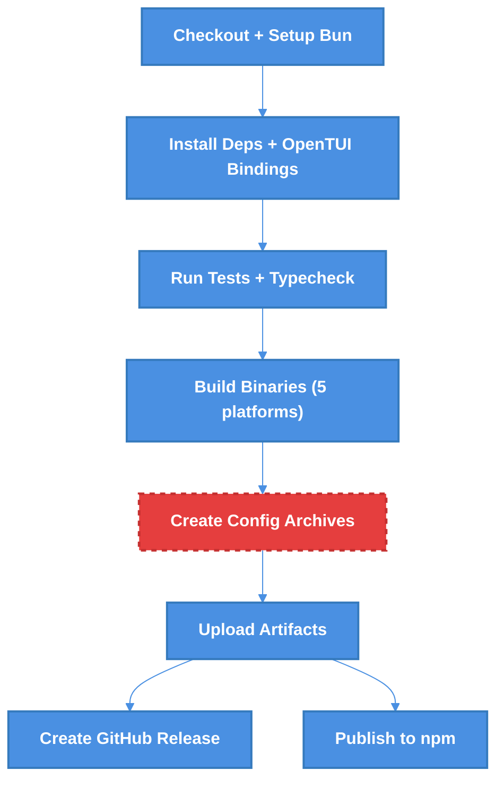

# OpenTUI Distribution & CI Publish Workflow Fix — Technical Design Document

| Document Metadata      | Details     |
| ---------------------- | ----------- |
| Author(s)              | Developer   |
| Status                 | Draft (WIP) |
| Team / Owner           | Atomic CLI  |
| Created / Last Updated | 2026-02-12  |

## 1. Executive Summary

The CI publish workflow (`.github/workflows/publish.yml`) fails at the "Create config archives" step because it copies `.github/agents`, `.github/hooks`, and `.github/scripts` directories that no longer exist in the repository. Similarly, `package.json`'s `files` field references these same nonexistent directories, causing npm publish to include stale entries. This spec proposes updating both the workflow and `package.json` to reflect the current `.github` directory structure (only `skills/` remains), restoring a fully functional CI publish pipeline with minimal, surgical changes.

> **Research**: [2026-02-12-opentui-distribution-ci-fix.md](../research/docs/2026-02-12-opentui-distribution-ci-fix.md)

## 2. Context and Motivation

### 2.1 Current State

The Atomic CLI uses a multi-channel distribution pipeline:

1. **npm publish** — publishes `@bastani/atomic` with source and config files listed in `package.json` `files`
2. **Binary build** — CI compiles platform-specific binaries via `bun build --compile --target=bun-{platform}` for 5 targets (linux-x64, linux-arm64, darwin-x64, darwin-arm64, windows-x64)
3. **Config archives** — CI creates `atomic-config.tar.gz` and `atomic-config.zip` containing agent configuration files (`.claude/`, `.opencode/`, `.github/skills/`, `CLAUDE.md`, `AGENTS.md`)
4. **GitHub Release** — uploads binaries + config archives + checksums
5. **Install scripts** — `install.sh`/`install.ps1` download platform binaries and config from GitHub releases

The pipeline also manually installs all 6 OpenTUI platform-specific native binding packages to enable cross-compilation, since `@opentui/core` uses `optionalDependencies` with `os`/`cpu` fields that block installation on non-matching platforms.

> **Research**: [2026-01-21-binary-distribution-installers.md](../research/docs/2026-01-21-binary-distribution-installers.md) — Complete binary distribution strategy

### 2.2 The Problem

**Failed CI Run**: https://github.com/flora131/atomic/actions/runs/21928096164

The workflow fails at `publish.yml:86` with:
```
cp: cannot stat '.github/agents': No such file or directory
##[error]Process completed with exit code 1.
```

**Root Cause**: The `.github` directory has been restructured over time. Four previously existing subdirectories were removed, but both the workflow and `package.json` still reference them:

| Directory           | Exists? | In Workflow (lines 86-90) | In `package.json` `files` |
| ------------------- | ------- | ------------------------- | ------------------------- |
| `.github/agents`    | ❌ No    | ✅ Line 86                 | ✅ Yes                     |
| `.github/hooks`     | ❌ No    | ✅ Line 87                 | ✅ Yes                     |
| `.github/prompts`   | ❌ No    | ✅ Line 88 (suppressed)    | ✅ Yes                     |
| `.github/scripts`   | ❌ No    | ✅ Line 89                 | ✅ Yes                     |
| `.github/skills`    | ✅ Yes   | ✅ Line 90                 | ✅ Yes                     |
| `.github/workflows` | ✅ Yes   | Not copied                | Not in files              |

**Current `.github/` contents**:
```
.github/
├── dependabot.yml
├── skills/
│   ├── gh-commit/
│   └── gh-create-pr/
└── workflows/
    ├── ci.yml
    ├── claude.yml
    ├── code-review.yml
    ├── pr-description.yml
    └── publish.yml
```

- **User Impact**: No releases can be published — binary distribution and npm publishing are both blocked.
- **Business Impact**: Users cannot install or update Atomic CLI.
- **Technical Debt**: Stale references in `package.json` `files` cause npm to silently include nonexistent paths.

## 3. Goals and Non-Goals

### 3.1 Functional Goals

- [x] CI publish workflow completes successfully end-to-end (build → config archives → release → npm publish)
- [x] Config archives (`atomic-config.tar.gz` / `atomic-config.zip`) contain only directories that actually exist
- [x] `package.json` `files` field accurately reflects the current repository structure
- [x] Install scripts (`install.sh`/`install.ps1`) continue to work unchanged with the updated config archives

### 3.2 Non-Goals (Out of Scope)

- [ ] We will NOT dynamically resolve the OpenTUI version from `package.json`/`bun.lock` (currently hardcoded as `OPENTUI_VERSION="0.1.79"` — tracked as a separate improvement)
- [ ] We will NOT add new `.github` subdirectories (e.g., `commands/`) in this change
- [ ] We will NOT modify the install scripts (`install.sh`/`install.ps1`) — they consume config archives generically and need no changes
- [ ] We will NOT refactor the cross-platform native binding installation logic

## 4. Proposed Solution (High-Level Design)

### 4.1 System Architecture Diagram

The distribution pipeline architecture remains unchanged. Only the config archive creation step is affected:



**Legend**: The red dashed node (`Create Config Archives`) is the failing step that needs fixing.

### 4.2 Architectural Pattern

No architectural change. This is a configuration-only fix affecting two files.

### 4.3 Key Changes

| File                            | Change                                                 | Lines Affected |
| ------------------------------- | ------------------------------------------------------ | -------------- |
| `.github/workflows/publish.yml` | Remove `cp` commands for nonexistent `.github` subdirs | 86-89          |
| `package.json`                  | Remove stale entries from `files` array                | 26-29          |

## 5. Detailed Design

### 5.1 Change 1: `.github/workflows/publish.yml` — Config Archive Step

**Current code** (lines 77-102):
```yaml
- name: Create config archives
  run: |
    mkdir -p config-staging
    cp -r .claude config-staging/
    cp -r .opencode config-staging/
    mkdir -p config-staging/.github
    cp -r .github/agents config-staging/.github/      # ❌ REMOVE
    cp -r .github/hooks config-staging/.github/       # ❌ REMOVE
    cp -r .github/prompts config-staging/.github/ 2>/dev/null || true  # ❌ REMOVE
    cp -r .github/scripts config-staging/.github/     # ❌ REMOVE
    cp -r .github/skills config-staging/.github/      # ✅ KEEP
    cp CLAUDE.md config-staging/
    cp AGENTS.md config-staging/
    cp .mcp.json config-staging/ 2>/dev/null || true
    rm -rf config-staging/.opencode/node_modules
    tar -czvf dist/atomic-config.tar.gz -C config-staging .
    cd config-staging && zip -r ../dist/atomic-config.zip . && cd ..
```

**Proposed code**:
```yaml
- name: Create config archives
  run: |
    mkdir -p config-staging
    cp -r .claude config-staging/
    cp -r .opencode config-staging/
    mkdir -p config-staging/.github
    cp -r .github/skills config-staging/.github/
    cp CLAUDE.md config-staging/
    cp AGENTS.md config-staging/
    cp .mcp.json config-staging/ 2>/dev/null || true
    rm -rf config-staging/.opencode/node_modules
    tar -czvf dist/atomic-config.tar.gz -C config-staging .
    cd config-staging && zip -r ../dist/atomic-config.zip . && cd ..
```

**Changes**: Remove lines 86-89 (the four `cp` commands for `agents`, `hooks`, `prompts`, `scripts`).

### 5.2 Change 2: `package.json` — `files` Field

**Current code** (lines 22-33):
```json
"files": [
  "src",
  ".claude",
  ".opencode",
  ".github/agents",     // ❌ REMOVE
  ".github/hooks",      // ❌ REMOVE
  ".github/prompts",    // ❌ REMOVE
  ".github/scripts",    // ❌ REMOVE
  ".github/skills",     // ✅ KEEP
  "CLAUDE.md",
  "AGENTS.md"
]
```

**Proposed code**:
```json
"files": [
  "src",
  ".claude",
  ".opencode",
  ".github/skills",
  "CLAUDE.md",
  "AGENTS.md"
]
```

**Changes**: Remove the four stale `.github/*` entries (`agents`, `hooks`, `prompts`, `scripts`).

### 5.3 Impact Analysis

**Config archive contents (after fix)**:
```
atomic-config.tar.gz / atomic-config.zip
├── .claude/
│   ├── commands/
│   └── settings.json
├── .opencode/
│   ├── command/
│   ├── opencode.json
│   └── package.json
├── .github/
│   └── skills/
│       ├── gh-commit/
│       └── gh-create-pr/
├── CLAUDE.md
├── AGENTS.md
└── .mcp.json (if present)
```

**npm package contents (after fix)**: Same as above plus `src/` directory.

**Install scripts**: No changes needed. Both `install.sh` and `install.ps1` extract config archives generically via `tar -xzf` / `Expand-Archive` to the data directory (`~/.local/share/atomic` or `%LOCALAPPDATA%\atomic`). They do not reference specific subdirectories within the archive.

> **Research**: [2026-01-20-cross-platform-support.md](../research/docs/2026-01-20-cross-platform-support.md) — Cross-platform install considerations

## 6. Alternatives Considered

| Option                                                        | Pros                                                          | Cons                                           | Reason for Rejection                                    |
| ------------------------------------------------------------- | ------------------------------------------------------------- | ---------------------------------------------- | ------------------------------------------------------- |
| A: Error-suppress all `cp` commands with `                    |                                                               | true`                                          | Quickest fix, no behavior change for existing dirs      | Silently hides future breakages; config archive may be incomplete without warning | Masks real errors; doesn't fix the `package.json` `files` issue |
| B: Remove stale references (Selected)                         | Clean, minimal, accurate; fixes both workflow and npm publish | None significant                               | **Selected**: Correctly reflects current repo structure |
| C: Re-create the missing directories with placeholder content | Workflow would pass without changes                           | Adds unnecessary empty directories; misleading | No valid use case for empty `.github/agents`, etc.      |

## 7. Cross-Cutting Concerns

### 7.1 Security and Privacy

No security implications. This change only removes references to nonexistent directories. No secrets, credentials, or PII are involved.

### 7.2 Observability Strategy

- **CI Pipeline**: The publish workflow will succeed/fail as a binary signal. GitHub Actions provides built-in logging for each step.
- **Verification**: Checksum verification in install scripts remains unchanged and validates archive integrity.

### 7.3 Backward Compatibility

- **Install scripts**: Fully backward compatible. They extract whatever is in the archive.
- **npm consumers**: Fully backward compatible. Removing nonexistent paths from `files` has no functional effect on consumers — those files were never actually included.
- **Existing installations**: Unaffected. Only new releases use the updated archive contents.

## 8. Migration, Rollout, and Testing

### 8.1 Deployment Strategy

- [x] Phase 1: Apply both changes in a single commit on the `lavaman131/hotfix/opentui-distribution` branch
- [x] Phase 2: Push to a `release/**` branch or trigger `workflow_dispatch` to test the full publish workflow
- [x] Phase 3: Verify the GitHub Release artifacts contain correct config archives
- [x] Phase 4: Verify npm publish succeeds with correct package contents

### 8.2 Data Migration Plan

No data migration required. This is a CI/config-only change.

### 8.3 Test Plan

- **Unit Tests**: Run existing `bun test` suite — no new tests needed (no runtime code changes)
- **Typecheck**: Run `bun run typecheck` — no new types affected
- **Integration Tests**:
  - Trigger the publish workflow via `workflow_dispatch` and verify it completes all jobs
  - Download the resulting `atomic-config.tar.gz` and verify its contents match the expected structure in §5.3
  - Run `npm pack` locally and verify the package tarball contains only the expected files
- **End-to-End Tests**:
  - Install from the new release using `install.sh` on Linux/macOS
  - Install from the new release using `install.ps1` on Windows
  - Verify `atomic --help` works after installation
  - Verify config files are correctly extracted to the data directory

**Local Validation Command**:
```bash
# Verify package.json files field only references existing paths
bun run --bun -e "
  const pkg = await Bun.file('package.json').json();
  for (const f of pkg.files) {
    const exists = await Bun.file(f).exists() || Bun.glob(f + '/**').scanSync('.').length > 0;
    console.log(exists ? '✅' : '❌', f);
  }
"
```

## 9. Open Questions / Unresolved Issues

- [ ] **OpenTUI version pinning**: The CI workflow hardcodes `OPENTUI_VERSION="0.1.79"`. Should this be dynamically read from `package.json` or `bun.lock` instead? (Separate improvement — out of scope for this fix.)
- [ ] **`.github/commands/` directory**: The AGENTS.md mentions "skills and commands folders" — should a `commands/` directory be added to `.github/` in a future iteration? (Out of scope for this fix.)
- [ ] **`.mcp.json` in config archive**: The workflow copies `.mcp.json` with error suppression (`2>/dev/null || true`). Should this be added to the `package.json` `files` field as well if it exists? **No**
