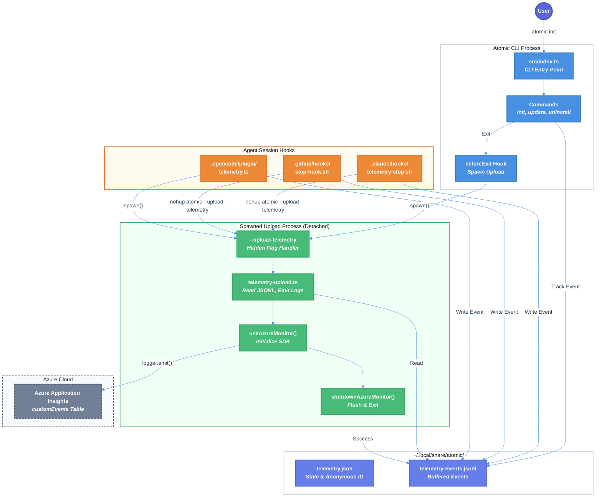

# Phase 6: Telemetry Upload Backend Integration - Technical Design Document

| Document Metadata      | Details                                                |
| ---------------------- | ------------------------------------------------------ |
| Author(s)              | flora131                                               |
| Status                 | Draft (WIP)                                            |
| Team / Owner           | flora131/atomic                                        |
| Created / Last Updated | 2026-01-22                                             |
| Parent Spec            | [specs/anonymous-telemetry-implementation.md](./anonymous-telemetry-implementation.md) |
| Research Reference     | [research/docs/2026-01-22-azure-app-insights-backend-integration.md](../research/docs/2026-01-22-azure-app-insights-backend-integration.md) |

## 1. Executive Summary

This document specifies Phase 6 of the Anonymous Telemetry Implementation: **Backend Integration**. Phases 1-4 are complete (anonymous ID generation, CLI command tracking, slash command tracking, agent session hooks), with Phase 5 (User Consent) partially complete. Phase 6 implements the missing upload mechanism that sends buffered telemetry events from the local JSONL file to Azure Application Insights via OpenTelemetry.

The implementation follows a **spawned-process-on-exit** pattern (used by Homebrew and Salesforce CLI) where a detached background process handles uploads with zero latency impact on CLI commands. Events are sent as custom events to Azure App Insights using the OpenTelemetry Logs API with the `microsoft.custom_event.name` attribute for proper routing to the `customEvents` table.

**Key Decisions**:
- Direct export to Azure App Insights (no intermediate OTEL Collector) for MVP simplicity
- **Hardcoded connection string** committed to public repository (safe - Azure App Insights connection strings are write-only, following industry standard practice like Google Analytics)

## 2. Context and Motivation

### 2.1 Current State

**Completed (Phases 1-4):**
- Anonymous UUID v4 generation with monthly rotation (`src/utils/telemetry/telemetry.ts`)
- CLI command tracking for `init`, `update`, `uninstall` (`src/utils/telemetry/telemetry-cli.ts`)
- Slash command extraction from CLI args (`trackCliInvocation()`)
- Agent session hooks for Claude, Copilot, and OpenCode (`.claude/hooks/`, `.github/hooks/`, `.opencode/plugin/`)
- Local JSONL buffering at `~/.local/share/atomic/telemetry-events.jsonl`
- CI environment detection via `ci-info` package
- Multiple opt-out mechanisms (env vars, config file)

**Partially Complete (Phase 5):**
- Consent prompt implemented in `src/utils/telemetry/telemetry-consent.ts`
- `atomic config set telemetry <true|false>` command works

**Missing (Phase 6):**
- `--upload-telemetry` hidden CLI flag not implemented in `src/index.ts`
- No `telemetry-upload.ts` module exists
- No OpenTelemetry packages installed
- No Azure App Insights integration
- Events accumulate in JSONL indefinitely with no upload or cleanup

**Architecture:** Events are written via `appendEvent()` (`telemetry-cli.ts:105-122`) which appends JSON lines to `telemetry-events.jsonl`. Shell hooks call `spawn_upload_process()` (`bin/telemetry-helper.sh:251-255`) which attempts `atomic --upload-telemetry`, but this flag is not handled.

**Reference:** [Research Section: Current Implementation State](../research/docs/2026-01-22-azure-app-insights-backend-integration.md#current-implementation-state)

### 2.2 The Problem

- **Data Loss:** Telemetry events accumulate locally but are never transmitted to the backend
- **No Product Insights:** Cannot measure feature adoption, command usage patterns, or growth metrics
- **Incomplete Implementation:** Session hooks spawn upload processes that fail silently (flag unimplemented)
- **Unbounded Disk Growth:** JSONL file grows indefinitely without cleanup

## 3. Goals and Non-Goals

### 3.1 Functional Goals

- [ ] Add `@azure/monitor-opentelemetry`, `@opentelemetry/api`, and `@opentelemetry/api-logs` dependencies
- [ ] Create `src/utils/telemetry/telemetry-upload.ts` with upload handler
- [ ] Hardcode Azure App Insights connection string in source code (safe - write-only)
- [ ] Implement `--upload-telemetry` hidden CLI flag in `src/index.ts`
- [ ] Send events to Azure App Insights `customEvents` table via OpenTelemetry Logs API
- [ ] Implement spawned-process-on-exit pattern for zero-latency uploads
- [ ] Add `beforeExit` hook to spawn upload process after CLI commands
- [ ] Implement retry logic with exponential backoff (max 3 attempts, 5-minute TTL)
- [ ] Implement batch size limits (100 events max, 500KB max payload)
- [ ] Clear local JSONL buffer on successful upload
- [ ] Implement 30-day event age cleanup
- [ ] Write unit and integration tests for upload functionality

### 3.2 Non-Goals (Out of Scope)

- [ ] We will NOT deploy an OTEL Collector (direct App Insights export for MVP)
- [ ] We will NOT build telemetry dashboards (backend visualization is separate work)
- [ ] We will NOT implement real-time streaming (batch upload only)
- [ ] We will NOT use environment variables for connection string (hardcoded for all users)
- [ ] We will NOT persist failed uploads across CLI restarts (fire-and-forget pattern)
- [ ] We will NOT add the connection string to shell hooks (TypeScript upload only)

## 4. Proposed Solution (High-Level Design)

### 4.1 System Architecture Diagram



### 4.2 Architectural Pattern

**Pattern:** Spawned-Process-on-Exit with Local-First Buffering

Following the industry-standard pattern used by Homebrew and Salesforce CLI:

1. **Local-First:** All events written to JSONL file (zero network blocking during CLI commands)
2. **Spawned Upload:** On CLI exit, spawn a detached background process (`atomic --upload-telemetry`)
3. **Fire-and-Forget:** Parent process exits immediately; child handles upload independently
4. **Retry Within Session:** Exponential backoff within upload process; no cross-session persistence
5. **Clear on Success:** Delete JSONL file only after successful upload

**Reference:** [Parent Spec Section 5.5: Batch Upload Implementation](./anonymous-telemetry-implementation.md#55-batch-upload-implementation)

### 4.3 Key Components

| Component | Responsibility | Technology | Justification |
|-----------|----------------|------------|---------------|
| `telemetry-upload.ts` | Read JSONL, emit OpenTelemetry logs, flush | TypeScript | Integrates with existing telemetry module |
| `@azure/monitor-opentelemetry` | Azure Monitor exporter for OTEL | npm v1.15.0 | Official Microsoft SDK, handles retries |
| `@opentelemetry/api-logs` | Logs API for custom events | npm | Required for `logger.emit()` API |
| `--upload-telemetry` flag | CLI entry point for upload | Built-in parseArgs | Hidden flag, not shown in help |
| `beforeExit` handler | Trigger spawned upload | Node.js process event | Zero latency pattern |

## 5. Detailed Design

### 5.1 New Dependencies

Add to `package.json`:

```json
{
  "dependencies": {
    "@azure/monitor-opentelemetry": "^1.15.0",
    "@opentelemetry/api": "^1.9.0",
    "@opentelemetry/api-logs": "^0.52.0"
  }
}
```

**Installation:**
```bash
bun add @azure/monitor-opentelemetry @opentelemetry/api @opentelemetry/api-logs
```

**Reference:** [Research Section: Package Requirements](../research/docs/2026-01-22-azure-app-insights-backend-integration.md#package-requirements)

### 5.2 Configuration

**Hardcoded Connection String (Public in Repository):**

The Azure Application Insights connection string is **hardcoded in the source code** and committed to the public repository.

```typescript
// src/utils/telemetry/telemetry-upload.ts
const APPLICATIONINSIGHTS_CONNECTION_STRING = "InstrumentationKey=xxx;IngestionEndpoint=https://xxx.applicationinsights.azure.com/";
```

**Why This Is Safe:**
- Azure App Insights connection strings are **write-only** (ingestion only, no read access)
- This is industry-standard practice: Google Analytics, Segment, Mixpanel, etc. all use public client keys
- Connection string only allows sending telemetry data, not querying or viewing it
- Access to view data requires Azure Portal authentication with separate credentials

**Works Across All Installation Types:**
- ✅ Binary download (curl | bash) - connection string compiled into binary
- ✅ npm/bun install - connection string bundled in package
- ✅ Source install - connection string in source code
- ✅ All users send telemetry to the same Atomic App Insights resource (subject to opt-in consent)

**No Environment Variable:** The connection string is always used as-is from the source code. No runtime configuration needed.

### 5.3 CLI Flag Implementation

**Location:** `src/index.ts`

Add `--upload-telemetry` to parseArgs options (lines 169-184):

```typescript
const { values, positionals } = parseArgs({
  args: rawArgs,
  options: {
    agent: { type: "string", short: "a" },
    force: { type: "boolean", short: "f" },
    yes: { type: "boolean", short: "y" },
    version: { type: "boolean", short: "v" },
    help: { type: "boolean", short: "h" },
    "no-banner": { type: "boolean" },
    "keep-config": { type: "boolean" },
    "dry-run": { type: "boolean" },
    "upload-telemetry": { type: "boolean" },  // NEW: Hidden flag for telemetry upload
  },
  strict: false,
  allowPositionals: true,
});
```

Handle before version check (after line 185):

```typescript
// Handle --upload-telemetry (hidden, internal use only)
if (values["upload-telemetry"]) {
  const { handleTelemetryUpload } = await import("./utils/telemetry/telemetry-upload");
  await handleTelemetryUpload();
  return;
}
```

**Note:** Flag is intentionally NOT shown in `showHelp()` output.

### 5.4 Upload Module Design

**File:** `src/utils/telemetry/telemetry-upload.ts`

#### Constants (Best Practices from Research)

```typescript
// Reference: research/docs/2026-01-22-azure-app-insights-backend-integration.md#recommended-configuration-best-practices

const TELEMETRY_CONFIG = {
  retry: {
    maxAttempts: 3,           // Initial + 2 retries (Segment standard)
    initialInterval: 1000,    // 1 second
    maxInterval: 30000,       // 30 seconds
    multiplier: 2.0,          // Exponential backoff
    maxElapsedTime: 300000,   // 5 minutes total (OpenTelemetry standard)
  },
  timeout: 5000,              // 5 second request timeout
  batch: {
    maxEvents: 100,           // Segment standard
    maxPayloadSize: 512000,   // 500 KB
  },
  storage: {
    maxEventAge: 2592000000,  // 30 days in milliseconds
  },
};
```

#### Type Definitions

```typescript
interface UploadResult {
  success: boolean;
  eventsUploaded: number;
  eventsSkipped: number;  // Stale events older than 30 days
  error?: string;
}
```

#### Main Functions

**`handleTelemetryUpload(): Promise<void>`**

Entry point called by `--upload-telemetry` flag:

1. Check `isTelemetryEnabledSync()` - return early if disabled
2. Read and parse `telemetry-events.jsonl`
3. Filter out events older than 30 days
4. Split into batches of 100 events
5. Initialize OpenTelemetry with Azure Monitor using hardcoded connection string
6. Emit each event via Logs API
7. Call `shutdownAzureMonitor()` to flush
8. Delete JSONL file on success

**`readEventsFromJSONL(): TelemetryEvent[]`**

Parse local JSONL file:

1. Check file exists (`existsSync`)
2. Read file content (`readFileSync`)
3. Split by newlines
4. Parse each line as JSON (skip invalid lines)
5. Type-check each event
6. Return array of valid events

**`filterStaleEvents(events: TelemetryEvent[]): { valid: TelemetryEvent[]; stale: number }`**

Remove events older than 30 days:

1. Get current timestamp
2. Filter events where `event.timestamp` is within 30 days
3. Return valid events and count of stale events discarded

**`emitEventsToAppInsights(events: TelemetryEvent[], logger: Logger): void`**

Send events via OpenTelemetry Logs API:

```typescript
for (const event of events) {
  logger.emit({
    body: event.eventType,
    severityNumber: SeverityNumber.INFO,
    attributes: {
      "microsoft.custom_event.name": event.eventType,  // Routes to customEvents table
      "anonymous_id": event.anonymousId,
      "event_id": event.eventId,
      "timestamp": event.timestamp,
      "command": (event as AtomicCommandEvent).command ?? null,
      "commands": (event as CliCommandEvent | AgentSessionEvent).commands?.join(",") ?? null,
      "command_count": (event as CliCommandEvent | AgentSessionEvent).commandCount ?? null,
      "agent_type": event.agentType ?? null,
      "platform": event.platform,
      "version": event.atomicVersion,
      "source": event.source,
      "success": (event as AtomicCommandEvent).success ?? null,
      "session_id": (event as AgentSessionEvent).sessionId ?? null,
    },
  });
}
```

**Reference:** [Research Section: Sending Custom Events](../research/docs/2026-01-22-azure-app-insights-backend-integration.md#sending-custom-events-command-usage)

### 5.5 Spawned Upload Pattern

**Location:** `src/index.ts` (add before `main()` call)

```typescript
import { spawn } from "child_process";

function spawnTelemetryUpload(): void {
  // Prevent recursive spawns
  if (process.env.ATOMIC_TELEMETRY_UPLOAD === "1") return;

  // Check if telemetry is enabled (sync check to avoid blocking)
  // Import dynamically to avoid circular dependencies
  const { isTelemetryEnabledSync } = require("./utils/telemetry");
  if (!isTelemetryEnabledSync()) return;

  // Spawn detached process that outlives parent
  const child = spawn(process.execPath, [process.argv[1], "--upload-telemetry"], {
    detached: true,
    stdio: "ignore",
    env: { ...process.env, ATOMIC_TELEMETRY_UPLOAD: "1" },
  });

  child.unref();
}
```

**Trigger on CLI exit:**

Add after command switch statement in `main()`:

```typescript
// Spawn telemetry upload on exit (after successful command)
spawnTelemetryUpload();
```

**Note:** The `ATOMIC_TELEMETRY_UPLOAD` env var prevents infinite recursion when the spawned process runs `atomic --upload-telemetry`.

### 5.6 OpenTelemetry SDK Initialization

```typescript
import { useAzureMonitor, shutdownAzureMonitor } from "@azure/monitor-opentelemetry";
import { logs, SeverityNumber } from "@opentelemetry/api-logs";

// Hardcoded connection string (safe to commit - write-only, no read access)
const APPLICATIONINSIGHTS_CONNECTION_STRING = "InstrumentationKey=xxx;IngestionEndpoint=https://xxx.applicationinsights.azure.com/";

function initializeOpenTelemetry(): void {
  useAzureMonitor({
    azureMonitorExporterOptions: {
      connectionString: APPLICATIONINSIGHTS_CONNECTION_STRING,
    },
    enableLiveMetrics: false,  // Disable for CLI apps (designed for servers)
  });
}

async function flushAndShutdown(): Promise<void> {
  // CRITICAL: Must call shutdownAzureMonitor() for CLI apps
  // This flushes all pending telemetry before process exits
  await shutdownAzureMonitor();
}
```

**Reference:** [Research Section: CLI Graceful Shutdown](../research/docs/2026-01-22-azure-app-insights-backend-integration.md#cli-graceful-shutdown-critical)

### 5.7 Error Handling

**Principle:** Fail silently to avoid disrupting user experience.

| Error Type | Handling | Recovery |
|------------|----------|----------|
| JSONL file not found | Return early (nothing to upload) | N/A |
| JSONL parse error | Skip invalid lines, continue with valid | Partial upload |
| Network timeout (5s) | SDK handles retry with exponential backoff | Auto-retry up to 3 times |
| SDK initialization failure | Catch, log error, return | Events remain in JSONL |
| Flush timeout | After 5 minutes, give up | Events remain in JSONL |

### 5.8 Data Flow Sequence

```
1. User runs: atomic init
2. CLI executes init command
3. trackAtomicCommand() writes event to telemetry-events.jsonl
4. CLI command completes
5. beforeExit triggers spawnTelemetryUpload()
6. Parent process exits immediately (zero latency)
7. Child process (detached) starts:
   a. Checks ATOMIC_TELEMETRY_UPLOAD=1 (no recursive spawn)
   b. Checks isTelemetryEnabledSync()
   c. Reads telemetry-events.jsonl
   d. Filters stale events (>30 days)
   e. Initializes OpenTelemetry SDK with hardcoded connection string
   f. Emits events via logger.emit()
   g. Calls shutdownAzureMonitor() (flushes)
   h. Deletes telemetry-events.jsonl
   i. Child process exits
```

## 6. Alternatives Considered

| Option | Pros | Cons | Reason for Rejection |
|--------|------|------|---------------------|
| **OTEL Collector Middleman** | Vendor-agnostic, can fan out to multiple backends | Requires deploying/maintaining infrastructure | Overkill for MVP; can migrate later if needed |
| **Direct HTTP POST (no SDK)** | No dependencies, full control | Must implement retry logic, batching, error handling manually | Reinventing the wheel; SDK handles this |
| **Persistent Queue (disk-based)** | Events never lost across restarts | Complex implementation, more disk I/O | Fire-and-forget pattern sufficient for CLI analytics |
| **Synchronous Upload** | Simpler code flow | Blocks CLI, poor UX, fails if offline | Unacceptable latency impact |
| **Azure App Insights SDK (Classic)** | Well-documented | Deprecated in favor of OpenTelemetry | Microsoft recommends OTEL migration |
| **Direct to App Insights (Selected)** | Simplest setup, no infrastructure, uses official SDK | Single backend only | **Selected:** Best balance for MVP |

**Reference:** [Research Section: Architecture Options](../research/docs/2026-01-22-azure-app-insights-backend-integration.md#architecture-options)

## 7. Cross-Cutting Concerns

### 7.1 Security and Privacy

- **No PII:** Events contain only command names, anonymous ID (rotated monthly), platform, and version
- **Transport Security:** HTTPS enforced by Azure SDK
- **Connection String:** Stored in environment variable only (never committed to code)
- **No User Prompts:** User-typed prompts and file paths are never collected (enforced by event schemas in `types.ts`)

### 7.2 Observability Strategy

**Metrics to Track (in Azure App Insights):**
- `atomic_command` events by command type, agent type, success status
- `cli_command` events by slash command name, agent type
- `agent_session` events by agent type, command count
- Daily/weekly unique anonymous IDs (user count estimate)

**Dashboards (Future Work):**
- KQL queries against `customEvents` table
- Feature adoption trends over time
- Platform distribution (darwin/linux/win32)

### 7.3 Scalability and Capacity Planning

**Estimated Volume:**
- ~1,000 users × 10 events/day = 10,000 events/day
- Event size: ~200 bytes JSON
- Daily data: ~2 MB/day uncompressed
- Monthly data: ~60 MB/month

**Azure App Insights Free Tier:** 5 GB/month ingestion, 90-day retention - well within limits.

### 7.4 Failure Modes

| Failure | Behavior | Recovery |
|---------|----------|----------|
| Network failure | SDK retries 3x with exponential backoff | Events remain local after max retries |
| Partial upload | Events uploaded so far are sent | Remaining events stay in JSONL |
| Corrupt JSONL line | Skip invalid line, continue | Partial data loss (acceptable) |
| Process killed during upload | Events not deleted (no JSONL clear) | Full retry on next upload |
| SDK crash | Catch error, log, exit | Events remain local |

## 8. Migration, Rollout, and Testing

### 8.1 Deployment Strategy

- [ ] **Phase 6a:** Add dependencies, create `telemetry-upload.ts` with upload logic
- [ ] **Phase 6b:** Add `--upload-telemetry` flag to CLI, verify manual upload works
- [ ] **Phase 6c:** Add `spawnTelemetryUpload()` and `beforeExit` hook
- [ ] **Phase 6d:** Set up Azure App Insights resource, configure connection string
- [ ] **Phase 6e:** Verify data flow end-to-end in staging
- [ ] **Phase 6f:** Enable for production (no feature flag needed - controlled by env var presence)

### 8.2 Data Migration Plan

Not applicable - this is new functionality. No existing telemetry data in production.

### 8.3 Test Plan

#### Unit Tests (`telemetry-upload.test.ts`)

- [ ] `readEventsFromJSONL()` - reads and parses valid JSONL
- [ ] `readEventsFromJSONL()` - returns empty array for missing file
- [ ] `readEventsFromJSONL()` - skips invalid JSON lines
- [ ] `filterStaleEvents()` - removes events older than 30 days
- [ ] `filterStaleEvents()` - keeps events within 30 days
- [ ] `handleTelemetryUpload()` - returns early when telemetry disabled
- [ ] `handleTelemetryUpload()` - deletes JSONL on successful upload (mock SDK)
- [ ] `handleTelemetryUpload()` - preserves JSONL on upload failure (mock SDK)
- [ ] `spawnTelemetryUpload()` - spawns detached process with correct args
- [ ] `spawnTelemetryUpload()` - sets ATOMIC_TELEMETRY_UPLOAD env var
- [ ] `spawnTelemetryUpload()` - skips when ATOMIC_TELEMETRY_UPLOAD already set

#### Integration Tests (`telemetry-upload-integration.test.ts`)

- [ ] Full flow: write events → run upload → verify JSONL deleted
- [ ] Batch splitting: 150 events split into 2 batches of 100 and 50
- [ ] Concurrent access: write event while upload running (JSONL append-safe)
- [ ] CLI flag: `atomic --upload-telemetry` triggers upload handler

#### End-to-End Tests (Manual)

- [ ] Run `atomic init` → verify event appears in Azure App Insights
- [ ] Verify `customEvents` table schema matches expected attributes
- [ ] Verify anonymous ID rotation doesn't break uploads
- [ ] Test with telemetry disabled → verify no upload occurs

## 9. Open Questions / Unresolved Issues

- [x] **Architecture Choice:** Direct to App Insights vs OTEL Collector?
  - **RESOLVED:** Direct to App Insights for MVP simplicity. Can migrate to OTEL Collector later if needed for multi-backend support.

- [x] **Connection String Distribution:** How do OSS users get the connection string?
  - **RESOLVED:** Single hardcoded connection string committed to public repository. Azure App Insights connection strings are write-only (ingestion only), making this safe to publish. All users (binary, npm, source) send telemetry to the same Atomic App Insights resource, subject to user consent. This is industry-standard practice (same as Google Analytics, Segment, etc.).

- [ ] **Batch Size Validation:** Should we validate payload size before sending or let SDK handle?
  - **Recommendation:** Let SDK handle; it has built-in chunking. Add size check only if issues observed.

- [ ] **Rate Limiting:** Should we implement client-side rate limiting to avoid App Insights throttling?
  - **Recommendation:** No for MVP. ~10K events/day is well under App Insights limits (50K events/min).

- [ ] **Telemetry for Telemetry:** Should we track upload success/failure metrics?
  - **Recommendation:** No for MVP. Keep upload code minimal; add observability later if debugging needed.

## 10. Implementation Checklist

### Phase 6a: Upload Module

- [ ] Add dependencies to `package.json`:
  - `@azure/monitor-opentelemetry` v1.15.0
  - `@opentelemetry/api` v1.9.0
  - `@opentelemetry/api-logs` v0.52.0
- [ ] Create `src/utils/telemetry/telemetry-upload.ts`:
  - [ ] `TELEMETRY_CONFIG` constants
  - [ ] `readEventsFromJSONL()` function
  - [ ] `filterStaleEvents()` function
  - [ ] `emitEventsToAppInsights()` function
  - [ ] `handleTelemetryUpload()` function
- [ ] Export `handleTelemetryUpload` from `src/utils/telemetry/index.ts`
- [ ] Write unit tests in `telemetry-upload.test.ts`

### Phase 6b: CLI Flag

- [ ] Add `"upload-telemetry": { type: "boolean" }` to parseArgs options in `src/index.ts:171-181`
- [ ] Add handler for `--upload-telemetry` flag before version check (`src/index.ts:~186`)
- [ ] Verify `atomic --upload-telemetry` runs upload handler
- [ ] Verify flag is NOT shown in `showHelp()` output

### Phase 6c: Spawned Upload Pattern

- [ ] Create `spawnTelemetryUpload()` function in `src/index.ts`
- [ ] Add `ATOMIC_TELEMETRY_UPLOAD` env var check to prevent recursion
- [ ] Call `spawnTelemetryUpload()` after command switch in `main()`
- [ ] Verify detached process spawns correctly
- [ ] Verify parent exits without waiting for child

### Phase 6d: Azure Setup

- [ ] Create Azure Application Insights resource
- [ ] Retrieve connection string from Azure Portal
- [ ] Hardcode connection string in `src/utils/telemetry/telemetry-upload.ts`
- [ ] Commit connection string to repository (safe - write-only)

### Phase 6e: Verification

- [ ] Run `atomic init` locally → verify event appears in Azure App Insights
- [ ] Verify `customEvents` table schema matches expected attributes
- [ ] Verify all event attributes are correctly populated
- [ ] Verify JSONL file is deleted after successful upload
- [ ] Test with telemetry disabled → verify no upload occurs
- [ ] Test binary, npm, and source installations → all upload successfully

### Phase 6f: Documentation

- [ ] Update README.md with telemetry backend information
- [ ] Document hardcoded connection string approach and why it's safe
- [ ] Update parent spec checklist (`specs/anonymous-telemetry-implementation.md`)

## 11. Code References

| File | Lines | Description |
|------|-------|-------------|
| `specs/anonymous-telemetry-implementation.md` | 416-471 | Parent spec Section 5.5 (Batch Upload Implementation) |
| `research/docs/2026-01-22-azure-app-insights-backend-integration.md` | 1-521 | Azure App Insights research |
| `src/index.ts` | 169-184 | Current parseArgs options (add upload-telemetry here) |
| `src/index.ts` | 186-196 | Version/help handlers (add upload handler before) |
| `src/utils/telemetry/telemetry.ts` | 227-251 | `isTelemetryEnabledSync()` function |
| `src/utils/telemetry/telemetry-cli.ts` | 31-33 | `getEventsFilePath()` function |
| `src/utils/telemetry/telemetry-cli.ts` | 105-122 | `appendEvent()` function (JSONL format reference) |
| `src/utils/telemetry/types.ts` | 1-122 | Event type definitions |
| `bin/telemetry-helper.sh` | 251-255 | `spawn_upload_process()` (shell reference) |
| `package.json` | 48-51 | Current dependencies |
