# Playwright CLI Integration — Bundling, Installation, and Prompt Migration

| Document Metadata      | Details     |
| ---------------------- | ----------- |
| Author(s)              | lavaman131  |
| Status                 | Draft (WIP) |
| Team / Owner           | Atomic CLI  |
| Created / Last Updated | 2026-02-25  |

## 1. Executive Summary

This spec proposes replacing the existing `WebFetch`, `WebSearch`, and `webfetch` tools across all three agent platforms (Claude, Copilot, OpenCode) with a new `playwright-cli` skill backed by the `@playwright/cli` npm package. Playwright CLI is a token-efficient browser automation CLI designed for coding agents that provides a strict superset of current web fetch/search capabilities — including full JavaScript rendering, session persistence, authentication, screenshots, and multi-page navigation. The integration involves: (1) adding `@playwright/cli` as a dependency and installing it during postinstall to `~/.atomic/<agent>/skills/playwright-cli/`, (2) updating 15 files across 3 agent platforms that currently reference web search/fetch tools, (3) creating a new `playwright-cli` skill definition following the established `SKILL.md` pattern, and (4) modifying install scripts to bundle Playwright CLI in binary distributions. This modernizes the web interaction layer while maintaining backward compatibility with the existing skill discovery and global config sync mechanisms.

## 2. Context and Motivation

### 2.1 Current State

The Atomic CLI has a multi-agent architecture supporting three coding agent SDKs (Claude, OpenCode, Copilot) with a unified skill system ([ref: research/docs/2026-02-08-skill-loading-from-configs-and-ui.md](../research/docs/2026-02-08-skill-loading-from-configs-and-ui.md)):

- **Built-in skills**: Embedded in the `BUILTIN_SKILLS` array in `src/ui/commands/skill-commands.ts`. These are TypeScript objects with inline prompt content, registered automatically during `initializeCommands()` → `registerSkillCommands()` → `registerBuiltinSkills()` ([ref: research/docs/2026-02-14-frontend-design-builtin-skill-integration.md](../research/docs/2026-02-14-frontend-design-builtin-skill-integration.md)).
- **Disk-based skills**: Loaded from `SKILL.md` files discovered in `.claude/skills/`, `.opencode/skills/`, `.github/skills/`, and global paths. All 11 current skills are byte-for-byte identical across all three SDK directories ([ref: research/docs/2026-02-17-legacy-code-removal-skills-migration.md](../research/docs/2026-02-17-legacy-code-removal-skills-migration.md)).
- **Web tools**: Currently provided as platform-specific built-in tools with different naming conventions:
    - **Claude**: `WebFetch`, `WebSearch` (two separate capitalized tools in `BUILTIN_ALLOWED_TOOLS` array at `src/sdk/clients/claude.ts:272-288`)
    - **GitHub/Copilot**: `"web"` (single abstracted tool name in JSON array)
    - **OpenCode**: `webfetch` (single lowercase tool, boolean flag + `"allow"` permission in `.opencode/opencode.json`)

**15 files** currently reference web search/fetch tools across the codebase ([ref: research/docs/2026-02-25-playwright-cli-integration-research.md](../research/docs/2026-02-25-playwright-cli-integration-research.md)):

- 7 agent configs (`.claude/agents/`, `.github/agents/`, `.opencode/agents/`)
- 6 skill configs (`.claude/skills/`, `.github/skills/`, `.opencode/skills/`)
- 1 source code file (`src/sdk/clients/claude.ts`)
- 1 configuration file (`.opencode/opencode.json`)

### 2.2 The Problem

- **Limited web capability**: Current `WebFetch`/`WebSearch` tools cannot handle JavaScript-rendered content, dynamic pages, authentication flows, or session persistence. This limits agents' ability to research modern SPAs and documentation sites.
- **Fragmented tool naming**: Three different tool names across three platforms (`WebFetch`/`WebSearch` vs `"web"` vs `webfetch`) creates maintenance burden and inconsistency in agent prompts.
- **No browser automation**: Agents cannot perform interactive web tasks such as filling forms, clicking buttons, or navigating multi-page flows — capabilities increasingly needed for E2E testing and documentation research.
- **Token inefficiency**: WebFetch returns raw HTML/markdown without structure awareness, often consuming excessive context tokens for simple data extraction tasks.

## 3. Goals and Non-Goals

### 3.1 Functional Goals

- [ ] Replace all `WebFetch`, `WebSearch`, and `webfetch` references across 15 files with `playwright-cli` skill references
- [ ] Create `playwright-cli/SKILL.md` in all three SDK skill directories (`.claude/skills/`, `.opencode/skills/`, `.github/skills/`) with byte-for-byte identical content
- [ ] Add `@playwright/cli` as a dependency in `package.json`
- [ ] Update `src/scripts/postinstall.ts` to install Playwright CLI and deploy SKILL.md to `~/.atomic/<agent>/skills/playwright-cli/`
- [ ] Update `install.sh` and `install.ps1` to handle Playwright CLI installation for binary distributions
- [ ] Remove `"WebFetch"` and `"WebSearch"` from the `BUILTIN_ALLOWED_TOOLS` array in `src/sdk/clients/claude.ts`
- [ ] Remove `"webfetch": "allow"` from `.opencode/opencode.json` permissions
- [ ] Add `playwright-cli` as a built-in skill in the `BUILTIN_SKILLS` array in `src/ui/commands/skill-commands.ts`

### 3.2 Non-Goals (Out of Scope)

- [ ] We will NOT implement MCP server integration for Playwright (use CLI approach instead, which aligns with current tool patterns)
- [ ] We will NOT auto-install Chromium browsers during `bun install` (defer to first-use or explicit command to avoid ~200-400MB download during installation)
- [ ] We will NOT support custom browser profiles or enterprise proxy configuration in this version
- [ ] We will NOT build a custom TUI for Playwright test results visualization
- [ ] We will NOT modify the skill discovery/loading mechanism itself — only add new content through existing patterns

## 4. Proposed Solution (High-Level Design)

### 4.1 System Architecture Diagram

```mermaid
%%{init: {'theme':'base', 'themeVariables': { 'primaryColor':'#f8f9fa','primaryTextColor':'#2c3e50','primaryBorderColor':'#4a5568','lineColor':'#4a90e2','secondaryColor':'#ffffff','tertiaryColor':'#e9ecef','background':'#f5f7fa','mainBkg':'#f8f9fa','nodeBorder':'#4a5568','clusterBkg':'#ffffff','clusterBorder':'#cbd5e0','edgeLabelBackground':'#ffffff'}}}%%

flowchart TB
    classDef installStep fill:#5a67d8,stroke:#4c51bf,stroke-width:2.5px,color:#ffffff,font-weight:600
    classDef configTarget fill:#48bb78,stroke:#38a169,stroke-width:2.5px,color:#ffffff,font-weight:600
    classDef agentNode fill:#4a90e2,stroke:#357abd,stroke-width:2.5px,color:#ffffff,font-weight:600
    classDef skillNode fill:#667eea,stroke:#5a67d8,stroke-width:2.5px,color:#ffffff,font-weight:600

    subgraph InstallFlow["◆ Installation Flow"]
        direction TB
        BunInstall["<b>bun install</b><br><i>npm/bun path</i>"]:::installStep
        InstallSh["<b>install.sh / install.ps1</b><br><i>binary path</i>"]:::installStep
        Postinstall["<b>postinstall.ts</b><br>1. syncAtomicGlobalAgentConfigs<br>2. Install @playwright/cli<br>3. Deploy SKILL.md"]:::installStep
    end

    subgraph GlobalStore["◆ ~/.atomic/ (Global Store)"]
        direction TB
        ClaudeSkill["<b>.claude/skills/playwright-cli/</b><br>SKILL.md"]:::configTarget
        OpenCodeSkill["<b>.opencode/skills/playwright-cli/</b><br>SKILL.md"]:::configTarget
        CopilotSkill["<b>.copilot/skills/playwright-cli/</b><br>SKILL.md"]:::configTarget
    end

    subgraph AgentUsage["◆ Agent Runtime"]
        direction TB
        ClaudeAgent["<b>Claude Agent</b><br>codebase-online-researcher<br>debugger, reviewer"]:::agentNode
        CopilotAgent["<b>Copilot Agent</b><br>codebase-online-researcher<br>debugger"]:::agentNode
        OpenCodeAgent["<b>OpenCode Agent</b><br>codebase-online-researcher<br>debugger"]:::agentNode
    end

    PlaywrightCLI["<b>@playwright/cli</b><br>Browser Automation<br><i>Token-efficient CLI</i>"]:::skillNode

    BunInstall -->|"triggers"| Postinstall
    InstallSh -->|"calls"| Postinstall
    Postinstall -->|"deploys"| ClaudeSkill
    Postinstall -->|"deploys"| OpenCodeSkill
    Postinstall -->|"deploys"| CopilotSkill

    ClaudeAgent -->|"invokes"| PlaywrightCLI
    CopilotAgent -->|"invokes"| PlaywrightCLI
    OpenCodeAgent -->|"invokes"| PlaywrightCLI

    ClaudeSkill -.->|"instructs"| ClaudeAgent
    OpenCodeSkill -.->|"instructs"| OpenCodeAgent
    CopilotSkill -.->|"instructs"| CopilotAgent

    style InstallFlow fill:#ffffff,stroke:#cbd5e0,stroke-width:2px,stroke-dasharray:8 4
    style GlobalStore fill:#ffffff,stroke:#cbd5e0,stroke-width:2px,stroke-dasharray:8 4
    style AgentUsage fill:#ffffff,stroke:#cbd5e0,stroke-width:2px,stroke-dasharray:8 4
```



### 4.2 Architectural Pattern

We are adopting a **Skill-as-Tool-Replacement** pattern where the `playwright-cli` skill replaces built-in platform tools (`WebFetch`/`WebSearch`/`webfetch`) with a unified skill definition. This follows the established **Materialize-then-Discover** pattern ([ref: research/docs/2026-02-17-legacy-code-removal-skills-migration.md](../research/docs/2026-02-17-legacy-code-removal-skills-migration.md)):

1. Hardcode in `BUILTIN_SKILLS` array with full prompt
2. System writes to all SDK directories as `SKILL.md` files
3. System discovers back from disk (enables user overrides)
4. Priority resolution handles conflicts

### 4.3 Key Components

| Component                              | Responsibility                                | Technology                  | Justification                                                                  |
| -------------------------------------- | --------------------------------------------- | --------------------------- | ------------------------------------------------------------------------------ |
| `playwright-cli/SKILL.md`              | Skill definition for all agent platforms      | Markdown + YAML frontmatter | Follows Agent Skills standard; byte-for-byte identical across platforms        |
| `@playwright/cli` dependency           | Browser automation runtime                    | npm package (Node.js)       | Token-efficient CLI designed for coding agents; superset of WebFetch/WebSearch |
| `postinstall.ts` extension             | Deploy SKILL.md during installation           | TypeScript (Bun)            | Extends existing postinstall hook; non-blocking error handling                 |
| `install.sh` / `install.ps1` extension | Handle binary distribution installation       | Bash / PowerShell           | Extends existing installer pattern for cross-platform support                  |
| Agent config updates (7 files)         | Replace web tool references                   | Markdown YAML frontmatter   | Platform-specific tool list updates                                            |
| Skill config updates (6 files)         | Replace web tool instruction text             | Markdown                    | Update prose references to use playwright-cli                                  |
| `claude.ts` allowlist update           | Remove WebFetch/WebSearch from built-in tools | TypeScript                  | Clean up stale tool references                                                 |

## 5. Detailed Design

### 5.1 New Skill Definition — `playwright-cli/SKILL.md`

**Location**: Created in all three directories:

- `.claude/skills/playwright-cli/SKILL.md`
- `.opencode/skills/playwright-cli/SKILL.md`
- `.github/skills/playwright-cli/SKILL.md`

**Frontmatter** (following Agent Skills standard from [ref: research/docs/2026-02-08-skill-loading-from-configs-and-ui.md](../research/docs/2026-02-08-skill-loading-from-configs-and-ui.md)):

```yaml
---
name: playwright-cli
description: Browser automation for web research, data extraction, and testing using Playwright CLI
aliases: ["pw", "playwright"]
argument-hint: "[url-or-task]"
---
```

**Body**: The SKILL.md body should document:

1. Available Playwright CLI commands (navigate, snapshot, click, fill, evaluate, screenshot, etc.)
2. Usage patterns for web research (replacing WebFetch/WebSearch workflows)
3. Best practices for token-efficient browsing (prefer snapshots over full page content)
4. Common workflows: fetching documentation, searching the web, extracting structured data

**Skill content strategy**: Use the auto-generated SKILL.md from `playwright-cli install --skills`. This leverages official upstream content maintained by the Playwright team, ensuring accuracy and reducing maintenance burden.

### 5.2 Agent Config Changes (7 files)

#### Claude Agent Configs (3 files)

**Files**:

- `.claude/agents/codebase-online-researcher.md`
- `.claude/agents/debugger.md`
- `.claude/agents/reviewer.md` _(remove WebFetch/WebSearch entirely — no playwright-cli replacement per Q4 decision)_

**Change**: In the `tools:` frontmatter field, remove `WebFetch, WebSearch` and add `playwright-cli` skill reference.

**Before**:

```yaml
tools: Glob, Grep, ..., WebFetch, WebSearch
```

**After**:

```yaml
tools: Glob, Grep, ..., Bash
```

> Note: Playwright CLI is invoked via `Bash` tool (running `bunx playwright-cli` commands, per Bun-first project convention). The skill SKILL.md provides the instructions; the Bash tool provides the execution capability. Agents that already have Bash in their tool list need no additional tool.

#### Copilot Agent Configs (2 files)

**Files**:

- `.github/agents/codebase-online-researcher.md`
- `.github/agents/debugger.md`

**Change**: In the `tools:` JSON array, remove `"web"` entry.

**Before**:

```yaml
tools: ["search", "read", "execute", "web", "deepwiki/ask_question"]
```

**After**:

```yaml
tools: ["search", "read", "execute", "deepwiki/ask_question"]
```

#### OpenCode Agent Configs (2 files)

**Files**:

- `.opencode/agents/codebase-online-researcher.md`
- `.opencode/agents/debugger.md`

**Change**: In the YAML frontmatter, remove `webfetch: true`.

**Before**:

```yaml
webfetch: true
```

**After**: Remove the line entirely.

### 5.3 Skill Config Changes (6 files)

#### `explain-code/SKILL.md` (3 files — Claude, Copilot, OpenCode)

**Change**: Update the "Available Tools" section to replace `WebFetch/WebSearch` with `playwright-cli`.

**Before**:

```markdown
- **WebFetch/WebSearch**: Use to retrieve web content for additional context if information is not found in DeepWiki.
```

**After**:

```markdown
- **Playwright CLI** (`playwright-cli`): Use to retrieve web content, browse documentation, and extract data from web pages if information is not found in DeepWiki. Invoke via the `/playwright-cli` skill or run `bunx playwright-cli` commands directly.
```

#### `research-codebase/SKILL.md` (3 files — Claude, Copilot, OpenCode)

**Change**: Update sub-agent instruction text to reference playwright-cli instead of WebFetch/WebSearch.

**Before**:

```markdown
- If you perform a web search using the WebFetch/WebSearch tools, instruct the agent to return LINKS with their findings
```

**After**:

```markdown
- If you perform a web search using the playwright-cli skill, instruct the agent to return LINKS with their findings
```

### 5.4 Source Code Changes

#### `src/sdk/clients/claude.ts` — Remove WebFetch/WebSearch from Allowlist

**Change**: Remove `"WebFetch"` and `"WebSearch"` from the `BUILTIN_ALLOWED_TOOLS` array.

**Before** (L272-288):

```typescript
private static readonly BUILTIN_ALLOWED_TOOLS = [
    "Bash",
    "Read",
    "Write",
    "Edit",
    "Glob",
    "Grep",
    "Task",
    "Skill",
    "MultiEdit",
    "TodoRead",
    "TodoWrite",
    "WebFetch",
    "WebSearch",
    "NotebookEdit",
    "NotebookRead",
] as const;
```

**After**:

```typescript
private static readonly BUILTIN_ALLOWED_TOOLS = [
    "Bash",
    "Read",
    "Write",
    "Edit",
    "Glob",
    "Grep",
    "Task",
    "Skill",
    "MultiEdit",
    "TodoRead",
    "TodoWrite",
    "NotebookEdit",
    "NotebookRead",
] as const;
```

#### `.opencode/opencode.json` — Remove webfetch Permission

**Change**: Remove `"webfetch": "allow"` from the `permission` object.

**Before**:

```json
{
    "permission": {
        "edit": "allow",
        "bash": "allow",
        "webfetch": "allow",
        "doom_loop": "allow",
        "external_directory": "allow"
    }
}
```

**After**:

```json
{
    "permission": {
        "edit": "allow",
        "bash": "allow",
        "doom_loop": "allow",
        "external_directory": "allow"
    }
}
```

### 5.5 Installation/Bundling Changes

#### `package.json` — Add Dependency

**Change**: Add `@playwright/cli` to `dependencies`.

```json
{
    "dependencies": {
        "@playwright/cli": "latest"
    }
}
```

#### `src/scripts/postinstall.ts` — Playwright CLI Installation

**Change**: Add a new function to install Playwright CLI and deploy SKILL.md after the existing `syncAtomicGlobalAgentConfigs` call.

```typescript
async function installPlaywrightCli() {
    // 1. Run `bunx playwright-cli install --skills` to generate SKILL.md
    // 2. Copy generated SKILL.md to all three agent skill directories
    //    in ~/.atomic/.claude/skills/playwright-cli/
    //    in ~/.atomic/.opencode/skills/playwright-cli/
    //    in ~/.atomic/.copilot/skills/playwright-cli/
    // 3. Log success/warning (non-blocking, matching existing pattern)
    // NOTE: Do NOT install Chromium browsers here — defer to first-use
}
```

**Integration point**: After `syncAtomicGlobalAgentConfigs(getConfigRoot())` at L17, before `verifyAtomicGlobalConfigSync()`.

**Error handling**: Follows existing non-blocking pattern — catches errors and logs warnings without failing installation.

**Browser installation**: Chromium browsers are NOT installed during postinstall. Agents can run `bunx playwright install chromium` on first use when browser automation is needed.

#### `install.sh` — Binary Distribution

**Change**: Add Playwright CLI installation step in `sync_global_agent_configs()` after config copy (after L164). Downloads `@playwright/cli` during installation (not pre-bundled) — requires bun or npm on the target system.

```bash
# Install @playwright/cli if bun/npm is available (not pre-bundled to keep release artifacts small)
if command -v bun >/dev/null 2>&1; then
  bun install -g @playwright/cli@latest 2>/dev/null || true
elif command -v npm >/dev/null 2>&1; then
  npm install -g @playwright/cli@latest 2>/dev/null || true
else
  warn "Neither bun nor npm found. Install @playwright/cli manually for web browsing capabilities."
fi
# NOTE: Do NOT install Chromium browsers here — defer to first-use
```

#### `install.ps1` — Windows Binary Distribution

**Change**: Mirror the bash installer's Playwright CLI installation in `Sync-GlobalAgentConfigs` (after L50).

```powershell
# Install @playwright/cli if bun/npm is available (downloaded during install, not pre-bundled)
if (Get-Command bun -ErrorAction SilentlyContinue) {
    bun install -g @playwright/cli@latest 2>$null
} elseif (Get-Command npm -ErrorAction SilentlyContinue) {
    npm install -g @playwright/cli@latest 2>$null
} else {
    Write-Warning "Neither bun nor npm found. Install @playwright/cli manually for web browsing capabilities."
}
# NOTE: Do NOT install Chromium browsers here - defer to first-use
```

### 5.6 BUILTIN_SKILLS Array Addition

**File**: `src/ui/commands/skill-commands.ts`

**Change**: Add a new entry to the `BUILTIN_SKILLS` array ([ref: research/docs/2026-02-14-frontend-design-builtin-skill-integration.md](../research/docs/2026-02-14-frontend-design-builtin-skill-integration.md)).

```typescript
{
  name: "playwright-cli",
  aliases: ["pw", "playwright"],
  description: "Browser automation for web research, data extraction, and testing using Playwright CLI",
  argumentHint: "[url-or-task]",
  prompt: `[SKILL.md body content with $ARGUMENTS placeholder]`
}
```

**Registration**: Follows existing `createBuiltinSkillCommand()` → `globalRegistry.register()` pattern. No changes needed to the registration mechanism itself.

**Pinned status**: NOT pinned — users should be able to override with custom SKILL.md in project or global directories.

## 6. Alternatives Considered

| Option                                                           | Pros                                                                            | Cons                                                                                       | Reason for Rejection                                                                                                          |
| ---------------------------------------------------------------- | ------------------------------------------------------------------------------- | ------------------------------------------------------------------------------------------ | ----------------------------------------------------------------------------------------------------------------------------- |
| **Option A: Keep WebFetch/WebSearch + Add Playwright CLI**       | No breaking change; gradual migration                                           | Two competing tools; agents confused about which to use; maintenance of both               | Fragmentation creates ambiguity for agents and doubles maintenance burden                                                     |
| **Option B: Playwright MCP Server** (`microsoft/playwright-mcp`) | Richer integration via MCP protocol; auto-discovery by SDKs                     | Higher operational complexity; requires running MCP server process; heavier resource usage | CLI approach is more aligned with current tool patterns and is token-efficient by design                                      |
| **Option C: Playwright CLI via Skill (Selected)**                | Unified approach; follows existing patterns; token-efficient; clean replacement | Requires updating 15+ files; browsers not pre-installed                                    | **Selected**: Best alignment with existing architecture; superset of current capabilities; follows established skill patterns |
| **Option D: Custom Web Tool Wrapper**                            | Full control over API surface; could combine search + fetch                     | Reinventing the wheel; maintenance burden; no community support                            | Playwright CLI already provides everything needed with active community maintenance                                           |

## 7. Cross-Cutting Concerns

### 7.1 Security and Privacy

- **Browser sandboxing**: Playwright CLI runs Chromium in sandboxed mode by default — no direct filesystem access from browser context.
- **Credential exposure**: SKILL.md instructions must warn agents NOT to store authentication cookies/tokens in plain text or commit them to repositories.
- **Content safety**: Playwright CLI can access arbitrary URLs. Existing MCP/tool permission systems should apply — no additional authorization layer needed since agents already have `Bash` tool access.

### 7.2 Observability Strategy

- **Skill loading**: Reuse existing skill loading indicator pattern (`● Skill(playwright-cli)` → `└ Successfully loaded skill`) from `tool-result.tsx:53-108` ([ref: research/docs/2026-02-08-skill-loading-from-configs-and-ui.md](../research/docs/2026-02-08-skill-loading-from-configs-and-ui.md)).
- **Execution tracking**: Playwright CLI commands are run via Bash tool, which already logs tool calls in the TUI.
- **Error reporting**: Failed Playwright CLI commands will surface through existing Bash tool error handling.

### 7.3 Scalability and Capacity Planning

- **Browser installation size**: Chromium is ~200-400MB. Not installed automatically during `bun install` — deferred to explicit user action or first-use.
- **Disk footprint**: The `@playwright/cli` npm package itself is lightweight (~few MB). The SKILL.md files add negligible overhead (~1-2KB per platform).
- **Memory usage**: Playwright CLI launches a browser process on demand. Each browser instance uses ~100-300MB RAM depending on page complexity. Agents should be instructed to close sessions when done.

## 8. Migration, Rollout, and Testing

### 8.1 Deployment Strategy

- [ ] **Phase 1**: Create `playwright-cli/SKILL.md` in all three SDK directories. Add `@playwright/cli` as dependency. Update `postinstall.ts`. This can be tested independently.
- [ ] **Phase 2**: Update agent configs (7 files) and skill configs (6 files) to replace web tool references with playwright-cli. Remove `WebFetch`/`WebSearch` from `BUILTIN_ALLOWED_TOOLS` and `webfetch` permission.
- [ ] **Phase 3**: Update `install.sh` and `install.ps1` for binary distribution. Add `playwright-cli` to `BUILTIN_SKILLS` array in `skill-commands.ts`.
- [ ] **Phase 4**: Verify end-to-end functionality across all three agent platforms. Run E2E tests.

### 8.2 Data Migration Plan

- **No data migration required**: This is a tool/skill replacement, not a data schema change.
- **Backward compatibility**: Agents that rely on WebFetch/WebSearch will need to adapt to using playwright-cli commands. The SKILL.md provides equivalent instruction patterns.
- **Rollback**: If issues arise, re-add `WebFetch`/`WebSearch` to the allowlist and agent configs. The changes are purely additive/removal in config files.

### 8.3 Test Plan

- **Unit Tests**: Verify SKILL.md frontmatter parsing works with `parseMarkdownFrontmatter()` function.
- **Integration Tests**:
    - Verify `postinstall.ts` correctly deploys SKILL.md to `~/.atomic/<agent>/skills/playwright-cli/`.
    - Verify `syncAtomicGlobalAgentConfigs()` includes playwright-cli skill in sync and does NOT exclude it (it doesn't match `gh-*`/`sl-*` SCM prefixes).
    - Verify `BUILTIN_ALLOWED_TOOLS` no longer contains `WebFetch`/`WebSearch`.
- **End-to-End Tests**:
    - Invoke `/playwright-cli "fetch https://example.com"` in each agent platform and verify browser automation works.
    - Verify `codebase-online-researcher` agent can perform web research using playwright-cli instead of WebFetch/WebSearch.
    - Verify agents reference the playwright-cli skill in their system prompts.
- **Cross-platform Tests**: Run `install.sh` on Linux/macOS and `install.ps1` on Windows to verify Playwright CLI installation works in binary distribution mode.

## 9. Open Questions / Unresolved Issues

All questions resolved:

- [x] **Q1: Browser installation strategy** — **Resolved: Defer to first-use / explicit command.** Chromium browsers (~200-400MB) will NOT be auto-installed during `bun install`. Agents can run `bunx playwright install chromium` when needed. This keeps installation fast.
- [x] **Q2: Bun compatibility** — **Resolved: Use `bunx playwright-cli`.** Aligns with the Bun-first project convention. Compatibility should be verified during implementation.
- [x] **Q3: SKILL.md content source** — **Resolved: Use auto-generated SKILL.md from `playwright-cli install --skills`.** Official upstream content maintained by the Playwright team ensures accuracy and reduces maintenance burden.
- [x] **Q4: Reviewer agent web access** — **Resolved: Remove web access from reviewer.** Code reviews should be based on local code context only. The `reviewer.md` agent will have `WebFetch`/`WebSearch` (and their equivalents) removed without playwright-cli replacement.
- [x] **Q5: Binary installer Playwright bundling** — **Resolved: Download during installation.** `@playwright/cli` will be downloaded via `bun install -g` or `npm install -g` during `install.sh`/`install.ps1` execution. This keeps release artifacts small but requires bun/npm on the target system.
