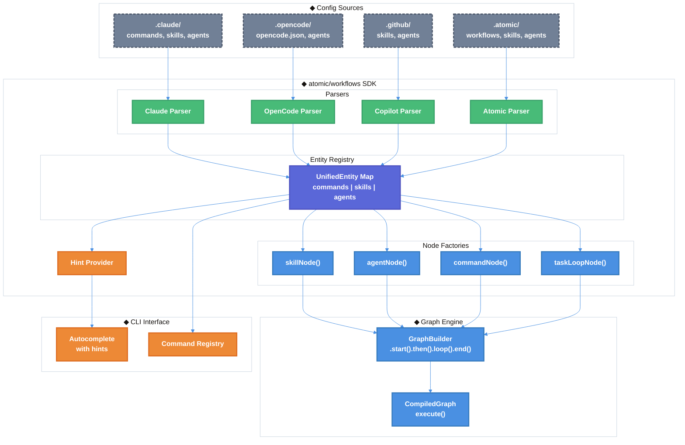

# Pluggable Workflows SDK Technical Design Document

| Document Metadata      | Details                                                       |
| ---------------------- | ------------------------------------------------------------- |
| Author(s)              | Developer                                                     |
| Status                 | Draft (WIP)                                                   |
| Team / Owner           | Atomic Core                                                   |
| Created / Last Updated | 2026-02-05                                                    |
| Research Reference     | `research/docs/2026-02-05-pluggable-workflows-sdk-design.md`  |

## 1. Executive Summary

This RFC proposes creating a unified `atomic/workflows` SDK that normalizes commands, skills, and agents from multiple provider formats (Claude, OpenCode, Copilot) into a single entity registry. The SDK enables name-based node references in workflow graphs (e.g., `skillNode({ skill: "commit" })`), generalizes the Ralph loop into a reusable `taskLoopNode` with `tasks.json`, and adds CLI argument hints for slash commands. This consolidates scattered entity loading logic, improves workflow authoring ergonomics, and enables provider-agnostic execution.

**Key Deliverables:**
1. **Unified Entity Registry** - Central storage for commands, skills, and agents from all providers
2. **Name-Based Node Factories** - `skillNode()`, `agentNode()`, `commandNode()` that resolve entities by name
3. **Generalized Task Loop** - `taskLoopNode()` for iterative workflows with `tasks.json`
4. **CLI Argument Hints** - Greyed-out hints after command names in autocomplete

## 2. Context and Motivation

### 2.1 Current State

**Architecture:** The atomic CLI currently has entity loading scattered across multiple files:

| Entity Type | Loading Location | Line Reference |
|-------------|------------------|----------------|
| Agents | `src/ui/commands/agent-commands.ts:1270-1298` | Discovery + parsing |
| Skills | `src/ui/commands/skill-commands.ts` | Builtin embedded prompts |
| Commands | `src/ui/commands/registry.ts:196-404` | Manual registration |
| Workflows | `src/ui/commands/workflow-commands.ts` | Ralph-specific |

**Provider Support:** Currently supports (per `agent-commands.ts:1270-1298`):
- `.claude/agents`, `~/.claude/agents` (project + user global)
- `.opencode/agents`, `~/.opencode/agents`
- `.github/agents`, `~/.copilot/agents`
- `.atomic/agents`, `~/.atomic/agents`

**Graph Engine:** The existing graph system (`src/graph/`) provides solid foundations:
- **NodeType:** `"agent" | "tool" | "decision" | "wait" | "ask_user" | "subgraph" | "parallel"` (`src/graph/types.ts:99`)
- **GraphBuilder** with fluent API: `.start()`, `.then()`, `.loop()`, `.if()`, `.parallel()` (`src/graph/builder.ts:136`)
- **Node factories:** `agentNode()`, `toolNode()`, `decisionNode()`, `clearContextNode()` (`src/graph/nodes.ts`)
- **Checkpointing:** `SessionDirSaver` for workflow state persistence (`src/graph/checkpointer.ts`)

**Reference:** [Research - Current Architecture](research/docs/2026-02-05-pluggable-workflows-sdk-design.md#current-architecture)

### 2.2 The Problem

**Fragmented Entity Loading:**
- Agents parsed in `agent-commands.ts` with provider-specific frontmatter handling (`lines 1003-1104`)
- Skills hardcoded as `BUILTIN_SKILLS` array in `skill-commands.ts`
- No unified lookup API for workflow node references
- Duplicate parsing logic for each provider format

**Limited Workflow Reusability:**
- Ralph workflow tightly coupled to `feature-list.json` structure
- No way to define custom iterative workflows with different task schemas
- Loop node can't reference skills/agents by name—requires inline configuration

**Missing CLI Hints:**
- Autocomplete shows command names and descriptions (`src/ui/components/autocomplete.tsx:146-235`)
- No argument hints after command name is typed (e.g., `--yolo`, `[message]`)
- Users must remember argument formats for each command

**User Impact:**
- Workflow authors must manually configure agent nodes instead of referencing by name
- Difficult to create reusable iterative workflows outside of Ralph
- Poor discoverability of command arguments

## 3. Goals and Non-Goals

### 3.1 Functional Goals

- [x] **G1:** Create unified `EntityRegistry` that normalizes entities from Claude, OpenCode, Copilot, and Atomic config formats
- [x] **G2:** Support name-based node references: `skillNode({ skill: "commit" })`, `agentNode({ agent: "debugger" })`
- [x] **G3:** Create `taskLoopNode` that generalizes Ralph's iteration pattern to arbitrary `tasks.json` files
- [x] **G4:** Add CLI argument hints that appear after typing a command name
- [x] **G5:** Maintain backward compatibility with existing Ralph workflow and command registration
- [x] **G6:** Provide `criteriaLoopNode` for "yolo mode" workflows without task files

### 3.2 Non-Goals (Out of Scope)

- [ ] Hot-reloading when config files change (future enhancement)
- [ ] Compile-time validation of workflow name references
- [ ] Cross-provider tool mapping (e.g., running Claude skills on OpenCode backend)
- [ ] Internationalization (i18n) for hints
- [ ] Parallel task execution in `tasks.json` (sequential only for v1)
- [ ] MCP server integration in entity registry (handled separately)

## 4. Proposed Solution (High-Level Design)

### 4.1 System Architecture Diagram



### 4.2 Architectural Pattern

**Registry Pattern** with **Provider-Specific Parsers**: Each provider config format has a dedicated parser that normalizes entities into a unified `UnifiedEntity` interface. The central `EntityRegistry` provides O(1) lookup by name with alias support.

**Key Patterns Adopted from External SDKs:**

| SDK | Pattern | Application |
|-----|---------|-------------|
| Claude Agent SDK | Session-based API | `skillNode` creates session for execution |
| OpenCode SDK | Config merging (later overrides earlier) | Priority: project > user > builtin |
| GitHub Copilot SDK | `defineTool()` with Zod validation | Future: schema validation for entities |

**Reference:** [Research - External SDK Patterns](research/docs/2026-02-05-pluggable-workflows-sdk-design.md#external-sdk-patterns)

### 4.3 Key Components

| Component | Responsibility | Technology | Justification |
|-----------|----------------|------------|---------------|
| `EntityRegistry` | Central entity storage and lookup | TypeScript Map | O(1) lookup, alias resolution |
| Provider Parsers | Normalize provider-specific formats | TypeScript | Isolate format differences |
| `skillNode()` | Resolve skill by name, execute | Graph node factory | Ergonomic workflow authoring |
| `agentNode()` overload | Resolve agent by name | Graph node factory | Backward compatible |
| `taskLoopNode()` | Iterate through tasks.json | Graph node factory | Reusable iteration pattern |
| `criteriaLoopNode()` | Loop until completion signal | Graph node factory | Yolo mode support |
| `HintProvider` | Supply CLI argument hints | TypeScript | Decoupled hint resolution |

## 5. Detailed Design

### 5.1 Package Structure

```
atomic/
└── workflows/
    ├── index.ts                 # Main exports, initializeWorkflowsSDK()
    ├── types.ts                 # UnifiedEntity, Task, TasksFile interfaces
    ├── registry/
    │   ├── entity-registry.ts   # EntityRegistry implementation
    │   ├── parsers/
    │   │   ├── types.ts         # ProviderParser interface
    │   │   ├── claude-parser.ts
    │   │   ├── opencode-parser.ts
    │   │   ├── copilot-parser.ts
    │   │   └── atomic-parser.ts
    │   └── normalizers/
    │       ├── model-normalizer.ts
    │       └── tools-normalizer.ts
    ├── graph/
    │   ├── node-resolvers.ts    # skillNode, agentNode, commandNode
    │   └── task-loop.ts         # taskLoopNode, criteriaLoopNode
    └── hints/
        └── hint-provider.ts     # getCommandHint()
```

### 5.2 Core Interfaces

**UnifiedEntity** (normalized entity representation):

```typescript
// atomic/workflows/types.ts

export type EntityType = "command" | "skill" | "agent";
export type ProviderType = "claude" | "opencode" | "copilot" | "atomic";
export type EntityLocation = "project" | "user" | "builtin";
export type AgentModel = "opus" | "sonnet" | "haiku" | "inherit";

export interface UnifiedEntity {
  /** Type of entity */
  type: EntityType;
  /** Canonical name (lowercase, used for lookup) */
  name: string;
  /** Human-readable description */
  description: string;
  /** Alternative names for lookup */
  aliases?: string[];
  /** Instruction/prompt content */
  prompt: string;
  /** Available tools (normalized to string array) */
  tools?: string[];
  /** Model to use for execution */
  model?: AgentModel;
  /** CLI argument hint (e.g., "[message] | --amend") */
  argumentHint?: string;
  /** Source information for conflict resolution */
  source: {
    provider: ProviderType;
    location: EntityLocation;
    path?: string;                 // Filesystem path if from file
  };
}
```

**TasksFile** (generalized from feature-list.json):

```typescript
// atomic/workflows/types.ts

export interface Task {
  /** Unique identifier */
  id: string;
  /** Task name/title */
  name: string;
  /** Detailed description */
  description?: string;
  /** Current status */
  status: "pending" | "in_progress" | "passing" | "failing" | "skipped";
  /** Execution priority (lower = higher priority) */
  priority?: number;
  /** Task IDs that must complete first */
  dependencies?: string[];
  /** Arbitrary metadata */
  metadata?: Record<string, unknown>;
}

export interface TasksFile {
  /** Schema version */
  version: "1.0";
  /** List of tasks */
  tasks: Task[];
  /** File metadata */
  metadata?: {
    createdAt: string;
    updatedAt: string;
    source?: string;               // "spec", "manual", "generated"
  };
}
```

**Reference:** [Research - Generalized Task Loop](research/docs/2026-02-05-pluggable-workflows-sdk-design.md#generalized-task-loop)

### 5.3 EntityRegistry API

```typescript
// atomic/workflows/registry/entity-registry.ts

export interface EntityRegistry {
  // ============== Registration ==============

  /** Register a single entity */
  register(entity: UnifiedEntity): void;

  /** Load and register all entities from a provider */
  registerFromProvider(provider: ProviderType, basePath: string): Promise<void>;

  // ============== Lookup (case-insensitive, alias-aware) ==============

  getCommand(name: string): UnifiedEntity | undefined;
  getSkill(name: string): UnifiedEntity | undefined;
  getAgent(name: string): UnifiedEntity | undefined;

  // ============== Search (for autocomplete) ==============

  searchCommands(prefix: string): UnifiedEntity[];
  searchSkills(prefix: string): UnifiedEntity[];
  searchAgents(prefix: string): UnifiedEntity[];

  // ============== Enumeration ==============

  allCommands(): UnifiedEntity[];
  allSkills(): UnifiedEntity[];
  allAgents(): UnifiedEntity[];

  // ============== Hints ==============

  getArgumentHint(name: string): string | undefined;
}

// Implementation
export function createEntityRegistry(): EntityRegistry {
  const entities = new Map<string, UnifiedEntity>();
  const aliases = new Map<string, string>();

  return {
    register(entity) {
      const key = `${entity.type}:${entity.name.toLowerCase()}`;
      entities.set(key, entity);

      if (entity.aliases) {
        for (const alias of entity.aliases) {
          aliases.set(`${entity.type}:${alias.toLowerCase()}`, key);
        }
      }
    },

    getCommand(name) {
      return get("command", name);
    },

    getSkill(name) {
      return get("skill", name);
    },

    getAgent(name) {
      return get("agent", name);
    },

    // ... other methods
  };

  function get(type: EntityType, name: string): UnifiedEntity | undefined {
    const key = `${type}:${name.toLowerCase()}`;
    const entity = entities.get(key);
    if (entity) return entity;

    const aliasKey = aliases.get(key);
    if (aliasKey) return entities.get(aliasKey);

    return undefined;
  }
}

// Global singleton
export const entityRegistry = createEntityRegistry();
```

**Priority Order:** When entities with the same name exist from multiple sources:
1. **Project-local** (highest priority) - overrides all
2. **User global** (~/.claude, ~/.atomic, etc.)
3. **Builtin** (lowest priority)

This matches existing behavior in `src/ui/commands/agent-commands.ts:1410-1422`.

### 5.4 Provider Parser Interface

```typescript
// atomic/workflows/registry/parsers/types.ts

export interface ProviderParser {
  /** Provider identifier */
  provider: ProviderType;

  /** Parse commands from provider config */
  parseCommands(basePath: string): Promise<UnifiedEntity[]>;

  /** Parse skills from provider config */
  parseSkills(basePath: string): Promise<UnifiedEntity[]>;

  /** Parse agents from provider config */
  parseAgents(basePath: string): Promise<UnifiedEntity[]>;
}
```

### 5.5 Provider Format Normalization

**Config Location Summary** (from [Research - Provider Config Formats](research/docs/2026-02-05-pluggable-workflows-sdk-design.md#provider-config-formats)):

| Provider | Commands | Skills | Agents |
|----------|----------|--------|--------|
| Claude | `.claude/commands/*.md` | `.claude/skills/*/SKILL.md` | `.claude/agents/*.md` |
| OpenCode | Inline in `opencode.json` | `.opencode/skills/*/SKILL.md` | `.opencode/agents/*.md` |
| Copilot | — | `.github/skills/*/SKILL.md` | `.github/agents/*.md` |
| Atomic | `.atomic/commands/*.md` | `.atomic/skills/*/SKILL.md` | `.atomic/agents/*.md` |

**Model Normalization:**

| Input Format | Normalized Output |
|--------------|-------------------|
| `opus`, `sonnet`, `haiku` | Pass-through |
| `anthropic/claude-opus-4-5` | `opus` |
| `anthropic/claude-3-sonnet` | `sonnet` |
| `anthropic/claude-3-5-haiku` | `haiku` |
| `claude-opus-4-5` | `opus` |
| `gpt-4o`, `gemini-1.5-pro` | `inherit` (unsupported provider) |

**Tools Normalization:**

| Input Format | Normalized Output |
|--------------|-------------------|
| `["bash", "edit"]` (array) | Pass-through |
| `{ bash: true, edit: true, write: false }` (OpenCode object) | `["bash", "edit"]` |
| `"Bash(git:*), Edit"` (Claude allowed-tools string) | `["bash", "edit"]` |

**Reference:** Existing normalization in `src/ui/commands/agent-commands.ts:1117-1169`

### 5.6 Node Resolver Factories

**skillNode()** - Resolve skill by name and execute:

```typescript
// atomic/workflows/graph/node-resolvers.ts

export interface SkillNodeConfig<TState extends BaseState> {
  /** Node identifier (defaults to "skill-{skillName}") */
  id?: NodeId;
  /** Name of the skill to resolve from registry */
  skill: string;
  /** Arguments to pass (static string or function of state) */
  args?: string | ((state: TState) => string);
  /** Model override (defaults to skill's model) */
  model?: ModelSpec;
}

export function skillNode<TState extends BaseState>(
  config: SkillNodeConfig<TState>
): NodeDefinition<TState> {
  return {
    id: config.id ?? `skill-${config.skill}`,
    type: "agent",
    model: config.model,
    execute: async (ctx): Promise<NodeResult<TState>> => {
      // 1. Resolve skill from registry
      const skill = entityRegistry.getSkill(config.skill);
      if (!skill) {
        throw new Error(`Skill not found: ${config.skill}`);
      }

      // 2. Build arguments
      const args = typeof config.args === "function"
        ? config.args(ctx.state)
        : config.args ?? "";

      // 3. Expand $ARGUMENTS placeholder
      const prompt = skill.prompt.replace(/\$ARGUMENTS/g, args || "[no arguments]");

      // 4. Execute via agent session
      const client = getClientProvider()();
      const session = await client.createSession({
        model: config.model ?? skill.model,
        tools: skill.tools,
      });

      try {
        const response = await session.send(prompt);
        return {
          stateUpdate: {
            outputs: {
              ...ctx.state.outputs,
              [config.id ?? `skill-${config.skill}`]: response.content,
            },
          } as Partial<TState>,
        };
      } finally {
        await session.destroy();
      }
    },
  };
}
```

**agentNode() overload** - Accept string name reference:

```typescript
export function agentNode<TState extends BaseState>(
  config: AgentNodeConfig<TState> | { agent: string; prompt?: string | ((state: TState) => string) }
): NodeDefinition<TState> {
  // String reference - resolve from registry
  if ("agent" in config && typeof config.agent === "string") {
    const agentDef = entityRegistry.getAgent(config.agent);
    if (!agentDef) {
      throw new Error(`Agent not found: ${config.agent}`);
    }
    return createAgentNodeFromDefinition(agentDef, config);
  }

  // Existing AgentNodeConfig - delegate to current implementation
  return existingAgentNode(config);
}
```

**commandNode()** - Execute command by name:

```typescript
export interface CommandNodeConfig<TState extends BaseState> {
  id?: NodeId;
  command: string;
  args?: string | ((state: TState) => string);
}

export function commandNode<TState extends BaseState>(
  config: CommandNodeConfig<TState>
): NodeDefinition<TState> {
  return {
    id: config.id ?? `command-${config.command}`,
    type: "tool",
    execute: async (ctx): Promise<NodeResult<TState>> => {
      const command = entityRegistry.getCommand(config.command);
      if (!command) {
        throw new Error(`Command not found: ${config.command}`);
      }

      const args = typeof config.args === "function"
        ? config.args(ctx.state)
        : config.args ?? "";

      const prompt = command.prompt.replace(/\$ARGUMENTS/g, args);

      // Execute command prompt via agent
      // ... similar to skillNode
    },
  };
}
```

**Reference:** [Research - Workflow Graph Node References](research/docs/2026-02-05-pluggable-workflows-sdk-design.md#workflow-graph-node-references)

### 5.7 Task Loop Node

```typescript
// atomic/workflows/graph/task-loop.ts

export interface TaskLoopConfig<TState extends TaskLoopState> {
  /** Node identifier */
  id?: NodeId;
  /** Path to tasks.json (static or derived from state) */
  tasksPath?: string | ((state: TState) => string);
  /** Node(s) to execute for each task */
  taskNodes: NodeDefinition<TState> | NodeDefinition<TState>[];
  /** Optional node to run before each iteration */
  preIterationNode?: NodeDefinition<TState>;
  /** Completion criteria (returns true when done) */
  until?: (state: TState, tasks: Task[]) => boolean;
  /** Maximum iterations (default: 100) */
  maxIterations?: number;
  /** Custom task selector (default: first pending with resolved dependencies) */
  taskSelector?: (tasks: Task[]) => Task | undefined;
}

export interface TaskLoopState extends BaseState {
  currentTask?: Task;
  iteration: number;
  shouldContinue: boolean;
  allTasksComplete?: boolean;
  maxIterationsReached?: boolean;
}

export function taskLoopNode<TState extends TaskLoopState>(
  config: TaskLoopConfig<TState>
): NodeDefinition<TState> {
  const {
    tasksPath = "research/tasks.json",
    until = defaultCompletionCheck,
    maxIterations = 100,
    taskSelector = defaultTaskSelector,
  } = config;

  return {
    id: config.id ?? "task-loop",
    type: "tool",
    execute: async (ctx): Promise<NodeResult<TState>> => {
      // 1. Load tasks file
      const path = typeof tasksPath === "function" ? tasksPath(ctx.state) : tasksPath;
      const tasksFile = await loadTasks(path);

      // 2. Check completion criteria
      if (until(ctx.state, tasksFile.tasks)) {
        return { stateUpdate: { shouldContinue: false } as Partial<TState> };
      }

      // 3. Check max iterations
      if (maxIterations > 0 && ctx.state.iteration >= maxIterations) {
        return {
          stateUpdate: {
            shouldContinue: false,
            maxIterationsReached: true,
          } as Partial<TState>,
        };
      }

      // 4. Select next task
      const nextTask = taskSelector(tasksFile.tasks);
      if (!nextTask) {
        return { stateUpdate: { shouldContinue: false, allTasksComplete: true } as Partial<TState> };
      }

      // 5. Update task status and persist
      nextTask.status = "in_progress";
      await saveTasks(path, tasksFile);

      return {
        stateUpdate: {
          currentTask: nextTask,
          iteration: (ctx.state.iteration ?? 0) + 1,
          shouldContinue: true,
        } as Partial<TState>,
      };
    },
  };
}
```

**Default Completion Check:**
```typescript
function defaultCompletionCheck<TState extends TaskLoopState>(
  _state: TState,
  tasks: Task[]
): boolean {
  const pending = tasks.filter(t => t.status === "pending");
  const failing = tasks.filter(t => t.status === "failing");
  return pending.length === 0 && failing.length === 0;
}
```

**Default Task Selector (respects dependencies):**
```typescript
function defaultTaskSelector(tasks: Task[]): Task | undefined {
  const completedIds = new Set(
    tasks.filter(t => t.status === "passing").map(t => t.id)
  );

  return tasks.find(t => {
    if (t.status !== "pending") return false;
    if (!t.dependencies) return true;
    return t.dependencies.every(dep => completedIds.has(dep));
  });
}
```

**Criteria Loop Node (for yolo mode):**

```typescript
export interface CriteriaLoopConfig<TState extends BaseState> {
  id?: NodeId;
  /** Nodes to execute each iteration */
  taskNodes: NodeDefinition<TState>[];
  /** Completion signal string to detect in output (e.g., "COMPLETE") */
  completionSignal?: string;
  /** Maximum iterations */
  maxIterations?: number;
}

export function criteriaLoopNode<TState extends BaseState>(
  config: CriteriaLoopConfig<TState>
): NodeDefinition<TState> {
  return {
    id: config.id ?? "criteria-loop",
    type: "tool",
    execute: async (ctx): Promise<NodeResult<TState>> => {
      // Check for completion signal in last output
      const lastOutput = getLastAgentOutput(ctx.state);
      if (config.completionSignal && lastOutput?.includes(config.completionSignal)) {
        return { stateUpdate: { shouldContinue: false, criteriaComplete: true } as Partial<TState> };
      }

      // Check max iterations
      if (config.maxIterations && ctx.state.iteration >= config.maxIterations) {
        return { stateUpdate: { shouldContinue: false, maxIterationsReached: true } as Partial<TState> };
      }

      return {
        stateUpdate: {
          iteration: (ctx.state.iteration ?? 0) + 1,
          shouldContinue: true,
        } as Partial<TState>,
      };
    },
  };
}
```

### 5.8 CLI Hints System

**Hint Provider:**

```typescript
// atomic/workflows/hints/hint-provider.ts

const BUILTIN_HINTS: Record<string, string> = {
  "ralph": "--yolo <prompt> | --resume <session-id> | --max-iterations <n>",
  "commit": "[message] | --amend",
  "research-codebase": "<question or topic>",
  "create-spec": "<research-doc-path>",
  "implement-feature": "[feature-id]",
  "create-feature-list": "<spec-path>",
  "create-gh-pr": "[title]",
  "explain-code": "<file-path> [function-name]",
  "model": "select | refresh | list [provider] | <model-name>",
  "compact": "[focus-instructions]",
  "resume": "[session-id]",
  "clear": "",  // No arguments
  "help": "[command-name]",
};

export function getCommandHint(commandName: string): string | undefined {
  // 1. Check entity registry for argument-hint field first
  const entity = entityRegistry.getCommand(commandName)
    ?? entityRegistry.getSkill(commandName);

  if (entity?.argumentHint) {
    return entity.argumentHint;
  }

  // 2. Fallback to builtin hints
  return BUILTIN_HINTS[commandName.toLowerCase()];
}
```

**Autocomplete Enhancement:**

Modify `src/ui/components/autocomplete.tsx` to:

1. Parse input to detect command vs arguments (`parseCommandInput()`)
2. Show greyed-out hint text when command is complete but no args typed
3. Hide hint when user starts typing arguments
4. Show hint again when user backspaces to command only

```typescript
function parseCommandInput(input: string): {
  commandName: string;
  hasArgs: boolean;
  argsText: string;
} {
  if (!input.startsWith("/")) {
    return { commandName: "", hasArgs: false, argsText: "" };
  }

  const withoutSlash = input.slice(1);
  const spaceIndex = withoutSlash.indexOf(" ");

  if (spaceIndex === -1) {
    return { commandName: withoutSlash, hasArgs: false, argsText: "" };
  }

  return {
    commandName: withoutSlash.slice(0, spaceIndex),
    hasArgs: true,
    argsText: withoutSlash.slice(spaceIndex + 1),
  };
}
```

**Hint State Machine:**

```
State: IDLE
  - User types "/" → SHOWING_SUGGESTIONS

State: SHOWING_SUGGESTIONS
  - User types more letters → Filter suggestions
  - User presses Tab → Complete to selected command → SHOWING_HINT
  - User presses Enter → Execute selected command → IDLE
  - User presses Space after valid command → SHOWING_HINT

State: SHOWING_HINT
  - User types any character → TYPING_ARGS (hint disappears)
  - User presses Enter → Execute command → IDLE
  - User presses Escape → IDLE

State: TYPING_ARGS
  - User backspaces to just command → SHOWING_HINT
  - User presses Enter → Execute command with args → IDLE
```

**Enhanced Suggestion Row:**

```typescript
function SuggestionRow({
  command,
  isSelected,
  hint,
}: {
  command: CommandDefinition;
  isSelected: boolean;
  hint?: string;
}): React.ReactNode {
  const { theme } = useTheme();
  const fgColor = isSelected ? theme.accent : theme.foreground;
  const hintColor = theme.muted;

  return (
    <box flexDirection="row" width="100%" paddingLeft={2} paddingRight={2}>
      <box width={20}>
        <text fg={fgColor} attributes={isSelected ? 1 : undefined}>
          /{command.name}
        </text>
      </box>
      {hint && (
        <box width={25}>
          <text fg={hintColor}>
            {hint.length > 23 ? hint.slice(0, 20) + "..." : hint}
          </text>
        </box>
      )}
      <box flexGrow={1}>
        <text fg={isSelected ? fgColor : theme.muted}>
          {command.description}
        </text>
      </box>
    </box>
  );
}
```

**Reference:** [Research - CLI Hints System](research/docs/2026-02-05-pluggable-workflows-sdk-design.md#cli-hints-system)

### 5.9 Initialization Flow

```typescript
// atomic/workflows/index.ts

export async function initializeWorkflowsSDK(options?: {
  providers?: ProviderType[];
  projectPath?: string;
  userPath?: string;
}): Promise<EntityRegistry> {
  const providers = options?.providers ?? ["claude", "opencode", "copilot", "atomic"];
  const projectPath = options?.projectPath ?? process.cwd();
  const userPath = options?.userPath ?? homedir();

  // 1. Register builtins (lowest priority)
  registerBuiltinEntities(entityRegistry);

  // 2. Parse user-global configs (medium priority)
  // Parallel loading for performance
  await Promise.all(
    providers.map(provider =>
      entityRegistry.registerFromProvider(provider, userPath)
    )
  );

  // 3. Parse project-local configs (highest priority - overrides)
  await Promise.all(
    providers.map(provider =>
      entityRegistry.registerFromProvider(provider, projectPath)
    )
  );

  return entityRegistry;
}

function registerBuiltinEntities(registry: EntityRegistry): void {
  // Register built-in skills (from BUILTIN_SKILLS in skill-commands.ts)
  for (const skill of BUILTIN_SKILLS) {
    registry.register({
      type: "skill",
      name: skill.name,
      description: skill.description,
      prompt: skill.prompt,
      aliases: skill.aliases,
      argumentHint: BUILTIN_HINTS[skill.name],
      source: {
        provider: "atomic",
        location: "builtin",
      },
    });
  }
}
```

**Integration with existing initialization:**

Call `initializeWorkflowsSDK()` from `initializeCommandsAsync()` in `src/ui/commands/index.ts`.

## 6. Alternatives Considered

| Option | Pros | Cons | Reason for Rejection |
|--------|------|------|----------------------|
| **A: Keep scattered loading** | No refactoring needed | Duplicated logic, hard to extend, no name-based lookup | Doesn't solve entity lookup problem |
| **B: Monolithic parser** | Single file to maintain | Hard to add new providers, poor separation | Violates single responsibility |
| **C: Plugin system (OpenCode-style)** | Maximum flexibility, dynamic loading | Over-engineered for current needs, runtime overhead | Complexity not justified yet |
| **D: Unified registry with parsers (Selected)** | Clean separation, easy to extend, O(1) lookup | Initial refactoring effort | Best balance of flexibility and simplicity |

## 7. Cross-Cutting Concerns

### 7.1 Security and Privacy

- **File Access:** All parsers use existing `readdirSync`/`readFileSync` patterns already in codebase
- **Path Traversal:** Use `node:path.join()` to prevent directory traversal attacks
- **Prompt Injection:** Entity prompts are treated as trusted (from user's own config files)
- **No Remote Loading:** All entities are local files only—no network requests

### 7.2 Observability Strategy

- **Metrics:** Track entity lookup latency, cache hit rates (future)
- **Logging:** Log entity registration count per provider at startup:
  ```
  [workflows] Registered 12 entities from claude (5 skills, 7 agents)
  [workflows] Registered 8 entities from opencode (3 skills, 5 agents)
  ```
- **Errors:** Throw descriptive errors when entities not found:
  ```
  Error: Skill not found: "comit" (did you mean "commit"?)
  ```

### 7.3 Scalability and Capacity Planning

- **Entity Count:** Expected <100 entities per project (registry is O(1) lookup)
- **Memory:** UnifiedEntity ~1KB each, negligible overhead (<100KB total)
- **Startup:** Async parsing with `Promise.all` for parallel provider loading (~50ms)

## 8. Migration, Rollout, and Testing

### 8.1 Deployment Strategy

- [ ] **Phase 1:** Create `atomic/workflows` package with entity registry and parsers
- [ ] **Phase 2:** Add node resolver factories (`skillNode`, `agentNode` overload, `commandNode`)
- [ ] **Phase 3:** Migrate `agent-commands.ts` discovery to use new parsers
- [ ] **Phase 4:** Add `taskLoopNode` and migrate Ralph workflow
- [ ] **Phase 5:** Enhance autocomplete with CLI hints

### 8.2 Data Migration Plan

**feature-list.json → tasks.json:**

The existing `research/feature-list.json` format:
```json
{
  "category": "functional",
  "description": "Add feature X",
  "steps": ["..."],
  "passes": true
}
```

Maps to new `tasks.json` format:
```json
{
  "version": "1.0",
  "tasks": [
    {
      "id": "1",
      "name": "Add feature X",
      "description": "Category: functional",
      "status": "passing",
      "metadata": { "steps": ["..."], "category": "functional" }
    }
  ],
  "metadata": {
    "createdAt": "2026-02-05T00:00:00Z",
    "updatedAt": "2026-02-05T00:00:00Z",
    "source": "migrated"
  }
}
```

**Migration Script:** Create utility to convert existing feature-list.json files.

### 8.3 Test Plan

**Unit Tests:**
- [ ] Parser tests for each provider format (Claude, OpenCode, Copilot, Atomic)
- [ ] Normalizer tests for model and tools conversion
- [ ] EntityRegistry lookup, alias resolution, search
- [ ] taskLoopNode completion checks and task selection
- [ ] criteriaLoopNode signal detection

**Integration Tests:**
- [ ] Full initialization flow with mock config files
- [ ] Workflow execution with name-based node references
- [ ] Ralph workflow migration validation

**End-to-End Tests:**
- [ ] CLI autocomplete with hints
- [ ] `/ralph` workflow with tasks.json
- [ ] Custom workflow creation and execution

## 9. Implementation Roadmap

### Phase 1: Entity Registry (Week 1)

| Task | Files to Create/Modify |
|------|------------------------|
| Create package structure | `atomic/workflows/**` |
| Implement Claude parser | `registry/parsers/claude-parser.ts` |
| Implement OpenCode parser | `registry/parsers/opencode-parser.ts` |
| Implement Copilot parser | `registry/parsers/copilot-parser.ts` |
| Implement Atomic parser | `registry/parsers/atomic-parser.ts` |
| Implement normalizers | `registry/normalizers/*.ts` |
| Create EntityRegistry | `registry/entity-registry.ts` |
| Update command initialization | `src/ui/commands/index.ts` |
| Unit tests | `tests/workflows/registry/**` |

### Phase 2: Graph Node Resolvers (Week 2)

| Task | Files to Create/Modify |
|------|------------------------|
| Create skillNode factory | `graph/node-resolvers.ts` |
| Add agentNode string overload | `graph/node-resolvers.ts` |
| Create commandNode factory | `graph/node-resolvers.ts` |
| Update workflow resolver | `src/graph/nodes.ts` |
| Unit tests | `tests/workflows/graph/**` |

### Phase 3: Generalized Task Loop (Week 2-3)

| Task | Files to Create/Modify |
|------|------------------------|
| Define tasks.json schema | `types.ts` |
| Create taskLoopNode | `graph/task-loop.ts` |
| Create criteriaLoopNode | `graph/task-loop.ts` |
| Migrate Ralph workflow | `src/workflows/ralph/workflow.ts` |
| Update create-feature-list skill | `.claude/commands/create-feature-list.md` |
| Migration script | `scripts/migrate-feature-list.ts` |
| Unit tests | `tests/workflows/task-loop/**` |

### Phase 4: CLI Hints System (Week 3)

| Task | Files to Create/Modify |
|------|------------------------|
| Add argumentHint to UnifiedEntity | `types.ts` |
| Create HintProvider | `hints/hint-provider.ts` |
| Enhance Autocomplete component | `src/ui/components/autocomplete.tsx` |
| Implement hint state machine | `src/ui/components/autocomplete.tsx` |
| Add hints to builtin commands | `hints/hint-provider.ts` |
| Unit tests | `tests/ui/components/autocomplete.test.tsx` |

### Phase 5: Integration & Testing (Week 4)

| Task | Files to Create/Modify |
|------|------------------------|
| Integration tests | `tests/workflows/integration/**` |
| E2E tests | `tests/e2e/workflows/**` |
| Performance benchmarks | `tests/workflows/perf/**` |
| Documentation | `docs/workflows-sdk.md` |

## 10. Open Questions / Unresolved Issues

- [ ] **Hot Reloading:** Should entity registry support file watchers for config changes during a session? (Likely deferred to future enhancement)

- [ ] **Compile-Time Validation:** Should workflow definitions be validated against entity registry at graph compile time rather than runtime? (Runtime validation is simpler, compile-time catches errors earlier)

- [ ] **Cross-Provider Execution:** When a workflow references a Claude skill but runs on OpenCode, how should tool permission mappings work? (Needs further research on tool interoperability)

- [ ] **Hint Truncation:** How should long argument hints be truncated in narrow terminals? (Current proposal: truncate at 23 chars with "...")

- [ ] **Task Dependencies:** Should tasks.json support `runAfter` for soft ordering vs `dependencies` for hard blocking? (v1: only hard dependencies)

## 11. Code References

### Existing Implementation Files

| File | Purpose | Key Lines |
|------|---------|-----------|
| `src/graph/types.ts` | NodeType, BaseState, ExecutionContext | 99, 109-116, 253-291 |
| `src/graph/builder.ts` | GraphBuilder fluent API | 38-50 (LoopConfig), 136 (class) |
| `src/graph/nodes.ts` | agentNode, toolNode, decisionNode factories | 57-94, 163-263 |
| `src/graph/nodes/ralph-nodes.ts` | implementFeatureNode, checkCompletionNode | 102-150 |
| `src/ui/commands/registry.ts` | CommandRegistry class | 196-374 |
| `src/ui/commands/agent-commands.ts` | Agent discovery, frontmatter parsing | 1003-1104, 1270-1298 |
| `src/ui/commands/skill-commands.ts` | BUILTIN_SKILLS, skill registration | - |
| `src/ui/components/autocomplete.tsx` | Autocomplete component | 146-235 |
| `src/workflows/ralph/workflow.ts` | Ralph workflow creation | 185-247 |
| `src/config/ralph.ts` | Ralph defaults | 70-77 |

### Related Research Documents

| Document | Topic |
|----------|-------|
| `research/docs/2026-02-05-pluggable-workflows-sdk-design.md` | Primary research (this spec's source) |
| `research/docs/2026-02-03-custom-workflow-file-format.md` | Workflow file format |
| `research/docs/2026-01-31-workflow-config-semantics.md` | Config semantics |
| `research/docs/2026-01-31-claude-agent-sdk-research.md` | Claude SDK patterns |
| `research/docs/2026-01-31-opencode-sdk-research.md` | OpenCode SDK patterns |
| `research/docs/2026-01-31-github-copilot-sdk-research.md` | Copilot SDK patterns |
| `research/docs/2026-01-31-atomic-current-workflow-architecture.md` | Current architecture |
