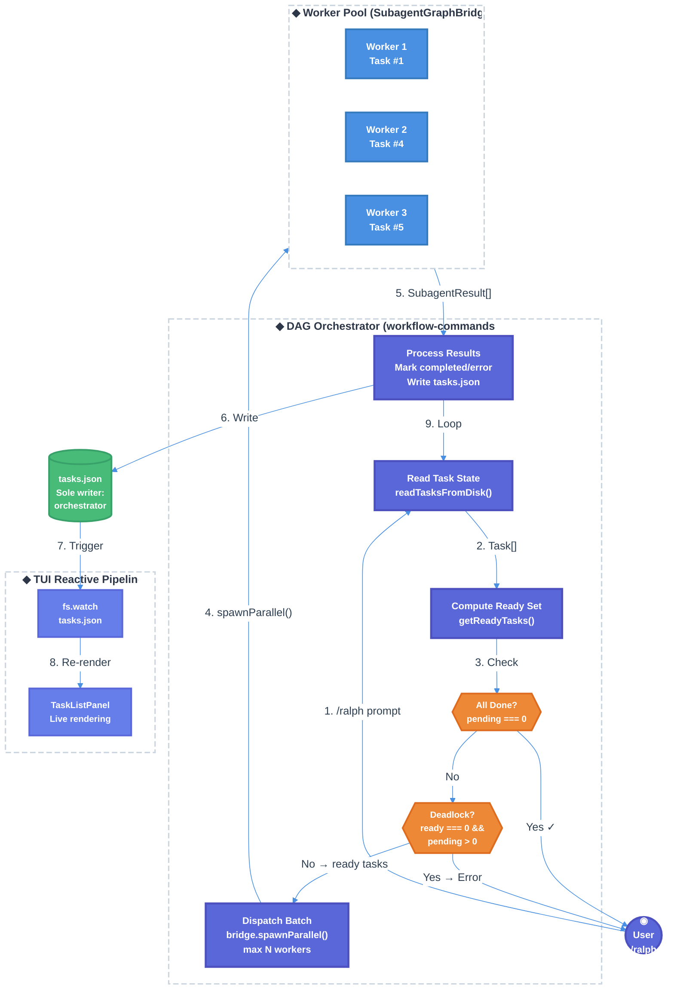

# Ralph DAG-Based Orchestration Technical Design Document

| Document Metadata      | Details                                                              |
| ---------------------- | -------------------------------------------------------------------- |
| Author(s)              | Developer                                                            |
| Status                 | Draft (WIP)                                                          |
| Team / Owner           | Atomic CLI                                                           |
| Created / Last Updated | 2026-02-15                                                           |
| Research               | `research/docs/2026-02-15-ralph-dag-orchestration-implementation.md` |
| Related Specs          | `specs/ralph-loop-enhancements.md`, `specs/ralph-task-list-ui.md`    |

## 1. Executive Summary

This RFC proposes replacing Ralph's serial worker loop with a DAG-based orchestrator that enforces `blockedBy` dependencies during task execution and dispatches multiple worker sub-agents in parallel. Currently, the worker loop in `workflow-commands.ts` spawns one worker at a time via `context.spawnSubagent()` and never checks `blockedBy` — workers self-select tasks from the full list without dependency awareness. The infrastructure for parallel execution already exists (`SubagentGraphBridge.spawnParallel()` using `Promise.allSettled()`), and the UI already updates reactively via `fs.watch` on `tasks.json`, but neither capability is used by Ralph. The proposed DAG orchestrator computes a "ready set" of tasks whose dependencies are satisfied, assigns specific tasks to workers (rather than letting workers self-select), dispatches up to N workers concurrently via `SubagentGraphBridge`, and loops until all tasks complete or a deadlock is detected. This eliminates dependency violations, reduces total wall-clock execution time for task graphs with parallelizable branches, and centralizes task state management to prevent file write conflicts.

## 2. Context and Motivation

### 2.1 Current State

The Ralph workflow is a two-phase system: (1) LLM-driven task decomposition that generates a `TodoItem[]` array with `blockedBy` dependency fields, and (2) a serial worker loop that iterates until all tasks are completed. The workflow is invoked via `/ralph "<prompt>"` and managed in `src/ui/commands/workflow-commands.ts`.

**Architecture:**

- **Task Decomposition**: `buildSpecToTasksPrompt()` (`src/graph/nodes/ralph.ts:19-58`) generates a prompt instructing the LLM to produce a JSON task array with `blockedBy` fields. The LLM response is parsed via `parseTasks()` (`workflow-commands.ts:650-667`), normalized via `normalizeTodoItems()`, and persisted to `tasks.json` via `saveTasksToActiveSession()`.

- **Worker Loop**: A serial `for` loop (`workflow-commands.ts:796-809`) reads tasks from disk, filters for `status !== "completed"`, sends the full task list to a single worker via `context.spawnSubagent({ name: "worker" })`, and blocks until the worker completes before starting the next iteration (Research: Section 1.1).

- **Sub-Agent Dispatch**: `context.spawnSubagent()` (`chat.tsx:3254-3269`) uses a single-slot `streamCompletionResolverRef` that holds exactly one resolver function. A second concurrent call would orphan the first promise (Research: Section 2.1).

- **Parallel Infrastructure (Unused)**: `SubagentGraphBridge.spawnParallel()` (`subagent-bridge.ts:184-208`) executes multiple sub-agents concurrently via `Promise.allSettled()`, each with an independent SDK session. `parallelSubagentNode()` (`nodes.ts:1802-1838`) wraps this in a graph node. Neither is used by Ralph (Research: Section 3).

- **`blockedBy` Data Model**: The field flows through the schema (`todo-write.ts:40-44`), normalization (`task-status.ts:69-80`), topological sort (`task-order.ts:19-122`), and UI rendering (`task-list-indicator.tsx:117-119`), but is **never enforced during task execution** (Research: Section 4).

**Limitations:**

- No dependency enforcement: Workers can pick blocked tasks, leading to incorrect execution order.
- Serial execution: Only one worker runs at a time, even when independent tasks could run in parallel.
- Worker self-selection: Workers receive the full task list and pick "highest priority" without checking `blockedBy`, which the worker agent definition confirms (`.claude/agents/worker.md:9`).

### 2.2 The Problem

- **Correctness**: Tasks with unsatisfied `blockedBy` dependencies can be selected by workers. If task #3 depends on task #1 and #2, a worker may start #3 before #1 or #2 completes, producing incorrect or broken output (Research: Section 1.1, observation 1).

- **Performance**: A task graph with independent branches (e.g., #1→#3, #2→#4) takes 4 serial iterations when it could complete in 2 parallel waves. For large projects with 10+ tasks, this can double or triple total execution time.

- **Concurrency Safety**: `saveTasksToActiveSession()` (`workflow-commands.ts:141-163`) uses `Bun.write()` which is not atomic for writes exceeding `PIPE_BUF`. With parallel workers writing via TodoWrite, the file could be corrupted (Research: Section 9).

- **No Deadlock Detection**: If a circular dependency exists in the task graph (e.g., #1 blocks #2, #2 blocks #1), the current loop runs until `maxIterations` is exhausted with no diagnostic feedback.

## 3. Goals and Non-Goals

### 3.1 Functional Goals

- [ ] **G1**: Enforce `blockedBy` dependencies during task execution — a task must not be dispatched to a worker until all tasks in its `blockedBy` array have `status === "completed"`.
- [ ] **G2**: Dispatch multiple workers in parallel for independent tasks using `SubagentGraphBridge.spawnParallel()`, with a configurable concurrency limit (default: 3).
- [ ] **G3**: Implement a "ready set" computation function that identifies tasks eligible for dispatch: `status === "pending"` and all `blockedBy` dependencies completed.
- [ ] **G4**: Assign specific tasks to workers (orchestrator-controlled) instead of sending the full task list for worker self-selection.
- [ ] **G5**: Detect deadlocks — when no tasks are ready but uncompleted tasks remain — and surface actionable diagnostics to the user.
- [ ] **G6**: Centralize task state mutations in the orchestrator to prevent concurrent file write conflicts. Workers report completion via `SubagentResult`, and the orchestrator is the sole writer to `tasks.json`.
- [ ] **G7**: Maintain backward compatibility with the existing `tasks.json` file-watcher UI pipeline (`TaskListPanel`, `TaskListIndicator`) so task progress renders in real-time.
- [ ] **G8**: Support resume semantics — when resuming a session, reset all `in_progress` tasks to `pending` (existing `normalizeInterruptedTasks()` behavior), then recompute the ready set and continue DAG traversal.
- [ ] **G9**: Implement dynamic DAG mutation (workers adding/removing tasks at runtime) in this iteration. Workers will be instructed to modify the task list.

### 3.2 Non-Goals (Out of Scope)

- [ ] We will NOT modify the `SubagentGraphBridge` implementation (`subagent-bridge.ts`). The existing `spawn()` and `spawnParallel()` methods are sufficient.
- [ ] We will NOT change the TodoWrite tool definition or schema (`todo-write.ts`). The `blockedBy` field already exists.
- [ ] We will NOT add a file locking mechanism. The centralized coordinator pattern (G6) eliminates the need for file locking.
- [ ] We will NOT modify the topological sort in `task-order.ts`. It remains a display-only utility. The ready-set function is a new, separate computation.
- [ ] We will NOT change the graph execution engine (`builder.ts`, `compiled.ts`). The DAG orchestrator is implemented within the Ralph command handler.

## 4. Proposed Solution (High-Level Design)

### 4.1 System Architecture Diagram



### 4.2 Architectural Pattern

We are adopting a **Centralized Coordinator / DAG Scheduler** pattern (Research: Section 10.1). The orchestrator maintains the authoritative task state, computes the ready set using dependency analysis, dispatches workers via `SubagentGraphBridge.spawnParallel()`, and is the sole writer to `tasks.json`. Workers are stateless executors that receive a single assigned task and report success/failure through their `SubagentResult`.

This pattern was chosen over:

- **Worker self-selection**: Workers picking from a shared task list introduces race conditions and dependency violations (current behavior).
- **File-locking approach**: Adding `proper-lockfile` for concurrent writes adds complexity without addressing the root cause (Research: Section 10.2).

### 4.3 Key Components

| Component                 | Responsibility                                   | Location                                         | Justification                                                                  |
| ------------------------- | ------------------------------------------------ | ------------------------------------------------ | ------------------------------------------------------------------------------ |
| DAG Orchestrator          | Compute ready set, dispatch workers, write state | `src/ui/commands/workflow-commands.ts`           | Replaces serial loop; centralized state management prevents write conflicts.   |
| `getReadyTasks()`         | Filter tasks eligible for dispatch               | `src/ui/components/task-order.ts`                | Colocated with existing topological sort; reuses normalization infrastructure. |
| `buildWorkerAssignment()` | Generate single-task prompt for worker           | `src/graph/nodes/ralph.ts`                       | Replaces `buildTaskListPreamble()` for assigned-task mode.                     |
| `detectDeadlock()`        | Identify circular dependencies at runtime        | `src/ui/components/task-order.ts`                | Leverages existing Kahn's algorithm infrastructure.                            |
| `SubagentGraphBridge`     | Parallel sub-agent session management            | `src/graph/subagent-bridge.ts`                   | Already production-ready; `spawnParallel()` provides `Promise.allSettled()`.   |
| Worker Agent              | Execute single assigned task                     | `.claude/agents/worker.md` (+ copilot, opencode) | Updated to accept assigned task instead of self-selecting.                     |

## 5. Detailed Design

### 5.1 Ready Set Computation: `getReadyTasks()`

**File**: `src/ui/components/task-order.ts` (new export, colocated with `sortTasksTopologically()`)

Computes the set of tasks eligible for dispatch by filtering for tasks that are `pending` and have all `blockedBy` dependencies `completed`. Reuses the existing `normalizeTaskId()` function for ID normalization (Research: Section 5.2).

```typescript
import type { NormalizedTodoItem } from "../utils/task-status.ts";

export function getReadyTasks(
    tasks: NormalizedTodoItem[],
): NormalizedTodoItem[] {
    // Build ID→status lookup for O(1) dependency resolution
    const statusById = new Map<string, string>();
    for (const task of tasks) {
        if (task.id) {
            const normalizedId = normalizeTaskId(task.id);
            if (normalizedId) statusById.set(normalizedId, task.status);
        }
    }

    return tasks.filter((task) => {
        if (task.status !== "pending") return false;

        // Tasks with no dependencies are immediately ready
        if (!task.blockedBy || task.blockedBy.length === 0) return true;

        // All blockers must be completed
        return task.blockedBy.every((blockerId) => {
            const normalized = normalizeTaskId(blockerId);
            if (!normalized) return true; // Unknown blockers don't block (graceful degradation)
            return statusById.get(normalized) === "completed";
        });
    });
}
```

**Edge cases:**

- Unknown blocker IDs (references to non-existent tasks): treated as non-blocking to avoid false deadlocks. A warning is logged.
- Tasks with `status === "in_progress"`: excluded from the ready set (already dispatched).
- Tasks with `status === "error"`: excluded (requires manual intervention or retry logic).

### 5.2 Deadlock Detection: `detectDeadlock()`

**File**: `src/ui/components/task-order.ts` (new export)

Returns `true` when no tasks are ready but uncompleted tasks remain — indicating a circular dependency or all remaining tasks are blocked by errored tasks.

```typescript
export interface DeadlockInfo {
    isDeadlocked: boolean;
    blockedTasks: NormalizedTodoItem[];
    reason: "cycle" | "error_dependency" | "none";
}

export function detectDeadlock(tasks: NormalizedTodoItem[]): DeadlockInfo {
    const uncompleted = tasks.filter((t) => t.status !== "completed");
    if (uncompleted.length === 0) {
        return { isDeadlocked: false, blockedTasks: [], reason: "none" };
    }

    const ready = getReadyTasks(tasks);
    const inProgress = tasks.filter((t) => t.status === "in_progress");

    if (ready.length === 0 && inProgress.length === 0) {
        // Determine reason: check if any blocker has status "error"
        const hasErrorDep = uncompleted.some((task) =>
            task.blockedBy?.some((bid) => {
                const dep = tasks.find(
                    (t) => normalizeTaskId(t.id) === normalizeTaskId(bid),
                );
                return dep && dep.status === "error";
            }),
        );

        return {
            isDeadlocked: true,
            blockedTasks: uncompleted,
            reason: hasErrorDep ? "error_dependency" : "cycle",
        };
    }

    return { isDeadlocked: false, blockedTasks: [], reason: "none" };
}
```

### 5.3 Worker Task Assignment: `buildWorkerAssignment()`

**File**: `src/graph/nodes/ralph.ts` (new export, alongside existing `buildTaskListPreamble()`)

Generates a focused prompt that assigns a single task to a worker. Unlike `buildTaskListPreamble()` which sends the entire task list and lets the worker self-select, this function directs the worker to implement one specific task (Research: Section 7.1).

```typescript
export function buildWorkerAssignment(
    task: NormalizedTodoItem,
    allTasks: NormalizedTodoItem[],
): string {
    const taskContext = allTasks
        .filter((t) => t.status === "completed")
        .map((t) => `- [x] ${t.id}: ${t.content}`)
        .join("\n");

    return `# Assigned Task

You are assigned to implement the following task. Do NOT work on any other task.

**Task ID**: ${task.id}
**Task**: ${task.content}
**Dependencies completed**: ${task.blockedBy?.join(", ") || "None"}

## Completed Tasks (Context)

${taskContext || "No tasks completed yet."}

## Instructions

1. Implement the task described above.
2. When finished, call the TodoWrite tool to mark this task as "completed".
3. Do NOT modify any other task's status.
4. If you encounter a blocking issue, mark the task as "error" with a description.
`;
}
```

### 5.4 DAG Orchestrator Loop

**File**: `src/ui/commands/workflow-commands.ts` (replaces the serial `for` loop at lines 796-809)

The orchestrator replaces both the fresh-start loop (lines 796-809) and the resume loop (lines 748-757) with a unified DAG-driven loop.

```typescript
// Constants
const DEFAULT_MAX_PARALLEL = 3;
const MAX_WAVES = 50; // Safety limit on scheduling iterations

async function runDAGOrchestrator(
    sessionDir: string,
    sessionId: string,
    context: CommandContext,
    options?: { additionalPrompt?: string; maxParallel?: number },
): Promise<void> {
    const bridge = getSubagentBridge();
    if (!bridge) {
        throw new Error(
            "SubagentGraphBridge not initialized. Cannot dispatch workers.",
        );
    }

    const maxParallel = options?.maxParallel ?? DEFAULT_MAX_PARALLEL;

    for (let wave = 0; wave < MAX_WAVES; wave++) {
        // 1. Read current task state from disk
        const tasks = await readTasksFromDisk(sessionDir);

        // 2. Check termination: all tasks completed
        const pending = tasks.filter((t) => t.status !== "completed");
        if (pending.length === 0) break;

        // 3. Compute ready set
        const ready = getReadyTasks(tasks);

        // 4. Check deadlock
        const deadlock = detectDeadlock(tasks);
        if (deadlock.isDeadlocked) {
            const taskIds = deadlock.blockedTasks.map((t) => t.id).join(", ");
            const reason =
                deadlock.reason === "cycle"
                    ? `Circular dependency detected among tasks: ${taskIds}`
                    : `Tasks blocked by errored dependencies: ${taskIds}`;
            context.addMessage("system", `⚠️ Deadlock detected: ${reason}`);
            break;
        }

        // 5. If no ready tasks but in-progress tasks exist, wait and retry
        if (ready.length === 0) {
            // This shouldn't happen with centralized coordinator since we
            // process results synchronously, but handle gracefully
            break;
        }

        // 6. Select batch (up to maxParallel)
        const batch = ready.slice(0, maxParallel);

        // 7. Mark batch as in_progress and write to disk
        const updatedTasks = tasks.map((t) => {
            const inBatch = batch.some(
                (b) => normalizeTaskId(b.id) === normalizeTaskId(t.id),
            );
            return inBatch ? { ...t, status: "in_progress" as const } : t;
        });
        await saveTasksToActiveSession(updatedTasks, sessionId);

        // 8. Build spawn options for parallel dispatch
        const spawnOptions: SubagentSpawnOptions[] = batch.map((task, i) => ({
            agentId: `worker-${task.id ?? i}-wave${wave}`,
            agentName: "worker",
            task:
                buildWorkerAssignment(task, updatedTasks) +
                (options?.additionalPrompt ?? ""),
            model: undefined, // Use default model
        }));

        // 9. Dispatch workers in parallel
        const results = await bridge.spawnParallel(spawnOptions);

        // 10. Process results: update task statuses
        const postTasks = await readTasksFromDisk(sessionDir);
        const finalTasks = postTasks.map((t) => {
            const batchIndex = batch.findIndex(
                (b) => normalizeTaskId(b.id) === normalizeTaskId(t.id),
            );
            if (batchIndex === -1) return t;

            const result = results[batchIndex];
            if (!result) return t;

            // If the worker already updated the task via TodoWrite, respect that.
            // Only override if the task is still "in_progress" (worker didn't update).
            if (t.status === "in_progress") {
                return {
                    ...t,
                    status: result.success
                        ? ("completed" as const)
                        : ("error" as const),
                };
            }
            return t;
        });
        await saveTasksToActiveSession(finalTasks, sessionId);
    }
}
```

**Key design decisions:**

1. **Centralized writes**: The orchestrator is the sole writer to `tasks.json`. Workers may call TodoWrite (which triggers the TUI interception pipeline), but the orchestrator re-reads and reconciles after each wave (Research: Section 10.1).

2. **Wave-based dispatch**: Instead of dispatching workers individually and managing promises with `Promise.race()`, we use wave-based batch dispatch via `spawnParallel()`. This is simpler and aligns with the existing bridge API. The trade-off is that faster-completing workers wait for the slowest worker in each wave before the next wave starts (Research: Section 12, Open Question 3).

3. **Safety limit**: `MAX_WAVES = 50` prevents infinite loops from implementation bugs. For a task list of N items, worst case is N waves (fully serial chain), so 50 is generous.

4. **Result reconciliation**: After workers complete, the orchestrator re-reads `tasks.json` (in case workers wrote via TodoWrite) and only overrides tasks still marked `in_progress`. This handles the case where workers update their own status.

### 5.5 Integration with `SubagentGraphBridge`

The orchestrator obtains the bridge via `getSubagentBridge()` (`subagent-bridge.ts:217-221`). The bridge must be initialized before the orchestrator runs. This is already handled during TUI startup via `setSubagentBridge()` (Research: Section 3.5).

**Session creation**: Each worker gets an independent SDK session created by the bridge's `CreateSessionFn` factory. This means workers run in isolated contexts and do not share the main TUI session (Research: Section 3.2). This is critical — it bypasses the single-slot `streamCompletionResolverRef` limitation entirely.

**TodoWrite interception**: Workers spawned via `SubagentGraphBridge` run in independent SDK sessions, so their TodoWrite calls may NOT be intercepted by the TUI's `handleToolExecute` pipeline (`chat.tsx:2026-2046`). The orchestrator compensates by writing `tasks.json` directly after processing results. The file watcher (`watchTasksJson`) picks up these writes and triggers UI re-renders (Research: Section 6.6).

### 5.6 Worker Agent Updates

**Files**: `.claude/agents/worker.md`, `.github/agents/worker.md`, `.opencode/agents/worker.md`

Updates to all three worker agent definitions:

1. **Task selection instruction** (currently line 9): Change from "Only work on the SINGLE highest priority task that is not yet marked as complete" to "You will be assigned a specific task by the orchestrator. Implement ONLY the assigned task."

2. **Remove TodoWrite full-list instruction**: Workers no longer need to call TodoWrite with the full task list on startup. The orchestrator manages the task list.

3. **Bug handling** (currently lines 84-96): Workers should NOT insert new tasks or modify `blockedBy` arrays in this iteration (Non-Goal: dynamic DAG mutation). If a blocking issue is encountered, the worker should mark its assigned task as `error` with a descriptive message.

4. **Fix path reference** (currently line 13): Change `~/.atomic/workflows/{session_id}` to `~/.atomic/workflows/sessions/{session_id}` (Research: Section 7.1).

### 5.7 `CommandContext` Extension

**File**: `src/ui/commands/registry.ts`

No changes to the `CommandContext` interface are needed. The DAG orchestrator calls `SubagentGraphBridge` directly rather than going through `context.spawnSubagent()`. The orchestrator still uses:

- `context.addMessage()` for deadlock/status messages
- `context.setRalphSessionDir()` / `context.setRalphSessionId()` for session binding
- `context.updateWorkflowState()` for workflow state tracking

### 5.8 Resume Semantics

**File**: `src/ui/utils/ralph-task-state.ts`

The existing `normalizeInterruptedTasks()` function resets `in_progress` → `pending` on resume. With parallel workers, multiple tasks may be `in_progress` simultaneously when interrupted. The existing function already handles this correctly — it resets ALL `in_progress` tasks, not just one (Research: Section 11.2).

After normalization, the DAG orchestrator's `getReadyTasks()` naturally recomputes the correct ready set for the resumed session.

## 6. Alternatives Considered

| Option                                                                                                                       | Pros                                                                                    | Cons                                                                                                                        | Reason for Rejection                                                                |
| ---------------------------------------------------------------------------------------------------------------------------- | --------------------------------------------------------------------------------------- | --------------------------------------------------------------------------------------------------------------------------- | ----------------------------------------------------------------------------------- |
| **A: Worker self-selection with `blockedBy` prompt** — Keep serial loop but update worker prompt to check `blockedBy`        | Minimal code changes; no architectural changes needed                                   | LLM compliance is non-deterministic; workers may still pick blocked tasks; no parallelism gained                            | Dependency enforcement must be deterministic, not LLM-dependent.                    |
| **B: File-locking with `proper-lockfile`** — Let workers write `tasks.json` concurrently with advisory locks                 | Workers retain full autonomy; existing loop structure preserved                         | Adds external dependency; lock contention under high concurrency; doesn't solve dependency enforcement                      | Treats symptoms (write conflicts) not root cause (no scheduling).                   |
| **C: Event-driven coordinator with `Promise.race()`** — Launch workers individually, dispatch next when any worker completes | Maximum parallelism; immediate wave-to-wave transition                                  | Complex promise management; harder to debug; `SubagentGraphBridge.spawn()` returns per-agent but no built-in race mechanism | Complexity unjustified for MVP; wave-based dispatch is simpler. Can be added later. |
| **D: External DAG library (`@microsoft/p-graph`)** — Use a third-party DAG execution engine                                  | Battle-tested; handles complex scheduling                                               | External dependency; overkill for task lists of 5-20 items; doesn't integrate with `SubagentGraphBridge`                    | Our task graphs are small; custom ready-set computation is ~20 lines.               |
| **E: Centralized coordinator with wave-based dispatch (Selected)**                                                           | Simple; no write conflicts; deterministic scheduling; reuses existing `spawnParallel()` | Slower than event-driven (waits for slowest worker per wave)                                                                | **Selected:** Simplicity and correctness outweigh the minor latency cost.           |

## 7. Cross-Cutting Concerns

### 7.1 Concurrency and State Safety

- **Single writer**: The orchestrator is the sole writer to `tasks.json`. Workers do NOT write directly. This eliminates all file-level race conditions (Research: Section 9).
- **Atomic writes**: Although not strictly necessary with a single writer, the orchestrator should use a write-to-temp-then-rename pattern for crash safety (Research: Section 10.3):
    ```typescript
    const tmp = `${tasksPath}.tmp.${randomBytes(6).toString("hex")}`;
    await Bun.write(tmp, JSON.stringify(tasks, null, 2));
    await fs.promises.rename(tmp, tasksPath);
    ```
- **Worker isolation**: Each worker runs in an independent SDK session via `SubagentGraphBridge.spawn()`. Workers cannot interfere with each other or the main TUI session.

### 7.2 Observability

- **Wave logging**: Each wave logs: wave number, ready set size, dispatched task IDs, and per-worker results (success/failure/duration).
- **Task status in UI**: The `TaskListIndicator` already renders status icons (`○` pending, `●` in_progress with blinking blue, `●` completed green, `✕` error red). With the orchestrator writing `in_progress` status before dispatch, users see real-time progress of parallel workers (Research: Section 6.5).
- **Worker output persistence**: `SubagentGraphBridge` persists each worker's output to `~/.atomic/workflows/sessions/{sessionId}/agents/{agentId}.json` (Research: Section 3.1). This provides post-mortem debugging for failed tasks.
- **Deadlock diagnostics**: When a deadlock is detected, the system message identifies the blocked tasks and whether the cause is a cycle or an error dependency.

### 7.3 Scalability

- **Concurrency limit**: Default `maxParallel = 3` prevents API rate limit exhaustion. This is configurable but should not exceed 5 for most LLM providers.
- **Task graph size**: The ready-set computation is O(N × M) where N is the number of tasks and M is the average `blockedBy` length. For typical task lists (5-20 items, 1-3 blockers each), this is negligible.
- **Session overhead**: Each parallel worker creates and destroys an SDK session. For 3 workers per wave, this means 3 concurrent API connections. The `SubagentGraphBridge` handles session lifecycle in a `finally` block (Research: Section 3.2).

## 8. Migration, Rollout, and Testing

### 8.1 Deployment Strategy

- [ ] **Phase 1**: Implement `getReadyTasks()` and `detectDeadlock()` with unit tests. No behavioral change.
- [ ] **Phase 2**: Implement `buildWorkerAssignment()` and update worker agent definitions. No behavioral change (not yet called).
- [ ] **Phase 3**: Replace serial loop with `runDAGOrchestrator()`. This is the behavioral change. Gate behind a feature check (e.g., `--parallel` flag or default-on).
- [ ] **Phase 4**: Remove the serial loop code path after validation.

### 8.2 Test Plan

**Unit Tests** (colocated with source):

- `task-order.test.ts`:
    - `getReadyTasks()`: linear chain (only first task ready), fan-out (multiple tasks ready), all completed (empty result), all blocked (empty result), mixed statuses, unknown blockers
    - `detectDeadlock()`: no deadlock (tasks ready), deadlock from cycle, deadlock from error dependency, no uncompleted tasks
- `ralph.test.ts`:
    - `buildWorkerAssignment()`: generates correct prompt with task context, handles missing blockedBy, includes completed task context

**Integration Tests**:

- DAG orchestrator with mock `SubagentGraphBridge`:
    - Linear chain: tasks execute in order (wave 1: #1, wave 2: #2, wave 3: #3)
    - Fan-out: independent tasks execute in same wave
    - Diamond pattern: #1→{#2,#3}→#4 executes in 3 waves
    - Worker failure: task marked as error, dependent tasks not dispatched
    - Deadlock: circular dependency detected and reported
    - Resume: interrupted session correctly restarts from ready set

**E2E Tests**:

- Full ralph workflow with parallel workers on a small task graph (3-5 tasks)
- Verify `TaskListPanel` renders in_progress for parallel tasks simultaneously
- Verify completed tasks trigger dependent task dispatch in next wave

## 9. Open Questions / Unresolved Issues

- [ ] **Wave latency vs. event-driven**: The wave-based approach waits for all workers in a batch to complete before dispatching the next wave. For highly skewed task durations (e.g., one 30s task and one 5min task), this wastes time. Should we implement `Promise.race()`-based dispatch as a follow-up? (Research: Open Question 3)

No, implement `Promise.race()` in this implementation, so done tasks can trigger the next wave immediately, without waiting for the slowest task in the batch. This adds complexity but significantly improves performance for skewed task durations. It also just expands the size of the agent sub-tree UI which is fine.

- [ ] **Worker TodoWrite behavior**: With `SubagentGraphBridge`, workers run in independent SDK sessions. Their TodoWrite calls may not be intercepted by the TUI pipeline. Should workers be explicitly instructed not to call TodoWrite, relying entirely on the orchestrator for status updates? Or should we ensure the bridge sessions route TodoWrite through the TUI?

For status updates, each worker should specifically update the `tasks.json` which is linked to the TUI's file watcher. This way, we maintain real-time UI updates without needing to route through the TUI's tool execution pipeline, which may not be feasible with independent SDK sessions.

- [ ] **Concurrency limit configuration**: Should `maxParallel` be a ralph command flag (`/ralph --parallel 3 "prompt"`) or a global config? What is the right default for different LLM providers?

No, do not add this parameter, there is no limit to the number of parallel workers that can be spawned, and users can control this via their LLM provider's rate limits and the number of tasks they create. Adding a `--parallel` flag adds complexity without significant user benefit, as users can manage concurrency through task graph design and LLM settings.

- [ ] **Error retry policy**: When a worker fails, should the orchestrator retry the task automatically? If so, how many retries? Should there be a backoff? This is deferred but the architecture should accommodate it.

Each task should be retried up to 3 times without any backoff. The orchestrator can track retry counts in memory during execution. If a task fails 3 times, it is marked as `error` and the system message indicates that the task has failed after maximum retries. This provides a simple retry mechanism without adding significant complexity. Note: error task states should be setup in a way to prevent infinite retry loops.

- [ ] **Dynamic DAG mutations**: Workers currently have instructions for inserting bug-fix tasks with updated `blockedBy`. This is explicitly in scope. How should the orchestrator detect and incorporate new tasks added by workers?

No, this is in scope, workers should be allowed to add new tasks with `blockedBy` dependencies. The orchestrator will detect new tasks on each wave by re-reading `tasks.json`. The ready set computation will naturally include any new tasks that become ready. This allows for dynamic DAG mutation without needing a separate mechanism.

- [ ] **SubagentGraphBridge initialization**: Is the bridge guaranteed to be initialized before the ralph command handler runs? What happens if the bridge is `undefined` — should we fall back to serial execution or error out?

Yes, the bridge is initialized during TUI startup before any commands can be executed. If the bridge is `undefined` when the orchestrator runs, this indicates a critical initialization failure. The orchestrator should throw an error and halt execution, as it cannot function without the bridge.

## 10. Implementation File Structure

```
src/
├── graph/
│   └── nodes/
│       └── ralph.ts                    # + buildWorkerAssignment() export
├── ui/
│   ├── commands/
│   │   └── workflow-commands.ts        # Replace serial loop with runDAGOrchestrator()
│   └── components/
│       ├── task-order.ts               # + getReadyTasks(), detectDeadlock() exports
│       └── task-order.test.ts          # + tests for new functions
.claude/agents/worker.md                # Updated task selection instructions
.github/agents/worker.md               # Updated task selection instructions
.opencode/agents/worker.md             # Updated task selection instructions
```
