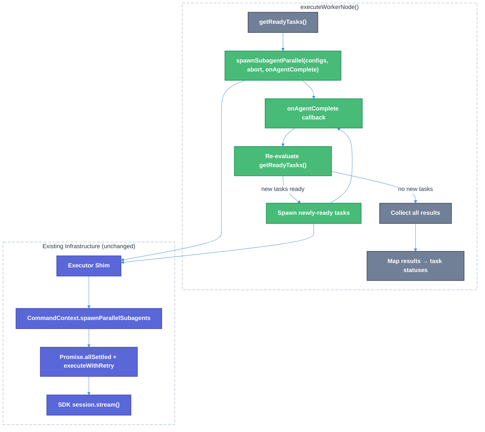

# Ralph Eager Sub-Agent Dispatch Technical Design Document

| Document Metadata      | Details                                                                                              |
| ---------------------- | ---------------------------------------------------------------------------------------------------- |
| Author(s)              | lavaman131                                                                                           |
| Status                 | Draft (WIP)                                                                                          |
| Team / Owner           | Atomic CLI                                                                                           |
| Created / Last Updated | 2026-03-18                                                                                           |
| Research               | `research/docs/2026-03-18-ralph-eager-dispatch-research.md`                                          |

## 1. Executive Summary

The Ralph workflow currently uses **batch-based dispatch**: all unblocked tasks are dispatched together, and the system blocks until the entire batch completes before checking for newly-unblocked tasks. This creates a **head-of-line blocking** problem — fast tasks that complete early and unblock downstream work cannot trigger new dispatches until the slowest task in the batch finishes.

This spec proposes **eager (as-soon-as-unblocked) dispatch** within the existing worker node, leveraging the `onAgentComplete` callback infrastructure that already exists end-to-end through the system but is unused by Ralph. The change is surgically scoped to `executeWorkerNode()` — no graph engine or loop DSL modifications are required. Downstream tasks are dispatched immediately as their dependencies resolve, eliminating unnecessary idle time in deep dependency chains.

## 2. Context and Motivation

### 2.1 Current State

The Ralph workflow is a three-phase compiled graph: **Planner → Worker Loop → Reviewer/Fixer**. The worker loop iterates over a `select-ready-tasks` → `worker` → `loop_check` cycle.

Within each worker loop iteration:
1. `select-ready-tasks` calls `getReadyTasks(state.tasks)` to find all tasks with `status === "pending"` whose `blockedBy` dependencies are all `"completed"`
2. `worker` calls `executeWorkerNode()` which dispatches ALL ready tasks via a single `await spawnSubagentParallel(configs, abortSignal)` call
3. Execution blocks until **every** agent in the batch completes
4. Results are mapped back to task statuses (`completed`/`error`)
5. `loop_check` evaluates exit conditions; if not met, loops back to `select-ready-tasks`

**Architecture diagram (current):**

```
┌─ WORKER LOOP ITERATION ──────────────────────────────────────┐
│                                                               │
│  select-ready-tasks                                           │
│    └─ getReadyTasks(tasks) → [A, B]  (all ready tasks)       │
│                                                               │
│  worker (executeWorkerNode)                                   │
│    ├─ Mark A, B → "in_progress"                               │
│    ├─ notifyTaskStatusChange(["A","B"], "in_progress")        │
│    ├─ await spawnSubagentParallel([A, B]) ← BLOCKS HERE      │
│    │     ├── Agent A completes at 5s  ──→ C now unblocked     │
│    │     │                                  but C CANNOT start │
│    │     └── Agent B completes at 60s                         │
│    ├─ Map results → A: completed, B: completed                │
│    └─ Return state update                                     │
│                                                               │
│  loop_check → not done → back to select-ready-tasks           │
│    └─ NOW C is discovered and dispatched (at t=60s)           │
└───────────────────────────────────────────────────────────────┘
```

**Source references:**
- `src/services/workflows/ralph/graph/index.ts:54-206` — `executeWorkerNode()`
- `src/services/workflows/ralph/graph/index.ts:134` — The blocking `await spawnSubagentParallel()` call
- `src/services/workflows/ralph/graph/task-helpers.ts:87-103` — `getReadyTasks()`
- `src/services/workflows/ralph/graph/index.ts:334-451` — `createRalphWorkflow()` graph definition

### 2.2 The Problem

**Head-of-line blocking**: When tasks have DAG dependencies, fast-completing tasks cannot unblock their downstream dependents until the entire batch finishes.

**Example DAG:**
```
A (5s) → C (5s) → E (5s)
B (60s) → D (5s)
```

| Metric | Batch Dispatch | Eager Dispatch |
|--------|---------------|----------------|
| When C starts | t=60s (after B) | t=5s (after A) |
| When E starts | t=65s (wave 3) | t=10s (after C) |
| When D starts | t=60s (wave 2) | t=60s (after B) |
| A→C→E chain completes | t=75s | t=15s |
| Total wall-clock | 75s (3 waves) | 65s (1 wave) |
| **Savings** | — | **~13% faster** |

With deeper dependency chains (e.g., 4+ levels), the savings compound significantly. Each additional wave boundary in batch dispatch adds the duration of the longest task in the preceding batch as wasted idle time.

**Ref:** `research/docs/2026-03-18-ralph-eager-dispatch-research.md` §4 "The Batch Problem (Head-of-Line Blocking)"

### 2.3 Why Now

1. The `onAgentComplete` callback infrastructure **already exists end-to-end** — Ralph simply doesn't use it (ref: research §5.1)
2. The previous DAG orchestrator spec (`specs/ralph-dag-orchestration.md` §9) explicitly called for `Promise.race()` for eager dispatch — this is the deferred follow-up
3. Users are reporting noticeable delays on complex multi-task workflows where independent chains have vastly different completion times

## 3. Goals and Non-Goals

### 3.1 Functional Goals

- [ ] Tasks whose `blockedBy` dependencies resolve mid-batch MUST be dispatched immediately without waiting for the rest of the batch
- [ ] Per-agent completion callback (`onAgentComplete`) MUST be wired from `executeWorkerNode` to `spawnSubagentParallel`
- [ ] Newly-spawned eager tasks MUST respect the same abort signal, stale timeout, and identity binding as batch-dispatched tasks
- [ ] Task status changes MUST be published to the EventBus in real time (per-task, not per-batch)
- [ ] The worker node MUST still return a single atomic `NodeResult<RalphWorkflowState>` containing all task updates from the entire eager dispatch wave
- [ ] Existing behavior for DAGs with no cross-batch dependencies MUST be preserved (no regression)
- [ ] `maxIterations` safety limit MUST still be enforceable

### 3.2 Non-Goals (Out of Scope)

- [ ] We will NOT modify the graph engine's BFS execution model — eager dispatch is contained entirely within the worker node
- [ ] We will NOT modify the loop DSL or `select-ready-tasks` / `loop_check` node structure
- [ ] We will NOT add concurrency limits in this version (future enhancement — see §9)
- [ ] We will NOT change the `spawnSubagentParallel` contract type signature — the existing `onAgentComplete` callback parameter is sufficient
- [ ] We will NOT add cross-worker-node eager dispatch (dispatching tasks from a future loop iteration within the current one)
- [ ] We will NOT change the reviewer/fixer phase — it still runs once after the loop exits

## 4. Proposed Solution (High-Level Design)

### 4.1 System Architecture Diagram



### 4.2 Architectural Pattern

**Reactive Cascading Dispatch** — an event-driven pattern where individual agent completions trigger re-evaluation of the dependency graph and immediate dispatch of newly-unblocked tasks. This is implemented as a **continuation-passing** mechanism within a single worker node execution, using the existing `onAgentComplete` callback as the trigger.

The pattern preserves the existing graph engine's single-node-at-a-time execution model by keeping all eager dispatch logic internal to the worker node, which already owns dispatch orchestration as a raw `NodeDefinition`.

### 4.3 Key Components

| Component | Responsibility | Change Type | Justification |
|-----------|---------------|-------------|---------------|
| `EagerDispatchCoordinator` | Manages in-flight tasks, re-evaluates readiness on completion, spawns new tasks | **New** | Encapsulates eager dispatch state machine; keeps `executeWorkerNode` clean |
| `executeWorkerNode()` | Entry point: delegates to coordinator instead of direct `await` | **Modified** | Thin orchestration wrapper |
| `getReadyTasks()` | DAG dependency resolution (unchanged) | **Unchanged** | Already correct — reused by coordinator |
| `spawnSubagentParallel` | Concurrent agent execution with `onAgentComplete` | **Unchanged** | Already supports the callback |
| `notifyTaskStatusChange` | Per-task status event emission | **Modified (call-site)** | Called per-task on eager dispatch instead of per-batch |

## 5. Detailed Design

### 5.1 `EagerDispatchCoordinator`

A new internal class within `src/services/workflows/ralph/graph/` that encapsulates the eager dispatch state machine.

**File:** `src/services/workflows/ralph/graph/eager-dispatch.ts`

```typescript
import type { SubagentSpawnOptions, SubagentStreamResult } from "@/services/workflows/graph/contracts/runtime.ts";
import type { TaskItem } from "@/services/workflows/ralph/state.ts";
import { getReadyTasks } from "./task-helpers.ts";

interface EagerDispatchConfig {
  spawnSubagentParallel: (
    agents: SubagentSpawnOptions[],
    abortSignal?: AbortSignal,
    onAgentComplete?: (result: SubagentStreamResult) => void,
  ) => Promise<SubagentStreamResult[]>;
  buildSpawnConfig: (task: TaskItem, index: number) => SubagentSpawnOptions;
  onTaskDispatched?: (task: TaskItem, spawnConfig: SubagentSpawnOptions) => void;
  onTaskCompleted?: (task: TaskItem, result: SubagentStreamResult) => void;
  abortSignal?: AbortSignal;
}

interface EagerDispatchResult {
  allResults: Map<string, SubagentStreamResult>;
  dispatchedTasks: Set<string>;
}

export class EagerDispatchCoordinator {
  private readonly tasks: TaskItem[];
  private readonly taskStatuses: Map<string, TaskItem["status"]>;
  private readonly results: Map<string, SubagentStreamResult>;
  private readonly dispatchedTaskIds: Set<string>;
  private readonly config: EagerDispatchConfig;
  private readonly pendingPromises: Map<string, Promise<SubagentStreamResult[]>>;

  constructor(tasks: TaskItem[], config: EagerDispatchConfig) {
    this.tasks = tasks;
    this.config = config;
    this.taskStatuses = new Map();
    this.results = new Map();
    this.dispatchedTaskIds = new Set();
    this.pendingPromises = new Map();

    // Snapshot initial statuses
    for (const task of tasks) {
      if (task.id) {
        this.taskStatuses.set(task.id, task.status);
      }
    }
  }

  async execute(): Promise<EagerDispatchResult> {
    // Dispatch initial ready tasks
    this.dispatchReadyTasks();

    // Wait for ALL in-flight work to complete
    await this.awaitAllPending();

    return {
      allResults: this.results,
      dispatchedTasks: this.dispatchedTaskIds,
    };
  }

  private dispatchReadyTasks(): void {
    // Build a virtual task list with current statuses
    const virtualTasks = this.tasks.map((task) => ({
      ...task,
      status: task.id ? (this.taskStatuses.get(task.id) ?? task.status) : task.status,
    }));

    const ready = getReadyTasks(virtualTasks).filter(
      (t) => t.id && !this.dispatchedTaskIds.has(t.id),
    );

    if (ready.length === 0) return;

    const spawnConfigs: SubagentSpawnOptions[] = [];
    for (const [index, task] of ready.entries()) {
      if (!task.id) continue;
      this.dispatchedTaskIds.add(task.id);
      this.taskStatuses.set(task.id, "in_progress");

      const spawnConfig = this.config.buildSpawnConfig(task, index);
      spawnConfigs.push(spawnConfig);
      this.config.onTaskDispatched?.(task, spawnConfig);
    }

    if (spawnConfigs.length === 0) return;

    const batchId = crypto.randomUUID();
    const promise = this.config.spawnSubagentParallel(
      spawnConfigs,
      this.config.abortSignal,
      (result) => this.handleAgentComplete(result),
    );

    this.pendingPromises.set(batchId, promise);

    // Clean up when batch resolves
    promise.then(() => this.pendingPromises.delete(batchId))
           .catch(() => this.pendingPromises.delete(batchId));
  }

  private handleAgentComplete(result: SubagentStreamResult): void {
    this.results.set(result.agentId, result);

    // Find the task this result belongs to and update status
    const task = this.findTaskByAgentId(result.agentId);
    if (task?.id) {
      this.taskStatuses.set(task.id, result.success ? "completed" : "error");
      this.config.onTaskCompleted?.(task, result);
    }

    // Re-evaluate: are new tasks now unblocked?
    this.dispatchReadyTasks();
  }

  private findTaskByAgentId(agentId: string): TaskItem | undefined {
    // Agent IDs follow the pattern "worker-{taskId}"
    return this.tasks.find((t) => t.id && agentId.startsWith(`worker-${t.id}`));
  }

  private async awaitAllPending(): Promise<void> {
    while (this.pendingPromises.size > 0) {
      await Promise.allSettled([...this.pendingPromises.values()]);
    }
  }
}
```

**Design rationale:**
- Encapsulates all mutable dispatch state (status tracking, in-flight promises, results) in a single coordinator instance
- `getReadyTasks()` is reused unchanged — the coordinator just maintains a virtual status map that reflects real-time completions
- Each `onAgentComplete` callback triggers a re-evaluation, creating a recursive cascade: complete → check readiness → dispatch new → complete → ...
- Multiple `spawnSubagentParallel` calls can be in-flight simultaneously (one per "wave" of eager dispatches)
- The coordinator awaits ALL pending promises before returning, ensuring atomic state updates

### 5.2 Modified `executeWorkerNode()`

The existing `executeWorkerNode()` function is modified to delegate to `EagerDispatchCoordinator` instead of directly calling `await spawnSubagentParallel()`.

**Key changes:**
1. Replace the single `await spawnSubagentParallel(spawnConfigs, abortSignal)` call with coordinator-based dispatch
2. Wire `onTaskDispatched` to emit `notifyTaskStatusChange` per-task
3. Wire `buildSpawnConfig` to reuse existing agent ID generation and identity binding logic
4. Collect all results from the coordinator and map them back to task statuses using the existing result-mapping logic

```typescript
// BEFORE (line 134):
const results = await spawnSubagentParallel(spawnConfigs, ralphCtx.abortSignal);

// AFTER:
const coordinator = new EagerDispatchCoordinator(state.tasks, {
  spawnSubagentParallel,
  buildSpawnConfig: (task, index) => buildSpawnConfigForTask(task, index, state),
  onTaskDispatched: (task, config) => {
    if (taskIdentity) {
      // Bind provider identity for correlation
    }
    notifyTaskStatusChange?.([task.id!], "in_progress", [/* runtime task */]);
  },
  onTaskCompleted: (task, result) => {
    notifyTaskStatusChange?.(
      [task.id!],
      result.success ? "completed" : "error",
      [/* runtime task */],
    );
  },
  abortSignal: ralphCtx.abortSignal,
});

const { allResults, dispatchedTasks } = await coordinator.execute();
```

### 5.3 State Management

**Invariant**: The worker node still returns a single `NodeResult<RalphWorkflowState>` with all task updates applied atomically. The graph engine's `mergeState()` sees one state update per worker execution, exactly as before.

**Internal state tracking:**
- The `EagerDispatchCoordinator` maintains a `Map<string, TaskItem["status"]>` that tracks real-time statuses during dispatch
- This map is used by `getReadyTasks()` (via virtual task list construction) to determine readiness without modifying the actual state
- After all work completes, the coordinator's results are mapped to the final task array using the existing result-mapping logic

**Iteration counter semantics:**
- `state.iteration` still increments by 1 per `executeWorkerNode()` invocation, regardless of how many eager dispatch waves occurred within it
- The `maxIterations` safety limit still applies at the loop level (in `loop_check`), not within a single worker node

### 5.4 Task Identity and Result Mapping

The existing `TaskIdentityService` binding and result-mapping logic are preserved:

1. **Identity binding**: Each eagerly-dispatched task gets `taskIdentity.bindProviderId()` called with its `spawnConfig.agentId`, just as batch-dispatched tasks do today
2. **Result resolution**: After the coordinator completes, `taskIdentity.resolveCanonicalTaskId("subagent_id", result.agentId)` maps each result back to its canonical task ID
3. **Task result envelope**: `buildTaskResultEnvelope()` is called per-result to attach output/error metadata

The coordinator's `buildSpawnConfig` callback encapsulates agent ID generation with the same deduplication logic (line 82-93 of current implementation).

### 5.5 Abort and Error Handling

| Scenario | Current Behavior | Eager Dispatch Behavior |
|----------|-----------------|------------------------|
| External abort signal | Aborts entire batch | Aborts all in-flight waves (all share the same abort signal) |
| Circuit breaker (stall retries exhausted) | Aborts entire batch via `parallelAbortController` | Same — abort propagates to all in-flight spawns |
| Individual task failure | Task marked `"error"`, batch continues | Task marked `"error"`, dependents naturally not dispatched (they remain blocked) |
| `maxIterations` reached | Loop exits after current batch | Loop exits after current worker node completes (all in-flight tasks finish) |
| All tasks error in a wave | Loop exits via `hasActionableTasks()` returning false | Same — coordinator stops dispatching, returns results |

**Error propagation for dependents:** If a task fails, its `status` is set to `"error"` in the coordinator's status map. Dependent tasks will never satisfy `getReadyTasks()` because their `blockedBy` entries won't have `status === "completed"`. They remain `"pending"` and are naturally skipped — no explicit blocking logic needed.

### 5.6 EventBus Integration

Task status changes are published to the EventBus in real time:

- **`in_progress`**: Published per-task as each is dispatched (including eagerly-dispatched tasks)
- **`completed`/`error`**: Published per-task as each agent completes via the `onTaskCompleted` callback

This is a behavioral improvement over the current system, which publishes `in_progress` for an entire batch at once and only publishes terminal statuses after the entire batch completes. The UI task list panel will update more responsively.

**Ref:** `research/docs/2026-02-28-workflow-issues-research.md` — identified that worker node doesn't set `in_progress` before spawning as a UI issue; eager dispatch naturally addresses this.

### 5.7 Sequence Diagram

```
executeWorkerNode()
│
├─ Create EagerDispatchCoordinator(tasks, config)
├─ coordinator.execute()
│   │
│   ├─ dispatchReadyTasks()
│   │   ├─ getReadyTasks() → [A, B] (initial batch)
│   │   ├─ Mark A, B → in_progress (status map)
│   │   ├─ Emit "in_progress" for A, B
│   │   └─ spawnSubagentParallel([A, B], abort, onAgentComplete)
│   │
│   ├─ [t=5s] Agent A completes → onAgentComplete(resultA)
│   │   ├─ handleAgentComplete(resultA)
│   │   │   ├─ Store result, mark A → completed
│   │   │   ├─ Emit "completed" for A
│   │   │   └─ dispatchReadyTasks()
│   │   │       ├─ getReadyTasks() → [C] (A's dependent)
│   │   │       ├─ Mark C → in_progress
│   │   │       ├─ Emit "in_progress" for C
│   │   │       └─ spawnSubagentParallel([C], abort, onAgentComplete)
│   │   │
│   │   ├─ [t=10s] Agent C completes → onAgentComplete(resultC)
│   │   │   ├─ handleAgentComplete(resultC)
│   │   │   │   └─ dispatchReadyTasks() → [E]
│   │   │   │       └─ spawnSubagentParallel([E], abort, onAgentComplete)
│   │   │   │
│   │   │   └─ [t=15s] Agent E completes
│   │   │
│   │   └─ [t=60s] Agent B completes → onAgentComplete(resultB)
│   │       └─ handleAgentComplete(resultB)
│   │           └─ dispatchReadyTasks() → [D]
│   │               └─ spawnSubagentParallel([D], abort, onAgentComplete)
│   │
│   ├─ [t=65s] Agent D completes → no new tasks ready
│   │
│   └─ awaitAllPending() → all promises resolved
│
├─ Map coordinator results → task status updates
└─ Return { stateUpdate: { tasks, iteration: state.iteration + 1 } }
```

## 6. Alternatives Considered

| Option | Pros | Cons | Reason for Rejection |
|--------|------|------|----------------------|
| **A: Modify loop structure** — Make `select-ready-tasks` and `worker` run per-task instead of per-batch | Simpler per-iteration logic | Requires loop DSL changes; increases graph node count; `iteration` semantics change; more state transitions | Graph engine modifications are out of scope; higher risk of regression across all workflows |
| **B: `Promise.race()` in worker node** — Use `Promise.race()` to detect first completion, then re-dispatch | Direct, no new abstraction | Complex promise lifecycle management; race conditions with result collection; hard to test | `onAgentComplete` callback achieves the same effect with cleaner semantics and is already implemented |
| **C: Graph-level parallel dispatch** — Extend graph engine to support multi-node parallelism | Most architecturally clean | Major graph engine refactor; breaks single-node-at-a-time invariant; affects all workflows | V2 workflow engine (ref: `research/docs/v1/2026-03-15-spec-04-workflow-engine.md`) will address this holistically |
| **D: `onAgentComplete` callback in worker node (Selected)** | Minimal change surface; uses existing infrastructure; isolated to Ralph; no graph engine changes | Multiple `spawnSubagentParallel` calls within one node (new pattern) | **Selected:** Lowest risk, highest leverage. The infrastructure already exists — we just need to use it. |

**Ref:** `specs/ralph-dag-orchestration.md` §9 — previously recommended `Promise.race()` (Option B); this spec supersedes with Option D as a cleaner approach using the callback infrastructure that was built since then.

## 7. Cross-Cutting Concerns

### 7.1 Observability

- **Task-level timing**: Each eager dispatch records `dispatchedAt` and `completedAt` timestamps per-task, enabling per-task latency analysis
- **Wave tracking**: The coordinator tracks how many "waves" of eager dispatch occurred within a single worker node execution for debugging
- **EventBus events**: Real-time `workflow.task.statusChange` events per-task (already wired via `notifyTaskStatusChange`)

### 7.2 Correctness Invariants

1. **No double-dispatch**: `dispatchedTaskIds` set prevents a task from being dispatched more than once, even if `getReadyTasks()` returns it in multiple re-evaluations
2. **No status regression**: Status transitions are monotonic: `pending → in_progress → completed|error`. The coordinator never moves a task backwards.
3. **Atomic state return**: Despite multiple internal dispatch waves, the worker node returns a single `NodeResult` — the graph engine sees one atomic state update
4. **Deterministic result mapping**: `findTaskByAgentId()` uses the stable `worker-{taskId}` naming convention established by the existing spawn config builder

### 7.3 Performance

- **No additional overhead for flat DAGs**: If all tasks are independent (no `blockedBy`), behavior is identical to current batch dispatch — one `spawnSubagentParallel` call, no re-evaluations
- **Eager dispatch overhead**: Each `onAgentComplete` callback runs `getReadyTasks()` which is O(n²) where n = total tasks. For realistic task counts (<100), this is negligible (<1ms)
- **Memory**: The coordinator holds a `Map` per task for statuses and results — trivial for expected task counts

## 8. Migration, Rollout, and Testing

### 8.1 Deployment Strategy

- [ ] **Phase 1**: Implement `EagerDispatchCoordinator` with unit tests. All existing tests must pass unchanged (coordinator with no cross-batch dependencies produces identical behavior to current batch dispatch).
- [ ] **Phase 2**: Modify `executeWorkerNode()` to use coordinator. Run full test suite including flow tests. Verify no regression in existing batch dispatch behavior.
- [ ] **Phase 3**: Add new tests specifically for eager dispatch scenarios (cross-batch dependency resolution, multi-wave dispatch, error propagation to dependents).

### 8.2 Test Plan

#### Unit Tests — `EagerDispatchCoordinator`

| Test | Description |
|------|-------------|
| `dispatches all independent tasks in a single spawnSubagentParallel call` | No `blockedBy` → single batch, identical to current behavior |
| `dispatches dependent tasks eagerly when parent completes` | A→B chain: B dispatched in `onAgentComplete` callback after A completes |
| `handles diamond dependencies correctly` | A→C, B→C: C dispatched only after both A and B complete |
| `does not dispatch tasks whose dependencies have errors` | A fails → B (blockedBy A) stays pending |
| `handles concurrent multi-wave dispatch` | Deep chain: A→B→C dispatches B when A completes, C when B completes |
| `does not double-dispatch tasks` | Same task never appears in two `spawnSubagentParallel` calls |
| `returns all results after all waves complete` | `execute()` promise resolves only when every in-flight agent finishes |
| `respects abort signal across all waves` | Abort propagates to eagerly-dispatched waves |
| `handles empty ready set gracefully` | All tasks blocked → no dispatch, returns empty results |

#### Integration Tests — `executeWorkerNode` with Coordinator

| Test | Description |
|------|-------------|
| `existing parallel dispatch tests pass unchanged` | All 5 tests in `graph.parallel-dispatch-core.suite.ts` must pass |
| `existing status tracking tests pass unchanged` | All 3 tests in `graph.parallel-dispatch-status.suite.ts` must pass |
| `emits per-task status changes during eager dispatch` | `notifyTaskStatusChange` called per-task, not per-batch |
| `iteration increments once per executeWorkerNode call` | Not per-wave |
| `task identity binding works for eagerly-dispatched tasks` | `taskIdentity.bindProviderId()` called for each wave |

#### Flow Tests

| Test | Description |
|------|-------------|
| `dependent tasks execute in correct order with eager dispatch` | End-to-end: planner → worker (with dependencies) → reviewer |
| `mixed independent and dependent tasks dispatch optimally` | Independent tasks dispatch immediately; dependent tasks dispatch as dependencies resolve |

### 8.3 Backward Compatibility

The change is fully backward-compatible:
- **No API changes**: `spawnSubagentParallel` type signature is unchanged
- **No graph engine changes**: Worker node is a raw `NodeDefinition` — its internal dispatch strategy is an implementation detail
- **No state schema changes**: `RalphWorkflowState` and annotations are unchanged
- **No loop structure changes**: `select-ready-tasks`, `loop_check`, and the loop DSL are unchanged
- **Behavioral equivalence for flat DAGs**: When no task has `blockedBy` dependencies, the coordinator dispatches all tasks in a single `spawnSubagentParallel` call — identical to current behavior

## 9. Open Questions / Unresolved Issues

- [ ] **Concurrency limits**: Should there be a maximum number of simultaneously-running sub-agents? With eager dispatch continuously spawning new tasks as others complete, large DAGs could lead to many concurrent agents. Options: (a) No limit (current behavior), (b) Configurable cap (e.g., `maxConcurrentAgents`), (c) Backpressure via semaphore.

- [ ] **Per-task vs per-batch status notification**: Should `notifyTaskStatusChange` be called once per task as each is dispatched/completed (more responsive UI), or should we batch notifications within a debounce window (fewer EventBus events)? The current spec proposes per-task.

- [ ] **Coordinator extraction scope**: Should `EagerDispatchCoordinator` be a standalone class in its own file (`eager-dispatch.ts`), or should it be inlined as a function within `executeWorkerNode()`? The spec proposes a separate class for testability, but a simpler function-based approach may suffice.

- [ ] **Wave-level logging**: Should the coordinator emit structured logs or debug events for each "wave" of eager dispatch (useful for debugging dispatch timing)? Options: (a) No logging, (b) Debug-level logs, (c) Emit a new `workflow.dispatch.wave` EventBus event.

- [ ] **Error cascade behavior**: When a task fails, should we immediately mark all transitively-dependent tasks as `"error"` (fail-fast), or leave them as `"pending"` so they could theoretically be retried in a future iteration? The current spec proposes leaving them `"pending"` (they simply never become ready since their dependency isn't `"completed"`).
