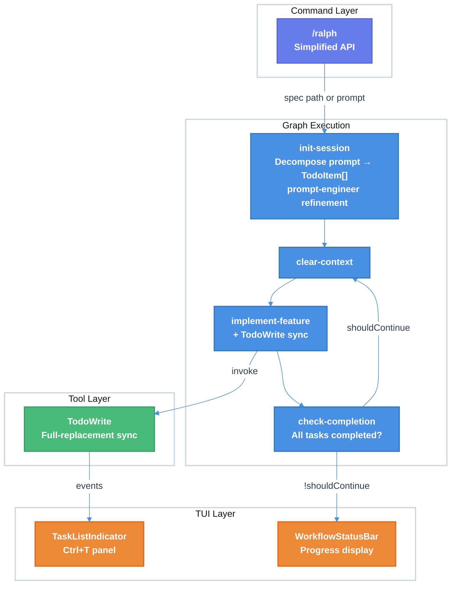

# Ralph Loop Enhancements Technical Design Document

| Document Metadata      | Details                                                   |
| ---------------------- | --------------------------------------------------------- |
| Author(s)              | Developer                                                 |
| Status                 | Draft (WIP)                                               |
| Team / Owner           | Atomic CLI                                                |
| Created / Last Updated | 2026-02-09                                                |
| Issue                  | #163                                                      |
| Research               | `research/docs/2026-02-09-163-ralph-loop-enhancements.md` |

## 1. Executive Summary

This spec proposes three enhancements to the Ralph Loop autonomous workflow engine: (1) replace the custom `feature-list.json` with `tasks.json` using the native `TodoItem` schema, relocate `progress.txt` to `.ralph/sessions/{id}/`, and unify yolo/spec modes into a single prompt-based API where the loop terminates when all tasks are completed; (2) integrate the `prompt-engineer` skill for automatic prompt refinement before execution; (3) remove dead-code config fields (`completionPromise`, `maxIterations` as primary termination) in favor of deterministic task-list completion. These changes unify two independent task tracking systems, dramatically simplify the command API, and make loop termination predictable.

## 2. Context and Motivation

### 2.1 Current State

The Ralph Loop is a graph-based autonomous workflow engine (`src/workflows/ralph/workflow.ts:185`) that iterates over features, delegating implementation to an AI coding agent. The graph structure is:

```
init-session -> LOOP(clear-context -> implement-feature) -> check-completion
```

Key architectural properties:
- **Two independent task tracking systems**: Ralph uses a custom `feature-list.json` + `progress.txt` + `session.json` file-based system (`src/graph/nodes/ralph-nodes.ts:1306-1425`), while the TUI has a generic TodoWrite tool + `TaskListIndicator` component (`src/sdk/tools/todo-write.ts:67`, `src/ui/components/task-list-indicator.tsx:58`). These systems do not interact. (Research: Section 3, "No Integration with Ralph")
- **Disconnected completion promise**: The `completionPromise` field exists in `RalphConfig` (`src/config/ralph.ts:34`), CLI flags (`src/cli.ts:262`), and session options (`src/commands/ralph.ts:83`), but is never consumed by any graph node. Yolo termination uses a hardcoded `COMPLETE` keyword (`src/graph/nodes/ralph-nodes.ts:677-698`). The `maxIterations` config default is `0` (unlimited), creating a risk of runaway loops. (Research: Section 5)
- **No prompt refinement**: The `prompt-engineer` skill is a pinned builtin (`src/ui/commands/skill-commands.ts:1112-1286`) but has zero integration with Ralph workflows. (Research: Section 4)

### 2.2 The Problem

- **User Impact**: Users must manually create `feature-list.json` in a specific wrapped format (`{ features: [...] }`) that differs from the flat array produced by the `create-feature-list` skill. The format mismatch (`research/docs/2026-02-09-163-ralph-loop-enhancements.md`, Open Question 1) means the skill output cannot be directly consumed by the Ralph engine.
- **UX Fragmentation**: Ralph's file-based progress tracking is invisible to the TUI's `TaskListIndicator` panel (Ctrl+T toggle). Users see no live task progress in the UI during Ralph execution, despite the ralph agent having `todowrite: true` in its agent definition (`.opencode/agents/ralph.md:9`).
- **Prompt Quality**: User prompts are passed directly to the agent without refinement. For complex tasks, poorly structured prompts lead to wasted iterations and context window exhaustion.
- **Unnecessary Complexity**: The yolo/spec mode distinction, `completionPromise` config (dead code), `COMPLETE` keyword detection, and `maxIterations` ceiling all exist to handle open-ended execution. But if every prompt — whether a spec path or natural language — is decomposed into an exhaustive task list, termination is deterministic: the loop ends when all tasks are completed. No signal detection or iteration limits needed.

## 3. Goals and Non-Goals

### 3.1 Functional Goals

- [ ] **G1**: Replace `feature-list.json` with `tasks.json` (`TodoItem[]` as JSON) and relocate `progress.txt` to `.ralph/sessions/{id}/`, so Ralph features appear in the TUI `TaskListIndicator` panel during execution via file-watch.
- [ ] **G2**: Unify the `/ralph` command API into a single `prompt` parameter: `/ralph "<prompt-or-spec-path>"`. Remove `--yolo`, `--feature-list`, `--max-iterations`, `--completion-promise` flags. The init node always decomposes the input into a `TodoItem[]` task list. The loop terminates when all tasks are completed.
- [ ] **G3**: Integrate `prompt-engineer` skill: before the first iteration, refine the user prompt using the skill's 7-step process, confirm via AskUserQuestion, then use the confirmed prompt for task decomposition.
- [ ] **G4**: Remove dead-code config fields (`completionPromise`, yolo-specific completion detection). Termination is deterministic: the loop exits when no pending tasks with empty `blockedBy` remain.
- [ ] **G5**: Relocate `progress.txt` to `.ralph/sessions/{id}/` and remove the `research/progress.txt` dependency.

### 3.2 Non-Goals (Out of Scope)

- [ ] We will NOT change the graph execution engine (`src/graph/builder.ts`, `src/graph/compiled.ts`). Changes are limited to Ralph-specific nodes and the command layer.
- [ ] We will NOT modify the TodoWrite tool definition (`src/sdk/tools/todo-write.ts`). The existing tool interface is sufficient.
- [ ] We will NOT add incremental TodoWrite updates. The existing full-replacement semantics are acceptable since Ralph tracks all features in state and can reconstruct the full list per invocation.
- [ ] We will NOT add a UI for the `prompt-engineer` refinement step. It runs silently as part of the init-session node.
- [ ] We will NOT change the `implement-feature` skill definition. The spec-to-task conversion happens in the Ralph init node using a recycled `create-feature-list` prompt (see Section 5.2.3).

## 4. Proposed Solution (High-Level Design)

### 4.1 System Architecture Diagram



### 4.2 Architectural Pattern

We are replacing the custom `RalphFeature` type with the native `TodoItem` type from the Claude Agent SDK (`docs/claude-agent-sdk/typescript-sdk.md:1207`, extended in `src/sdk/tools/todo-write.ts:53-59`). `RalphWorkflowState` stores `TodoItem[]` directly. Two files in `.ralph/sessions/{id}/` serve as the persistence and context-recovery mechanism: `tasks.json` (serialized `TodoItem[]`, parsed by the TUI file-watcher for live UI updates) and `progress.txt` (append-only narrative log with rich context — descriptions, acceptance criteria, errors — for the agent to read after context clearing).

### 4.3 Key Components

| Component              | Change                                                                                                                                                                                        | File(s)                                                                                                          | Justification                                                     |
| ---------------------- | --------------------------------------------------------------------------------------------------------------------------------------------------------------------------------------------- | ---------------------------------------------------------------------------------------------------------------- | ----------------------------------------------------------------- |
| `create-feature-list`  | **Remove entirely** — prompt recycled into `initRalphSessionNode` (Section 5.2.3)                                                                                                             | `skill-commands.ts:759-799,1513-1517`, `.claude/commands/`, `.github/skills/`, `.opencode/command/` (all delete) | Eliminated intermediate format; produces `TodoItem[]` directly    |
| `RalphFeature`         | **Remove entirely** — use `TodoItem` from `todo-write.ts:53` directly                                                                                                                         | `session.ts:43` (delete)                                                                                         | Single type for graph state, `tasks.json`, and TUI                |
| `initRalphSessionNode` | Unified init: detect file-or-prompt, prompt-engineer refinement, spec-to-tasks decomposition, initial `tasks.json` write                                                                      | `ralph-nodes.ts:1463`                                                                                            | Centralizes session initialization                                |
| `createClearNode()`    | Switch from summarization to full context clear                                                                                                                                               | `workflow.ts:112`                                                                                                | Cheaper than summarization; agent reads tasks.json + progress.txt |
| `implementFeatureNode` | Prompt instructs agent to read `tasks.json` + `progress.txt`, respect `blockedBy`                                                                                                             | `ralph-nodes.ts:903`                                                                                             | Agent self-recovers via file read after clear                     |
| `processFeatureImpl..` | On success: resolve `blockedBy`, write `tasks.json` + append `progress.txt`. On failure: insert bug-fix task, block failed task + dependents on fix                                           | `ralph-nodes.ts:1129`                                                                                            | Unblocks downstream features; bugs become trackable tasks         |
| `checkCompletionNode`  | Deterministic: loop exits when all tasks completed or no available tasks remain                                                                                                               | `ralph-nodes.ts:100`                                                                                             | No signal detection or iteration limits needed                    |
| `parseRalphArgs()`     | Simplify to discriminated union: `{ kind: "run", prompt }` or `{ kind: "resume", sessionId, prompt? }` — prompt required for new sessions, optional on resume                                 | `workflow-commands.ts:97`                                                                                        | Dramatic simplification                                           |
| Dead code removal      | **Remove**: `completionPromise` config, `processYoloResult()`, `checkYoloCompletion()`, `YOLO_COMPLETION_INSTRUCTION`, `--yolo`, `--max-iterations`, `--completion-promise`, `--feature-list` | `config/ralph.ts:34`, `cli.ts:262`, `commands/ralph.ts:83`, `ralph-nodes.ts:677,696,1225` (all delete)           | Simplification; termination is deterministic                      |
| `writeTasksJson()`     | New: write `tasks.json` (`TodoItem[]` as JSON)                                                                                                                                                | `ralph-nodes.ts` (new)                                                                                           | Replaces `feature-list.json` as structured task state             |
| `appendProgress()`     | Updated: append to `.ralph/sessions/{id}/progress.txt`                                                                                                                                        | `ralph-nodes.ts` (updated)                                                                                       | Relocated from `research/` to session directory                   |
| `watchTasksJson()`     | New: file-watch `tasks.json`, parse JSON, update TUI                                                                                                                                          | `workflow-commands.ts` (new)                                                                                     | Deterministic TUI sync without synthetic events                   |
| Message baking         | Preserve `id` and `blockedBy` in baked `taskItems`                                                                                                                                            | `chat.tsx:1730,1744,2322,3500`                                                                                   | Dependencies visible in completed messages                        |

## 5. Detailed Design

### 5.1 Enhancement 1: Replace `RalphFeature` with Native `TodoItem`

#### 5.1.1 Remove `RalphFeature` — Use `TodoItem` Directly

The existing `RalphFeature` interface (`session.ts:43-70`) is a custom type that duplicates the native TodoWrite `TodoItem` schema (`src/sdk/tools/todo-write.ts:53-59`). We eliminate `RalphFeature` entirely and use `TodoItem` as the canonical task type throughout `RalphWorkflowState` and the graph nodes.

**The `TodoItem` interface** (from `src/sdk/tools/todo-write.ts:53-59`, extended from the Claude Agent SDK's `TodoWriteInput` at `docs/claude-agent-sdk/typescript-sdk.md:1207-1225`):

```typescript
// src/sdk/tools/todo-write.ts:53-59 — this is the ONLY task type
interface TodoItem {
  id?: string;
  content: string;
  status: "pending" | "in_progress" | "completed";
  activeForm: string;
  blockedBy?: string[];
}
```

This type comes from the Claude Agent SDK `TodoWriteInput.todos` schema (`docs/claude-agent-sdk/typescript-sdk.md:1207`), extended by Atomic with `id` and `blockedBy` fields (`todo-write.ts:23-25`, `40-44`). The JSON schema enforces `required: ["content", "status", "activeForm"]` (`todo-write.ts:46`).

**What changes in `RalphWorkflowState`** (`ralph-nodes.ts:300`):

```typescript
export interface RalphWorkflowState extends BaseState {
  // ... existing fields ...

  // BEFORE: features: RalphFeature[];
  // AFTER:
  /** Task list — uses native TodoItem from the Claude Agent SDK */
  tasks: TodoItem[];

  /** Index of the currently active task */
  currentTaskIndex: number;

  /** List of task IDs that have been completed */
  completedTaskIds: string[];

  /** The task currently being implemented (null if none) */
  currentTask: TodoItem | null;
}
```

**Field mapping from removed `RalphFeature` → `TodoItem`:**

| `RalphFeature` field | `TodoItem` field            | Notes                                                                     |
| -------------------- | --------------------------- | ------------------------------------------------------------------------- |
| `id`                 | `id`                        | Now optional per `TodoItem`; set explicitly by graph nodes (e.g., `"#1"`) |
| `name`               | `content`                   | `TodoItem.content` is the task description text                           |
| `description`        | *(moved to `progress.txt`)* | Detailed description lives in the progress log, not in the task schema    |
| `acceptanceCriteria` | *(moved to `progress.txt`)* | Written as bullet points under each task's section in `progress.txt`      |
| `status: "passing"`  | `status: "completed"`       | Native `TodoItem` status enum                                             |
| `status: "failing"`  | `status: "pending"`         | Failed tasks are retried; they re-enter `"pending"`                       |
| `activeForm`         | `activeForm`                | Already in `TodoItem`; e.g., `"Implementing auth endpoint"`               |
| `blockedBy`          | `blockedBy`                 | Already in `TodoItem`                                                     |
| `implementedAt`      | *(dropped)*                 | Timestamps are recorded in `progress.txt`                                 |
| `error`              | *(dropped)*                 | Errors are recorded in `progress.txt`                                     |

**Where do the dropped fields go?**

The `description`, `acceptanceCriteria`, `implementedAt`, and `error` fields are **not lost** — they move to `progress.txt` (Section 5.1.5). `tasks.json` contains only the `TodoItem[]` array (the live state), and `progress.txt` contains the rich, per-iteration narrative including descriptions, acceptance criteria, errors, and timestamps. This follows the same pattern as the existing `/implement-feature` skill, which stores rich context in `research/progress.txt` while tracking pass/fail state in `research/feature-list.json`.

#### 5.1.2 No Mapping Layer Needed

Since `RalphWorkflowState.tasks` is now `TodoItem[]`, there is **no adapter or mapping function** between Ralph's internal state and the TodoWrite/TUI system. The task list in the graph state IS the TodoWrite data. `tasks.json` is serialized directly from `state.tasks` via `JSON.stringify()` and parsed back into `TodoItem[]` via `JSON.parse()`.

#### 5.1.3 Dependency Tracking with `blockedBy`

When tasks are extracted from a spec (Section 5.2.3), the init node expresses ordering dependencies using `TodoItem.blockedBy`. For example:

```typescript
const tasks: TodoItem[] = [
  {
    id: "#1",
    content: "Implement API endpoint for user auth",
    status: "pending",
    activeForm: "Implement API endpoint",
  },
  {
    id: "#2",
    content: "Write integration tests for auth endpoint",
    status: "pending",
    activeForm: "Write integration tests",
    blockedBy: ["#1"], // Cannot start until #1 is completed
  },
];
```

**Dependency resolution during execution:**

When `processFeatureImplementationResult()` marks a task as `"completed"`, it scans all remaining tasks and removes the completed task's ID from their `blockedBy` arrays:

```typescript
// In processFeatureImplementationResult, after marking task completed
const completedId = currentTask.id;
const updatedTasks = state.tasks.map((t) => {
  if (t.blockedBy?.includes(completedId!)) {
    return {
      ...t,
      blockedBy: t.blockedBy.filter((id) => id !== completedId),
    };
  }
  return t;
});
```

**Task selection respects dependencies:**

The `implementFeatureNode` selects the next task by finding the first `"pending"` task with an empty (or undefined) `blockedBy` array:

```typescript
const nextTaskIndex = state.tasks.findIndex(
  (t) => t.status === "pending" && (!t.blockedBy || t.blockedBy.length === 0)
);
```

This matches the Claude Code Task system's concept of task "availability" — a task is available when its status is `"pending"` and its `blockedBy` list is empty.

#### 5.1.4 Bug Detection and Dynamic Task Insertion

When a task implementation fails (e.g., tests fail, build breaks, runtime error), the failure is not silently retried. Instead, `processFeatureImplementationResult()` creates a **bug-fix task** and inserts it into the task list, blocking all tasks that depend on the failed feature.

**Bug handling flow:**

1. The agent attempts to implement task `#3`. Implementation fails (tests don't pass, build error, etc.).
2. `processFeatureImplementationResult()` detects the failure and:
   a. Marks `#3` as `"pending"` (not completed — it will be retried after the bug is fixed).
   b. Creates a new bug-fix task with a generated ID (e.g., `#3-bug-1`) and `blockedBy: []` (available immediately).
   c. Adds `#3-bug-1` to the `blockedBy` array of `#3` and any tasks that transitively depend on `#3`.
   d. Writes the updated task list to `tasks.json`.
   e. Appends the error context to `progress.txt`.

**Example state after a bug is detected:**

```json
[
  { "id": "#1", "content": "Set up project structure", "status": "completed", "activeForm": "Completed setup" },
  { "id": "#2", "content": "Implement auth endpoint", "status": "completed", "activeForm": "Completed auth" },
  { "id": "#3", "content": "Add rate limiting middleware", "status": "pending", "activeForm": "Implementing rate limiting", "blockedBy": ["#3-bug-1"] },
  { "id": "#3-bug-1", "content": "Fix: rate limiter crashes on concurrent requests", "status": "pending", "activeForm": "Fixing rate limiter crash" },
  { "id": "#4", "content": "Write integration tests for rate limiting", "status": "pending", "activeForm": "Writing integration tests", "blockedBy": ["#3"] }
]
```

In this example:
- `#3` failed. It is reset to `"pending"` and now blocked by `#3-bug-1`.
- `#3-bug-1` is a new bug-fix task with no blockers — the agent picks it up next.
- `#4` was already blocked by `#3` and remains blocked (transitively blocked by the bug fix).
- After `#3-bug-1` is completed, `#3` becomes available again and is retried.

**Implementation in `processFeatureImplementationResult()`:**

```typescript
if (!passed) {
  const bugId = `${currentTask.id}-bug-${Date.now()}`;
  const bugTask: TodoItem = {
    id: bugId,
    content: `Fix: ${errorSummary}`,
    status: "pending",
    activeForm: `Fixing ${errorSummary}`,
  };

  // Insert bug task and block the failed task (and its dependents) on the fix
  const updatedTasks = state.tasks.map((t) => {
    if (t.id === currentTask.id) {
      return {
        ...t,
        status: "pending" as const,
        blockedBy: [...(t.blockedBy ?? []), bugId],
      };
    }
    return t;
  });

  // Insert bug task right after the failed task
  const failedIndex = updatedTasks.findIndex((t) => t.id === currentTask.id);
  updatedTasks.splice(failedIndex + 1, 0, bugTask);

  state.tasks = updatedTasks;
}
```

**Bug ID naming convention**: `{parentTaskId}-bug-{timestamp}` (e.g., `#3-bug-1707500000000`). The timestamp suffix ensures uniqueness if a task fails multiple times.

**Why dynamic insertion instead of retry-in-place:**

- A bug fix is a distinct unit of work — it deserves its own task entry, progress log, and status tracking in the TUI.
- Downstream tasks that depend on the failed feature are automatically blocked until the bug is fixed, preventing cascading failures.
- The agent gets a clean context clear between the failure and the fix attempt, avoiding the "same context, same mistake" loop.
- The `progress.txt` log captures the bug as a separate iteration with error context, making debugging history auditable.

#### 5.1.5 File-Based Task Persistence (`tasks.json` + `progress.txt`)

The existing `/implement-feature` skill already uses a proven file-based recovery pattern: at the start of each iteration (after context clearing), the agent reads `research/progress.txt` + `research/feature-list.json` + `git log` to re-establish context (`.claude/commands/implement-feature.md`, "Getting up to speed" steps 2-3). We replace `feature-list.json` with `tasks.json` (structured task state) and keep `progress.txt` as a separate file (narrative progress log), both in the `.ralph/sessions/{sessionId}/` directory.

**File locations:**
- `.ralph/sessions/{sessionId}/tasks.json` — Structured task state (`TodoItem[]` as JSON)
- `.ralph/sessions/{sessionId}/progress.txt` — Narrative progress log (human-readable iteration history)

**`tasks.json` format:** A plain JSON file containing a `TodoItem[]` array. Deserialized with a single `JSON.parse()` call — no frontmatter parsing, no YAML library, no dependencies beyond the runtime:

```json
[
  {
    "id": "#1",
    "content": "Implement API endpoint for user auth",
    "status": "completed",
    "activeForm": "Completed API endpoint"
  },
  {
    "id": "#2",
    "content": "Write integration tests for auth endpoint",
    "status": "pending",
    "activeForm": "Write integration tests",
    "blockedBy": ["#1"]
  },
  {
    "id": "#3",
    "content": "Add rate limiting middleware",
    "status": "in_progress",
    "activeForm": "Implementing rate limiting"
  }
]
```

**`progress.txt` format:** A plain-text narrative log capturing rich context per iteration. This file is append-only and follows the same pattern the `/implement-feature` skill already uses ("Write summaries of your progress in `research/progress.txt`"):

```
## Iteration 1 — #1: Implement API endpoint for user auth
Description: Create POST /api/auth endpoint with JWT
Acceptance criteria:
- Returns 200 with valid token
- Returns 401 on bad credentials

Progress:
- ✓ Created POST /api/auth with JWT validation
- ✓ Added password hashing with bcrypt
- ✓ Tests passing, committed as abc1234
- Status: completed (2026-02-09T14:30:00Z)

## Iteration 2 — #3: Add rate limiting middleware
Description: Add rate limiting to prevent brute force attacks
Acceptance criteria:
- Token bucket algorithm with configurable limits
- Returns 429 on rate limit exceeded

Progress:
- ◉ In progress: implementing token bucket algorithm
- Installed express-rate-limit dependency
```

**Why two files instead of one:**

1. **`tasks.json` is pure `TodoItem[]`** — The file contains exactly the fields from the `TodoItem` interface (`id`, `content`, `status`, `activeForm`, `blockedBy`). No custom extensions. The UI parses this with `JSON.parse()` directly into `TodoItem[]` for the `TaskListIndicator` with zero transformation. No YAML library needed — JSON is built into the runtime.
2. **`progress.txt` carries the rich context** — Descriptions, acceptance criteria, error messages, timestamps, and implementation notes all live in a separate file. The agent reads this to understand what happened in prior iterations. This is the same `progress.txt` pattern the `/implement-feature` skill already uses, just relocated from `research/` to `.ralph/sessions/{sessionId}/`.
3. **Separation of concerns** — The structured state (`tasks.json`) changes on every task status update and is parsed by the UI. The narrative log (`progress.txt`) is append-only and read only by the agent for context recovery. Keeping them separate avoids re-writing the growing progress log on every status update.

#### 5.1.6 Write Points (Graph → Disk)

Both `tasks.json` and `progress.txt` are written by graph nodes at specific points:

**`tasks.json` write points** (task state updates):
1. **`initRalphSessionNode` exit**: Creates the initial `tasks.json` with all tasks (statuses `"pending"`, with `blockedBy` arrays).
2. **`processFeatureImplementationResult` exit (success)**: Overwrites `tasks.json` (marks task `"completed"`, resolves `blockedBy` on downstream tasks).
3. **`processFeatureImplementationResult` exit (failure)**: Overwrites `tasks.json` (inserts bug-fix task, blocks failed task and its dependents on the fix — Section 5.1.4).

**`progress.txt` write points** (narrative log, append-only):
1. **`initRalphSessionNode` exit**: Creates the initial `progress.txt` with a header and the task list summary.
2. **`processFeatureImplementationResult` exit**: Appends an iteration summary with rich context (description, acceptance criteria, result, errors).
3. **Resume with prompt**: Appends a "User instruction" entry with the additional prompt text.

The writes are implemented as helper functions:

```typescript
import { writeFile, appendFile } from "fs/promises";
import { join } from "path";
import type { TodoItem } from "../../sdk/tools/todo-write.ts";

async function writeTasksJson(
  sessionDir: string,
  tasks: TodoItem[]
): Promise<void> {
  const tasksPath = join(sessionDir, "tasks.json");
  await writeFile(tasksPath, JSON.stringify(tasks, null, 2), "utf-8");
}

async function appendProgress(
  sessionDir: string,
  entry: string
): Promise<void> {
  const progressPath = join(sessionDir, "progress.txt");
  await appendFile(progressPath, entry + "\n\n", "utf-8");
}
```

Each progress entry is built by a helper that captures the rich context (descriptions, acceptance criteria, errors) that does NOT live in the `TodoItem` schema:

```typescript
function buildProgressEntry(
  iteration: number,
  task: TodoItem,
  passed: boolean,
  context?: { description?: string; acceptanceCriteria?: string[]; error?: string }
): string {
  const status = passed ? "completed" : "failing";
  const icon = passed ? "✓" : "✗";
  const timestamp = new Date().toISOString();
  const lines = [
    `## Iteration ${iteration} — ${task.id}: ${task.content}`,
  ];
  if (context?.description) {
    lines.push(`Description: ${context.description}`);
  }
  if (context?.acceptanceCriteria?.length) {
    lines.push(`Acceptance criteria:`);
    context.acceptanceCriteria.forEach(c => lines.push(`- ${c}`));
  }
  lines.push(``, `Progress:`);
  lines.push(`- ${icon} Status: ${status} (${timestamp})`);
  if (context?.error) {
    lines.push(`- Error: ${context.error}`);
  }
  return lines.join("\n");
}
```

#### 5.1.7 Read Points (Disk → Agent Context)

The agent reads both `tasks.json` and `progress.txt` at the start of each iteration as part of its "Getting up to speed" recovery flow. This follows the same pattern as the existing `/implement-feature` skill, which instructs the agent to:

> "Read the git logs and progress files (`research/progress.txt`) to get up to speed on what was recently worked on."

The `implementFeatureNode` prompt instructs the agent to read both files:

```
1. Read `.ralph/sessions/{sessionId}/tasks.json` to see current task statuses and dependencies.
2. Read `.ralph/sessions/{sessionId}/progress.txt` to see progress history and context from prior iterations.
3. Read `git log --oneline -10` to see recent commits.
4. The next task to implement is: {feature.content} ({feature.id})
```

The agent reads both files via its `Read` tool — two tool calls, two files. This is the same pattern as the existing `/implement-feature` recovery flow which reads `progress.txt` + `feature-list.json`. No prompt injection or summarization needed.

#### 5.1.8 TUI Sync (Disk → TUI via File-Watch)

The TUI needs to update its `TaskListIndicator` panel after each task state change. Since the TUI cannot intercept a `Read` tool call the way it intercepts `TodoWrite` tool calls, we use a **file-watch + parse** mechanism on `tasks.json`:

1. When a Ralph workflow starts, the TUI sets up a file watcher on `.ralph/sessions/{sessionId}/tasks.json`.
2. On each file change (triggered by the graph node writing via `writeTasksJson()`), the watcher:
   a. Reads the file and parses with `JSON.parse()`.
   b. The parsed array IS already `TodoItem[]` — no conversion needed.
   c. Calls `setTodoItems()` to update the React state (`chat.tsx:1416`).
3. The `TaskListIndicator` re-renders with the updated statuses and `blockedBy` dependencies.

```typescript
import { watch } from "fs";
import { readFile } from "fs/promises";

function watchTasksJson(
  sessionDir: string,
  onUpdate: (items: TodoItem[]) => void
): () => void {
  const tasksPath = join(sessionDir, "tasks.json");
  const watcher = watch(tasksPath, async () => {
    try {
      const content = await readFile(tasksPath, "utf-8");
      const tasks = JSON.parse(content) as TodoItem[];
      onUpdate(tasks);
    } catch {
      // File may not exist yet or be mid-write; ignore
    }
  });
  return () => watcher.close();
}
```

The watcher is initialized when the workflow starts (in the Ralph command handler at `workflow-commands.ts`) and cleaned up when the workflow completes or is interrupted. Note that only `tasks.json` is watched — `progress.txt` is not watched by the TUI since it contains narrative context for the agent, not structured UI state.

**Why file-watch instead of synthetic tool events:**

- The TUI's TodoWrite interception (`chat.tsx:1537-1540`) expects tool events from the SDK streaming pipeline. Graph nodes do not participate in this pipeline — they execute outside the agent's tool-call loop. Emitting synthetic `TodoWrite` events from graph nodes would require plumbing into the SDK event system, which is fragile and couples the graph engine to the TUI.
- File-watching is decoupled: the graph writes, the TUI reads. No shared event bus needed. The `fs.watch` API is efficient (uses inotify on Linux, FSEvents on macOS) and triggers only on actual writes.

#### 5.1.9 Context Clearing Strategy

The context window is **cleared** (not summarized) between iterations. The `clearContextNode` at `workflow.ts:112` currently uses summarization (`context_window_warning` signal with `usage: 100`). Since the agent recovers all necessary context by reading `tasks.json` + `progress.txt` + `git log` at iteration start, summarization is unnecessary overhead — a full clear is cheaper and avoids the cost of an extra LLM call to produce a summary.

Update `createClearNode()` to use context clearing instead of summarization:

```typescript
function createClearNode() {
  return clearContextNode<RalphWorkflowState>({
    id: RALPH_NODE_IDS.CLEAR_CONTEXT,
    name: "Clear Context",
    description: "Clear context window at start of loop iteration",
    message: "Starting new iteration. Context cleared; read tasks.json and progress.txt to resume.",
  });
}
```

The agent's recovery is fully self-contained via the file system — no context carryover needed.

#### 5.1.10 Preserve `blockedBy` in Baked Messages

The current message baking logic at `chat.tsx:1730` strips `blockedBy` when baking `taskItems` into completed messages:

```typescript
// Current (drops blockedBy):
taskItems: todoItemsRef.current.map(t => ({ content: t.content, status: t.status }))
```

Update to preserve `id` and `blockedBy` for post-stream rendering:

```typescript
// Updated (preserves id and blockedBy):
taskItems: todoItemsRef.current.map(t => ({
  id: t.id,
  content: t.content,
  status: t.status,
  blockedBy: t.blockedBy,
}))
```

This applies to all baking sites: `chat.tsx:1730`, `1744`, `2322`, and `3500`. The `ChatMessage.taskItems` type at `chat.tsx:348` already includes `id?: string` and `blockedBy?: string[]`, so no type changes are needed.

#### 5.1.11 File-Based Tracking Consolidation

`tasks.json` replaces `feature-list.json` as the structured task state. `progress.txt` is kept as the narrative progress log but moves from `research/progress.txt` to `.ralph/sessions/{id}/progress.txt`.

The following are **removed**:
- `saveSessionFeatureList()` at `ralph-nodes.ts:1408-1425` — replaced by `writeTasksJson()`
- `feature-list.json` in session directory — replaced by `tasks.json`
- `FeatureListJson` interface at `ralph-nodes.ts:1306` — deleted
- `loadFeaturesFromFile()` at `ralph-nodes.ts:1350` — deleted

The following are **updated**:
- `initializeProgressFile()` at `ralph-nodes.ts:1381-1400` — updated to write to `.ralph/sessions/{id}/progress.txt` instead of `research/progress.txt`
- `appendProgress()` at `session.ts:526-538` — updated to use `buildProgressEntry()` and append to `.ralph/sessions/{id}/progress.txt`

The following are **kept**:
- `session.json` — still needed for session persistence and resume
- Session directory structure (`.ralph/sessions/{id}/`) — still needed
- `.ralph/sessions/{id}/progress.txt` — narrative progress log (relocated from `research/`)
- `.ralph/sessions/{id}/tasks.json` — **new**, structured task state (replaces `feature-list.json`)

### 5.2 Enhancement 2: Simplified `/ralph` Command API

#### 5.2.1 New Command Syntax

```
/ralph "<prompt-or-spec-path>"                  # Run with prompt or spec file
/ralph --resume <uuid>                          # Resume session (continues from tasks.json)
/ralph --resume <uuid> "<additional-prompt>"    # Resume session with additional instructions
```

The positional argument is a single `prompt` parameter. The init node determines whether it is a file path or natural language:

1. If the argument resolves to an existing file (checked via `fs.existsSync()`), the file contents are read and used as the prompt.
2. Otherwise, the argument is treated as a natural language prompt.

Both paths converge: the prompt (whether from file or directly) is refined via prompt-engineer (Section 5.3), then decomposed into `TodoItem[]` via `buildSpecToTasksPrompt()` (Section 5.2.3).

**Resume with a prompt**: When `--resume` is combined with a prompt, the session is restored from its existing `tasks.json` and the prompt is appended to the agent's context at the start of the next iteration. This allows users to provide course corrections, additional instructions, or context without re-decomposing the task list. The prompt is logged to `progress.txt` as a "User instruction" entry.

**Removed flags** (all of these):
- `--yolo` — no distinction between spec mode and yolo mode. A spec is just a more precise prompt.
- `--feature-list <path>` — replaced by the positional `prompt` argument.
- `--max-iterations N` — termination is deterministic (all tasks completed). No iteration ceiling needed.
- `--completion-promise <text>` — no signal detection. The loop exits when the task list is exhausted.

#### 5.2.2 Updated `parseRalphArgs()`

```typescript
export type RalphCommandArgs =
  | { kind: "run"; prompt: string }                              // prompt is required — command fails without it
  | { kind: "resume"; sessionId: string; prompt: string | null }; // --resume with optional additional prompt
```

Parsing validates that a prompt is required for new sessions, and allows an optional prompt when resuming:

```typescript
function parseRalphArgs(args: string): RalphCommandArgs {
  const trimmed = args.trim();

  // Check for --resume flag
  const resumeMatch = trimmed.match(/--resume\s+(\S+)/);
  if (resumeMatch) {
    // Extract any remaining text after --resume <uuid> as an additional prompt
    const rest = trimmed.replace(resumeMatch[0], "").trim();
    return { kind: "resume", sessionId: resumeMatch[1], prompt: rest || null };
  }

  // Prompt is required for new sessions — fail if empty
  if (!trimmed) {
    throw new Error(
      'Usage: /ralph "<prompt-or-spec-path>" or /ralph --resume <uuid> ["<prompt>"]\n' +
      "A prompt argument is required."
    );
  }

  return { kind: "run", prompt: trimmed };
}
```

#### 5.2.3 Spec-to-Tasks Conversion and `create-feature-list` Removal

The `create-feature-list` builtin skill is **removed entirely**. Its prompt is recycled into the Ralph init node, rewritten to produce `TodoItem[]` directly instead of the intermediate `{ category, description, steps, passes }` format. This eliminates the two-phase workflow (run `/create-feature-list`, then `/ralph`), the `FeatureListJson` wrapper interface, and the `RalphFeature` mapping layer.

**Files removed:**
- `.claude/commands/create-feature-list.md` — Claude Code command definition
- `.github/skills/create-feature-list/SKILL.md` — Copilot skill definition
- `.opencode/command/create-feature-list.md` — OpenCode command definition
- `BUILTIN_SKILLS` entry at `skill-commands.ts:759-799` — embedded prompt
- Secondary descriptor at `skill-commands.ts:1513-1517` — name/description/aliases
- Telemetry constant at `utils/telemetry/constants.ts:23` — allowed command name
- Telemetry hook at `.github/hooks/telemetry-session.ts:17` — command array entry

**Recycled prompt in `initRalphSessionNode`:**

In the init node, after prompt resolution (file read or direct string) and prompt-engineer refinement (Section 5.3), the node invokes an agent call with the following prompt — derived from the old `create-feature-list` skill but rewritten to produce `TodoItem[]` with `blockedBy` dependencies:

```typescript
function buildSpecToTasksPrompt(specContent: string): string {
  return `You are tasked with decomposing a feature specification into an ordered task list.

Read the following specification and create a structured JSON array of tasks to be implemented in order of highest to lowest priority.

<specification>
${specContent}
</specification>

# Output Format

Produce a JSON array where each element follows this exact schema:

\`\`\`json
[
  {
    "id": "#1",
    "content": "Concise description of the task",
    "status": "pending",
    "activeForm": "Present-participle form (e.g., 'Implementing auth endpoint')",
    "blockedBy": []
  },
  {
    "id": "#2",
    "content": "Write integration tests for auth endpoint",
    "status": "pending",
    "activeForm": "Writing integration tests",
    "blockedBy": ["#1"]
  }
]
\`\`\`

# Field Definitions

- \`id\`: Sequential identifier ("#1", "#2", "#3", ...).
- \`content\`: A concise, actionable description of the task.
- \`status\`: Always "pending" for new tasks.
- \`activeForm\`: Present-participle description shown in the UI spinner (e.g., "Implementing X", "Adding Y").
- \`blockedBy\`: Array of task IDs that must complete before this task can start. Use this for technical dependencies (e.g., tests blocked by implementation, UI blocked by API). Leave empty ([]) for tasks with no dependencies.

# Guidelines

- Parse the specification thoroughly. Every distinct deliverable should be a separate task.
- Order tasks by priority: foundational/infrastructure tasks first, then features, then tests, then polish.
- Analyze technical dependencies between tasks and populate \`blockedBy\` arrays. A task should list all tasks it directly depends on.
- Keep \`content\` concise (under 80 characters). Implementation details belong in the specification, not the task list.
- Output ONLY the JSON array. No surrounding text, no markdown fences, no explanation.`;
}
```

**Init node execution flow:**

1. **Resolve prompt**: If the prompt resolves to an existing file, read its contents. Otherwise, use the prompt string directly.
2. **Refine prompt**: Run prompt-engineer refinement and present via AskUserQuestion for confirmation (Section 5.3).
3. **Decompose into tasks**: Invoke an agent call with `buildSpecToTasksPrompt(confirmedPrompt)` to produce `TodoItem[]`.
4. **Parse response**: Extract the `TodoItem[]` JSON array from the agent's response.
5. **Write initial files**: Write `tasks.json` with the task list and `progress.txt` with a header and task summary.
6. **Initialize state**: Set `RalphWorkflowState.tasks` with the parsed `TodoItem[]`.

This is the same cost as the old `/create-feature-list` invocation (one agent call) but produces `TodoItem[]` directly — no intermediate format, no `RalphFeature` mapping, no format mismatch.

### 5.3 Enhancement 3: Prompt-Engineer Integration

#### 5.3.1 Integration Point

In `initRalphSessionNode`, after resolving the prompt (file read or direct string):

1. Load the prompt-engineer reference materials from `.github/skills/prompt-engineer/references/` (3 files: `core_prompting.md`, `advanced_patterns.md`, `quality_improvement.md`).
2. Apply the 7-step refinement process to the prompt:
   - Understand requirements from the prompt
   - Identify applicable techniques (CoT, chaining, etc.)
   - Structure the prompt with XML tags
   - Add quality controls
3. **Present the refined prompt to the user via AskUserQuestion** for confirmation before proceeding (see 5.3.3).
4. Store the confirmed prompt in `RalphWorkflowState.userPrompt`, replacing the original.
5. Log the original and refined prompts to the session's `agent-calls.jsonl`.

#### 5.3.2 Refinement as Agent Call

The refinement is implemented as an agent call within the init node:

```typescript
// In initRalphSessionNode, after resolving prompt
if (userPrompt) {
  const refinedPrompt = await refinePromptWithSkill(userPrompt, {
    references: loadPromptEngineerReferences(),
  });

  // Present refined prompt for user confirmation via AskUserQuestion
  const confirmed = await confirmRefinedPrompt(userPrompt, refinedPrompt);

  // Use confirmed prompt for task decomposition
  newState.userPrompt = confirmed;
}
```

The `refinePromptWithSkill()` function constructs a meta-prompt that asks the agent to refine the user's prompt following the prompt-engineer skill's methodology, then extracts the refined prompt from the agent's response.

#### 5.3.3 User Confirmation via AskUserQuestion

After prompt refinement, the `ask_question` tool is used to present the refined prompt to the user for approval. This is a human-in-the-loop checkpoint that prevents the autonomous loop from running with an unexpectedly transformed prompt.

The confirmation flow:

1. Display the **original prompt** and the **refined prompt** side-by-side in the question content.
2. Present options:
   - **"Use refined prompt" (Recommended)** — proceed with the prompt-engineer output
   - **"Use original prompt"** — skip refinement, use the user's original prompt as-is
   - **"Other"** (built-in) — user can manually edit/provide a custom prompt

```typescript
async function confirmRefinedPrompt(
  original: string,
  refined: string
): Promise<string> {
  // Uses the graph's interrupt mechanism to surface an AskUserQuestion tool call
  // The Ralph agent has `question: false` in its agent definition, but this
  // confirmation uses the workflow-level interrupt (not the agent's ask_question tool)
  const response = await askUserQuestion({
    question: "The prompt-engineer skill refined your prompt. Which version should Ralph use?",
    header: "Prompt",
    options: [
      {
        label: "Use refined prompt (Recommended)",
        description: truncate(refined, 120),
      },
      {
        label: "Use original prompt",
        description: truncate(original, 120),
      },
    ],
  });

  if (response.selected === "Use refined prompt (Recommended)") {
    return refined;
  } else if (response.selected === "Use original prompt") {
    return original;
  } else {
    // User provided custom text via "Other"
    return response.customText;
  }
}
```

**Implementation note**: The Ralph agent definition (`.opencode/agents/ralph.md`) has `question: false` to prevent the agent from asking questions during autonomous execution. The prompt confirmation is a **workflow-level interrupt** (using the existing `RalphExecutor` interrupt handling at `executor.ts:80`), not an agent-level tool call. This means the question surfaces in the TUI before the loop begins, without changing the agent's autonomous behavior during iterations.

### 5.4 Enhancement 4: Deterministic Task-List Termination

#### 5.4.1 Termination Logic

The loop terminates when the task list is exhausted — no signal detection, no iteration limits, no `COMPLETE` keyword. The `checkCompletionNode` evaluates a single condition:

```typescript
function shouldContinue(state: RalphWorkflowState): boolean {
  // Find the next available task: pending with no blockers
  const hasAvailableTask = state.tasks.some(
    (t) => t.status === "pending" && (!t.blockedBy || t.blockedBy.length === 0)
  );
  return hasAvailableTask;
}
```

**The loop exits when `shouldContinue()` returns `false`**, which happens in two scenarios:
1. **All tasks completed**: Every task in `state.tasks` has `status: "completed"`. This is the expected termination.
2. **No available tasks**: All remaining pending tasks have non-empty `blockedBy` arrays (circular dependency or unresolvable blocker). This is an error state — the workflow logs a warning and exits with a summary of blocked tasks.

**Why this is sufficient:**

- Every prompt — whether a spec file or natural language — is decomposed into an exhaustive `TodoItem[]` task list in the init node (Section 5.2.3). The task list represents the complete scope of work.
- Each iteration implements exactly one available task and marks it `"completed"`, resolving downstream `blockedBy` dependencies.
- Bug-fix tasks are dynamically inserted on failure (Section 5.1.4) and are included in the termination check. The loop does not exit until all tasks — including bug-fix tasks — are completed or blocked.
- Progress is monotonic: tasks only move forward (`pending` → `in_progress` → `completed`). The task list is finite (bug-fix tasks are bounded by the number of failures). Therefore termination is guaranteed.

#### 5.4.2 Dead Code Removal

The following are **removed entirely** — they were either dead code (never wired) or made obsolete by deterministic termination:

- `completionPromise` field from `RalphConfig` (`config/ralph.ts:34`)
- `--completion-promise` CLI flag (`cli.ts:262`)
- `completionPromise` from session options (`commands/ralph.ts:83`)
- `YOLO_COMPLETION_INSTRUCTION` dynamic builder (`ralph-nodes.ts:677`)
- `COMPLETION_INSTRUCTION` constant — no completion signal needed
- `checkYoloCompletion()` function (`ralph-nodes.ts:696`) — no signal detection needed
- `processYoloResult()` function (`ralph-nodes.ts:1225`) — no yolo mode distinction
- `maxIterations` config field, CLI flag, and defaults — no iteration ceiling needed
- `DEFAULT_MAX_ITERATIONS` constant (`workflow-commands.ts:61`) — deleted
- `buildTerminationConditionsPrompt()` — no iteration-based termination prompts

#### 5.4.3 Builder `maxIterations` Handling

Since Ralph no longer uses `maxIterations`, the graph builder's `.loop()` is invoked without an iteration limit. The builder should pass `Infinity` (or omit `maxIterations`) so the loop runs until the `until` callback (`shouldContinue() === false`) triggers exit:

```typescript
// In createRalphWorkflow(), the loop configuration:
builder.loop({
  // No maxIterations — loop until shouldContinue returns false
  until: (state) => !shouldContinue(state),
  nodes: [clearContextNode, implementFeatureNode],
});
```

**Note on the builder bug** (`builder.ts:469`): The existing bug where `maxIterations: 0` causes `currentIteration < 0` (always false, exits after 1 iteration) is no longer relevant to Ralph since Ralph no longer passes `maxIterations`. However, this is still a latent bug in the graph builder that affects other consumers. Fixing it (treating `<= 0` as `Infinity`) is a separate concern outside this spec's scope.

## 6. Alternatives Considered

| Option                                                                    | Pros                                                                                                                                                                                                                                                              | Cons                                                                                                                                  | Decision                                                                                                                                                                                           |
| ------------------------------------------------------------------------- | ----------------------------------------------------------------------------------------------------------------------------------------------------------------------------------------------------------------------------------------------------------------- | ------------------------------------------------------------------------------------------------------------------------------------- | -------------------------------------------------------------------------------------------------------------------------------------------------------------------------------------------------- |
| **A: Use `TodoItem` directly, rich context in `progress.txt` (Selected)** | Single type everywhere (graph state, `tasks.json`, TUI); no mapping layer; rich context (descriptions, acceptance criteria, errors) lives in `progress.txt` where the agent reads it naturally; separation of concerns between structured state and narrative log | `TodoItem` schema has no `description` or `acceptanceCriteria` fields; these must be passed separately when building progress entries | **Selected.** Simplest architecture. Rich context belongs in the narrative log, not the task schema.                                                                                               |
| **B: Extend `TodoItem` with Ralph-specific fields**                       | All data in one type; no need for a separate progress log for rich context                                                                                                                                                                                        | Changing `TodoItem` affects all agents; the `TaskListIndicator` and TodoWrite tool would need to handle unknown fields                | **Rejected.** `TodoItem` is a shared contract from the Claude Agent SDK. Adding Ralph-specific fields pollutes the shared type.                                                                    |
| **C: Build a new progress panel instead of using TodoWrite**              | Purpose-built for Ralph, richer display                                                                                                                                                                                                                           | Duplicates existing TUI infrastructure, more code to maintain                                                                         | **Rejected.** TodoWrite + TaskListIndicator already exists and supports `blockedBy`.                                                                                                               |
| **D: Run prompt-engineer as a separate pre-step command**                 | User can review refined prompt before starting                                                                                                                                                                                                                    | Adds manual step, breaks autonomous flow                                                                                              | **Rejected.** Ralph is designed for autonomous execution. AskUserQuestion confirmation (Section 5.3.3) provides the human-in-the-loop checkpoint.                                                  |
| **E: Signal-based termination (`COMPLETE` keyword or configurable)**      | Simple to implement; agent controls when to stop                                                                                                                                                                                                                  | False positives (agent says "completed" naturally); requires `maxIterations` safety ceiling; signal detection is fragile              | **Rejected.** Deterministic task-list termination is more reliable — the loop exits when all tasks are done, not when the agent says a magic word. No signal detection or iteration limits needed. |

## 7. Cross-Cutting Concerns

### 7.1 Breaking Changes

No backwards compatibility is maintained. This is a clean break:

- **`/create-feature-list` removed**: The builtin skill is deleted from all locations: `BUILTIN_SKILLS` array (`skill-commands.ts:759-799,1513-1517`), `.claude/commands/create-feature-list.md`, `.github/skills/create-feature-list/SKILL.md`, `.opencode/command/create-feature-list.md`, telemetry constants, and telemetry hooks. Its prompt is recycled into the Ralph init node to produce `TodoItem[]` directly. Users who relied on `/create-feature-list` as a standalone command should use `/ralph "<spec-path>"` instead, which runs the decomposition inline.
- **`--yolo` removed**: There is no yolo/spec mode distinction. All prompts are decomposed into task lists. Users who used `/ralph "build X" --yolo` should use `/ralph "build X"` instead.
- **`--max-iterations` removed**: Termination is deterministic (all tasks completed). No iteration ceiling. Users who relied on `--max-iterations` for safety should trust the task-list completion semantics.
- **`--completion-promise` removed**: No signal detection. The `completionPromise` config field, CLI flag, and session option are deleted. `checkYoloCompletion()` and `processYoloResult()` are deleted.
- **`--resume` enhanced**: Resumed sessions must use the new `TodoItem[]` schema and `tasks.json` format. Old sessions created before this change cannot be resumed — users must start a new session. The `--resume` flag now optionally accepts a prompt (`/ralph --resume <uuid> "<prompt>"`) to provide additional instructions when resuming.
- **`RalphFeature` removed**: All code referencing `RalphFeature` is deleted. The `session.ts:43-70` interface, all conversion logic in `ralph-nodes.ts` (`loadFeaturesFromFile`, `FeatureListJson`, etc.), and the `feature-list.json` session copy are removed.
- **`progress.txt` relocated**: Moves from `research/progress.txt` to `.ralph/sessions/{id}/progress.txt`. Old `research/progress.txt` references in code are removed.
- **`feature-list.json` removed**: No longer produced or consumed. The `FeatureListJson` interface and `loadFeaturesFromFile()` are deleted. Task decomposition now happens inline in the init node and produces `TodoItem[]` directly into `tasks.json`.

### 7.2 Testing Impact

The following test suites need updates:

| Test File                                         | Changes Needed                                                                                                                                                                              |
| ------------------------------------------------- | ------------------------------------------------------------------------------------------------------------------------------------------------------------------------------------------- |
| `tests/graph/nodes/ralph-nodes.test.ts` (138KB)   | Update for TodoWrite sync, deterministic termination, new init node behavior, inline spec-to-tasks, remove yolo/COMPLETE signal tests                                                       |
| `tests/ui/commands/skill-commands.test.ts`        | Remove `create-feature-list` from `coreSkillNames`, registry checks, dedicated test block (lines 678-709), `getBuiltinSkill` tests (lines 848-857), embedded prompt tests (lines 1086-1117) |
| `tests/ui/commands/workflow-commands.test.ts`     | Update `parseRalphArgs()` tests for discriminated union API — test empty input throws error, prompt required validation                                                                     |
| `tests/ui/chat.test.ts`                           | Update workflow state node tests using `"create_feature_list"` (lines 646-647)                                                                                                              |
| `tests/ui/chat-workflow-integration.test.ts`      | Update workflow state node tests (lines 438-439, 519)                                                                                                                                       |
| `tests/docs/command-migration-notes.test.ts`      | Remove `/create-feature-list` content assertion (line 124)                                                                                                                                  |
| `tests/e2e/ralph-workflow.test.ts`                | Remove `feature-list.json` creation test (line 186), add deterministic termination tests                                                                                                    |
| `tests/workflows/ralph.test.ts`                   | Update for new workflow config options (no maxIterations, no yolo)                                                                                                                          |
| `tests/e2e/ralph-yolo.test.ts`                    | **Delete** — yolo mode is removed                                                                                                                                                           |
| `tests/e2e/ralph-yolo-completion-promise.test.ts` | **Delete** — configurable completion promise is removed                                                                                                                                     |
| `tests/e2e/ralph-yolo-exit-complete.test.ts`      | **Delete** — COMPLETE signal detection is removed                                                                                                                                           |

### 7.3 Observability

- **Agent call logs**: The session `agent-calls.jsonl` will include spec-to-tasks decomposition entries, prompt refinement entries, and TodoWrite sync entries.
- **TUI visibility**: Features now appear in the Ctrl+T task panel during execution, giving users real-time progress visibility.

## 8. Migration, Rollout, and Testing

### 8.1 Deployment Strategy

This is a CLI tool distributed as a binary. Changes ship in the next release. No phased rollout needed.

### 8.2 Data Migration Plan

- **No migration needed**: Existing sessions on disk (`.ralph/sessions/`) are not modified. Resumed sessions use their stored config.
- **Old sessions cannot be resumed**: Sessions created before this change use the old `RalphFeature` schema and `feature-list.json`. They cannot be resumed with `--resume`. Users must start a new session.

### 8.3 Test Plan

- **Unit Tests**: Update `ralph-nodes.test.ts`:
  - `RalphWorkflowState.tasks` is `TodoItem[]` — verify all graph nodes read/write using `TodoItem` fields directly
  - `JSON.parse(tasks.json)` returns valid `TodoItem[]` with `id`, `content`, `status`, `activeForm`, `blockedBy`
  - `blockedBy` dependency resolution: completing a task removes its ID from downstream `blockedBy` arrays
  - Task selection skips tasks with non-empty `blockedBy` arrays
  - `shouldContinue()` returns `false` when all tasks are `"completed"`
  - `shouldContinue()` returns `false` when remaining tasks are all blocked (circular dependency detection)
  - `shouldContinue()` returns `true` when at least one pending task with empty `blockedBy` exists
  - `writeTasksJson()` produces valid JSON with all `TodoItem` fields including `blockedBy`
  - `tasks.json` round-trips: `JSON.stringify()` then `JSON.parse()` yields identical `TodoItem[]`
  - `buildProgressEntry()` formats iteration summaries correctly
  - `buildSpecToTasksPrompt()` produces a valid prompt that instructs `TodoItem[]` output with `blockedBy`
  - `initRalphSessionNode` with file path: reads file, refines prompt, decomposes into `TodoItem[]`
  - `initRalphSessionNode` with natural language: uses prompt directly, refines, decomposes into `TodoItem[]`
  - `initRalphSessionNode` with prompt refinement and AskUserQuestion confirmation
  - `confirmRefinedPrompt()` returns refined, original, or custom text based on selection
  - `parseRalphArgs()` returns `{ kind: "run", prompt }` or `{ kind: "resume", sessionId, prompt }` — throws on empty input
  - `parseRalphArgs("")` throws with usage message requiring a prompt argument
  - `parseRalphArgs("--resume abc123 'fix the bug'")` returns `{ kind: "resume", sessionId: "abc123", prompt: "fix the bug" }`
  - `parseRalphArgs("--resume abc123")` returns `{ kind: "resume", sessionId: "abc123", prompt: null }`
  - Bug detection: failed task creates bug-fix task with `{parentId}-bug-{timestamp}` ID
  - Bug detection: failed task is reset to `"pending"` and blocked by the bug-fix task
  - Bug detection: downstream tasks transitively blocked by the failed task remain blocked
  - Bug-fix task has empty `blockedBy` — immediately available for the agent to pick up
  - Completing a bug-fix task unblocks the original failed task for retry
  - `create-feature-list` skill is no longer registered in `BUILTIN_SKILLS` or discoverable via `/features` alias
- **Integration Tests**: Update `ralph.test.ts` for:
  - Dependency chain: task B blocked by A; completing A unblocks B; B becomes next candidate
  - Bug chain: task #3 fails → bug-fix task `#3-bug-*` created → #3 blocked by bug-fix → completing bug-fix unblocks #3 → #3 retried successfully
  - `tasks.json` file-watch updates TUI `TaskListIndicator` on each write (including bug-fix task insertion)
  - Agent reads `tasks.json` + `progress.txt` after context clear and correctly identifies next available task
  - `tasks.json` round-trips through `writeTasksJson()`/`JSON.parse()` cycle with `blockedBy` intact
  - `progress.txt` is append-only and accumulates iteration entries (including bug error context)
  - Resume with prompt: additional prompt appended to `progress.txt` as "User instruction" entry
  - Loop terminates when all tasks (including dynamically inserted bug-fix tasks) reach `"completed"` status
  - Loop terminates and warns when remaining tasks are all blocked (no available work)
- **End-to-End Tests**: Update E2E tests for:
  - Deterministic termination: loop exits after completing all tasks (no signal detection)
  - Bug handling E2E: task fails → bug-fix task appears in TUI → agent fixes bug → original task retried and completed
  - TUI task panel shows Ralph tasks with `"› blocked by #1, #2"` dependency indicators during execution
  - TUI task panel shows dynamically inserted bug-fix tasks with correct blocking relationships
  - Baked `taskItems` in completed messages include `id` and `blockedBy` fields
  - Prompt confirmation: user can accept refined, revert to original, or provide custom text
  - File path prompt: `/ralph "specs/foo.md"` reads spec file and extracts tasks with dependencies
  - Natural language prompt: `/ralph "Build a snake game"` decomposes into task list
  - Resume without prompt: `/ralph --resume <uuid>` picks up from last session state
  - Resume with prompt: `/ralph --resume <uuid> "also add error handling"` resumes and applies additional instructions

## 9. Open Questions / Unresolved Issues

- [x] **Prompt refinement latency**: ~~Running prompt-engineer before the first iteration adds an agent call. Should this be async or blocking?~~ **Resolved**: Blocking. The user must confirm the refined prompt via AskUserQuestion before the loop starts (Section 5.3.3), which inherently makes this a blocking step.
- [x] **TodoWrite event emission**: ~~Ralph graph nodes do not emit tool events in the SDK streaming pipeline. Need to determine the best mechanism for TUI sync.~~ **Resolved**: File-watch approach (Section 5.1.8). The graph writes `tasks.json` to disk; the TUI watches the file via `fs.watch`, parses it with `JSON.parse()`, and calls `setTodoItems()` to update the `TaskListIndicator`. No synthetic tool events or shared event bus needed.
- [x] **Builder-level max iterations bug**: ~~Open Question 3 from research identifies that `maxIterations: 0` in the graph builder's `.loop()` causes `currentIteration < 0` which is always false, potentially exiting after 1 iteration.~~ **Confirmed bug** but **no longer relevant to Ralph**. Ralph now uses deterministic task-list termination (Section 5.4) and does not pass `maxIterations` to the builder. The builder bug is a latent issue that affects other consumers but is outside this spec's scope.
- [x] **Executor placeholder**: ~~Open Question 4 from research notes that `RalphExecutor.run()` at `executor.ts:256-262` returns a placeholder.~~ **Confirmed dead code.** `RalphExecutor` is never imported or invoked anywhere in the codebase. Both working invocation paths bypass it entirely: the CLI path uses `createRalphWorkflow()` + `streamGraph()` directly (`commands/ralph.ts:228-239`), and the TUI path sends the initial prompt directly to `session.stream()` (`ui/index.ts:605`) without using the graph engine at all (workflow behavior is managed through UI state flags: auto-approval at `chat.tsx:1799`, auto-responding at `chat.tsx:1841`). **Resolution**: `RalphExecutor` is out of scope for this spec. It can be deleted as dead code in a separate cleanup, or repurposed later if a unified execution layer is needed. No changes to `RalphExecutor` are required for this spec's enhancements.
- [x] **Spec-to-tasks quality**: ~~The inline spec parsing in the init node may produce lower quality task decomposition than the dedicated `create-feature-list` skill.~~ **Investigated.** The `create-feature-list` skill is a pure LLM prompt with no deterministic parsing logic, no chain-of-thought, no structured output enforcement, and no validation steps. It outputs a flat JSON array `[{ category, description, steps, passes }]`, while `loadFeaturesFromFile()` at `ralph-nodes.ts:1350` expects a wrapped `{ features: [...] }` format — a latent format mismatch. **Resolution**: Remove the `create-feature-list` builtin skill entirely (Section 5.2.3). Recycle its prompt into the `initRalphSessionNode` as an inline agent call, rewritten to produce `TodoItem[]` directly (with `id`, `content`, `status`, `activeForm`, `blockedBy`) and to populate `blockedBy` arrays from dependency analysis. This eliminates the intermediate `{ category, description, steps, passes }` format, the `RalphFeature` mapping, and the two-phase workflow. Rich context (descriptions, acceptance criteria) extracted during this call is written to `progress.txt` as the initial entry.
