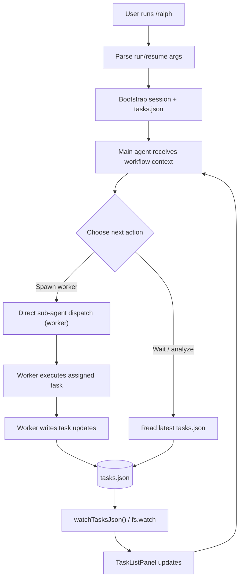
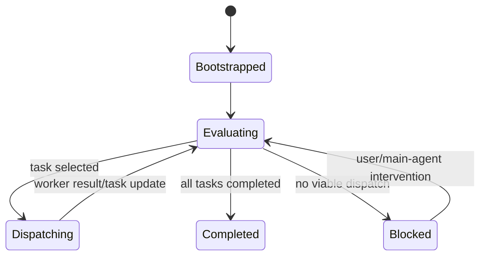

# Atomic CLI Technical Design Document / RFC

| Document Metadata      | Details                                                                                                                                                                                |
| ---------------------- | -------------------------------------------------------------------------------------------------------------------------------------------------------------------------------------- |
| Author(s)              | Developer                                                                                                                                                                              |
| Status                 | In Review (RFC)                                                                                                                                                                        |
| Team / Owner           | Atomic CLI                                                                                                                                                                             |
| Created / Last Updated | 2026-02-15 / 2026-02-15                                                                                                                                                                |
| Research Inputs        | `research/docs/2026-02-15-ralph-loop-manual-worker-dispatch.md`, `research/docs/2026-02-15-ralph-dag-orchestration-blockedby.md`, `research/docs/2026-02-15-ralph-orchestrator-ui-cleanup.md` |

## 1. Executive Summary

`/ralph` currently auto-runs a DAG orchestrator after task decomposition or resume, which means task dispatch, retries, and deadlock handling are controlled by command logic instead of the main agent ([R1], [R2]). This RFC proposes changing `/ralph` to a manual-dispatch model: the command bootstraps session/task state, then the main agent decides when to spawn worker sub-agents at will using existing direct sub-agent dispatch primitives. The core value is flexibility and clearer operator control while preserving existing `tasks.json` persistence and TaskListPanel reactivity (`fs.watch`) so task progress remains visible ([R1], [R3]). Impact includes removing automatic orchestration coupling in run/resume paths, updating worker/main-agent instruction contracts, and keeping future room for optional parallel dispatch tooling.

## 2. Context and Motivation

### 2.1 Current State

- **Architecture:** `/ralph` parses run/resume args, initializes task/session state, then immediately invokes `runDAGOrchestrator()` in both fresh and resume flows ([R1], `workflow-commands.ts` run/resume references documented in research).
- **Scheduler responsibilities today:** ready-task computation, retries, deadlock detection, worker spawning via `SubagentGraphBridge`, and reconciliation loop are centralized in orchestrator logic ([R1], [R2]).
- **Direct spawn primitives already exist but are not `/ralph` path:** command-level sub-agent dispatch and `CommandContext.spawnSubagent` patterns are available in chat/agent command flows ([R1]).
- **UI model:** task progress UI is file-driven via `tasks.json` watcher and does not require orchestrator ownership to function ([R1], [R3]).

### 2.2 The Problem

- **User impact:** `/ralph` cannot operate in a "main agent decides dispatch" mode; it always transitions to orchestrator-controlled execution.
- **Business/product impact:** current behavior conflicts with the desired manual control model for `/ralph`, limiting flexibility for nuanced sequencing decisions.
- **Technical debt impact:** orchestration policy is hard-wired into command flow, making alternate execution modes difficult without invasive branching ([R1]).

## 3. Goals and Non-Goals

### 3.1 Functional Goals

- [ ] `/ralph` run and resume flows stop auto-invoking `runDAGOrchestrator()`.
- [ ] Main agent receives task context and explicitly decides when to spawn worker sub-agents.
- [ ] Existing `tasks.json` format and session directory conventions remain compatible.
- [ ] TaskListPanel live updates continue through existing file-watch behavior.
- [ ] Worker prompt contract reflects main-agent assignment (not orchestrator assignment).
- [ ] Resume path continues to normalize interrupted `in_progress` tasks safely before continuing.

### 3.2 Non-Goals (Out of Scope)

- [ ] We will NOT redesign the Todo schema or replace `tasks.json` persistence.
- [ ] We will NOT build a brand-new orchestration subsystem in this change.
- [ ] We will NOT refactor unrelated sub-agent event pipelines outside `/ralph` scope.
- [ ] We will NOT guarantee initial parallel worker execution if current dispatch primitive remains single-slot ([R2]).

## 4. Proposed Solution (High-Level Design)

### 4.1 System Architecture Diagram



### 4.2 Architectural Pattern

- **Pattern:** Agent-in-the-loop manual dispatcher.
- **Description:** command bootstraps state; main agent controls dispatch policy; workers remain isolated executors; file-backed state remains source-of-truth ([R1], [R3]).
- **Why this pattern:** aligns with requested behavior change while reusing existing dispatch and persistence primitives instead of adding a second orchestration layer.

### 4.3 Key Components

| Component | Responsibility | Technology Stack / Location | Justification |
| --- | --- | --- | --- |
| `/ralph` command handler | Bootstrap run/resume session and task state, then hand control to main agent | `src/ui/commands/workflow-commands.ts` | Removes hard-coded automatic orchestration entry point ([R1]). |
| Main agent instruction contract | Decide task sequencing and call worker sub-agent on demand | chat command context + agent instruction text | Reuses existing direct sub-agent invocation pattern ([R1]). |
| Worker agent contract | Execute one assigned task and update task state | `.claude/agents/worker.md` | Must match manual assignment model; currently mentions orchestrator ([R1], [R2]). |
| Task persistence layer | Persist and read `tasks.json`, normalize on resume | workflow command helpers + task-state utils | Existing reliable workflow/session mechanism remains unchanged ([R1]). |
| UI task tracker | Reactively display task status changes | TaskListPanel + `watchTasksJson()` | Works independently of orchestrator loop ([R3]). |

## 5. Detailed Design

### 5.1 API Interfaces

**Interface A: CLI command contract**

- `POST`/HTTP is not involved; the external contract is command-based:
  - `/ralph "<prompt>"`
  - `/ralph --resume <sessionId>`
- Expected behavior change:
  - **Before:** run/resume always enters orchestrator loop.
  - **After:** run/resume bootstraps, then returns control to main session for manual worker dispatch ([R1]).

**Interface B: Internal dispatch contract**

- Main agent dispatches workers using existing sub-agent invocation mechanism used elsewhere in app flows ([R1]).
- Worker assignment payload must include:
  - session id/path context,
  - explicit task id/content,
  - completion criteria,
  - required task-state update behavior.

**Proposed assignment payload shape (instruction-level)**

```json
{
  "sessionId": "<uuid>",
  "taskId": "#3",
  "taskContent": "Implement X",
  "blockedBy": ["#1", "#2"],
  "mode": "manual_dispatch"
}
```

### 5.2 Data Model / Schema

Primary persisted state remains `tasks.json` in workflow session storage ([R1], [R2]).

| Field | Type | Constraints | Description |
| --- | --- | --- | --- |
| `id` | string | optional, normalized task id | Stable task identifier (`#1`, `#2`, ...). |
| `content` | string | required | Human-readable task description. |
| `status` | enum | required (`pending`, `in_progress`, `completed`, `error`) | Lifecycle state tracked in UI and command flow. |
| `activeForm` | string | required | Verb phrase for live status display. |
| `blockedBy` | string[] | optional | Dependency list used by main-agent decision logic. |

**State compatibility:** No schema migration required; existing sessions remain readable and resumable under manual dispatch flow ([R1]).

### 5.3 Algorithms and State Management

**Main session state machine (high-level)**

1. Parse `/ralph` command.
2. Bootstrap tasks/session (fresh or resume normalization).
3. Provide task context to main agent.
4. Main agent loops:
   - read current tasks,
   - choose dispatch candidate(s),
   - spawn worker(s) when appropriate,
   - reassess until done or blocked.



**Consistency model**

- Source-of-truth remains file-backed task state (`tasks.json`).
- Resume semantics continue to normalize interrupted `in_progress` tasks to `pending` prior to continuation ([R1], [R3]).
- Dependency validation moves from orchestrator code path to main-agent decision policy (with optional helper tooling in follow-up scope).

## 6. Alternatives Considered

| Option | Pros | Cons | Reason for Rejection / Selection |
| --- | --- | --- | --- |
| Keep automatic orchestrator (current) | Mature retries/deadlock flow already exists | Violates requested behavior (not manual dispatch) | Rejected; does not satisfy feature request ([R1]). |
| Hybrid mode behind feature flag | Safe fallback path, gradual adoption | Maintains dual complexity and branch divergence | Not selected for initial design; possible contingency if rollout risk rises. |
| Full manual dispatch (Selected) | Aligns exactly with requested control model; minimal schema/UI churn | Requires strong main-agent instructions; initial serial limitations likely ([R2]) | **Selected** for RFC scope. |

## 7. Cross-Cutting Concerns

### 7.1 Security and Privacy

- Worker instructions must remain scoped to assigned task and repository boundaries.
- Session file path guidance must use canonical workflow path conventions to avoid accidental writes outside session directory ([R2]).
- No new external service or credential surface area is introduced.

### 7.2 Observability Strategy

- Continue relying on existing task-state observability via TaskListPanel and file watcher.
- Preserve concise lifecycle messages for bootstrap/resume and terminal outcomes.
- If orchestrator debug text is removed, ensure equivalent user-understandable status is emitted by main agent narration ([R3]).

### 7.3 Scalability and Capacity Planning

- Initial manual dispatch may be effectively serial if using single-slot resolver path (`spawnSubagent`) ([R2]).
- For larger DAGs, parallel dispatch can be introduced later by exposing bridge-level parallel primitives to main session policy ([R1], [R2]).
- Task file growth remains bounded by task list size and existing session retention rules.

## 8. Migration, Rollout, and Testing

### 8.1 Deployment Strategy

- [ ] Phase 1: Remove automatic orchestrator invocation from run/resume `/ralph` command paths.
- [ ] Phase 2: Update main-agent and worker instruction contracts for manual assignment semantics.
- [ ] Phase 3: Validate command UX and task panel consistency; keep fallback strategy documented if needed.

### 8.2 Data Migration Plan

- **Backfill:** No data backfill required because `tasks.json` schema and storage location remain unchanged.
- **Compatibility verification:** Resume existing sessions and confirm normalization + manual continuation behavior.
- **Contract update:** Update worker guidance that still references orchestrator-centric phrasing and outdated path assumptions ([R1], [R2]).

### 8.3 Test Plan

- **Unit Tests:**
  - `/ralph` run/resume control flow no longer calls orchestrator entrypoint.
  - Resume normalization behavior unchanged.
- **Integration Tests:**
  - Fresh `/ralph` run boots session and allows main agent to dispatch worker manually.
  - Resume `/ralph --resume` rehydrates state and continues manual dispatch.
  - TaskListPanel updates as workers modify `tasks.json`.
- **End-to-End Tests:**
  - Multi-task session with dependencies validates main-agent dispatch policy.
  - Interrupted session resume path validates correctness and user visibility.

## 9. Open Questions / Unresolved Issues

- [x] Should initial manual dispatch explicitly remain **serial-only** until a parallel main-session dispatch primitive is added?
  - **Answer:** The main model should dispatch worker sub-agents directly, and we should not introduce separate manual-dispatch control logic.
- [x] Should legacy `runDAGOrchestrator()` code be removed immediately, or retained behind an internal fallback toggle during transition?
  - **Answer:** Remove immediately.
- [x] Should we keep any system-level progress messages from `/ralph`, or rely primarily on main-agent narration + TaskListPanel?
  - **Answer:** Rely primarily on main-agent narration plus TaskListPanel updates.
- [x] Should worker behavior continue to support dynamic bug-fix task insertion in manual mode, or defer DAG mutation to a later phase?
  - **Answer:** Continue dynamic bug-fix task insertion in manual mode.

---

### Research Citations

- **[R1]** `research/docs/2026-02-15-ralph-loop-manual-worker-dispatch.md`
- **[R2]** `research/docs/2026-02-15-ralph-dag-orchestration-blockedby.md`
- **[R3]** `research/docs/2026-02-15-ralph-orchestrator-ui-cleanup.md`
