# Ralph Setup Refactor - Eliminate Redundant Argument Parsing

| Document Metadata      | Details         |
| ---------------------- | --------------- |
| Author(s)              | lavaman131      |
| Status                 | Draft (WIP)     |
| Team / Owner           | flora131/atomic |
| Created / Last Updated | 2026-01-25      |

## 1. Executive Summary

This RFC proposes refactoring the `ralph setup` command to eliminate ~75 lines of redundant argument parsing code. Currently, Commander.js parses options in `src/cli.ts`, then the action handler reconstructs an args array, which `ralphSetup()` manually re-parses in `src/commands/ralph.ts`. The proposed solution passes parsed options directly via a typed interface, removing the double-parsing pattern and reducing code complexity.

**Key changes:**
- Create `RalphSetupOptions` interface for typed option passing
- Refactor `ralphSetup()` to accept options object instead of args array
- Remove ~75 lines of manual argument parsing from `ralph.ts`
- Simplify CLI action handler by directly passing parsed values

**Research Reference:** [research/docs/2026-01-25-commander-cli-audit.md](../research/docs/2026-01-25-commander-cli-audit.md) - Section "Identified Redundancy"

## 2. Context and Motivation

### 2.1 Current State

The Commander.js migration (completed per [specs/commander-js-migration.md](./commander-js-migration.md)) successfully replaced the legacy `parseArgs` implementation. However, one area of redundancy remains in the `ralph setup` command flow.

**Current Architecture:**

```
User Input → Commander.js parses options → Action handler reconstructs args[] → ralphSetup() re-parses args[]
```

**Code References:**

| Component          | Location                        | Issue                                           |
| ------------------ | ------------------------------- | ----------------------------------------------- |
| Arg reconstruction | `src/cli.ts:214-234`            | Rebuilds args array from already-parsed options |
| Manual re-parsing  | `src/commands/ralph.ts:452-534` | 75+ lines of redundant option parsing           |

**Citation from audit (research/docs/2026-01-25-commander-cli-audit.md):**
> **Issue**: `ralph setup` argument reconstruction and re-parsing
>
> **Current flow**:
> 1. Commander.js parses `--max-iterations`, `--completion-promise`, `--feature-list`, `[prompt...]`
> 2. Action handler reconstructs these into an args array
> 3. `ralphSetup(args)` manually re-parses the same arguments
>
> **Redundant code**: ~75 lines in `ralph.ts` (lines 452-534)

### 2.2 The Problem

- **Code Duplication:** Arguments are parsed twice - once by Commander.js, once manually
- **Maintenance Burden:** Two places to update when adding/changing options
- **Type Safety Gap:** Manual parsing loses type information already available from Commander.js
- **Unnecessary Complexity:** ~75 lines of parsing logic that Commander.js already handles

## 3. Goals and Non-Goals

### 3.1 Functional Goals

- [ ] Create typed `RalphSetupOptions` interface for option passing
- [ ] Refactor `ralphSetup()` to accept options object directly
- [ ] Remove manual argument parsing from `ralph.ts` (lines 452-534)
- [ ] Simplify CLI action handler to pass parsed options directly
- [ ] Preserve all existing functionality and error messages
- [ ] Update tests to reflect new interface

### 3.2 Non-Goals (Out of Scope)

- [ ] We will NOT add new ralph functionality
- [ ] We will NOT change the CLI user interface
- [ ] We will NOT modify other commands
- [ ] We will NOT change the ralph state file format

## 4. Proposed Solution (High-Level Design)

### 4.1 System Architecture Diagram

```mermaid
%%{init: {'theme':'base', 'themeVariables': { 'primaryColor':'#f8f9fa','primaryTextColor':'#2c3e50','primaryBorderColor':'#4a5568','lineColor':'#4a90e2','secondaryColor':'#ffffff','tertiaryColor':'#e9ecef'}}}%%

flowchart TB
    classDef current fill:#e53e3e,stroke:#c53030,stroke-width:2px,color:#ffffff,font-weight:600
    classDef proposed fill:#48bb78,stroke:#38a169,stroke-width:2.5px,color:#ffffff,font-weight:600
    classDef shared fill:#4a90e2,stroke:#357abd,stroke-width:2.5px,color:#ffffff,font-weight:600

    subgraph CurrentFlow["Current Flow (Redundant)"]
        direction LR
        C1["Commander.js<br>parses options"]:::current
        C2["Action handler<br>reconstructs args[]"]:::current
        C3["ralphSetup()<br>re-parses args[]"]:::current
        C1 --> C2 --> C3
    end

    subgraph ProposedFlow["Proposed Flow (Direct)"]
        direction LR
        P1["Commander.js<br>parses options"]:::proposed
        P2["Action handler<br>creates options object"]:::proposed
        P3["ralphSetup()<br>uses typed options"]:::proposed
        P1 --> P2 --> P3
    end

    style CurrentFlow fill:#fef2f2,stroke:#fecaca,stroke-width:2px
    style ProposedFlow fill:#f0fff4,stroke:#9ae6b4,stroke-width:2px
```



### 4.2 Architectural Pattern

**Direct Option Passing:** Replace the serialize-then-deserialize pattern with direct typed option object passing. This follows the principle of "don't throw away type information."

### 4.3 Key Components

| Component                  | Current                 | Proposed                       | Change          |
| -------------------------- | ----------------------- | ------------------------------ | --------------- |
| `ralphSetup()` signature   | `(args: string[])`      | `(options: RalphSetupOptions)` | Interface-based |
| CLI action handler         | Reconstructs args array | Creates options object         | Simplified      |
| Manual parsing in ralph.ts | 75+ lines               | 0 lines                        | **Deleted**     |

## 5. Detailed Design

### 5.1 Type Definitions

```typescript
// src/commands/ralph.ts (new interface)

export interface RalphSetupOptions {
  /** User-provided prompt parts, joined with spaces */
  prompt: string[];
  /** Maximum iterations before auto-stop (0 = unlimited) */
  maxIterations?: number;
  /** Promise phrase to signal completion */
  completionPromise?: string;
  /** Path to feature list JSON file */
  featureList?: string;
}
```

### 5.2 Refactored `ralphSetup()` Function

**Before (current):** `src/commands/ralph.ts:452-534`

```typescript
export async function ralphSetup(args: string[]): Promise<number> {
  const promptParts: string[] = [];
  let maxIterations = 0;
  let completionPromise = "null";
  let featureListPath = "research/feature-list.json";

  // 75+ lines of manual argument parsing...
  let i = 0;
  while (i < args.length) {
    const arg = args[i]!;
    if (arg === "--max-iterations") { /* ... */ }
    else if (arg === "--completion-promise") { /* ... */ }
    else if (arg === "--feature-list") { /* ... */ }
    else { promptParts.push(arg); i++; }
  }
  // ...
}
```

**After (proposed):**

```typescript
export async function ralphSetup(options: RalphSetupOptions): Promise<number> {
  const {
    prompt,
    maxIterations = 0,
    completionPromise,
    featureList = "research/feature-list.json",
  } = options;

  // Join prompt parts
  const userPrompt = prompt.join(" ");

  // Use user prompt if provided, otherwise use default
  let fullPrompt: string;
  if (userPrompt) {
    fullPrompt = userPrompt;
  } else {
    fullPrompt = DEFAULT_PROMPT;

    // Verify feature list exists when using default prompt
    const featureListExists = await fileExists(featureList);
    if (!featureListExists) {
      console.error(`❌ Error: Feature list not found at: ${featureList}`);
      // ... existing error message ...
      return 1;
    }
  }

  // ... rest of implementation unchanged ...
}
```

### 5.3 Refactored CLI Action Handler

**Before (current):** `src/cli.ts:205-234`

```typescript
.action(async (promptParts: string[], localOpts) => {
  // Validate agent is 'claude' (only supported agent for ralph)
  if (localOpts.agent !== "claude") {
    // ... error handling ...
  }

  // Build args array for ralphSetup to parse (REDUNDANT)
  const args: string[] = [];

  if (promptParts.length > 0) {
    args.push(...promptParts);
  }

  if (localOpts.maxIterations !== undefined) {
    args.push("--max-iterations", String(localOpts.maxIterations));
  }
  if (localOpts.completionPromise) {
    args.push("--completion-promise", localOpts.completionPromise);
  }
  if (localOpts.featureList && localOpts.featureList !== "research/feature-list.json") {
    args.push("--feature-list", localOpts.featureList);
  }

  const exitCode = await ralphSetup(args);
  process.exit(exitCode);
});
```

**After (proposed):**

```typescript
.action(async (promptParts: string[], localOpts) => {
  // Validate agent is 'claude' (only supported agent for ralph)
  if (localOpts.agent !== "claude") {
    console.error(`${COLORS.red}Error: Ralph loop currently only supports 'claude' agent${COLORS.reset}`);
    console.error(`You provided: ${localOpts.agent}`);
    console.error("\n(Run 'atomic ralph setup --help' for usage information)");
    process.exit(1);
  }

  // Pass options directly (no args reconstruction needed)
  const exitCode = await ralphSetup({
    prompt: promptParts,
    maxIterations: localOpts.maxIterations,
    completionPromise: localOpts.completionPromise,
    featureList: localOpts.featureList,
  });
  process.exit(exitCode);
});
```

### 5.4 Handling `-h` / `--help` in `ralphSetup()`

The current `ralphSetup()` contains a `-h`/`--help` handler (lines 463-465):

```typescript
if (arg === "-h" || arg === "--help") {
  console.log(SETUP_HELP_TEXT);
  return 0;
}
```

**Resolution:** This is handled by Commander.js automatically. The custom `SETUP_HELP_TEXT` constant can be removed or converted to `.addHelpText()` if custom help formatting is needed.

### 5.5 Handling `completionPromise` Null Value

The current implementation uses the string `"null"` as a sentinel value:

```typescript
let completionPromise = "null";
// ...
if (completionPromise && completionPromise !== "null") {
  completionPromiseYaml = `"${completionPromise}"`;
} else {
  completionPromiseYaml = "null";
}
```

**Resolution:** Use TypeScript's `undefined` instead of the string `"null"`:

```typescript
const completionPromise = options.completionPromise; // undefined if not provided

// For YAML output:
const completionPromiseYaml = completionPromise
  ? `"${completionPromise}"`
  : "null";
```

### 5.6 Files to Modify

| File                          | Changes                                                                 | Lines Impact |
| ----------------------------- | ----------------------------------------------------------------------- | ------------ |
| `src/commands/ralph.ts`       | Remove manual parsing (452-534), add interface, refactor `ralphSetup()` | -75 lines    |
| `src/cli.ts`                  | Simplify action handler (205-234)                                       | -10 lines    |
| `tests/cli-commander.test.ts` | Update tests for new interface                                          | ~5 lines     |

## 6. Alternatives Considered

| Option                                            | Pros                                | Cons                                     | Reason for Rejection                             |
| ------------------------------------------------- | ----------------------------------- | ---------------------------------------- | ------------------------------------------------ |
| **A: Keep current pattern**                       | No changes needed                   | Maintains redundancy, harder to maintain | Doesn't fix the identified issue                 |
| **B: Refactor to options object (Selected)**      | Clean, type-safe, removes ~85 lines | Requires test updates                    | **Selected:** Best balance of cleanup and safety |
| **C: Keep `ralphSetup(args)` as CLI entry point** | Allows standalone CLI usage         | Still requires manual parsing            | No use case for standalone ralph CLI             |

## 7. Cross-Cutting Concerns

### 7.1 Security and Privacy

- **No change** - This is an internal refactor with no security implications

### 7.2 Observability Strategy

- **Error messages preserved** - All user-facing error messages remain identical
- **No telemetry changes** - Ralph command telemetry unaffected

### 7.3 Backward Compatibility

- **CLI interface unchanged** - All `atomic ralph setup` commands work identically
- **State file format unchanged** - Ralph state file structure is not modified
- **Internal API change** - `ralphSetup()` signature changes (breaking for internal callers only)

## 8. Migration, Rollout, and Testing

### 8.1 Deployment Strategy

This is a single-PR refactor with no phased rollout needed.

- [ ] Update `ralphSetup()` signature and implementation
- [ ] Update CLI action handler
- [ ] Update tests
- [ ] Remove `SETUP_HELP_TEXT` constant (if Commander.js help is sufficient)

### 8.2 Test Plan

#### Unit Tests

Update existing tests in `tests/cli-commander.test.ts`:

```typescript
describe('ralph setup command', () => {
  test('calls ralphSetup with parsed options', () => {
    // Verify options object is passed correctly
  });

  test('handles missing optional arguments', () => {
    // Verify defaults are applied
  });
});
```

#### Integration Tests

| Test Case               | Command                                                                                                                        | Expected Behavior         |
| ----------------------- | ------------------------------------------------------------------------------------------------------------------------------ | ------------------------- |
| Basic setup             | `atomic ralph setup -a claude`                                                                                                 | Uses default prompt       |
| With prompt             | `atomic ralph setup -a claude "implement X"`                                                                                   | Uses provided prompt      |
| With max-iterations     | `atomic ralph setup -a claude --max-iterations 10`                                                                             | Sets max iterations       |
| With completion-promise | `atomic ralph setup -a claude --completion-promise "DONE"`                                                                     | Sets completion promise   |
| With feature-list       | `atomic ralph setup -a claude --feature-list custom.json`                                                                      | Uses custom path          |
| All options             | `atomic ralph setup -a claude --max-iterations 5 --completion-promise "COMPLETE" --feature-list features.json "custom prompt"` | All options set correctly |

## 9. Open Questions / Unresolved Issues

1. **`ralphCommand()` function (lines 677-698):** The audit notes this function isn't used by the Commander.js CLI. Should it be removed?
   - **Recommendation:** Investigate if it's used elsewhere; if not, delete it

2. **`SETUP_HELP_TEXT` constant:** Should we keep custom help text or rely on Commander.js auto-generated help?
   - **Recommendation:** Use `.addHelpText('after', examples)` for examples, remove `SETUP_HELP_TEXT`

## 10. Implementation Checklist

### Phase 1: Core Refactor

- [ ] Add `RalphSetupOptions` interface to `src/commands/ralph.ts`
- [ ] Refactor `ralphSetup()` to accept options object
- [ ] Remove manual argument parsing loop (lines 452-534)
- [ ] Update `completionPromise` to use `undefined` instead of `"null"` string
- [ ] Update CLI action handler in `src/cli.ts`

### Phase 2: Cleanup

- [ ] Remove `-h`/`--help` handling from `ralphSetup()` (Commander.js handles it)
- [ ] Evaluate and potentially remove `SETUP_HELP_TEXT` constant
- [ ] Investigate and potentially remove unused `ralphCommand()` function

### Phase 3: Testing

- [ ] Update unit tests for new interface
- [ ] Run integration tests for all ralph setup combinations
- [ ] Verify error messages are preserved

## 11. Lines of Code Impact

| Category          | Lines                                |
| ----------------- | ------------------------------------ |
| **Removed**       | ~85 (75 parsing + 10 reconstruction) |
| **Added**         | ~15 (interface + simplified logic)   |
| **Net reduction** | ~70 lines                            |

## 12. File Structure (Post-Refactor)

```
src/commands/ralph.ts
├── RalphSetupOptions interface (new)
├── ralphSetup(options: RalphSetupOptions) (refactored)
├── ralphStop() (unchanged)
└── DEFAULT_PROMPT, RALPH_STATE_FILE (unchanged)

src/cli.ts
└── ralph setup action handler (simplified)
```
