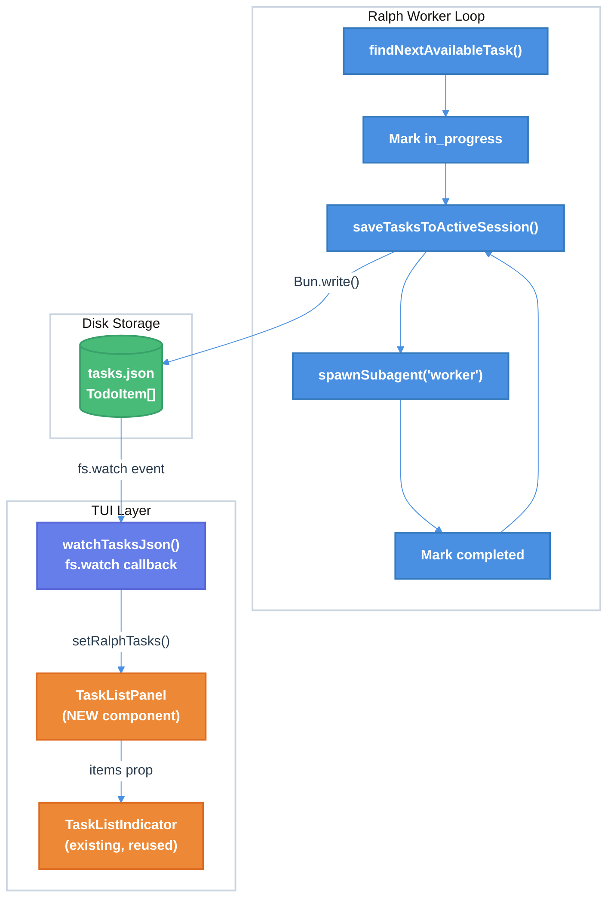

# Ralph Persistent Task List UI Technical Design Document

| Document Metadata      | Details                                          |
| ---------------------- | ------------------------------------------------ |
| Author(s)              | Developer                                        |
| Status                 | Draft (WIP)                                      |
| Team / Owner           | Atomic CLI                                       |
| Created / Last Updated | 2026-02-13                                       |
| Research               | `research/docs/2026-02-13-ralph-task-list-ui.md` |
| Related Specs          | `specs/ralph-loop-enhancements.md`               |

## 1. Executive Summary

This spec proposes adding a **persistent, file-driven task list panel** to the Atomic TUI that renders below the scrollbox during `/ralph` workflow execution. Currently, the ralph workflow updates task state in both React state and `tasks.json` on disk, but the UI only shows a one-line summary panel above the scrollbox (e.g., `"☑ 5 tasks (2 done, 3 open)"`) that hides during streaming. The proposed solution activates the already-implemented but unused `watchTasksJson()` file watcher (`src/ui/commands/workflow-commands.ts:874-890`) to drive a new `TaskListPanel` component pinned below the scrollbox. This panel renders the existing `TaskListIndicator` component inside a scrollable container with a maximum height, persists across `/clear` and `/compact` operations, and coexists with the generic `TodoPanel`. Additionally, the manual `context.clearContext()` call after each worker task (line 728) is removed — the underlying SDK hooks already manage compaction automatically.

## 2. Context and Motivation

### 2.1 Current State

The `/ralph` command implements a two-phase autonomous workflow (Research: Section 1):

1. **Task Decomposition**: The LLM generates a `TodoItem[]` task list from the user's prompt, saved to `~/.atomic/workflows/sessions/{sessionId}/tasks.json` via `saveTasksToActiveSession()` (`workflow-commands.ts:136-158`).
2. **Worker Loop**: For each task, the loop marks it `in_progress`, spawns a worker sub-agent via `context.spawnSubagent()`, marks it `completed` on success, persists to `tasks.json`, updates React state via `context.setTodoItems()`, and manually clears context via `context.clearContext()` (line 728).

The task list UI has two rendering modes (Research: Section 3):
- **During streaming**: An inline `TaskListIndicator` is shown inside the message bubble (`chat.tsx:4879`), but task segments currently render as `null` (lines 1617-1619) — suppressed in favor of the panel.
- **When not streaming**: A `TodoPanel` above the scrollbox shows only a one-line summary with counts (`chat.tsx:4926-4935`). Individual task items with status icons are not displayed.

Key infrastructure already exists but is disconnected:
- `TaskListIndicator` component (`task-list-indicator.tsx:74-120`) renders individual tasks with status icons (○ pending, ● blinking in_progress, ● green completed, ✕ red error).
- `watchTasksJson()` (`workflow-commands.ts:874-890`) uses `fs.watch` to detect `tasks.json` changes and invoke a callback — **implemented but never called anywhere**.
- `todoItemsRef` (`chat.tsx:1847-1848`) preserves task state across context clears via `useRef`.

### 2.2 The Problem

- **User Impact**: During ralph workflow execution, users see only a collapsed summary line ("5 tasks, 2 done, 3 open") with no visibility into individual task names, statuses, or the currently executing task. During streaming, the summary panel is hidden entirely.
- **Lost Visual Context**: After each worker completes and context is cleared, there is no persistent visual indicator of overall workflow progress. The task list disappears and reappears as React state is cleared and restored.
- **Unused Infrastructure**: `watchTasksJson()` was designed for exactly this use case (cited in `specs/ralph-loop-enhancements.md:126`) but has zero consumers. The `TaskListIndicator` component is fully functional but only used inline during streaming.
- **Aggressive Context Clearing**: The manual `context.clearContext()` after every worker task (line 728) forces context clearing regardless of actual usage. The SDK session hooks already manage compaction automatically — the manual call is unnecessarily aggressive and prevents workers from building on context from previous workers.

## 3. Goals and Non-Goals

### 3.1 Functional Goals

- [ ] **G1**: Create a `TaskListPanel` component that renders the full task list (using `TaskListIndicator`) pinned below the scrollbox, visible during and after streaming, showing individual task names with status icons.
- [ ] **G2**: Activate `watchTasksJson()` to drive the panel's state from `tasks.json` on disk, providing deterministic, file-driven UI updates decoupled from React state management in the worker loop.
- [ ] **G3**: The panel must persist across `/clear` and `/compact` operations — it reads from disk via file watcher, so it inherently survives context clears.
- [ ] **G4**: The generic `TodoPanel` summary line remains visible above the scrollbox during ralph workflow execution, providing an at-a-glance overview of task completion counts. Both panels coexist: `TodoPanel` (summary) at top + `TaskListPanel` (detailed) at bottom.
- [ ] **G5**: Remove the manual `context.clearContext()` call at `workflow-commands.ts:728`. The SDK hooks already manage compaction automatically — no replacement mechanism is needed.
- [ ] **G6**: The worker loop should stop calling `context.setTodoItems()` for UI updates — the file watcher handles UI synchronization. The loop still writes to `tasks.json` via `saveTasksToActiveSession()`.
- [ ] **G7**: The `TaskListPanel` persists after workflow completion. It is dismissed only when the user sends a non-ralph message (regular chat). If the user sends `/ralph --resume <id>`, the panel re-activates with the correct session context. The `TodoPanel` summary is also cleared when the panel is dismissed.

### 3.2 Non-Goals (Out of Scope)

- [ ] We will NOT modify the `TaskListIndicator` component itself — it is already a reusable presentational component.
- [ ] We will NOT change the `TodoItem` or `TaskItem` type definitions — existing types are sufficient.
- [ ] We will NOT change how worker sub-agents are spawned or how `tasks.json` is written — only the UI consumption and context clearing behavior changes.
- [ ] We will NOT modify the graph execution engine — we rely on the existing auto-compaction behavior already present in the SDK hooks.
- [ ] We will NOT add new keyboard shortcuts — the existing `Ctrl+T` toggle is reused to show/hide the `TaskListPanel` on demand without disturbing the layout.

## 4. Proposed Solution (High-Level Design)

### 4.1 System Architecture Diagram



### 4.2 Architectural Pattern

We are adopting a **file-driven reactive UI** pattern where `tasks.json` on disk is the single source of truth for task state. The worker loop writes to disk, `fs.watch` detects changes, and a React callback updates component state. This decouples the UI update path from the command execution path and provides inherent persistence across `/clear` and `/compact` operations — the file watcher reads from disk, not from in-memory React state.

This follows the same pattern used by the existing `CompactionSummary` component, which stores state outside the message history and renders as a pinned element outside the scrollbox (Research: Section 6, "Persistent Task List UI Component Pattern").

### 4.3 Key Components

| Component                    | Responsibility                                            | Location                                      | Justification                                                                    |
| ---------------------------- | --------------------------------------------------------- | --------------------------------------------- | -------------------------------------------------------------------------------- |
| `TaskListPanel`              | New wrapper component: manages watcher lifecycle, renders | `src/ui/components/task-list-panel.tsx` (new) | Encapsulates watcher + TaskListIndicator composition                             |
| `TaskListIndicator`          | Existing presentational component: renders task items     | `src/ui/components/task-list-indicator.tsx`   | Already fully functional — accepts `TaskItem[]` props, renders deterministically |
| `watchTasksJson()`           | Existing file watcher: detects `tasks.json` changes       | `src/ui/commands/workflow-commands.ts:874`    | Implemented but unused — now connected to `TaskListPanel`                        |
| `saveTasksToActiveSession()` | Existing disk writer: serializes tasks to JSON            | `src/ui/commands/workflow-commands.ts:136`    | No changes — continues to write `tasks.json` on each status update               |
| Chat layout                  | Modified: adds `TaskListPanel` below scrollbox            | `src/ui/chat.tsx:4939-5085`                   | Layout change to pin panel at bottom                                             |

## 5. Detailed Design

### 5.1 New Component: `TaskListPanel`

**File**: `src/ui/components/task-list-panel.tsx` (new)

This component manages the `watchTasksJson()` lifecycle and renders `TaskListIndicator` with file-driven state.

**Props Interface:**

```typescript
interface TaskListPanelProps {
  sessionDir: string;        // Workflow session directory path
  sessionId?: string;        // Workflow session ID (displayed for resume capability)
  expanded?: boolean;        // Whether to show full task content (default: false)
}
```

**Internal State:**

```typescript
const [tasks, setTasks] = useState<TaskItem[]>([]);
```

**Lifecycle:**

```typescript
useEffect(() => {
  // Initial load: read tasks.json synchronously on mount
  const tasksPath = join(sessionDir, "tasks.json");
  if (existsSync(tasksPath)) {
    try {
      const content = readFileSync(tasksPath, "utf-8");
      const parsed = JSON.parse(content) as TaskItem[];
      setTasks(parsed);
    } catch { /* ignore parse errors */ }
  }

  // Start file watcher for live updates
  const cleanup = watchTasksJson(sessionDir, (items) => {
    setTasks(items.map(t => ({
      id: t.id,
      content: t.content,
      status: t.status as TaskItem["status"],
      blockedBy: t.blockedBy,
    })));
  });

  return cleanup; // Closes watcher on unmount
}, [sessionDir]);
```

**Render:**

```tsx
if (tasks.length === 0) return null;

const completed = tasks.filter(t => t.status === "completed").length;
const total = tasks.length;

return (
  <box flexDirection="column" paddingLeft={2} paddingRight={2} marginTop={1}>
    <box flexDirection="column" border borderStyle="rounded" borderColor={themeColors.muted} paddingLeft={1} paddingRight={1}>
      <text style={{ fg: themeColors.accent }} attributes={1}>
        {`Ralph Workflow ${MISC.separator} ${completed}/${total} tasks`}
      </text>
      {sessionId && (
        <text style={{ fg: themeColors.muted }}>
          {`Session: ${sessionId} ${MISC.separator} /ralph --resume ${sessionId}`}
        </text>
      )}
      <scrollbox maxHeight={15}>
        <TaskListIndicator items={tasks} expanded={expanded} />
      </scrollbox>
    </box>
  </box>
);
```

**Key design decisions:**
- The component converts `TodoItem` → `TaskItem` by dropping the `activeForm` field (Research: Section 10, "TodoItem vs TaskItem Type Differences"). Failed tasks keep `"in_progress"` status (no `"error"` mapping) and are reset to `"pending"` on resume.
- Initial load reads synchronously to avoid a flash of empty state.
- The `useEffect` cleanup function closes the file watcher when the component unmounts (e.g., workflow completes or user navigates away).

### 5.2 Chat Layout Modification

**File**: `src/ui/chat.tsx`

#### 5.2.1 New State Variables

Add workflow session tracking state alongside existing todo state (near line 1848):

```typescript
// Ralph workflow persistent task list
const [ralphSessionDir, setRalphSessionDir] = useState<string | null>(null);
const ralphSessionDirRef = useRef<string | null>(null);
const [ralphSessionId, setRalphSessionId] = useState<string | null>(null);
const ralphSessionIdRef = useRef<string | null>(null);
```

Synchronize refs (add near line 1933):

```typescript
useEffect(() => {
  ralphSessionDirRef.current = ralphSessionDir;
}, [ralphSessionDir]);
useEffect(() => {
  ralphSessionIdRef.current = ralphSessionId;
}, [ralphSessionId]);
```

#### 5.2.2 Expose `setRalphSessionDir` and `setRalphSessionId` via CommandContext

Add to `CommandContext` interface (`src/ui/commands/registry.ts:64-118`):

```typescript
setRalphSessionDir: (dir: string | null) => void;
setRalphSessionId: (id: string | null) => void;
```

And to `CommandContextState` (`registry.ts:135-166`):

```typescript
ralphSessionDir: string | null;
ralphSessionId: string | null;
```

Implementation in `chat.tsx` (near the existing `setTodoItems` bridge, line 3240):

```typescript
setRalphSessionDir: (dir: string | null) => {
  ralphSessionDirRef.current = dir;
  setRalphSessionDir(dir);
},
setRalphSessionId: (id: string | null) => {
  ralphSessionIdRef.current = id;
  setRalphSessionId(id);
},
```

#### 5.2.3 Preserve Across Context Clear

In `clearContext()` implementation (`chat.tsx:3224-3238`), add restoration of ralph session dir after existing todo restoration:

```typescript
// Existing: Restore todoItems (preserved across context clears)
const saved = todoItemsRef.current;
setTodoItems(saved);

// NEW: Restore ralph session state (preserved across context clears)
const savedDir = ralphSessionDirRef.current;
setRalphSessionDir(savedDir);
const savedId = ralphSessionIdRef.current;
setRalphSessionId(savedId);
```

#### 5.2.4 Layout Change

Modify the layout structure (`chat.tsx:4889-5085`) to add `TaskListPanel` **below** the scrollbox:

```
BEFORE:
<box height="100%" width="100%">
  <AtomicHeader />
  <CompactionHistory />            ← Above scrollbox
  <TodoPanel (summary) />          ← Above scrollbox
  <scrollbox flexGrow={1}>         ← Fills remaining space
    {messages, input, etc.}
  </scrollbox>
</box>

AFTER:
<box height="100%" width="100%">
  <AtomicHeader />
  <CompactionHistory />            ← Above scrollbox
  <TodoPanel (summary) />          ← Above scrollbox (kept visible — shows completion counts)
  <scrollbox flexGrow={1}>         ← Fills remaining space
    {messages, input, etc.}
  </scrollbox>
  <TaskListPanel />           ← NEW: Below scrollbox, pinned at bottom (Ctrl+T to hide)
</box>
```

**Conditional rendering** for the new panel — reuses existing `showTodoPanel` state (toggled by `Ctrl+T`):

```tsx
{/* Ralph persistent task list - pinned below scrollbox, Ctrl+T toggleable */}
{ralphSessionDir && showTodoPanel && (
  <TaskListPanel
    sessionDir={ralphSessionDir}
    sessionId={ralphSessionId}
    expanded={tasksExpanded}
  />
)}
```

**Keep generic TodoPanel** visible during ralph workflow — no change to the existing conditional (line 4929). The `TodoPanel` summary line continues to show `"☑ N tasks (X done, Y open)"` at the top, while the `TaskListPanel` shows individual task details at the bottom. `Ctrl+T` toggles both panels simultaneously via the shared `showTodoPanel` state.

### 5.3 Worker Loop Modifications

**File**: `src/ui/commands/workflow-commands.ts`

#### 5.3.1 Activate Task List Panel on Workflow Start

In `createRalphCommand()`, after saving tasks to the session (around line 853), activate the ralph panel and pass the session ID:

```typescript
// After: saveTasksToActiveSession(tasks, sessionId)
context.setRalphSessionDir(sessionDir);
context.setRalphSessionId(sessionId);
```

Similarly for the resume path (around line 818):

```typescript
// Before entering worker loop on resume
context.setRalphSessionDir(sessionDir);
context.setRalphSessionId(parsed.sessionId);
```

#### 5.3.2 Remove Red Session ID Debug Message

**Delete lines 833-837** in `createRalphCommand()`:

```typescript
// REMOVE: Red debug output that displays session ID inline in chat
context.addMessage(
  "system",
  `Session **${sessionId}**\nResume later with: \`/ralph --resume ${sessionId}\``
);
```

This information is now displayed in the `TaskListPanel` header via the `sessionId` prop (see Section 5.1 Render). The panel shows `"Session: {uuid} │ /ralph --resume {uuid}"` in muted text below the workflow title, which is more informative and persistent — it stays visible at the bottom of the TUI throughout the workflow instead of scrolling away as chat messages accumulate.

#### 5.3.2 Remove Manual `context.clearContext()` from Worker Loop

**Delete line 728**: `await context.clearContext();`

The SDK session hooks already manage compaction automatically. The manual `clearContext()` after every worker task is aggressive and unnecessary — it forces a full context reset regardless of actual usage.

**Rationale** (Research: Section 7):
- SDK hooks monitor context usage and only act when compaction thresholds are exceeded
- The ralph worker loop routes through `context.spawnSubagent()` → `sendSilentMessage()` which goes through the SDK session's normal message processing — context monitoring is already active at this level
- Removing the manual clear means workers can build on context from previous workers when the window isn't full, potentially improving quality

#### 5.3.3 Remove `context.setTodoItems()` from Worker Loop

Remove the following calls from `runWorkerLoop()`:
- Line 698: `context.setTodoItems(tasks);` (after marking in_progress)
- Line 727: `context.setTodoItems(tasks);` (after marking completed)

These are no longer needed because the file watcher drives UI updates. The `saveTasksToActiveSession()` calls (lines 699 and 726) remain — they write to disk, which triggers the watcher, which updates the UI.

#### 5.3.4 Panel Lifecycle After Workflow Completion

The `TaskListPanel` is **not** deactivated when the worker loop finishes. It remains visible, showing the final task state (all completed, or with failed tasks still marked). This lets the user review results before continuing.

**Dismissal on next regular message**: When the user sends a non-`/ralph` message (regular chat input), clear the ralph panel state and the `TodoPanel` summary:

```typescript
// In the message submission handler (chat.tsx), before sending the message:
if (ralphSessionDir && !inputText.trim().startsWith("/ralph")) {
  // User is moving on from the ralph workflow — dismiss panel
  setRalphSessionDir(null);
  setRalphSessionId(null);
  ralphSessionDirRef.current = null;
  ralphSessionIdRef.current = null;
  // Clear the TodoPanel summary (todoItems) since the workflow is over
  todoItemsRef.current = [];
  setTodoItems([]);
}
```

**Re-activation on resume**: If the user sends `/ralph --resume <id>` instead of a regular message, the resume handler (Section 5.3.1) sets `ralphSessionDir` and `ralphSessionId` to the resumed session's values, re-populating the panel with the correct session context. The `TodoPanel` summary is also restored from the loaded `tasks.json`.

This means the panel has three lifecycle states:
1. **Active** — workflow is running; panel updates live via file watcher
2. **Idle** — workflow finished; panel shows final state, awaiting user's next action
3. **Dismissed** — user sent a regular message; panel is unmounted, `TodoPanel` cleared

### 5.4 Type Conversions

The `watchTasksJson()` callback receives `TodoItem[]` from disk. The `TaskListPanel` converts to `TaskItem[]` for `TaskListIndicator`:

| `TodoItem` field | `TaskItem` field | Conversion                                                              |
| ---------------- | ---------------- | ----------------------------------------------------------------------- |
| `id`             | `id`             | Direct passthrough                                                      |
| `content`        | `content`        | Direct passthrough                                                      |
| `status`         | `status`         | Direct passthrough (both support "pending", "in_progress", "completed") |
| `activeForm`     | *(dropped)*      | Not used by `TaskListIndicator`                                         |
| `blockedBy`      | `blockedBy`      | Direct passthrough                                                      |
| *(N/A)*          | `"error"`        | Not set from `tasks.json`; could be added if workers fail               |

### 5.5 Edge Cases

#### 5.5.1 `/clear` During Active Workflow

When `/clear` is invoked during a ralph workflow:
- Messages and compaction state are cleared as normal
- `ralphSessionDirRef.current` preserves the session directory path
- `setRalphSessionDir(savedDir)` restores the panel after clear
- The file watcher in `TaskListPanel` is unaffected (it's mounted based on `ralphSessionDir` state, which is restored)

#### 5.5.2 `/compact` During Active Workflow

When `/compact` is invoked:
- Context is summarized, messages are compacted
- `ralphSessionDir` state is not touched by compaction
- The panel continues to display current task state from disk

#### 5.5.3 `tasks.json` Mid-Write

The `watchTasksJson()` implementation already handles this (Research: Section 4):
```typescript
try {
  const content = await readFile(tasksPath, "utf-8");
  const tasks = JSON.parse(content) as TodoItem[];
  onUpdate(tasks);
} catch { /* File may not exist yet or be mid-write */ }
```

If `Bun.write()` and `fs.watch` race, the callback silently ignores parse errors. The next write will trigger another watch event.

#### 5.5.4 Worker Failure

If a worker sub-agent fails (returns `success: false`), the current behavior leaves the task as `in_progress` (line 720-724). The task list panel will show the blinking `●` indicator for that task. On resume, `in_progress` tasks are reset to `pending` (line 796-800).

#### 5.5.5 Session Resume

On `/ralph --resume <sessionId>`:
1. Load `tasks.json` from session directory (line 784-793)
2. Reset `in_progress` → `pending` (line 796-800)
3. Set `ralphSessionDir` and `ralphSessionId` to re-activate the panel with the correct session context
4. Update `todoItems` from loaded tasks so `TodoPanel` summary reflects current state
5. Enter worker loop — file watcher picks up changes automatically

If the panel was in the **idle** state from a previous workflow, the resume replaces it with the new session's data.

## 6. Alternatives Considered

| Option                                          | Pros                                           | Cons                                                                           | Reason for Rejection                                                                                             |
| ----------------------------------------------- | ---------------------------------------------- | ------------------------------------------------------------------------------ | ---------------------------------------------------------------------------------------------------------------- |
| A: Enhance existing TodoPanel with task items   | Minimal code change, reuses existing component | TodoPanel is positioned above scrollbox; mixing generic/ralph tasks is complex | Doesn't satisfy "pinned at bottom" requirement; conflates two different use cases                                |
| B: Render panel inside scrollbox above input    | Task list scrolls with messages; natural flow  | Panel is not truly "pinned" — scrolls out of view as messages accumulate       | Users lose sight of task progress when scrolling through messages                                                |
| C: File-driven panel below scrollbox (Selected) | Always visible, file-driven, survives clears   | Adds new component; reduces scrollbox height                                   | **Selected**: Deterministic, persistent, decoupled from React state lifecycle; `watchTasksJson()` already exists |
| D: Keep `context.setTodoItems()` as UI driver   | No new file watcher overhead                   | Coupled to worker loop execution; lost on context clear without ref tricks     | File watcher is already implemented and provides cleaner separation of concerns                                  |

## 7. Cross-Cutting Concerns

### 7.1 Performance

- **File watcher overhead**: `fs.watch` is kernel-level (inotify on Linux, kqueue on macOS). A single watcher on `tasks.json` has negligible CPU cost. The file is written at most once per task status change (typically seconds apart).
- **Panel render cost**: The panel renders inside a scrollable container with a maximum height (e.g., 15 lines). All tasks are rendered but only those within the visible viewport are displayed. Re-renders are triggered only when `tasks.json` changes on disk.
- **Scrollbox height reduction**: The panel's scrollable container has a maximum height of 15 lines plus border/header overhead (~17 lines). On an 80-line terminal, this leaves ~63 lines for the scrollbox — acceptable. For task lists shorter than 15 items, the panel uses only the space needed.

### 7.2 Testing

- **Component test**: `TaskListPanel` renders `TaskListIndicator` with correct task items after file write.
- **File watcher test**: Write to `tasks.json`, verify callback fires and state updates.
- **Layout test**: Panel renders below scrollbox, TodoPanel summary coexists above scrollbox.
- **Persistence test**: `/clear` and `/compact` preserve the ralph panel.
- **Idle state test**: Panel remains visible after workflow completes; shows final task state.
- **Dismissal test**: Sending a regular (non-`/ralph`) message dismisses panel and clears TodoPanel summary.
- **Resume test**: `/ralph --resume <id>` re-activates panel with correct session ID and task state.

## 8. Migration, Rollout, and Testing

### 8.1 Deployment Strategy

This is a UI-only change with no data migration needed. The `tasks.json` format is unchanged.

- [ ] Phase 1: Implement `TaskListPanel` component and layout change.
- [ ] Phase 2: Wire `setRalphSessionDir` through `CommandContext` and activate in ralph command.
- [ ] Phase 3: Remove manual `context.clearContext()` from worker loop; remove `context.setTodoItems()` calls.
- [ ] Phase 4: Manual E2E test: run `/ralph` with a multi-task prompt, verify panel renders, persists across `/clear`, and auto-updates as workers complete.

### 8.2 Test Plan

- **Unit Tests**: `TaskListPanel` renders correctly given a mock `sessionDir` with `tasks.json` containing various task states.
- **Integration Tests**: Full `/ralph` command execution with file watcher verification.
- **E2E Tests**: Use `tmux-cli` tool per project E2E test guidelines (`src/AGENTS.md:60-65`) to verify visual rendering of pinned panel during workflow execution.

## 9. Implementation Checklist

### Files to Create

| File                                    | Purpose                                           |
| --------------------------------------- | ------------------------------------------------- |
| `src/ui/components/task-list-panel.tsx` | New component: manages watcher, renders task list |

### Files to Modify

| File                                   | Change                                                                                                                                                                                                                                            |
| -------------------------------------- | ------------------------------------------------------------------------------------------------------------------------------------------------------------------------------------------------------------------------------------------------- |
| `src/ui/chat.tsx`                      | Add `ralphSessionDir`/`ralphSessionId` state/refs; render `TaskListPanel` below scrollbox; preserve across clear                                                                                                                                  |
| `src/ui/commands/registry.ts`          | Add `setRalphSessionDir` and `setRalphSessionId` to `CommandContext` interface and `CommandContextState`                                                                                                                                          |
| `src/ui/commands/workflow-commands.ts` | Set `ralphSessionDir`/`ralphSessionId` on workflow start/resume; remove red session ID `addMessage` (lines 833-837); remove `context.clearContext()` (line 728); remove `context.setTodoItems()` calls (lines 698, 727); clear both on completion |

### Files Unchanged (Reused As-Is)

| File                                        | Reason                                       |
| ------------------------------------------- | -------------------------------------------- |
| `src/ui/components/task-list-indicator.tsx` | Presentational component — no changes needed |
| `src/sdk/tools/todo-write.ts`               | Type definitions unchanged                   |
| `src/workflows/session.ts`                  | Session infrastructure unchanged             |

## 10. Open Questions (Resolved)

- [x] **Panel height limit**: The panel uses a scrollable container with a maximum height (e.g., 15 lines) instead of `TaskListIndicator`'s `maxVisible` truncation. All tasks remain accessible via scrolling rather than being hidden behind a `+N more` overflow indicator.
- [x] **Completion animation**: The panel remains visible after workflow completion (idle state). It is dismissed when the user sends a non-ralph message, or reset/redrawn if another `/ralph` command is run (see Section 5.3.4).
- [x] **Error status mapping**: Failed tasks keep their `"in_progress"` status in `tasks.json` (no `"error"` mapping). On resume, `in_progress` tasks are reset to `"pending"` for retry — matching existing behavior at line 796-800.
- [x] **Context auto-clearing integration**: No `contextMonitorNode` integration needed. The underlying SDK hooks already manage compaction automatically. Simply remove the manual `context.clearContext()` call — no replacement mechanism required.

## 11. References

- **Primary Research**: `research/docs/2026-02-13-ralph-task-list-ui.md` — Comprehensive analysis of current implementation and proposed data flow
- **Related Spec**: `specs/ralph-loop-enhancements.md` — Prior spec for replacing `RalphFeature` with `TodoItem`, `watchTasksJson()` design
- **Related Research**: `research/docs/2026-02-09-163-ralph-loop-enhancements.md` — Ralph loop task management research
- **OpenTUI Research**: `research/docs/2026-01-31-opentui-library-research.md` — Layout and component patterns
- **Sub-Agent UI**: `research/docs/2026-02-05-subagent-ui-opentui-independent-context.md` — Sub-agent rendering in TUI
- **Workflow SDK**: `research/docs/2026-02-11-workflow-sdk-implementation.md` — Session storage and directory structure
- **TUI Layout**: `research/docs/2026-02-12-tui-layout-streaming-content-ordering.md` — Content ordering in streaming layout
