# Ralph Workflow Three-Phase Bug Fixes Technical Design Document

| Document Metadata      | Details     |
| ---------------------- | ----------- |
| Author(s)              | lavaman131  |
| Status                 | Draft (WIP) |
| Team / Owner           | Atomic CLI  |
| Created / Last Updated | 2026-02-22  |

## 1. Executive Summary

The `/ralph` workflow's three-phase cycle (task decomposition, implementation with workers, review with reviewer) is broken across all three SDK backends (OpenCode, Copilot, Claude Agent SDK). The root cause is that the imperative `async/await` orchestration in `workflow-commands.ts:580-883` depends on the UI event pipeline (`index.ts:729-756`) for task state persistence, but that pipeline silently drops sub-agent tool events — including TodoWrite calls that update `tasks.json`. This causes infinite loops (Claude), skipped reviews (all SDKs), and missing fix cycles (Copilot). Additional issues include non-deterministic prompt-injection sub-agent dispatch (Claude, Copilot) and a fragile task ID guard that rejects valid partial updates.

This spec proposes migrating the `/ralph` workflow from the imperative `CommandDefinition.execute` pattern to the **graph SDK** (`GraphBuilder`, `agentNode`, `subagentNode`, `decisionNode`, `SessionDirSaver`). The graph SDK bypasses the UI event pipeline entirely for state management — the graph executor controls phase transitions structurally via typed edges, manages state via annotation reducers, and dispatches sub-agents deterministically via `SubagentGraphBridge`. This eliminates the root cause (TodoWrite event dropping) and the secondary issues (prompt-injection dispatch, imperative completion checks) in a single architectural change.

Supplementary fixes to the TodoWrite persistence pipeline and task ID validation are retained for defense-in-depth and to support the `TaskListPanel` file-watcher UI.

## 2. Context and Motivation

### 2.1 Current State

The `/ralph` workflow is defined as a `CommandDefinition` in `src/ui/commands/workflow-commands.ts:580-883` using an imperative `async/await` pattern. It orchestrates three phases sequentially:

1. **Task Decomposition (Phase 1):** Decomposes a user prompt into a structured task list via `streamAndWait(buildSpecToTasksPrompt())`, persists to `tasks.json`.
2. **Implementation Loop (Phase 2):** Iterates up to `MAX_RALPH_ITERATIONS` (100), sending `buildBootstrappedTaskContext` / `buildContinuePrompt` to the agent, reading `tasks.json` from disk after each iteration to check completion.
3. **Review & Fix (Phase 3):** Gated on `allTasksCompleted` from `tasks.json`. Spawns a reviewer sub-agent, parses findings, and if fixes are needed, re-enters the decompose-implement cycle.

**Architecture:**

- Task state is persisted to disk (`tasks.json`) via `saveTasksToActiveSession()` in `workflow-commands.ts:165-200`.
- The UI reads task state independently via `TaskListPanel`'s file watcher (`task-list-panel.tsx`).
- Sub-agent dispatch differs by SDK: OpenCode uses native `AgentPartInput`, while Claude and Copilot use prompt-injection through `sendSilentMessage` (see `chat.tsx:3711-3758`).

**Limitations:**

- Sub-agent tool events (including TodoWrite) are classified as `isSubagentTool` and silently dropped from the main UI's tool event handlers (`index.ts:729-756`), preventing `tasks.json` from being updated.
- The review phase gate (`workflow-commands.ts:727`) reads from `tasks.json`, which never reflects completion, so the review phase is never entered.
- Prompt-injection-based sub-agent dispatch for Claude and Copilot is non-deterministic.

**Graph SDK exists but is unused by Ralph:** A complete graph execution engine exists at `src/graph/` with a fluent `GraphBuilder` API, BFS executor with streaming/checkpointing, annotation-based state management (`RalphWorkflowState` already defined at `annotation.ts:466`), and node factories (`agentNode`, `subagentNode`, `parallelSubagentNode`, `decisionNode`, etc.). The `RalphExecutor` class exists as dead code — `run()` returns a placeholder string and is not wired to actual execution. A `useGraphEngine` feature flag exists in ralph config but is non-functional.

_Research reference: [2026-02-22-ralph-workflow-three-phase-bugs.md](../research/docs/2026-02-22-ralph-workflow-three-phase-bugs.md), Findings 1, 4, 5, 10; [2026-02-11-workflow-sdk-implementation.md](../research/docs/2026-02-11-workflow-sdk-implementation.md)._

### 2.2 The Problem

- **User Impact:** The `/ralph` workflow enters an infinite loop (Claude SDK), skips code review entirely (all SDKs), and never executes the fix-implementation cycle (Copilot). Users cannot complete the full implement-review-fix cycle that `/ralph` promises.
- **Business Impact:** The `/ralph` workflow is the flagship autonomous coding workflow. Its broken state across all SDK backends undermines the core value proposition of the product.
- **Technical Debt:** The imperative orchestration pattern is fundamentally coupled to the UI event pipeline for state persistence — a layer designed for UI rendering concerns, not workflow state management. This coupling is the root cause of multiple bugs. The graph SDK was designed specifically to decouple workflow orchestration from UI concerns, but Ralph was never migrated to it.

_Research reference: [2026-02-22-ralph-workflow-three-phase-bugs.md](../research/docs/2026-02-22-ralph-workflow-three-phase-bugs.md), Summary; [2026-02-15-subagent-premature-completion-SUMMARY.md](../research/docs/2026-02-15-subagent-premature-completion-SUMMARY.md) (related sub-agent lifecycle issues)._

## 3. Goals and Non-Goals

### 3.1 Functional Goals

- [ ] **G1:** Migrate the `/ralph` workflow from imperative `CommandDefinition.execute` to the graph SDK, using `GraphBuilder`, typed nodes, and annotation-based state management.
- [ ] **G2:** The Phase 2 implementation loop must exit correctly when workers complete their tasks, rather than looping infinitely.
- [ ] **G3:** The Phase 3 review phase must be entered when all implementation tasks are completed.
- [ ] **G4:** The Phase 3 fix-implementation cycle (second implementation loop after review) must execute when the reviewer identifies actionable findings.
- [ ] **G5:** Sub-agent dispatch (workers, reviewer) must use deterministic `SubagentGraphBridge` dispatch across all three SDKs, replacing prompt-injection.
- [ ] **G6:** Task state must be persisted to `tasks.json` via the graph executor's state management, not via the UI event pipeline.
- [ ] **G7:** The task ID guard (`validateRalphTaskIds`) must propagate validation errors back to the agent for self-correction.
- [ ] **G8:** The `TaskListPanel` file-watcher UI must continue to work with the new graph-based workflow (reads from same `tasks.json` location).
- [ ] **G9:** The task list schema must enforce strict ID format validation (`#N` sequential numeric pattern) at both the TodoWrite tool input layer and the task parsing layer, preventing condensed ranges (e.g., `"#2-#11"`) from entering the system. Prompt engineering must reinforce this constraint.
- [ ] **G10:** Hidden workflow phases (Phase 1 task decomposition, Phase 3 review) must produce visible summary messages in the chat history, eliminating the conversation gap where assistant placeholders are silently removed.
- [ ] **G11:** Implement full DAG-based parallel orchestration with `blockedBy` dependency enforcement in the implementation loop. Workers must be dispatched in dependency-respecting waves using `SubagentGraphBridge.spawnParallel()` with ready-set computation (Kahn's algorithm from `task-order.ts`).
- [ ] **G12:** Implement generalized `taskLoopNode()` and `criteriaLoopNode()` abstractions from the pluggable workflows SDK spec. Ralph's implementation loop must use `taskLoopNode()` instead of raw `GraphBuilder.loop()`, enabling reuse by custom workflows.

### 3.2 Non-Goals (Out of Scope)

- [ ] **NG1:** We will NOT change the `TaskListPanel` file-watcher rendering pipeline, which correctly reads from `tasks.json`.

## 4. Proposed Solution (High-Level Design)

### 4.1 System Architecture Diagram

```mermaid
%%{init: {'theme':'base', 'themeVariables': { 'primaryColor':'#f8f9fa','primaryTextColor':'#2c3e50','primaryBorderColor':'#4a5568','lineColor':'#4a90e2','secondaryColor':'#ffffff','tertiaryColor':'#e9ecef','background':'#f5f7fa','mainBkg':'#f8f9fa','nodeBorder':'#4a5568','clusterBkg':'#ffffff','clusterBorder':'#cbd5e0','edgeLabelBackground':'#ffffff'}}}%%

flowchart TB
    classDef graphNode fill:#5a67d8,stroke:#4c51bf,stroke-width:2.5px,color:#ffffff,font-weight:600
    classDef decision fill:#d69e2e,stroke:#b7791f,stroke-width:2px,color:#ffffff,font-weight:600
    classDef bridge fill:#48bb78,stroke:#38a169,stroke-width:2.5px,color:#ffffff,font-weight:600
    classDef state fill:#4a90e2,stroke:#357abd,stroke-width:2px,color:#ffffff,font-weight:600
    classDef ui fill:#718096,stroke:#4a5568,stroke-width:2px,color:#ffffff,font-weight:600

    subgraph GraphWorkflow["Graph SDK Workflow (NEW)"]
        direction TB

        Init["<b>initSession</b><br>toolNode<br>Create session dir, init state"]:::graphNode

        Decompose["<b>taskDecomposition</b><br>agentNode<br>buildSpecToTasksPrompt()"]:::graphNode

        ImplStart["<b>loop_start</b><br>Implementation Loop"]:::graphNode

        Implement["<b>implementation</b><br>agentNode<br>buildBootstrappedTaskContext()"]:::graphNode

        ImplCheck{"<b>loop_check</b><br>allTasksCompleted?"}:::decision

        ClearCtx1["<b>clearContext</b><br>clearContextNode<br>Reset between phases"]:::graphNode

        Review["<b>review</b><br>subagentNode<br>reviewer via Bridge"]:::bridge

        ReviewDecision{"<b>reviewDecision</b><br>decisionNode<br>fixesNeeded?"}:::decision

        Complete["<b>complete</b><br>toolNode<br>Finalize session"]:::graphNode

        Init --> Decompose
        Decompose --> ImplStart
        ImplStart --> Implement
        Implement --> ImplCheck
        ImplCheck -->|"not complete"| Implement
        ImplCheck -->|"all complete"| ClearCtx1
        ClearCtx1 --> Review
        Review --> ReviewDecision
        ReviewDecision -->|"fixes needed"| Decompose
        ReviewDecision -->|"no fixes / patch correct"| Complete
    end

    subgraph StateManagement["Annotation-Based State"]
        direction TB
        RWS["<b>RalphWorkflowState</b><br>executionId, tasks,<br>ralphSessionId,<br>reviewResult, fixSpec,<br>iteration, shouldContinue"]:::state
        SDS["<b>SessionDirSaver</b><br>~/.atomic/workflows/<br>sessions/{id}/"]:::state
        RWS <-->|"reducer merge"| SDS
    end

    subgraph UILayer["UI Layer (unchanged)"]
        direction TB
        TLP["<b>TaskListPanel</b><br>file watcher on<br>tasks.json"]:::ui
        Chat["<b>Chat TUI</b><br>Status messages<br>from graph progress"]:::ui
    end

    GraphWorkflow -->|"checkpointer writes<br>tasks.json"| StateManagement
    StateManagement -->|"file watcher reads"| UILayer

    style GraphWorkflow fill:#ffffff,stroke:#5a67d8,stroke-width:2px
    style StateManagement fill:#ffffff,stroke:#4a90e2,stroke-width:2px,stroke-dasharray:8 4
    style UILayer fill:#ffffff,stroke:#718096,stroke-width:2px,stroke-dasharray:8 4
```



### 4.2 Architectural Pattern

The migration adopts the **graph-based workflow orchestration** pattern using the existing graph SDK at `src/graph/`. Key principles:

1. **Structural phase transitions:** Phase transitions are encoded as typed edges in the graph, not imperative `if`/`while` constructs. The graph executor (`compiled.ts:266`) evaluates edge conditions to determine the next node.
2. **Annotation-based state:** `RalphWorkflowState` (`annotation.ts:466`) with per-field reducers manages workflow state immutably. The `tasks` field uses `Reducers.mergeById("id")` for incremental task updates.
3. **Deterministic sub-agent dispatch:** `subagentNode()` (`nodes.ts:1710`) dispatches sub-agents via `SubagentGraphBridge.spawn()`, which creates independent sessions — bypassing the `index.ts` event pipeline entirely.
4. **Checkpointer-based persistence:** `SessionDirSaver` (`checkpointer.ts:618`) writes state to `~/.atomic/workflows/sessions/{id}/` after each node, including `tasks.json`. The `TaskListPanel` file watcher picks up changes automatically.

This approach eliminates the root cause (TodoWrite event dropping) because the graph executor — not the UI event pipeline — is responsible for persisting task state.

_Research reference: [2026-01-31-graph-execution-pattern-design.md](../research/docs/2026-01-31-graph-execution-pattern-design.md); [2026-02-11-workflow-sdk-implementation.md](../research/docs/2026-02-11-workflow-sdk-implementation.md); [specs/workflow-sdk-implementation.md](workflow-sdk-implementation.md)._

### 4.3 Key Components

| Component | Responsibility | File Location | Change Type |
|---|---|---|---|
| Ralph graph definition | Define workflow as graph nodes + edges | `src/graph/workflows/ralph.ts` (new or rewrite) | New: replace `RalphExecutor` dead code |
| Graph-to-command bridge | Wire compiled graph into `createRalphCommand()` | `src/ui/commands/workflow-commands.ts` | Rewrite: `execute()` delegates to graph executor |
| `RalphWorkflowState` | Annotation schema with task state | `src/graph/annotation.ts:466` | Extend: add `tasks`, `reviewResult`, `fixSpec` fields |
| Session checkpointer | Write `tasks.json` from state | `src/graph/checkpointer.ts:618` | Extend: add `tasks.json` write hook |
| Task ID guard | Validate TodoWrite against known tasks | `src/ui/utils/ralph-task-state.ts` | Strict: reject invalid IDs, propagate errors |
| TodoWrite bypass | Forward sub-agent TodoWrite to persistence | `src/ui/index.ts:729-756` | Modify: add ralph-scoped bypass |
| Prompt builders | Build phase-specific prompts | `src/graph/nodes/ralph.ts` | Update: main-agent-only TodoWrite instructions, strict ID format rules |
| TodoWrite tool schema | Validate tool input from agents | `src/sdk/tools/todo-write.ts` | Add: `pattern` constraint on `id`, uniqueness validation, error propagation |
| Task parser + Zod | Parse Phase 1 decomposition output | `src/ui/commands/workflow-commands.ts` | Add: Zod schema validation in `parseTasks()` |
| Hidden phase summaries | Show collapsed summary for hidden phases | `src/ui/chat.tsx` | New: replace placeholder removal with summary injection |
| Collapsed message render | Render collapsed messages distinctly | `src/ui/components/message-bubble.tsx` | Add: `isCollapsed` rendering style |
| DAG orchestrator | Wave-based parallel worker dispatch | `src/graph/workflows/ralph.ts` | New: `dagOrchestratorExecute` using `spawnParallel()` |
| Ready-set computation | Find dependency-satisfied tasks | `src/ui/components/task-order.ts:301-340` | Existing: `getReadyTasks()` (reuse as-is) |
| Deadlock detection | Detect cycles and error dependencies | `src/ui/components/task-order.ts:31-178` | Existing: `detectDeadlock()` (reuse as-is) |
| Worker assignment | Single-task prompt per worker | `src/graph/nodes/ralph.ts:97-140` | Existing: `buildWorkerAssignment()` (reuse as-is) |
| `taskLoopNode()` | Generalized task-file iteration | `src/graph/nodes/task-loop.ts` | New: reusable loop node factory |
| `criteriaLoopNode()` | Signal-based iteration (yolo mode) | `src/graph/nodes/task-loop.ts` | New: reusable loop node factory |

## 5. Detailed Design

### 5.1 Graph Workflow Definition

**Location:** `src/graph/workflows/ralph.ts` (replace existing `RalphExecutor` dead code)

The ralph workflow is defined using the `GraphBuilder<RalphWorkflowState>` fluent API. The graph has 7 nodes connected by conditional and unconditional edges:

```typescript
import {
  graph, agentNode, subagentNode, toolNode,
  decisionNode, clearContextNode,
} from "../index.ts";
import type { RalphWorkflowState } from "../annotation.ts";
import {
  buildSpecToTasksPrompt, buildBootstrappedTaskContext,
  buildContinuePrompt, buildReviewPrompt, parseReviewResult,
  buildFixSpecFromReview, type TaskItem,
} from "../nodes/ralph.ts";

const MAX_IMPL_ITERATIONS = 100;
const MAX_REVIEW_ITERATIONS = 1;

export function createRalphWorkflow() {
  return graph<RalphWorkflowState>()

    // Phase 0: Session initialization
    .start(toolNode<RalphWorkflowState, void, void>({
      id: "initSession",
      name: "Initialize Session",
      execute: async (ctx) => {
        const sessionId = ctx.state.ralphSessionId;
        const sessionDir = ctx.state.ralphSessionDir;
        await initWorkflowSession("ralph", sessionId);
        return {
          stateUpdate: { ralphSessionId: sessionId, ralphSessionDir: sessionDir },
        };
      },
    }))

    // Phase 1: Task decomposition
    .then(agentNode<RalphWorkflowState>({
      id: "taskDecomposition",
      name: "Task Decomposition",
      buildMessage: (state) => {
        const prompt = state.fixSpec || state.yoloPrompt || "";
        return buildSpecToTasksPrompt(prompt);
      },
      outputMapper: (messages, state) => {
        const content = extractTextContent(messages);
        const tasks = parseTasks(content);
        return {
          stateUpdate: {
            tasks,
            taskIds: new Set(tasks.map(t => t.id).filter(Boolean)),
          },
        };
      },
    }))

    // Phase 2: Implementation loop
    .loop(
      [
        agentNode<RalphWorkflowState>({
          id: "implementation",
          name: "Implementation",
          buildMessage: (state) => {
            if (state.iteration === 0) {
              return buildBootstrappedTaskContext(state.tasks, state.ralphSessionId);
            }
            return buildContinuePrompt(state.tasks, state.ralphSessionId);
          },
          outputMapper: (messages, state) => {
            // The agent's TodoWrite calls update tasks in the state
            // via the annotation reducer. Also read from disk as fallback.
            const diskTasks = readTasksFromDisk(state.ralphSessionDir);
            return {
              stateUpdate: {
                tasks: diskTasks.length > 0 ? diskTasks : state.tasks,
                iteration: state.iteration + 1,
              },
            };
          },
        }),
      ],
      {
        until: (state) =>
          state.tasks.every(t => t.status === "completed") ||
          !hasActionableTasks(state.tasks),
        maxIterations: MAX_IMPL_ITERATIONS,
      },
    )

    // Phase 2→3 transition: clear context window
    .then(clearContextNode<RalphWorkflowState>({
      id: "clearBeforeReview",
      name: "Clear Context Before Review",
      message: "Clearing context for review phase",
    }))

    // Phase 3: Review via sub-agent
    .then(subagentNode<RalphWorkflowState>({
      id: "review",
      name: "Code Review",
      agentType: "reviewer",
      task: (state) => buildReviewPrompt(state.tasks, state.yoloPrompt ?? ""),
      outputMapper: (result) => {
        const review = parseReviewResult(result.output);
        const fixSpec = review
          ? buildFixSpecFromReview(review, [], state.yoloPrompt ?? "")
          : "";
        return {
          stateUpdate: {
            reviewResult: review,
            fixSpec,
            shouldContinue: fixSpec.length > 0,
          },
        };
      },
    }))

    // Phase 3: Decision — fixes needed?
    .if((state) => state.shouldContinue && state.reviewIteration < MAX_REVIEW_ITERATIONS)
      // Loop back to task decomposition with fix spec
      .then(toolNode<RalphWorkflowState, void, void>({
        id: "prepareFixCycle",
        name: "Prepare Fix Cycle",
        execute: async (ctx) => ({
          stateUpdate: {
            reviewIteration: ctx.state.reviewIteration + 1,
            iteration: 0,
            shouldContinue: false,
          },
        }),
      }))
      // This node's outgoing edge goes back to taskDecomposition via goto
      .then(toolNode<RalphWorkflowState, void, void>({
        id: "reenterDecomposition",
        name: "Re-enter Decomposition",
        execute: async () => ({ goto: "taskDecomposition" }),
      }))
    .else()
      .then(toolNode<RalphWorkflowState, void, void>({
        id: "complete",
        name: "Complete Workflow",
        execute: async (ctx) => ({
          stateUpdate: { shouldContinue: false },
        }),
      }))
    .endif()

    .end()

    .compile({
      checkpointer: new SessionDirSaver(
        (state) => state.ralphSessionDir,
      ),
      autoCheckpoint: true,
      onProgress: (event) => {
        // Emit status messages to the chat UI
        if (event.type === "node_completed") {
          // Write tasks.json from state for TaskListPanel
          if (event.state.tasks?.length > 0) {
            saveTasksToActiveSession(event.state.tasks, event.state.ralphSessionId);
          }
        }
      },
    });
}
```

**Key design decisions:**

1. **`agentNode` for Phases 1 and 2:** Each `agentNode` creates an independent session via `globalClientProvider(agentType)` (`nodes.ts:193`). This means tool events from the agent go through the SDK's own event handling, NOT through the `index.ts` UI event pipeline. TodoWrite calls from the agent reach the graph executor's state management, not `handleToolStart`.

2. **`subagentNode` for Phase 3 (Review):** Uses `SubagentGraphBridge.spawn()` (`subagent-bridge.ts:106`) which creates an independent session for the reviewer. The bridge captures the complete output, which is then parsed by `parseReviewResult`. This replaces the non-deterministic prompt-injection approach.

3. **`GraphBuilder.loop()` for Phase 2:** The loop construct (`builder.ts:456`) creates `loop_start` and `loop_check` decision nodes with a conditional back-edge. The `until` predicate checks task completion directly from state, not from disk reads.

4. **`onProgress` callback for `tasks.json`:** The graph executor calls `onProgress` after each node completes (`compiled.ts:444-451`). The callback writes `tasks.json` from the current state, keeping the `TaskListPanel` file watcher in sync.

5. **`goto: "taskDecomposition"` for fix cycle:** The fix cycle uses explicit `goto` in the `NodeResult` to redirect execution back to the decomposition node, rather than imperative recursion.

_Research reference: [2026-01-31-graph-execution-pattern-design.md](../research/docs/2026-01-31-graph-execution-pattern-design.md); [specs/ralph-dag-orchestration.md](ralph-dag-orchestration.md); [specs/pluggable-workflows-sdk.md](pluggable-workflows-sdk.md)._

**Files to create/modify:**

- `src/graph/workflows/ralph.ts` — Replace `RalphExecutor` dead code with `createRalphWorkflow()` graph definition
- `src/graph/annotation.ts` — Extend `RalphWorkflowState` with `tasks: TaskItem[]`, `taskIds: Set<string>`, `reviewResult: ReviewResult | null`, `fixSpec: string`, `reviewIteration: number`
- `src/graph/annotation.ts` — Add `tasks` reducer using `Reducers.mergeById("id")`

### 5.2 Command-to-Graph Bridge

**Location:** `src/ui/commands/workflow-commands.ts`

The `createRalphCommand()` factory's `execute()` function must be rewritten to:
1. Parse arguments (unchanged)
2. Create initial `RalphWorkflowState`
3. Compile the graph via `createRalphWorkflow()`
4. Execute via `GraphExecutor.stream()` — yielding `StepResult` after each node
5. Map `StepResult` events to chat UI messages (status updates, progress)
6. Handle `human_input_required` signals (pause workflow, yield to user)
7. Handle cancellation (Ctrl+C maps to `abortSignal`)

```typescript
// In createRalphCommand().execute():
const compiled = createRalphWorkflow();
const executor = createExecutor(compiled);
const initialState = createRalphState(crypto.randomUUID(), {
  yoloPrompt: parsed.prompt,
});

// Wire abort signal to Ctrl+C
const abortController = new AbortController();
context.onCancel(() => abortController.abort());

// Execute graph with streaming
for await (const step of executor.stream({
  initialState,
  abortSignal: abortController.signal,
})) {
  // Update workflow UI state
  if (step.state?.tasks) {
    context.setTodoItems(step.state.tasks);
  }

  // Handle completion/failure
  if (step.status === "completed") {
    return { success: true, stateUpdate: { workflowActive: false } };
  }
  if (step.status === "failed" || step.status === "cancelled") {
    return { success: false, message: `Workflow ${step.status}`, stateUpdate: { workflowActive: false } };
  }
  if (step.status === "paused") {
    // human_input_required — yield to user
    const input = await context.waitForUserInput();
    // Resume graph with user input (requires executor.resume() support)
  }
}
```

**Key consideration — inline execution model:**

The current ralph workflow runs inline in the chat (`streamAndWait()` renders in the main chat). The graph SDK's `agentNode` creates independent sessions, meaning agent output does NOT render in the main chat by default.

Two approaches to preserve the inline experience:

**Option A (Status-only UI):** The chat shows status messages from `onProgress` callbacks ("Phase 1: Decomposing tasks...", "Phase 2: Implementing task 3/7...") but NOT the full agent interaction. The `TaskListPanel` shows task progress. This is simpler and cleaner.

**Option B (Stream bridging):** Create a custom `inlineAgentNode` that delegates to `streamAndWait()` for execution but wraps it in the graph node interface, returning `NodeResult`. This preserves the current inline experience but couples the graph back to the chat layer.

**Recommended: Option A** — Status-only UI is cleaner, avoids re-introducing the coupling that caused the original bugs, and is consistent with the graph SDK's independent-session design.

**Files to modify:**

- `src/ui/commands/workflow-commands.ts` — Rewrite `createRalphCommand().execute()` to use graph executor
- `src/ui/commands/registry.ts` — Add `onCancel` to `CommandContext` for abort signal wiring

### 5.3 State Schema Extension

**Location:** `src/graph/annotation.ts`

The existing `RalphWorkflowState` at line 466 must be extended with fields needed for the three-phase workflow:

```typescript
// New fields to add to RalphWorkflowState (annotation.ts:466):
interface RalphWorkflowState extends BaseState {
  // ... existing fields ...

  /** Structured task list from Phase 1 decomposition */
  tasks: TaskItem[];

  /** Set of known task IDs from the planning phase */
  taskIds: Set<string>;

  /** Parsed review result from Phase 3 */
  reviewResult: ReviewResult | null;

  /** Fix specification generated from review findings */
  fixSpec: string;

  /** Current review iteration count */
  reviewIteration: number;

  /** Original user prompt */
  userPrompt: string;
}
```

**Annotation reducers for new fields:**

```typescript
// In RalphStateAnnotation (annotation.ts:552):
tasks: annotation<TaskItem[]>([], Reducers.mergeById<TaskItem>("id")),
taskIds: annotation<Set<string>>(new Set(), Reducers.replace),
reviewResult: annotation<ReviewResult | null>(null, Reducers.replace),
fixSpec: annotation<string>("", Reducers.replace),
reviewIteration: annotation<number>(0, Reducers.replace),
userPrompt: annotation<string>("", Reducers.replace),
```

The `Reducers.mergeById("id")` reducer for `tasks` is critical: when a node returns a partial task update (e.g., marking task #3 as "completed"), the reducer merges by `id` field — updating matching items and preserving the rest. This eliminates the need for the "all-or-nothing" validation that caused the silent rejection bug.

**Files to modify:**

- `src/graph/annotation.ts` — Extend `RalphWorkflowState` interface and `RalphStateAnnotation`

### 5.4 tasks.json Persistence via Checkpointer

**Location:** `src/graph/checkpointer.ts`

The `SessionDirSaver` at line 618 writes checkpoint files to `{sessionDir}/checkpoints/{label}.json`. However, `tasks.json` must be written to the session root directory (`{sessionDir}/tasks.json`) for the `TaskListPanel` file watcher to detect it.

**Approach:** Use the `onProgress` callback in `GraphConfig` to write `tasks.json` after each node that modifies the `tasks` field:

```typescript
onProgress: (event: ProgressEvent<RalphWorkflowState>) => {
  if (event.type === "node_completed" && event.state.tasks?.length > 0) {
    const sessionDir = event.state.ralphSessionDir;
    saveTasksToActiveSession(event.state.tasks, event.state.ralphSessionId);
  }
},
```

This reuses the existing `saveTasksToActiveSession()` function (`workflow-commands.ts:165-200`) which does atomic writes via temp-file-then-rename.

**Alternative:** Extend `SessionDirSaver` with a `tasks.json` sidecar write. This would be cleaner long-term but requires modifying the checkpointer interface.

**Files to modify:**

- `src/graph/workflows/ralph.ts` — Wire `onProgress` callback to `saveTasksToActiveSession`
- No changes to `checkpointer.ts` (use existing `onProgress` hook)

### 5.5 Fix: Strict Task ID Validation with Error Propagation

**Root Cause:** The `hasRalphTaskIdOverlap` function in `ralph-task-state.ts:47-105` rejects the entire TodoWrite payload if ANY item has an ID not in the known set (line 72-73: `return false`). Currently this rejection is silent — the agent receives no feedback that its TodoWrite call was invalid.

**Context in graph SDK migration:** Even with graph SDK orchestration, the main agent within an `agentNode` still calls TodoWrite during streaming. These calls need validation. With the graph SDK, validation is less critical (the graph executor manages task state via reducers), but it remains a defense-in-depth measure for the `tasks.json` persistence path.

**Solution:** Make the task ID guard **stricter** and **propagate validation errors back to the agent** as tool result errors. When a TodoWrite payload contains items with unknown IDs, the tool call should fail with a descriptive error message that tells the agent exactly which IDs were invalid and what the valid IDs are. This gives the agent the opportunity to self-correct on the next attempt.

**New validation function:**

```typescript
export interface TaskIdValidationResult {
  valid: boolean;
  /** IDs in the payload that matched known ralph task IDs */
  matchedIds: string[];
  /** IDs in the payload that did NOT match any known ralph task ID */
  unknownIds: string[];
  /** The full set of known ralph task IDs (for error messages) */
  knownIds: string[];
  /** Human-readable error message (only set when valid=false) */
  errorMessage?: string;
}

export function validateRalphTaskIds<T extends { id?: string }>(
  todos: readonly T[],
  knownTaskIds: ReadonlySet<string>,
): TaskIdValidationResult {
  if (todos.length === 0) {
    return { valid: false, matchedIds: [], unknownIds: [], knownIds: [...knownTaskIds], errorMessage: "TodoWrite payload is empty." };
  }

  const normalizedKnownIds = new Set(
    Array.from(knownTaskIds)
      .filter((id): id is string => typeof id === "string" && id.trim().length > 0)
      .map(normalizeRalphTaskId),
  );
  const knownIdsList = [...normalizedKnownIds];

  const matchedIds: string[] = [];
  const unknownIds: string[] = [];

  for (const todo of todos) {
    const rawId = todo.id;
    if (typeof rawId === "string" && rawId.trim().length > 0) {
      const normalizedId = normalizeRalphTaskId(rawId);
      if (normalizedKnownIds.has(normalizedId)) {
        matchedIds.push(rawId);
      } else {
        unknownIds.push(rawId);
      }
    } else {
      const maybeContent = (todo as { content?: unknown }).content;
      const content = typeof maybeContent === "string" ? maybeContent : "";
      const extractedId = extractLeadingTaskId(content);
      if (extractedId && normalizedKnownIds.has(extractedId)) {
        matchedIds.push(extractedId);
      } else {
        unknownIds.push(rawId ?? "(no id)");
      }
    }
  }

  if (unknownIds.length > 0) {
    return {
      valid: false,
      matchedIds,
      unknownIds,
      knownIds: knownIdsList,
      errorMessage: `TodoWrite rejected: ${unknownIds.length} item(s) have unknown task IDs: [${unknownIds.join(", ")}]. ` +
        `Valid ralph task IDs are: [${knownIdsList.join(", ")}]. ` +
        `Please retry with only valid task IDs. Each TodoWrite call must include ALL tasks (not just changed ones) with their current statuses.`,
    };
  }

  return { valid: true, matchedIds, unknownIds: [], knownIds: knownIdsList };
}
```

**Error propagation mechanism:**

The TodoWrite persistence handler (wired via `todoWritePersistHandler`) must return a result to the tool event pipeline. When validation fails, the tool result should be set to an error:

```typescript
// In the todoWritePersistHandler callback:
const validation = validateRalphTaskIds(todos, knownTaskIds);
if (!validation.valid) {
  return { success: false, error: validation.errorMessage };
}
saveTasksToActiveSession(todos);
return { success: true };
```

**Handling the tool result in `index.ts`:**

When the `todoWritePersistHandler` returns a failure, the tool completion event dispatched back to the SDK must carry the error. This differs by SDK:

| SDK | Error propagation mechanism |
|---|---|
| Claude | Set `tool_result.is_error = true` and `tool_result.content = errorMessage` in the `PostToolUse` hook response |
| OpenCode | Return error in the tool execution result via the native tool system |
| Copilot | Set `error` field in the `tool.execution_complete` event callback |

**Files to modify:**

- `src/ui/utils/ralph-task-state.ts` — Replace `hasRalphTaskIdOverlap` with `validateRalphTaskIds`, export `TaskIdValidationResult`
- `src/ui/chat.tsx` — Update TodoWrite persistence handler to call `validateRalphTaskIds` and return error results on failure
- `src/ui/index.ts` — Propagate error results from `todoWritePersistHandler` back through the tool completion event to the SDK
- `src/ui/commands/registry.ts` — Update `todoWritePersistHandler` callback signature to return `{ success: boolean; error?: string }`

_Research reference: [2026-02-22-ralph-workflow-three-phase-bugs.md](../research/docs/2026-02-22-ralph-workflow-three-phase-bugs.md), Findings 2, 7; [2026-02-13-ralph-task-list-ui.md](../research/docs/2026-02-13-ralph-task-list-ui.md)._

### 5.6 Fix: TodoWrite Bypass for Sub-Agent Events (Defense-in-Depth)

**Context:** Even with graph SDK migration, the `index.ts` sub-agent tool filter remains active for backward compatibility with non-graph workflows. As a defense-in-depth measure, add a ralph-scoped bypass that forwards sub-agent TodoWrite events to the persistence handler.

**Solution:** When a sub-agent tool event is a TodoWrite call and `ralphSessionIdRef.current` is set, bypass the UI filtering and dispatch it to the persistence handler. The tool event is still NOT dispatched to the main UI rendering.

```typescript
// In index.ts tool.start handler (around line 750):
if (isSubagentTool) {
  if (isTodoWriteToolName(data.toolName) && state.todoWritePersistHandler) {
    state.todoWritePersistHandler(
      toolId, data.toolName,
      (data.toolInput as Record<string, unknown>) ?? {}
    );
  }
} else {
  state.toolStartHandler(toolId, data.toolName, ...);
}
```

**Files to modify:**

- `src/ui/index.ts` — Add TodoWrite bypass in sub-agent tool filtering
- `src/ui/chat.tsx` — Extract TodoWrite persistence logic into a reusable function and wire up `todoWritePersistHandler` / `todoWriteCompleteHandler`
- `src/ui/commands/registry.ts` — Add `todoWritePersistHandler` and `todoWriteCompleteHandler` to the state interface

_Research reference: [2026-02-22-ralph-workflow-three-phase-bugs.md](../research/docs/2026-02-22-ralph-workflow-three-phase-bugs.md), Finding 1._

### 5.7 Fix: Main-Agent-Only TodoWrite Prompts

**Solution:** Update the prompt templates to explicitly instruct the main agent to call TodoWrite itself after each worker sub-agent completes:

```
"IMPORTANT: After each worker sub-agent completes its task, YOU (the main agent) must call TodoWrite
to update that task's status to 'completed'. Do NOT rely on worker sub-agents to update the task list —
their TodoWrite calls may not be persisted. You are responsible for tracking and updating task statuses."
```

Per Q4 decision, the main agent is the sole caller of TodoWrite for task status updates. Workers will not be instructed to call TodoWrite.

**Files to modify:**

- `src/graph/nodes/ralph.ts` — Update `buildBootstrappedTaskContext` and `buildContinuePrompt` to include explicit TodoWrite instructions

_Research reference: [2026-02-22-ralph-workflow-three-phase-bugs.md](../research/docs/2026-02-22-ralph-workflow-three-phase-bugs.md), Open Question 1._

### 5.8 Fix: Strict Task List Schema Enforcement and Prompt Engineering

**Root Cause:** The task list condensation issue (`"#2-#11"` replacing individual task entries) occurs because no layer in the pipeline enforces task ID format constraints:

1. **TodoWrite JSON Schema** (`todo-write.ts:14-51`): `id` is an unconstrained `{ "type": "string" }` with no `pattern` property. Condensed ranges like `"#2-#11"` pass validation.
2. **Task parsing** (`workflow-commands.ts:493-510`): `parseTasks()` calls `normalizeTodoItems()` which calls `normalizeId()` (`task-status.ts:68-74`) — a simple `String(value)` cast with no format validation.
3. **Prompt** (`ralph.ts:45-55`): The `buildSpecToTasksPrompt()` specifies `"#1"`, `"#2"` format in a JSON example, but this is prose instruction only — no machine-enforceable constraint.

When the model condenses tasks (e.g., replacing 10 individual tasks with a single `"#2-#11"` entry), the condensed ID passes all validation layers, enters `tasks.json`, and then breaks the `hasRalphTaskIdOverlap` guard because `normalizeRalphTaskId("#2-#11")` yields `"2-#11"` which does not match any known ID.

**Solution — Three-layer enforcement:**

**Layer 1: TodoWrite tool input schema (machine enforcement)**

Add a `pattern` constraint to the `id` field in the TodoWrite JSON Schema, plus `minItems` and ID uniqueness validation in the handler:

```typescript
// In todo-write.ts todoWriteInputSchema:
"id": {
  "type": "string",
  "pattern": "^#\\d+$",
  "description": "Task identifier. Must be a '#' followed by a positive integer (e.g., '#1', '#2', '#3'). Condensed ranges like '#2-#11' are NOT allowed — each task must have its own individual ID."
},
```

Add handler-level validation (`todo-write.ts:76-89`):

```typescript
// In TodoWrite handler:
const { todos } = input as { todos: TodoItem[] };

// Validate IDs
const invalidIds = todos
  .map(t => t.id)
  .filter((id): id is string => id != null)
  .filter(id => !/^#\d+$/.test(id));

if (invalidIds.length > 0) {
  return {
    success: false,
    error: `Invalid task IDs: [${invalidIds.join(", ")}]. Each task must have a unique ID in '#N' format (e.g., '#1', '#2'). Condensed ranges like '#2-#11' are not allowed.`,
  };
}

// Validate uniqueness
const idSet = new Set(todos.map(t => t.id).filter(Boolean));
if (idSet.size !== todos.filter(t => t.id).length) {
  return {
    success: false,
    error: "Duplicate task IDs detected. Each task must have a unique ID.",
  };
}
```

**Layer 2: Task parsing validation (post-decomposition enforcement)**

Add Zod schema validation to `parseTasks()` in `workflow-commands.ts` to reject malformed task arrays at Phase 1 parse time:

```typescript
import { z } from "zod";

const TaskItemSchema = z.object({
  id: z.string().regex(/^#\d+$/, "Task ID must be '#' followed by a number"),
  content: z.string().min(1, "Task content cannot be empty"),
  status: z.enum(["pending", "in_progress", "completed"]),
  activeForm: z.string().min(1, "Active form cannot be empty"),
  blockedBy: z.array(z.string().regex(/^#\d+$/)).optional().default([]),
});

const TaskListSchema = z.array(TaskItemSchema).min(1, "Task list must have at least one task").refine(
  (tasks) => {
    const ids = tasks.map(t => t.id);
    return new Set(ids).size === ids.length;
  },
  { message: "Duplicate task IDs are not allowed" }
);

function parseTasks(content: string): NormalizedTodoItem[] {
  // ... existing JSON extraction logic ...
  const parseResult = TaskListSchema.safeParse(parsed);
  if (!parseResult.success) {
    // Return empty — the graph executor will detect no tasks and can retry
    return [];
  }
  return normalizeTodoItems(parseResult.data);
}
```

**Layer 3: Prompt engineering (model guidance)**

Update `buildSpecToTasksPrompt()` in `ralph.ts` with explicit constraints and negative examples:

```
CRITICAL RULES FOR TASK LIST FORMAT:
1. Each task MUST have a unique ID in the format '#N' where N is a sequential positive integer (e.g., '#1', '#2', '#3').
2. NEVER condense multiple tasks into a single entry. "#2-#11" is INVALID.
3. NEVER use ranges, groups, or shorthand for task IDs.
4. Every individual task must have its own entry in the array.
5. The 'id' field is REQUIRED for every task.

INVALID EXAMPLES (do NOT do this):
- { "id": "#2-#11", "content": "Remaining tasks" }  // INVALID: condensed range
- { "id": "setup", "content": "Setup project" }      // INVALID: non-numeric ID
- { "content": "Do something" }                       // INVALID: missing id

VALID EXAMPLE:
[
  { "id": "#1", "content": "First task", "status": "pending", "activeForm": "Working on first task", "blockedBy": [] },
  { "id": "#2", "content": "Second task", "status": "pending", "activeForm": "Working on second task", "blockedBy": ["#1"] }
]
```

**Files to modify:**

- `src/sdk/tools/todo-write.ts` — Add `pattern` constraint to `id` field in JSON Schema, add handler-level ID format and uniqueness validation with error propagation
- `src/ui/commands/workflow-commands.ts` — Add Zod schema validation in `parseTasks()`
- `src/graph/nodes/ralph.ts` — Update `buildSpecToTasksPrompt()` with strict format rules, negative examples, and emphasis on individual task entries

_Research reference: [2026-02-22-ralph-workflow-three-phase-bugs.md](../research/docs/2026-02-22-ralph-workflow-three-phase-bugs.md), Finding 2._

### 5.9 Fix: Chat History Visibility for Hidden Workflow Phases

**Root Cause:** When `hideStreamContentRef.current === true` during ralph workflow phases (Phase 1 task decomposition, Phase 3 review), the `sendSilentMessage` path in `chat.tsx` creates an assistant placeholder message but:

1. **Chunks are not rendered** (`chat.tsx:3550`): `handleChunk` returns early, leaving the placeholder with `content: ""`.
2. **Placeholder is removed** (`chat.tsx:3690-3691`): On stream completion, the empty placeholder is filtered out of the `messages` array.
3. **No user message is created**: `sendSilentMessage` (unlike `sendMessage`) never adds a user message to the array.

Net effect: zero messages for hidden phases. The user sees a gap — their `/ralph` command, then Phase 2 output, with no trace of Phase 1 (task decomposition) or Phase 3 (review).

The SDK server-side conversation retains everything — the gap is **UI-only**.

**Solution:** Instead of removing the assistant placeholder on completion, replace it with a **collapsed summary message** that indicates what happened during the hidden phase. This preserves chat continuity without showing the full (potentially large) intermediate output.

**Implementation — Summary message injection:**

```typescript
// In sendSilentMessage's handleComplete (chat.tsx:3686-3696):
const resolver = streamCompletionResolverRef.current;
if (resolver) {
  streamCompletionResolverRef.current = null;

  if (hideStreamContentRef.current && messageId) {
    // BEFORE: remove the empty placeholder
    // setMessagesWindowed((prev) => prev.filter((msg) => msg.id !== messageId));

    // AFTER: replace the placeholder with a collapsed summary
    const summary = buildHiddenPhaseSummary(lastStreamingContentRef.current);
    setMessagesWindowed((prev: ChatMessage[]) =>
      prev.map((msg: ChatMessage) => {
        if (msg.id === messageId) {
          return {
            ...msg,
            content: summary,
            isCollapsed: true,  // New field: signals the UI to render compactly
            hiddenPhaseContent: lastStreamingContentRef.current,  // Full content for expand-on-click
          };
        }
        return msg;
      })
    );
  }

  hideStreamContentRef.current = false;
  resolver({ content: lastStreamingContentRef.current, wasInterrupted: false });
  return;
}
```

**Summary generation function:**

```typescript
function buildHiddenPhaseSummary(content: string): string {
  // Detect phase type from content heuristics
  const hasTasks = content.includes('"status"') && content.includes('"content"');
  const hasReview = content.includes("finding") || content.includes("review");

  if (hasTasks) {
    // Parse task count for Phase 1 summary
    try {
      const match = content.match(/\[[\s\S]*\]/);
      if (match) {
        const tasks = JSON.parse(match[0]);
        if (Array.isArray(tasks)) {
          return `[Task Decomposition] Decomposed into ${tasks.length} tasks.`;
        }
      }
    } catch { /* fallback below */ }
    return "[Task Decomposition] Completed.";
  }

  if (hasReview) {
    return "[Code Review] Review completed.";
  }

  return "[Workflow Phase] Completed.";
}
```

**Apply same pattern to interrupt paths:**

The same replacement logic must be applied to:
- Interrupted stream path (`chat.tsx:3603-3606`)
- Ctrl+C handler (`chat.tsx:4347-4350`)
- Escape handler (`chat.tsx:4626-4629`)

**ChatMessage interface extension:**

```typescript
// In ChatMessage interface (chat.tsx:484-525):
interface ChatMessage {
  // ... existing fields ...
  /** Whether this message is a collapsed summary of a hidden workflow phase */
  isCollapsed?: boolean;
  /** Full content of the hidden phase (for expand-on-click in future UI) */
  hiddenPhaseContent?: string;
}
```

**MessageBubble rendering:**

The `MessageBubble` component should render collapsed messages with a distinct visual treatment — dimmed text, a `[collapsed]` indicator, or a different background. The `hiddenPhaseContent` field enables a future expand-on-click feature but is not rendered by default.

**Files to modify:**

- `src/ui/chat.tsx` — Replace placeholder removal with summary injection in `handleComplete` (line 3690-3691), interrupted path (line 3603-3606), Ctrl+C handler (line 4347-4350), Escape handler (line 4626-4629). Add `buildHiddenPhaseSummary()` function. Extend `ChatMessage` interface.
- `src/ui/components/message-bubble.tsx` — Add collapsed message rendering style for `isCollapsed: true` messages.

_Research reference: [2026-02-22-ralph-workflow-three-phase-bugs.md](../research/docs/2026-02-22-ralph-workflow-three-phase-bugs.md), Finding 3._

### 5.10 Fix: DAG-Based Parallel Worker Orchestration

**Context (G11):** The current Phase 2 implementation loop dispatches work serially — one `streamAndWait()` call per iteration, relying on the main agent to self-select tasks. This means only one task executes at a time, ignoring the `blockedBy` dependency graph. Tasks without dependencies could run in parallel but don't.

**Solution:** Replace the serial loop body with a DAG orchestrator that computes the ready set, dispatches parallel workers via `SubagentGraphBridge.spawnParallel()`, and iterates in waves until all tasks are complete or a deadlock is detected.

**Existing components (already implemented, reuse as-is):**

| Component | Location | API |
|---|---|---|
| Ready-set computation | `src/ui/components/task-order.ts:301-340` | `getReadyTasks(tasks: TaskItem[]): TaskItem[]` |
| Deadlock detection | `src/ui/components/task-order.ts:31-178` | `detectDeadlock(tasks: TaskItem[]): DeadlockDiagnostic` |
| Worker prompt builder | `src/graph/nodes/ralph.ts:97-140` | `buildWorkerAssignment(task: TaskItem, allTasks: TaskItem[]): string` |
| Parallel sub-agent dispatch | `src/graph/subagent-bridge.ts:184-208` | `SubagentGraphBridge.spawnParallel(agents: SubagentSpawnOptions[]): Promise<SubagentResult[]>` |
| Interrupted task reset | `src/ui/utils/ralph-task-state.ts:110-118` | `normalizeInterruptedTasks()` — resets `in_progress` → `pending` |

**New: DAG orchestrator node**

The DAG orchestrator is implemented as a `toolNode` within the graph workflow that replaces the `agentNode("implementation")` body of the loop:

```typescript
// In src/graph/workflows/ralph.ts:

const MAX_RETRIES = 3;

toolNode<RalphWorkflowState, void, void>({
  id: "dagOrchestrator",
  name: "DAG Worker Orchestrator",
  execute: async (ctx) => {
    const bridge = getSubagentBridge();
    if (!bridge) throw new Error("SubagentGraphBridge not initialized");

    let tasks = [...ctx.state.tasks];
    const retryCount = new Map<string, number>();

    while (true) {
      // 1. Check completion
      if (tasks.every(t => t.status === "completed")) break;

      // 2. Detect deadlock
      const diagnostic = detectDeadlock(tasks);
      if (diagnostic.type === "cycle") {
        return { stateUpdate: { tasks, shouldContinue: false } };
      }
      if (diagnostic.type === "error_dependency") {
        // Check retry budget for the blocked task
        const taskId = diagnostic.taskId;
        const count = retryCount.get(taskId) ?? 0;
        if (count >= MAX_RETRIES) {
          return { stateUpdate: { tasks, shouldContinue: false } };
        }
        // Reset error dependency to pending for retry
        tasks = tasks.map(t =>
          diagnostic.errorDependencies.includes(t.id ?? "")
            ? { ...t, status: "pending" as const }
            : t
        );
        for (const depId of diagnostic.errorDependencies) {
          retryCount.set(depId, (retryCount.get(depId) ?? 0) + 1);
        }
      }

      // 3. Compute ready set
      const readyTasks = getReadyTasks(tasks);
      if (readyTasks.length === 0) break; // No actionable tasks

      // 4. Mark ready tasks as in_progress
      const readyIds = new Set(readyTasks.map(t => t.id));
      tasks = tasks.map(t =>
        readyIds.has(t.id) ? { ...t, status: "in_progress" as const } : t
      );

      // 5. Persist pre-dispatch state for UI
      saveTasksToActiveSession(tasks, ctx.state.ralphSessionId);

      // 6. Dispatch workers in parallel
      const spawnOptions = readyTasks.map(task => ({
        agentId: `worker-${task.id}`,
        agentName: "worker",
        task: buildWorkerAssignment(task, tasks),
      }));
      const results = await bridge.spawnParallel(spawnOptions);

      // 7. Update task statuses based on worker results
      for (let i = 0; i < readyTasks.length; i++) {
        const task = readyTasks[i];
        const result = results[i];
        tasks = tasks.map(t =>
          t.id === task.id
            ? { ...t, status: result.success ? ("completed" as const) : ("error" as const) }
            : t
        );
      }

      // 8. Persist post-dispatch state
      saveTasksToActiveSession(tasks, ctx.state.ralphSessionId);
    }

    return { stateUpdate: { tasks, iteration: ctx.state.iteration + 1 } };
  },
})
```

**Key design decisions:**

1. **Centralized coordinator pattern:** The `dagOrchestrator` toolNode is the sole writer to task state. Workers produce output but do not call TodoWrite. The orchestrator reads `SubagentResult.success` and updates task statuses directly, eliminating the TodoWrite event pipeline dependency.

2. **All ready tasks dispatched per wave:** No concurrency limit. All dependency-satisfied tasks are dispatched simultaneously via `spawnParallel()`. The `SubagentGraphBridge` handles session lifecycle for each worker.

3. **Retry with budget:** Failed tasks (`SubagentResult.success === false`) are marked as `"error"`. On the next iteration, `detectDeadlock` identifies error dependencies, and the orchestrator resets them to `"pending"` up to `MAX_RETRIES` (3) times.

4. **Deadlock exits gracefully:** Cycle detection returns without continuing the loop. The graph's `loop_check` decision then evaluates whether to proceed to review or terminate.

**Update to graph workflow definition:** The `GraphBuilder.loop()` body changes from `agentNode("implementation")` to `toolNode("dagOrchestrator")`:

```typescript
// Replace in createRalphWorkflow():
.loop(
  [
    toolNode<RalphWorkflowState, void, void>({
      id: "dagOrchestrator",
      name: "DAG Worker Orchestrator",
      execute: dagOrchestratorExecute, // extracted function
    }),
  ],
  {
    until: (state) =>
      state.tasks.every(t => t.status === "completed") ||
      !hasActionableTasks(state.tasks),
    maxIterations: MAX_IMPL_ITERATIONS,
  },
)
```

**Files to create/modify:**

- `src/graph/workflows/ralph.ts` — Replace `agentNode("implementation")` loop body with `toolNode("dagOrchestrator")` using `getReadyTasks()`, `detectDeadlock()`, `buildWorkerAssignment()`, and `spawnParallel()`
- `.claude/agents/worker.md`, `.opencode/agents/worker.md`, `.github/agents/worker.md` — Update worker instructions to accept assigned tasks (single task per worker) rather than self-selecting from the full list

_Research reference: [specs/ralph-dag-orchestration.md](ralph-dag-orchestration.md); [2026-02-15-ralph-dag-orchestration-implementation.md](../research/docs/2026-02-15-ralph-dag-orchestration-implementation.md); [2026-02-15-ralph-dag-orchestration-blockedby.md](../research/docs/2026-02-15-ralph-dag-orchestration-blockedby.md)._

### 5.11 Fix: Generalized `taskLoopNode()` and `criteriaLoopNode()` Abstractions

**Context (G12):** Ralph's implementation loop pattern (load tasks from file, check completion, select next task, dispatch worker, iterate) is not unique — any workflow with a task list follows the same structure. Currently this logic is inlined in the graph workflow definition. Extracting it into reusable node factories enables custom workflows to use the same pattern.

**Solution:** Implement `taskLoopNode()` and `criteriaLoopNode()` as node factories in `src/graph/nodes/task-loop.ts`. Ralph's Phase 2 uses `taskLoopNode()` with the DAG orchestrator as the body node.

**`taskLoopNode()` interface:**

```typescript
// In src/graph/nodes/task-loop.ts:

export interface TaskLoopConfig<TState extends TaskLoopState> {
  /** Node ID (auto-generated if omitted) */
  id?: NodeId;
  /** Path to tasks.json or a function that resolves it from state */
  tasksPath?: string | ((state: TState) => string);
  /** Node(s) executed per iteration — receives the selected task in state.currentTask */
  taskNodes: NodeDefinition<TState> | NodeDefinition<TState>[];
  /** Optional node executed before each iteration (e.g., context clearing) */
  preIterationNode?: NodeDefinition<TState>;
  /** Custom completion check. Default: all tasks have status "completed" */
  until?: (state: TState, tasks: TaskItem[]) => boolean;
  /** Max iterations before forced exit. Default: 100 */
  maxIterations?: number;
  /** Custom task selector. Default: getReadyTasks()[0] (first dependency-satisfied task) */
  taskSelector?: (tasks: TaskItem[]) => TaskItem[];
  /** Custom deadlock handler. Default: exit loop */
  onDeadlock?: (diagnostic: DeadlockDiagnostic, state: TState) => TState | null;
}

export interface TaskLoopState extends BaseState {
  /** Tasks loaded from disk or set by the decomposition phase */
  tasks: TaskItem[];
  /** Current iteration index */
  iteration: number;
  /** Whether the loop should continue */
  shouldContinue: boolean;
  /** Set to true when all tasks are complete */
  allTasksComplete?: boolean;
  /** Set to true when max iterations reached */
  maxIterationsReached?: boolean;
}
```

**`taskLoopNode()` factory:**

```typescript
export function taskLoopNode<TState extends TaskLoopState>(
  config: TaskLoopConfig<TState>,
): NodeDefinition<TState> {
  const {
    id = "taskLoop",
    tasksPath,
    taskNodes,
    preIterationNode,
    until = (_state, tasks) => tasks.every(t => t.status === "completed"),
    maxIterations = 100,
    taskSelector = (tasks) => getReadyTasks(tasks),
    onDeadlock,
  } = config;

  return {
    id,
    type: "tool",
    name: "Task Loop",
    execute: async (ctx) => {
      let state = ctx.state;
      let iteration = state.iteration ?? 0;

      while (iteration < maxIterations) {
        // Load tasks from disk if tasksPath provided
        const tasks = tasksPath
          ? await loadTasksFromPath(typeof tasksPath === "function" ? tasksPath(state) : tasksPath)
          : state.tasks;

        // Check completion
        if (until(state, tasks)) {
          return { stateUpdate: { allTasksComplete: true, shouldContinue: false, tasks } as Partial<TState> };
        }

        // Deadlock detection
        const diagnostic = detectDeadlock(tasks);
        if (diagnostic.type !== "none") {
          if (onDeadlock) {
            const recovered = onDeadlock(diagnostic, state);
            if (recovered === null) {
              return { stateUpdate: { shouldContinue: false, tasks } as Partial<TState> };
            }
            state = recovered;
            continue;
          }
          return { stateUpdate: { shouldContinue: false, tasks } as Partial<TState> };
        }

        // Select tasks
        const selectedTasks = taskSelector(tasks);
        if (selectedTasks.length === 0) {
          return { stateUpdate: { shouldContinue: false, tasks } as Partial<TState> };
        }

        // Execute pre-iteration node if provided
        if (preIterationNode) {
          await preIterationNode.execute(ctx);
        }

        // Execute task nodes with selected tasks in state
        const bodyNodes = Array.isArray(taskNodes) ? taskNodes : [taskNodes];
        for (const node of bodyNodes) {
          const result = await node.execute({
            ...ctx,
            state: { ...state, currentTask: selectedTasks[0], tasks, iteration } as TState,
          });
          if (result.stateUpdate) {
            state = { ...state, ...result.stateUpdate } as TState;
          }
        }

        iteration++;
      }

      return {
        stateUpdate: {
          iteration,
          maxIterationsReached: iteration >= maxIterations,
          shouldContinue: false,
          tasks: state.tasks,
        } as Partial<TState>,
      };
    },
  };
}
```

**`criteriaLoopNode()` factory:**

```typescript
export interface CriteriaLoopConfig<TState extends BaseState> {
  id?: NodeId;
  taskNodes: NodeDefinition<TState>[];
  /** String signal in agent output that indicates completion */
  completionSignal?: string;
  maxIterations?: number;
}

export function criteriaLoopNode<TState extends BaseState>(
  config: CriteriaLoopConfig<TState>,
): NodeDefinition<TState> {
  const {
    id = "criteriaLoop",
    taskNodes,
    completionSignal = "ALL_TASKS_COMPLETE",
    maxIterations = 100,
  } = config;

  return {
    id,
    type: "tool",
    name: "Criteria Loop",
    execute: async (ctx) => {
      let state = ctx.state;
      let iteration = 0;

      while (iteration < maxIterations) {
        for (const node of taskNodes) {
          const result = await node.execute({ ...ctx, state });
          if (result.stateUpdate) {
            state = { ...state, ...result.stateUpdate };
          }
          // Check for completion signal in output
          const output = (state as Record<string, unknown>).lastOutput as string | undefined;
          if (output?.includes(completionSignal)) {
            return { stateUpdate: { shouldContinue: false } as Partial<TState> };
          }
        }
        iteration++;
      }

      return { stateUpdate: { shouldContinue: false, maxIterationsReached: true } as Partial<TState> };
    },
  };
}
```

**Ralph workflow integration:** Replace the raw `GraphBuilder.loop()` + `toolNode("dagOrchestrator")` with `taskLoopNode()`:

```typescript
// In createRalphWorkflow():
.then(taskLoopNode<RalphWorkflowState>({
  id: "implementationLoop",
  tasksPath: (state) => `${state.ralphSessionDir}/tasks.json`,
  taskNodes: toolNode<RalphWorkflowState, void, void>({
    id: "dagOrchestrator",
    name: "DAG Worker Orchestrator",
    execute: dagOrchestratorExecute,
  }),
  taskSelector: (tasks) => getReadyTasks(tasks),
  until: (_state, tasks) => tasks.every(t => t.status === "completed"),
  maxIterations: MAX_IMPL_ITERATIONS,
  onDeadlock: (diagnostic, state) => {
    if (diagnostic.type === "cycle") return null; // Exit loop
    // For error dependencies, retry up to 3 times (handled inside dagOrchestrator)
    return state;
  },
}))
```

**Files to create/modify:**

- `src/graph/nodes/task-loop.ts` — **New file.** Implement `taskLoopNode()` and `criteriaLoopNode()` factories. Export `TaskLoopConfig`, `TaskLoopState`, `CriteriaLoopConfig` interfaces.
- `src/graph/nodes.ts` — Re-export `taskLoopNode` and `criteriaLoopNode` from the new module
- `src/graph/index.ts` — Re-export new types and factories
- `src/graph/workflows/ralph.ts` — Replace raw `loop()` with `taskLoopNode()` wrapping the DAG orchestrator

_Research reference: [specs/pluggable-workflows-sdk.md](pluggable-workflows-sdk.md), Section 5.7; [2026-02-05-pluggable-workflows-sdk-design.md](../research/docs/2026-02-05-pluggable-workflows-sdk-design.md)._

### 5.12 Data Flow After Fixes

```
User types /ralph "prompt"
  |
  +-- createRalphCommand().execute() parses args, creates initial RalphWorkflowState
  |
  +-- GraphExecutor.stream(initialState) begins execution
  |
  +-- For each node in the graph:
  |     |
  |     +-- agentNode (Phases 1, 2):
  |     |     +-- Creates independent session via globalClientProvider()
  |     |     +-- Agent streams, calls TodoWrite -> handled by session's own event system
  |     |     +-- Agent output captured, parsed by outputMapper
  |     |     +-- State updated via annotation reducers (mergeById for tasks)
  |     |     +-- Session destroyed
  |     |
  |     +-- subagentNode (Phase 3):
  |     |     +-- SubagentGraphBridge.spawn() creates independent session
  |     |     +-- Reviewer output captured as SubagentResult
  |     |     +-- parseReviewResult() extracts structured review
  |     |     +-- State updated with reviewResult, fixSpec
  |     |
  |     +-- decisionNode (fix cycle):
  |     |     +-- Evaluates state.shouldContinue && state.reviewIteration < MAX
  |     |     +-- Returns goto: "taskDecomposition" or goto: "complete"
  |     |
  |     +-- onProgress callback:
  |           +-- Writes tasks.json via saveTasksToActiveSession()
  |           +-- TaskListPanel file watcher detects change, updates UI
  |
  +-- GraphExecutor yields StepResult after each node
  |     +-- execute() maps to chat UI status messages
  |     +-- "paused" -> waitForUserInput()
  |     +-- "completed" -> return success
  |     +-- "failed"/"cancelled" -> return failure
```

### 5.13 Test Plan

**Unit Tests:**

- `ralph.ts` (graph definition): Test `createRalphWorkflow()` compiles without errors. Verify node count, edge count, start/end nodes.
- `ralph.ts` (graph definition): Test graph execution with mock `agentNode` and `subagentNode` — verify phase transitions: decompose -> implement (loop until complete) -> review -> complete.
- `ralph.ts` (graph definition): Test fix cycle: mock reviewer returns findings -> verify `goto: "taskDecomposition"` is executed.
- `ralph.ts` (graph definition): Test max iteration exit: mock implementation never completes -> verify loop exits after `MAX_IMPL_ITERATIONS`.
- `annotation.ts`: Test `Reducers.mergeById("id")` correctly merges partial task updates.
- `annotation.ts`: Test new `RalphWorkflowState` fields have correct defaults and reducers.
- `ralph-task-state.ts`: Test `validateRalphTaskIds` returns `{ valid: true }` when all IDs match known ralph task IDs.
- `ralph-task-state.ts`: Test `validateRalphTaskIds` returns `{ valid: false }` with correct `unknownIds` and `knownIds` when payload contains unknown IDs.
- `ralph-task-state.ts`: Test `validateRalphTaskIds` returns `{ valid: false }` when payload is empty.
- `ralph-task-state.ts`: Test `validateRalphTaskIds` error message includes both the invalid IDs and the full list of valid IDs.
- `ralph-task-state.ts`: Test `validateRalphTaskIds` handles partial payloads correctly — `{ valid: true }` only if all items have valid IDs.
- `workflow-commands.ts`: Test that `createRalphCommand().execute()` delegates to graph executor and returns correct success/failure results.
- `todo-write.ts`: Test TodoWrite handler rejects IDs not matching `^#\d+$` pattern (e.g., `"#2-#11"`, `"setup"`, `""`).
- `todo-write.ts`: Test TodoWrite handler rejects duplicate IDs in the same payload.
- `todo-write.ts`: Test TodoWrite handler returns actionable error messages with the invalid IDs listed.
- `todo-write.ts`: Test TodoWrite handler accepts valid payloads with all `#N` format IDs.
- `workflow-commands.ts`: Test `parseTasks()` Zod validation rejects condensed ranges, non-numeric IDs, empty content, and duplicate IDs.
- `workflow-commands.ts`: Test `parseTasks()` returns `[]` for malformed input (triggering graph retry).
- `chat.tsx`: Test `buildHiddenPhaseSummary()` returns correct summary for task decomposition content (detects JSON task array, reports count).
- `chat.tsx`: Test `buildHiddenPhaseSummary()` returns correct summary for review content.
- `chat.tsx`: Test `buildHiddenPhaseSummary()` returns generic fallback for unrecognized content.
- `chat.tsx`: Test hidden-phase `handleComplete` replaces placeholder with collapsed summary instead of removing it.
- `chat.tsx`: Test `ChatMessage.isCollapsed` is set to `true` for hidden-phase summaries.
- `message-bubble.tsx`: Test collapsed messages render with distinct visual treatment (dimmed text, indicator).
- `ralph.ts` (DAG orchestrator): Test `dagOrchestratorExecute` dispatches all ready tasks in parallel via mock `spawnParallel()`.
- `ralph.ts` (DAG orchestrator): Test that tasks with unresolved `blockedBy` are NOT dispatched.
- `ralph.ts` (DAG orchestrator): Test retry logic: failed task (`SubagentResult.success === false`) is retried up to `MAX_RETRIES` (3) times.
- `ralph.ts` (DAG orchestrator): Test cycle detection exits loop gracefully (no infinite loop on circular `blockedBy`).
- `ralph.ts` (DAG orchestrator): Test error dependency detection triggers retry of the failed dependency.
- `ralph.ts` (DAG orchestrator): Test multi-wave execution: wave 1 completes tasks, wave 2 dispatches newly unblocked tasks.
- `task-loop.ts`: Test `taskLoopNode()` factory returns a valid `NodeDefinition` that compiles in a graph.
- `task-loop.ts`: Test `taskLoopNode()` loads tasks from `tasksPath` when provided.
- `task-loop.ts`: Test `taskLoopNode()` exits when `until` returns true.
- `task-loop.ts`: Test `taskLoopNode()` exits when `maxIterations` is reached and sets `maxIterationsReached: true`.
- `task-loop.ts`: Test `taskLoopNode()` calls `taskSelector` and passes selected tasks to body nodes.
- `task-loop.ts`: Test `taskLoopNode()` calls `onDeadlock` handler and exits when handler returns `null`.
- `task-loop.ts`: Test `criteriaLoopNode()` exits when `completionSignal` string is found in agent output.
- `task-loop.ts`: Test `criteriaLoopNode()` exits on `maxIterations` when signal is never found.

**Integration Tests:**

- Verify graph executor writes `tasks.json` via `onProgress` callback after each node completion.
- Verify `TaskListPanel` file watcher picks up `tasks.json` changes from graph executor writes.
- Verify sub-agent TodoWrite bypass (defense-in-depth) forwards events when ralph session is active.
- Verify sub-agent TodoWrite bypass is inactive when no ralph session is active.
- Verify end-to-end: Phase 1 -> Phase 2 (tasks complete) -> Phase 3 (reviewer invoked) -> fix cycle -> complete.
- Verify that TodoWrite with condensed ID `"#2-#11"` is rejected with an error propagated back to the agent.
- Verify that Phase 1 (hidden) produces a collapsed summary message in the chat messages array (not removed).
- Verify that Phase 3 review (hidden via `spawnSubagent`) produces a collapsed summary message.
- Verify that Ctrl+C during a hidden phase produces a collapsed summary (not removal).
- Verify DAG orchestrator dispatches 3 independent tasks in parallel (mock `spawnParallel` called with 3 agents).
- Verify DAG orchestrator respects `blockedBy`: task `#3` blocked by `#1` is not dispatched until `#1` completes.
- Verify `taskLoopNode()` integrates with graph executor: graph compiles and executes with mock task nodes.

**End-to-End Tests (per SDK):**

- **Claude SDK:** Run `/ralph` with a simple prompt, verify no infinite loop, verify reviewer phase entered, verify chat shows summary messages for hidden phases.
- **OpenCode SDK:** Run `/ralph`, verify tasks update in the UI panel, verify reviewer phase entered, verify no chat history gaps.
- **Copilot SDK:** Run `/ralph`, verify reviewer phase entered and fix cycle executes when needed.

## 6. Alternatives Considered

| Option | Pros | Cons | Reason for Rejection |
|---|---|---|---|
| **A: Graph SDK migration (Selected)** | Eliminates root cause structurally, deterministic phase transitions, built-in state management via annotation reducers, deterministic sub-agent dispatch via bridge, checkpointing for free, resume support | Larger scope than a targeted patch, requires rewriting `execute()`, independent sessions change UI experience | **Selected:** Addresses all bugs simultaneously. The graph SDK already exists and is designed for this exact use case. The `RalphWorkflowState` annotation and `SubagentGraphBridge` are already implemented. |
| **B: Selective TodoWrite bypass only** | Minimal disruption, preserves imperative architecture, targeted fix | Doesn't fix prompt-injection dispatch, doesn't fix imperative completion checks, adds callback complexity | Too narrow — fixes the event pipeline but leaves the fragile imperative orchestration intact. Future bugs are likely. |
| **C: Remove sub-agent tool filtering entirely** | Simplest change, one-line fix | Sub-agent tool calls pollute main chat UI, break ctrl+o transcript | Too broad — the filtering serves a legitimate UI purpose. |
| **D: Polling-based task state** | No event pipeline changes needed | Doesn't fix persistence gap, adds latency | Doesn't address root cause. |
| **E: Main agent only (no sub-agent workers)** | Eliminates sub-agent filtering issue | Loses parallelism, slower execution | Regresses functionality. |

## 7. Cross-Cutting Concerns

### 7.1 SDK Parity

The graph SDK migration must work across all three SDK backends. The `agentNode` factory calls `globalClientProvider(agentType)` (`nodes.ts:193`) which returns the appropriate SDK client. The `SubagentGraphBridge` uses the same client abstraction. Key SDK differences:

| SDK | `agentNode` Session | `subagentNode` Bridge | TodoWrite Handling |
|---|---|---|---|
| Claude | `CodingAgentClient.createSession()` | `SubagentGraphBridge.spawn()` | Hook-based (`PostToolUse`) |
| OpenCode | Native session via OpenCode SDK | Same bridge | SSE events |
| Copilot | `session.send()` | Same bridge | Event callback |

The `globalClientProvider` must be set before graph execution via `setClientProvider()` (`nodes.ts:120`). This is already done in the chat initialization path.

### 7.2 Backward Compatibility

- The imperative `execute()` function in `workflow-commands.ts` is fully replaced. No backward compatibility shim is needed — the old code is deleted.
- The `tasks.json` file format is unchanged. `TaskListPanel` file watcher continues to work.
- The `RalphWorkflowState` extension is additive — new fields with defaults. `createRalphState()` and `updateRalphState()` continue to work for existing consumers.
- `hasRalphTaskIdOverlap` is replaced by `validateRalphTaskIds`. Existing tests must be updated to verify error message content.
- The TodoWrite bypass in `index.ts` is additive (defense-in-depth) and ralph-scoped.

### 7.3 Observability

- The graph executor calls `onProgress` after each node (`compiled.ts:444-451`), providing `node_started`, `node_completed`, `node_error` events with full state snapshots.
- `SessionDirSaver` writes checkpoints after each node (auto-checkpoint enabled), providing a complete audit trail in `~/.atomic/workflows/sessions/{id}/checkpoints/`.
- Add debug log when `validateRalphTaskIds` rejects a payload (with matching/non-matching IDs).
- Add debug log when the TodoWrite bypass forwards a sub-agent event.

### 7.4 Race Conditions

With graph SDK migration, the race condition risk is reduced:
- The graph executor is single-threaded (BFS traversal, one node at a time by default with `maxConcurrency: 1`).
- `tasks.json` is written only by the `onProgress` callback, which runs synchronously in the executor's event loop.
- `saveTasksToActiveSession` uses atomic temp-file-then-rename writes.
- Future DAG orchestration with parallel workers (non-goal NG4) will require the centralized coordinator pattern from the [DAG orchestration spec](ralph-dag-orchestration.md).

### 7.5 Context Window Management

The graph definition includes `clearContextNode("clearBeforeReview")` between Phase 2 and Phase 3. This forces a context window reset before the review phase, preventing token exhaustion from the implementation loop. The `contextMonitorNode` can be added within the implementation loop if needed (non-goal for this iteration).

The existing `clearContext()` implementation (`chat.tsx:3777-3794`) preserves `todoItems`, `ralphSessionDir`, and `ralphSessionId` across resets. With graph SDK, context clearing is handled by `clearContextNode` which emits a `context_window_warning` signal with `action: "summarize"`. The executor catches this and triggers SDK-specific compaction (OpenCode: `session.summarize()`, Claude: session recreation, Copilot: warning only).

## 8. Migration, Rollout, and Testing

### 8.1 Deployment Strategy

- [ ] **Phase 1:** Extend `RalphWorkflowState` annotation with new fields (`tasks`, `taskIds`, `reviewResult`, `fixSpec`, `reviewIteration`, `userPrompt`). Add reducers. Update `createRalphState()` and `updateRalphState()`. Run `bun test` and `bun typecheck`.

- [ ] **Phase 2:** Implement `createRalphWorkflow()` graph definition in `src/graph/workflows/ralph.ts`. Replace `RalphExecutor` dead code. Write unit tests for graph compilation and mock execution.

- [ ] **Phase 3:** Rewrite `createRalphCommand().execute()` in `workflow-commands.ts` to delegate to graph executor. Wire `onProgress` to `saveTasksToActiveSession()` for `TaskListPanel` compatibility. Wire abort signal for Ctrl+C cancellation.

- [ ] **Phase 4:** Implement `validateRalphTaskIds` with error propagation in `ralph-task-state.ts`. Update TodoWrite persistence handler in `chat.tsx`. Add TodoWrite bypass in `index.ts` (defense-in-depth).

- [ ] **Phase 5:** Update prompt templates in `ralph.ts` — main-agent-only TodoWrite instructions. Add strict task ID format rules and negative examples to `buildSpecToTasksPrompt()`.

- [ ] **Phase 6:** Strict task list schema enforcement. Add `pattern: "^#\\d+$"` to TodoWrite JSON Schema `id` field. Add handler-level ID format and uniqueness validation with error propagation. Add Zod schema validation to `parseTasks()`.

- [ ] **Phase 7:** Fix chat history gaps. Replace hidden-phase placeholder removal with collapsed summary injection in `chat.tsx` (`handleComplete`, interrupt paths, Ctrl+C, Escape). Add `buildHiddenPhaseSummary()`. Extend `ChatMessage` with `isCollapsed` and `hiddenPhaseContent`. Update `MessageBubble` for collapsed rendering.

- [ ] **Phase 8:** Implement generalized `taskLoopNode()` and `criteriaLoopNode()` in `src/graph/nodes/task-loop.ts`. Export from `nodes.ts` and `index.ts`. Write unit tests for both factories.

- [ ] **Phase 9:** Implement DAG orchestrator. Create `dagOrchestratorExecute` in `src/graph/workflows/ralph.ts` using `getReadyTasks()`, `detectDeadlock()`, `buildWorkerAssignment()`, and `SubagentGraphBridge.spawnParallel()`. Update worker agent definitions (`.claude/agents/worker.md`, `.opencode/agents/worker.md`, `.github/agents/worker.md`) for single-task assignment. Write unit tests for wave dispatch, retry, and deadlock handling.

- [ ] **Phase 10:** Wire Ralph workflow to use `taskLoopNode()` with `dagOrchestrator` as body node. Replace raw `GraphBuilder.loop()` in `createRalphWorkflow()`.

- [ ] **Phase 11:** E2E validation per SDK. Run `bun test`, `bun lint`, `bun typecheck`. Manual testing with `/ralph` on all three backends. Verify parallel worker dispatch, dependency enforcement, retry behavior, and chat history continuity.

### 8.2 Testing Protocol

For each phase:

1. Run existing unit tests: `bun test`
2. Run linter and type checks: `bun lint && bun typecheck`
3. Manual E2E validation per SDK (Phase 6):
    - `/ralph "Add a hello world function to src/example.ts"`
    - Verify: tasks decomposed, workers dispatched, tasks marked completed, reviewer invoked, fix cycle runs if findings exist.

### 8.3 Rollback Plan

The graph SDK migration replaces the imperative `execute()` function. Rollback involves:

- Reverting `createRalphCommand().execute()` to the imperative implementation (git revert)
- Reverting `src/graph/workflows/ralph.ts` to the `RalphExecutor` dead code
- The `RalphWorkflowState` extension and `validateRalphTaskIds` can remain (additive, backward-compatible)
- The TodoWrite bypass can remain (ralph-scoped, defense-in-depth)

- Reverting TodoWrite JSON Schema `pattern` and handler validation (restore unconstrained `id` field)
- Reverting Zod schema in `parseTasks()` (restore lenient parsing)
- Reverting collapsed summary injection in `chat.tsx` (restore placeholder removal)
- Removing `isCollapsed` and `hiddenPhaseContent` from `ChatMessage` interface
- Reverting `taskLoopNode()` and `criteriaLoopNode()` (remove `src/graph/nodes/task-loop.ts`)
- Reverting DAG orchestrator (replace `dagOrchestratorExecute` with serial `agentNode` loop body)
- Reverting worker agent definitions to self-selection mode

No data migration is needed. `tasks.json` format is unchanged. Session directory structure is unchanged.

## 9. Open Questions / Unresolved Issues

- [x] **Q1:** ~~Should the TodoWrite bypass in `index.ts` be guarded by `ralphSessionIdRef.current` (only active during ralph workflows), or should it always forward sub-agent TodoWrite events to the persistence handler regardless of workflow context?~~ **Decision: Ralph-only.** The bypass will be guarded by `ralphSessionIdRef.current`, only forwarding sub-agent TodoWrite events during active `/ralph` sessions.
- [x] **Q2:** ~~For the task ID guard (Fix 2), should unknown-ID items in a mixed payload be silently ignored, or should they be logged as warnings for debugging?~~ **Decision: Strict validation with error propagation.** The guard will reject the entire TodoWrite payload if any item has an unknown ID, and propagate a descriptive error back to the agent via the tool result.
- [x] **Q3:** ~~For sub-agent dispatch retry, should the retry limit be configurable or hardcoded?~~ **Decision: No retries.** The graph SDK migration eliminates prompt-injection dispatch entirely. `subagentNode` uses deterministic `SubagentGraphBridge.spawn()`.
- [x] **Q4:** ~~Should the prompt-level TodoWrite instruction replace the current worker-based TodoWrite approach entirely, or should both paths coexist?~~ **Decision: Replace with main-agent only.** The main agent is the sole caller of TodoWrite for task status updates.
- [x] **Q5:** ~~Should the graph-based ralph workflow use the **status-only UI** (Option A — status messages in chat, no inline agent output) or **stream bridging** (Option B — agent output rendered inline in chat like today)?~~ **Decision: Status-only UI.** The chat shows concise status messages from `onProgress` callbacks. Agent output is not rendered inline. This avoids re-introducing the coupling that caused the original bugs.
- [x] **Q6:** ~~How should `agentNode` within the graph handle the TodoWrite tool registration? Should TodoWrite be included in the agent session's tool list, or should the graph executor intercept TodoWrite calls and route them to the annotation reducer?~~ **Decision: Include in tool list with global enforcement.** TodoWrite is registered as a session tool. The agent calls it normally. The handler validates IDs globally (not just ralph-scoped) and persists to `tasks.json`. The `outputMapper` reads `tasks.json` to update graph state.
- [x] **Q7:** ~~Should the `onProgress` callback write `tasks.json` after EVERY node, or only after nodes that modify the `tasks` field?~~ **Decision: Only task-modifying nodes.** Compare `state.tasks` before/after the node. Write `tasks.json` only when the tasks array changed, avoiding unnecessary disk I/O.
- [x] **Q8:** ~~The `GraphBuilder.loop()` construct creates `loop_start` and `loop_check` auto-named nodes. Should the implementation loop use `loop()` or manual `decisionNode` + edges for more control over the loop behavior?~~ **Decision: Use `taskLoopNode()`.** Per G12, the implementation loop uses the generalized `taskLoopNode()` abstraction (which internally manages loop mechanics) rather than raw `GraphBuilder.loop()` or manual `decisionNode` + edges.
- [x] **Q9:** ~~For the collapsed summary messages (Fix 5.9), should the summary be a single-line text string or a structured `parts`-based message with a dedicated `CollapsedPhasePart` type?~~ **Decision: Single-line text string.** Summary is a plain string stored in `ChatMessage.content` (e.g., `"[Task Decomposition] Decomposed into 7 tasks."`). Simple, works with existing rendering. Future expand-on-click uses `hiddenPhaseContent` field.
- [x] **Q10:** ~~Should the TodoWrite JSON Schema `pattern: "^#\\d+$"` constraint apply globally (all TodoWrite calls) or only during active ralph sessions?~~ **Decision: Global enforcement** per Q6. The `pattern` constraint applies to all TodoWrite calls. Non-ralph TodoWrite usage must also use `#N` format IDs.
- [ ] **Q11:** The existing `getReadyTasks()` treats unknown blocker IDs (referencing non-existent tasks) as blocking. The DAG orchestration spec proposes treating them as non-blocking ("graceful degradation"). Which behavior should the DAG orchestrator use?
- [ ] **Q12:** Should `taskLoopNode()` use the spec's `Task` type (with `name`, `dependencies`, `"passing"`/`"failing"` statuses) or the existing `TaskItem` type (with `content`, `blockedBy`, `"completed"`/`"error"` statuses)? The two types are structurally different.
- [ ] **Q13:** Should the DAG orchestrator use `Promise.race()` for immediate re-dispatch (dispatch next wave as soon as ANY worker completes) or `Promise.allSettled()` for wave-based dispatch (wait for entire wave before computing next ready set)?
