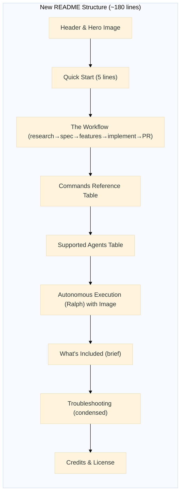

# Atomic README.md Update Technical Design Document

| Document Metadata      | Details                                                       |
| ---------------------- | ------------------------------------------------------------- |
| Author(s)              | lavaman131                                                    |
| Status                 | Draft (WIP)                                                   |
| Team / Owner           | Atomic CLI                                                    |
| Created / Last Updated | 2026-01-19                                                    |

## 1. Executive Summary

This spec proposes a major simplification of the Atomic README.md, reducing it from ~430 verbose lines to ~150 focused lines. The current README contains manual `cp` commands for setup that are now replaced by the new `@bastani/atomic` CLI package. The updated README will feature a streamlined Quick Start (`bunx @bastani/atomic`), workflow examples using the `atomic --agent <name>` pattern, and consolidated command/agent references. This change improves onboarding time and reduces cognitive load for new users.

**Research Reference:** [research/docs/2026-01-19-readme-update-research.md](../research/docs/2026-01-19-readme-update-research.md)

## 2. Context and Motivation

### 2.1 Current State

The current README.md (~430 lines) was written before the atomic CLI existed. It includes:

- **Manual copy commands** (lines 81-167): Multiple `cp -r` commands for each platform
- **MCP configuration steps**: Separate copy instructions for `.mcp.json` and `.vscode/`
- **Platform-specific setup**: Redundant instructions repeated for Claude Code, GitHub Copilot, Kiro, and OpenCode
- **Verbose procedure section**: Good content but lacks CLI-driven examples

**Current Quick Start Flow:**
```bash
# Current: 7+ manual steps
cp -r .devcontainer /path/to/your-project/
cp CLAUDE.md /path/to/your-project/
cp -r .claude /path/to/your-project-root/
cp .mcp.json /path/to/your-project/
cp -r .vscode/ /path/to/your-project/
# Then manually run agent and type slash commands
```

### 2.2 The Problem

| Issue | Impact |
|-------|--------|
| **Onboarding friction** | New users spend 5+ minutes copying files manually |
| **Error-prone setup** | Users often miss files or copy to wrong locations |
| **Outdated examples** | README doesn't reflect the CLI-first workflow |
| **Information overload** | 430 lines intimidate potential users |
| **No CLI examples** | The `atomic --agent` pattern is undocumented |

**User Impact:** Engineers evaluate Atomic, see complex setup, and abandon before trying it.

**Technical Context:** The `@bastani/atomic` CLI (published to npm) now handles all setup automatically:

From `src/config.ts:25-60`:
```typescript
export const AGENT_CONFIG: Record<AgentKey, AgentConfig> = {
  "claude-code": {
    cmd: "claude",
    additional_flags: ["--dangerously-skip-permissions"],
    folder: ".claude",
    additional_files: ["CLAUDE.md", ".mcp.json"],
  },
  opencode: { ... },
  "copilot-cli": { ... },
};
```

**Note:** The CLI automatically copies `.mcp.json` for Claude Code users, providing MCP server configuration out of the box.

From `src/index.ts:1-11`:
```
Usage:
  atomic              Interactive setup (same as 'atomic init')
  atomic init         Interactive setup with banner
  atomic --agent <n>  Run agent directly
  atomic --version    Show version
  atomic --help       Show help
```

## 3. Goals and Non-Goals

### 3.1 Functional Goals

- [ ] Reduce README to ~180 lines (from ~430), including full Ralph section
- [ ] Replace all manual `cp` commands with `bunx @bastani/atomic`
- [ ] Add Quick Start that takes <30 seconds to read
- [ ] Document `atomic --agent <name> /slash-command` pattern
- [ ] Provide clear command reference table
- [ ] Keep essential sections: Flywheel, Workflow, Troubleshooting
- [ ] Prefer `bun` (oven-sh/bun) in examples, with `npx` as fallback

### 3.2 Non-Goals (Out of Scope)

- [ ] Will NOT remove video overview (keep for visual learners)
- [ ] Will NOT move all documentation to separate files (keep README self-contained for core workflow)
- [ ] Will NOT add new features to the CLI (documentation only)
- [ ] Will NOT change the existing slash commands or agents
- [ ] Will NOT update platform-specific folders (`.claude/`, `.github/`, `.opencode/`)

## 4. Proposed Solution (High-Level Design)

### 4.1 New README Structure



### 4.2 Section Mapping (Current → New)

| Current Section | Lines | Action | New Section |
|-----------------|-------|--------|-------------|
| Header + Intro | 1-17 | Keep, condense | Header + Intro |
| Video Overview | 19-23 | Keep | Video Overview |
| Table of Contents | 25-40 | Remove | (none - too short to need) |
| The Memory Gap | 43-54 | Remove or move to docs | (optional appendix) |
| The Flywheel | 55-63 | Keep, simplify | The Flywheel |
| How It Works | 65-78 | Keep diagram, condense text | How It Works |
| Quick Start | 81-167 | **Replace entirely** | Quick Start |
| Our Procedure | 171-325 | Rewrite with CLI examples | The Workflow |
| The ROI | 328-337 | Remove | (none) |
| Platform Reference | 340-349 | Keep as table | Supported Agents |
| Ralph/Autonomous | 159-167 | **Expand with image** | Autonomous Execution (Ralph) |
| What's Included | 351-375 | Condense to one-liner | What's Included |
| How Atomic Differs | 378-398 | Remove or move to wiki | (none) |
| Troubleshooting | 401-416 | Keep, condense | Troubleshooting |
| License & Credits | 419-432 | Keep | License & Credits |

### 4.3 Key Content Changes

#### 4.3.1 New Quick Start Section

**Research Reference:** [research/docs/2026-01-19-readme-update-research.md, lines 159-187](../research/docs/2026-01-19-readme-update-research.md)

```markdown
## Quick Start

Install the atomic configuration for your AI coding agent:

```bash
# Using bun (recommended)
bunx @bastani/atomic

# Or using npx
npx @bastani/atomic
```

Select your agent (Claude Code, OpenCode, or GitHub Copilot CLI) and the CLI will configure your project automatically.

### Prerequisites

- [bun](https://bun.sh/docs/installation) or Node.js 18+
- Your preferred AI coding agent installed
```

#### 4.3.2 New Workflow Section with CLI Examples

**Research Reference:** [research/docs/2026-01-19-readme-update-research.md, lines 189-226](../research/docs/2026-01-19-readme-update-research.md)

```markdown
## The Workflow

```
Research → Spec → Features → Implement → PR
```

### 1. Research the Codebase

```bash
atomic --agent claude-code /research-codebase "Describe your feature or question"
```

### 2. Create a Specification

```bash
atomic --agent claude-code /create-spec research/
```

### 3. Break Into Features

```bash
atomic --agent claude-code /create-feature-list specs/your-spec.md
```

### 4. Implement Features

```bash
atomic --agent claude-code /implement-feature
```

Repeat until all features pass. Use `/ralph-loop` for autonomous mode.

### 5. Create Pull Request

```bash
atomic --agent claude-code /create-gh-pr
```
```

#### 4.3.3 Command Reference Table

**Research Reference:** [research/docs/2026-01-19-slash-commands.md, Summary Table](../research/docs/2026-01-19-slash-commands.md)

```markdown
## Commands

| Command | Arguments | Description |
|---------|-----------|-------------|
| `/research-codebase` | `[question]` | Analyze codebase and document findings |
| `/create-spec` | `[research-path]` | Generate technical specification |
| `/create-feature-list` | `[spec-path]` | Break spec into implementable tasks |
| `/implement-feature` | — | Implement next feature from list |
| `/commit` | `[message]` | Create conventional commit |
| `/create-gh-pr` | — | Push and create pull request |
| `/explain-code` | `[path]` | Explain code section in detail |
| `/ralph-loop` | `[--max-iterations N]` | Run autonomous implementation loop |
| `/cancel-ralph` | — | Stop autonomous loop |
```

#### 4.3.4 Supported Agents Table

**Source:** `src/config.ts:25-60`

```markdown
## Supported Agents

| Agent | CLI Command | Folder | Context File |
|-------|-------------|--------|--------------|
| Claude Code | `atomic --agent claude-code` | `.claude/` | `CLAUDE.md` |
| OpenCode | `atomic --agent opencode` | `.opencode/` | `AGENTS.md` |
| GitHub Copilot CLI | `atomic --agent copilot-cli` | `.github/` | `AGENTS.md` |
```

#### 4.3.5 Autonomous Execution (Ralph) Section

**Source:** [Ralph Wiggum Method](https://ghuntley.com/ralph/), [research/docs/2026-01-19-slash-commands.md](../research/docs/2026-01-19-slash-commands.md)

This section includes:
- Ralph Wiggum image for visual identity
- Brief explanation of the technique
- Commands table (`/ralph-loop`, `/cancel-ralph`, `/ralph-help`)
- Use cases and prerequisites

```markdown
## Autonomous Execution (Ralph)

<p align="center">
  
</p>

The [Ralph Wiggum Method](https://ghuntley.com/ralph/) enables multi-hour autonomous coding sessions. After approving your spec and feature list, let Ralph work in the background while you focus on other tasks.

### How It Works

1. Create and approve your spec (`/create-spec`)
2. Generate feature list (`/create-feature-list`)
3. Start autonomous loop (`/ralph-loop`)
4. Ralph implements features one-by-one until complete

### Commands

| Command | Description |
|---------|-------------|
| `/ralph-loop` | Start autonomous implementation loop |
| `/ralph-loop --max-iterations 20` | Limit to 20 iterations |
| `/cancel-ralph` | Stop the autonomous loop |
| `/ralph-help` | Show Ralph documentation |

### When to Use Ralph

**Good for:**
- Well-defined features with clear acceptance criteria
- Repetitive implementation tasks
- Overnight/background execution

**Not good for:**
- Tasks requiring human judgment or design decisions
- Exploratory coding or prototyping
- Features with unclear requirements

### Prerequisites

- [uv](https://docs.astral.sh/uv/getting-started/installation/) - Python package manager (for Ralph scripts)
- Currently supported: Claude Code (Mac/Linux and Windows PowerShell)
```

## 5. Detailed Design

### 5.1 Section-by-Section Specification

#### 5.1.1 Header (Lines 1-17)

**Keep:** Hero image, title, tagline.

**Modify:** Shorten intro to 2-3 sentences max:

```markdown
# Atomic

AI coding agents need context and procedures. Atomic provides both.

- **Procedures**: Automated workflows for research → spec → implement → PR
- **Memory**: Specs persist as documentation for future sessions
```

#### 5.1.2 Video Overview (Lines 19-23)

**Keep as-is.** Visual learners benefit from this.

**Note:** Research question from [research/docs/2026-01-19-readme-update-research.md, line 435](../research/docs/2026-01-19-readme-update-research.md): "Should the video link be kept? It references old manual setup."

**Decision:** Keep the video. Users can watch it for conceptual understanding. The Quick Start section will have current CLI commands.

#### 5.1.3 Table of Contents (Lines 25-40)

**Remove entirely.** A ~150 line README doesn't need a TOC. Users can scroll.

#### 5.1.4 The Memory Gap (Lines 43-54)

**Remove from main README.** This is conceptual background that can live in a `docs/concepts.md` file for users who want deeper understanding.

**Rationale:** Focus the README on "how to use" rather than "why it exists."

#### 5.1.5 The Flywheel (Lines 55-63)

**Keep but simplify:**

```markdown
## The Flywheel

```
Research → Specs → Execution → Outcomes → Specs (persistent memory)
                ↑                                    ↓
                └────────────────────────────────────┘
```

Every feature follows this cycle. Specs become memory for future sessions.
```

#### 5.1.6 How It Works (Lines 65-78)

**Keep diagram reference**, condense text:

```markdown
## How It Works

[](assets/architecture.svg)

| Resource | Purpose | Examples |
|----------|---------|----------|
| **Commands** | Orchestrate agents | `/research-codebase`, `/create-spec`, `/implement-feature` |
| **Agents** | Execute tasks | `codebase-analyzer`, `codebase-locator`, `debugger` |
| **Skills** | Domain knowledge | `testing-anti-patterns`, `prompt-engineer` |
```

#### 5.1.7 Quick Start (Lines 81-167)

**Replace entirely with new CLI-driven section.** See Section 4.3.1.

**Remove all:**
- Manual `cp` commands
- MCP configuration steps
- `.devcontainer` copy instructions
- Platform-specific copy instructions

#### 5.1.8 Our Procedure (Lines 171-325)

**Rewrite as "The Workflow" with CLI examples.** See Section 4.3.2.

**Keep:**
- Step-by-step flow
- "You review (CRITICAL)" checkpoints
- Key Principle at the end

**Remove:**
- Verbose explanations under each step
- `/compact` and session management details (move to docs)
- Debugging flow (move to Troubleshooting or docs)

#### 5.1.9 The ROI (Lines 328-337)

**Remove.** This is marketing copy that doesn't help users accomplish tasks.

#### 5.1.10 Platform Reference (Lines 340-349)

**Keep as condensed table.** See Section 4.3.4.

#### 5.1.11 What's Included (Lines 351-375)

**Condense to single summary line:**

```markdown
## What's Included

**7 Agents** | **10 Commands** | **2 Skills**

See the full list in [.claude/commands/](.claude/commands/) and [.claude/agents/](.claude/agents/).
```

#### 5.1.12 How Atomic Differs from Spec Kit (Lines 378-398)

**Remove from README.** This comparison is useful but not essential for getting started. Can be moved to a wiki or `docs/comparison.md`.

#### 5.1.13 Troubleshooting (Lines 401-416)

**Keep but condense:**

```markdown
## Troubleshooting

**Git Identity Error:** Run `git config --global user.name "Your Name"` and `git config --global user.email "you@example.com"`

**Permission Issues:** Claude Code requires `--dangerously-skip-permissions` flag (handled by CLI). Other agents need agent mode enabled.
```

#### 5.1.14 License & Credits (Lines 419-432)

**Keep as-is** with minor formatting cleanup.

### 5.2 Content Preservation Strategy

Content removed from README should be preserved:

| Removed Content | New Location |
|-----------------|--------------|
| The Memory Gap table | `docs/concepts.md` |
| Session Management (`/compact`, `/new`) | `docs/workflow.md` |
| Debugging Flow (`/create-debug-report`) | `docs/debugging.md` |
| How Atomic Differs from Spec Kit | `docs/comparison.md` or wiki |

**Note:** Creating these docs is OUT OF SCOPE for this spec. They can be added in a future iteration if needed.

**Important:** Ralph documentation stays in the README with full detail and image. Do NOT move to a separate doc.

### 5.3 Example Preferences

Per research requirements, prefer `bun` (oven-sh/bun) in all examples:

```bash
# Primary (bun)
bunx @bastani/atomic

# Fallback (npx)
npx @bastani/atomic
```

For running agents:
```bash
# Through atomic CLI
atomic --agent claude-code /implement-feature

# Or start agent interactively
atomic --agent claude-code
# Then type: /implement-feature
```

## 6. Alternatives Considered

| Option | Pros | Cons | Decision |
|--------|------|------|----------|
| **A: Minimal README (<50 lines)** | Ultra-concise, fast to read | Misses key concepts (flywheel, checkpoints) | Rejected - too sparse |
| **B: Split into multiple READMEs** | Highly organized | Fragmented experience, harder to discover | Rejected - complexity |
| **C: Keep current structure, just update Quick Start** | Minimal changes | Still verbose, inconsistent examples | Rejected - doesn't solve core issues |
| **D: Streamlined README (~150 lines)** | Balanced, CLI-focused, preserves key concepts | Requires content migration | **Selected** |

**Rationale for Option D:** The README should be the single authoritative quick-start guide. Removing marketing content and manual setup instructions while keeping the workflow and troubleshooting creates the right balance.

## 7. Cross-Cutting Concerns

### 7.1 Documentation Consistency

- All examples should use `bunx` as primary, `npx` as fallback
- Command syntax should match actual CLI behavior from `src/index.ts`
- Agent names must match `AGENT_CONFIG` keys: `claude-code`, `opencode`, `copilot-cli`

### 7.2 Backwards Compatibility

- Users who bookmarked specific README anchors may have broken links
- Solution: Use similar anchor names where possible (`#quick-start`, `#troubleshooting`)

### 7.3 SEO/Discoverability

- Keep essential keywords: "AI coding agent", "Claude Code", "GitHub Copilot", "slash commands"
- Ensure title and first paragraph are clear for GitHub preview

## 8. Migration, Rollout, and Testing

### 8.1 Implementation Steps

1. **Create new README content** following this spec
2. **Replace existing README.md** in single commit
3. **Update any internal links** that reference removed sections
4. **Verify all code examples** work with current CLI

### 8.2 Verification Checklist

- [ ] README is under 200 lines
- [ ] `bunx @bastani/atomic` appears in Quick Start
- [ ] All 5 workflow steps have CLI examples
- [ ] Command table includes all 10 commands from [research/docs/2026-01-19-slash-commands.md](../research/docs/2026-01-19-slash-commands.md)
- [ ] Agent table matches `src/config.ts` definitions
- [ ] No manual `cp` commands remain
- [ ] Troubleshooting section is present
- [ ] License and Credits are present
- [ ] Video overview link works
- [ ] Architecture diagram link works

### 8.3 Test Plan

- **Manual Test:** Follow Quick Start on a fresh project directory
- **Link Check:** Verify all internal/external links work
- **CLI Verification:** Run `bunx @bastani/atomic` and confirm it works as documented

## 9. Resolved Questions

- [x] **Video outdated:** Keep the video as-is. It provides conceptual understanding; Quick Start has current CLI commands.
- [x] **Ralph documentation depth:** Keep full Ralph detail in README with image. Do NOT move to separate doc.
- [x] **Devcontainer mention:** Remove from README. Users who need sandboxing can find it in the repo.
- [x] **MCP servers:** CLI now copies `.mcp.json` for Claude Code (added to `additional_files` in `src/config.ts`). No separate documentation needed.

---

## Appendix A: Proposed README.md Draft

```markdown
# Atomic

<p align="center">
  
</p>

AI coding agents need context and procedures. Atomic provides both.

- **Procedures**: Automated workflows for research → spec → implement → PR
- **Memory**: Specs persist as documentation for future sessions

---

## Video Overview

[](https://www.youtube.com/watch?v=Lq8-qzGfoy4)

---

## Quick Start

```bash
# Using bun (recommended)
bunx @bastani/atomic

# Or using npx
npx @bastani/atomic
```

Select your agent. The CLI configures your project automatically.

### Prerequisites

- [bun](https://bun.sh/docs/installation) or Node.js 18+
- AI agent installed: [Claude Code](https://docs.anthropic.com/en/docs/claude-code/setup), [OpenCode](https://opencode.ai), or [GitHub Copilot CLI](https://github.com/github/copilot-cli)

---

## The Workflow

```
Research → Spec → Features → Implement → PR
```

### 1. Research the Codebase

```bash
atomic --agent claude-code /research-codebase "Describe your feature or question"
```

**You review:** Confirm the agent understood your codebase and requirements.

### 2. Create a Specification

```bash
atomic --agent claude-code /create-spec research/
```

**You review (CRITICAL):** This is your main decision point. The spec becomes the contract.

### 3. Break Into Features

```bash
atomic --agent claude-code /create-feature-list specs/your-spec.md
```

**You review:** Verify the breakdown makes sense. Reorder if needed.

### 4. Implement Features

```bash
atomic --agent claude-code /implement-feature
```

Repeat until all features pass. Use `/ralph-loop` for autonomous mode.

### 5. Create Pull Request

```bash
atomic --agent claude-code /create-gh-pr
```

---

## Commands

| Command | Arguments | Description |
|---------|-----------|-------------|
| `/research-codebase` | `[question]` | Analyze codebase and document findings |
| `/create-spec` | `[research-path]` | Generate technical specification |
| `/create-feature-list` | `[spec-path]` | Break spec into implementable tasks |
| `/implement-feature` | — | Implement next feature from list |
| `/commit` | `[message]` | Create conventional commit |
| `/create-gh-pr` | — | Push and create pull request |
| `/explain-code` | `[path]` | Explain code section in detail |
| `/ralph-loop` | `[--max-iterations N]` | Run autonomous implementation loop |
| `/cancel-ralph` | — | Stop autonomous loop |
| `/ralph-help` | — | Show Ralph documentation |

---

## Supported Agents

| Agent | CLI Command | Folder | Context File |
|-------|-------------|--------|--------------|
| Claude Code | `atomic --agent claude-code` | `.claude/` | `CLAUDE.md` |
| OpenCode | `atomic --agent opencode` | `.opencode/` | `AGENTS.md` |
| GitHub Copilot CLI | `atomic --agent copilot-cli` | `.github/` | `AGENTS.md` |

---

## Autonomous Execution (Ralph)

<p align="center">
  
</p>

The [Ralph Wiggum Method](https://ghuntley.com/ralph/) enables multi-hour autonomous coding sessions. After approving your spec and feature list, let Ralph work in the background while you focus on other tasks.

### How It Works

1. Create and approve your spec (`/create-spec`)
2. Generate feature list (`/create-feature-list`)
3. Start autonomous loop (`/ralph-loop`)
4. Ralph implements features one-by-one until complete

### Commands

| Command | Description |
|---------|-------------|
| `/ralph-loop` | Start autonomous implementation loop |
| `/ralph-loop --max-iterations 20` | Limit to 20 iterations |
| `/cancel-ralph` | Stop the autonomous loop |
| `/ralph-help` | Show Ralph documentation |

### When to Use Ralph

**Good for:**
- Well-defined features with clear acceptance criteria
- Repetitive implementation tasks
- Overnight/background execution

**Not good for:**
- Tasks requiring human judgment or design decisions
- Exploratory coding or prototyping
- Features with unclear requirements

### Prerequisites

- [uv](https://docs.astral.sh/uv/getting-started/installation/) - Python package manager (for Ralph scripts)
- Currently supported: Claude Code (Mac/Linux and Windows PowerShell)

---

## What's Included

**7 Agents** | **10 Commands** | **2 Skills**

- **Agents**: codebase-analyzer, codebase-locator, codebase-online-researcher, codebase-pattern-finder, codebase-research-analyzer, codebase-research-locator, debugger
- **Skills**: prompt-engineer, testing-anti-patterns

---

## Troubleshooting

**Git Identity Error:** Configure git identity:
```bash
git config --global user.name "Your Name"
git config --global user.email "you@example.com"
```

**Permission Issues:** Claude Code requires `--dangerously-skip-permissions` (handled automatically by CLI). Other agents need agent mode enabled.

---

## License

MIT

## Credits

- [Superpowers](https://github.com/obra/superpowers)
- [Anthropic Skills](https://github.com/anthropics/skills)
- [Ralph Wiggum Method](https://ghuntley.com/ralph/)
- [OpenAI Codex Cookbook](https://github.com/openai/openai-cookbook)
- [HumanLayer](https://github.com/humanlayer/humanlayer)
```

---

## Appendix B: Line Count Comparison

| Version | Lines | Reduction |
|---------|-------|-----------|
| Current README.md | ~430 | — |
| Proposed README.md | ~180 | **58%** |

**Note:** The ~180 line count includes the expanded Ralph section with image. This is still a significant reduction while providing comprehensive autonomous execution documentation.

---

## Appendix C: Research References

- Primary: [research/docs/2026-01-19-readme-update-research.md](../research/docs/2026-01-19-readme-update-research.md)
- Supporting: [research/docs/2026-01-19-slash-commands.md](../research/docs/2026-01-19-slash-commands.md)
- CLI Source: `src/index.ts`, `src/config.ts`, `src/commands/init.ts`
