# Atomic README.md v0.4.12 Update Technical Design Document

| Document Metadata      | Details                                                       |
| ---------------------- | ------------------------------------------------------------- |
| Author(s)              | flora131                                                      |
| Status                 | Draft (WIP)                                                   |
| Team / Owner           | Atomic CLI                                                    |
| Created / Last Updated | 2026-02-20                                                    |

## 1. Executive Summary

This spec proposes an incremental update to the Atomic README.md, bringing it current with v0.4.12 changes since the last update at v0.4.8. The current README is largely accurate but has gaps: one missing skill (`frontend-design`), two undocumented slash commands (`/theme`, `/exit`), an incomplete Ralph "How It Works" description (missing the review step and `worker`/`reviewer` sub-agents), no documentation of `atomic chat` flags, and no TUI-specific feature docs. The `reviewer` and `worker` agents will be documented in the Ralph section rather than the main Agents table. A new standalone TUI Features section will cover keyboard shortcuts, themes, @mentions, and verbose mode. All slash commands are listed by canonical name only (no aliases column).

**Research Reference:** [research/docs/2026-02-20-readme-update-research.md](../research/docs/2026-02-20-readme-update-research.md)

## 2. Context and Motivation

### 2.1 Current State

The README was substantially rewritten in v0.4.8 (commit `b8fffeb`) based on the [initial README update spec](../specs/readme-update-spec.md). That rewrite transformed the README from a manual-setup-focused document (~430 lines) into a CLI-driven, workflow-oriented document (~765 lines). Since then, three releases have shipped (v0.4.9, v0.4.10, v0.4.11, v0.4.12) introducing:

- **New agents**: `reviewer` and `worker` (used by Ralph workflow)
- **New skill**: `frontend-design`
- **New built-in commands**: `/theme`, `/exit`
- **Ralph enhancement**: 3-step process with automated review
- **TUI features**: themes, keyboard shortcuts, transcript view, verbose mode, @mentions

The README structure and flow remain sound. This is a targeted content update, not a restructuring.

**Research Reference:** [research/docs/2026-02-20-readme-update-research.md, Section 10 "Summary of All Required Changes"](../research/docs/2026-02-20-readme-update-research.md)

### 2.2 The Problem

| Issue | Impact |
|-------|--------|
| **Missing agents** | Users don't know `reviewer` and `worker` exist, can't invoke them directly or understand Ralph's internals |
| **Missing skill** | `frontend-design` skill not discoverable via README |
| **Missing commands** | Users don't know `/theme` and `/exit` exist; must discover them via `/help` |
| **Incomplete Ralph docs** | Ralph's review step (Step 3) is undocumented; users don't know Ralph self-reviews |
| **No chat flag docs** | Users must run `atomic chat --help` to discover flags like `--theme`, `--model`, `--workflow`, `--max-iterations` |
| **No TUI feature docs** | Keyboard shortcuts (Ctrl+O, Ctrl+C), verbose mode, transcript view are undiscoverable |

**User Impact:** Users with incomplete documentation may underutilize features, file unnecessary issues, or lose confidence in documentation accuracy.

## 3. Goals and Non-Goals

### 3.1 Functional Goals

- [ ] Document `reviewer` and `worker` agents in the Ralph section (not the main Agents table)
- [ ] Add `frontend-design` to the Skills table
- [ ] Add `/theme` and `/exit` to the Slash Commands table
- [ ] Update Ralph "How It Works" to describe the 3-step process (decompose, implement, review & fix)
- [ ] Ensure all slash commands are listed directly (no aliases column; remove any that no longer exist)
- [ ] Add `atomic chat` flag reference (full flags: `-a`, `-w`, `-t`, `-m`, `--max-iterations`, `[prompt...]`)
- [ ] Add `atomic init` flag documentation (`-a` flag)
- [ ] Optionally add a TUI Features section or subsection documenting keyboard shortcuts and UI features

### 3.2 Non-Goals (Out of Scope)

- [ ] Will NOT restructure the README layout (the current structure is sound)
- [ ] Will NOT change installation, telemetry, configuration, or troubleshooting sections (verified accurate)
- [ ] Will NOT update the Supported Coding Agents table (verified accurate)
- [ ] Will NOT modify the .atomic.json documentation (verified accurate)
- [ ] Will NOT add new features to the CLI (documentation only)

## 4. Proposed Solution (High-Level Design)

### 4.1 Change Overview

This is a targeted content update across 6 specific README sections. No structural changes required.

```mermaid
%%{init: {'theme':'base', 'themeVariables': { 'primaryColor':'#f8f9fa','primaryTextColor':'#2c3e50','primaryBorderColor':'#4a5568','lineColor':'#4a90e2','secondaryColor':'#ffffff','tertiaryColor':'#e9ecef'}}}%%

flowchart TB
    classDef changed fill:#fbbf24,stroke:#d97706,stroke-width:2px,color:#1a1a1a,font-weight:600
    classDef unchanged fill:#86efac,stroke:#22c55e,stroke-width:2px,color:#1a1a1a,font-weight:600
    classDef new fill:#93c5fd,stroke:#3b82f6,stroke-width:2px,color:#1a1a1a,font-weight:600

    A["Header & Intro"]:::unchanged
    B["Video Overview"]:::unchanged
    C["What Engineers Use Atomic For"]:::unchanged
    D["Table of Contents"]:::changed
    E["Set up Atomic"]:::unchanged
    F["The Flywheel"]:::unchanged
    G["How It Works"]:::unchanged
    H["The Workflow"]:::unchanged
    I["CLI Commands Table"]:::changed
    J["Slash Commands Table"]:::changed
    K["Agents Table"]:::changed
    L["Skills Table"]:::changed
    M["Supported Coding Agents"]:::unchanged
    N["Ralph Section"]:::changed
    O["Configuration Files"]:::unchanged
    P["Updating / Uninstalling"]:::unchanged
    Q["Telemetry"]:::unchanged
    R["Troubleshooting"]:::unchanged
    S["FAQ / Credits / License"]:::unchanged
    T["TUI Features Section"]:::new

    A --> B --> C --> D --> E --> F --> G --> H --> I --> J --> K --> L --> T --> M --> N --> O --> P --> Q --> R --> S
```



**Legend:**
- Yellow: Modified sections
- Green: Unchanged sections (verified accurate)
- Blue: New sections

### 4.2 Architectural Pattern

This is a documentation-only change following an additive update pattern: no content is removed, only added or modified.

### 4.3 Key Changes

| Section | Change Type | What Changes |
|---------|-------------|--------------|
| CLI Commands Table (README ~L341-351) | Modify | Add flag reference for `atomic chat` and `atomic init` |
| Slash Commands Table (README ~L353-373) | Modify | Add `/theme`, `/exit`; no aliases column |
| Agents Table (README ~L374-387) | No change | `reviewer` and `worker` documented in Ralph section instead |
| Skills Table (README ~L388-396) | Modify | Add `frontend-design` row |
| Ralph Section (README ~L409-453) | Modify | Update "How It Works" to 3-step process |
| Table of Contents (README ~L96-115) | Modify | Add entry for new TUI Features section |
| TUI Features (new section) | Add | Keyboard shortcuts, themes, verbose mode, transcript view |

## 5. Detailed Design

### 5.1 CLI Commands Table Update

**Current location:** README lines 341-351

Add a detailed flag reference below the CLI Commands table for `atomic chat` and `atomic init`.

**New content to add after the CLI Commands table:**

#### `atomic chat` Flags

| Flag | Default | Description |
|------|---------|-------------|
| `-a, --agent <name>` | `"claude"` | Agent to chat with (`claude`, `opencode`, `copilot`) |
| `-w, --workflow` | `false` | Enable graph workflow mode |
| `-t, --theme <name>` | `"dark"` | UI theme (`dark`, `light`) |
| `-m, --model <name>` | (none) | Model to use for the chat session |
| `--max-iterations <n>` | `"100"` | Maximum iterations for workflow mode |
| `[prompt...]` | (none) | Initial prompt to send |

#### `atomic init` Flags

| Flag | Default | Description |
|------|---------|-------------|
| `-a, --agent <name>` | (none) | Pre-select agent (skips interactive prompt) |
| `--scm <type>` | (none) | Pre-select source control (`github`, `sapling`) |

**Research Reference:** [research/docs/2026-02-20-readme-update-research.md, Section 1 "CLI Commands Table"](../research/docs/2026-02-20-readme-update-research.md)

### 5.2 Slash Commands Table Update

**Current location:** README lines 353-373

Add `/theme` and `/exit` as new rows. Remove any commands that no longer exist. No aliases column needed; all commands are listed directly by their primary name.

| Command | Arguments | Description |
|---------|-----------|-------------|
| `/help` | | Show all available commands |
| `/clear` | | Clear all messages and reset session |
| `/compact` | | Compact context to reduce token usage |
| `/model` | `[model\|list\|select]` | View/switch active model |
| `/mcp` | `[enable\|disable]` | View and toggle MCP servers |
| `/theme` | `[dark\|light]` | Toggle between dark and light theme |
| `/exit` | | Exit the chat application |
| `/init` | | Generate `CLAUDE.md` and `AGENTS.md` by exploring codebase |
| `/research-codebase` | `"<question>"` | Analyze codebase and document findings |
| `/create-spec` | `"<research-path>"` | Generate technical specification |
| `/explain-code` | `"<path>"` | Explain code section in detail |
| `/gh-commit` | | Create a Git commit using Git/GitHub workflow |
| `/gh-create-pr` | | Commit, push, and open a GitHub pull request |
| `/sl-commit` | | Create a Sapling commit |
| `/sl-submit-diff` | | Submit Sapling changes to Phabricator |
| `/ralph` | `"<prompt>"` | Run autonomous implementation workflow |

**Note:** The research document mentions aliases (e.g., `/loop` for `/ralph`), but per clarification these do not exist. All commands are listed by their canonical name only.

**Research Reference:** [research/docs/2026-02-20-readme-update-research.md, Section 2 "Slash Commands Table"](../research/docs/2026-02-20-readme-update-research.md)

### 5.3 Agents Table

**Current location:** README lines 374-387

**No changes to the main Agents table.** The `reviewer` and `worker` agents are internal to Ralph and will be documented in the Ralph section instead (see Section 5.5).

The existing 7 agents remain as-is:

| Agent | Purpose |
|-------|---------|
| `codebase-analyzer` | Analyze implementation details of specific components |
| `codebase-locator` | Locate files, directories, and components for a task |
| `codebase-pattern-finder` | Find similar implementations and usage examples |
| `codebase-online-researcher` | Research questions using web sources |
| `codebase-research-analyzer` | Deep dive on research topics |
| `codebase-research-locator` | Discover relevant documents in `research/` directory |
| `debugger` | Debug errors, test failures, and unexpected behavior |

**Research Reference:** [research/docs/2026-02-20-readme-update-research.md, Section 3 "Agents Table"](../research/docs/2026-02-20-readme-update-research.md)

### 5.4 Skills Table Update

**Current location:** README lines 388-396

Add one new row:

| Skill | Purpose |
|-------|---------|
| `testing-anti-patterns` | Prevent common testing mistakes (mock misuse, test pollution) |
| `prompt-engineer` | Apply best practices when creating or improving prompts |
| `frontend-design` | Create distinctive, production-grade frontend interfaces with high design quality |

**Research Reference:** [research/docs/2026-02-20-readme-update-research.md, Section 4 "Skills Table"](../research/docs/2026-02-20-readme-update-research.md)

### 5.5 Ralph Section Update

**Current location:** README lines 409-453

Update the "How It Works" subsection to describe the full 3-step process:

**Current:**
```
1. Create and approve your spec (`/create-spec`)
2. Start the workflow (`/ralph "<prompt-or-spec-path>"`)
3. Ralph decomposes tasks and implements features one-by-one until complete
```

**Proposed:**
```
1. Create and approve your spec (`/create-spec`)
2. Start the workflow (`/ralph "<prompt-or-spec-path>"`)
3. Ralph executes a 3-step process:
   - **Step 1 — Task Decomposition**: Breaks the spec/prompt into a structured task list
   - **Step 2 — Implementation Loop**: Dispatches `worker` sub-agents to implement tasks one-by-one (up to 100 iterations)
   - **Step 3 — Review & Fix**: Spawns a `reviewer` sub-agent to audit the implementation, generates fix specs if needed, and re-runs implementation for any issues found
```

**Note:** The `worker` and `reviewer` agents are documented here rather than in the main Agents table because they are internal to the Ralph workflow and not typically invoked directly by users.

**Research Reference:** [research/docs/2026-02-20-readme-update-research.md, Section 6 "Ralph Section"](../research/docs/2026-02-20-readme-update-research.md)

### 5.6 TUI Features Section (New)

Add a new section after "Skills" and before "Supported Coding Agents" documenting TUI-specific features.

**Proposed content:**

```markdown
### TUI Features

The Atomic TUI chat interface includes several features for an enhanced development experience.

#### Keyboard Shortcuts

| Shortcut | Action |
|----------|--------|
| `Ctrl+O` | Open transcript view |
| `Ctrl+C` | Interrupt current operation |

#### Themes

Switch between dark and light themes:

```bash
# Via CLI flag
atomic chat -a claude --theme light

# Via slash command in chat
/theme dark
```

#### @Mentions

Reference files in your messages using `@` mentions. The TUI provides autocomplete suggestions as you type.

#### Verbose Mode

Toggle verbose output to see detailed agent activity, tool calls, and token usage.
```

### 5.7 Table of Contents Update

**Current location:** README lines 96-115

Add entry for "TUI Features" section if it is added. Update the ToC to reflect any new anchors.

## 6. Alternatives Considered

| Option | Pros | Cons | Decision |
|--------|------|------|----------|
| **A: Minimal update (agents + skills only)** | Smallest diff, lowest risk | Leaves commands and Ralph docs inaccurate | Rejected - incomplete |
| **B: Full update (all changes in this spec)** | Comprehensive, accurate docs | Slightly larger diff | **Selected** |
| **C: Full update + separate TUI docs page** | Keeps README lean | Fragments docs, harder discovery | Rejected - overkill for this scope |

## 7. Cross-Cutting Concerns

### 7.1 Documentation Consistency

- New slash command entries must follow the existing table format (Command, Arguments, Description columns plus new Aliases column)
- Agent entries must follow existing format (Agent name in backticks, Purpose as sentence fragment)
- Skill entries must follow existing format (Skill name in backticks, Purpose as sentence fragment)
- All command/flag names must match the actual CLI implementation in `src/commands/chat.ts` and `src/ui/commands/builtin-commands.ts`

### 7.2 Backwards Compatibility

- No sections are removed; all existing anchor links remain valid
- New sections are additive only
- ToC entries are added, not reorganized

### 7.3 Verification Against Source Code

Key source files to verify against:

| Claim | Source File |
|-------|------------|
| `atomic chat` flags | `src/commands/chat.ts` |
| `atomic init` flags | `src/commands/init.ts` |
| Built-in slash commands | `src/ui/commands/builtin-commands.ts` |
| Agent definitions | `.claude/agents/`, `.opencode/agents/`, `.github/agents/` |
| Skill definitions | `.claude/skills/`, `.opencode/skills/`, `.github/skills/` |
| Ralph 3-step process | `src/ui/commands/workflow-commands.ts:547-800` |
| Theme system | `src/ui/theme.tsx` |

## 8. Migration, Rollout, and Testing

### 8.1 Implementation Steps

- [ ] Phase 1: Update CLI Commands table with full flag tables for `atomic chat` and `atomic init`
- [ ] Phase 2: Update Slash Commands table (add `/theme`, `/exit`; remove any stale commands)
- [ ] Phase 3: Update Skills table (add `frontend-design`)
- [ ] Phase 4: Update Ralph "How It Works" to 3-step process with `worker` and `reviewer` sub-agent docs
- [ ] Phase 5: Add standalone TUI Features section (keyboard shortcuts, themes, @mentions, verbose mode)
- [ ] Phase 6: Update Table of Contents
- [ ] Phase 7: Verify all changes against source code

### 8.2 Verification Checklist

- [ ] All `atomic chat` flags match `src/commands/chat.ts` definitions
- [ ] All `atomic init` flags match `src/commands/init.ts` definitions
- [ ] `/theme` and `/exit` match `src/ui/commands/builtin-commands.ts`
- [ ] `reviewer` and `worker` agents referenced in Ralph section exist in `.claude/agents/`, `.opencode/agents/`, `.github/agents/`
- [ ] `frontend-design` skill exists in `.claude/skills/`, `.opencode/skills/`, `.github/skills/`
- [ ] Ralph 3-step description matches `workflow-commands.ts` implementation
- [ ] Table of Contents anchors all resolve correctly
- [ ] No broken markdown formatting

### 8.3 Test Plan

- **Manual Review:** Read the updated README end-to-end for accuracy and flow
- **Link Check:** Verify all internal anchor links work
- **Source Verification:** Cross-reference every new entry against the corresponding source file
- **Diff Review:** Ensure no accidental deletions or modifications to verified-accurate sections

## 9. Open Questions / Unresolved Issues

- [x] **TUI Features section scope:** Resolved — Add a new standalone "TUI Features" subsection under "Commands, Agents, and Skills".
- [x] **Aliases column in Slash Commands:** Resolved — No aliases column. All commands listed by canonical name only. Research-reported aliases (e.g., `/loop`) do not exist.
- [x] **Chat flags detail level:** Resolved — Full flag table for `atomic chat` and `atomic init` under the CLI Commands section.
- [x] **reviewer/worker agent visibility:** Resolved — Document `reviewer` and `worker` in the Ralph section only, not in the main Agents table. They are internal to Ralph.

---

## Appendix A: Research References

- Primary: [research/docs/2026-02-20-readme-update-research.md](../research/docs/2026-02-20-readme-update-research.md)
- Previous spec: [specs/readme-update-spec.md](../specs/readme-update-spec.md) (v0.4.8 README rewrite)
- Source: `src/commands/chat.ts`, `src/commands/init.ts`, `src/ui/commands/builtin-commands.ts`, `src/ui/commands/workflow-commands.ts`

## Appendix B: Sections Verified Accurate (No Changes Needed)

Per the research document, the following sections have been verified as accurate and require no modifications:

| Section | README Lines | Status |
|---------|-------------|--------|
| Supported Coding Agents table | ~L399-406 | Accurate |
| Configuration Files (.atomic.json) | ~L456-494 | Accurate |
| Installation | ~L118-248 | Accurate |
| Telemetry | ~L608-689 | Accurate |
| Troubleshooting | ~L693-718 | Accurate |
| The Workflow steps | ~L269-337 | Accurate |
