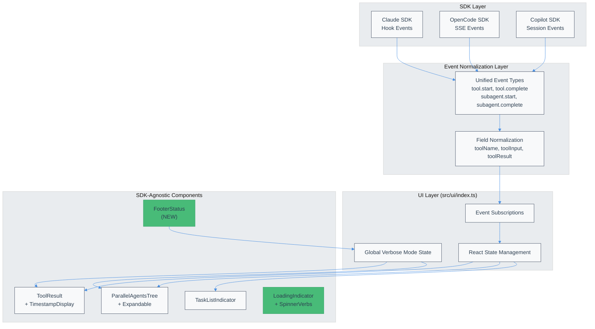

# Atomic TUI SDK UI Standardization Technical Design Document

| Document Metadata      | Details                                                                        |
| ---------------------- | ------------------------------------------------------------------------------ |
| Author(s)              | Developer                                                                      |
| Status                 | Draft (WIP)                                                                    |
| Team / Owner           | Atomic Team                                                                    |
| Created / Last Updated | 2026-02-12                                                                     |

## 1. Executive Summary

This RFC proposes standardizing the Atomic TUI's UI components to match Claude Code CLI design patterns, ensuring a consistent experience across all three coding agent SDKs (Claude, OpenCode, Copilot). The current architecture already implements a unified event normalization layer (`CodingAgentClient` interface) with SDK-agnostic UI components. However, feature gaps exist: permission mode footer, spinner verb customization, consistent timestamp display, and global verbose mode toggle. The proposed solution fills these gaps by enhancing existing components and adding a footer status line, delivering a polished, unified UI regardless of which SDK backend is active.

## 2. Context and Motivation

### 2.1 Current State

The Atomic TUI has a well-architected three-layer system:

**Event Normalization Layer** (`src/sdk/*-client.ts`):
- Each SDK client (Claude, OpenCode, Copilot) maps native events to unified `EventType` values
- Field names are normalized (e.g., `tool_name`/`part.tool`/`toolName` → `toolName`)

**UI Layer** (`src/ui/index.ts`):
- Subscribes to unified events via `client.on(eventType, handler)`
- Updates React state for components

**Component Layer** (`src/ui/components/*.tsx`):
- SDK-agnostic components: `ToolResult`, `ParallelAgentsTree`, `TaskListIndicator`
- Render based on normalized event data

**Reference**: `research/docs/2026-02-12-sdk-ui-standardization-comprehensive.md:114-155`

### 2.2 The Problem

| Issue | User Impact | Business Impact |
|-------|-------------|-----------------|
| Inconsistent timestamps | Users can't track when operations occurred | Debugging difficulty |
| No permission mode indicator | Users unaware of current approval mode | Unexpected auto-approvals |
| Fixed loading indicator | Feels static compared to Claude Code | Poor UX perception |
| Partial verbose mode | Can't expand all outputs globally | Information overload |

**Technical Debt**: The architecture is sound, but UI enhancements were deprioritized in favor of SDK integration work.

### 2.3 Target UI (Claude Code Reference)

**Tool Output (Collapsed)**:
```
● Read 1 file (ctrl+o to expand)
```

**Tool Output (Expanded)**:
```
● Read(package.json)
  ⎿  Read 5 lines

● Here are the first 5 lines:                     01:58 AM  claude-opus-4-5
```

**Sub-Agent Tree**:
```
● Running 3 Explore agents… (ctrl+o to expand)
├─ Explore project structure · 0 tool uses
│  ⎿  Initializing...
└─ Explore source code · 0 tool uses
   ⎿  Initializing...
```

**Footer**:
```
  ⏵⏵ bypass permissions on (shift+tab to cycle)
```

**Reference**: `research/docs/2026-02-01-claude-code-ui-patterns-for-atomic.md:82-116`

## 3. Goals and Non-Goals

### 3.1 Functional Goals

- [ ] Permission mode footer displays current mode with toggle hint
- [ ] Spinner shows customizable verbs ("Thinking...", "Analyzing...")
- [ ] Timestamps displayed consistently on all tool outputs (right-aligned)
- [ ] Global verbose mode toggle (Ctrl+O) expands/collapses all outputs
- [ ] Copilot `subagent.failed` mapped to `subagent.complete` with `success: false`

### 3.2 Non-Goals (Out of Scope)

- [ ] We will NOT restructure the event normalization layer (architecture is sound)
- [ ] We will NOT add message queuing (separate RFC)
- [ ] We will NOT implement independent context for Copilot sub-agents (SDK limitation)
- [ ] We will NOT persist verbose mode across sessions
- [ ] We will NOT add user-configurable spinner verbs (use predefined list)

## 4. Proposed Solution (High-Level Design)

### 4.1 System Architecture Diagram



### 4.2 Architectural Pattern

The enhancement follows the existing **Publisher-Subscriber pattern** with React state management:

1. **SDK Clients** emit unified events (no changes needed)
2. **UI Layer** subscribes and updates state (add verbose mode global state)
3. **Components** render based on state + verbose mode (enhance existing components)

### 4.3 Key Components

| Component | Responsibility | Changes |
|-----------|----------------|---------|
| `FooterStatus` | Display permission mode + queue count | **NEW** - Footer line component |
| `LoadingIndicator` | Show animated loading with verbs | **ENHANCE** - Add spinner verbs |
| `TimestampDisplay` | Right-aligned timestamp + model | **ENHANCE** - Consistent usage |
| `ToolResult` | Collapsible tool output | **ENHANCE** - Global verbose mode |
| `ParallelAgentsTree` | Sub-agent tree visualization | **ENHANCE** - Global verbose mode |
| `useVerboseMode` | Global verbose state hook | **NEW** - Shared state |

## 5. Detailed Design

### 5.1 API Interfaces

#### Global Verbose Mode State

**Location**: `src/ui/hooks/use-verbose-mode.ts` (NEW)

```typescript
interface VerboseModeState {
  isVerbose: boolean;
  toggle: () => void;
  setVerbose: (value: boolean) => void;
}

function useVerboseMode(): VerboseModeState;
```

**Usage in Components**:
```typescript
const { isVerbose, toggle } = useVerboseMode();

// In keyboard handler
useKeyboard((event) => {
  if (event.ctrl && event.name === 'o') {
    toggle();
  }
});
```

#### Footer Status Component

**Location**: `src/ui/components/footer-status.tsx` (NEW)

```typescript
interface FooterStatusProps {
  permissionMode: 'default' | 'auto-edit' | 'plan' | 'yolo';
  isStreaming: boolean;
  queuedCount?: number;
}

function FooterStatus({ permissionMode, isStreaming, queuedCount }: FooterStatusProps): JSX.Element;
```

**Rendered Output**:
```
⏵⏵ bypass permissions on (shift+tab to cycle)
```

#### Spinner Verb Configuration

**Location**: `src/ui/constants/spinner-verbs.ts` (NEW)

```typescript
export const SPINNER_VERBS = [
  "Thinking",
  "Analyzing", 
  "Processing",
  "Computing",
  "Reasoning",
  "Working",
  "Considering",
] as const;

export function getRandomVerb(): string;
```

### 5.2 Data Model / Schema

#### Enhanced ChatMessage Interface

**Location**: `src/ui/types.ts`

```typescript
interface ChatMessage {
  id: string;
  role: 'user' | 'assistant' | 'system';
  content: string;
  timestamp: string;           // ISO timestamp
  durationMs?: number;         // NEW: Time from send to complete
  model?: string;              // NEW: Model used for this message
  toolCalls?: ToolExecution[];
}
```

#### Footer Status State

**Location**: `src/ui/types.ts`

```typescript
type PermissionMode = 'default' | 'auto-edit' | 'plan' | 'yolo';

interface FooterState {
  permissionMode: PermissionMode;
  queuedMessages: number;
}
```

### 5.3 Algorithms and State Management

#### Verbose Mode Toggle Flow

```
User presses Ctrl+O
       │
       ▼
useKeyboard captures event
       │
       ▼
toggle() called in useVerboseMode
       │
       ▼
React state updated (isVerbose = !isVerbose)
       │
       ▼
Components re-render with new collapsed state
       │
       ├── ToolResult: collapsed={!isVerbose}
       ├── ParallelAgentsTree: compact={!isVerbose}
       └── TimestampDisplay: visible={isVerbose}
```

**Reference**: `research/docs/2026-02-01-claude-code-ui-patterns-for-atomic.md:286-304`

#### Timestamp Display Algorithm

```typescript
function formatTimestamp(isoString: string): string {
  const date = new Date(isoString);
  return date.toLocaleTimeString('en-US', {
    hour: 'numeric',
    minute: '2-digit',
    hour12: true
  });
  // Output: "01:58 AM"
}

function formatDuration(ms: number): string {
  if (ms < 1000) return `${ms}ms`;
  if (ms < 60000) return `${(ms / 1000).toFixed(1)}s`;
  const min = Math.floor(ms / 60000);
  const sec = Math.round((ms % 60000) / 1000);
  return `${min}m ${sec}s`;
}
```

**Reference**: `research/docs/2026-02-01-claude-code-ui-patterns-for-atomic.md:336-347`

## 6. Alternatives Considered

| Option | Pros | Cons | Reason for Rejection |
|--------|------|------|---------------------|
| **A: Per-component verbose state** | Simple, no shared state | Inconsistent expand/collapse, confusing UX | Users expect Ctrl+O to toggle all outputs |
| **B: Persist verbose mode to config** | Remembers preference | Claude Code doesn't persist, session-specific | Added complexity for minimal benefit |
| **C: User-configurable spinner verbs** | Personalization | Config file management, over-engineering | Predefined list sufficient for MVP |
| **D: Global verbose mode (Selected)** | Consistent UX, matches Claude Code | Requires shared state management | **Selected**: Best UX match, minimal complexity |

## 7. Cross-Cutting Concerns

### 7.1 Security and Privacy

- **No security implications**: UI-only changes
- **Permission mode display**: Helps users understand current security posture

### 7.2 Observability Strategy

- **Verbose mode state**: Log toggle events for UX analytics
- **Metrics**: Track `verbose_mode_toggle_count`, `spinner_verb_displayed`

### 7.3 Accessibility

- **Keyboard navigation**: Ctrl+O documented in footer hint
- **Color contrast**: Catppuccin theme colors meet WCAG AA standards
- **Screen readers**: Status dots have text alternatives (`status: "running"`)

### 7.4 Performance

- **Re-render optimization**: Verbose mode toggle triggers re-render only for affected components
- **Spinner verb selection**: `useMemo` with random seed prevents re-selection on re-render

## 8. Migration, Rollout, and Testing

### 8.1 Deployment Strategy

- [ ] Phase 1: Add `useVerboseMode` hook and wire to existing components
- [ ] Phase 2: Add `FooterStatus` component
- [ ] Phase 3: Add spinner verbs to `LoadingIndicator`
- [ ] Phase 4: Consistent timestamp display across all outputs
- [ ] Phase 5: Fix Copilot `subagent.failed` mapping

### 8.2 Files to Modify

| File | Changes |
|------|---------|
| `src/ui/hooks/use-verbose-mode.ts` | **NEW** - Global verbose state |
| `src/ui/constants/spinner-verbs.ts` | **NEW** - Spinner verb list |
| `src/ui/components/footer-status.tsx` | **NEW** - Footer component |
| `src/ui/components/tool-result.tsx` | Accept verbose prop, add timestamp |
| `src/ui/components/parallel-agents-tree.tsx` | Accept verbose prop |
| `src/ui/chat.tsx` | Integrate verbose mode, add footer |
| `src/sdk/copilot-client.ts` | Fix `subagent.failed` mapping |

### 8.3 Test Plan

**Unit Tests**:
- [ ] `useVerboseMode` hook toggles correctly
- [ ] `formatTimestamp` produces correct output
- [ ] `formatDuration` handles all cases
- [ ] `getRandomVerb` returns valid verb

**Integration Tests**:
- [ ] Ctrl+O toggles verbose mode across all components
- [ ] Footer displays correct permission mode
- [ ] Timestamps appear in verbose mode, hidden otherwise

**End-to-End Tests**:
- [ ] Tool outputs expand/collapse with Ctrl+O
- [ ] Sub-agent tree expands/collapses with Ctrl+O
- [ ] Footer updates when permission mode changes

## 9. Implementation Details

### 9.1 Component Enhancements

#### ToolResult Enhancement

**Current** (`src/ui/components/tool-result.tsx`):
```typescript
interface ToolResultProps {
  toolName: string;
  toolInput: Record<string, unknown>;
  toolResult?: unknown;
  status: ToolStatus;
  maxCollapsedLines?: number;
}
```

**Enhanced**:
```typescript
interface ToolResultProps {
  toolName: string;
  toolInput: Record<string, unknown>;
  toolResult?: unknown;
  status: ToolStatus;
  maxCollapsedLines?: number;
  isVerbose?: boolean;           // NEW
  timestamp?: string;            // NEW
  model?: string;                // NEW
  durationMs?: number;           // NEW
}
```

**Reference**: `research/docs/2026-02-12-sdk-ui-standardization-comprehensive.md:35-62`

#### ParallelAgentsTree Enhancement

**Current** (`src/ui/components/parallel-agents-tree.tsx`):
```typescript
interface ParallelAgentsTreeProps {
  agents: ParallelAgent[];
  compact?: boolean;
  maxVisible?: number;
}
```

**Enhanced**:
```typescript
interface ParallelAgentsTreeProps {
  agents: ParallelAgent[];
  compact?: boolean;
  maxVisible?: number;
  isVerbose?: boolean;           // NEW: Override compact based on global state
}
```

**Reference**: `research/docs/2026-02-05-subagent-ui-opentui-independent-context.md:86-141`

### 9.2 Copilot Event Mapping Fix

**Current** (`src/sdk/copilot-client.ts:131-148`):
```typescript
// subagent.failed → session.error (incorrect)
```

**Fixed**:
```typescript
case "subagent.failed":
  this.emitEvent("subagent.complete", sessionId, {
    subagentId: properties.toolCallId,
    success: false,
    error: properties.error,
  });
  break;
```

**Reference**: `research/docs/2026-02-12-sdk-ui-standardization-comprehensive.md:242`

### 9.3 Status Icons (Already Implemented)

```typescript
const STATUS_ICONS: Record<AgentStatus, string> = {
  pending:     "○",  // muted
  running:     "●",  // accent, animated blink
  completed:   "●",  // green
  error:       "✕",  // red
  interrupted: "●",  // warning
  background:  "◌",  // dimmed
};
```

**Reference**: `research/docs/2026-02-12-sdk-ui-standardization-comprehensive.md:40-48`

### 9.4 Tree Drawing Characters (Already Implemented)

```typescript
const TREE_CHARS = {
  branch:     "├─",
  lastBranch: "└─",
  vertical:   "│ ",
  space:      "  ",
};
```

**Reference**: `research/docs/2026-02-12-sdk-ui-standardization-comprehensive.md:89-96`

## 10. Code References

### Core Components (Existing)
- `src/ui/components/tool-result.tsx` - Tool output rendering
- `src/ui/components/parallel-agents-tree.tsx` - Sub-agent tree view
- `src/ui/components/task-list-indicator.tsx` - TODO/task display
- `src/ui/components/animated-blink-indicator.tsx` - Blink animation
- `src/ui/theme.tsx` - Catppuccin color definitions

### SDK Clients (Existing)
- `src/sdk/types.ts:253-266` - Unified EventType definition
- `src/sdk/types.ts:321-376` - Event data interfaces
- `src/sdk/claude-client.ts:109-120` - Claude hook mapping
- `src/sdk/opencode-client.ts:403-518` - OpenCode SSE handling
- `src/sdk/copilot-client.ts:131-148` - Copilot event mapping

### UI Wiring (Existing)
- `src/ui/index.ts:381-500` - Tool event subscriptions
- `src/ui/index.ts:555-620` - Sub-agent event subscriptions

### Tool Registry (Existing)
- `src/ui/tools/registry.ts:674-697` - Tool renderer registry
- `src/ui/tools/registry.ts:597-646` - Task tool renderer

## 11. Open Questions / Unresolved Issues

- [ ] **Permission mode toggle**: Should Atomic implement Shift+Tab mode cycling like Claude Code? Currently, Atomic runs in auto-approve mode by design.
- [ ] **Spinner verb randomization**: Should verbs be randomized per-session or per-message?
- [ ] **Timestamp format**: Should we use 12-hour (01:58 AM) or 24-hour (01:58) format?
- [ ] **Duration display**: Should duration be shown only in verbose mode or always?
- [ ] **Footer placement**: Should footer be persistent or only during streaming?

## 12. Research Citations

1. `research/docs/2026-02-12-sdk-ui-standardization-comprehensive.md` - Primary research on SDK UI standardization gaps
2. `research/docs/2026-02-12-sdk-ui-standardization-research.md` - Initial standardization findings and event mapping
3. `research/docs/2026-02-01-claude-code-ui-patterns-for-atomic.md` - Claude Code target UI patterns (collapsible outputs, timing, spinners)
4. `research/docs/2026-02-05-subagent-ui-opentui-independent-context.md` - Sub-agent UI components and tree visualization

---

## Appendix A: Current Standardization Status

| Aspect | Status | Notes |
|--------|--------|-------|
| Event type unification | ✅ Complete | All SDKs emit unified events |
| Event data normalization | ✅ Complete | Field names normalized in clients |
| Tool rendering | ✅ Complete | Registry handles SDK-specific params |
| Sub-agent rendering | ✅ Complete | ParallelAgentsTree is SDK-agnostic |
| Collapsible tool outputs | ✅ Complete | ctrl+o to expand |
| Animated status indicators | ✅ Complete | 500ms blink |
| Timestamp display | ⚠️ Partial | Component exists, inconsistent usage |
| Verbose mode toggle | ⚠️ Partial | ctrl+o for tools only |
| Permission mode footer | ❌ Missing | Not implemented |
| Spinner verb customization | ❌ Missing | Fixed loading indicator |

**Source**: `research/docs/2026-02-12-sdk-ui-standardization-comprehensive.md:246-259`
