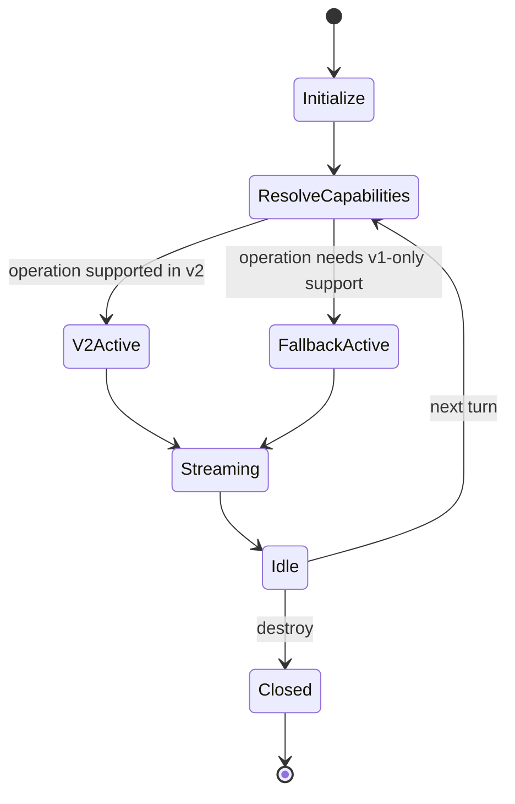

# Atomic CLI Technical Design Document / RFC

| Document Metadata      | Details         |
| ---------------------- | --------------- |
| Author(s)              | Developer       |
| Status                 | Draft (WIP)     |
| Team / Owner           | Atomic CLI Core |
| Created / Last Updated | TBD / TBD       |

## 1. Executive Summary

Atomic CLI already has a shared provider abstraction (`CodingAgentClient` + `Session` + normalized events), but Claude runtime integration still uses v1 `query()` turn orchestration while OpenCode and Copilot already follow newer session/event-first patterns. This creates an inconsistency in lifecycle behavior, event semantics, and long-term maintainability in the unified TUI path.[R1]

This RFC proposes a **Claude SDK v2-first integration** inside the existing unified provider layer, with explicit **v1 fallback only for unsupported capabilities** (notably session forking and advanced input patterns). The design keeps the current UI contract stable, preserves cross-provider normalization, and introduces capability-gated behavior so the TUI can stay provider-agnostic while still exposing nuanced provider limits where needed.[R1][R2][R3][R4]

Expected impact: lower adapter complexity, cleaner session lifecycle semantics, improved parity with OpenCode/Copilot event-first flows, safer future upgrades, and fewer provider-specific branches in TUI orchestration.[R1][R5]

## 2. Context and Motivation

### 2.1 Current State

- **Unified architecture exists:** Atomic already routes Claude, OpenCode, and Copilot through one provider contract (`CodingAgentClient`, `Session`, shared `EventType`, normalized event payloads) consumed by a single TUI pipeline.[R1][R5]
- **Claude is runtime-v1 style:** Claude session behavior is currently built around repeated `query()` cycles and hook translation, including resume handling and event normalization from v1 hook surfaces.[R1]
- **OpenCode and Copilot are event-first session models:** OpenCode uses v2-style SDK surfaces with event subscription and prompt/session workflows; Copilot uses `CopilotClient`/`CopilotSession` plus callback/event streams.[R1][R3][R4]
- **Config convergence already exists:** `.claude`, `.opencode`, and `.github` roots are already merged for MCP/skills/agent discovery and command loading.[R1]

### 2.2 The Problem

- **User impact:** Provider behavior appears unified, but Claude’s internal lifecycle differs, increasing subtle inconsistency risks in streaming, resume, and subagent rendering under complex flows.[R1][R5]
- **Business/product impact:** Maintaining a multi-provider TUI with one provider on older lifecycle semantics increases integration cost and slows future feature delivery.
- **Technical debt:** Claude adapter complexity is elevated because v1 generator orchestration must be reshaped into a shared session model that other providers already natively approximate.[R1][R2]

## 3. Goals and Non-Goals

### 3.1 Functional Goals

- [ ] Introduce Claude SDK v2-first session runtime path in `src/sdk/claude-client.ts`, preserving current public provider contracts.[R1][R2]
- [ ] Keep the unified `Session` and event interfaces stable for `src/ui/index.ts` consumers (no UI-breaking event schema changes).[R1][R5]
- [ ] Add capability-driven fallback to v1 **only** for explicitly unsupported v2 features (e.g., `forkSession` behavior).[R1][R2]
- [ ] Preserve existing cross-ecosystem config discovery for tools/MCP/skills/agents (`.claude`, `.opencode`, `.github`).[R1]
- [ ] Provide deterministic observability hooks for lifecycle state transitions and fallback-path invocations.

### 3.2 Non-Goals (Out of Scope)

- [ ] We will NOT redesign TUI component visuals or interaction patterns in this RFC.
- [ ] We will NOT replace OpenCode or Copilot adapter runtime internals.
- [ ] We will NOT enforce provider feature parity where SDKs are fundamentally different (e.g., Copilot independent subagent context limitations).[R5]
- [ ] We will NOT introduce new end-user commands as a prerequisite for this migration.

## 4. Proposed Solution (High-Level Design)

### 4.1 System Architecture Diagram

```mermaid
flowchart LR
    User[User Prompt] --> TUI[Unified TUI Pipeline]
    TUI --> ClientFactory[Provider Factory\nchatCommand]

    ClientFactory --> ClaudeClient[Claude Adapter\nV2-first + V1 fallback]
    ClientFactory --> OpenCodeClient[OpenCode Adapter\nV2 event-first]
    ClientFactory --> CopilotClient[Copilot Adapter\nSession + callbacks]

    ClaudeClient --> UnifiedSession[Unified Session Contract\nsend / stream / summarize / destroy]
    OpenCodeClient --> UnifiedSession
    CopilotClient --> UnifiedSession

    UnifiedSession --> EventBus[Unified Event Model\nmessage/tool/subagent/permission/usage]
    EventBus --> UIState[UI State + Components]

    ClaudeClient --> ClaudeV2[Claude unstable_v2_createSession\nunstable_v2_resumeSession]
    ClaudeClient -. fallback .-> ClaudeV1[Claude query() path\nfor unsupported features]

    OpenCodeClient --> OpenCodeSDK[OpenCode SDK v2]
    CopilotClient --> CopilotSDK[Copilot SDK]
```

### 4.2 Architectural Pattern

- **Primary pattern:** Adapter + Capability Negotiation.
- The existing adapter/factory/observer model remains, but Claude adapter gains a capability matrix that selects v2 session APIs by default and routes selective operations to v1 fallback when required.[R1][R2]

### 4.3 Key Components

| Component                     | Responsibility                                                        | Technology Stack                              | Justification                                                 |
| ----------------------------- | --------------------------------------------------------------------- | --------------------------------------------- | ------------------------------------------------------------- |
| `ClaudeClientV2Runtime`       | Owns v2-first Claude session lifecycle and stream bridging            | TypeScript, `@anthropic-ai/claude-agent-sdk`  | Aligns Claude with event-first provider model.[R1][R2]        |
| `ClaudeCapabilityResolver`    | Resolves operation support and fallback policy                        | TypeScript                                    | Explicitly isolates v2/v1 decision logic for maintainability. |
| `UnifiedEventNormalizer`      | Maps Claude/OpenCode/Copilot native events into shared internal types | Existing sdk/types + adapter mappers          | Preserves SDK-agnostic UI behavior and contracts.[R1][R5]     |
| `ProviderSessionOrchestrator` | Maintains one active session lifecycle in UI path                     | Existing `src/ui/index.ts` session management | Keeps user-facing flow unchanged while internals evolve.[R1]  |

## 5. Detailed Design

### 5.1 API Interfaces

Internal TypeScript contract remains unchanged for TUI callers:

```ts
interface Session {
    send(
        input: string | AgentMessage,
        options?: SendOptions,
    ): Promise<SessionTurnResult>;
    stream(
        input: string | AgentMessage,
        options?: StreamOptions,
    ): AsyncGenerator<AgentEvent>;
    summarize?(options?: SummarizeOptions): Promise<string>;
    destroy(): Promise<void>;
}
```

Claude internal adapter additions:

```ts
type ClaudeRuntimeMode = "v2" | "v1_fallback";

interface ClaudeCapabilityMatrix {
    supportsV2SendStream: boolean;
    supportsV2Resume: boolean;
    supportsForkSession: boolean;
}

interface ClaudeSessionRuntime {
    mode: ClaudeRuntimeMode;
    capabilities: ClaudeCapabilityMatrix;
}
```

Behavioral contract:

- `send()` and `stream()` use v2 APIs by default (`unstable_v2_createSession`, `unstable_v2_resumeSession`).[R2]
- If requested operation requires unsupported v2 behavior (e.g., fork semantics), route only that operation via v1 `query()` fallback path.[R1][R2]
- Event output must continue emitting existing unified `EventType` variants expected by UI subscriptions.[R1][R5]

### 5.2 Data Model / Schema

No persistent database schema changes are required. In-memory adapter/session state evolves:

| Field            | Type                                                         | Scope                    | Description                                     |
| ---------------- | ------------------------------------------------------------ | ------------------------ | ----------------------------------------------- |
| `runtimeMode`    | `"v2" \| "v1_fallback"`                                      | Claude session runtime   | Active runtime mode for current operation.      |
| `sessionId`      | `string \| null`                                             | Claude session runtime   | Stable session identifier for resume semantics. |
| `fallbackReason` | `"fork_unsupported" \| "advanced_input_unsupported" \| "v2_unavailable" \| "v2_execution_error" \| null` | Claude operation context | Audit/telemetry visibility for fallback cause.  |
| `capabilities`   | `ClaudeCapabilityMatrix`                                     | Claude adapter singleton | Derived capability map used for routing.        |

Normalized event payload structure remains unchanged from existing shared schema (`tool.start`, `tool.complete`, `subagent.start`, `subagent.complete`, `permission.requested`, `usage`, `message.delta`, `message.complete`).[R1][R5]

### 5.3 Algorithms and State Management

State machine (Claude runtime operation-level):



Routing algorithm (high level):

1. Build operation context (`turnType`, resume/fork intent, provider options).
2. Evaluate `ClaudeCapabilityResolver`.
3. Execute via v2 path when supported.
4. Execute via scoped v1 fallback when unsupported.
5. If a v2 operation throws at runtime, transition the operation to v1 fallback with reason `v2_execution_error`.
6. Normalize emitted provider-native events to shared event contract.
7. Record fallback metadata for observability.

Consistency model:

- **UI consistency:** Event contract remains stable for consumers.
- **Session consistency:** Session ID and resume metadata are adapter-controlled, independent of runtime mode switching.
- **Failure mode:** If v2 path fails with capability mismatch, fail closed into explicit fallback or surfaced error (no silent event dropping).

## 6. Alternatives Considered

| Option                                                       | Pros                                          | Cons                                                                   | Reason for Rejection/Selection                                                            |
| ------------------------------------------------------------ | --------------------------------------------- | ---------------------------------------------------------------------- | ----------------------------------------------------------------------------------------- |
| Option A: Keep Claude fully v1 (`query()`)                   | Zero migration effort                         | Long-term divergence from event-first model, higher adapter complexity | Rejected: does not meet unification and maintainability goals.[R1]                        |
| Option B: Claude v2-only, no fallback                        | Cleanest code path                            | Breaks unsupported v2 scenarios (e.g., fork behavior)                  | Rejected: incompatible with documented v2 boundaries.[R2]                                 |
| Option C: Claude v2-first with scoped v1 fallback (Selected) | Best balance of modernization + compatibility | Requires capability layer and dual-path testing                        | **Selected**: aligns with research guidance and current architecture constraints.[R1][R2] |

## 7. Cross-Cutting Concerns

### 7.1 Security and Privacy

- Reuse existing permission and tool-policy enforcement surfaces in unified session creation.
- Preserve MCP/tool guardrails across runtime mode selection; runtime mode must not widen allowed tool scope.
- Ensure fallback metadata excludes sensitive prompt/tool payload details in logs.

### 7.2 Observability Strategy

- Add structured lifecycle markers: `claude.runtime.selected`, `claude.runtime.fallback_used`, `claude.runtime.fallback_reason`.
  - `claude.runtime.selected`: `{ runtimeMode, operation }`
  - `claude.runtime.fallback_used`: `{ operation, fallbackReason }`
  - `claude.runtime.fallback_reason`: `{ reason }`
- Add stream-integrity marker `claude.stream.integrity` for counter updates (`missingTerminalEvents`, unmatched tool/subagent start/complete pairs).
- Track stream integrity metrics: missing terminal events, unmatched tool start/complete pairs, subagent completion parity.
- Continue forwarding usage events to existing unified usage display model with provider-aware labels.[R1][R5]

### 7.3 Scalability and Capacity Planning

- Adapter-level overhead is minimal (in-memory routing + event mapping).
- Fallback frequency should trend downward as v2 feature coverage expands; expose counters to identify remaining v1 dependency hotspots.
- Maintain bounded internal event queue/backpressure protections from current provider adapters.

## 8. Migration, Rollout, and Testing

### 8.1 Deployment Strategy

- [ ] Phase 1: Introduce runtime capability resolver and v2 path behind internal adapter flag defaults.
- [ ] Phase 2: Enable v2-first as default for Claude send/stream/resume with fallback metrics active.
- [ ] Phase 3: Harden fallback-specific paths and document explicit unsupported-v2 operation handling.
- [ ] Phase 4: Reassess fallback usage and remove dead v1-only code where no longer required.

### 8.2 Data Migration Plan

- No persistent data migration required.
- Session continuity validation is required for existing saved/resumed session IDs.
- Add compatibility checks for transcript/session metadata assumptions currently tied to v1 hook pathways.[R1]

### 8.3 Test Plan

- **Unit Tests:**
    - Capability resolver routing matrix (`supported`, `unsupported`, `error`).
    - Event normalization parity between v2 and fallback flows.
    - Session ID/resume behavior under mode transitions.
- **Integration Tests:**
    - Claude adapter end-to-end send/stream in v2 mode.
    - Fallback-only operation path verification (fork/unsupported scenario).
    - Cross-provider parity checks against OpenCode/Copilot unified event expectations.[R1][R3][R4][R5]
- **End-to-End Tests:**
    - TUI command flow with Claude provider under v2-first mode.
    - Tool/subagent/permission rendering parity in same conversation.
    - Resume session workflow across app restart for Claude.

## 9. Open Questions / Unresolved Issues

- [x] **Decision:** Claude v2-first is enabled as default, with scoped safety fallback.
- [x] **Decision:** Fallback usage remains opaque in normal UI and is surfaced via observability/error channels only.
- [x] **Decision:** Unsupported v2 features use automatic fallback (best effort), not fail-fast by default.

## 9.1 Implementation Policy Notes

- Unsupported-v2 routing is deterministic per operation (`create`, `resume`, `send`, `stream`, `summarize`):
  - `fork_unsupported`: fork intent detected (fork metadata/context hints) while v2 forking is unsupported.
  - `advanced_input_unsupported`: config requires advanced inputs currently unsupported on v2 (`maxTurns`, `maxBudgetUsd`, explicit `mcpServers`, explicit `tools`).
  - `v2_unavailable`: v2 SDK runtime entrypoints are unavailable.
  - `v2_execution_error`: operation started in v2 but threw and was downgraded to v1 fallback.
- Runtime observability markers are emitted through unified usage events:
  - `claude.runtime.selected`
  - `claude.runtime.fallback_used`
  - `claude.runtime.fallback_reason`
- Stream integrity counters are tracked and emitted via `claude.stream.integrity` for missing terminal events and unmatched tool/subagent start-complete parity.
- Fallback metadata is limited to operation + reason only; prompt/tool payload details are intentionally excluded.

## 10. References

- [R1] `research/docs/2026-02-19-sdk-v2-first-unified-layer-research.md`
- [R2] `research/docs/2026-01-31-claude-agent-sdk-research.md`
- [R3] `research/docs/2026-01-31-opencode-sdk-research.md`
- [R4] `research/docs/2026-01-31-github-copilot-sdk-research.md`
- [R5] `research/docs/2026-02-12-sdk-ui-standardization-research.md`
