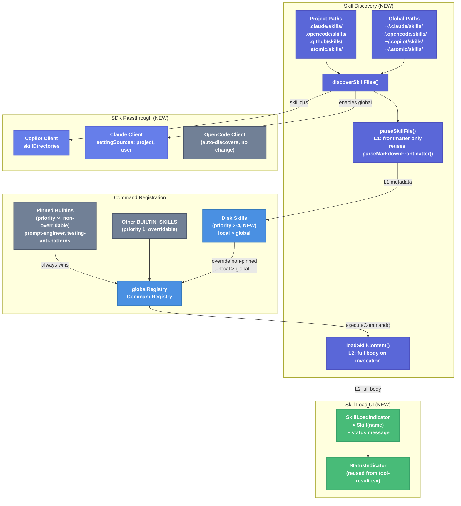

# Skill Loading from Configs with Custom Status UI — Technical Design Document

| Document Metadata      | Details                                                         |
| ---------------------- | --------------------------------------------------------------- |
| Author(s)              | Developer                                                       |
| Status                 | Draft (WIP)                                                     |
| Team / Owner           | Atomic CLI                                                      |
| Created / Last Updated | 2026-02-08                                                      |
| Research Reference     | `research/docs/2026-02-08-skill-loading-from-configs-and-ui.md` |

## 1. Executive Summary

Atomic CLI currently defines skills as hardcoded builtins in `BUILTIN_SKILLS` (`skill-commands.ts:70`), with no runtime discovery of `SKILL.md` files from disk. This spec proposes adding disk-based skill discovery from `.claude/skills/`, `.opencode/skills/`, `.github/skills/`, `.atomic/skills/`, and global `~/` equivalents — mirroring the existing agent discovery pattern (`agent-commands.ts:1493`). Additionally, it introduces a `SkillLoadIndicator` UI component that renders an inline status indicator when a skill is invoked, matching the screenshot reference. Finally, it wires skill directories into each SDK client's native skill mechanism (Copilot `skillDirectories`, Claude `settingSources`).

## 2. Context and Motivation

### 2.1 Current State

Skills are defined as an embedded `BUILTIN_SKILLS` array in `src/ui/commands/skill-commands.ts:70` with 9 hardcoded entries. Each entry contains the full prompt content inline. A legacy `SKILL_DEFINITIONS` array provides metadata-only fallbacks. Registration flows through `registerSkillCommands()` at line 1699.

Meanwhile, `.github/skills/` contains 9 `SKILL.md` files on disk, `.opencode/skills/` and `.claude/skills/` each contain 2, but **none of these disk files are discovered or loaded at runtime**. The only path from SKILL.md to the user is through the hardcoded array.

Agent discovery (`agent-commands.ts:1493-1727`) already provides a mature pattern: scan project-local and global directories, parse frontmatter, resolve priority conflicts, register as slash commands. Skills should follow this identical pattern.

Reference: Research sections 3a-3c (current state analysis) and section 4 (proposed discovery design).

### 2.2 The Problem

- **No disk-based skill discovery**: Users cannot add custom skills by dropping `SKILL.md` files into config directories. New skills require code changes to the `BUILTIN_SKILLS` array.
- **No skill loading UI feedback**: When `/commit` or `/prompt-engineer` is invoked, there is no visual indicator that a skill was loaded — unlike tool calls which show animated `●` status icons.
- **No SDK skill passthrough**: The Copilot SDK's `skillDirectories` field in `SessionConfig` is not populated, meaning the Copilot CLI cannot auto-discover skills. Claude's `settingSources` only includes `"project"`, missing `"user"` for global skills.
- **Duplicated skill content**: The same prompt text exists both in `BUILTIN_SKILLS` and in `.github/skills/*/SKILL.md` files, creating maintenance burden.

## 3. Goals and Non-Goals

### 3.1 Functional Goals

- [ ] Discover `SKILL.md` files from project-local directories (`.claude/skills/`, `.opencode/skills/`, `.github/skills/`, `.atomic/skills/`) and global directories (`~/.claude/skills/`, `~/.opencode/skills/`, `~/.copilot/skills/`, `~/.atomic/skills/`)
- [ ] Parse SKILL.md YAML frontmatter (name, description, aliases, argument-hint, hidden/user-invocable) using existing `parseMarkdownFrontmatter()` from `agent-commands.ts:1188`
- [ ] Implement progressive disclosure per the [Agent Skills spec](https://agentskills.io/specification): at discovery time load only L1 metadata (~100 tokens: name + description); at invocation time load L2 instructions (full SKILL.md body); L3 resources (`scripts/`, `references/`, `assets/`) loaded only when the agent accesses them
- [ ] Register discovered skills as `/skill-name` slash commands with category `"skill"`, with priority-based override (project > atomic > global > builtin)
- [ ] Render a `SkillLoadIndicator` component inline in the chat when a skill command executes, showing loading → loaded/error states
- [ ] Pass skill directories to Copilot SDK via `skillDirectories` in `SessionConfig`
- [ ] Add `"user"` to Claude SDK's `settingSources` for global skill discovery

### 3.2 Non-Goals (Out of Scope)

- [ ] `.codex/skills/` support — Codex is not a primary SDK target
- [ ] Skill `disabledSkills` mechanism — no UI for disabling specific skills
- [ ] Skill permission filtering (allow/deny/ask) — defer to SDK-native handling
- [ ] Hot-reload of skills during a session — skills are discovered once at startup, consistent with agent discovery
- [ ] Custom skill paths from config files (like OpenCode's `skills.paths`) — use standard directory conventions only
- [ ] `BUILTIN_SKILLS` array — builtins remain; pinned builtins (`prompt-engineer`, `testing-anti-patterns`) have highest priority and cannot be overridden by disk skills

## 4. Proposed Solution (High-Level Design)

### 4.1 System Architecture



### 4.2 Architectural Pattern

This follows the existing **Embedded Builtins + Disk Override** pattern established by agent discovery (`agent-commands.ts:1700-1727`), with the addition of **pinned builtins** that cannot be overridden:

1. Register builtins first — pinned builtins (`prompt-engineer`, `testing-anti-patterns`) are marked as non-overridable
2. Discover disk-based definitions from local (project) then global paths
3. Higher-priority disk entries override non-pinned builtins via `unregister()` + `register()`
4. Local configs (`.claude/skills/`, `.github/skills/`, etc.) always take priority over global configs (`~/.claude/skills/`, `~/.copilot/skills/`, etc.) when names conflict

### 4.3 Key Components

| Component                         | Responsibility                                             | File                                         | Justification                           |
| --------------------------------- | ---------------------------------------------------------- | -------------------------------------------- | --------------------------------------- |
| `discoverSkillFiles()`            | Scan project-local + global skill directories              | `src/ui/commands/skill-commands.ts`          | Mirrors `discoverAgentFiles()` pattern  |
| `parseSkillFile()`                | Read SKILL.md, parse frontmatter + body                    | `src/ui/commands/skill-commands.ts`          | Mirrors `parseAgentFile()` pattern      |
| `discoverAndRegisterDiskSkills()` | Orchestrate discovery → priority resolution → registration | `src/ui/commands/skill-commands.ts`          | Mirrors `registerAgentCommands()`       |
| `SkillLoadIndicator`              | Inline UI component for skill load status                  | `src/ui/components/skill-load-indicator.tsx` | New component, reuses `StatusIndicator` |
| Copilot `skillDirectories`        | Pass discovered dirs to Copilot session                    | `src/sdk/copilot-client.ts`                  | SDK native skill support                |
| Claude `settingSources`           | Add `"user"` for global skill discovery                    | `src/sdk/init.ts`                            | Enable global `.claude/skills/`         |

## 5. Detailed Design

### 5.1 Skill Discovery (`skill-commands.ts`)

#### 5.1.1 Discovery Path Constants

```typescript
import { homedir } from "node:os";
import { join } from "node:path";

/**
 * Cross-platform home directory. Uses os.homedir() which resolves to:
 * - Unix/macOS: $HOME (e.g., /home/user)
 * - Windows: %USERPROFILE% (e.g., C:\Users\user)
 * Avoids `~` tilde expansion which is shell-specific and not supported on Windows.
 */
const HOME = homedir();

// Project-local directories to search for SKILL.md files (relative to cwd)
export const SKILL_DISCOVERY_PATHS = [
  join(".claude", "skills"),
  join(".opencode", "skills"),
  join(".github", "skills"),
  join(".atomic", "skills"),
] as const;

// Global directories to search for SKILL.md files (absolute, cross-platform)
export const GLOBAL_SKILL_PATHS = [
  join(HOME, ".claude", "skills"),
  join(HOME, ".opencode", "skills"),
  join(HOME, ".copilot", "skills"),
  join(HOME, ".atomic", "skills"),
] as const;
```

> **Windows compatibility**: All paths use `path.join()` for correct separators (`/` on Unix, `\` on Windows). Global paths use `os.homedir()` instead of `~` tilde expansion, which is a Unix shell feature unavailable on Windows.

Reference: Research section 4a (discovery paths table).

#### 5.1.2 Skill Source Type and Priority

```typescript
export type SkillSource = "project" | "atomic" | "user" | "builtin";

/**
 * Built-in skills that cannot be overridden by disk skills.
 * These are core Atomic skills whose behavior must remain consistent
 * regardless of what SKILL.md files exist on disk.
 */
export const PINNED_BUILTIN_SKILLS = new Set([
  "prompt-engineer",
  "testing-anti-patterns",
]);

// Priority: pinned builtin (∞) > project (4) > atomic (3) > user/global (2) > builtin (1)
// Mirrors agent-commands.ts:1595-1607 with pinned builtin guard
export function shouldSkillOverride(
  newSource: SkillSource,
  existingSource: SkillSource,
  existingName: string
): boolean {
  // Pinned builtins can never be overridden
  if (existingSource === "builtin" && PINNED_BUILTIN_SKILLS.has(existingName)) {
    return false;
  }

  const priority: Record<SkillSource, number> = {
    project: 4,  // Local: .claude/skills/, .opencode/skills/, .github/skills/
    atomic: 3,   // Local: .atomic/skills/
    user: 2,     // Global: ~/.claude/skills/, ~/.copilot/skills/, etc.
    builtin: 1,  // Embedded in BUILTIN_SKILLS array (non-pinned)
  };
  return priority[newSource] > priority[existingSource];
}
```

**Priority hierarchy** (highest to lowest):

| Priority   | Source                 | Example Paths                                                  | Override Behavior                                 |
| ---------- | ---------------------- | -------------------------------------------------------------- | ------------------------------------------------- |
| ∞ (pinned) | `builtin` (pinned)     | Embedded (`prompt-engineer`, `testing-anti-patterns`)          | **Cannot** be overridden                          |
| 4          | `project`              | `.claude/skills/`, `.opencode/skills/`, `.github/skills/`      | Overrides global, atomic, and non-pinned builtins |
| 3          | `atomic`               | `.atomic/skills/`                                              | Overrides global and non-pinned builtins          |
| 2          | `user`                 | `~/.claude/skills/`, `~/.copilot/skills/`, `~/.atomic/skills/` | Overrides non-pinned builtins only                |
| 1          | `builtin` (non-pinned) | Embedded in `BUILTIN_SKILLS` array                             | Lowest priority; overridden by any disk skill     |

#### 5.1.3 Discovered Skill Type

```typescript
export interface DiscoveredSkillFile {
  path: string;        // Absolute path to SKILL.md
  dirName: string;     // Parent directory name (e.g., "commit")
  source: SkillSource; // Where the skill was found
}

/**
 * L1 metadata only — loaded at discovery time (~100 tokens per skill).
 * The full SKILL.md body (L2) is NOT loaded here; it is read lazily
 * at invocation time from `skillFilePath`. This follows the Agent Skills
 * progressive disclosure model (see specs/skills.md lines 223-231).
 */
export interface DiskSkillDefinition {
  name: string;
  description: string;
  skillFilePath: string;   // Absolute path to SKILL.md — read lazily on invocation
  source: SkillSource;
  aliases?: string[];
  argumentHint?: string;
  hidden?: boolean;
}
```

#### 5.1.4 Discovery Function

```typescript
export function discoverSkillFiles(): DiscoveredSkillFile[]
```

Logic:
1. For each path in `SKILL_DISCOVERY_PATHS`, resolve relative to `process.cwd()` using `path.join(process.cwd(), discoveryPath)`
2. For each path in `GLOBAL_SKILL_PATHS` (already absolute via `HOME` constant), use directly
3. For each directory, list subdirectories using `readdirSync()` with `{ withFileTypes: true }`
4. For each subdirectory, check if `SKILL.md` exists using `path.join(subdir, "SKILL.md")`
5. Determine source: project-local paths → `"project"` (except `.atomic/` → `"atomic"`); `GLOBAL_SKILL_PATHS` → `"user"`
6. Return array of `DiscoveredSkillFile`

All path operations use `path.join()` for cross-platform compatibility (correct separators on Windows vs Unix). This mirrors `discoverAgentFiles()` at `agent-commands.ts:1493-1511`.

#### 5.1.5 Parsing Function (L1 — Metadata Only)

```typescript
export function parseSkillFile(file: DiscoveredSkillFile): DiskSkillDefinition | null
```

This function implements **L1 discovery** per the [Agent Skills progressive disclosure model](https://agentskills.io/specification#progressive-disclosure): only the YAML frontmatter is parsed. The markdown body (L2 instructions) is **not** read at this stage — it is loaded lazily at invocation time via `loadSkillContent()`.

Logic:
1. Read `file.path` with `readFileSync()`
2. Call `parseMarkdownFrontmatter()` (imported from `agent-commands.ts:1188`)
3. Extract **only frontmatter fields** (~100 tokens per skill):
   - `name` (required, string) — validate matches `file.dirName`; fallback to `file.dirName`
   - `description` (required, string) — fallback to `"Skill: ${name}"`
   - `aliases` (optional, string array) — from `aliases` field or space-delimited string
   - `argument-hint` (optional, string) — maps to `argumentHint`
   - `hidden` (optional, boolean) — also check `user-invocable: false` → `hidden: true`
4. Store `file.path` as `skillFilePath` for lazy loading — **do NOT store the body**
5. Return `DiskSkillDefinition` or `null` on parse failure

Reference: Research section 4b (frontmatter parsing); Agent Skills spec `specs/skills.md` lines 223-231.

#### 5.1.5a Lazy Content Loader (L2 — Invocation Time)

```typescript
export function loadSkillContent(skillFilePath: string): string | null
```

Called at invocation time (inside `createDiskSkillCommand().execute()`), not at discovery time.

Logic:
1. Read `skillFilePath` with `readFileSync()`
2. Call `parseMarkdownFrontmatter()` to extract the body
3. Return the markdown body (everything after the `---` frontmatter delimiters)
4. Return `null` on read/parse failure

This keeps startup cost proportional to the number of skills (frontmatter only), not the total size of all skill prompts. A typical project with 20 skills loads ~2000 tokens at startup (20 × ~100 tokens) instead of ~100,000+ tokens if full bodies were eagerly loaded.

#### 5.1.6 Registration Orchestrator

```typescript
export async function discoverAndRegisterDiskSkills(): Promise<void>
```

Logic:
1. Call `discoverSkillFiles()` to get all SKILL.md files
2. Build a `Map<string, DiskSkillDefinition>` with priority resolution (same name → higher priority wins, using `shouldSkillOverride()`)
3. For each resolved skill:
   - Check if `globalRegistry.has(skill.name)`
   - If exists, check if the existing skill is a pinned builtin (`PINNED_BUILTIN_SKILLS.has(skill.name)`) — if so, **skip** (pinned builtins cannot be overridden)
   - If exists and disk skill has higher priority → `globalRegistry.unregister()` then `globalRegistry.register()`
   - If not exists → `globalRegistry.register()`
4. Create `CommandDefinition` for each disk skill using `createDiskSkillCommand()`

```typescript
function createDiskSkillCommand(skill: DiskSkillDefinition): CommandDefinition {
  return {
    name: skill.name,
    description: skill.description,
    category: "skill",
    aliases: skill.aliases,
    hidden: skill.hidden,
    argumentHint: skill.argumentHint,
    execute: (args: string, context: CommandContext): CommandResult => {
      // L2: Lazily load the full SKILL.md body at invocation time
      const body = loadSkillContent(skill.skillFilePath);
      if (!body) {
        return {
          success: false,
          message: `Failed to load skill content from ${skill.skillFilePath}`,
          skillLoaded: skill.name,
          skillLoadError: `Could not read ${skill.skillFilePath}`,
        };
      }
      const expandedPrompt = expandArguments(body, args.trim());
      context.sendSilentMessage(expandedPrompt);
      return { success: true, skillLoaded: skill.name };
    },
  };
}
```

The key difference from `createBuiltinSkillCommand()` is that builtin skills have their prompt content embedded in memory (they are always L2-loaded), while disk skills defer the file read to invocation time. This means:
- **Startup**: Only ~100 tokens per disk skill (name + description for autocomplete)
- **Invocation**: Full SKILL.md body read from disk once, then sent to session
- **Failure**: If the file was deleted or became unreadable between discovery and invocation, the error is surfaced via the `SkillLoadIndicator` UI

#### 5.1.7 Updated Registration Flow

In `src/ui/commands/index.ts`, `initializeCommandsAsync()` gains a new step:

```
registerBuiltinCommands()
await loadWorkflowsFromDisk()
registerWorkflowCommands()
registerSkillCommands()              // Builtins (priority 1)
await discoverAndRegisterDiskSkills() // NEW: Disk skills (priority 2-4)
await registerAgentCommands()
```

This new call is inserted between `registerSkillCommands()` and `registerAgentCommands()` at `index.ts:143-147`.

#### 5.1.8 Collected Skill Directories Export

For SDK passthrough, expose the discovered directories:

```typescript
let discoveredSkillDirectories: string[] = [];

export function getDiscoveredSkillDirectories(): string[] {
  return discoveredSkillDirectories;
}
```

Populated during `discoverAndRegisterDiskSkills()` by collecting the parent directories of all discovered SKILL.md files (deduplicated).

### 5.2 Skill Load Indicator UI

#### 5.2.1 Component: `SkillLoadIndicator`

New file: `src/ui/components/skill-load-indicator.tsx`

```typescript
export type SkillLoadStatus = "loading" | "loaded" | "error";

export interface SkillLoadIndicatorProps {
  skillName: string;
  status: SkillLoadStatus;
  errorMessage?: string;
}
```

**States and visual rendering:**

| State     | Icon                  | Color                        | Message                           |
| --------- | --------------------- | ---------------------------- | --------------------------------- |
| `loading` | `●` (blinking, 500ms) | `colors.accent` (`#D4A5A5`)  | `Loading skill...`                |
| `loaded`  | `●` (static)          | `colors.success` (`#8AB89A`) | `Successfully loaded skill`       |
| `error`   | `✕` (static)          | `colors.error` (`#C98A8A`)   | `Failed to load skill: ${reason}` |

**Layout** (matches screenshot reference — see `skill_ui.png`):

```
● Skill(skill-name)
  └ Successfully loaded skill
```

Implementation uses:
- `AnimatedStatusIndicator` from `tool-result.tsx:53-74` for the loading blink
- `StatusIndicator` pattern for static states
- `useTheme()` for color resolution
- `<box>` + `<text>` OpenTUI primitives

Reference: Research sections 5a-5d (UI design).

#### 5.2.2 Integration in `CommandResult`

Extend `CommandResult` in `registry.ts:138` with an optional field:

```typescript
export interface CommandResult {
  // ... existing fields ...
  /** Skill name if a skill was loaded (triggers SkillLoadIndicator) */
  skillLoaded?: string;
  /** Error message if skill content failed to load (L2 read failure) */
  skillLoadError?: string;
}
```

This is a minimal, non-breaking addition. Only skill commands set these fields. The `skillLoadError` field enables the error state of the `SkillLoadIndicator` — this is particularly relevant for disk skills where the SKILL.md file is read lazily at invocation time and may fail (file deleted, permissions changed, etc.).

#### 5.2.3 Integration in `executeCommand()` (`chat.tsx`)

After a command executes and returns `CommandResult`, check for `result.skillLoaded`:

```typescript
// In executeCommand(), after command.execute() returns:
if (result.skillLoaded) {
  // Inject a skill-load indicator into the message flow
  // by adding a system message with skill metadata
  addMessage("system", `__SKILL_LOAD__:${result.skillLoaded}`);
}
```

**Alternative (preferred)**: Instead of a magic string in system messages, track skill loads in a dedicated state array alongside `toolCalls` on `ChatMessage`. Add an optional `skillLoads` field:

```typescript
// In ChatMessage type (chat.tsx)
export interface MessageSkillLoad {
  skillName: string;
  status: SkillLoadStatus;
  errorMessage?: string;
}

// Add to ChatMessage:
skillLoads?: MessageSkillLoad[];
```

When `result.skillLoaded` is present, append to the current or new assistant message's `skillLoads` array. Then in `MessageBubble`, render `SkillLoadIndicator` for each entry, positioned before the assistant's text content (similar to how `ToolResult` is interleaved).

#### 5.2.4 Rendering in `MessageBubble` (`chat.tsx:982`)

In the assistant message rendering path, before the text/tool segments:

```typescript
{/* Skill load indicators */}
{message.skillLoads?.map((sl, i) => (
  <box key={`skill-${i}`} marginBottom={1}>
    <SkillLoadIndicator
      skillName={sl.skillName}
      status={sl.status}
      errorMessage={sl.errorMessage}
    />
  </box>
))}
```

Since skill execution is synchronous (prompt expansion + sendSilentMessage), the status transitions instantly from `loading` to `loaded`. The `loading` animation is brief but provides visual feedback that "something happened."

### 5.3 SDK Passthrough

Each SDK has a different mechanism for skill integration. The three approaches are summarized below, followed by implementation details for each.

| SDK          | Skill Discovery                                                                                                                               | Atomic's Role                                                               | Change Required                                   |
| ------------ | --------------------------------------------------------------------------------------------------------------------------------------------- | --------------------------------------------------------------------------- | ------------------------------------------------- |
| **Copilot**  | SDK passes `skillDirectories` to CLI binary; CLI handles discovery + relevance matching                                                       | Pass directory paths via `SdkSessionConfig.skillDirectories`                | Yes — add `skillDirectories` to `createSession()` |
| **Claude**   | Claude Code runtime auto-discovers from `.claude/skills/` based on `settingSources`                                                           | Set `settingSources: ["project", "user"]` to enable project + global skills | Yes — add `"user"` to `settingSources`            |
| **OpenCode** | Server auto-discovers from `.opencode/skills/`, `.claude/skills/`, `.agents/skills/`, and `skills.paths` config; exposed via `GET /skill` API | No SDK passthrough needed; server handles all discovery                     | No                                                |

#### 5.3.1 Copilot Client (`copilot-client.ts`)

**How Copilot skills work** (from `docs/copilot-cli/skills.md` + DeepWiki `github/copilot-sdk`):

The Copilot SDK is a thin client that passes skill directories to the Copilot CLI binary via JSON-RPC. The CLI binary handles all SKILL.md discovery, YAML frontmatter parsing, relevance matching, and context injection. The SDK types define:

```typescript
// In @github/copilot-sdk SessionConfig (nodejs/src/types.ts)
interface SessionConfig {
  // ... other fields ...
  skillDirectories?: string[];   // Directories containing skill subdirectories
  disabledSkills?: string[];     // Skill names to exclude
}
```

**Discovery paths** (from `docs/copilot-cli/skills.md`):
- Project: `.github/skills/<name>/SKILL.md` (primary), `.claude/skills/<name>/SKILL.md` (backward compatible)
- Personal: `~/.copilot/skills/<name>/SKILL.md`, `~/.claude/skills/<name>/SKILL.md` (backward compatible)

**Loading behavior**: When Copilot decides a skill is relevant based on the user's prompt and the skill's description, it injects the full `SKILL.md` body into the agent's context. This is effectively L1 (description in system prompt) → L2 (full body on relevance match), handled entirely by the CLI binary.

**Implementation** — In `createSession()` at `copilot-client.ts:585-645`, add `skillDirectories` to `sdkConfig`:

```typescript
import { existsSync } from "node:fs";
import { join } from "node:path";
import { homedir } from "node:os";

const HOME = homedir(); // Cross-platform: $HOME (Unix) / %USERPROFILE% (Windows)

// In createSession():
const projectRoot = this.clientOptions.cwd ?? process.cwd();
const skillDirs = [
  join(projectRoot, ".github", "skills"),
  join(projectRoot, ".claude", "skills"),
  join(HOME, ".copilot", "skills"),
  join(HOME, ".claude", "skills"),
].filter((dir) => existsSync(dir));

const sdkConfig: SdkSessionConfig = {
  // ... existing fields ...
  skillDirectories: skillDirs.length > 0 ? skillDirs : undefined,
};
```

Note: `disabledSkills` is available in the SDK but is out of scope for this iteration (see Non-Goals).

#### 5.3.2 Claude Client (`init.ts`)

**How Claude skills work** (from `node_modules/@anthropic-ai/claude-agent-sdk/sdk.d.ts` + Claude Code skills docs):

The Claude Agent SDK exposes **no skill-specific registration API**. Skill discovery and loading are handled entirely by the Claude Code CLI runtime process, which the SDK spawns. The `settingSources` option is the key lever:

```typescript
// From sdk.d.ts (line 1621)
type SettingSource = 'user' | 'project' | 'local';

// From sdk.d.ts (lines 744-752)
interface Options {
  /**
   * Control which filesystem settings to load.
   * When omitted or empty, no filesystem settings are loaded (SDK isolation mode).
   * Must include 'project' to load CLAUDE.md files.
   */
  settingSources?: SettingSource[];
}
```

| Value       | Settings Path                 | Skills Path                        | Effect                 |
| ----------- | ----------------------------- | ---------------------------------- | ---------------------- |
| `'project'` | `.claude/settings.json`       | `.claude/skills/<name>/SKILL.md`   | Project-local skills   |
| `'user'`    | `~/.claude/settings.json`     | `~/.claude/skills/<name>/SKILL.md` | Global/personal skills |
| `'local'`   | `.claude/settings.local.json` | (same as project)                  | Local overrides        |

**Progressive loading** (Claude-specific):
- **L1** (~100 tokens): `name` + `description` always loaded into system prompt. Budget = 2% of context window.
- **L2** (<5000 tokens recommended): Full SKILL.md body loaded when user invokes `/skill-name` or Claude auto-loads based on description match.
- **L3**: `scripts/`, `references/`, `assets/` loaded only when agent accesses them via Read tool.

**Claude-specific frontmatter extensions** (non-standard fields):

| Field                      | Type      | Description                                                  |
| -------------------------- | --------- | ------------------------------------------------------------ |
| `argument-hint`            | `string`  | Hint shown in autocomplete (e.g., `[issue-number]`)          |
| `disable-model-invocation` | `boolean` | Prevents Claude from auto-loading; user-only via `/name`     |
| `user-invocable`           | `boolean` | Set `false` to hide from `/` menu; background knowledge only |
| `model`                    | `string`  | Model to use when skill is active                            |
| `context`                  | `"fork"`  | Run in isolated forked subagent context                      |
| `agent`                    | `string`  | Subagent type when `context: fork`                           |

**Useful SDK types for downstream integration**:

The `SDKSystemMessage` (type `'system'`, subtype `'init'`) emitted at session start contains `skills: string[]` — the names of all discovered skills. The `Query.supportedCommands()` method returns `SlashCommand[]` with `name`, `description`, and `argumentHint` for each discovered skill.

**Implementation** — Update `initClaudeOptions()` at `init.ts:24-33`:

```typescript
export function initClaudeOptions(): Partial<ClaudeOptions> {
  return {
    settingSources: ["project", "user"], // Changed: added "user" for global skills
    permissionMode: "bypassPermissions",
    allowDangerouslySkipPermissions: true,
  };
}
```

#### 5.3.3 OpenCode Client

**How OpenCode skills work** (from DeepWiki `anomalyco/opencode`):

The OpenCode server handles all skill discovery server-side. No SDK passthrough is needed.

**Discovery paths** (scanned from `cwd` upward to git worktree root):
- `.opencode/skills/<name>/SKILL.md` (primary)
- `.claude/skills/<name>/SKILL.md` (Claude-compatible; disable with `OPENCODE_DISABLE_CLAUDE_CODE_SKILLS` env var)
- `.agents/skills/<name>/SKILL.md` (cross-agent standard)
- Global: `~/.config/opencode/skills/`, `~/.claude/skills/`, `~/.agents/skills/`
- Custom: additional directories from `skills.paths` in `opencode.json`

**Skill namespace API** (in `packages/opencode/src/skill/skill.ts`):
- `Skill.state()` → `Record<string, Skill.Info>` — memoized record of all discovered skills
- `Skill.all()` → `Skill.Info[]` — array of all skills
- `Skill.get(name)` → `Skill.Info | undefined` — single skill by name
- `Skill.Info` = `{ name, description, location, content }` — includes full content (eager loading)

**SkillTool**: Agents invoke skills via a built-in `skill` tool. Permission filtering (allow/deny/ask) is applied via the `permission` field in `opencode.json` or session config. The `permission` ruleset in `session.create()` can include `{ skill: "ask" }` to control access.

**Loading behavior**: OpenCode loads all skill content **eagerly** — the full SKILL.md body is stored in `Skill.Info.content` at discovery time. This differs from Claude's progressive L1/L2/L3 model.

**No changes needed** to `opencode-client.ts`. The current `createSession()` at line 608-633 passes `permission: initOpenCodeConfigOverrides()` which can include skill permission rules, but skill directory discovery is handled entirely by the server.

### 5.4 Shared Utility: `parseMarkdownFrontmatter()`

Currently defined in `agent-commands.ts:1188`. Since both agents and skills need this function, it should be extracted to a shared location:

**Move to**: `src/utils/markdown.ts`

```typescript
export function parseMarkdownFrontmatter(
  content: string
): { frontmatter: Record<string, unknown>; body: string } | null
```

Both `agent-commands.ts` and `skill-commands.ts` import from this shared module. This avoids cross-importing between command modules.

### 5.5 Data Model

#### 5.5.1 SKILL.md Frontmatter Schema

The frontmatter schema combines standard [Agent Skills spec](https://agentskills.io/specification) fields with Claude-specific extensions (documented in section 5.3.2). Atomic parses all fields but only acts on a subset; unrecognized fields are ignored.

**Standard Agent Skills fields** (from `specs/skills.md`):

| Field           | Required | Constraints                                                      | Atomic Usage                                             |
| --------------- | -------- | ---------------------------------------------------------------- | -------------------------------------------------------- |
| `name`          | Yes      | 1-64 chars, `[a-z0-9]+(-[a-z0-9]+)*`, must match parent dir name | Command name; fallback to dir name                       |
| `description`   | Yes      | 1-1024 chars                                                     | Autocomplete description; fallback to `"Skill: ${name}"` |
| `license`       | No       | Free-form string                                                 | Stored but unused                                        |
| `compatibility` | No       | 1-500 chars                                                      | Stored but unused                                        |
| `metadata`      | No       | `Record<string, string>`                                         | Stored but unused                                        |
| `allowed-tools` | No       | Space-delimited tool list                                        | Stored but unused (SDK-native handling)                  |

**Claude-specific extensions** (non-standard, from section 5.3.2):

| Field                      | Type      | Atomic Usage                                        |
| -------------------------- | --------- | --------------------------------------------------- |
| `argument-hint`            | `string`  | Shown in autocomplete (e.g., `[issue-number]`)      |
| `user-invocable`           | `boolean` | `false` → `hidden: true` (hide from `/` menu)       |
| `disable-model-invocation` | `boolean` | Passed through to Claude SDK; prevents auto-loading |
| `model`                    | `string`  | Passed through to Claude SDK                        |
| `context`                  | `"fork"`  | Passed through to Claude SDK                        |
| `agent`                    | `string`  | Passed through to Claude SDK                        |

**Atomic-internal fields** (not part of any spec, used only by Atomic's skill system):

| Field     | Type       | Usage                                                            |
| --------- | ---------- | ---------------------------------------------------------------- |
| `aliases` | `string[]` | Alternative `/` command names                                    |
| `hidden`  | `boolean`  | Hide from `/` command menu (also set by `user-invocable: false`) |

```yaml
---
# Standard Agent Skills fields
name: skill-name           # Required: 1-64 chars, [a-z0-9]+(-[a-z0-9]+)*
description: What it does   # Required: 1-1024 chars
license: MIT                # Optional: stored but unused
compatibility: Requires git # Optional: stored but unused
metadata:                   # Optional: stored but unused
  author: org-name
  version: "1.0"
allowed-tools: Bash(git:*) Read  # Optional: stored but unused

# Claude-specific extensions
argument-hint: "[args]"          # Optional: shown in autocomplete
user-invocable: true             # Optional: false → hidden from / menu
disable-model-invocation: false  # Optional: prevents auto-loading
model: claude-sonnet-4-20250514        # Optional: model override
context: fork                    # Optional: run in forked context
agent: code-reviewer             # Optional: subagent type

# Atomic-internal fields
aliases:                         # Optional: alternative command names
  - alias1
  - alias2
hidden: false                    # Optional: hide from / menu
---

# Skill Instructions (Markdown body)
Full prompt content here...
$ARGUMENTS placeholder supported.
```

Reference: Research section 1 (Agent Skills Open Standard); section 5.3.2 (Claude extensions).

## 6. Alternatives Considered

| Option                                                          | Pros                                                      | Cons                                                                        | Reason for Rejection                                       |
| --------------------------------------------------------------- | --------------------------------------------------------- | --------------------------------------------------------------------------- | ---------------------------------------------------------- |
| A: Remove `BUILTIN_SKILLS`, use only disk SKILL.md              | Single source of truth, no duplication                    | Breaking change if skills directory missing; slower startup due to disk I/O | Need fallback for fresh installs without config dirs       |
| B: System message injection for UI                              | No type changes, simple string-based                      | Magic strings, harder to style, no structured data                          | Fragile; structured `skillLoads` field is cleaner          |
| C: Status bar indicator (transient)                             | Non-intrusive, doesn't clutter chat                       | Disappears after skill loads, no history                                    | Screenshot reference shows inline persistent indicator     |
| **D: Embedded builtins + disk override + inline UI (Selected)** | Matches agent pattern, extensible, persistent UI feedback | Slightly more complex than builtins-only                                    | **Selected**: best UX and consistency with agent discovery |

## 7. Cross-Cutting Concerns

### 7.1 Error Handling

- **Missing directory**: If a discovery path doesn't exist, skip silently (match agent discovery behavior at `agent-commands.ts:1462-1472`)
- **Malformed SKILL.md**: If frontmatter parsing fails, skip the file and log nothing (match `parseAgentFile()` catch block at line 1540-1543)
- **Name conflict within same priority**: First-found wins (consistent with agent discovery)
- **Name conflict with pinned builtin**: Disk skill is silently skipped; the pinned builtin always wins
- **Missing `name` field**: Fall back to directory name (match agent pattern at line 1375)

### 7.2 Performance

- Discovery runs once at startup in `initializeCommandsAsync()`, not per-command
- Uses synchronous `readdirSync()` and `readFileSync()` for simplicity (matching agent discovery)
- Typical project has <20 SKILL.md files across all directories — negligible startup cost

### 7.3 Testing Strategy

Tests should cover:
- `discoverSkillFiles()` — mock filesystem with various directory layouts
- `parseSkillFile()` — frontmatter parsing edge cases (missing fields, invalid YAML, no frontmatter)
- `shouldSkillOverride()` — priority resolution, including pinned builtin guard (disk skill with same name as pinned builtin must not override)
- `discoverAndRegisterDiskSkills()` — integration with globalRegistry (override non-pinned, skip pinned, local overrides global, new skill)
- `SkillLoadIndicator` component — rendering in each state (loading, loaded, error)
- `CommandResult.skillLoaded` — end-to-end: command execution triggers indicator

### 7.4 Backward Compatibility

- Existing `BUILTIN_SKILLS` remain unchanged and continue to work
- Pinned builtins (`prompt-engineer`, `testing-anti-patterns`) can never be overridden by disk skills
- Non-pinned disk skills with the same name override non-pinned builtins (higher priority), which is the desired behavior
- `SKILL_DEFINITIONS` legacy array remains for fallback compatibility
- No breaking changes to `CommandResult` (new optional field only)
- No breaking changes to `SessionConfig` (Copilot `skillDirectories` is already optional in the SDK type)

## 8. Migration, Rollout, and Testing

### 8.1 Implementation Order

- [ ] **Phase 1 — Shared utility extraction**: Move `parseMarkdownFrontmatter()` from `agent-commands.ts` to `src/utils/markdown.ts`. Update imports in `agent-commands.ts`.
- [ ] **Phase 2 — Skill discovery**: Add `SKILL_DISCOVERY_PATHS`, `GLOBAL_SKILL_PATHS`, `SkillSource`, `DiscoveredSkillFile`, `DiskSkillDefinition`, `discoverSkillFiles()`, `parseSkillFile()`, `shouldSkillOverride()`, `createDiskSkillCommand()`, `discoverAndRegisterDiskSkills()` to `skill-commands.ts`.
- [ ] **Phase 3 — Registration integration**: Update `initializeCommandsAsync()` in `index.ts` to call `discoverAndRegisterDiskSkills()`. Update exports.
- [ ] **Phase 4 — Skill load UI**: Create `src/ui/components/skill-load-indicator.tsx`. Add `skillLoaded` field to `CommandResult`. Add `MessageSkillLoad` type and `skillLoads` field to `ChatMessage`. Update `executeCommand()` and `MessageBubble` in `chat.tsx`.
- [ ] **Phase 5 — SDK passthrough**: Update `copilot-client.ts` to pass `skillDirectories`. Update `init.ts` to add `"user"` to Claude `settingSources`.
- [ ] **Phase 6 — Tests**: Unit tests for discovery, parsing, priority, registration, and UI component.

### 8.2 Test Plan

- **Unit Tests**: `discoverSkillFiles()`, `parseSkillFile()`, `shouldSkillOverride()`, `expandArguments()`, `createDiskSkillCommand()` — in a new `tests/ui/commands/skill-commands.test.ts`
- **Component Tests**: `SkillLoadIndicator` rendering states — in `tests/ui/components/skill-load-indicator.test.ts`
- **Integration Tests**: Full `discoverAndRegisterDiskSkills()` flow with a mock filesystem layout, verifying correct commands end up in `globalRegistry`
- **Manual E2E**: Drop a custom SKILL.md into `.atomic/skills/my-skill/SKILL.md`, launch Atomic, verify `/my-skill` appears in autocomplete and executes correctly with the inline indicator

## 9. Open Questions / Unresolved Issues

- [ ] **Skill content deduplication**: Should disk skills that duplicate non-pinned `BUILTIN_SKILLS` content cause the builtin prompt to be replaced? (Spec currently says yes — disk overrides non-pinned builtins by priority. Pinned builtins like `prompt-engineer` and `testing-anti-patterns` are protected from this.)
- [ ] **Copilot SDK `disabledSkills`**: Should Atomic expose a way to disable specific skills? (Deferred to future iteration per non-goals.)
- [ ] **Skill auto-loading by relevance**: SDKs can auto-load skills based on message relevance (not just explicit `/` invocation). Should Atomic surface when this happens in the UI? (Deferred — requires SDK event hooks that may not exist yet.)
- [ ] **Hot-reload**: Should Atomic watch skill directories for changes and re-register? (Deferred — agent discovery also doesn't hot-reload.)

## 10. Code References

### Files to Modify

| File                                | Change                                                                                                                                                                                                                  |
| ----------------------------------- | ----------------------------------------------------------------------------------------------------------------------------------------------------------------------------------------------------------------------- |
| `src/ui/commands/skill-commands.ts` | Add discovery paths, types, `discoverSkillFiles()`, `parseSkillFile()`, `loadSkillContent()`, `shouldSkillOverride()`, `createDiskSkillCommand()`, `discoverAndRegisterDiskSkills()`, `getDiscoveredSkillDirectories()` |
| `src/ui/commands/agent-commands.ts` | Remove `parseMarkdownFrontmatter()` definition, import from `src/utils/markdown.ts`                                                                                                                                     |
| `src/ui/commands/index.ts`          | Add `await discoverAndRegisterDiskSkills()` call in `initializeCommandsAsync()`, update exports                                                                                                                         |
| `src/ui/commands/registry.ts`       | Add `skillLoaded?: string` and `skillLoadError?: string` to `CommandResult` interface                                                                                                                                   |
| `src/ui/chat.tsx`                   | Add `MessageSkillLoad` type, `skillLoads` to `ChatMessage`, update `executeCommand()` and `MessageBubble`                                                                                                               |
| `src/sdk/copilot-client.ts`         | Add `skillDirectories` to `sdkConfig` in `createSession()`                                                                                                                                                              |
| `src/sdk/init.ts`                   | Change `settingSources: ["project"]` → `settingSources: ["project", "user"]`                                                                                                                                            |

### New Files

| File                                               | Purpose                                               |
| -------------------------------------------------- | ----------------------------------------------------- |
| `src/ui/components/skill-load-indicator.tsx`       | `SkillLoadIndicator` React component                  |
| `src/utils/markdown.ts`                            | Extracted `parseMarkdownFrontmatter()` shared utility |
| `tests/ui/commands/skill-discovery.test.ts`        | Unit tests for skill discovery and registration       |
| `tests/ui/components/skill-load-indicator.test.ts` | Component tests for skill load indicator              |

### Existing Patterns to Follow

- Agent discovery: `agent-commands.ts:1493-1727` (scan → parse → priority → register)
- Frontmatter parsing: `agent-commands.ts:1188-1289`
- Status indicator: `tool-result.tsx:53-108` (`AnimatedStatusIndicator`, `StatusIndicator`)
- Tool call rendering: `chat.tsx:1070-1082` (`ToolResult` in `MessageBubble`)
- Priority override: `agent-commands.ts:1595-1607` (`shouldAgentOverride`)
