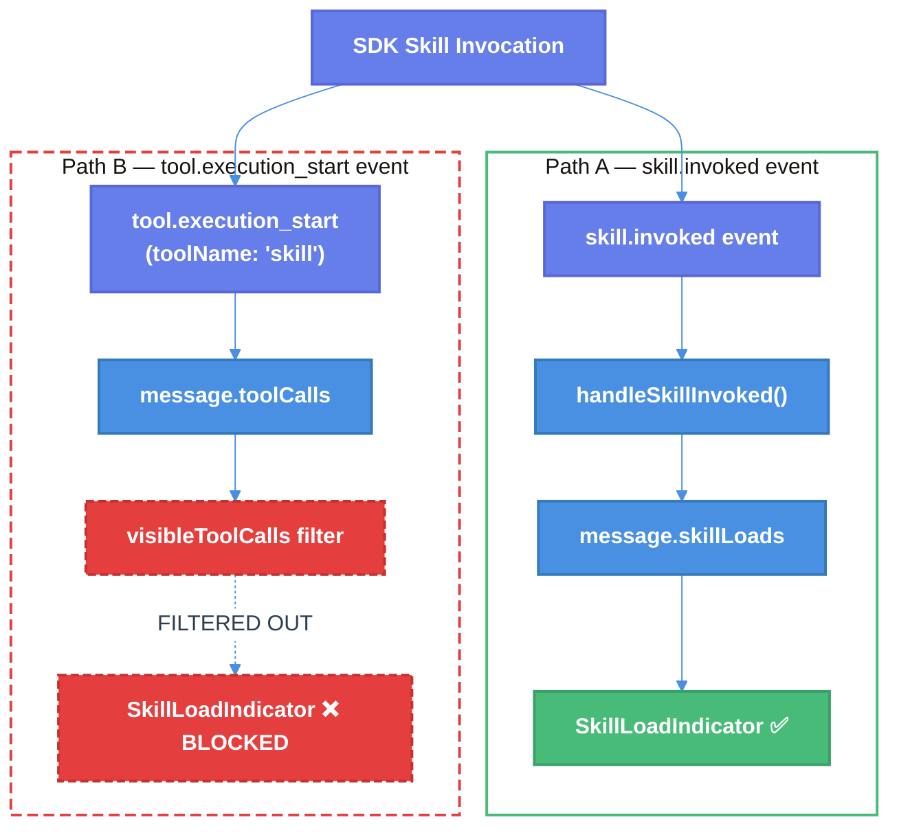

# Skill Loading Indicator Duplicate Fix — Technical Design Document

| Document Metadata      | Details     |
| ---------------------- | ----------- |
| Author(s)              | Developer   |
| Status                 | Draft (WIP) |
| Team / Owner           | Atomic CLI  |
| Created / Last Updated | 2026-02-15  |

## 1. Executive Summary

This spec addresses [Issue #205](https://github.com/flora131/atomic/issues/205): the `SkillLoadIndicator` component renders **twice** when a skill is loaded via a slash command. The duplication is caused by two independent rendering paths — one from the `skill.invoked` SDK event (Path A) and another from the `tool.execution_start` SDK event with `toolName: "skill"` (Path B) — both producing a visually identical `SkillLoadIndicator`. The fix is to add `"skill"` and `"Skill"` to the `visibleToolCalls` filter in `chat.tsx`, matching the established pattern already used for HITL and sub-agent tools. This is a **one-line change** with no functional side effects, as the dedicated `message.skillLoads` rendering path (Path A) already provides the canonical indicator at the top of the message bubble.

## 2. Context and Motivation

### 2.1 Current State

The Atomic TUI renders assistant messages using a content segmentation system that interleaves text and tool call outputs chronologically. Special UI elements (skill indicators, MCP status, agent trees) are rendered at fixed positions outside the interleaved stream.

**Architecture (Skill Loading):**

```
User types /skill-name
  → parseSlashCommand() → executeCommand() → command.execute()
  → context.sendSilentMessage()
  → SDK processes skill invocation
      ├── Emits "skill.invoked" → handleSkillInvoked() → message.skillLoads → SkillLoadIndicator ①
      └── Emits "tool.execution_start" (toolName: "skill") → message.toolCalls → ToolResult → SkillLoadIndicator ②
```

> Reference: [research/tickets/2026-02-15-205-skill-loading-indicator-duplicate.md](../research/tickets/2026-02-15-205-skill-loading-indicator-duplicate.md) — Skill Event Flow diagram

**Limitations:**

- The `visibleToolCalls` filter excludes HITL tools (`AskUserQuestion`, `question`, `ask_user`) and sub-agent tools (`Task`, `task`) but does **not** exclude skill tools (`skill`, `Skill`).
- Path A and Path B are completely unaware of each other — no coordination exists between the `message.skillLoads` rendering and the tool call rendering.

### 2.2 The Problem

- **User Impact:** Every skill invocation (all 11 skills — 7 builtin, 4 disk-based) shows the loading indicator twice, creating visual clutter and confusion.
- **Technical Debt:** The `loadedSkillsRef` deduplication mechanism (introduced in PR #201, commit `42eb3ff`) only guards against duplicate `skill.invoked` events (Path A) and duplicate command result events (Path C). It does not coordinate with the tool call rendering pipeline (Path B).

> Reference: [research/tickets/2026-02-15-205-skill-loading-indicator-duplicate.md](../research/tickets/2026-02-15-205-skill-loading-indicator-duplicate.md) — Section "Why Both Paths Fire Simultaneously"

## 3. Goals and Non-Goals

### 3.1 Functional Goals

- [x] Skill loading indicator appears **exactly once** per skill invocation per session.
- [x] The canonical indicator renders at the top of the message bubble (fixed position #1) via `message.skillLoads`.
- [x] All three skill states (`loading`, `loaded`, `error`) continue to render correctly.
- [x] All 11 skills (builtin and disk-based) are fixed uniformly.

### 3.2 Non-Goals (Out of Scope)

- [ ] We will NOT refactor the dual SDK event emission (`skill.invoked` + `tool.execution_start`). This is a property of the Copilot SDK and not under our control.
- [ ] We will NOT remove the `SkillLoadIndicator` special case from `tool-result.tsx`. It remains as a defensive fallback in case a skill tool call ever bypasses the filter.
- [ ] We will NOT modify the `loadedSkillsRef` deduplication mechanism. It correctly handles its own scope (Path A + Path C).
- [ ] We will NOT change the `skillToolRenderer` in `registry.ts`. It may still be needed for the ctrl+o detail view.

## 4. Proposed Solution (High-Level Design)

### 4.1 System Architecture Diagram



### 4.2 Architectural Pattern

We apply the **existing tool-type filtering pattern** — the same approach already used for HITL tools and sub-agent tools. Tools with dedicated rendering mechanisms outside the interleaved content stream are excluded from `visibleToolCalls` to prevent double-rendering.

> Reference: [research/docs/2026-02-12-tui-layout-streaming-content-ordering.md](../research/docs/2026-02-12-tui-layout-streaming-content-ordering.md) — Documents the two-channel rendering architecture and HITL tool filtering precedent.

### 4.3 Precedent: Existing Tool Filtering

| Tool Type                                        | Filter Function           | Dedicated Renderer                              | Justification                            |
| ------------------------------------------------ | ------------------------- | ----------------------------------------------- | ---------------------------------------- |
| HITL (`ask_user`, `question`, `AskUserQuestion`) | `isHitlTool()`            | Dialog component                                | User interaction handled by modal dialog |
| Sub-agent (`Task`, `task`)                       | `isSubAgentTool()`        | `ParallelAgentsTree`                            | Agent tree shows hierarchical execution  |
| **Skill (`skill`, `Skill`)**                     | **`isSkillTool()` (NEW)** | **`message.skillLoads` → `SkillLoadIndicator`** | **Dedicated indicator at position #1**   |

> Reference: [research/tickets/2026-02-09-171-markdown-rendering-tui.md](../research/tickets/2026-02-09-171-markdown-rendering-tui.md) — Documents the `toolEventsViaHooks` deduplication pattern, establishing precedent for handling duplicate rendering across multiple display channels.

## 5. Detailed Design

### 5.1 Change: Add Skill Tool Filter to `visibleToolCalls`

**File:** `src/ui/chat.tsx` (around line 1299-1303)

**Current code:**

```typescript
const isHitlTool = (name: string) =>
    name === "AskUserQuestion" || name === "question" || name === "ask_user";
const isSubAgentTool = (name: string) => name === "Task" || name === "task";
const visibleToolCalls = toolCalls.filter(
    (tc) => !isHitlTool(tc.toolName) && !isSubAgentTool(tc.toolName),
);
```

**Proposed code:**

```typescript
const isHitlTool = (name: string) =>
    name === "AskUserQuestion" || name === "question" || name === "ask_user";
const isSubAgentTool = (name: string) => name === "Task" || name === "task";
const isSkillTool = (name: string) => name === "Skill" || name === "skill";
const visibleToolCalls = toolCalls.filter(
    (tc) =>
        !isHitlTool(tc.toolName) &&
        !isSubAgentTool(tc.toolName) &&
        !isSkillTool(tc.toolName),
);
```

**Comment update (above the filter block, around line 1295-1298):**

```typescript
// - Running/pending HITL tools are hidden (the dialog handles display)
// - Completed HITL tools are shown as compact inline question records
// - Task tools are hidden — sub-agents are shown via ParallelAgentsTree;
//   individual tool traces are available in the ctrl+o detail view only.
// - Skill tools are hidden — skills are shown via message.skillLoads indicators
//   at the top of the message bubble (position #1).
```

### 5.2 Rendering Flow After Fix

The `MessageBubble` renders in this fixed order (unchanged):

| Position   | Component                | Source                        | Affected by Fix?                                 |
| ---------- | ------------------------ | ----------------------------- | ------------------------------------------------ |
| 1 (TOP)    | `SkillLoadIndicator`     | `message.skillLoads` (Path A) | No — still renders                               |
| 2          | `McpServerListIndicator` | `message.mcpSnapshot`         | No                                               |
| 3          | `ContextInfoDisplay`     | `message.contextInfo`         | No                                               |
| 4          | Interleaved segments     | `buildContentSegments()`      | **Yes — skill tool calls no longer appear here** |
| 5          | `ParallelAgentsTree`     | sub-agent state               | No                                               |
| 6          | Loading spinner          | streaming state               | No                                               |
| 7          | `TaskListIndicator`      | task state                    | No                                               |
| 8 (BOTTOM) | Completion summary       | streaming state               | No                                               |

> Reference: [research/docs/2026-02-12-tui-layout-streaming-content-ordering.md](../research/docs/2026-02-12-tui-layout-streaming-content-ordering.md) — Section documenting fixed rendering order.

### 5.3 Deduplication Mechanism (Unchanged)

The existing `loadedSkillsRef` deduplication remains intact and correctly handles its scope:

```
loadedSkillsRef: Set<string> (per-session, React ref)
    ├── Checked by handleSkillInvoked() [chat.tsx:2307] ✅ Prevents duplicate Path A
    ├── Checked by command result handler [chat.tsx:3577] ✅ Prevents duplicate Path C
    └── NOT checked by tool rendering path — Path B now FILTERED instead
```

### 5.4 Files Changed

| File              | Change                                                            | Lines      |
| ----------------- | ----------------------------------------------------------------- | ---------- |
| `src/ui/chat.tsx` | Add `isSkillTool()` filter function and update `visibleToolCalls` | ~1299-1303 |
| `src/ui/chat.tsx` | Update comment block to document skill tool filtering             | ~1295-1298 |

**Total: 1 file, ~3-4 lines changed.**

## 6. Alternatives Considered

| Option                                                              | Pros                                                                                  | Cons                                                                                                                  | Reason for Rejection                                                                                                     |
| ------------------------------------------------------------------- | ------------------------------------------------------------------------------------- | --------------------------------------------------------------------------------------------------------------------- | ------------------------------------------------------------------------------------------------------------------------ |
| **A: Filter skill from `visibleToolCalls` (Selected)**              | Minimal change (2-3 lines); follows established pattern; no coordination logic needed | Skill tool call hidden from interleaved view                                                                          | **Selected:** Matches existing HITL/sub-agent filtering pattern. Skills already have dedicated indicator at position #1. |
| B: Suppress `tool.execution_start` emission for skills in SDK       | Fixes at source; cleanest separation                                                  | Requires SDK-level changes; may break other consumers                                                                 | SDK is external dependency; we shouldn't modify its event emission behavior.                                             |
| C: Add `toolEventsViaHooks`-style flag coordination                 | Flexible; allows conditional rendering                                                | Over-engineered for this case; adds state complexity; two-way coordination fragile                                    | One-line filter achieves same result without new state management.                                                       |
| D: Remove `SkillLoadIndicator` from `tool-result.tsx` special case  | Reduces dead code                                                                     | If filter ever fails, skill tool call renders as raw tool result (worse UX)                                           | Keeping it as defensive fallback is low-cost and prevents regression.                                                    |
| E: Filter in `buildContentSegments()` instead of `visibleToolCalls` | Targets the exact rendering function                                                  | `visibleToolCalls` is the canonical filter point used by HITL/sub-agent; splitting filter logic creates inconsistency | Consistency with existing pattern is more important.                                                                     |

> Reference: [research/docs/2026-02-08-skill-loading-from-configs-and-ui.md](../research/docs/2026-02-08-skill-loading-from-configs-and-ui.md) — Original design explicitly describes skills as having a different rendering pattern than tool calls, confirming that showing both is a bug, not a feature.

## 7. Cross-Cutting Concerns

### 7.1 All Skills Affected Uniformly

All 11 skills are fixed by this change because the dual SDK event emission is at the SDK level, not per-skill:

| Type       | Skills                                                                                                                    | Count |
| ---------- | ------------------------------------------------------------------------------------------------------------------------- | ----- |
| Builtin    | `research-codebase`, `create-spec`, `explain-code`, `prompt-engineer`, `testing-anti-patterns`, `init`, `frontend-design` | 7     |
| Disk-based | `gh-commit`, `gh-create-pr`, `sl-commit`, `sl-submit-diff`                                                                | 4     |

> Reference: [research/tickets/2026-02-15-205-skill-loading-indicator-duplicate.md](../research/tickets/2026-02-15-205-skill-loading-indicator-duplicate.md) — Section "All Skills Are Affected"

### 7.2 Ctrl+O Detail View

The `skillToolRenderer` in `src/ui/tools/registry.ts:806-807` remains registered. If the ctrl+o detail view renders all tool calls (including filtered ones), the skill tool call will still be visible there for debugging purposes.

### 7.3 Error State Handling

Skill errors continue to render correctly:

- Path A: `handleSkillInvoked()` sets `status: "loaded"` (errors not surfaced here)
- Path C: Command result handler sets `status: "error"` with `errorMessage` and bypasses `loadedSkillsRef` guard
- Path B (now filtered): Would have shown error via `ToolResult` → `SkillLoadIndicator`, but Path C already covers this case

### 7.4 Completed HITL Tool Precedent

Note that `completedHitlCalls` (line 1304) renders completed HITL tools as compact inline records even though running HITL tools are filtered. For skills, we do NOT need an equivalent `completedSkillCalls` rendering because `message.skillLoads` already provides the completed state indicator.

## 8. Migration, Rollout, and Testing

### 8.1 Deployment Strategy

This is a pure UI rendering fix with no data model changes. It can be deployed directly without feature flags or phased rollout.

### 8.2 Test Plan

- **Manual Testing:**
    - [ ] Invoke a builtin skill (e.g., `/prompt-engineer`) → verify exactly one `SkillLoadIndicator` appears at the top of the assistant message.
    - [ ] Invoke a disk-based skill (e.g., `/gh-commit`) → verify exactly one indicator.
    - [ ] Invoke a skill that fails → verify error indicator appears once with error message.
    - [ ] Invoke the same skill twice in one session → verify `loadedSkillsRef` prevents duplicate indicators (only first invocation shows indicator).
    - [ ] Verify other tool calls (e.g., `bash`, `grep`, `edit`) still render normally in the interleaved content stream.
    - [ ] Verify HITL tools (`ask_user`) still render correctly (dialog for active, compact record for completed).
    - [ ] Verify sub-agent tools (`task`) still render via `ParallelAgentsTree`.

- **Unit Tests:**
    - [ ] Test `isSkillTool()` returns `true` for `"skill"` and `"Skill"`, `false` for other names.
    - [ ] Test `visibleToolCalls` filter excludes skill tool calls.

- **E2E Tests:**
    - [ ] Run Atomic CLI with Copilot agent, invoke a skill via slash command, capture tmux pane output, verify no duplicate `Skill(...)` lines.

## 9. Open Questions / Unresolved Issues

- [ ] **SDK behavior confirmation**: Does the Copilot SDK _always_ emit both `skill.invoked` AND `tool.execution_start` for every skill? If a future SDK version stops emitting one of them, the `message.skillLoads` path (Path A) must still work independently. Current code handles this correctly — Path A stands alone.
- [ ] **Case sensitivity**: The tool name appears as both `"Skill"` (capitalized, from registry) and `"skill"` (lowercase, from SDK events). The `isSkillTool()` function handles both. Should we also handle `tool-result.tsx`'s `normalizedToolName` lowercase comparison, or is the filter sufficient?
- [ ] **`tool-result.tsx` cleanup**: Should the `SkillLoadIndicator` special case in `tool-result.tsx:249-265` be removed as dead code, or kept as a defensive fallback? **Recommendation: Keep it** — it's low-cost and prevents regression if the filter is ever accidentally removed.

## Appendix: Research References

| Document                                                                                                                                          | Relevance                                                                         |
| ------------------------------------------------------------------------------------------------------------------------------------------------- | --------------------------------------------------------------------------------- |
| [research/tickets/2026-02-15-205-skill-loading-indicator-duplicate.md](../research/tickets/2026-02-15-205-skill-loading-indicator-duplicate.md)   | Primary investigation — root cause analysis, dual-path rendering, affected skills |
| [research/docs/2026-02-08-skill-loading-from-configs-and-ui.md](../research/docs/2026-02-08-skill-loading-from-configs-and-ui.md)                 | Original design intent — skills as separate visual elements, not tool results     |
| [research/docs/2026-02-12-tui-layout-streaming-content-ordering.md](../research/docs/2026-02-12-tui-layout-streaming-content-ordering.md)         | Content ordering system, HITL filtering precedent, fixed rendering positions      |
| [research/tickets/2026-02-09-171-markdown-rendering-tui.md](../research/tickets/2026-02-09-171-markdown-rendering-tui.md)                         | `toolEventsViaHooks` deduplication pattern — architectural precedent              |
| [research/docs/2026-02-14-subagent-output-propagation-issue.md](../research/docs/2026-02-14-subagent-output-propagation-issue.md)                 | Related sub-agent rendering issues and tool filtering patterns                    |
| [research/docs/2026-02-14-frontend-design-builtin-skill-integration.md](../research/docs/2026-02-14-frontend-design-builtin-skill-integration.md) | SkillLoadIndicator usage for frontend-design skill                                |
| [research/docs/2026-02-12-sdk-ui-standardization-comprehensive.md](../research/docs/2026-02-12-sdk-ui-standardization-comprehensive.md)           | Skill loading UI standardization across SDKs                                      |
