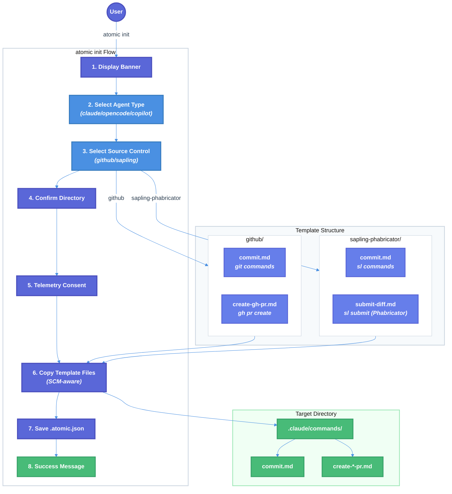

# Source Control Type Selection Technical Design Document

| Document Metadata      | Details         |
| ---------------------- | --------------- |
| Author(s)              | flora131        |
| Status                 | Draft (WIP)     |
| Team / Owner           | flora131/atomic |
| Created / Last Updated | 2026-02-10      |

## 1. Executive Summary

This RFC proposes extending the `atomic init` flow to include source control type selection, initially supporting **GitHub/Git** and **Sapling with Phabricator**, with future extensibility for Azure DevOps. Currently, the `/commit` and `/create-gh-pr` commands are hardcoded for Git/GitHub workflows, limiting users of alternative SCM tools like Meta's Sapling with Phabricator code review.

The proposed solution introduces an SCM selection prompt during initialization that copies the appropriate SCM-specific command files to the user's configuration directory. This enables Sapling users to use native `sl` commands with Phabricator diff submission while maintaining the same developer experience.

**Key changes:**
- **Remove SCM-related skills (`commit`, `create-gh-pr`) from `BUILTIN_SKILLS`** in `skill-commands.ts` — these will be supported purely as disk-based `.md` files
- Add source control selection prompt after agent selection in `atomic init`
- Create Sapling-specific command file variants (`commit.md` with Sapling commands, `submit-diff.md` for Phabricator)
- **Windows support:** Auto-detect Windows via `isWindows()` and use Windows-specific Sapling templates with full executable path (`& 'C:\Program Files\Sapling\sl.exe'`) to avoid PowerShell `sl` alias conflict
- Implement SCM-aware file copying logic during initialization
- Store SCM selection in `.atomic.json` config for future reference

**Note on Sapling + Phabricator:** Sapling integrates with Phabricator (not GitHub) for code review when configured with the `fbcodereview` extension. The `sl submit` command submits diffs to Phabricator, and commits are linked via `Differential Revision:` lines in commit messages.

**Research Reference:** [research/docs/2026-02-10-source-control-type-selection.md](../research/docs/2026-02-10-source-control-type-selection.md)

## 2. Context and Motivation

### 2.1 Current State

The atomic CLI uses a well-structured agent configuration system that copies command files during `atomic init`. Currently, all command files assume Git/GitHub as the source control system.

**Architecture:**
- **Agent Config:** `src/config.ts` defines agent types (Claude, OpenCode, Copilot) with their config folders
- **Init Flow:** `src/commands/init.ts` handles interactive setup and file copying
- **Command Files:** Stored in `.claude/commands/`, `.opencode/command/`, `.github/skills/`

**Current Agent Configuration** (`src/config.ts:5-24`):

```typescript
export interface AgentConfig {
  name: string;                    // Display name
  cmd: string;                     // Command to execute
  folder: string;                  // Config folder (.claude, .opencode, .github)
  additional_files: string[];      // Extra files to copy (CLAUDE.md, etc.)
  preserve_files: string[];        // Files to skip if user has customized
  merge_files: string[];           // Files to merge (.mcp.json)
  // ... other fields
}
```

**Current Command File Locations:**

| Agent    | Commands Location       | SCM-Specific Commands                    |
| -------- | ----------------------- | ---------------------------------------- |
| Claude   | `.claude/commands/`     | `commit.md`, `create-gh-pr.md`           |
| OpenCode | `.opencode/command/`    | `commit.md`, `create-gh-pr.md`           |
| Copilot  | `.github/skills/`       | `commit/SKILL.md`, `create-gh-pr/SKILL.md` |

**SCM Commands Analysis (from research):**

| Command         | Git Operations Used                                              |
| --------------- | ---------------------------------------------------------------- |
| `/commit`       | `git status`, `git branch`, `git diff`, `git add`, `git commit`, `git log` |
| `/create-gh-pr` | `git push`, `gh pr create`                                       |

**Current Built-in Skills in `skill-commands.ts`:**

The following SCM-related skills are currently embedded with full prompt content in `BUILTIN_SKILLS` array (`src/ui/commands/skill-commands.ts`):

| Skill | Lines | Description |
|-------|-------|-------------|
| `commit` | 73-316 | Git-based commit workflow with Conventional Commits |
| `create-gh-pr` | 854-866 | Git/GitHub PR creation |

These embedded skills take priority over disk-based command files, which **limits the ability to provide SCM-specific variants**. The `SKILL_DEFINITIONS` array (lines 1461-1498) also contains legacy references to these same skills.

**Limitations:**
1. Commands are Git-specific with no alternative for Sapling users
2. No mechanism to select or configure SCM type during initialization
3. Users must manually modify command files to use Sapling
4. Command files are duplicated across agent folders with identical Git-based content
5. **Built-in skills in `skill-commands.ts` override disk-based command files**, preventing SCM variant selection

### 2.2 The Problem

- **User Impact:** Developers using Sapling SCM with Phabricator cannot use `/commit` or `/create-gh-pr` commands without manual modification
- **Business Impact:** Meta and other companies using Sapling with Phabricator internally cannot adopt atomic without friction
- **Technical Debt:** Command files contain hardcoded `git` commands that should be abstracted based on SCM choice

**Research Finding:** Only 2 commands currently use SCM-specific operations:
1. `/commit` - Uses `git status`, `git add`, `git commit`, `git log`, `git diff`
2. `/create-gh-pr` - Uses `git`, `gh pr create`

**Sapling + Phabricator Equivalents:**
1. `/commit` - Uses `sl status`, `sl add`, `sl commit`, `sl smartlog`, `sl diff`
2. `/submit-diff` - Uses `sl submit` to create/update Phabricator diffs

**Reference:** [Research Section "Commands That Use Source Control Tools"](../research/docs/2026-02-10-source-control-type-selection.md)

## 3. Goals and Non-Goals

### 3.1 Functional Goals

- [ ] **Remove SCM-related skills from `BUILTIN_SKILLS`** in `skill-commands.ts` (`commit`, `create-gh-pr`)
- [ ] **Remove SCM-related entries from `SKILL_DEFINITIONS`** array (legacy references)
- [ ] Add SCM type selection prompt to `atomic init` flow (after agent selection)
- [ ] Create Sapling-specific command file variants for `/commit` and `/submit-diff` (Phabricator)
- [ ] Implement SCM-aware file copying that places correct command files based on selection
- [ ] Store selected SCM type in `.atomic.json` configuration for future reference
- [ ] Auto-create config directory if it doesn't exist during init
- [ ] Maintain backward compatibility - existing Git/GitHub users see no change
- [ ] Support pre-selected SCM via `--scm` flag for non-interactive usage
- [ ] Update Ralph workflow to be SCM-aware using runtime detection from `.atomic.json`

### 3.2 Non-Goals (Out of Scope)

- [ ] We will NOT implement Azure DevOps support in this version (future extensibility only)
- [ ] We will NOT implement Sapling with GitHub (`sl pr`) — this spec supports **Sapling + Phabricator only**
- [ ] We will NOT implement auto-detection of SCM type (explicit user selection only)
- [ ] We will NOT support hybrid Sapling-on-Git repositories (Sapling running on top of a Git repo)
- [ ] We will NOT migrate existing installations to new SCM type (manual re-init required)
- [ ] We will NOT modify general-purpose commands (`/research-codebase`, `/create-spec`, etc.)
- [ ] We will NOT modify non-SCM skills in `BUILTIN_SKILLS` (e.g., `prompt-engineer`, `testing-anti-patterns`)

## 4. Proposed Solution (High-Level Design)

### 4.1 System Architecture Diagram



### 4.2 Architectural Pattern

**Template-based SCM Selection:** We extend the existing template copying pattern to include SCM-specific command file variants. The init flow gains a new step that determines which command file variants to copy.

**Key Design Decisions:**
1. **Explicit Selection:** Users explicitly choose their SCM type (no auto-detection)
2. **Template Separation:** SCM-specific commands stored in separate template directories
3. **Non-SCM Skills Unchanged:** Non-SCM skills remain in `BUILTIN_SKILLS` (no disk-based migration needed)
4. **Config Persistence:** SCM selection stored for future reference/re-initialization

**Reference:** [Research Section "Proposed Template Directory Structure - Option B"](../research/docs/2026-02-10-source-control-type-selection.md)

### 4.3 Key Components

| Component          | Current                            | Proposed                                           | Justification                               |
| ------------------ | ---------------------------------- | -------------------------------------------------- | ------------------------------------------- |
| **Builtin Skills** | `commit`, `create-gh-pr` in `BUILTIN_SKILLS` | **Remove from `BUILTIN_SKILLS`**, use disk-based only | Enables SCM-variant selection; user-editable |
| SCM Config         | N/A                                | `src/config.ts` - `SCM_CONFIG` object              | Centralized SCM definitions                 |
| Init Flow          | Agent selection only               | Agent + SCM selection                              | Enable SCM-specific commands                |
| Template Structure | Single command files               | SCM-variant directories                            | Clean separation of variants                |
| File Copy Logic    | Simple recursive copy              | SCM-aware selective copy                           | Copy correct variant based on selection     |
| Config Storage     | N/A                                | `.atomic.json` in project root                     | Persist SCM selection                       |

## 5. Detailed Design

### 5.1 SCM Configuration Extension

**File:** `src/config.ts`

```typescript
// New type for source control systems
export type SourceControlType = 'github' | 'sapling-phabricator';
// Future: | 'azure-devops'

export interface ScmConfig {
  /** Internal identifier */
  name: string;
  /** Display name for prompts */
  displayName: string;
  /** Primary CLI tool (git or sl) */
  cliTool: string;
  /** Code review tool (gh, sl submit, etc.) */
  reviewTool: string;
  /** Code review system (github, phabricator) */
  reviewSystem: string;
  /** Directory marker for potential future auto-detection */
  detectDir: string;
  /** Code review command file name */
  reviewCommandFile: string;
  /** Required configuration files */
  requiredConfigFiles?: string[];
}

export const SCM_CONFIG: Record<SourceControlType, ScmConfig> = {
  github: {
    name: "github",
    displayName: "GitHub / Git",
    cliTool: "git",
    reviewTool: "gh",
    reviewSystem: "github",
    detectDir: ".git",
    reviewCommandFile: "create-gh-pr.md",
  },
  "sapling-phabricator": {
    name: "sapling-phabricator",
    displayName: "Sapling + Phabricator",
    cliTool: "sl",
    reviewTool: "sl submit",
    reviewSystem: "phabricator",
    detectDir: ".sl",
    reviewCommandFile: "submit-diff.md",
    requiredConfigFiles: [".arcconfig", "~/.arcrc"],
  },
};

// Commands that have SCM-specific variants
export const SCM_SPECIFIC_COMMANDS = ["commit"];

// Helper functions
export function getScmKeys(): SourceControlType[] {
  return Object.keys(SCM_CONFIG) as SourceControlType[];
}

export function isValidScm(key: string): key is SourceControlType {
  return key in SCM_CONFIG;
}

export function getScmConfig(key: SourceControlType): ScmConfig {
  return SCM_CONFIG[key];
}
```

**Phabricator Configuration Notes:**

Sapling + Phabricator requires additional configuration files:

1. **`.arcconfig`** (in repository root):
```json
{
  "conduit_uri": "https://phabricator.example.com/api/",
  "project_id": "your-project-id"
}
```

2. **`~/.arcrc`** (in home directory):
```json
{
  "hosts": {
    "https://phabricator.example.com/api/": {
      "user": "username",
      "oauth": "your-oauth-token"
    }
  }
}
```

3. **Sapling config** (`~/.sapling/config` or `.hg/hgrc`):
```ini
[extensions]
fbcodereview =

[phabricator]
arcrc_host = https://phabricator.example.com/api/
graphql_host = https://phabricator.example.com/graphql
```

**Reference:** [Research Section "Proposed Configuration Extensions"](../research/docs/2026-02-10-source-control-type-selection.md)

### 5.2 Template Directory Structure

Adopt **Option B** from research - separate template directories per SCM, with **Windows-specific variants** for Sapling to handle the PowerShell `sl` alias conflict:

```
templates/
├── scm/
│   ├── github/
│   │   ├── .claude/
│   │   │   └── commands/
│   │   │       ├── commit.md           # Git-based commit
│   │   │       └── create-gh-pr.md     # gh pr create
│   │   ├── .opencode/
│   │   │   └── command/
│   │   │       ├── commit.md
│   │   │       └── create-gh-pr.md
│   │   └── .github/
│   │       └── skills/
│   │           ├── commit/
│   │           │   └── SKILL.md
│   │           └── create-gh-pr/
│   │               └── SKILL.md
│   │
│   ├── sapling-phabricator/
│   │   ├── .claude/
│   │   │   └── commands/
│   │   │       ├── commit.md           # Sapling-based commit (sl commands)
│   │   │       └── submit-diff.md      # sl submit (Phabricator)
│   │   ├── .opencode/
│   │   │   └── command/
│   │   │       ├── commit.md
│   │   │       └── submit-diff.md
│   │   └── .github/
│   │       └── skills/
│   │           ├── commit/
│   │           │   └── SKILL.md
│   │           └── submit-diff/
│   │               └── SKILL.md
│   │
│   └── sapling-phabricator-windows/    # Windows-specific variants
│       ├── .claude/
│       │   └── commands/
│       │       ├── commit.md           # Uses full path: & 'C:\Program Files\Sapling\sl.exe'
│       │       └── submit-diff.md      # Uses full path for sl.exe
│       ├── .opencode/
│       │   └── command/
│       │       ├── commit.md
│       │       └── submit-diff.md
│       └── .github/
│           └── skills/
│               ├── commit/
│               │   └── SKILL.md
│               └── submit-diff/
│                   └── SKILL.md
```

**Rationale:**
- Clean separation between SCM variants
- Non-SCM skills (e.g., `research-codebase`, `create-spec`, `prompt-engineer`) remain in `BUILTIN_SKILLS` and do not require disk-based templates
- Easy to add new SCM types (e.g., Azure DevOps) later
- Mirrors existing agent folder structure within each SCM directory
- `sapling-phabricator` naming makes the code review system explicit
- **Windows-specific Sapling templates** use full executable path to avoid PowerShell `sl` alias conflict

### 5.2.1 Windows Support for Sapling

**The Problem:** On Windows PowerShell, `sl` is a built-in alias for `Set-Location` (equivalent to `cd`). When an agent executes `sl status`, PowerShell interprets this as `Set-Location status` instead of invoking Sapling.

**Solution:** Create Windows-specific Sapling command files that use the full executable path:

```powershell
# Instead of: sl status
# Use: & 'C:\Program Files\Sapling\sl.exe' status
```

**Leveraging Existing Platform Detection:**

The codebase already has robust Windows detection in `src/utils/detect.ts`:

```typescript
// Existing functions we will use
export function isWindows(): boolean {
  return process.platform === "win32";
}

export function getOppositeScriptExtension(): string {
  return isWindows() ? ".sh" : ".ps1";
}
```

The init flow already uses `getOppositeScriptExtension()` to skip platform-inappropriate scripts. We extend this pattern for SCM template selection.

**SCM Template Resolution Logic:**

```typescript
/**
 * Get the appropriate SCM template directory based on OS and SCM selection.
 *
 * For Sapling on Windows, uses the windows-specific variant that includes
 * full paths to avoid the PowerShell `sl` alias conflict.
 */
function getScmTemplatePath(scmType: SourceControlType): string {
  if (scmType === 'sapling-phabricator' && isWindows()) {
    return 'sapling-phabricator-windows';
  }
  return scmType;
}
```

**Windows Sapling Command Invocation Pattern:**

All Windows Sapling command files use this pattern:

```powershell
# Define Sapling executable path with environment variable override
$SL = if ($env:SL_BIN) { $env:SL_BIN } else { 'C:\Program Files\Sapling\sl.exe' }

# Invoke Sapling commands using call operator
& $SL status
& $SL commit -m "message"
& $SL submit
```

In the Markdown command files, this translates to:

```markdown
## Sapling Commands (Windows)

> **Note:** On Windows, Sapling is invoked via full path to avoid PowerShell alias conflicts.

- Sapling status: !`& 'C:\Program Files\Sapling\sl.exe' status`
- Current bookmark: !`& 'C:\Program Files\Sapling\sl.exe' bookmark`
```

**Environment Variable Override:**

Users can customize the Sapling path by setting the `SL_BIN` environment variable:

```powershell
# In PowerShell profile ($PROFILE)
$env:SL_BIN = 'D:\Tools\Sapling\sl.exe'
```

The command files check for this override:

```markdown
## Prerequisites

Before using Sapling commands on Windows:

1. **Verify Sapling installation:**
   ```powershell
   & 'C:\Program Files\Sapling\sl.exe' version
   ```

2. **Optional: Set custom path** (if installed elsewhere):
   ```powershell
   $env:SL_BIN = 'D:\Custom\Path\sl.exe'
   ```
```

**Alternative: PowerShell Alias Override (User Setup)**

Users who prefer using `sl` directly can override the PowerShell alias:

```powershell
# Add to PowerShell profile ($PROFILE) - run as Administrator for AllScope
Set-Alias -Name sl -Value 'C:\Program Files\Sapling\sl.exe' -Force -Option Constant,ReadOnly,AllScope
```

This is documented but **not required** - the Windows command files work without any user setup.

### 5.3 Init Flow Extension

**File:** `src/commands/init.ts`

**Extended InitOptions Interface:**

```typescript
interface InitOptions {
  showBanner?: boolean;
  preSelectedAgent?: AgentKey;
  preSelectedScm?: SourceControlType;  // NEW
  configNotFoundMessage?: string;
  force?: boolean;
  yes?: boolean;
}
```

**SCM Selection Prompt** (add after agent selection ~line 136):

```typescript
import { SCM_CONFIG, type SourceControlType, getScmKeys, isValidScm } from '../config';

// ... existing agent selection code ...

// NEW: Select source control type (after agent selection, before directory confirmation)
let scmType: SourceControlType;

if (options.preSelectedScm) {
  // Pre-selected SCM - validate and skip selection prompt
  if (!isValidScm(options.preSelectedScm)) {
    cancel(`Unknown source control: ${options.preSelectedScm}`);
    process.exit(1);
  }
  scmType = options.preSelectedScm;
  log.info(`Using ${SCM_CONFIG[scmType].displayName} for source control...`);
} else if (autoConfirm) {
  // Auto-confirm mode defaults to GitHub
  scmType = 'github';
  log.info('Defaulting to GitHub/Git for source control...');
} else {
  // Interactive selection
  const scmOptions = getScmKeys().map((key) => ({
    value: key,
    label: SCM_CONFIG[key].displayName,
    hint: `Uses ${SCM_CONFIG[key].cliTool} + ${SCM_CONFIG[key].reviewSystem}`,
  }));

  const selectedScm = await select({
    message: "Select your source control system:",
    options: scmOptions,
  });

  if (isCancel(selectedScm)) {
    cancel("Operation cancelled.");
    process.exit(0);
  }

  scmType = selectedScm as SourceControlType;
}

// ... continue with directory confirmation ...
```

### 5.4 SCM-Aware File Copy Logic

**File:** `src/commands/init.ts`

New function to copy SCM-specific command files with **automatic Windows detection**:

```typescript
import { join } from 'path';
import { SCM_CONFIG, type SourceControlType } from '../config';
import { isWindows } from '../utils/detect';

interface CopyScmCommandsOptions {
  scmType: SourceControlType;
  agentFolder: string;        // e.g., ".claude"
  commandsSubfolder: string;  // e.g., "commands" or "command"
  targetDir: string;          // Project root
  configRoot: string;         // Template root
}

/**
 * Get the appropriate SCM template directory based on OS and SCM selection.
 *
 * For Sapling on Windows, uses the windows-specific variant that includes
 * full paths to avoid the PowerShell `sl` alias conflict.
 *
 * This follows the existing pattern in the codebase where platform detection
 * is handled via `isWindows()` from `src/utils/detect.ts`.
 */
function getScmTemplatePath(scmType: SourceControlType): string {
  // Windows requires special handling for Sapling due to PowerShell `sl` alias
  if (scmType === 'sapling-phabricator' && isWindows()) {
    return 'sapling-phabricator-windows';
  }
  return scmType;
}

/**
 * Copy SCM-specific command files based on user's SCM selection.
 *
 * This copies from templates/scm/{scmTemplatePath}/{agentFolder}/{commandsSubfolder}/
 * to {targetDir}/{agentFolder}/{commandsSubfolder}/
 *
 * On Windows with Sapling, automatically uses Windows-specific templates
 * that invoke sl.exe via full path to avoid PowerShell alias conflicts.
 */
async function copyScmCommands(options: CopyScmCommandsOptions): Promise<void> {
  const { scmType, agentFolder, commandsSubfolder, targetDir, configRoot } = options;

  // Resolve platform-specific template path
  const scmTemplateDir = getScmTemplatePath(scmType);

  const scmTemplatePath = join(
    configRoot,
    'templates',
    'scm',
    scmTemplateDir,
    agentFolder,
    commandsSubfolder
  );

  const targetPath = join(targetDir, agentFolder, commandsSubfolder);

  // Check if SCM template directory exists
  if (!(await pathExists(scmTemplatePath))) {
    // No SCM-specific version exists; non-SCM skills are provided via BUILTIN_SKILLS
    return;
  }

  // Log platform-specific selection in debug mode
  if (process.env.DEBUG === '1') {
    if (scmType === 'sapling-phabricator' && isWindows()) {
      console.log(`[DEBUG] Using Windows-specific Sapling templates (full path to sl.exe)`);
    }
    console.log(`[DEBUG] Copying SCM templates from: ${scmTemplatePath}`);
  }

  // Copy SCM-specific command files (overwrites base commands)
  await copyDirPreserving(scmTemplatePath, targetPath);
}

/**
 * Get the commands subfolder name for each agent type.
 */
function getCommandsSubfolder(agentKey: AgentKey): string {
  switch (agentKey) {
    case 'claude':
      return 'commands';
    case 'opencode':
      return 'command';
    case 'copilot':
      return 'skills';
    default:
      return 'commands';
  }
}
```

**Integration into main init flow:**

```typescript
// After copying base template folder
await copyDirPreserving(sourceFolder, targetFolder, {
  exclude: agent.exclude,
});

// NEW: Copy SCM-specific command files (overwrites base versions)
await copyScmCommands({
  scmType,
  agentFolder: agent.folder,
  commandsSubfolder: getCommandsSubfolder(agentKey),
  targetDir,
  configRoot,
});

// Save SCM selection to config
await saveAtomicConfig(targetDir, { scm: scmType, agent: agentKey });
```

### 5.5 Atomic Config File

**File:** `src/utils/atomic-config.ts` (new file)

```typescript
import { join } from 'path';
import { readFile, writeFile } from 'fs/promises';
import type { SourceControlType } from '../config';
import type { AgentKey } from '../config';

const CONFIG_FILENAME = '.atomic.json';

export interface AtomicConfig {
  /** Version of config schema */
  version?: number;
  /** Selected agent type */
  agent?: AgentKey;
  /** Selected source control type */
  scm?: SourceControlType;
  /** Timestamp of last init */
  lastUpdated?: string;
}

/**
 * Read atomic config from project directory.
 */
export async function readAtomicConfig(projectDir: string): Promise<AtomicConfig | null> {
  const configPath = join(projectDir, CONFIG_FILENAME);
  try {
    const content = await readFile(configPath, 'utf-8');
    return JSON.parse(content) as AtomicConfig;
  } catch {
    return null;
  }
}

/**
 * Save atomic config to project directory.
 */
export async function saveAtomicConfig(
  projectDir: string,
  updates: Partial<AtomicConfig>
): Promise<void> {
  const configPath = join(projectDir, CONFIG_FILENAME);
  const existing = await readAtomicConfig(projectDir) ?? {};

  const newConfig: AtomicConfig = {
    ...existing,
    ...updates,
    version: 1,
    lastUpdated: new Date().toISOString(),
  };

  await writeFile(configPath, JSON.stringify(newConfig, null, 2) + '\n', 'utf-8');
}

/**
 * Get the selected SCM type from atomic config, or null if not set.
 */
export async function getSelectedScm(projectDir: string): Promise<SourceControlType | null> {
  const config = await readAtomicConfig(projectDir);
  return config?.scm ?? null;
}
```

**Example `.atomic.json` file:**

```json
{
  "version": 1,
  "agent": "claude",
  "scm": "sapling",
  "lastUpdated": "2026-02-10T12:00:00.000Z"
}
```

### 5.6 Sapling Command File: commit.md

**File:** `templates/scm/sapling-phabricator/.claude/commands/commit.md`

```markdown
---
description: Create well-formatted commits with conventional commit format using Sapling.
model: opus
allowed-tools: Bash(sl add:*), Bash(sl status:*), Bash(sl commit:*), Bash(sl diff:*), Bash(sl smartlog:*), Bash(sl amend:*), Bash(sl absorb:*)
argument-hint: [message] | --amend
---

# Smart Sapling Commit

Create well-formatted commit: $ARGUMENTS

## Current Repository State

- Sapling status: !`sl status`
- Current bookmark: !`sl bookmark`
- Recent commits (smartlog): !`sl smartlog -l 5`
- Pending changes: !`sl diff --stat`

## What This Command Does

1. Checks which files have changes with `sl status`
2. If there are untracked files to include, adds them with `sl add`
3. Performs a `sl diff` to understand what changes are being committed
4. Analyzes the diff to determine if multiple distinct logical changes are present
5. If multiple distinct changes are detected, suggests breaking the commit into multiple smaller commits
6. For each commit (or the single commit if not split), creates a commit message using conventional commit format

## Key Sapling Differences from Git

- **No staging area**: Sapling commits all pending changes directly (no separate "git add" step for staging)
- **Amend with auto-restack**: `sl amend` automatically rebases descendant commits
- **Smartlog**: Use `sl smartlog` or `sl ssl` for graphical commit history with diff status
- **Absorb**: Use `sl absorb` to intelligently integrate pending changes into the right commits in a stack
- **Stacked Diffs**: Each commit in a stack becomes a separate Phabricator diff when submitted

## Sapling Commit Commands Reference

| Command | Description |
|---------|-------------|
| `sl commit -m "message"` | Create a new commit with message |
| `sl commit -A` | Add untracked files and commit |
| `sl amend` | Amend current commit (auto-rebases descendants) |
| `sl amend --to COMMIT` | Amend changes to a specific commit in stack |
| `sl absorb` | Intelligently absorb changes into stack commits |
| `sl fold --from .^` | Combine parent commit into current |

## Best Practices for Commits

- Follow the Conventional Commits specification as described below.
- Keep commits small and focused - each commit becomes a separate Phabricator diff
- Use `sl amend` freely - Sapling handles rebasing automatically

# Conventional Commits 1.0.0

## Summary

The Conventional Commits specification is a lightweight convention on top of commit messages. It provides an easy set of rules for creating an explicit commit history.

The commit message should be structured as follows:

```
<type>[optional scope]: <description>

[optional body]

[optional footer(s)]
```

## Commit Types

1. **fix:** patches a bug in your codebase (correlates with PATCH in SemVer)
2. **feat:** introduces a new feature (correlates with MINOR in SemVer)
3. **BREAKING CHANGE:** introduces a breaking API change (correlates with MAJOR in SemVer)
4. Other types: `build:`, `chore:`, `ci:`, `docs:`, `style:`, `refactor:`, `perf:`, `test:`

## Examples

### Simple commit
```
docs: correct spelling of CHANGELOG
```

### Commit with scope
```
feat(lang): add Polish language
```

### Breaking change
```
feat!: send an email to the customer when a product is shipped

BREAKING CHANGE: `extends` key in config file is now used for extending other config files
```

## Important Notes

- By default, pre-commit checks (defined in `.pre-commit-config.yaml`) will run to ensure code quality
- IMPORTANT: DO NOT SKIP pre-commit checks
- ALWAYS attribute AI-Assisted Code Authorship
- Before committing, the command will review the diff to ensure the message matches the changes
- When submitting to Phabricator, each commit becomes a separate diff with `Differential Revision:` line added
```

**Reference:** [Research Section "Git → Sapling Command Mapping for /commit"](../research/docs/2026-02-10-source-control-type-selection.md) and [Sapling Reference Guide](../research/docs/sapling-reference.md)

### 5.7 Sapling Command File: submit-diff.md (Phabricator)

**File:** `templates/scm/sapling-phabricator/.claude/commands/submit-diff.md`

```markdown
---
description: Submit commits as Phabricator diffs for code review using Sapling.
model: opus
allowed-tools: Bash(sl:*), Glob, Grep, NotebookRead, Read, SlashCommand
argument-hint: [--draft] [--update "message"]
---

# Submit Diff Command (Sapling + Phabricator)

Submit commits to Phabricator for code review using Sapling's native diff submission.

## Current Repository State

- Sapling status: !`sl status`
- Current bookmark: !`sl bookmark`
- Recent commits with diff status: !`sl ssl`
- Pending changes: !`sl diff --stat`

## Behavior

1. If there are uncommitted changes, first run `/commit` to create a commit
2. Submit commits to Phabricator using `sl submit`
3. Each commit in the stack becomes a separate Phabricator diff (D12345)
4. Commit messages are updated with `Differential Revision:` link

## Sapling + Phabricator Workflow

The `sl submit` command submits commits to Phabricator for code review:
- Creates a new diff if none exists for the commit
- Updates existing diff if one is already linked (via `Differential Revision:` in commit message)
- Handles stacked diffs with proper dependency relationships

### Common Operations

| Task | Command |
|------|---------|
| Submit current commit | `sl submit` |
| Submit as draft | `sl submit --draft` (via UI) |
| Update diff after amend | `sl amend && sl submit` |
| View diff status | `sl ssl` (shows diff status in smartlog) |
| Check sync status | `sl log -T '{syncstatus}\n' -r .` |
| Get diff ID | `sl log -T '{phabdiff}\n' -r .` |
| View changes since last submit | `sl diff --since-last-submit` |

### Diff Status Values

The `{phabstatus}` template keyword shows:
- `Needs Review` - Awaiting reviewer feedback
- `Accepted` - Ready to land
- `Needs Revision` - Reviewer requested changes
- `Committed` - Diff has been landed
- `Abandoned` - Diff was closed without landing

## Stacked Diffs

Sapling naturally supports stacked commits. When submitting:
- Each commit in the stack gets its own Phabricator diff (D12345, D12346, D12347)
- Diffs are linked with proper dependency relationships
- Reviewers can review each diff independently

```bash
# Create a stack
sl commit -m "feat: add base functionality"
sl commit -m "feat: add validation layer"
sl commit -m "feat: add error handling"

# Submit entire stack
sl submit
```

## Prerequisites

1. **`.arcconfig`** must exist in repository root with Phabricator URL
2. **`~/.arcrc`** must contain authentication credentials
3. **`fbcodereview`** extension must be enabled in Sapling config

## Configuration Verification

```bash
# Verify .arcconfig exists
cat .arcconfig

# Verify authentication
sl log -T '{phabstatus}\n' -r .  # Should not error
```

## After Diff is Approved

Once a diff is accepted in Phabricator:
1. The diff can be "landed" (merged to main branch)
2. Sapling automatically marks landed commits as hidden
3. Use `sl ssl` to verify the diff shows as `Committed`

## Notes

- Unlike GitHub PRs, Phabricator diffs are tied to commits via the `Differential Revision:` line
- Use `sl diff --since-last-submit` to see what changed since last submission
- The ISL (Interactive Smartlog) web UI also supports submitting diffs
```

**Reference:** [Sapling Reference Guide - Phabricator Integration](../research/docs/sapling-reference.md)

### 5.7.1 Windows-Specific Sapling Command Files

On Windows, Sapling command files use the full executable path to avoid the PowerShell `sl` alias conflict. These are automatically selected when `isWindows()` returns `true` during `atomic init`.

**File:** `templates/scm/sapling-phabricator-windows/.claude/commands/commit.md`

```markdown
---
description: Create well-formatted commits with conventional commit format using Sapling (Windows).
model: opus
allowed-tools: Bash(& 'C:\\Program Files\\Sapling\\sl.exe':*), Bash(sl.exe:*)
argument-hint: [message] | --amend
---

# Smart Sapling Commit (Windows)

Create well-formatted commit: $ARGUMENTS

> **Windows Note:** This command uses the full path to `sl.exe` to avoid conflicts with PowerShell's built-in `sl` alias for `Set-Location`.

## Current Repository State

- Sapling status: !`& 'C:\Program Files\Sapling\sl.exe' status`
- Current bookmark: !`& 'C:\Program Files\Sapling\sl.exe' bookmark`
- Recent commits (smartlog): !`& 'C:\Program Files\Sapling\sl.exe' smartlog -l 5`
- Pending changes: !`& 'C:\Program Files\Sapling\sl.exe' diff --stat`

## What This Command Does

1. Checks which files have changes with `& 'C:\Program Files\Sapling\sl.exe' status`
2. If there are untracked files to include, adds them with `& 'C:\Program Files\Sapling\sl.exe' add`
3. Performs a diff to understand what changes are being committed
4. Analyzes the diff to determine if multiple distinct logical changes are present
5. If multiple distinct changes are detected, suggests breaking the commit into multiple smaller commits
6. For each commit (or the single commit if not split), creates a commit message using conventional commit format

## Key Sapling Differences from Git

- **No staging area**: Sapling commits all pending changes directly (no separate "git add" step for staging)
- **Amend with auto-restack**: `sl amend` automatically rebases descendant commits
- **Smartlog**: Use `sl smartlog` or `sl ssl` for graphical commit history with diff status
- **Absorb**: Use `sl absorb` to intelligently integrate pending changes into the right commits in a stack
- **Stacked Diffs**: Each commit in a stack becomes a separate Phabricator diff when submitted

## Sapling Commit Commands Reference (Windows)

| Command | Description |
|---------|-------------|
| `& 'C:\Program Files\Sapling\sl.exe' commit -m "message"` | Create a new commit with message |
| `& 'C:\Program Files\Sapling\sl.exe' commit -A` | Add untracked files and commit |
| `& 'C:\Program Files\Sapling\sl.exe' amend` | Amend current commit (auto-rebases descendants) |
| `& 'C:\Program Files\Sapling\sl.exe' amend --to COMMIT` | Amend changes to a specific commit in stack |
| `& 'C:\Program Files\Sapling\sl.exe' absorb` | Intelligently absorb changes into stack commits |
| `& 'C:\Program Files\Sapling\sl.exe' fold --from .^` | Combine parent commit into current |

## Custom Installation Path

If Sapling is installed in a non-default location, set the `SL_BIN` environment variable:

```powershell
$env:SL_BIN = 'D:\Tools\Sapling\sl.exe'
```

## Best Practices for Commits

- Follow the Conventional Commits specification
- Keep commits small and focused - each commit becomes a separate Phabricator diff
- Use `sl amend` freely - Sapling handles rebasing automatically

[... Conventional Commits specification same as Unix version ...]
```

**File:** `templates/scm/sapling-phabricator-windows/.claude/commands/submit-diff.md`

```markdown
---
description: Submit commits as Phabricator diffs for code review using Sapling (Windows).
model: opus
allowed-tools: Bash(& 'C:\\Program Files\\Sapling\\sl.exe':*), Bash(sl.exe:*), Glob, Grep, NotebookRead, Read, SlashCommand
argument-hint: [--draft] [--update "message"]
---

# Submit Diff Command (Sapling + Phabricator - Windows)

Submit commits to Phabricator for code review using Sapling's native diff submission.

> **Windows Note:** This command uses the full path to `sl.exe` to avoid conflicts with PowerShell's built-in `sl` alias.

## Current Repository State

- Sapling status: !`& 'C:\Program Files\Sapling\sl.exe' status`
- Current bookmark: !`& 'C:\Program Files\Sapling\sl.exe' bookmark`
- Recent commits with diff status: !`& 'C:\Program Files\Sapling\sl.exe' ssl`
- Pending changes: !`& 'C:\Program Files\Sapling\sl.exe' diff --stat`

## Behavior

1. If there are uncommitted changes, first run `/commit` to create a commit
2. Submit commits to Phabricator using `& 'C:\Program Files\Sapling\sl.exe' submit`
3. Each commit in the stack becomes a separate Phabricator diff (D12345)
4. Commit messages are updated with `Differential Revision:` link

## Sapling + Phabricator Workflow (Windows)

The submit command submits commits to Phabricator for code review:
- Creates a new diff if none exists for the commit
- Updates existing diff if one is already linked (via `Differential Revision:` in commit message)
- Handles stacked diffs with proper dependency relationships

### Common Operations (Windows)

| Task | Command |
|------|---------|
| Submit current commit | `& 'C:\Program Files\Sapling\sl.exe' submit` |
| Submit as draft | `& 'C:\Program Files\Sapling\sl.exe' submit --draft` |
| Update diff after amend | `& 'C:\Program Files\Sapling\sl.exe' amend; & 'C:\Program Files\Sapling\sl.exe' submit` |
| View diff status | `& 'C:\Program Files\Sapling\sl.exe' ssl` |
| Check sync status | `& 'C:\Program Files\Sapling\sl.exe' log -T '{syncstatus}\n' -r .` |

## Prerequisites

1. **`.arcconfig`** must exist in repository root with Phabricator URL
2. **`~/.arcrc`** must contain authentication credentials
3. **`fbcodereview`** extension must be enabled in Sapling config

## Configuration Verification (Windows)

```powershell
# Verify Sapling installation
& 'C:\Program Files\Sapling\sl.exe' version

# Verify .arcconfig exists
Get-Content .arcconfig

# Verify authentication
& 'C:\Program Files\Sapling\sl.exe' log -T '{phabstatus}\n' -r .
```

## Custom Installation Path

If Sapling is installed in a non-default location:

```powershell
# Set in PowerShell profile ($PROFILE)
$env:SL_BIN = 'D:\Tools\Sapling\sl.exe'
```

## Notes

- Unlike GitHub PRs, Phabricator diffs are tied to commits via the `Differential Revision:` line
- Use `& 'C:\Program Files\Sapling\sl.exe' diff --since-last-submit` to see what changed since last submission
- The ISL (Interactive Smartlog) web UI also supports submitting diffs and works identically on Windows
```

**Key Differences in Windows Command Files:**

| Aspect | Unix Version | Windows Version |
|--------|--------------|-----------------|
| Command invocation | `sl status` | `& 'C:\Program Files\Sapling\sl.exe' status` |
| Allowed tools | `Bash(sl:*)` | `Bash(& 'C:\\Program Files\\Sapling\\sl.exe':*)` |
| Path separator | N/A | Backslashes with proper escaping |
| Custom path | `$SL_BIN` environment variable | `$env:SL_BIN` environment variable |
| Shell syntax | Bash | PowerShell |

### 5.8 Commands Summary

Based on research analysis, here is the full command classification:

| Command               | Category       | Uses SCM? | GitHub Variant    | Sapling+Phabricator Variant | Migration Action                          |
| --------------------- | -------------- | --------- | ----------------- | --------------------------- | ----------------------------------------- |
| `commit`              | skill          | **YES**   | `commit.md` (git) | `commit.md` (sl)            | **REMOVE from BUILTIN_SKILLS** → disk-based |
| `create-gh-pr`        | skill          | **YES**   | `create-gh-pr.md` | N/A                         | **REMOVE from BUILTIN_SKILLS** → disk-based |
| `submit-diff`         | skill          | **YES**   | N/A               | `submit-diff.md` (sl submit)| NEW: Phabricator diff submission          |
| `research-codebase`   | skill          | No        | -                 | -                           | Keep in BUILTIN_SKILLS (no SCM dependency) |
| `create-spec`         | skill          | No        | -                 | -                           | Keep in BUILTIN_SKILLS (no SCM dependency) |
| `implement-feature`   | skill          | No        | -                 | -                           | Keep in BUILTIN_SKILLS (no SCM dependency) |
| `explain-code`        | skill          | No        | -                 | -                           | Keep in BUILTIN_SKILLS (no SCM dependency) |
| `prompt-engineer`     | skill (pinned) | No        | -                 | -                           | Keep in BUILTIN_SKILLS (pinned)           |
| `testing-anti-patterns` | skill (pinned) | No      | -                 | -                           | Keep in BUILTIN_SKILLS (pinned)           |
| `/help`, `/theme`, etc. | builtin      | No        | -                 | -                           | No change (UI commands)                   |
| `/ralph`              | workflow       | **YES**   | gh pr create      | sl submit                   | Runtime SCM detection from .atomic.json   |

**Key Migration:** The `commit` and `create-gh-pr` skills will be **removed** from `BUILTIN_SKILLS` in `skill-commands.ts` and supported **purely as disk-based `.md` files** in the `templates/scm/` directories. This allows SCM-variant selection during `atomic init`.

**Sapling + Phabricator Notes:**
- The `submit-diff` command replaces `create-gh-pr` for Phabricator workflows
- Phabricator uses "diffs" (D12345) instead of "pull requests"
- Each commit becomes a separate diff when submitted via `sl submit`

**Reference:** [Research Section "Commands Summary Table"](../research/docs/2026-02-10-source-control-type-selection.md)

### 5.9 Migration from Built-in to Disk-Based Skills

As part of this change, the following skills will be **removed** from `BUILTIN_SKILLS` in `skill-commands.ts`:

| Skill | Current Location | New Location |
|-------|------------------|--------------|
| `commit` | `skill-commands.ts:73-316` | `templates/scm/{github,sapling}/.claude/commands/commit.md` |
| `create-gh-pr` | `skill-commands.ts:854-866` | `templates/scm/github/.claude/commands/create-gh-pr.md` |

**Additionally, remove from `SKILL_DEFINITIONS` array (lines 1461-1498):**
- `commit` entry (lines 1463-1467)
- `create-gh-pr` entry (lines 1483-1487)

**Rationale:**
- Enables SCM-variant selection during `atomic init`
- Makes skills user-editable without code changes
- Aligns with the disk-based command file architecture
- Simplifies the codebase by reducing embedded content

**Migration Steps:**
1. Extract prompt content from `BUILTIN_SKILLS` entries for `commit` and `create-gh-pr`
2. Create corresponding `.md` files in `templates/scm/github/` directories (preserving exact prompt content)
3. Create Sapling variants in `templates/scm/sapling/` directories
4. Remove `commit` and `create-gh-pr` from `BUILTIN_SKILLS` array
5. Remove corresponding entries from `SKILL_DEFINITIONS` array
6. Verify disk-based skill discovery picks up the new files
7. Update tests to reflect new skill loading behavior

### 5.10 Ralph Workflow SCM-Awareness

**File:** `src/graph/nodes/ralph-nodes.ts`

Ralph workflow will use runtime SCM detection to support both GitHub and Sapling+Phabricator workflows. The SCM type is read from `.atomic.json` at workflow execution time.

#### SCM-Specific Prompts

**GitHub PR Creation Prompt** (existing `CREATE_PR_PROMPT`):
```typescript
export const GITHUB_PR_PROMPT = `
Create a pull request for the Ralph session $SESSION_ID.
...
Use the gh CLI to create the PR:
\`\`\`bash
gh pr create --title "TITLE" --body "BODY" --base $BASE_BRANCH
\`\`\`

After creating the PR, output the PR URL on its own line in this format:
PR_URL: https://github.com/...
`;
```

**Phabricator Diff Submission Prompt** (new):
```typescript
export const PHABRICATOR_SUBMIT_PROMPT = `
Submit commits as Phabricator diffs for the Ralph session $SESSION_ID.
...
Use Sapling to submit the diff:
\`\`\`bash
sl submit
\`\`\`

After submitting, output the diff URL on its own line in this format:
DIFF_URL: D12345
or
DIFF_URL: https://phabricator.example.com/D12345
`;
```

#### SCM-Aware URL Extraction

**New function for Phabricator diff URLs:**

```typescript
/**
 * Extract Phabricator diff URL from agent output.
 * Matches formats: D12345, https://phabricator.example.com/D12345
 */
export function extractDiffUrl(output: string): string | undefined {
  // Match explicit DIFF_URL format
  const diffUrlMatch = output.match(/DIFF_URL:\s*(D\d+|https:\/\/[^\s]+\/D\d+)/i);
  if (diffUrlMatch) {
    return diffUrlMatch[1];
  }

  // Match Phabricator URL pattern
  const phabUrlMatch = output.match(/(https:\/\/[^\s]+\/D\d+)/);
  if (phabUrlMatch) {
    return phabUrlMatch[1];
  }

  // Match bare diff ID (D12345)
  const diffIdMatch = output.match(/\b(D\d{4,})\b/);
  if (diffIdMatch) {
    return diffIdMatch[1];
  }

  return undefined;
}
```

**SCM-aware extraction wrapper:**

```typescript
import { getSelectedScm } from '../../utils/atomic-config';
import type { SourceControlType } from '../../config';

/**
 * Extract code review URL based on configured SCM type.
 */
export function extractReviewUrl(
  output: string,
  scm: SourceControlType
): string | undefined {
  return scm === 'sapling-phabricator'
    ? extractDiffUrl(output)
    : extractPRUrl(output);
}
```

#### Updated createPRNode Implementation

```typescript
import { getSelectedScm } from '../../utils/atomic-config';

export function createPRNode<TState extends RalphWorkflowState>(
  config: CreatePRNodeConfig
): NodeDefinition<TState> {
  return {
    id: config.id,
    type: "tool",
    name: config.name ?? "Create PR/Diff",
    description: "Create a pull request (GitHub) or submit diff (Phabricator)",
    execute: async (ctx: ExecutionContext<TState>): Promise<NodeResult<TState>> => {
      const state = ctx.state as RalphWorkflowState;

      // Runtime SCM detection
      const scm = await getSelectedScm(state.projectDir) ?? 'github';

      // Select appropriate prompt
      const submitPrompt = scm === 'sapling-phabricator'
        ? PHABRICATOR_SUBMIT_PROMPT
        : GITHUB_PR_PROMPT;

      // Build agent prompt with session-specific values
      const agentPrompt = submitPrompt
        .replace('$SESSION_ID', state.ralphSessionId)
        .replace('$BASE_BRANCH', state.baseBranch ?? 'main');

      // Execute agent with prompt
      const agentResult = await ctx.executeAgent(agentPrompt);

      // Extract review URL using SCM-aware extraction
      const reviewUrl = extractReviewUrl(agentResult.output, scm);

      return {
        stateUpdate: {
          prUrl: reviewUrl,  // Field name kept for backward compatibility
          prBranch: extractBranchName(agentResult.output),
        } as Partial<TState>,
      };
    },
  };
}
```

#### Updated Agent Prompts for SCM Commands

The `implementFeatureNode` also references git commands that need SCM-awareness:

```typescript
// In implementFeatureNode execute function
const scm = await getSelectedScm(state.projectDir) ?? 'github';

// Select appropriate history command
const historyCommand = scm === 'sapling-phabricator'
  ? 'sl smartlog -l 10'
  : 'git log --oneline -10';

agentPrompt += `\n\n1. Read \`.ralph/sessions/${state.ralphSessionId}/tasks.json\`
2. Read \`.ralph/sessions/${state.ralphSessionId}/progress.txt\`
3. Read \`${historyCommand}\` to see recent commits.
4. The next task to implement is: ${task.content} (${task.id})`;
```

#### State Field Naming

The `RalphWorkflowState` interface retains `prUrl` and `prBranch` field names for backward compatibility, even though these may contain Phabricator diff references:

```typescript
export interface RalphWorkflowState extends BaseState {
  // ... other fields ...
  prUrl?: string;      // GitHub PR URL or Phabricator diff ID/URL
  prBranch?: string;   // Branch name (may not apply to Phabricator stacked diffs)
}
```

**Note:** Future versions may rename these to `reviewUrl` and `reviewBranch` for clarity.

### 5.11 CLI Interface Updates

**Updated command structure:**

```
atomic                                  # Interactive setup (unchanged)
atomic init                             # Full interactive setup (now includes SCM)
atomic init --scm <type>                # Setup with pre-selected SCM (NEW)
atomic init --agent <name> --scm <type> # Full pre-selection (NEW)
atomic --agent <name>                   # Run agent with auto-init (prompts for SCM if config missing)
atomic --agent <name> --scm <type>      # Run agent with auto-init using pre-selected SCM (NEW)
```

**Updated help text:**

```
Options:
  -a, --agent <name>    Agent name: claude, opencode, copilot
  -s, --scm <type>      Source control: github, sapling-phabricator (NEW)
  -v, --version         Show version number
  -h, --help            Show this help
  --no-banner           Skip ASCII banner display

Examples:
  atomic init --scm sapling-phabricator  # Setup with Sapling + Phabricator
  atomic init -a claude -s sapling-phabricator  # Claude + Sapling + Phabricator
  atomic -a claude -s github             # Run Claude with GitHub (auto-init if needed)
```

## 6. Alternatives Considered

| Option                                     | Pros                                              | Cons                                                   | Reason for Rejection                                  |
| ------------------------------------------ | ------------------------------------------------- | ------------------------------------------------------ | ----------------------------------------------------- |
| **A: Auto-detect SCM from .git/.sl**       | Zero user friction, "just works"                  | Ambiguous for Sapling-on-Git repos, less explicit      | Hybrid repos make detection unreliable                |
| **B: Single command with SCM flag**        | Less file duplication                             | Complexity in command files, harder to maintain        | Violates single-responsibility principle              |
| **C: Runtime SCM detection in commands**   | No init changes, dynamic behavior                 | Commands become complex, harder to customize           | Moves complexity to wrong layer                       |
| **D: Template variants (Selected)**        | Clean separation, easy to maintain, extensible    | More template files to manage                          | **Selected:** Best balance of simplicity and clarity  |
| **E: Embedded SCM variants in skill-commands.ts** | Single source of truth                     | Large file, harder to customize                        | Disk-based commands are more user-editable            |

**Reference:** [Research Section "Open Questions"](../research/docs/2026-02-10-source-control-type-selection.md)

## 7. Cross-Cutting Concerns

### 7.1 Security and Privacy

- **No change** - SCM selection is stored locally in `.atomic.json`
- **No network requests** - Selection is purely local configuration
- **Input Validation** - SCM type validated via `isValidScm()` type guard
- **Credential handling:**
  - GitHub: Uses `gh` CLI authentication
  - Sapling + Phabricator: Uses `.arcrc` credentials (OAuth tokens stored locally)
- **Command Allowlists** - Each SCM variant specifies appropriate `allowed-tools` in frontmatter
- **Phabricator tokens** - Never stored in atomic config; uses existing `.arcrc` file

### 7.2 Observability Strategy

- **Debug mode** - `DEBUG=1` will log SCM selection and file copy operations
- **Logging** - `log.info()` messages when SCM selection is made
- **Telemetry** - Track SCM type selection in telemetry (optional/anonymized)

```typescript
// Extend telemetry to include SCM type
trackAtomicCommand("init", agentKey as AgentType, true, { scm: scmType });
```

- **Preferences File** - `.atomic.json` provides audit trail of configuration choices

### 7.3 Backward Compatibility

| Scenario                          | Behavior                                               |
| --------------------------------- | ------------------------------------------------------ |
| Existing Git/GitHub users         | No change - default selection is GitHub                |
| `atomic init` without `--scm`     | Prompts for SCM selection (new step)                   |
| Re-running init with different SCM | Overwrites command files with new SCM variant         |
| Missing `.atomic.json`            | Assumed GitHub (historical behavior)                   |
| Auto-confirm (`--yes`) mode       | Defaults to GitHub                                     |
| `atomic --agent` with existing config | Uses existing commands (no SCM check)              |
| `atomic --agent` without config   | Runs full init flow including SCM selection prompt     |

### 7.4 Extensibility for Future SCM Types

The architecture supports adding new SCM types by:
1. Adding entry to `SCM_CONFIG` in `src/config.ts`
2. Creating variant files in the templates directory
3. No changes required to init flow logic

**Future additions:**

```typescript
// Future addition to SCM_CONFIG - Azure DevOps
"azure-devops": {
  name: "azure-devops",
  displayName: "Azure DevOps",
  cliTool: "git",
  reviewTool: "az repos",
  reviewSystem: "azure-devops",
  detectDir: ".git",
  reviewCommandFile: "create-ado-pr.md",
}
```

New template directories:
```
templates/scm/azure-devops/
├── .claude/commands/
│   ├── commit.md           # Same as github (uses git)
│   └── create-ado-pr.md    # Uses az repos pr create
```

## 8. Migration, Rollout, and Testing

### 8.1 Deployment Strategy

- [ ] **Phase 1:** Add SCM config types and helpers to `src/config.ts`
- [ ] **Phase 2:** Create `src/utils/atomic-config.ts` for config persistence
- [ ] **Phase 3:** Create template directory structure (`templates/scm/`)
- [ ] **Phase 4:** Create Sapling command file variants
- [ ] **Phase 5:** Modify `src/commands/init.ts` to add SCM selection prompt
- [ ] **Phase 6:** Implement SCM-aware file copying logic
- [ ] **Phase 7:** Update tests and documentation

### 8.2 Test Plan

#### Unit Tests

```typescript
// tests/scm-config.test.ts
describe('SCM Configuration', () => {
  test('getScmKeys returns all SCM types', () => {
    expect(getScmKeys()).toEqual(['github', 'sapling-phabricator']);
  });

  test('isValidScm validates known SCM types', () => {
    expect(isValidScm('github')).toBe(true);
    expect(isValidScm('sapling-phabricator')).toBe(true);
    expect(isValidScm('sapling')).toBe(false);  // Old name not valid
    expect(isValidScm('unknown')).toBe(false);
  });

  test('SCM_CONFIG contains required fields', () => {
    for (const key of getScmKeys()) {
      const config = SCM_CONFIG[key];
      expect(config.name).toBeDefined();
      expect(config.displayName).toBeDefined();
      expect(config.cliTool).toBeDefined();
      expect(config.reviewTool).toBeDefined();
      expect(config.reviewSystem).toBeDefined();
    }
  });

  test('Sapling+Phabricator has required config files', () => {
    const config = SCM_CONFIG['sapling-phabricator'];
    expect(config.requiredConfigFiles).toContain('.arcconfig');
    expect(config.requiredConfigFiles).toContain('~/.arcrc');
  });
});

// tests/atomic-config.test.ts
describe('Atomic Config', () => {
  test('saves and reads SCM selection', async () => {
    await saveAtomicConfig(tempDir, { scm: 'sapling-phabricator' });
    const config = await readAtomicConfig(tempDir);
    expect(config?.scm).toBe('sapling-phabricator');
  });
});
```

#### Integration Tests

| Test Case                    | Command                                    | Expected                                    |
| ---------------------------- | ------------------------------------------ | ------------------------------------------- |
| Default SCM (interactive)    | `atomic init` (select GitHub)              | Copies github command variants              |
| Sapling+Phabricator selection| `atomic init` (select Sapling+Phabricator) | Copies sapling-phabricator command variants |
| Pre-selected SCM             | `atomic init --scm sapling-phabricator`    | Skips SCM prompt, uses Sapling+Phabricator  |
| Auto-confirm defaults        | `atomic init --yes`                        | Defaults to GitHub                          |
| Config persistence           | Run init, check `.atomic.json`             | SCM selection saved                         |
| Re-init with different SCM   | Init GitHub, then init Sapling+Phabricator | Command files updated to Sapling            |
| Non-SCM skills unaffected    | Init with any SCM                          | `research-codebase` skill still works via BUILTIN_SKILLS |
| Auto-init prompts for SCM    | `atomic --agent claude` (no `.claude/`)    | Runs full init flow with SCM selection prompt |
| Auto-init with pre-selected  | `atomic --agent claude --scm github`       | Auto-init without SCM prompt, uses GitHub   |

#### Windows-Specific Tests

```typescript
// tests/scm-windows.test.ts
describe('Windows SCM Template Selection', () => {
  test('getScmTemplatePath returns windows variant on Windows', () => {
    // Mock isWindows() to return true
    jest.spyOn(detect, 'isWindows').mockReturnValue(true);

    expect(getScmTemplatePath('sapling-phabricator')).toBe('sapling-phabricator-windows');
    expect(getScmTemplatePath('github')).toBe('github'); // GitHub unchanged
  });

  test('getScmTemplatePath returns standard variant on Unix', () => {
    jest.spyOn(detect, 'isWindows').mockReturnValue(false);

    expect(getScmTemplatePath('sapling-phabricator')).toBe('sapling-phabricator');
  });

  test('Windows Sapling commit.md uses full path', async () => {
    const content = await readFile(
      'templates/scm/sapling-phabricator-windows/.claude/commands/commit.md',
      'utf-8'
    );

    expect(content).toContain("& 'C:\\Program Files\\Sapling\\sl.exe'");
    expect(content).not.toMatch(/^sl\s/m); // No bare 'sl' commands
  });

  test('Windows command files have proper allowed-tools escaping', async () => {
    const content = await readFile(
      'templates/scm/sapling-phabricator-windows/.claude/commands/commit.md',
      'utf-8'
    );

    // Verify double-backslash escaping in YAML frontmatter
    expect(content).toContain("Bash(& 'C:\\\\Program Files\\\\Sapling\\\\sl.exe':*)");
  });
});
```

| Test Case                                | Platform | Command                                    | Expected                                    |
| ---------------------------------------- | -------- | ------------------------------------------ | ------------------------------------------- |
| Windows Sapling auto-detection           | Windows  | `atomic init` (select Sapling+Phabricator) | Copies `sapling-phabricator-windows` templates |
| Windows commit.md uses full path         | Windows  | Check copied `commit.md`                   | Contains `& 'C:\Program Files\Sapling\sl.exe'` |
| Unix Sapling uses standard templates     | macOS    | `atomic init` (select Sapling+Phabricator) | Copies `sapling-phabricator` templates (bare `sl`) |
| GitHub unaffected by platform            | Both     | `atomic init` (select GitHub)              | Same templates on both platforms            |

#### End-to-End Tests

- [ ] Full init flow with GitHub selection → verify `commit.md` has `git` commands
- [ ] Full init flow with Sapling+Phabricator selection → verify `commit.md` has `sl` commands
- [ ] Verify `create-gh-pr.md` copied for GitHub, `submit-diff.md` for Sapling+Phabricator
- [ ] Verify `submit-diff.md` references Phabricator concepts (diffs, D12345, Differential Revision)
- [ ] **Windows:** Verify Sapling commands use full path `& 'C:\Program Files\Sapling\sl.exe'`
- [ ] **Windows:** Verify no bare `sl` commands in Windows Sapling templates
- [ ] Test on Windows, macOS, Linux

### 8.3 Rollback Plan

If issues arise:
1. Remove SCM selection prompt from init flow
2. Revert to copying current (GitHub-only) command files
3. The `.atomic.json` config file is benign and can remain

## 9. Open Questions / Unresolved Issues

These questions should be resolved before marking the document "Approved":

- [x] **Command Naming:** Should Sapling code review command be `create-sl-pr.md` or `submit-diff.md`?
  - **Decision:** Use `submit-diff.md` for Phabricator workflows since Phabricator uses "diffs" not "pull requests"

- [ ] **CLI Flag:** Should we add `--scm <type>` flag to init command for scripting?
  - **Recommendation:** Yes, similar to `--agent` flag

- [x] **Ralph Workflow:** The `/ralph` workflow uses `gh pr create` in its PR node. Should this also be SCM-aware?
  - **Decision:** Yes. Ralph will use runtime SCM detection by reading `.atomic.json` to determine which prompts and URL extraction logic to use. See Section 5.10 for implementation details.

- [x] **Built-in Skills:** Should we make the embedded skills in `skill-commands.ts` SCM-aware?
  - **Decision:** No. Instead, **remove SCM-related skills** (`commit`, `create-gh-pr`) from `BUILTIN_SKILLS` entirely. They will be supported purely as disk-based `.md` files in `templates/scm/`, which enables SCM-variant selection during init. See Section 5.9 for migration details.

- [x] **Hybrid Repos:** How to handle Sapling-on-Git repositories?
  - **Decision:** Not supported. This spec only supports native Sapling with Phabricator. Hybrid Sapling-on-Git configurations are explicitly out of scope.

- [ ] **`.atomic.json` in `.gitignore`:** Should we auto-add `.atomic.json` to `.gitignore` since it's user-specific configuration?
  - **Recommendation:** No, keep it tracked so team shares the same SCM config

- [x] **SCM detection during auto-init:** When `atomic --agent claude` triggers auto-init and config folder is missing, should it prompt for SCM or default to GitHub?
  - **Decision:** Run the full init flow including SCM selection prompt. Since SCM-specific commands (`commit`, `create-gh-pr`/`submit-diff`) are no longer built-in and exist only as disk-based files, users need to select their SCM to get the correct command variants. Silently defaulting to GitHub would leave Sapling users with broken commands. For non-interactive/scripted usage, users can run `atomic init --agent claude --scm github --yes` first.

- [ ] **Phabricator Configuration Validation:** Should `atomic init` validate that `.arcconfig` and `~/.arcrc` exist when Sapling+Phabricator is selected?
  - **Recommendation:** Yes, with a warning if missing (not a hard error) and instructions for setup

- [x] **Sapling + GitHub Support:** Should we also support Sapling with GitHub (`sl pr`) in addition to Phabricator?
  - **Decision:** No. This spec focuses exclusively on **Sapling + Phabricator**. Sapling-on-Git (using `sl pr` with GitHub) is explicitly out of scope and will not be implemented.

- [x] **Windows PowerShell `sl` Alias Conflict:** How do we handle the PowerShell built-in `sl` alias for `Set-Location` that conflicts with Sapling's `sl` command?
  - **Decision:** Create Windows-specific Sapling command files (`sapling-phabricator-windows/`) that use the full executable path `& 'C:\Program Files\Sapling\sl.exe'` instead of bare `sl` commands. The init flow auto-detects Windows via the existing `isWindows()` function from `src/utils/detect.ts` and selects the appropriate template directory. This requires no user setup and works out of the box. Users with custom installation paths can set `$env:SL_BIN` to override. See Section 5.2.1 for full details.

**Reference:** [Research Section "Open Questions"](../research/docs/2026-02-10-source-control-type-selection.md)

## 10. Implementation Checklist

### Phase 0: Remove SCM Skills from BUILTIN_SKILLS

- [ ] Remove `commit` skill definition from `BUILTIN_SKILLS` array in `skill-commands.ts` (lines 73-316)
- [ ] Remove `create-gh-pr` skill definition from `BUILTIN_SKILLS` array in `skill-commands.ts` (lines 854-866)
- [ ] Remove `commit` entry from `SKILL_DEFINITIONS` array (lines 1463-1467)
- [ ] Remove `create-gh-pr` entry from `SKILL_DEFINITIONS` array (lines 1483-1487)
- [ ] Update tests in `tests/ui/commands/skill-commands.test.ts` that reference removed skills

### Phase 1: Configuration

- [ ] Add `SourceControlType` type to `src/config.ts`
- [ ] Add `ScmConfig` interface to `src/config.ts`
- [ ] Add `SCM_CONFIG` constant with `github` and `sapling-phabricator` entries
- [ ] Add helper functions: `getScmKeys()`, `isValidScm()`, `getScmConfig()`
- [ ] Add `SCM_SPECIFIC_COMMANDS` constant

### Phase 2: Config Persistence

- [ ] Create `src/utils/atomic-config.ts`
- [ ] Implement `AtomicConfig` interface
- [ ] Implement `readAtomicConfig()` function
- [ ] Implement `saveAtomicConfig()` function
- [ ] Implement `getSelectedScm()` function

### Phase 3: Template Structure

- [ ] Create `templates/scm/github/` directory structure
- [ ] Create `templates/scm/sapling-phabricator/` directory structure
- [ ] Create `templates/scm/sapling-phabricator-windows/` directory structure (Windows-specific)
- [ ] Move existing GitHub commands to `templates/scm/github/`
- [ ] Create Sapling `commit.md` command file (with `sl` commands)
- [ ] Create Sapling `submit-diff.md` command file (Phabricator submission)
- [ ] Create Windows Sapling `commit.md` (with full path `& 'C:\Program Files\Sapling\sl.exe'`)
- [ ] Create Windows Sapling `submit-diff.md` (with full path)
- [ ] Replicate for all agent types (claude, opencode, copilot)

### Phase 4: Init Flow

- [ ] Update `InitOptions` interface with `preSelectedScm`
- [ ] Add SCM selection prompt after agent selection
- [ ] Implement `getScmTemplatePath()` function (returns `sapling-phabricator-windows` on Windows)
- [ ] Implement `copyScmCommands()` function with platform-aware template selection
- [ ] Implement `getCommandsSubfolder()` helper
- [ ] Integrate SCM-aware copying into init flow
- [ ] Add debug logging for Windows template selection
- [ ] Save SCM selection to `.atomic.json`
- [ ] Update success message to include SCM info

### Phase 5: CLI Integration

- [ ] Add `--scm <type>` option to init command
- [ ] Add `--scm <type>` option to `--agent` command for non-interactive auto-init
- [ ] Update `runAgentCommand` to run full init flow (including SCM prompt) when config missing
- [ ] Pass `--scm` to init flow when provided with `--agent`
- [ ] Handle auto-confirm mode (default to GitHub)
- [ ] Add validation for SCM type
- [ ] Update help text

### Phase 6: Ralph Workflow SCM-Awareness

- [ ] Add `PHABRICATOR_SUBMIT_PROMPT` constant to `ralph-nodes.ts`
- [ ] Implement `extractDiffUrl()` function for Phabricator diff URLs
- [ ] Implement `extractReviewUrl()` SCM-aware wrapper function
- [ ] Update `createPRNode` to use runtime SCM detection
- [ ] Update `implementFeatureNode` agent prompt to use SCM-aware history command
- [ ] Add tests for Phabricator URL extraction
- [ ] Add integration tests for Ralph with Sapling+Phabricator

### Phase 7: Testing

- [ ] Add unit tests for SCM config functions
- [ ] Add unit tests for atomic config persistence
- [ ] Add integration tests for init flow with SCM selection
- [ ] Update existing tests that assume GitHub-only

### Phase 8: Documentation

- [ ] Update README with SCM selection information
- [ ] Add Sapling-specific usage examples
- [ ] Document command file customization for other SCMs
- [ ] Add `.atomic.json` to documentation

## 11. File Structure (Post-Implementation)

```
atomic/
├── src/
│   ├── config.ts                      # Extended with SCM_CONFIG
│   ├── commands/
│   │   └── init.ts                    # Modified with SCM selection + Windows detection
│   ├── graph/
│   │   └── nodes/
│   │       └── ralph-nodes.ts         # MODIFIED: SCM-aware PR/diff submission
│   ├── ui/
│   │   └── commands/
│   │       └── skill-commands.ts      # MODIFIED: Remove commit, create-gh-pr from BUILTIN_SKILLS
│   └── utils/
│       ├── atomic-config.ts           # NEW: .atomic.json management
│       └── detect.ts                  # EXISTING: isWindows() used for template selection
│
├── templates/
│   ├── scm/
│   │   ├── github/
│   │   │   ├── .claude/commands/
│   │   │   │   ├── commit.md
│   │   │   │   └── create-gh-pr.md
│   │   │   ├── .opencode/command/
│   │   │   │   ├── commit.md
│   │   │   │   └── create-gh-pr.md
│   │   │   └── .github/skills/
│   │   │       ├── commit/SKILL.md
│   │   │       └── create-gh-pr/SKILL.md
│   │   │
│   │   ├── sapling-phabricator/       # Unix/macOS variant
│   │   │   ├── .claude/commands/
│   │   │   │   ├── commit.md          # Uses bare `sl` commands
│   │   │   │   └── submit-diff.md     # Phabricator diff submission
│   │   │   ├── .opencode/command/
│   │   │   │   ├── commit.md
│   │   │   │   └── submit-diff.md
│   │   │   └── .github/skills/
│   │   │       ├── commit/SKILL.md
│   │   │       └── submit-diff/SKILL.md
│   │   │
│   │   └── sapling-phabricator-windows/  # Windows variant (auto-selected via isWindows())
│   │       ├── .claude/commands/
│   │       │   ├── commit.md          # Uses `& 'C:\Program Files\Sapling\sl.exe'`
│   │       │   └── submit-diff.md     # Full path to avoid PowerShell sl alias
│   │       ├── .opencode/command/
│   │       │   ├── commit.md
│   │       │   └── submit-diff.md
│   │       └── .github/skills/
│   │           ├── commit/SKILL.md
│   │           └── submit-diff/SKILL.md
│
├── .claude/commands/                  # Current location (will be reorganized)
│   ├── commit.md                      # → templates/scm/github/.claude/commands/
│   └── create-gh-pr.md                # → templates/scm/github/.claude/commands/
│
└── tests/
    ├── scm-config.test.ts             # NEW
    ├── scm-windows.test.ts            # NEW: Windows-specific template tests
    ├── atomic-config.test.ts          # NEW
    └── init-scm.test.ts               # NEW
```

## 12. Code References

### Existing Implementation
- `src/config.ts:5-24` - AgentConfig interface (pattern for ScmConfig)
- `src/config.ts:26-70` - AGENT_CONFIG object (pattern for SCM_CONFIG)
- `src/commands/init.ts:124-135` - Agent selection prompt (insertion point for SCM)
- `src/commands/init.ts:49-79` - `copyDirPreserving()` function (needs SCM logic)
- `src/commands/init.ts:84-300` - Main `initCommand()` function
- `src/commands/run-agent.ts:88-98` - Auto-init when folder doesn't exist

### Files to Modify for SCM Skill Migration
- `src/ui/commands/skill-commands.ts:72-1449` - `BUILTIN_SKILLS` array (remove: `commit`, `create-gh-pr`)
- `src/ui/commands/skill-commands.ts:1461-1498` - `SKILL_DEFINITIONS` array (remove: `commit`, `create-gh-pr`)
- `src/ui/commands/skill-commands.ts:1708-1711` - `PINNED_BUILTIN_SKILLS` set (verify no SCM skills pinned)

### Research References
- [research/docs/2026-02-10-source-control-type-selection.md](../research/docs/2026-02-10-source-control-type-selection.md) - Primary research document
- [research/docs/sapling-reference.md](../research/docs/sapling-reference.md) - Complete Git → Sapling command mapping

### External References
- [Sapling SCM Documentation](https://sapling-scm.com/docs/)
- [Facebook Sapling Repository](https://github.com/facebook/sapling)
- [Sapling Phabricator Integration](https://sapling-scm.com/docs/addons/phabricator) - fbcodereview extension
- [Phabricator Documentation](https://secure.phabricator.com/book/phabricator/)
- [Arcanist Configuration](https://secure.phabricator.com/book/phabricator/article/arcanist/) - .arcconfig and .arcrc setup

### Related Specs
- [specs/commander-js-migration.md](./commander-js-migration.md) - CLI framework migration (may affect init command structure)
- [specs/cli-auto-init-agent.md](./cli-auto-init-agent.md) - Auto-init design (SCM selection during auto-init)

## 13. Appendix: Sapling + Phabricator Reference

### Key Sapling Commands for Phabricator

| Command | Description |
|---------|-------------|
| `sl submit` | Submit commits to Phabricator as diffs |
| `sl ssl` | Super smartlog - shows commit graph with diff status |
| `sl diff --since-last-submit` | View changes since last Phabricator submission |
| `sl log -T '{phabstatus}\n' -r .` | Get diff status (Needs Review, Accepted, etc.) |
| `sl log -T '{phabdiff}\n' -r .` | Get diff ID (D12345) |
| `sl log -T '{syncstatus}\n' -r .` | Check if local is in sync with Phabricator |
| `sl amend` | Amend current commit (auto-rebases descendants) |
| `sl absorb` | Intelligently integrate changes into stack commits |

### Phabricator Diff Status Values

| Status | Meaning |
|--------|---------|
| `Needs Review` | Awaiting reviewer feedback |
| `Accepted` | Approved, ready to land |
| `Needs Revision` | Reviewer requested changes |
| `Needs Final Review` | Waiting for final approval |
| `Committed` | Diff has been landed |
| `Abandoned` | Diff was closed without landing |
| `Unpublished` | Draft diff |
| `Landing` | Currently being landed |

### Commit Message Format with Phabricator

After submission, Sapling automatically adds the Phabricator link to the commit message:

```
feat: add user authentication

This commit adds JWT-based authentication to the API.

Differential Revision: https://phabricator.example.com/D12345
```

### Stacked Diffs Workflow

```bash
# Create a stack of commits
sl commit -m "feat: add base API endpoint"
sl commit -m "feat: add request validation"
sl commit -m "feat: add response formatting"

# Submit entire stack to Phabricator
sl submit

# Each commit gets its own diff: D12345, D12346, D12347
# Diffs are automatically linked with dependencies

# After reviewer feedback, amend and resubmit
sl amend
sl submit

# View stack status
sl ssl
```

### Required Configuration Files

**`.arcconfig`** (repository root):
```json
{
  "conduit_uri": "https://phabricator.example.com/api/",
  "project_id": "myproject"
}
```

**`~/.arcrc`** (home directory):
```json
{
  "hosts": {
    "https://phabricator.example.com/api/": {
      "user": "your-username",
      "oauth": "cli-XXXXXXXXXXXXX"
    }
  }
}
```

**Sapling Config** (`~/.sapling/config`):
```ini
[extensions]
fbcodereview =

[phabricator]
arcrc_host = https://phabricator.example.com/api/
graphql_host = https://phabricator.example.com/graphql

[fbcodereview]
hide-landed-commits = true
```
