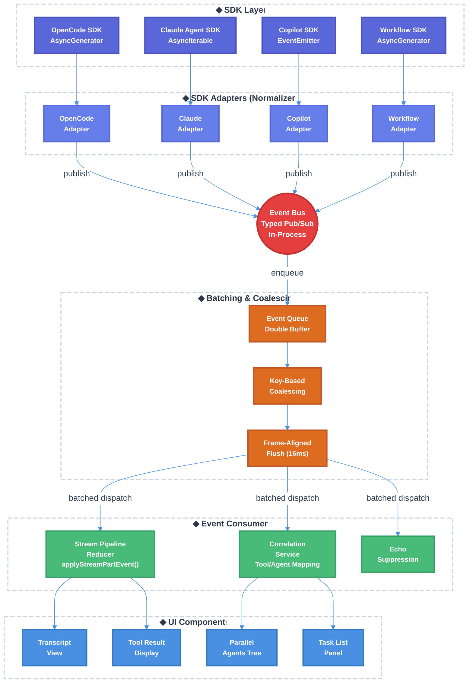

# Streaming Architecture Migration: Callbacks to Event-Bus Pattern — Technical Design Document

| Document Metadata      | Details           |
| ---------------------- | ----------------- |
| Author(s)              | lavaman131        |
| Status                 | Draft (WIP)       |
| Team / Owner           | lavaman131/atomic |
| Created / Last Updated | 2026-02-26        |

## 1. Executive Summary

This RFC proposes migrating the Atomic TUI's streaming architecture from a **callback-based prop-threading model** to a **centralized event-bus pattern** inspired by OpenCode's SSE + event-bus + batched coalescing architecture. The current system threads streaming callbacks (`onChunk`, `onComplete`, `onMeta`) through React props and refs, maintains 10+ correlation Map/Set structures across 1,400+ lines of event handling code, and operates dual-path event delivery (stream-path vs hook-path) with complex echo suppression. The proposed event-bus architecture normalizes all three SDK streaming patterns (OpenCode AsyncGenerator, Claude AsyncIterable, Copilot EventEmitter) into a unified in-process publish-subscribe system with key-based coalescing and frame-aligned batching (16ms), reducing render churn and eliminating tight coupling between the orchestration layer and UI components. Workflow SDK streaming will share the same event backbone, enabling unified rendering of sub-agents, tool calls, and workflow output.

**Research Reference:** [research/docs/2026-02-26-streaming-architecture-event-bus-migration.md](../research/docs/2026-02-26-streaming-architecture-event-bus-migration.md)

## 2. Context and Motivation

### 2.1 Current State

The Atomic TUI uses a **multi-layered callback architecture** where streaming data flows from SDK clients through function callbacks to the UI layer:

```
SDK Client.stream() → AsyncIterable<AgentMessage>
      ↓
index.ts: for await (msg of stream)
      ↓ (callbacks)
  onChunk(text)  →  chat.tsx: setMessagesWindowed(applyStreamPartEvent)
  onMeta(meta)   →  chat.tsx: setMessagesWindowed(applyStreamPartEvent)
  onComplete()   →  chat.tsx: finalize streaming state
      ↓
SDK Client.on("tool.start") → state.toolStartHandler → chat.tsx: handleToolStart
SDK Client.on("tool.complete") → state.toolCompleteHandler → chat.tsx: handleToolComplete
SDK Client.on("subagent.start") → state.parallelAgentHandler → chat.tsx: updateAgentTree
```

**Key characteristics of current architecture:**

- **Callback prop-threading**: Streaming callbacks registered via React props and stored as refs in `ChatUIState` (`src/ui/index.ts:167-176`)
- **Dual-path event delivery**: Events arrive via both the AsyncIterable stream (stream-path) and SDK's native event system (hook-path), with `toolEventsViaHooks` flag preventing duplicates (`src/ui/index.ts:477-1293`)
- **10+ correlation structures**: Maps and Sets tracking tool IDs, agent IDs, session ownership, and run counters (`src/ui/index.ts:479-563`)
- **Per-event React state updates**: Each text delta triggers `setMessagesWindowed((prev) => prev.map(...))` mapping over all messages (`src/ui/chat.tsx:3551-3576`)
- **100ms UI throttling**: Via `use-throttled-value.ts` hook
- **Echo suppression**: 80+ lines of iterative string matching in the streaming loop (`src/ui/index.ts:1699-1765`)

**SDK Event Normalization (already completed):** The codebase already has a unified event type system (`src/sdk/types.ts:297-310`) with SDK-agnostic UI components, normalized event data fields, and shared `Session`/`CodingAgentClient` contracts (ref: [sdk-ui-standardization-research](../research/docs/2026-02-12-sdk-ui-standardization-research.md)).

### 2.2 The Problem

- **Tight Coupling**: `src/ui/index.ts` (1,400+ lines of `subscribeToToolEvents()`) is tightly coupled to `src/ui/chat.tsx` via ref-based handler storage and callback registration, making both files difficult to modify independently.
- **Render Churn**: Every streaming text delta, tool event, and thinking update triggers a full `setMessagesWindowed()` call that maps over all messages, creating unnecessary React reconciliation work.
- **Dual-Path Complexity**: The stream-path vs hook-path split requires per-SDK configuration (`toolEventsViaHooks`) and creates race conditions when events arrive out of order (ref: [background-agents-sdk-pipeline](../research/docs/2026-02-23-258-background-agents-sdk-event-pipeline.md)).
- **Correlation State Explosion**: 10+ Map/Set structures for tool/agent/session correlation create maintenance burden and fragile FIFO assumptions that break with concurrent same-tool calls.
- **Workflow Isolation**: Workflow execution uses separate `context.addMessage()` and `context.setTodoItems()` calls rather than sharing the streaming backbone, preventing unified rendering (ref: [workflow-sdk-standardization](../research/docs/2026-02-25-workflow-sdk-standardization.md)).
- **No Backpressure**: The current `EventEmitter` in `src/sdk/base-client.ts` dispatches synchronously with no mechanism to slow producers when consumers fall behind.

## 3. Goals and Non-Goals

### 3.1 Functional Goals

- [ ] Implement a centralized, typed, in-process event bus that replaces callback prop-threading for all streaming events
- [ ] Normalize all three SDK streaming patterns (OpenCode AsyncGenerator, Claude AsyncIterable, Copilot EventEmitter) into unified event bus publishers
- [ ] Implement key-based coalescing to eliminate redundant state updates (e.g., rapid `message.part.updated` events collapse to latest)
- [ ] Implement frame-aligned batching (16ms flush cycle) to reduce React render churn
- [ ] Unify workflow SDK streaming with main chat streaming via the shared event bus
- [ ] Eliminate dual-path event delivery by routing all events through the single event bus
- [ ] Maintain all existing UI behaviors: echo suppression, thinking indicators, tool status, sub-agent tree, task lists
- [ ] Preserve generation-based staleness guards and run ownership tracking
- [ ] Support existing `StreamPartEvent` reducer pipeline (`applyStreamPartEvent()`) as the downstream consumer

### 3.2 Non-Goals (Out of Scope)

- [ ] Will NOT introduce a local HTTP server or SSE transport — the event bus is in-process only (no network layer like OpenCode's architecture)
- [ ] Will NOT migrate from React to SolidJS — batching will integrate with React 18's automatic batching
- [ ] Will NOT change the existing `AgentMessage` or `StreamPartEvent` type definitions — the event bus adds a layer above, not replaces
- [ ] Will NOT refactor the parts pipeline (`stream-pipeline.ts`, `store.ts`) — it remains the downstream consumer
- [ ] Will NOT rewrite SDK client implementations (`opencode.ts`, `claude.ts`, `copilot.ts`) from scratch — adapters consume their native streaming APIs and publish to the bus

## 4. Proposed Solution (High-Level Design)

### 4.1 System Architecture Diagram



### 4.2 Architectural Pattern

We are adopting a **centralized in-process Event Bus with batched dispatch** pattern, inspired by OpenCode's SSE + event-bus architecture (ref: [streaming-architecture-event-bus-migration](../research/docs/2026-02-26-streaming-architecture-event-bus-migration.md), Section 2) but adapted for Atomic's pure-TUI context (no network transport needed).

**Key architectural decisions:**

1. **In-process bus** instead of SSE transport — Atomic has no server; events flow within a single Node.js/Bun process
2. **SDK adapters** normalize three heterogeneous streaming APIs into a single `BusEvent` type
3. **Key-based coalescing** (borrowed from OpenCode's `global-sdk.tsx:46-84`) eliminates redundant state updates
4. **Frame-aligned batching** (16ms flush) reduces React reconciliation to ~60fps cadence
5. **Correlation as a service** — extracted from the monolithic `subscribeToToolEvents()` into a standalone event bus consumer

### 4.3 Key Components

| Component                | Responsibility                                                    | Technology                                                           | Justification                                                         |
| ------------------------ | ----------------------------------------------------------------- | -------------------------------------------------------------------- | --------------------------------------------------------------------- |
| `EventBus`               | Typed pub/sub with topic-based routing, replaces `EventEmitter`   | Custom TypeScript class with Zod schema validation                   | Matches OpenCode's `Bus` system with `BusEvent.define()` typed events |
| `SDK Adapters`           | Normalize SDK streaming APIs to `BusEvent`, replace `client.on()` | Per-SDK adapter classes                                              | Single event pathway — adapters are the only SDK event consumers      |
| `BatchDispatcher`        | Queue, coalesce, and flush events at 16ms                         | Double-buffer + `setTimeout`                                         | Matches OpenCode's `global-sdk.tsx` batching with double-buffer swap  |
| `CorrelationService`     | Tool ID ↔ Agent ID mapping, session ownership                     | Replaces `subscribeToToolEvents()` entirely                          | Decouples correlation logic from UI; testable in isolation            |
| `EchoSuppressor`         | Post-task duplicate text filtering                                | Replaces inline echo suppression in `handleStreamMessage()`          | Isolates 80+ lines of string matching into testable unit              |
| `StreamPipelineConsumer` | Translates `BusEvent` → `StreamPartEvent` for existing reducer    | Replaces callback-based `handleChunk`/`handleMeta`/`handleToolStart` | Single `setMessages()` call per batch instead of per-event            |

## 5. Detailed Design

### 5.1 Event Bus Core

#### 5.1.1 Bus Event Type Definitions

The event bus uses a **Zod-validated typed event system** with discriminated unions, modeled after OpenCode's `BusEvent.define(name, zodSchema)` pattern (ref: [streaming-architecture-event-bus-migration](../research/docs/2026-02-26-streaming-architecture-event-bus-migration.md), Section 2.1). This replaces the existing `EventType` union in `src/sdk/types.ts` — the old `EventType` and `EventEmitter` are deleted:

```typescript
// src/events/bus-events.ts

/** All event types that flow through the bus */
type BusEventType =
    // Text streaming
    | "stream.text.delta"
    | "stream.text.complete"
    // Thinking / reasoning
    | "stream.thinking.delta"
    | "stream.thinking.complete"
    // Tool lifecycle
    | "stream.tool.start"
    | "stream.tool.complete"
    // Sub-agent lifecycle
    | "stream.agent.start"
    | "stream.agent.update"
    | "stream.agent.complete"
    // Session lifecycle
    | "stream.session.start"
    | "stream.session.idle"
    | "stream.session.error"
    // Workflow events
    | "workflow.step.start"
    | "workflow.step.complete"
    | "workflow.task.update"
    // UI control events
    | "stream.permission.requested"
    | "stream.human_input_required"
    | "stream.skill.invoked"
    // Metadata
    | "stream.usage";

/** Base event envelope */
interface BusEvent<T extends BusEventType = BusEventType> {
    type: T;
    sessionId: string;
    runId: number;
    timestamp: number;
    data: BusEventDataMap[T];
}

/** Maps event types to their data payloads */
interface BusEventDataMap {
    "stream.text.delta": { delta: string; messageId: string };
    "stream.text.complete": { messageId: string; fullText: string };
    "stream.thinking.delta": {
        delta: string;
        sourceKey: string;
        messageId: string;
    };
    "stream.thinking.complete": { sourceKey: string; durationMs: number };
    "stream.tool.start": {
        toolId: string;
        toolName: string;
        toolInput: Record<string, unknown>;
        sdkCorrelationId?: string;
        parentAgentId?: string;
    };
    "stream.tool.complete": {
        toolId: string;
        toolName: string;
        toolResult: string;
        success: boolean;
        error?: string;
        sdkCorrelationId?: string;
    };
    "stream.agent.start": {
        agentId: string;
        agentType: string;
        task: string;
        isBackground: boolean;
        sdkCorrelationId?: string;
    };
    "stream.agent.update": {
        agentId: string;
        currentTool?: string;
        toolUses?: number;
    };
    "stream.agent.complete": {
        agentId: string;
        success: boolean;
        result?: string;
        error?: string;
    };
    "workflow.step.start": {
        workflowId: string;
        nodeId: string;
        nodeName: string;
    };
    "workflow.step.complete": {
        workflowId: string;
        nodeId: string;
        status: "success" | "error" | "skipped";
        result?: unknown;
    };
    "workflow.task.update": {
        workflowId: string;
        tasks: Array<{ id: string; title: string; status: string }>;
    };
    // ... remaining event data types follow same pattern
}
```

#### 5.1.2 Bus Implementation

```typescript
// src/events/event-bus.ts

import { z } from "zod";

/** Define a typed bus event with Zod schema validation (OpenCode pattern) */
function defineBusEvent<T extends string, S extends z.ZodType>(
    type: T,
    schema: S,
) {
    return {
        type,
        schema,
        parse: (data: unknown) => schema.parse(data),
    } as const;
}

type BusHandler<T extends BusEventType> = (event: BusEvent<T>) => void;
type WildcardHandler = (event: BusEvent) => void;

class AtomicEventBus {
    private handlers = new Map<BusEventType, Set<BusHandler<BusEventType>>>();
    private wildcardHandlers = new Set<WildcardHandler>();

    /** Subscribe to a specific event type. Returns unsubscribe function. */
    on<T extends BusEventType>(type: T, handler: BusHandler<T>): () => void;

    /** Subscribe to all events (OpenCode's Bus.subscribeAll pattern). Returns unsubscribe function. */
    onAll(handler: WildcardHandler): () => void;

    /** Publish an event — validates with Zod schema, dispatches to all matching subscribers. */
    publish<T extends BusEventType>(event: BusEvent<T>): void;

    /** Remove all handlers and reset bus state. */
    clear(): void;
}
```

**Design rationale:** The bus mirrors OpenCode's `Bus` system — `publish()` validates event data via Zod schemas before dispatch (catching type errors at runtime), `onAll()` enables wildcard subscription (used by BatchDispatcher and debug logging), and `on()` enables topic-filtered subscription. The old `EventEmitter` in `base-client.ts` is deleted — this is the sole event system.

#### 5.1.3 Coalescing Key Function

Adapted from OpenCode's `global-sdk.tsx:46-84` (ref: [streaming-architecture-event-bus-migration](../research/docs/2026-02-26-streaming-architecture-event-bus-migration.md), Section 2.2):

```typescript
// src/events/coalescing.ts

/**
 * Generate a coalescing key for an event. Events with the same key
 * within a batching window will be coalesced (only latest retained).
 * Returns undefined for events that must never be coalesced (e.g., text deltas).
 */
function coalescingKey(event: BusEvent): string | undefined {
    switch (event.type) {
        // Text deltas are NEVER coalesced — each delta is additive
        case "stream.text.delta":
        case "stream.thinking.delta":
            return undefined;

        // Tool/agent state updates coalesce by entity ID
        case "stream.tool.start":
        case "stream.tool.complete":
            return `tool:${event.data.toolId}`;
        case "stream.agent.update":
            return `agent.update:${event.data.agentId}`;
        case "stream.agent.start":
            return `agent.start:${event.data.agentId}`;

        // Session status coalesces by session
        case "stream.session.start":
        case "stream.session.idle":
        case "stream.session.error":
            return `session:${event.sessionId}`;

        // Workflow task list coalesces per workflow
        case "workflow.task.update":
            return `workflow.tasks:${event.data.workflowId}`;

        // Usage stats coalesce per session
        case "stream.usage":
            return `usage:${event.sessionId}`;

        default:
            return undefined;
    }
}
```

**Key insight from OpenCode research:** Text deltas must NEVER be coalesced because each delta is additive (appended to content). State-replacement events (tool status, agent updates, session status) should coalesce because only the latest state matters.

#### 5.1.4 Batch Dispatcher

```typescript
// src/events/batch-dispatcher.ts

const FLUSH_INTERVAL_MS = 16; // ~60 FPS alignment

class BatchDispatcher {
    private queue: BusEvent[] = [];
    private buffer: BusEvent[] = [];
    private coalesced = new Map<string, number>(); // key → index in queue
    private lastFlush = 0;
    private flushTimer: ReturnType<typeof setTimeout> | null = null;
    private consumers: Array<(events: BusEvent[]) => void> = [];

    /** Enqueue an event for batched dispatch */
    enqueue(event: BusEvent): void {
        const key = coalescingKey(event);
        if (key !== undefined) {
            const existingIdx = this.coalesced.get(key);
            if (existingIdx !== undefined) {
                this.queue[existingIdx] = event; // Overwrite with latest
                return;
            }
            this.coalesced.set(key, this.queue.length);
        }
        this.queue.push(event);
        this.scheduleFlush();
    }

    /** Register a consumer that receives batched events */
    addConsumer(consumer: (events: BusEvent[]) => void): () => void;

    private scheduleFlush(): void {
        if (this.flushTimer !== null) return;
        const elapsed = Date.now() - this.lastFlush;
        if (elapsed >= FLUSH_INTERVAL_MS) {
            this.flush();
        } else {
            this.flushTimer = setTimeout(
                () => this.flush(),
                FLUSH_INTERVAL_MS - elapsed,
            );
        }
    }

    private flush(): void {
        this.flushTimer = null;
        // Double-buffer swap (no allocation)
        const events = this.queue;
        this.queue = this.buffer;
        this.buffer = events;
        this.queue.length = 0;
        this.coalesced.clear();
        this.lastFlush = Date.now();

        // Dispatch batched events to all consumers
        // React 18 automatic batching will group state updates within each consumer
        for (const consumer of this.consumers) {
            consumer(events);
        }
    }

    dispose(): void;
}
```

**React 18 integration:** React 18 automatically batches state updates within event handlers, `setTimeout`, and `Promise` callbacks. The `flush()` function triggers all state updates within a single synchronous loop, which React 18 will batch into a single render. This replaces SolidJS's explicit `batch()` (ref: research Open Question #3).

### 5.2 SDK Adapters

Each adapter consumes the SDK's native streaming API and publishes normalized `BusEvent`s directly to the event bus. Adapters are the **sole consumers** of SDK events — there is no secondary callback path or `client.on()` subscription outside the adapter.

#### 5.2.1 Adapter Interface

```typescript
// src/events/adapters/types.ts

interface SDKStreamAdapter {
    /** Consume the SDK stream and publish all events to the bus. This is the only path for SDK events. */
    startStreaming(
        session: Session,
        message: string,
        options: { runId: number; messageId: string; agent?: string },
    ): Promise<void>;

    /** Clean up any adapter-internal state */
    dispose(): void;
}
```

#### 5.2.2 Adapter Implementations

**OpenCode Adapter** — Consumes `AsyncGenerator` from `sdk.event.subscribe()` and publishes to bus. Follows OpenCode's own `Bus.subscribeAll()` → SSE → client emitter pattern, but collapses the SSE transport since we are in-process:

- `message.part.delta` → `stream.text.delta`
- `message.part.updated` → discriminates by part type into `stream.tool.start`, `stream.tool.complete`, `stream.agent.start`, `stream.agent.complete`
- `session.status` → `stream.session.start` / `stream.session.idle` / `stream.session.error`
- All lifecycle events (tool, sub-agent) are consumed within the adapter — no external `client.on()` subscriptions exist

**Claude Adapter** — Consumes `AsyncIterable` from `session.stream()` and publishes to bus:

- `AgentMessage { type: "text" }` → `stream.text.delta`
- `AgentMessage { type: "thinking" }` → `stream.thinking.delta`
- `AgentMessage { type: "tool_use" }` → `stream.tool.start`
- `AgentMessage { type: "tool_result" }` → `stream.tool.complete`
- Claude hooks (`PreToolUse`, `SubagentStart`) are registered within the adapter and published as `stream.agent.*` events
- The adapter handles thinking source lifecycle internally (create/update/close sources, compute duration)

**Copilot Adapter** — Registers `session.on()` handlers within the adapter and publishes to bus:

- `assistant.message_delta` → `stream.text.delta`
- `tool.execution_start` → `stream.tool.start`
- `tool.execution_complete` → `stream.tool.complete`
- `subagent.started` → `stream.agent.start`
- `subagent.completed` → `stream.agent.complete`
- **Backpressure handling**: Internal bounded queue with high-water mark. When the BatchDispatcher is flushing, incoming events are queued in the adapter and drained on next tick. If queue exceeds high-water mark, oldest non-delta events are dropped with a warning.
- `dispose()` unregisters all `session.on()` handlers

**Workflow Adapter** — Consumes `AsyncGenerator<StepResult>` from `streamGraph()` and publishes to bus:

- `StepResult { status: "running" }` → `workflow.step.start`
- `StepResult { status: "completed" }` → `workflow.step.complete`
- Task list updates → `workflow.task.update`
- Sub-agents spawned within workflow nodes publish their events to the same bus instance — no separate `context.addMessage()` / `context.setTodoItems()` calls

### 5.3 Correlation Service (Replaces `subscribeToToolEvents`)

The `subscribeToToolEvents()` function (`src/ui/index.ts:477-1481`) and its ~1,000 lines of correlation logic are **deleted entirely**. The `CorrelationService` replaces it as a standalone bus consumer that processes batched events:

```typescript
// src/events/consumers/correlation-service.ts

class CorrelationService {
    // All correlation state previously scattered across subscribeToToolEvents()
    private sdkToolIdMap = new Map<string, string>();
    private toolCallToAgentMap = new Map<string, string>();
    private subagentSessionToAgentId = new Map<string, string>();
    private pendingTaskEntries: PendingTaskEntry[] = [];
    private ownedSessionIds = new Set<string>();
    private toolIdToRunMap = new Map<string, number>();
    private activeRunId: number | null = null;

    /** Process a batch of events, resolving correlations and enriching events */
    processBatch(events: BusEvent[]): EnrichedBusEvent[];

    /** Register a new run, clearing all correlation state from the previous run */
    startRun(runId: number, sessionId: string): void;

    /** Check if an event belongs to the active run */
    isOwnedEvent(event: BusEvent): boolean;

    /** Reset all state — called on stream end, error, or abort */
    reset(): void;
}

/** Enriched event with resolved correlation data */
interface EnrichedBusEvent extends BusEvent {
    resolvedToolId?: string;
    resolvedAgentId?: string;
    isSubagentTool?: boolean;
    suppressFromMainChat?: boolean;
}
```

**What is deleted:**

- `subscribeToToolEvents()` function and all inline handler closures
- `ChatUIState.toolStartHandler`, `toolCompleteHandler`, `skillInvokedHandler`, `permissionRequestHandler`, `askUserQuestionHandler` refs
- `registerToolStartHandler`, `registerToolCompleteHandler` registration functions and their corresponding props
- Dual-path event delivery (`toolEventsViaHooks` flag)
- `sdkToolIdMap`, `toolCallToAgentMap`, `subagentSessionToAgentId`, `pendingTaskEntries`, `toolNameToId`, `toolNameToIds` inline Maps
- Run ownership tracking via `state.runCounter` and `activeRunId` in closures

### 5.4 Echo Suppression Service (Replaces inline suppression)

The 80+ lines of echo suppression logic in `handleStreamMessage()` (`src/ui/index.ts:1699-1765`) are **deleted**. The `EchoSuppressor` replaces it as a bus consumer that filters text deltas before they reach the stream pipeline:

```typescript
// src/events/consumers/echo-suppressor.ts

class EchoSuppressor {
    private suppressTargets: string[] = []; // FIFO of expected echoes
    private accumulator = "";

    /** Register a tool result that may be echoed by the SDK */
    expectEcho(resultText: string): void;

    /** Filter a text delta, returning the non-echoed portion (may be empty) */
    filterDelta(delta: string): string;
}
```

### 5.5 Stream Pipeline Consumer (Replaces callback handlers)

Replaces `handleChunk()`, `handleMeta()`, `handleToolStart()`, `handleToolComplete()` in `chat.tsx`. Instead of per-event callbacks triggering individual `setMessagesWindowed()` calls, a single consumer processes the entire batch:

```typescript
// src/events/consumers/stream-pipeline-consumer.ts

class StreamPipelineConsumer {
    /** Convert a batch of BusEvents into StreamPartEvents and apply to message state */
    processBatch(
        events: EnrichedBusEvent[],
        setMessages: React.Dispatch<SetStateAction<ChatMessage[]>>,
        activeMessageId: string,
    ): void {
        // Translate each event to StreamPartEvent
        const partEvents: StreamPartEvent[] = events
            .filter((e) => !e.suppressFromMainChat)
            .map((e) => this.toStreamPartEvent(e))
            .filter(Boolean);

        if (partEvents.length === 0) return;

        // Apply all events in a single setMessages call
        // React 18 batches this into one render
        setMessages((prev) =>
            prev.map((msg) => {
                if (msg.id !== activeMessageId) return msg;
                let updated = msg;
                for (const event of partEvents) {
                    updated = applyStreamPartEvent(updated, event);
                }
                return updated;
            }),
        );
    }

    private toStreamPartEvent(event: EnrichedBusEvent): StreamPartEvent | null {
        switch (event.type) {
            case "stream.text.delta":
                return { type: "text-delta", delta: event.data.delta };
            case "stream.thinking.delta":
                return {
                    type: "thinking-meta",
                    thinkingText: event.data.delta,
                    thinkingSourceKey: event.data.sourceKey,
                    // ...
                };
            case "stream.tool.start":
                return {
                    type: "tool-start",
                    toolId: event.data.toolId,
                    toolName: event.data.toolName,
                    toolInput: event.data.toolInput,
                };
            case "stream.tool.complete":
                return {
                    type: "tool-complete",
                    toolId: event.data.toolId,
                    toolResult: event.data.toolResult,
                    success: event.data.success,
                };
            default:
                return null;
        }
    }
}
```

**What is deleted:**

- `handleChunk()` callback in `chat.tsx:3551-3576`
- `handleMeta()` callback in `chat.tsx:3720-3748`
- `handleToolStart()` callback in `chat.tsx:2266-2354`
- `handleToolComplete()` callback in `chat.tsx:2361-2476`
- `handleComplete()` callback in `chat.tsx:3578-3717`
- Handler registration via `useEffect` in `chat.tsx:2490-2506`
- `registerToolStartHandler` / `registerToolCompleteHandler` props
- Individual `setMessagesWindowed()` calls per event — replaced by single batched `setMessages()` call

### 5.6 Data Flow (End-to-End)

Modeled after OpenCode's end-to-end flow (ref: [streaming-architecture-event-bus-migration](../research/docs/2026-02-26-streaming-architecture-event-bus-migration.md), Section 2.4 "End-to-End Flow"):

```
OpenCode's pattern:
  LLM SSE chunks → TransformStream → LanguageModelV2StreamPart
  → SessionProcessor → Bus.publish(PartUpdated/PartDelta)
  → GlobalBus → SSE endpoint → Client SSE reader
  → Event queue (with coalescing) → batch(flush)
  → Emitter → Component subscribers → Single render

Atomic's adapted pattern (in-process, no SSE transport):
  SDK native stream (AsyncIterable/AsyncGenerator/EventEmitter)
  → SDK Adapter → Bus.publish(BusEvent)
  → BatchDispatcher.enqueue() → coalescingKey() → coalesce/append
  → flush() at 16ms boundary → double-buffer swap
  → CorrelationService.processBatch() → enriched events
  → EchoSuppressor.filterDelta() → filtered text
  → StreamPipelineConsumer.processBatch() → single setMessages() call
  → React 18 automatic batching → single reconciliation → UI render
```

### 5.7 React Hook Integration

```typescript
// src/ui/hooks/use-event-bus.ts

/** Hook to access the singleton event bus instance */
function useEventBus(): AtomicEventBus;

/** Hook to subscribe to specific bus events with automatic cleanup on unmount */
function useBusSubscription<T extends BusEventType>(
    type: T,
    handler: (event: BusEvent<T>) => void,
    deps: DependencyList,
): void;

/**
 * Hook that owns the streaming lifecycle for a message.
 * Replaces the callback registration pattern (registerToolStartHandler, etc.)
 * and the streaming state management (use-streaming-state.ts).
 */
function useStreamConsumer(options: {
    messageId: string;
    runId: number;
    setMessages: React.Dispatch<SetStateAction<ChatMessage[]>>;
}): {
    startStreaming: (session: Session, message: string) => Promise<void>;
    stopStreaming: () => void;
    isStreaming: boolean;
};
```

**What is deleted:**

- `use-streaming-state.ts` hook — streaming lifecycle managed by `useStreamConsumer` + bus events
- `use-throttled-value.ts` hook — 100ms throttle replaced by 16ms BatchDispatcher flush
- `use-message-queue.ts` hook — message queuing replaced by BatchDispatcher's internal queue
- Callback registration props (`registerToolStartHandler`, `registerToolCompleteHandler`, etc.)
- `streamGenerationRef` staleness guard — replaced by `runId` on `BusEvent` envelope

### 5.8 Workflow Event Integration

Workflows emit events onto the same bus, enabling unified rendering:

```typescript
// src/workflows/event-adapter.ts

class WorkflowEventAdapter {
    constructor(private bus: AtomicEventBus) {}

    /** Wrap workflow execution to emit bus events */
    async *streamWithEvents<TState>(
        workflow: CompiledGraph<TState>,
        initialState: TState,
        options: { workflowId: string; runId: number; sessionId: string },
    ): AsyncGenerator<StepResult<TState>> {
        this.bus.publish({
            type: "workflow.step.start",
            sessionId: options.sessionId,
            runId: options.runId,
            timestamp: Date.now(),
            data: {
                workflowId: options.workflowId,
                nodeId: "root",
                nodeName: workflow.name,
            },
        });

        for await (const step of workflow.stream(initialState)) {
            // Publish step events
            this.bus.publish({
                type:
                    step.status === "running"
                        ? "workflow.step.start"
                        : "workflow.step.complete",
                sessionId: options.sessionId,
                runId: options.runId,
                timestamp: Date.now(),
                data: {
                    workflowId: options.workflowId,
                    nodeId: step.nodeId,
                    nodeName: step.nodeId,
                    status:
                        step.status === "completed"
                            ? "success"
                            : step.status === "error"
                              ? "error"
                              : "skipped",
                    result: step.result,
                },
            });

            yield step;
        }
    }
}
```

This means sub-agents spawned within workflow nodes will have their tool events, text deltas, and lifecycle events flow through the same bus as main chat — achieving the unified streaming backbone described in the research question (ref: [streaming-architecture-event-bus-migration](../research/docs/2026-02-26-streaming-architecture-event-bus-migration.md), research question).

## 6. Alternatives Considered

| Option                                                     | Pros                                                            | Cons                                                                            | Reason for Rejection                                                                                          |
| ---------------------------------------------------------- | --------------------------------------------------------------- | ------------------------------------------------------------------------------- | ------------------------------------------------------------------------------------------------------------- |
| **A: Local SSE Server** (full OpenCode port)               | Proven at scale, enables external tooling                       | Adds HTTP server complexity to pure TUI, latency overhead, port conflicts       | Atomic is a single-process TUI — network transport is unnecessary overhead                                    |
| **B: RxJS Observables**                                    | Rich operator library, built-in backpressure                    | Large dependency (~45KB), learning curve, complex subscription management       | Over-engineered for the use case; simple pub/sub with batching suffices                                       |
| **C: `mitt` library**                                      | Tiny (200B), proven, type-safe                                  | No built-in batching or coalescing, would need wrapping anyway                  | Would still need BatchDispatcher on top — custom bus is equally simple                                        |
| **D: Incremental refactor** (keep callbacks, add batching) | Lower risk                                                      | Doesn't solve coupling, dual-path, or workflow isolation; maintains two systems | Rejected — half-measures perpetuate complexity; clean removal is required                                     |
| **E: In-process Event Bus** (Selected)                     | Minimal overhead, fits TUI model, enables coalescing + batching | Custom code to maintain                                                         | **Selected:** Best balance of decoupling, performance, and implementation complexity for a single-process TUI |

## 7. Cross-Cutting Concerns

### 7.1 Security and Privacy

- **No change**: The event bus is entirely in-process; no data leaves the process boundary. No new network endpoints are introduced.
- **Event data**: Bus events contain the same data currently flowing through callbacks — no new PII exposure.
- **Memory**: Events are short-lived (16ms batching window); the double-buffer pattern ensures prompt GC eligibility.

### 7.2 Observability Strategy

- **Debug logging**: The event bus will support a debug subscriber that logs all events to a debug file when `ATOMIC_DEBUG=1` is set, replacing scattered `console.debug` calls in `subscribeToToolEvents()`.
- **Metrics**: Track `events_per_flush` (histogram), `coalesce_ratio` (counter of coalesced vs total), `flush_duration_ms` (histogram) — exposed via existing telemetry infrastructure.
- **Event replay**: The debug subscriber can dump events to JSONL for post-hoc debugging of streaming issues.

### 7.3 Performance

- **Render reduction**: Current architecture renders per-event (~every text delta). With 16ms batching and coalescing, renders are capped at ~60fps with redundant state updates eliminated.
- **Memory**: Double-buffer swap avoids array allocation on each flush. Coalescing map is cleared per flush (bounded memory).
- **CPU**: Coalescing key computation is O(1) per event. Batch flush iterates events once. Overall complexity is O(n) per flush where n is events in the window.
- **Backpressure**: Copilot SDK's push-based events are buffered in the adapter with a configurable high-water mark. If the buffer exceeds the mark, oldest non-delta events are dropped with a warning log.

### 7.4 Testing Strategy

- **Unit tests**: `EventBus`, `BatchDispatcher`, `CorrelationService`, `EchoSuppressor` are all pure TypeScript classes testable without React.
- **Integration tests**: Synthetic event sequences verifying end-to-end flow from `BusEvent` publish to `StreamPartEvent` application.
- **Regression tests**: Existing SDK event parity tests (`src/sdk/unified-event-parity.test.ts`, `src/sdk/clients/opencode.events.test.ts`) will be extended to verify adapter output matches expected bus events.
- **Visual regression**: Manual verification that streaming UI behavior (thinking indicators, tool panels, agent tree) is unchanged.

## 8. Migration, Rollout, and Testing

### 8.1 Deployment Strategy — Phased Migration

#### Phase 1: Core Infrastructure

Build the event bus core without changing any existing code paths:

- [ ] Implement `AtomicEventBus` class with typed pub/sub
- [ ] Implement `BatchDispatcher` with coalescing and 16ms flush
- [ ] Implement `coalescingKey()` function
- [ ] Write unit tests for bus, dispatcher, and coalescing
- [ ] Wire bus as a singleton via React context provider

**Verification:** Unit tests pass; bus can publish/subscribe in isolation.

#### Phase 2: SDK Adapters & Consumer Services

Build adapters as the sole SDK event consumers. Simultaneously build consumer services and wire the full pipeline:

- [ ] Implement OpenCode adapter — consumes `sdk.event.subscribe()`, publishes to bus
- [ ] Implement Claude adapter — consumes `session.stream()`, publishes to bus
- [ ] Implement Copilot adapter — registers `session.on()` handlers internally, publishes to bus
- [ ] Implement `CorrelationService` — replaces `subscribeToToolEvents()` correlation logic
- [ ] Implement `EchoSuppressor` — replaces inline echo suppression in `handleStreamMessage()`
- [ ] Implement `StreamPipelineConsumer` — replaces `handleChunk`, `handleMeta`, `handleToolStart`, `handleToolComplete` callbacks
- [ ] Wire consumers to `BatchDispatcher`
- [ ] Write integration tests: SDK mock → adapter → bus → consumer → `StreamPartEvent` output

**Verification:** Integration tests pass end-to-end with synthetic SDK event sequences.

#### Phase 3: Legacy Removal & Wiring

Delete all callback infrastructure and wire the event bus as the sole streaming path:

- [ ] Delete `subscribeToToolEvents()` function from `src/ui/index.ts`
- [ ] Delete `ChatUIState` handler refs (`toolStartHandler`, `toolCompleteHandler`, `skillInvokedHandler`, `permissionRequestHandler`, `askUserQuestionHandler`)
- [ ] Delete `handleChunk()`, `handleMeta()`, `handleComplete()`, `handleToolStart()`, `handleToolComplete()` callbacks from `chat.tsx`
- [ ] Delete handler registration props and `useEffect` registration blocks from `chat.tsx`
- [ ] Delete `EventEmitter` class from `base-client.ts`
- [ ] Delete `EventType` union, `EventDataMap`, `EventHandler` types from `src/sdk/types.ts` (replaced by `BusEventType` and `BusEventDataMap`)
- [ ] Delete `use-throttled-value.ts` hook (replaced by 16ms batch flush)
- [ ] Delete `use-streaming-state.ts` hook (replaced by `useStreamConsumer`)
- [ ] Delete `use-message-queue.ts` hook (replaced by BatchDispatcher queue)
- [ ] Delete `toolEventsViaHooks` flag and dual-path event delivery logic
- [ ] Delete `streamGenerationRef` staleness guard (replaced by `runId` on BusEvent)
- [ ] Delete `suppressPostTaskResults` FIFO in `handleStreamMessage()` (replaced by EchoSuppressor)
- [ ] Rewrite `handleStreamMessage()` to: get adapter for active SDK → call `adapter.startStreaming()` → done (all events flow through bus)
- [ ] Wire `AtomicEventBus` singleton via React context provider
- [ ] Wire `useStreamConsumer` hook in chat component

**Verification:** Full test suite passes. Manual testing across all three SDKs confirms identical UI behavior.

#### Phase 4: Workflow Integration

Connect workflow streaming to the event bus:

- [ ] Implement `WorkflowEventAdapter`
- [ ] Modify `executeWorkflow()` to publish bus events for step start/complete lifecycle
- [ ] Modify sub-agent spawning in workflows to publish `stream.agent.*` events to the bus
- [ ] Delete `context.addMessage()` / `context.setTodoItems()` — replaced by `workflow.step.*` and `workflow.task.update` bus events
- [ ] Verify Ralph workflow and custom workflows render correctly via bus events

**Verification:** Workflow execution produces correct UI output via event bus.

### 8.2 Data Migration Plan

- **No data migration required**: This is a runtime architecture change. No persistent data formats change.

### 8.3 Test Plan

- **Unit Tests**: `EventBus`, `BatchDispatcher`, `CorrelationService`, `EchoSuppressor`, `coalescingKey()`, each SDK adapter
- **Integration Tests**: End-to-end event flow from SDK mock → adapter → bus → consumer → `StreamPartEvent` output
- **Adapter Tests**: Each adapter tested with mock SDK streams verifying correct `BusEvent` output for all event types
- **Manual E2E**: Test each SDK (OpenCode, Claude, Copilot) with real streaming sessions, verifying text rendering, tool panels, thinking indicators, agent tree, task lists

## 9. Resolved Design Decisions

- [x] **Q1 — Flush timing mechanism:** **`setTimeout`** — works natively in Bun/Node.js, sufficient for 16ms cadence. No `requestAnimationFrame` polyfill needed since the TUI runs outside browser contexts.

- [x] **Q2 — Coalescing for tool events:** **Preserve both start + complete events** — tool lifecycle events (`stream.tool.start`, `stream.tool.complete`) are never coalesced or collapsed, even within the same 16ms window. Both are always emitted for UI animation and state consistency (e.g., showing brief "running" indicator).

- [x] **Q3 — Feature flag / backward compatibility:** **No feature flag, no backward compatibility, no deprecation period.** This is a clean breaking migration. All callback infrastructure is deleted in Phase 3. There is no toggle, no fallback path, no "old mode." The event bus is the sole streaming architecture from the moment Phase 3 lands.

- [x] **Q4 — Existing EventEmitter:** **Deleted entirely.** The `EventEmitter` class in `base-client.ts`, the `EventType` union in `types.ts`, and all `client.on()` / `client.emit()` call sites are removed. The `AtomicEventBus` is the single event system. SDK adapters publish directly to the bus. Non-streaming consumers (session lifecycle, etc.) subscribe to the bus via `bus.on()` or `useBusSubscription()` hook.

- [x] **Q5 — Workflow event granularity:** **Coarse events only** — workflow nodes emit `workflow.step.start` and `workflow.step.complete` events. No per-state-mutation events. This keeps event volume low and aligns with the step-based workflow execution model. Debug visibility can be achieved via the event bus debug subscriber logging.
