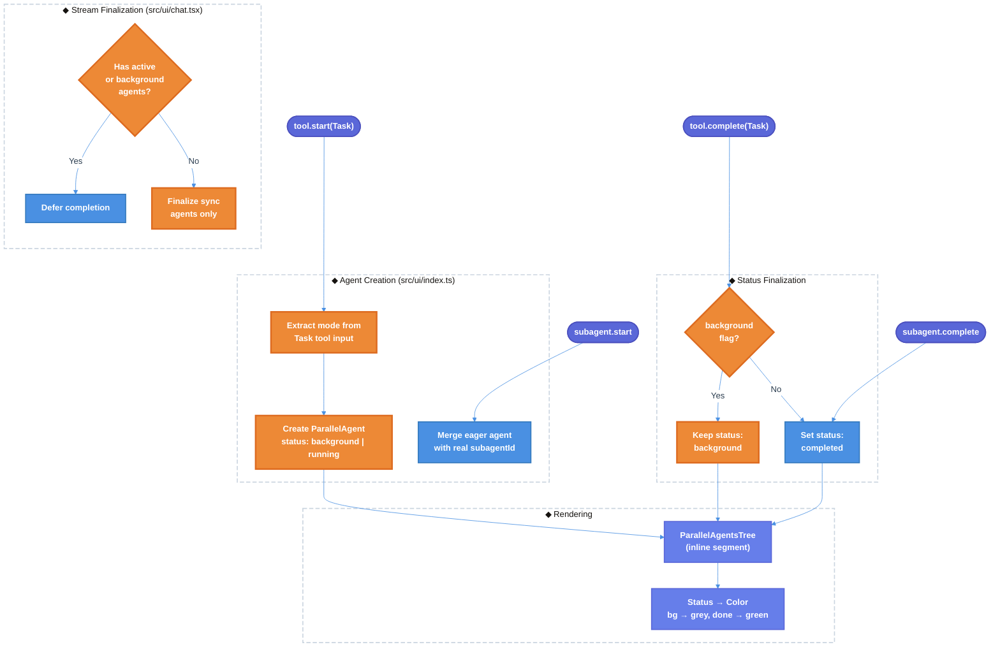

# Atomic TUI Sub-Agent Tree Inline State & Lifecycle Fix — Technical Design Document

| Document Metadata      | Details                  |
| ---------------------- | ------------------------ |
| Author(s)              | Developer                |
| Status                 | Draft (WIP)              |
| Team / Owner           | Atomic Team              |
| Created / Last Updated | 2026-02-16               |

## 1. Executive Summary

This RFC proposes fixing the sub-agent lifecycle state management in Atomic TUI so that background-mode Task agents are not prematurely marked as "completed" (green) when they have merely been **spawned**, not finished. The root cause is a **missing background-mode propagation path**: the `"background"` status exists in the type system and rendering layer (`AgentStatus` union, color mapping, sort ordering) but is **never assigned at runtime**. When `tool.complete` fires for a background Task, the handler unconditionally transitions the agent from `"running"` → `"completed"`, even though the agent is still working. Additionally, four stream-finalization paths in `chat.tsx` force-finalize all `"running"/"pending"` agents without checking for background mode. The fix is a ~20-line, two-file change: (1) extract the `mode` parameter at agent creation to set `status: "background"` and a `background: true` flag, and (2) guard all five finalization sites to skip background agents. This eliminates the misleading green "finished" indicator while background sub-agents are actively running.

**Primary Research**: [`research/docs/2026-02-16-sub-agent-tree-inline-state-lifecycle-research.md`](../research/docs/2026-02-16-sub-agent-tree-inline-state-lifecycle-research.md)

## 2. Context and Motivation

### 2.1 Current State

The Atomic TUI sub-agent system uses a multi-layer architecture:

**Event-Driven Lifecycle Layer** (`src/ui/index.ts`):
- `tool.start` eagerly creates a `ParallelAgent` with `status: "running"` when a Task tool is invoked (lines 517–541)
- `subagent.start` merges the eager entry with the real SDK sub-agent ID (lines 784–867)
- `tool.complete` finalizes status and propagates results via ID-based attribution (lines 649–664)
- `subagent.complete` sets terminal status (`completed`/`error`) based on `success` flag (lines 871–895)

**Inline Segment Rendering Layer** (`src/ui/chat.tsx`):
- `buildContentSegments` inserts `agents` segments by content offset (lines 1287–1482)
- `ParallelAgentsTree` is rendered inline within the chat stream, not as a pinned panel (lines 1687–1702)
- Live updates are anchored into the currently streaming message (lines 2626–2638)
- Four stream-finalization paths convert `running/pending` agents to `completed` on stream end

**Status Rendering Layer** (`src/ui/components/parallel-agents-tree.tsx`):
- `AgentStatus` type includes `"background"` (line 26)
- Color mapping: `completed` → green, `interrupted` → yellow, `error` → red, all others → grey/muted (lines 158–166)
- Header counts `"background"` agents as running for display purposes (lines 607–608)
- Sort order places `background` between `pending` and `completed` (lines 590–600)

**Unified SDK Contract** (`src/sdk/types.ts`):
- `SubagentStartEventData` and `SubagentCompleteEventData` define the cross-SDK event model (lines 388–413)
- All three SDKs (Claude, OpenCode, Copilot) normalize to the same event model
- Neither event interface includes a `mode` or `background` field

**Reference**: [`research/docs/2026-02-16-sub-agent-tree-inline-state-lifecycle-research.md`](../research/docs/2026-02-16-sub-agent-tree-inline-state-lifecycle-research.md) — Sections 1–4
**Reference**: [`research/docs/2026-02-15-sub-agent-tree-status-lifecycle-sdk-parity.md`](../research/docs/2026-02-15-sub-agent-tree-status-lifecycle-sdk-parity.md) — SDK normalization analysis
**Reference**: [`research/docs/2026-02-15-ui-inline-streaming-vs-pinned-elements.md`](../research/docs/2026-02-15-ui-inline-streaming-vs-pinned-elements.md) — Inline vs pinned rendering

### 2.2 The Problem

**Problem 1 — Premature Green "Completed" Status for Background Agents**:
When a Task tool is invoked with `mode: "background"`, the `tool.complete` event fires immediately after the background agent is **spawned** (not after it **finishes**). The handler at `src/ui/index.ts:658` unconditionally transitions `running/pending → completed`, causing the UI to show a green "finished" indicator within milliseconds of spawn — while the agent may run for 30+ seconds. Users see all agents marked "completed" when only the spawn acknowledgement was received.

**Problem 2 — `"background"` Status Is Typed But Never Assigned**:
The `AgentStatus` union type includes `"background"`, the color mapping renders it as muted/grey, the sort order positions it correctly, and the header counts it as running. However, **no runtime code path ever assigns this status**. The `mode` parameter from the Task tool input is extracted and displayed in the tool renderer (`src/ui/tools/registry.ts:693`) but is completely ignored by the state management layer.

**Problem 3 — Stream Finalization Force-Completes Background Agents**:
Four independent finalization paths in `src/ui/chat.tsx` check `a.status === "running" || a.status === "pending"` to determine if agents are still active. Since background agents remain in `"running"` status (Problem 2), they are either: (a) counted as active, blocking stream finalization until they finish (causing hangs for long background tasks), or (b) force-finalized to `"completed"` when the stream ends, producing the same premature green indicator.

**Problem 4 — Cleanup Helper Ignores Background Status**:
The `tryFinalizeParallelTracking` helper (`src/ui/index.ts:467–476`) only checks for `"running"` or `"pending"` agents. If background agents were properly assigned `"background"` status, they would not prevent cleanup — but they also wouldn't be properly tracked as active work.

**Reference**: [`research/docs/2026-02-15-subagent-premature-completion-investigation.md`](../research/docs/2026-02-15-subagent-premature-completion-investigation.md) — Root cause evidence trail
**Reference**: [`research/docs/2026-02-15-subagent-premature-completion-SUMMARY.md`](../research/docs/2026-02-15-subagent-premature-completion-SUMMARY.md) — Executive summary
**Reference**: [`research/docs/2026-02-15-subagent-event-flow-diagram.md`](../research/docs/2026-02-15-subagent-event-flow-diagram.md) — Event timeline diagrams

## 3. Goals and Non-Goals

### 3.1 Functional Goals

- [ ] Background-mode Task agents display `"background"` status (grey/muted) until `subagent.complete` fires with their actual result
- [ ] Sync-mode Task agents retain current behavior: `"completed"` (green) on `tool.complete`
- [ ] Stream finalization does not force-complete agents with `background: true` flag
- [ ] Interrupt (Ctrl+C / ESC) transitions background agents to `"interrupted"` (yellow) like all other agents
- [ ] Sub-agent spawn failure sets `"error"` (red) status regardless of mode
- [ ] Tree header shows "Running" (accent color) while any background agents are active
- [ ] `ParallelAgentsTree` inline rendering is preserved (no pinning)

### 3.2 Non-Goals (Out of Scope)

- [ ] We will NOT implement `read_agent` polling for background agent progress updates (tracked separately)
- [ ] We will NOT modify the unified SDK event contract (`SubagentStartEventData`) to include `mode` — the fix uses the Task tool input available at creation time
- [ ] We will NOT change the inline-vs-pinned rendering architecture
- [ ] We will NOT add a new visible UI element for background agents (existing muted/grey styling is sufficient)
- [ ] We will NOT refactor the four duplicate finalization paths into a shared function (code deduplication is a separate concern)

## 4. Proposed Solution (High-Level Design)

### 4.1 System Architecture Diagram



### 4.2 Architectural Pattern

We are applying a **Flag-Gated State Transition** pattern: a `background: boolean` flag is set once at agent creation time and then consulted at every state transition point to decide whether finalization should proceed. This avoids re-parsing tool input at completion time and is resilient to event ordering differences across SDKs.

### 4.3 Key Components

| Component | Change | File | Justification |
| --- | --- | --- | --- |
| Agent Creation | Extract `mode`, set `status: "background"` + `background: true` | `src/ui/index.ts:517-540` | Mode is available in tool input at creation time |
| Tool Completion Handler | Guard finalization with `a.background` check | `src/ui/index.ts:648-667` | Prevents premature completion on spawn acknowledgement |
| Agent-Only Finalization | Include `"background"` in active check, skip finalization for background agents | `src/ui/chat.tsx:2645-2680` | Prevents force-completion on agent-only stream end |
| SDK Stream Completion | Include `"background"` in active check and deferral, skip finalization for background agents | `src/ui/chat.tsx:3327-3341` | Prevents force-completion on normal stream end |
| Alt Stream Completion | Same guards as SDK stream completion | `src/ui/chat.tsx:4766-4780` | Prevents force-completion on alternate stream end |
| Cleanup Helper | Include `"background"` in active agent check | `src/ui/index.ts:467-470` | Prevents premature cleanup of tracking state |

## 5. Detailed Design

### 5.1 ParallelAgent Type Extension

The `ParallelAgent` interface (or inline type) needs a new optional `background` boolean flag:

```typescript
// Addition to ParallelAgent type
interface ParallelAgent {
  // ... existing fields ...
  background?: boolean;  // True if mode === "background" or "async"
}
```

### 5.2 Fix 1: Background-Aware Agent Creation

**File**: `src/ui/index.ts` — `tool.start` handler (lines 517–540)

**Current** (lines 529–538):
```typescript
const newAgent: ParallelAgent = {
  id: toolId,
  taskToolCallId: toolId,
  name: agentType,
  task: taskDesc,
  status: "running",                    // ❌ Always "running"
  startedAt: new Date().toISOString(),
  currentTool: `Starting ${agentType}…`,
};
```

**Proposed**:
```typescript
const mode = (input.mode as string) ?? "sync";
const isBackground = mode === "background" || mode === "async";

const newAgent: ParallelAgent = {
  id: toolId,
  taskToolCallId: toolId,
  name: agentType,
  task: taskDesc,
  status: isBackground ? "background" : "running",           // ✅
  background: isBackground,                                   // ✅
  startedAt: new Date().toISOString(),
  currentTool: isBackground
    ? `Running ${agentType} in background…`                   // ✅
    : `Starting ${agentType}…`,
};
```

**Rationale**: The `mode` field is already present in the Task tool input and is already extracted for display in the tool renderer (`src/ui/tools/registry.ts:693`). Reading it here is consistent and avoids any need to propagate mode through SDK events.

**Reference**: [`research/docs/2026-02-15-subagent-premature-completion-fix-comparison.md`](../research/docs/2026-02-15-subagent-premature-completion-fix-comparison.md) — Fix Location 1

### 5.3 Fix 2: Guarded Tool Completion

**File**: `src/ui/index.ts` — `tool.complete` handler (lines 648–667)

**Current** (lines 658–660):
```typescript
status: a.status === "running" || a.status === "pending"
  ? "completed" as const      // ❌ No background check
  : a.status,
```

**Proposed**:
```typescript
status: a.background
  ? a.status                   // ✅ Don't finalize background tasks
  : (a.status === "running" || a.status === "pending"
      ? "completed" as const
      : a.status),
currentTool: a.background
  ? a.currentTool              // ✅ Keep "running in background" text
  : (a.status === "running" || a.status === "pending"
      ? undefined
      : a.currentTool),
durationMs: a.background
  ? a.durationMs               // ✅ Don't set duration until actually done
  : (a.durationMs ?? (Date.now() - new Date(a.startedAt).getTime())),
```

**Rationale**: For background tasks, `tool.complete` fires when the agent is **spawned**, not when it finishes. The `background` flag prevents premature finalization while allowing result text to still be attached (the `result` field assignment remains unchanged).

**Reference**: [`research/docs/2026-02-15-subagent-premature-completion-investigation.md`](../research/docs/2026-02-15-subagent-premature-completion-investigation.md) — Primary bug location
**Reference**: [`research/docs/2026-02-15-subagent-event-flow-diagram.md`](../research/docs/2026-02-15-subagent-event-flow-diagram.md) — Event timing analysis

### 5.4 Fix 3: Stream Deferral and Finalization Guards

Four finalization paths in `src/ui/chat.tsx` must be updated with the same two changes:

1. **Active agent check**: Add `|| a.status === "background"` to include background agents
2. **Finalization map**: Skip agents where `a.background === true`

#### 5.4.1 Agent-Only Stream Finalization (lines 2645–2680)

**Active check** (lines 2645–2649):
```typescript
// Current
const hasActive = parallelAgents.some(
  (a) => a.status === "running" || a.status === "pending"
);

// Proposed
const hasActive = parallelAgents.some(
  (a) => a.status === "running" || a.status === "pending" || a.status === "background"
);
```

**Finalization map** (lines 2672–2680):
```typescript
// Current
const finalizedAgents = parallelAgents.map((a) =>
  a.status === "running" || a.status === "pending"
    ? { ...a, status: "completed" as const, currentTool: undefined, durationMs: ... }
    : a
);

// Proposed
const finalizedAgents = parallelAgents.map((a) => {
  if (a.background) return a;  // ✅ Skip background agents
  return a.status === "running" || a.status === "pending"
    ? { ...a, status: "completed" as const, currentTool: undefined, durationMs: ... }
    : a;
});
```

#### 5.4.2 SDK Stream Completion (lines 3327–3341)

Same pattern applied to active check (lines 3327–3329) and finalization map (lines 3336–3343).

#### 5.4.3 Alt Stream Completion (lines 4766–4780)

Same pattern applied to active check (lines 4766–4769) and finalization map (lines 4776–4781).

**Reference**: [`research/docs/2026-02-16-sub-agent-tree-inline-state-lifecycle-research.md`](../research/docs/2026-02-16-sub-agent-tree-inline-state-lifecycle-research.md) — Section 5, concrete change surfaces

### 5.5 Fix 4: Cleanup Helper Guard

**File**: `src/ui/index.ts` — `tryFinalizeParallelTracking` (lines 467–476)

**Current** (lines 468–470):
```typescript
const hasActiveAgents = state.parallelAgents.some(
  (a) => a.status === "running" || a.status === "pending"
);
```

**Proposed**:
```typescript
const hasActiveAgents = state.parallelAgents.some(
  (a) => a.status === "running" || a.status === "pending" || a.status === "background"
);
```

### 5.6 State Model

The complete lifecycle state machine after the fix:

```
Sync Task:
  tool.start     → "running" (grey)
  subagent.start → "running" (grey)  [merge IDs]
  tool.complete  → "completed" (green)
  subagent.complete → "completed" (green) [no-op if already completed]

Background Task:
  tool.start     → "background" (grey) + background=true
  subagent.start → "background" (grey)  [merge IDs, preserve status]
  tool.complete  → "background" (grey)  [SKIP finalization due to flag]
  subagent.complete → "completed" (green)  [actual completion]

Interrupt (any mode):
  Ctrl+C/ESC → "interrupted" (yellow)

Spawn Failure (any mode):
  subagent.complete(success=false) → "error" (red)
```

### 5.7 Event Timeline Comparison

**Before Fix (Background Task — Buggy)**:
```
0ms:     tool.start      → grey "running"    ⚪
5ms:     subagent.start  → grey "running"    ⚪
10ms:    tool.complete   → green "completed" 🟢  ← BUG: premature
...      [30 seconds of actual work]
30000ms: subagent.complete → green "completed" 🟢 (no visible change)
```

**After Fix (Background Task — Correct)**:
```
0ms:     tool.start      → grey "background" ⚪  ✅
5ms:     subagent.start  → grey "background" ⚪  ✅
10ms:    tool.complete   → grey "background" ⚪  ✅ (flag blocks finalization)
...      [30 seconds of actual work]
30000ms: subagent.complete → green "completed" 🟢  ✅ (real completion)
```

**Reference**: [`research/docs/2026-02-15-subagent-event-flow-diagram.md`](../research/docs/2026-02-15-subagent-event-flow-diagram.md) — Visual timeline diagrams

### 5.8 Data Flow After Fix

```
Task(mode="background") invoked
    │
    ├─ tool.start event
    │   └─ Extract mode="background" from input
    │   └─ Create ParallelAgent { status: "background", background: true }
    │   └─ Push to state.parallelAgents, notify handler
    │
    ├─ subagent.start event
    │   └─ Merge eager agent with real subagentId
    │   └─ Preserve status: "background" (no overwrite)
    │
    ├─ tool.complete event
    │   └─ Check: agent.background === true?
    │   │   YES → Keep status as-is, attach result text only
    │   │   NO  → Transition running/pending → completed (existing behavior)
    │
    ├─ [Agent does actual work for N seconds...]
    │
    ├─ Stream finalization check
    │   └─ hasActive includes "background" status → defer if background agents exist
    │   └─ Finalization map skips agents with background: true
    │
    └─ subagent.complete event
        └─ success=true → status: "completed" (green)
        └─ success=false → status: "error" (red)
```

## 6. Alternatives Considered

| Option | Pros | Cons | Reason for Rejection |
| --- | --- | --- | --- |
| **A: Check `mode` in tool.complete by re-parsing `toolInput`** | No type changes needed | `toolInput` may not be available at completion time; fragile | Requires carrying `toolInput` reference through async flow |
| **B: Store `background` flag on agent creation (Selected)** | Reliable, available at all transition points, simple boolean check | Requires adding a field to agent type | **Selected**: Flag is set once, checked everywhere — most robust |
| **C: Never finalize in tool.complete, rely solely on subagent.complete** | Simplest change | Breaks fast sync tasks where `subagent.complete` may not fire (eager-only path) | Would regress sync task display for some SDKs |
| **D: Implement read_agent polling for background status** | Most accurate tracking | High complexity, requires new polling loop, network calls | Over-engineered for the current bug; can be added later |
| **E: Add `mode` field to SubagentStartEventData** | Clean SDK contract | Requires changes to all 3 SDK clients + types; mode info already available at creation | Unnecessary SDK contract changes when tool input suffices |

**Reference**: [`research/docs/2026-02-15-subagent-premature-completion-fix-comparison.md`](../research/docs/2026-02-15-subagent-premature-completion-fix-comparison.md) — Fix option analysis

## 7. Cross-Cutting Concerns

### 7.1 SDK Parity

All three SDK backends (Claude, OpenCode, Copilot) normalize to the same unified event model (`subagent.start`, `subagent.complete`). Because the fix is applied at the UI event handler layer (`src/ui/index.ts`, `src/ui/chat.tsx`) which processes normalized events, the fix applies equally to all SDKs without per-SDK changes.

**Reference**: [`research/docs/2026-02-15-sub-agent-tree-status-lifecycle-sdk-parity.md`](../research/docs/2026-02-15-sub-agent-tree-status-lifecycle-sdk-parity.md) — SDK normalization mapping

### 7.2 Backward Compatibility

- Sync-mode Task agents (the default, `mode: "sync"` or no `mode` specified) retain exactly the same behavior.
- The `background` field on `ParallelAgent` is optional (`background?: boolean`), so existing agents without the field are unaffected.
- No API contract changes are required.

### 7.3 Rendering Correctness

The `ParallelAgentsTree` component already handles the `"background"` status correctly:
- Color: muted/grey (same as `pending`/`running`) — lines 158–166
- Icon: dedicated `STATUS.background` icon — line 88
- Sort order: between `pending` and `completed` — lines 590–600
- Header: counts background agents as running — lines 607–608

No changes are needed in the rendering layer. The fix is purely in the state management layer.

### 7.4 Performance

The fix adds one boolean field check per agent per finalization event. This is negligible — O(n) where n is the number of parallel agents (typically 1–10).

### 7.5 Inline Rendering Preservation

The sub-agent tree remains inline within the chat stream (segment-based rendering). This fix does not alter the rendering architecture. The pinned `TaskListPanel` path used by Ralph sessions is unaffected.

**Reference**: [`research/docs/2026-02-15-ui-inline-streaming-vs-pinned-elements.md`](../research/docs/2026-02-15-ui-inline-streaming-vs-pinned-elements.md) — Inline vs pinned analysis

## 8. Migration, Rollout, and Testing

### 8.1 Deployment Strategy

- [ ] Phase 1: Apply the fix to all five finalization sites
- [ ] Phase 2: Manual verification with each SDK backend (Claude, OpenCode, Copilot) using a background Task agent
- [ ] Phase 3: Verify sync-mode agents are unaffected (regression check)

### 8.2 Test Plan

**Unit Tests:**

- [ ] **Background agent creation**: Verify that `tool.start` with `mode: "background"` creates an agent with `status: "background"` and `background: true`
- [ ] **Background agent creation (async)**: Verify that `tool.start` with `mode: "async"` also creates a background agent
- [ ] **Sync agent creation**: Verify that `tool.start` with `mode: "sync"` or no mode creates an agent with `status: "running"` and `background: undefined`
- [ ] **Tool completion skip**: Verify that `tool.complete` does not change status of agents with `background: true`
- [ ] **Tool completion proceed**: Verify that `tool.complete` transitions `running → completed` for sync agents
- [ ] **Subagent completion for background**: Verify that `subagent.complete` transitions `background → completed` for background agents
- [ ] **Interrupt handling**: Verify that interrupt transitions background agents to `interrupted`
- [ ] **Error handling**: Verify that `subagent.complete(success=false)` transitions background agents to `error`

**Integration Tests:**

- [ ] **Full background lifecycle**: Spawn background Task → verify grey → wait for subagent.complete → verify green
- [ ] **Mixed sync + background**: Spawn sync and background tasks together → verify sync goes green immediately, background stays grey
- [ ] **Stream finalization**: Verify stream does not finalize while background agents are active

**E2E Tests:**

- [ ] **Visual verification**: Launch Atomic TUI, trigger a background Task agent, observe grey status during execution, green only on completion
- [ ] **Ctrl+C interrupt**: Launch background agent, interrupt with Ctrl+C, verify yellow interrupted status

## 9. Open Questions / Unresolved Issues

- [ ] Should `subagent.complete` always fire reliably for background agents across all three SDKs, or do some SDKs silently drop the event? If so, a timeout-based fallback may be needed.
- [ ] What is the canonical terminal event for background-mode Task agents — `subagent.complete`, `read_agent` result, or another signal? Current fix relies on `subagent.complete`.
- [ ] Should the `SubagentStartEventData` SDK contract be extended with a `mode` field for future use, even though it's not strictly needed for this fix?
- [ ] Should `tryFinalizeParallelTracking` treat background agents as active for deferral, or should background agents be cleaned up separately on their own `subagent.complete`?
- [ ] Should the four duplicate finalization paths in `chat.tsx` be refactored into a shared helper function as part of this fix, or should that be tracked separately?

## 10. Code References

### Files to Modify

| File | Lines | Change Description |
| --- | --- | --- |
| `src/ui/index.ts` | 517–540 | Extract `mode`, set `background` status and flag on agent creation |
| `src/ui/index.ts` | 648–667 | Guard tool.complete finalization with `a.background` check |
| `src/ui/index.ts` | 467–470 | Include `"background"` in cleanup helper active check |
| `src/ui/chat.tsx` | 2645–2649 | Include `"background"` in agent-only stream active check |
| `src/ui/chat.tsx` | 2672–2680 | Skip finalization for `background: true` agents |
| `src/ui/chat.tsx` | 3327–3332 | Include `"background"` in SDK stream deferral check |
| `src/ui/chat.tsx` | 3335–3341 | Skip finalization for `background: true` agents |
| `src/ui/chat.tsx` | 4766–4771 | Include `"background"` in alt stream deferral check |
| `src/ui/chat.tsx` | 4774–4780 | Skip finalization for `background: true` agents |

### Files Read-Only (No Changes Needed)

| File | Lines | Relevance |
| --- | --- | --- |
| `src/ui/components/parallel-agents-tree.tsx` | 26, 85–92, 158–166, 590–600, 607–610 | Already handles `"background"` status correctly |
| `src/ui/tools/registry.ts` | 685–697 | Already extracts and displays `mode` for Task tools |
| `src/sdk/types.ts` | 388–413 | Unified event contract (no changes needed) |
| `src/sdk/claude-client.ts` | 112–121 | Claude event mapping (no changes needed) |
| `src/sdk/opencode-client.ts` | 654–669 | OpenCode event mapping (no changes needed) |
| `src/sdk/copilot-client.ts` | 132–146 | Copilot event mapping (no changes needed) |

### Research References

| Document | Relevance |
| --- | --- |
| [`research/docs/2026-02-16-sub-agent-tree-inline-state-lifecycle-research.md`](../research/docs/2026-02-16-sub-agent-tree-inline-state-lifecycle-research.md) | Primary research — inline rendering, lifecycle transitions, concrete change surfaces |
| [`research/docs/2026-02-15-subagent-premature-completion-investigation.md`](../research/docs/2026-02-15-subagent-premature-completion-investigation.md) | Root cause analysis with evidence trail |
| [`research/docs/2026-02-15-subagent-premature-completion-SUMMARY.md`](../research/docs/2026-02-15-subagent-premature-completion-SUMMARY.md) | Executive summary of investigation |
| [`research/docs/2026-02-15-subagent-premature-completion-fix-comparison.md`](../research/docs/2026-02-15-subagent-premature-completion-fix-comparison.md) | Side-by-side code fix comparison |
| [`research/docs/2026-02-15-subagent-premature-completion-quick-ref.md`](../research/docs/2026-02-15-subagent-premature-completion-quick-ref.md) | Quick reference card |
| [`research/docs/2026-02-15-subagent-event-flow-diagram.md`](../research/docs/2026-02-15-subagent-event-flow-diagram.md) | Event timeline diagrams |
| [`research/docs/2026-02-15-sub-agent-tree-status-lifecycle-sdk-parity.md`](../research/docs/2026-02-15-sub-agent-tree-status-lifecycle-sdk-parity.md) | SDK parity and status lifecycle |
| [`research/docs/2026-02-15-ui-inline-streaming-vs-pinned-elements.md`](../research/docs/2026-02-15-ui-inline-streaming-vs-pinned-elements.md) | Inline vs pinned rendering analysis |
| [`research/docs/2026-02-14-subagent-output-propagation-issue.md`](../research/docs/2026-02-14-subagent-output-propagation-issue.md) | Prior rendering/lifecycle observations |
