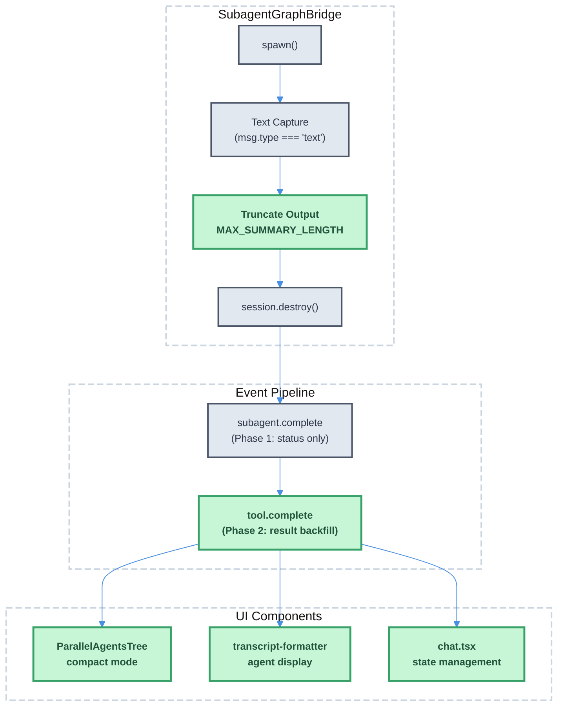

# Atomic TUI Sub-Agent Output Propagation Fix — Technical Design Document

| Document Metadata      | Details        |
| ---------------------- | -------------- |
| Author(s)              | Developer      |
| Status                 | Draft (WIP)    |
| Team / Owner           | Atomic Team    |
| Created / Last Updated | 2026-02-14     |

## 1. Executive Summary

This RFC proposes fixing the sub-agent output propagation pipeline in Atomic TUI so that completed sub-agent results are visible in the `ParallelAgentsTree` component and transcript view, instead of displaying only "Done." The root cause is a **three-layer failure**: (1) compact mode rendering ignores `agent.result`, (2) the `SubagentGraphBridge` truncates output to 2000 characters and discards non-text content, and (3) the agent tree stays pinned after completion due to deferred finalization timing. The fix involves rendering truncated result summaries in compact mode, increasing output capture fidelity in the bridge, displaying results in transcript view, and resolving the race condition in live-to-baked agent state transitions. These changes improve developer experience by surfacing actionable sub-agent output inline without requiring users to expand collapsed tool cards.

**Reference**: `research/docs/2026-02-14-subagent-output-propagation-issue.md`

## 2. Context and Motivation

### 2.1 Current State

The Atomic TUI orchestrates sub-agents through a multi-layer pipeline:

**Execution Layer** (`src/graph/subagent-bridge.ts`):
- `SubagentGraphBridge.spawn()` creates independent sub-agent sessions
- Streams responses, capturing only `msg.type === "text"` messages
- Truncates output to 2000 characters (`MAX_SUMMARY_LENGTH`)
- Destroys sessions immediately after result extraction

**Event Normalization Layer** (`src/sdk/types.ts`, `src/sdk/*-client.ts`):
- SDK-agnostic events: `subagent.start`, `subagent.complete`
- Two-phase result population: Phase 1 (`subagent.complete`) sets status; Phase 2 (`tool.complete`) backfills `agent.result`
- Event normalization is working correctly across all three SDKs

**UI Layer** (`src/ui/components/parallel-agents-tree.tsx`, `src/ui/chat.tsx`):
- `ParallelAgentsTree` always rendered with `compact={true}` (hardcoded at `chat.tsx:1529,1550`)
- Compact mode shows `getSubStatusText()` → `"Done"` for completed agents
- `agent.result` field exists in memory but is **never rendered** in compact mode
- Full mode code exists (lines 455-559) but is unreachable

**Reference**: `research/docs/2026-02-14-subagent-output-propagation-issue.md:23-31`
**Reference**: `research/docs/2026-02-12-sdk-ui-standardization-comprehensive.md` (event normalization layer)
**Reference**: `research/docs/2026-02-05-subagent-ui-opentui-independent-context.md` (ParallelAgentsTree component)

### 2.2 The Problem

**Problem 1 — "Done" Instead of Results**:
Users see only "Done" under each agent in the tree after execution completes. The actual result text exists in `agent.result` but `getSubStatusText()` returns hardcoded `"Done"` (line 181) and compact mode never references the field. Evidence: `tmux-screenshots/subagent.png` shows 5 agents completed with only "Done" visible.

**Problem 2 — Data Loss in Bridge**:
`SubagentGraphBridge` captures only text messages (discarding tool results, thinking blocks) and truncates to 2000 characters. Sessions are destroyed at line 172, permanently losing full conversation history.

**Problem 3 — Pinned Agent Tree**:
The agent tree stays visually pinned after all agents complete. The `pendingCompleteRef` deferred completion mechanism creates a render window (T1→T7) where live agents override baked agents, blocking subsequent messages from streaming.

**Problem 4 — Result Attribution Race Condition**:
Phase 2 result backfill uses a "last completed agent without result" heuristic (reverse search), not ID-based correlation. Simultaneous completions can attribute results to the wrong agent.

**Reference**: `research/docs/2026-02-14-subagent-output-propagation-issue.md:36-75` (Problem 1)
**Reference**: `research/docs/2026-02-14-subagent-output-propagation-issue.md:86-148` (Problem 2)
**Reference**: `research/docs/2026-02-14-subagent-output-propagation-issue.md:360-523` (Problem 3)

## 3. Goals and Non-Goals

### 3.1 Functional Goals

- [ ] Display truncated `agent.result` (≤60 chars) under each completed agent in `ParallelAgentsTree` compact mode
- [ ] Display `agent.result` in transcript view (`transcript-formatter.ts`) instead of hardcoded "Done"
- [ ] Fix result attribution to use ID-based correlation between `tool.complete` events and agents
- [ ] Resolve live-to-baked agent state transition to eliminate render window where stale live agents override finalized baked agents
- [ ] Increase `MAX_SUMMARY_LENGTH` to capture more useful output from sub-agents

### 3.2 Non-Goals (Out of Scope)

- [ ] We will NOT register built-in agents with SDK-native sub-agent APIs in this iteration (tracked separately per `research/docs/2026-02-12-sub-agent-sdk-integration-analysis.md`)
- [ ] We will NOT add a full/compact mode toggle to the UI (compact is the correct default; result display is added to compact mode)
- [ ] We will NOT preserve full session history or tool results in the bridge (only increase text summary length)
- [ ] We will NOT change the `SubagentGraphBridge.spawn()` session lifecycle (session destruction remains)
- [ ] We will NOT replace the `50ms setTimeout` delays with microtask scheduling

## 4. Proposed Solution (High-Level Design)

### 4.1 System Architecture Diagram

The fix targets three layers — changes shown in green:



### 4.2 Architectural Pattern

Incremental fixes within the existing architecture — no pattern changes. The two-phase result population pipeline is preserved; fixes target the rendering gaps and data fidelity issues.

### 4.3 Key Components

| Component | Change | File | Justification |
| --- | --- | --- | --- |
| `getSubStatusText()` | Show truncated `agent.result` for completed agents | `parallel-agents-tree.tsx:172-189` | Primary fix — surfaces result text |
| Compact mode renderer | Add result line below completed agent row | `parallel-agents-tree.tsx:364-453` | Visual display of result in tree |
| Transcript formatter | Replace hardcoded "Done" with `agent.result` | `transcript-formatter.ts:189-190` | Parity with tree display |
| Tool complete handler | ID-based result attribution | `index.ts:523-549` | Eliminates race condition |
| Live→baked transition | Atomic state update | `chat.tsx:1420-1422, pendingCompleteRef` | Eliminates render window |
| `MAX_SUMMARY_LENGTH` | Increase from 2000 to 4000 | `subagent-bridge.ts:66` | More useful output captured |

## 5. Detailed Design

### 5.1 Fix 1: Display Result in Compact Mode (`parallel-agents-tree.tsx`)

#### 5.1.1 Update `getSubStatusText()`

**Current** (lines 172-189):
```typescript
case "completed":
  return "Done";
```

**Proposed**:
```typescript
case "completed":
  return agent.result ? truncateText(agent.result, 60) : "Done";
```

This provides a one-line summary of the result. If `agent.result` is not yet populated (Phase 2 hasn't fired), falls back to "Done."

#### 5.1.2 Add Result Display to Compact Renderer

**Current** (lines 437-443): Shows only sub-status text.

**Proposed**: After the sub-status line for completed agents, add a result line with success color styling (matching full mode behavior at lines 528-536):

```typescript
{isCompleted && agent.result && (
  <box flexDirection="row">
    <text style={{ fg: themeColors.success }}>
      {CONNECTOR.subStatus}  {truncateText(agent.result, 60)}
    </text>
  </box>
)}
```

This mirrors the existing full mode code but is added to the compact path.

### 5.2 Fix 2: Display Result in Transcript View (`transcript-formatter.ts`)

**Current** (lines 189-190):
```typescript
if (agent.status === "completed") {
  lines.push(line("agent-substatus",
    `${TREE.vertical} ${CONNECTOR.subStatus}  Done${metrics ? ` (${metricsParts.join(" · ")})` : ""}`));
}
```

**Proposed**:
```typescript
if (agent.status === "completed") {
  const resultText = agent.result ? truncateText(agent.result, 60) : "Done";
  lines.push(line("agent-substatus",
    `${TREE.vertical} ${CONNECTOR.subStatus}  ${resultText}${metrics ? ` (${metricsParts.join(" · ")})` : ""}`));
}
```

### 5.3 Fix 3: ID-Based Result Attribution (`index.ts`)

**Current** (lines 541-546): Finds the **last** completed agent without a result using `.reverse().find()`:
```typescript
const agentToUpdate = [...state.parallelAgents]
  .reverse()
  .find((a) => a.status === "completed" && !a.result);
```

**Problem**: No correlation between `tool.complete` event and specific agent ID. When multiple agents complete simultaneously, results may be attributed to the wrong agent.

**Proposed**: Correlate using `toolCallId` from the `tool.complete` event. The `subagent.start` event provides `subagentId` which maps to the `toolCallId` used to invoke the Task tool. Track this mapping:

```typescript
// In subagent.start handler (line 615-645):
// Store mapping: toolCallId → agentId
state.toolCallToAgentMap.set(data.toolCallId, data.subagentId);

// In tool.complete handler (line 523-549):
if (data.toolName === "Task" || data.toolName === "task") {
  const agentId = state.toolCallToAgentMap.get(data.toolCallId);
  if (agentId) {
    state.parallelAgents = state.parallelAgents.map((a) =>
      a.id === agentId ? { ...a, result: resultStr } : a
    );
    state.toolCallToAgentMap.delete(data.toolCallId);
  } else {
    // Fallback to current heuristic for backward compatibility
    const agentToUpdate = [...state.parallelAgents]
      .reverse()
      .find((a) => a.status === "completed" && !a.result);
    // ...
  }
}
```

**Note**: The `toolCallId` availability depends on the SDK:
- **Claude**: Available via `parent_tool_use_id` in `SubagentStart` hook
- **Copilot**: Available via `event.data.toolCallId` in `subagent.started`
- **OpenCode**: Available via `part.id` in `AgentPart`

Verify each SDK client emits `toolCallId` in the `subagent.start` event data before implementing. If not available uniformly, add it to the event emission in each SDK client.

### 5.4 Fix 4: Atomic Live-to-Baked State Transition (`chat.tsx`)

#### 5.4.1 The Render Window Problem

**Current** (lines 1420-1422):
```typescript
const agentsToShow = parallelAgents?.length ? parallelAgents
  : message.parallelAgents?.length ? message.parallelAgents
  : null;
```

Between `setMessages()` (T1) and `setParallelAgents([])` (T2), React may render with the stale live `parallelAgents` overriding the baked `message.parallelAgents`.

**Proposed**: Use a single state update via `setParallelAgents` callback that atomically bakes agents into the message and clears the live state:

```typescript
setParallelAgents((currentAgents) => {
  // Bake into message in the same React batch
  setMessages((prev) =>
    prev.map((msg) =>
      msg.id === streamingMessageIdRef.current
        ? { ...msg, parallelAgents: currentAgents, streaming: false }
        : msg
    )
  );
  return []; // Clear live state atomically
});
```

This eliminates the render window by ensuring both operations happen within the same React state batch.

#### 5.4.2 Deferred Completion Cleanup

The `pendingCompleteRef` mechanism (lines 3074-3080) correctly defers finalization until all agents complete. However, the stored `handleComplete` function should perform the atomic transition described above. Review the existing logic at lines 4523-4557 to ensure the bake + clear happens in a single update.

### 5.5 Fix 5: Increase Summary Length (`subagent-bridge.ts`)

**Current** (line 66):
```typescript
const MAX_SUMMARY_LENGTH = 2000;
```

**Proposed**:
```typescript
const MAX_SUMMARY_LENGTH = 4000;
```

Rationale: 2000 characters often truncates mid-sentence for agents performing code analysis. 4000 provides ~2x headroom while remaining lightweight. Full message history preservation is a non-goal for this iteration.

### 5.6 State Model

The `ParallelAgent` type already includes `result?: string`. No schema changes are needed.

**New state addition**: `toolCallToAgentMap: Map<string, string>` on the UI event handler state object (`src/ui/index.ts`). This maps `toolCallId` → `agentId` for ID-based result attribution.

### 5.7 Data Flow After Fix

```
1. Sub-agent session spawned
   └─ SubagentGraphBridge.spawn()

2. Text messages collected (unchanged)
   └─ MAX_SUMMARY_LENGTH = 4000 (increased from 2000)

3. Session destroyed (unchanged)

4. SDK emits subagent.start
   └─ Store toolCallId → agentId mapping ← NEW

5. SDK emits subagent.complete
   └─ Sets status: "completed"
   └─ agent.result usually empty (unchanged)

6. SDK emits tool.complete for Task tool
   └─ Look up agentId via toolCallId ← NEW (ID-based)
   └─ Fallback to reverse heuristic if no mapping
   └─ Populate agent.result with parsed output

7. ParallelAgentsTree renders (compact mode)
   └─ getSubStatusText() returns truncated agent.result ← NEW
   └─ Shows result line in tree ← NEW

8. Transcript view renders
   └─ Shows truncated agent.result instead of "Done" ← NEW

9. Message finalization
   └─ Atomic bake + clear via single setState ← NEW
   └─ No render window between live and baked state
```

## 6. Alternatives Considered

| Option | Pros | Cons | Reason for Rejection |
| --- | --- | --- | --- |
| **A: Toggle compact/full mode** | Full mode already renders results; minimal code change | Adds UI toggle complexity; full mode shows too much for default view | Users want concise output by default, not a toggle |
| **B: Remove compact mode entirely** | Simplifies rendering code | Full mode shows verbose output for every agent; clutters tree | Compact is correct UX for agent trees with many agents |
| **C: Show results in compact (Selected)** | Minimal change; preserves compact layout; adds missing info | Need to handle truncation carefully | **Selected**: Best balance of information density and UX |
| **D: Preserve full session history** | No data loss; enables replay | Large memory footprint; session lifecycle changes | Out of scope; most value comes from better text summaries |
| **E: Register agents with SDK-native APIs** | Proper integration; enables SDK-level features | Large architectural change; varies per SDK | Separate workstream per `research/docs/2026-02-12-sub-agent-sdk-integration-analysis.md` |

## 7. Cross-Cutting Concerns

### 7.1 Performance

- **Truncation**: `truncateText(agent.result, 60)` is O(1) — no performance concern
- **Map lookup**: `toolCallToAgentMap.get()` is O(1) — replaces O(n) reverse search
- **State batching**: Atomic setState eliminates one React render cycle during finalization

### 7.2 Backward Compatibility

- `getSubStatusText()` falls back to "Done" when `agent.result` is empty
- Tool complete handler falls back to reverse heuristic when `toolCallId` mapping is unavailable
- No changes to event types or `ParallelAgent` interface

### 7.3 Observability

- The existing `durationMs` and `toolUses` metrics continue to display alongside results
- Consider logging when fallback heuristic is used (indicates SDK event gap)

## 8. Migration, Rollout, and Testing

### 8.1 Deployment Strategy

No feature flags needed — these are bug fixes to existing functionality. Deploy directly.

### 8.2 Test Plan

- **Unit Tests**:
  - `getSubStatusText()` returns truncated result when `agent.result` is populated
  - `getSubStatusText()` returns "Done" when `agent.result` is empty/undefined
  - Transcript formatter renders result text for completed agents
  - Tool complete handler correctly attributes results via `toolCallId`
  - Tool complete handler falls back to reverse heuristic when mapping is missing

- **Integration Tests**:
  - Spawn 3+ parallel sub-agents; verify each agent's result is correctly attributed
  - Verify agent tree renders result text after all agents complete
  - Verify message finalization clears live agents atomically (no flash of stale state)

- **E2E Tests**:
  - Run `/research-codebase` or `@codebase-analyzer` and verify result text appears in tree
  - Toggle transcript view (ctrl+o) and verify result text appears instead of "Done"
  - Verify subsequent messages stream normally after agent tree finalizes

## 9. Open Questions / Unresolved Issues

- [ ] Is `toolCallId` consistently available in `subagent.start` event data across all three SDKs? If not, which SDKs need event emission updates?
- [ ] Should the result truncation length in compact mode (60 chars) be configurable or is a fixed value sufficient?
- [ ] Should `getSubStatusText()` show the first line of multi-line results, or use the existing `truncateText()` behavior (which may cut mid-word)?
- [ ] Should the `SubagentGraphBridge` also capture the **last** tool result (not just text messages) to improve summary quality for tool-heavy agents?
- [ ] Does the atomic `setParallelAgents` + `setMessages` batch reliably produce a single React render in OpenTUI's reconciler, or does OpenTUI process setState calls independently?

## 10. Code References

### Files to Modify

| File | Lines | Change |
| --- | --- | --- |
| `src/ui/components/parallel-agents-tree.tsx` | 172-189, 437-443 | Show result in `getSubStatusText()` and compact renderer |
| `src/ui/utils/transcript-formatter.ts` | 189-190 | Replace "Done" with result text |
| `src/ui/index.ts` | 523-549, 615-645 | ID-based result attribution + toolCallId mapping |
| `src/ui/chat.tsx` | 1420-1422, 3074-3080 | Atomic live-to-baked state transition |
| `src/graph/subagent-bridge.ts` | 66 | Increase `MAX_SUMMARY_LENGTH` to 4000 |

### Research References

| Document | Relevance |
| --- | --- |
| `research/docs/2026-02-14-subagent-output-propagation-issue.md` | Primary research — root cause analysis |
| `research/docs/2026-02-12-sub-agent-sdk-integration-analysis.md` | SDK registration gap (out of scope, future work) |
| `research/docs/2026-02-05-subagent-ui-opentui-independent-context.md` | ParallelAgentsTree component internals |
| `research/docs/2026-02-12-tui-layout-streaming-content-ordering.md` | Content segmentation and tree positioning |
| `research/docs/2026-02-12-sdk-ui-standardization-comprehensive.md` | Event normalization layer |
| `research/docs/2026-02-14-opencode-opentui-sdk-research.md` | OpenCode TaskTool result format |
