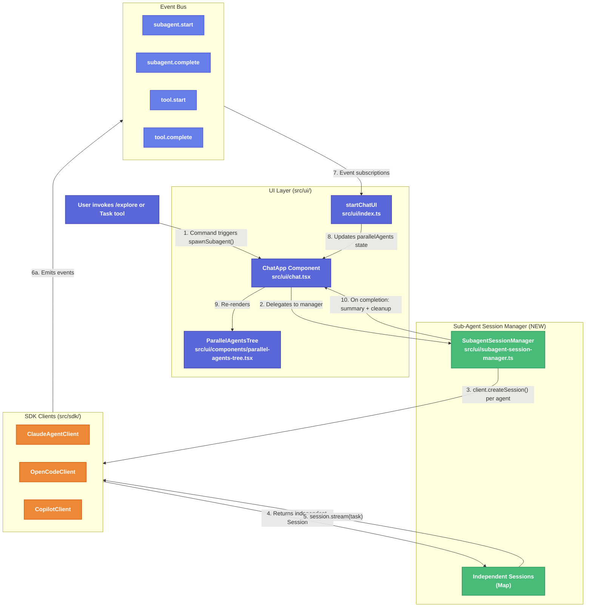

# Sub-Agent UI with Independent Context Windows

| Document Metadata      | Details                                                                        |
| ---------------------- | ------------------------------------------------------------------------------ |
| Author(s)              | Developer                                                                      |
| Status                 | Draft (WIP)                                                                    |
| Team / Owner           | Atomic TUI                                                                     |
| Created / Last Updated | 2026-02-05                                                                     |

## 1. Executive Summary

The Atomic TUI has a placeholder sub-agent system that routes all sub-agent work through the parent conversation context and uses fixed timeouts to fake completion. This spec proposes replacing it with a real implementation that (1) spawns independent SDK sessions per sub-agent with isolated context windows, (2) wires SDK lifecycle events (`subagent.start`/`subagent.complete`) to the `ParallelAgentsTree` UI component, and (3) enables true parallel execution. The `ParallelAgentsTree` component already renders correctly -- the gap is entirely in the backend wiring and session management. This change unblocks real multi-agent workflows for all three SDK backends (Claude Agent SDK, OpenCode SDK, Copilot SDK).

> **Primary Research**: [research/docs/2026-02-05-subagent-ui-opentui-independent-context.md](../research/docs/2026-02-05-subagent-ui-opentui-independent-context.md)

## 2. Context and Motivation

### 2.1 Current State

The sub-agent pipeline currently follows this path (ref: [research doc, Architecture Documentation](../research/docs/2026-02-05-subagent-ui-opentui-independent-context.md#current-agent-architecture)):

```
User invokes agent command → context.spawnSubagent()
                                     ↓
                          ParallelAgent added to state (UI renders)
                                     ↓
                          Task sent through SAME conversation context
                                     ↓
                          500ms timeout → mark "completed"
                                     ↓
                          3500ms timeout → remove from display
```

**Key files involved:**
- `src/ui/chat.tsx:1477-1549` -- `spawnSubagent` placeholder implementation
- `src/ui/components/parallel-agents-tree.tsx` -- UI component (functional)
- `src/ui/index.ts:274-378` -- Event subscriptions (missing `subagent.start`/`subagent.complete`)
- `src/sdk/types.ts:237-340` -- Event types defined but unwired
- `src/graph/nodes.ts:163-263` -- `agentNode()` factory with real session creation (separate code path)

**What works:**
- `ParallelAgentsTree` renders tree connector lines, status dots, tool counters, and agent states correctly
- `ParallelAgent` interface has all needed fields (`id`, `name`, `task`, `status`, `toolUses`, `currentTool`, etc.)
- SDK event types (`SubagentStartEventData`, `SubagentCompleteEventData`) are fully defined
- Claude client maps `"subagent.start"` → `"SubagentStart"` hook and `"subagent.complete"` → `"SubagentStop"` hook (`src/sdk/claude-client.ts:111-112`)
- Copilot client maps the equivalent events (`src/sdk/copilot-client.ts:130-132,479-495`)
- Graph engine's `agentNode()` already creates independent sessions via `client.createSession()` and destroys them in a `finally` block

### 2.2 The Problem

- **No independent context**: Sub-agents share the parent conversation, polluting context and preventing parallel work
- **Fake completion**: 500ms fixed timeout bears no relation to actual task completion
- **No real parallelism**: `GraphExecutor` runs with `maxConcurrency: 1` (`src/graph/types.ts:640`); `spawnSubagent` sends through the single message stream
- **Event wiring gap**: `SubagentStart`/`SubagentComplete` events are defined in the SDK types but `startChatUI` (`src/ui/index.ts`) does not subscribe to them -- the `registerParallelAgentHandler` prop is defined on `ChatAppProps` but never connected from `startChatUI`
- **UI shows fake data**: Tool use counts stay at 0, status goes "Initializing..." → "Done" on a timer, not on real agent lifecycle events

## 3. Goals and Non-Goals

### 3.1 Functional Goals

- [ ] **G1**: `spawnSubagent()` creates an independent SDK session per sub-agent (isolated context window)
- [ ] **G2**: Multiple sub-agents execute concurrently (true parallel, not sequential queue)
- [ ] **G3**: Sub-agent lifecycle events (`subagent.start`, `subagent.complete`) are wired from SDK clients through `startChatUI` to the `ParallelAgentsTree` component
- [ ] **G4**: `ParallelAgentsTree` displays live status updates: real tool use counts, actual "Initializing..."/"Running"/"Done" transitions, elapsed time, and error states
- [ ] **G5**: Sub-agent results are collected and returned to the parent context as a summary string (not the full transcript)
- [ ] **G6**: `ctrl+o` expand/collapse toggles between compact tree view and expanded detail view
- [ ] **G7**: Works with all three SDK backends (Claude Agent SDK, OpenCode SDK, Copilot SDK) with per-SDK session creation strategies

### 3.2 Non-Goals (Out of Scope)

- [ ] **NG1**: OpenTUI migration -- The existing Ink/OpenTUI React components are sufficient; no framework rewrite
- [ ] **NG2**: Sub-agent expand into full chat view -- Expanding a sub-agent into its own interactive chat pane is future work
- [ ] **NG3**: Sub-agent resume/re-attach -- Resuming a previously completed sub-agent session
- [ ] **NG4**: Graph engine parallelism changes -- Modifying `GraphExecutor` or `maxConcurrency` config; sub-agents are spawned outside the graph engine
- [ ] **NG5**: Recursive sub-agents -- Sub-agents spawning their own sub-agents
- [ ] **NG6**: UI redesign of `ParallelAgentsTree` -- The existing component matches the target UI; only data flow changes

## 4. Proposed Solution (High-Level Design)

### 4.1 System Architecture



### 4.2 Architectural Pattern

**Session-per-Agent with Event-Driven UI Updates**

Each sub-agent gets its own SDK session via `client.createSession()`, matching the pattern already used by `agentNode()` in `src/graph/nodes.ts:204`. The sessions run concurrently via `Promise.all()` (or `Promise.allSettled()` for error tolerance). SDK events flow through the existing event system to update the `ParallelAgentsTree` component in real time.

### 4.3 Key Components

| Component | Responsibility | Location | Status |
| --- | --- | --- | --- |
| `SubagentSessionManager` | Creates, tracks, and cleans up independent sub-agent sessions | `src/ui/subagent-session-manager.ts` (NEW) | To build |
| `ParallelAgentsTree` | Renders agent tree with live status | `src/ui/components/parallel-agents-tree.tsx` | Exists (minor updates) |
| `ChatApp.spawnSubagent()` | Entry point for sub-agent creation | `src/ui/chat.tsx:1477-1549` | Rewrite |
| `startChatUI` event wiring | Subscribes to `subagent.start`/`subagent.complete` events | `src/ui/index.ts` | Wire missing events |
| SDK clients | Emit sub-agent lifecycle events | `src/sdk/claude-client.ts`, `copilot-client.ts`, `opencode-client.ts` | Verify event emission |

## 5. Detailed Design

### 5.1 SubagentSessionManager

A new class that encapsulates sub-agent lifecycle management, extracted from `spawnSubagent()` in `chat.tsx`.

**File**: `src/ui/subagent-session-manager.ts`

```typescript
interface SubagentSpawnOptions {
  agentId: string;
  agentName: string;        // e.g., "Explore", "Plan", "debugger"
  task: string;             // Task description
  systemPrompt?: string;    // Optional system prompt override
  model?: string;           // Optional model override
  tools?: string[];         // Optional tool restrictions
}

interface SubagentResult {
  agentId: string;
  success: boolean;
  output: string;           // Summary text returned to parent
  error?: string;
  toolUses: number;
  durationMs: number;
}

type SubagentStatusCallback = (agentId: string, update: Partial<ParallelAgent>) => void;

class SubagentSessionManager {
  private sessions: Map<string, Session>;
  private client: CodingAgentClient;
  private onStatusUpdate: SubagentStatusCallback;

  constructor(client: CodingAgentClient, onStatusUpdate: SubagentStatusCallback);

  /** Spawn a single sub-agent with an independent session */
  async spawn(options: SubagentSpawnOptions): Promise<SubagentResult>;

  /** Spawn multiple sub-agents concurrently */
  async spawnParallel(agents: SubagentSpawnOptions[]): Promise<SubagentResult[]>;

  /** Cancel a running sub-agent */
  async cancel(agentId: string): Promise<void>;

  /** Cancel all running sub-agents */
  async cancelAll(): Promise<void>;

  /** Get count of active sessions */
  get activeCount(): number;

  /** Destroy manager and all sessions */
  async destroy(): Promise<void>;
}
```

**Internal flow of `spawn()`:**

1. Create session: `const session = await this.client.createSession({ systemPrompt, model, tools })`
2. Store in `this.sessions.set(agentId, session)`
3. Emit status update: `onStatusUpdate(agentId, { status: "running", startedAt: new Date().toISOString() })`
4. Stream response: `for await (const msg of session.stream(task)) { ... }`
   - On each `tool_use` message: increment `toolUses`, update `currentTool`
   - On each `text` message: accumulate for final summary
5. On completion: `onStatusUpdate(agentId, { status: "completed", durationMs, toolUses, result: summary })`
6. In `finally`: `await session.destroy(); this.sessions.delete(agentId)`

**`spawnParallel()` implementation:**

```typescript
async spawnParallel(agents: SubagentSpawnOptions[]): Promise<SubagentResult[]> {
  const results = await Promise.allSettled(
    agents.map(agent => this.spawn(agent))
  );
  return results.map((r, i) =>
    r.status === "fulfilled"
      ? r.value
      : { agentId: agents[i].agentId, success: false, output: "", error: r.reason?.message, toolUses: 0, durationMs: 0 }
  );
}
```

### 5.2 Rewrite of `spawnSubagent()` in `chat.tsx`

**Current** (`src/ui/chat.tsx:1477-1549`): Placeholder with `sendMessageRef.current(taskMessage)` and `setTimeout`.

**Proposed**: Delegate to `SubagentSessionManager`.

```typescript
spawnSubagent: async (options) => {
  const agentId = crypto.randomUUID().slice(0, 8);
  const agentName = options.agentType ?? options.model ?? "general-purpose";

  // Add agent to UI immediately
  const parallelAgent: ParallelAgent = {
    id: agentId,
    name: agentName,
    task: options.message.slice(0, 100) + (options.message.length > 100 ? "..." : ""),
    status: "running",
    startedAt: new Date().toISOString(),
    model: options.model,
    toolUses: 0,
  };
  setParallelAgents(prev => [...prev, parallelAgent]);

  // Spawn independent session via manager
  const result = await subagentManager.spawn({
    agentId,
    agentName,
    task: options.message,
    systemPrompt: options.systemPrompt,
    model: options.model,
  });

  // Remove from tree after display period
  setTimeout(() => {
    setParallelAgents(prev => prev.filter(a => a.id !== agentId));
  }, 5000);

  return {
    success: result.success,
    output: result.output,
    error: result.error,
  };
},
```

The `subagentManager` instance is created once during `ChatApp` initialization, stored in a ref:

```typescript
const subagentManagerRef = useRef<SubagentSessionManager | null>(null);

// Initialize on first session
useEffect(() => {
  if (getSession && !subagentManagerRef.current) {
    // Manager needs the client, which is available via startChatUI closure
    // Pass it through a new prop or use the session factory pattern
  }
}, [getSession]);
```

### 5.3 Event Wiring in `startChatUI`

**File**: `src/ui/index.ts`

The `subscribeToToolEvents()` function (lines 274-378) already subscribes to `tool.start`, `tool.complete`, `permission.requested`, and `human_input_required`. Add subscriptions for `subagent.start` and `subagent.complete`:

```typescript
// Subscribe to subagent.start events
const unsubSubagentStart = client.on("subagent.start", (event) => {
  const data = event.data as SubagentStartEventData;
  if (state.parallelAgentHandler && data.subagentId) {
    state.parallelAgentHandler(prev => prev.map(a =>
      a.id === data.subagentId
        ? { ...a, status: "running" as const }
        : a
    ));
  }
});

// Subscribe to subagent.complete events
const unsubSubagentComplete = client.on("subagent.complete", (event) => {
  const data = event.data as SubagentCompleteEventData;
  if (state.parallelAgentHandler && data.subagentId) {
    state.parallelAgentHandler(prev => prev.map(a =>
      a.id === data.subagentId
        ? {
            ...a,
            status: data.success ? "completed" as const : "error" as const,
            error: data.success ? undefined : String(data.result ?? "Unknown error"),
          }
        : a
    ));
  }
});
```

Additionally, `ChatUIState` needs a new field:

```typescript
interface ChatUIState {
  // ... existing fields
  /** Registered handler for parallel agent state updates */
  parallelAgentHandler: ((updater: (prev: ParallelAgent[]) => ParallelAgent[]) => void) | null;
}
```

And `registerParallelAgentHandler` must be connected in the `state.root.render()` call, passing it through to `ChatApp`.

### 5.4 Per-SDK Session Creation Strategy

Each SDK backend creates independent sessions differently. The `SubagentSessionManager.spawn()` uses the unified `CodingAgentClient.createSession()` interface, which already abstracts this (ref: [research doc, SDK Independent Context Comparison](../research/docs/2026-02-05-subagent-ui-opentui-independent-context.md#sdk-independent-context-comparison)):

| SDK | How `createSession()` achieves isolation | Notes |
| --- | --- | --- |
| **Claude Agent SDK** | `AgentDefinition` with `query()` gives automatic context isolation; V2 `unstable_v2_createSession()` creates explicit session objects | Use V1 `agents` option for stability; V2 as optional upgrade path |
| **OpenCode SDK** | `Session.create()` with unique session IDs; `Session.fork()` for parent-child | Each `createSession()` call naturally creates a new session |
| **Copilot SDK** | `CopilotSession` with unique `SessionID` per session | SDK does NOT support independent sub-agent context natively; workaround: create multiple independent `CopilotSession` objects at the application level |

**Copilot workaround**: Since the Copilot SDK does not support independent sub-agent context windows (ref: [research doc, Section 6](../research/docs/2026-02-05-subagent-ui-opentui-independent-context.md#6-independent-context-per-sub-agent-copilot-sdk)), the `CopilotClient.createSession()` implementation must create a completely new session (not a sub-agent within the existing session). This is already the case in the current `CodingAgentClient` interface -- each `createSession()` call returns a new `Session` object.

### 5.5 ParallelAgentsTree Updates

The existing component is functionally correct for the target UI. Minor updates needed:

1. **Sub-status text**: Currently shows `currentTool` on the sub-line. The target UI shows "Initializing..." during `running` status and "Done" during `completed` status. Add this as a default when `currentTool` is absent:

   ```typescript
   // In AgentRow compact mode, after the main row:
   const subStatusText = agent.currentTool
     ?? (agent.status === "running" ? "Initializing..." : undefined)
     ?? (agent.status === "completed" ? "Done" : undefined);
   ```

2. **Status dot colors**: Align with target UI screenshots:
   - Running: yellow/amber dot (`#fbbf24`) -- currently uses `themeColors.accent`
   - Completed: red/pink dot (`#f87171`) -- target UI uses red, not green

3. **Header text**: Target shows `"● Running 3 Explore agents... (ctrl+o to expand)"` (running) and `"● 4 Explore agents finished (ctrl+o to expand)"` (completed). Current text says "completed" instead of "finished" -- update to match target.

### 5.6 ctrl+o Expand/Collapse

Currently the `(ctrl+o to expand)` hint is rendered but has no behavior. Add:

**In `ChatApp`:**

```typescript
const [agentTreeExpanded, setAgentTreeExpanded] = useState(false);

// In useKeyboard handler:
if (key.ctrl && key.name === "o") {
  setAgentTreeExpanded(prev => !prev);
}
```

**Pass to `ParallelAgentsTree`:**

```tsx
<ParallelAgentsTree
  agents={parallelAgents}
  compact={!agentTreeExpanded}
  maxVisible={agentTreeExpanded ? 20 : 5}
/>
```

### 5.7 Client Access Pattern

The `spawnSubagent()` function in `chat.tsx` currently has access to `getSession()` but not to the `CodingAgentClient` itself. The `SubagentSessionManager` needs the client to call `createSession()`.

**Proposed approach**: Add a `client` prop to `ChatAppProps` (or pass it via a `createSubagentSession` factory function prop):

```typescript
// Option A: Pass client directly
interface ChatAppProps {
  // ... existing props
  /** Client for creating independent sub-agent sessions */
  client?: CodingAgentClient;
}

// Option B: Pass a session factory (more decoupled)
interface ChatAppProps {
  // ... existing props
  /** Factory to create independent sessions for sub-agents */
  createSubagentSession?: (config?: SessionConfig) => Promise<Session>;
}
```

**Recommendation**: Option B (session factory) is preferred because it maintains encapsulation -- `ChatApp` doesn't need to know about the full `CodingAgentClient` interface. The factory is wired in `startChatUI`:

```typescript
const createSubagentSession = async (config?: SessionConfig) => {
  return client.createSession(config);
};
```

### 5.8 Data Flow Summary

```
1. User types "/explore" or agent invokes Task tool
     ↓
2. ChatApp.handleCommand() → command.execute() → context.spawnSubagent()
     ↓
3. spawnSubagent() adds ParallelAgent to state (UI renders immediately)
     ↓
4. SubagentSessionManager.spawn() calls client.createSession()
     ↓
5. Independent session created → session.stream(task) begins
     ↓
6. During streaming:
   a. tool_use messages → increment toolUses, update currentTool
   b. text messages → accumulate for summary
   c. Status callbacks → setParallelAgents() updates → ParallelAgentsTree re-renders
     ↓
7. Stream completes → mark status "completed" with result summary
     ↓
8. session.destroy() called in finally block
     ↓
9. After display period → remove from parallelAgents state
```

## 6. Alternatives Considered

| Option | Pros | Cons | Reason for Rejection |
| --- | --- | --- | --- |
| **A: Graph engine parallelism** (increase `maxConcurrency`, route sub-agents through `GraphExecutor`) | Reuses existing `agentNode()` / session management; built-in retry and checkpointing | Requires graph compilation for simple parallel tasks; `GraphExecutor` processes parallel branches sequentially via node queue (`src/graph/compiled.ts:454-457`); overkill for ad-hoc sub-agent spawning | Graph engine designed for DAG workflows, not dynamic sub-agent spawning; sequential queue processing defeats purpose |
| **B: Shared session with conversation branching** (fork the parent session instead of creating new ones) | Lower latency (no session setup); shares context for context-aware sub-tasks | Only OpenCode SDK supports `Session.fork()`; Claude V1 doesn't support forking; Copilot doesn't support it at all; pollutes parent context if not properly isolated | Insufficient SDK support across all three backends |
| **C: Independent sessions via `SubagentSessionManager`** (Selected) | Works with all three SDKs via existing `createSession()` interface; true context isolation; matches `agentNode()` proven pattern | Slightly higher latency per sub-agent (session creation overhead); no shared context between sub-agents | **Selected**: Universal SDK compatibility, proven pattern in codebase, clean isolation |

## 7. Cross-Cutting Concerns

### 7.1 Security and Privacy

- **Session isolation**: Each sub-agent session has its own context window. No cross-session data leakage.
- **Tool restrictions**: Sub-agents should use a restricted tool set (passed via `SessionConfig.tools`). Default sub-agent tools should NOT include destructive operations unless explicitly allowed by the parent command.
- **Credential handling**: Sessions inherit the parent's authentication context (API keys, tokens). No additional credential management needed.

### 7.2 Resource Management

- **Session cleanup**: Every `session.destroy()` call must be in a `finally` block, matching the pattern in `src/graph/nodes.ts:257-259`.
- **Concurrency limits**: Add a configurable `maxConcurrentSubagents` (default: 5) to prevent resource exhaustion. Queue excess spawn requests.
- **Memory**: Each independent session consumes memory for its context window. With 5 concurrent sub-agents on Claude (200k context each), worst case is ~1M tokens in flight.

### 7.3 Error Handling

- **Session creation failure**: If `createSession()` fails, mark the agent as `"error"` status immediately and continue with remaining agents.
- **Streaming failure**: If `session.stream()` throws mid-stream, catch the error, mark agent as `"error"`, and include the error message.
- **Partial failure in parallel**: Use `Promise.allSettled()` so one agent's failure doesn't cancel others.
- **Client unavailable**: If no client is available (e.g., `getSession` returns null), return an error result immediately.

### 7.4 Observability

- **Logging**: Log sub-agent lifecycle events (start, complete, error) with agent ID and duration.
- **Metrics**: Track `subagent_spawn_count`, `subagent_duration_ms`, `subagent_error_count` per agent type.
- **Tool use tracking**: Tool use counts are tracked per sub-agent and displayed in the tree UI.

## 8. Migration, Rollout, and Testing

### 8.1 Implementation Phases

- [ ] **Phase 1: SubagentSessionManager** -- Create `src/ui/subagent-session-manager.ts` with `spawn()`, `spawnParallel()`, `cancel()`, `destroy()`.
- [ ] **Phase 2: Event Wiring** -- Add `subagent.start` and `subagent.complete` subscriptions in `startChatUI`'s `subscribeToToolEvents()`. Connect `registerParallelAgentHandler` prop.
- [ ] **Phase 3: spawnSubagent Rewrite** -- Replace placeholder in `chat.tsx` with `SubagentSessionManager` integration. Add `createSubagentSession` prop.
- [ ] **Phase 4: ParallelAgentsTree Updates** -- Add default sub-status text ("Initializing..."/"Done"), fix status dot colors to match target UI, update "completed" → "finished" header text.
- [ ] **Phase 5: ctrl+o Toggle** -- Wire `useKeyboard` for ctrl+o to toggle `compact`/expanded mode.
- [ ] **Phase 6: Integration Testing** -- E2E tests with all three SDK backends (Claude, OpenCode, Copilot) to verify independent context and parallel execution.

### 8.2 Test Plan

- **Unit Tests** (`src/ui/__tests__/subagent-session-manager.test.ts`):
  - `spawn()` creates a session via `client.createSession()`, streams, and destroys
  - `spawn()` calls `onStatusUpdate` with correct status transitions
  - `spawn()` handles session creation failures gracefully
  - `spawnParallel()` runs multiple agents concurrently
  - `spawnParallel()` with `Promise.allSettled` handles partial failures
  - `cancel()` destroys the session and marks agent as error
  - `destroy()` cleans up all active sessions

- **Unit Tests** (`src/ui/__tests__/parallel-agents-tree.test.ts`):
  - Default sub-status text renders "Initializing..." for running agents
  - Default sub-status text renders "Done" for completed agents
  - Header text uses "finished" not "completed"
  - Status dot uses correct colors (amber for running, red for completed)

- **Integration Tests**:
  - Event wiring: `subagent.start` event updates `ParallelAgent` status in `ChatApp`
  - Event wiring: `subagent.complete` event updates `ParallelAgent` status in `ChatApp`
  - Full flow: command invocation → sub-agent spawn → session creation → streaming → completion → UI update → cleanup

- **E2E Tests** (manual, per `CLAUDE.md` E2E guidelines):
  - `/explore` command spawns parallel agents visible in tree
  - Agents show real tool use counts during execution
  - Agents transition from "Initializing..." to "Done" on actual completion
  - ctrl+o toggles between compact and expanded views
  - Tested with `bun run ~/Documents/projects/atomic/src/cli.ts chat -a claude` (and `-a opencode`, `-a copilot`)

## 9. Open Questions / Unresolved Issues

- [ ] **Q1: Client access in ChatApp** -- Should `ChatApp` receive the `CodingAgentClient` directly or a `createSubagentSession` factory? (Recommendation: factory for decoupling -- see Section 5.7)
- [ ] **Q2: Sub-agent result handling** -- Should sub-agent results be injected back into the parent conversation as assistant messages, or only returned to the command that spawned them? (Current: returned to command. Alternative: appended as collapsed tool results in chat.)
- [ ] **Q3: Copilot SDK isolation** -- The Copilot SDK does not support independent sub-agent context (ref: [research doc, Section 6](../research/docs/2026-02-05-subagent-ui-opentui-independent-context.md#6-independent-context-per-sub-agent-copilot-sdk)). Creating multiple independent `CopilotSession` objects is the workaround, but does the CLI server support multiple concurrent sessions? Needs verification.
- [ ] **Q4: V2 SDK readiness** -- Claude Agent SDK V2 `unstable_v2_createSession` is marked as unstable preview. Should we target V1 `agents` option for initial implementation and add V2 support later? (Recommendation: yes, V1 first.)
- [ ] **Q5: maxConcurrentSubagents default** -- Is 5 the right default? Should it be configurable via CLI flag or settings file?
- [ ] **Q6: Sub-agent display timeout** -- Currently hardcoded at 5s after completion. Should completed agents persist in the tree until explicitly dismissed or until the next user message?
