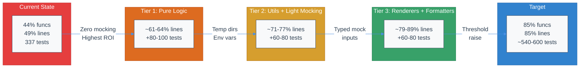

# Test Coverage Audit & 85% Coverage Plan

| Document Metadata      | Details                 |
| ---------------------- | ----------------------- |
| Author(s)              | Developer               |
| Status                 | Draft (WIP)             |
| Team / Owner           | Atomic CLI              |
| Created / Last Updated | 2026-02-15 / 2026-02-15 |

> **Research basis:** [`research/docs/2026-02-15-test-coverage-audit-and-85-percent-plan.md`](../research/docs/2026-02-15-test-coverage-audit-and-85-percent-plan.md)

## 1. Executive Summary

The Atomic CLI currently has **18 test files** with **337 passing tests** yielding **44.48% function coverage** and **48.71% line coverage**. The `bunfig.toml` thresholds are set at 48% lines / 44% functions. This spec proposes a tiered plan to reach **85% line and function coverage** by writing ~200-260 new tests across 20+ source modules, improving existing tests with anti-pattern fixes, and progressively raising `bunfig.toml` thresholds at each tier milestone. The plan prioritizes pure-logic modules (zero mocking) first, then utilities requiring light mocking, then renderer/formatter logic — reaching 85% without needing to test interactive CLI flows or live SDK integrations.

> **Related specs:**
> - [`specs/testing-infrastructure-and-dev-setup.md`](./testing-infrastructure-and-dev-setup.md) — Established the testing infrastructure (bunfig.toml, Lefthook, CI gates, DEV_SETUP.md)
> - [`specs/bun-test-failures-remediation.md`](./bun-test-failures-remediation.md) — Remediated 104 stale test failures

## 2. Context and Motivation

### 2.1 Current State

- **Test framework:** Bun built-in test runner (`bun test`), zero external test dependencies
- **Test files:** 18 colocated `*.test.ts` files with 337 tests / 822 assertions, all passing
- **Coverage:** 44.48% functions / 48.71% lines across ~46 measured source files
- **CI:** Tests enabled in `.github/workflows/ci.yml` with coverage upload to Codecov
- **Pre-commit hooks:** Lefthook configured (typecheck + lint + test on commit, coverage on push)
- **Configuration:** `bunfig.toml` with coverage thresholds, reporters, and 10s timeout
- **Excluded files:** `src/cli.ts`, `src/version.ts` (entry points, not unit-testable)

**Files at or near 100% coverage (already done):**
- `src/graph/types.ts`, `src/sdk/tools/schema-utils.ts`, `src/ui/utils/format.ts`, `src/ui/commands/registry.ts`, `src/config/copilot-manual.ts`

**Files with good coverage (>80%):**
- `src/graph/compiled.ts` (89%/93%), `src/graph/builder.ts` (81%/86%), `src/ui/components/task-order.ts` (100%/99%)

> **Source:** [`research/docs/2026-02-15-test-coverage-audit-and-85-percent-plan.md` § Current Coverage Baseline](../research/docs/2026-02-15-test-coverage-audit-and-85-percent-plan.md)

### 2.2 The Problem

- **Coverage gap:** 85% - 48.71% = **36.29 percentage points** of uncovered lines need to be tested. Roughly 70% of currently uncovered lines must be covered.
- **Uneven quality:** Existing tests range from excellent (graph engine, data structures) to fair (21 substring-matching assertions in `builtin-commands.test.ts`, 7 private-state-access patterns in `model-operations.test.ts`). Quality issues inflate test count without improving confidence.
- **25+ untested modules:** Many contain pure, deterministic logic with zero I/O dependencies — the highest-ROI targets for new tests.
- **Anti-patterns erode trust:** Substring matching on UI messages, private state injection via `as any`, and trivial type assertions create brittle tests that break on cosmetic changes while missing real regressions.

> **Source:** [`research/docs/2026-02-15-test-coverage-audit-and-85-percent-plan.md` § Test Quality Audit](../research/docs/2026-02-15-test-coverage-audit-and-85-percent-plan.md)

## 3. Goals and Non-Goals

### 3.1 Functional Goals

- [ ] Reach **85% line coverage** and **85% function coverage** as measured by `bun test --coverage`
- [ ] Write new tests for all Tier 1 modules (pure logic, zero mocking) — ~80-100 tests
- [ ] Write new tests for all Tier 2 modules (utilities + light mocking) — ~60-80 tests
- [ ] Write new tests for all Tier 3 modules (renderers + formatters) — ~60-80 tests
- [ ] Fix anti-patterns in 5 existing test files (detailed in §5.6)
- [ ] Progressively raise `bunfig.toml` thresholds at each tier completion: 65% → 75% → 85%
- [ ] All new tests follow established patterns: `beforeEach` isolation, factory helpers, structured assertions, DI for I/O

### 3.2 Non-Goals (Out of Scope)

- [ ] We will NOT test Tier 4 I/O-heavy modules (interactive CLI flows, live SDK connections, React components) in this phase
- [ ] We will NOT add external test dependencies (jest, vitest, sinon, etc.)
- [ ] We will NOT refactor source code for testability — tests must work with current module structure (exception: extracting pure helpers from `opencode-client.ts` if needed)
- [ ] We will NOT pursue 100% coverage — 85% is the target, with the remaining 15% being legitimately hard-to-test I/O and interactive code
- [ ] We will NOT add E2E or integration tests requiring running servers
- [ ] We will NOT modify CI pipeline beyond updating coverage thresholds

## 4. Proposed Solution (High-Level Design)

### 4.1 Coverage Growth Strategy

The plan follows a tiered approach, ordered by ROI (tests per coverage-point gained):



### 4.2 Architectural Pattern

**Colocated test files** — each `*.test.ts` lives adjacent to its source module. This is the established pattern in the codebase and will be continued.

**Testing philosophy** (from [`research/docs/2026-02-14-testing-infrastructure-and-dev-setup.md`](../research/docs/2026-02-14-testing-infrastructure-and-dev-setup.md)):
- Test real behavior, not trivial properties
- Assert on structured return values, not message strings
- Use dependency injection for I/O, not `as any` private state access
- Use `beforeEach` for test isolation
- Use factory helpers for clean test data

### 4.3 Key Components

| Component | Responsibility | Est. Tests | Coverage Gain |
| --------- | -------------- | ---------- | ------------- |
| Tier 1: Pure Logic | Test pure transform/guard functions with zero mocking | 80-100 | +12-15% |
| Tier 2: Utils + Light Mocking | Test utility modules with temp dirs and env vars | 60-80 | +10-13% |
| Tier 3: Renderers + Formatters | Test render() methods and transcript formatting | 60-80 | +8-12% |
| Anti-Pattern Fixes | Improve 5 existing test files | ~0 net new | Quality improvement |
| Threshold Ratchet | Progressive bunfig.toml updates | N/A | Prevents regression |

## 5. Detailed Design

### 5.1 Tier 1: Pure Logic Tests (Zero Mocking)

> **Source:** [`research/docs/2026-02-15-test-coverage-audit-and-85-percent-plan.md` § Tier 1](../research/docs/2026-02-15-test-coverage-audit-and-85-percent-plan.md)

#### 5.1.1 `src/models/model-transform.ts` → `src/models/model-transform.test.ts`

**Current coverage:** 0% functions / 7.89% lines

**Functions to test:**
- `fromClaudeModelInfo` — transforms Claude SDK model info to internal format
- `fromCopilotModelInfo` — transforms Copilot SDK model info to internal format
- `fromOpenCodeModel` — transforms OpenCode model to internal format
- `fromOpenCodeProvider` — transforms OpenCode provider to internal format

**Test strategy:** Construct typed input objects matching each SDK's model shape. Assert on output field mapping, array-vs-object `supports` handling, error throws for invalid input, field renaming correctness.

**Estimated tests:** 15-20 (4 functions × 4-5 cases each: happy path, edge cases, error cases, optional fields)

#### 5.1.2 `src/telemetry/graph-integration.ts` → `src/telemetry/graph-integration.test.ts`

**Current coverage:** 0% functions / 8.42% lines

**Functions to test:**
- `clampSampleRate` — clamps float to [0, 1]
- `shouldSample` — probabilistic sampling decision
- `safeEmit` — error-swallowing event emitter
- `trackWorkflowExecution` — tracker factory
- All tracker methods (noop vs active behavior)

**Test strategy:** Zero external imports in this module — fully self-contained. Test boundary values for clamp, deterministic seed for sampling, error swallowing in safeEmit, noop tracker returns.

**Estimated tests:** 15-20

#### 5.1.3 `src/graph/annotation.ts` (gaps) → extend `src/graph/annotation.test.ts`

**Current coverage:** 64% functions / 56.82% lines (existing tests cover reducers only)

**Functions to add tests for:**
- `createAtomicState` — factory for initial atomic state
- `updateAtomicState` — partial state merge
- `isFeature` — type guard
- `isAtomicWorkflowState` — type guard
- `createRalphState` — factory for Ralph workflow state
- `updateRalphState` — partial state merge
- `isRalphWorkflowState` — type guard

**Test strategy:** All 7 functions are pure and deterministic. Test factory output shapes, partial merge semantics (new fields added, existing fields overwritten, missing fields preserved), type guard true/false branches.

**Estimated tests:** 15-20

#### 5.1.4 `src/sdk/types.ts` → `src/sdk/types.test.ts`

**Current coverage:** 0% functions / 25% lines (module is 95% type definitions)

**Functions to test:**
- `stripProviderPrefix` — removes provider prefix from model ID string
- `formatModelDisplayName` — formats model ID for UI display

**Test strategy:** Pure string transformations. Test with/without prefix, empty strings, edge cases.

**Estimated tests:** 8-10

#### 5.1.5 `src/telemetry/telemetry-upload.ts` → `src/telemetry/telemetry-upload.test.ts`

**Current coverage:** 0% functions / 6.59% lines

**Functions to test:**
- `filterStaleEvents` — filters events older than a timestamp threshold
- `splitIntoBatches` — chunks an array into fixed-size batches

**Test strategy:** Pure functions. Test empty arrays, single-element arrays, exact batch-size boundaries, all-stale/no-stale filtering, mixed timestamps.

**Estimated tests:** 10-12

#### 5.1.6 `src/telemetry/telemetry.ts` → `src/telemetry/telemetry.test.ts`

**Current coverage:** 0% functions / 10.32% lines

**Functions to test:**
- `shouldRotateId` — determines if telemetry ID should rotate based on month/year boundary

**Test strategy:** Pure date comparison. Test same-month (no rotate), different-month (rotate), year boundary, null/undefined last-rotation.

**Estimated tests:** 5-6

### 5.2 Tier 2: Utilities + Light Mocking

> **Source:** [`research/docs/2026-02-15-test-coverage-audit-and-85-percent-plan.md` § Tier 2](../research/docs/2026-02-15-test-coverage-audit-and-85-percent-plan.md)

#### 5.2.1 `src/utils/markdown.ts` → extend coverage in `src/utils/markdown.test.ts` (or create new)

**Current coverage:** 100% functions / 66.23% lines (uncovered branches in `parseMarkdownFrontmatter`)

**Uncovered branches to test:**
- Array values in frontmatter
- Object/nested values in frontmatter
- Boolean coercion (`true`/`false` strings)
- Numeric coercion
- Comment lines (lines starting with `#` inside frontmatter)
- Edge cases: empty frontmatter, no closing `---`, whitespace-only values

**Test strategy:** Pure function, construct markdown strings with various frontmatter shapes. Already partially tested — fill gaps.

**Estimated tests:** 10-12

#### 5.2.2 `src/utils/copy.ts` → `src/utils/copy.test.ts`

**Current coverage:** 20% functions / 9.09% lines

**Functions to test:**
- `normalizePath` (pure) — path normalization logic
- `isPathSafe` (pure) — validates path doesn't escape root
- `shouldExclude` (pure) — glob-based exclusion check
- `isFileEmpty` (needs temp file) — checks if file is empty/whitespace
- `copyDir` (needs temp dirs) — recursive directory copy with exclusions

**Test strategy:** Pure functions first (no mocking). Filesystem functions use temp directories with `mkdtemp` + try/finally cleanup (pattern from [`src/commands/init.test.ts`](../src/commands/init.test.ts)).

**Estimated tests:** 15-20

#### 5.2.3 `src/utils/detect.ts` → extend `src/utils/detect.test.ts`

**Current coverage:** 41.67% functions / 35.29% lines (5 of 12 exported functions tested)

**Functions to add tests for:**
- `supportsColor` — testable via `process.env.TERM` / `process.env.NO_COLOR` manipulation
- `supportsTrueColor` — testable via `process.env.COLORTERM`
- `supports256Color` — testable via `process.env.TERM`
- `isCommandInstalled` — depends on `Bun.which`, may need `spyOn`
- `getCommandPath` — depends on `Bun.which`
- `getCommandVersion` — depends on subprocess execution
- `getShellType` — depends on `process.env.SHELL`

**Test strategy:** Color functions are testable by saving/restoring `process.env` values in `beforeEach`/`afterEach`. Command functions may need `spyOn(Bun, "which")`.

**Estimated tests:** 12-15

#### 5.2.4 `src/utils/merge.ts` → `src/utils/merge.test.ts`

**Current coverage:** 0% functions / 4.17% lines

**Functions to test:**
- `mergeJsonFile` — reads JSON file, deep-merges with provided object, writes back

**Test strategy:** Use temp directory with JSON fixture files. Test: merge into existing file, create new file, nested object merge semantics, array handling.

**Estimated tests:** 6-8

#### 5.2.5 `src/utils/settings.ts` → `src/utils/settings.test.ts`

**Current coverage:** 50% functions / 52.63% lines

**Functions to add tests for:**
- `getModelPreference` — priority resolution (local > global)
- `saveModelPreference` — merge-on-save to settings file
- `getReasoningEffortPreference` — settings lookup
- `saveReasoningEffortPreference` — settings persistence
- `clearReasoningEffortPreference` — settings deletion

**Test strategy:** Temp directories for isolated settings files. Test priority resolution order, merge behavior on save, missing file handling.

**Estimated tests:** 10-12

#### 5.2.6 `src/utils/atomic-config.ts` → `src/utils/atomic-config.test.ts`

**Current coverage:** 0% functions / 14.29% lines

**Functions to test:**
- `readAtomicConfig` — JSON read with fallback defaults
- `saveAtomicConfig` — JSON write with merge semantics
- `getSelectedScm` — reads SCM selection from config

**Test strategy:** Temp directory for config file isolation. Test: read missing file (defaults), read valid file, save creates file, save merges into existing, SCM selection lookup.

**Estimated tests:** 8-10

#### 5.2.7 `src/sdk/init.ts` → `src/sdk/init.test.ts`

**Current coverage:** 0% functions / 11.76% lines

**Functions to test:**
- `initClaudeOptions` — returns static config object for Claude SDK
- `initOpenCodeConfigOverrides` — returns config overrides for OpenCode
- `initCopilotSessionOptions` — returns session options for Copilot

**Test strategy:** Factory functions returning static objects. Assert on required fields, expected shapes, environment-dependent values.

**Estimated tests:** 6-8

### 5.3 Tier 3: Renderer Logic + Event Processing

> **Source:** [`research/docs/2026-02-15-test-coverage-audit-and-85-percent-plan.md` § Tier 3](../research/docs/2026-02-15-test-coverage-audit-and-85-percent-plan.md)

#### 5.3.1 `src/ui/tools/registry.ts` (render methods) → extend `src/ui/tools/registry.test.ts`

**Current coverage:** 40.74% functions / 32.32% lines (lookup/parsing tested, render methods untested)

**Renderer `.render()` methods to test (9 total):**
1. `readToolRenderer.render()` — 6+ fallback paths based on input shape
2. `editToolRenderer.render()`
3. `bashToolRenderer.render()`
4. `writeToolRenderer.render()`
5. `globToolRenderer.render()`
6. `grepToolRenderer.render()`
7. `defaultToolRenderer.render()`
8. `mcpToolRenderer.render()`
9. `taskToolRenderer.render()`

**Test strategy:** Each `.render()` is a pure function taking `ToolRenderProps` and returning deterministic data. Construct typed mock `ToolRenderProps` for each renderer. Assert on structured output properties (title, icon, content sections), not on rendered string content.

**Estimated tests:** 25-35 (9 renderers × 3-4 input variations each)

#### 5.3.2 `src/ui/utils/transcript-formatter.ts` → extend `src/ui/utils/transcript-formatter.hitl.test.ts` (or new file)

**Current coverage:** 37.5% functions / 33.85% lines (1 of 14 transcript line types tested)

**Transcript line types to test:**
1. User messages
2. Assistant text responses
3. Thinking/reasoning traces
4. Tool use blocks
5. Tool result blocks
6. HITL (human-in-the-loop) prompts ← already tested (1 case)
7. Timestamps
8. Non-HITL tool interactions
9. Parallel agent blocks
10. Streaming indicators
11. Completion summaries
12. Error messages
13. System messages
14. Metadata blocks

**Test strategy:** `formatTranscript` is a pure function taking a transcript array and returning formatted output. Construct transcript arrays with each line type. Assert on `line.type` and structural content properties, not substring matching.

**Estimated tests:** 20-25

#### 5.3.3 `src/telemetry/telemetry-session.ts` → `src/telemetry/telemetry-session.test.ts`

**Current coverage:** 0% functions / 8.14% lines

**Functions to test:**
- `extractCommandsFromTranscript` — pure JSONL parse + regex command extraction

**Test strategy:** Pure data transformation. Construct JSONL strings with various command patterns. Assert on extracted command array.

**Estimated tests:** 8-10

#### 5.3.4 `src/models/model-operations.ts` (gaps) → extend `src/models/model-operations.test.ts`

**Current coverage:** 73.33% functions / 38.04% lines

**Functions to add tests for:**
- `listAvailableModels` — with mock `sdkListModels` callback
- `listModelsForClaude` — Claude-specific model listing

**Test strategy:** Provide mock callback functions that return known model lists. Test filtering, sorting, deduplication logic through public API.

**Estimated tests:** 8-10

### 5.4 Anti-Pattern Fixes in Existing Tests

> **Source:** [`research/docs/2026-02-15-test-coverage-audit-and-85-percent-plan.md` § Existing Test Quality Issues to Fix](../research/docs/2026-02-15-test-coverage-audit-and-85-percent-plan.md)

These fixes improve test quality without necessarily adding new coverage. They should be done alongside the tier work to prevent regressions.

#### 5.4.1 `src/ui/commands/builtin-commands.test.ts`

**Issue:** 21 instances of `.toContain(string)` on `result.message` testing wording rather than behavior.

**Fix:** Replace substring assertions with structured property assertions. The test already uses `result.themeChange`, `result.shouldExit`, `result.stateUpdate` for some tests — extend this pattern to all. Example:

```
// Before (brittle):
expect(result.message).toContain("dark")

// After (robust):
expect(result.themeChange).toBe("dark")
```

#### 5.4.2 `src/models/model-operations.test.ts`

**Issue:** 7 instances of `(ops as any).cachedModels` injecting private state.

**Fix:** Remove private state injection. Instead, provide a mock `sdkListModels` callback that returns the desired model list, then call `listAvailableModels()` first to populate the cache through the public API.

#### 5.4.3 `src/ui/utils/transcript-formatter.hitl.test.ts`

**Issue:** Single test case covering only 1 of 14 transcript line types. Uses `.includes()` substring checks.

**Fix:** Expand to cover all 14 `TranscriptLineType` variants (covered in §5.3.2). Replace substring checks with structural assertions on `line.type` and `line.content`.

#### 5.4.4 `src/ui/tools/registry.test.ts`

**Issue:** Trivial `Array.isArray` assertion. Missing `.render()` method tests.

**Fix:** Remove trivial assertion. Add `.render()` tests for all 9 renderer objects (covered in §5.3.1).

#### 5.4.5 `src/utils/detect.test.ts`

**Issue:** Only 5 of 12 exported functions tested.

**Fix:** Add tests for 7 missing functions (covered in §5.2.3).

### 5.5 Coverage Threshold Ratchet

Progressive threshold increases in `bunfig.toml` to prevent coverage regression:

| Milestone | Trigger | Lines Threshold | Functions Threshold |
| --------- | ------- | --------------- | ------------------- |
| Current | Already set | 0.48 | 0.44 |
| After Tier 1 | All Tier 1 tests merged | 0.60 | 0.60 |
| After Tier 2 | All Tier 2 tests merged | 0.72 | 0.72 |
| After Tier 3 | All Tier 3 tests merged | 0.85 | 0.85 |

Each threshold update is a single-line change in `bunfig.toml`:
```toml
coverageThreshold = { lines = 0.85, functions = 0.85 }
```

### 5.6 Bun Testing Patterns to Follow

> **Source:** [`research/docs/2026-02-15-test-coverage-audit-and-85-percent-plan.md` § Bun Testing Best Practices](../research/docs/2026-02-15-test-coverage-audit-and-85-percent-plan.md)

| Pattern | Example In Codebase | Use For |
| ------- | ------------------- | ------- |
| `beforeEach` isolation | `src/ui/commands/registry.test.ts` | Fresh state per test |
| Factory helpers | `src/ui/components/task-order.test.ts` (`task()`) | Clean test data construction |
| DI for filesystem | `src/config/index.test.ts` (`FsOps`) | I/O isolation without mocking |
| Temp dir + try/finally | `src/commands/init.test.ts` (`mkdtemp`) | Filesystem test cleanup |
| Typed inline mocks | `src/sdk/opencode-client.mcp-snapshot.test.ts` | SDK-shaped mock objects |
| Structured assertions | `src/ui/commands/builtin-commands.test.ts` (good parts) | Assert on `result.themeChange`, not `result.message` |

**Anti-patterns to avoid:**
1. Substring matching on UI messages (`.toContain("dark")`)
2. Private state access via `as any` (`(ops as any).cachedModels`)
3. Trivial type assertions (`typeof x === "string"`, `Array.isArray(x)`)
4. Cosmetic snapshot assertions (icon values, wording)
5. Testing dependency behavior vs. library behavior

### 5.7 Known Bun Limitations

> **Source:** [`research/docs/2026-02-15-test-coverage-audit-and-85-percent-plan.md` § Bun Testing Best Practices](../research/docs/2026-02-15-test-coverage-audit-and-85-percent-plan.md)

| Limitation | Workaround |
| ---------- | ---------- |
| No `__mocks__` directory support | Use `mock.module()` |
| No built-in fake timers | Use SinonJS if needed (not currently a dependency) |
| `mock.module()` leaks across files | Prefer DI over module mocking; use `--preload` if unavoidable |
| No mock hoisting | Side effects from original module still execute |
| Coverage function names may be missing | JSC limitation in lcov output; does not affect threshold enforcement |

## 6. Alternatives Considered

| Option | Pros | Cons | Reason for Rejection |
| ------ | ---- | ---- | -------------------- |
| **A: Target 100% coverage** | Maximum safety net | Requires testing I/O-heavy, interactive, and React component code; diminishing returns past 85% | The Tier 4 modules (interactive CLI, live SDK, React components) would require massive mocking infrastructure or new test dependencies for minimal confidence gain |
| **B: Target 70% coverage** | Achievable with Tier 1 + Tier 2 only | Leaves renderer logic and formatters untested; these are complex pure functions with high bug potential | `formatTranscript` (180 lines, 14 types) and 9 renderer `.render()` methods contain significant logic worth testing |
| **C: Add vitest or jest** | Richer mocking, fake timers, snapshot testing | Adds external dependency; Bun's test runner is fast and sufficient; would complicate CI | Bun's built-in runner handles all current needs. The codebase intentionally avoids external test deps ([`specs/testing-infrastructure-and-dev-setup.md` § Non-Goals](./testing-infrastructure-and-dev-setup.md)) |
| **D: Exclude telemetry from coverage** | Raises effective coverage without new tests | Hides real coverage gaps; telemetry pure functions (Tier 1) are worth testing | Telemetry modules contain genuinely testable pure logic (`clampSampleRate`, `shouldSample`, `filterStaleEvents`, `splitIntoBatches`, `shouldRotateId`). Excluding them would skip high-ROI targets |
| **E: Write all tests at once (no tiers)** | Single PR | Massive PR hard to review; no incremental progress; risk of merge conflicts | Tiered approach allows incremental threshold ratcheting and review in manageable chunks |

## 7. Cross-Cutting Concerns

### 7.1 Test Isolation and Flakiness Prevention

- **No shared mutable state:** Each test file uses `beforeEach` to create fresh instances
- **Temp directory cleanup:** All filesystem tests use `mkdtemp` + try/finally to prevent cross-test contamination
- **No `mock.module()` unless unavoidable:** Prefer dependency injection to avoid Bun's module mock leak ([Bun issue #12823](https://github.com/oven-sh/bun/issues/12823))
- **Deterministic assertions:** No `Math.random()`-dependent assertions; use fixed seeds or deterministic inputs
- **10s timeout:** `bunfig.toml` enforces 10s timeout per test to catch hanging tests

### 7.2 CI Integration

- **Coverage gate:** `bun test --coverage` in CI will enforce thresholds — builds fail if coverage drops below `bunfig.toml` values
- **Codecov upload:** LCOV report uploaded to Codecov for PR-level coverage diffs
- **Pre-push hook:** `bun test --coverage` runs on `git push` via Lefthook to catch threshold violations before CI

### 7.3 Maintenance Burden

- **~200-260 new tests** added across ~15-20 new test files
- **Maintenance cost is low** because:
  - Tier 1 tests target pure functions with stable interfaces
  - Tier 2 tests use temp directories (no external service dependencies)
  - Tier 3 tests use typed mock inputs (compile-time safety)
  - Anti-pattern fixes make existing tests less brittle, reducing future maintenance

## 8. Migration, Rollout, and Testing

### 8.1 Deployment Strategy

- [ ] **Phase 1 (Tier 1):** Write tests for 6 pure-logic modules. Raise thresholds to 60%/60%. Single PR.
- [ ] **Phase 2 (Tier 2):** Write tests for 7 utility modules. Raise thresholds to 72%/72%. Single PR.
- [ ] **Phase 3 (Tier 3):** Write tests for 4 renderer/formatter modules. Raise thresholds to 85%/85%. Single PR.
- [ ] **Phase 4 (Anti-Pattern Fixes):** Fix 5 existing test files. Can be done in parallel with any tier or as a separate PR.

Each phase is independently mergeable and provides incremental value.

### 8.2 Verification Plan

After each tier:
1. Run `bun test --coverage` locally — all tests pass, thresholds met
2. Run `bun run typecheck` — no type errors in test files
3. Run `bun run lint` — no lint violations in test files
4. Verify Codecov report shows expected coverage increase
5. Update `bunfig.toml` thresholds to new floor

### 8.3 Test Plan

- **Unit Tests:** This spec IS the unit test plan — it defines exactly which tests to write
- **Integration Tests:** Not applicable (all new tests are unit tests)
- **Regression Tests:** Coverage threshold ratchet prevents regression — any future PR that drops below the threshold will fail CI

## 9. Open Questions / Unresolved Issues

> **Source:** [`research/docs/2026-02-15-test-coverage-audit-and-85-percent-plan.md` § Open Questions](../research/docs/2026-02-15-test-coverage-audit-and-85-percent-plan.md)

- [ ] **Should `src/sdk/opencode-client.ts` pure helpers be extracted?** At 1708 lines and 7.83% coverage, extracting `parseOpenCodeMcpToolId`, `mapOpenCodeMcpStatusToAuth`, and `resolveModelForPrompt` into a separate module would make them testable without live SDK. This is a source code refactor (currently out of scope per §3.2) but would yield significant coverage gain.

- [ ] **Should telemetry modules be excluded from coverage thresholds?** The telemetry subsystem is fail-safe by design (errors silently swallowed). Many modules are thin orchestration over file I/O. However, Tier 1 pure functions within telemetry are worth testing. **Recommendation:** Test the pure functions, but consider adding `src/telemetry/telemetry-consent.ts`, `src/telemetry/telemetry-cli.ts`, `src/telemetry/telemetry-file-io.ts`, `src/telemetry/telemetry-tui.ts` to `coveragePathIgnorePatterns` if they prevent reaching 85%.

- [ ] **Should `.tsx` component files be excluded?** `parallel-agents-tree.tsx`, `theme.tsx`, and `animated-blink-indicator.tsx` are at near-zero coverage. Testing React components with OpenTUI requires additional infrastructure. **Recommendation:** Add to `coveragePathIgnorePatterns` if they prevent reaching 85%.

- [ ] **How to handle `mock.module()` leak across files?** Bun's module mocking leaks across test files ([issue #12823](https://github.com/oven-sh/bun/issues/12823)). For modules that require `mock.module()`, consider using `--preload` or restructuring to use dependency injection instead. **Recommendation:** Prefer DI for all new tests; only use `mock.module()` as a last resort with documented cleanup.

## Appendix A: Complete Module Test Matrix

| Module | Tier | Current Funcs % | Current Lines % | Est. Tests | Test File |
| ------ | ---- | --------------- | --------------- | ---------- | --------- |
| `src/models/model-transform.ts` | 1 | 0% | 7.89% | 15-20 | `model-transform.test.ts` |
| `src/telemetry/graph-integration.ts` | 1 | 0% | 8.42% | 15-20 | `graph-integration.test.ts` |
| `src/graph/annotation.ts` (gaps) | 1 | 64% | 56.82% | 15-20 | extend `annotation.test.ts` |
| `src/sdk/types.ts` | 1 | 0% | 25% | 8-10 | `types.test.ts` |
| `src/telemetry/telemetry-upload.ts` | 1 | 0% | 6.59% | 10-12 | `telemetry-upload.test.ts` |
| `src/telemetry/telemetry.ts` | 1 | 0% | 10.32% | 5-6 | `telemetry.test.ts` |
| `src/utils/markdown.ts` | 2 | 100% | 66.23% | 10-12 | extend/create `markdown.test.ts` |
| `src/utils/copy.ts` | 2 | 20% | 9.09% | 15-20 | `copy.test.ts` |
| `src/utils/detect.ts` (gaps) | 2 | 41.67% | 35.29% | 12-15 | extend `detect.test.ts` |
| `src/utils/merge.ts` | 2 | 0% | 4.17% | 6-8 | `merge.test.ts` |
| `src/utils/settings.ts` | 2 | 50% | 52.63% | 10-12 | `settings.test.ts` |
| `src/utils/atomic-config.ts` | 2 | 0% | 14.29% | 8-10 | `atomic-config.test.ts` |
| `src/sdk/init.ts` | 2 | 0% | 11.76% | 6-8 | `init.test.ts` |
| `src/ui/tools/registry.ts` (renders) | 3 | 40.74% | 32.32% | 25-35 | extend `registry.test.ts` |
| `src/ui/utils/transcript-formatter.ts` | 3 | 37.5% | 33.85% | 20-25 | extend/create `transcript-formatter.test.ts` |
| `src/telemetry/telemetry-session.ts` | 3 | 0% | 8.14% | 8-10 | `telemetry-session.test.ts` |
| `src/models/model-operations.ts` (gaps) | 3 | 73.33% | 38.04% | 8-10 | extend `model-operations.test.ts` |
| **Total** | | | | **~200-260** | |
