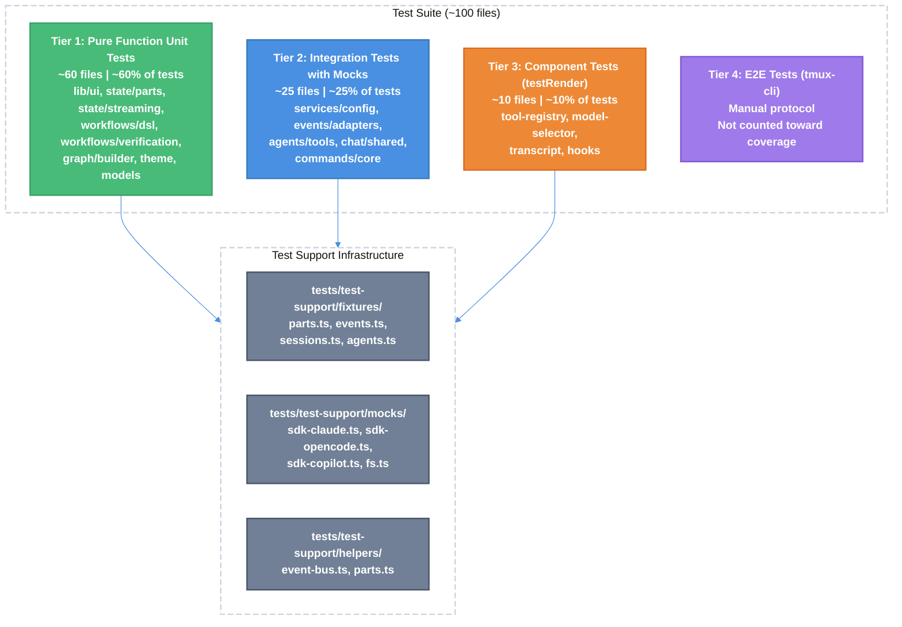

# Test Suite Design: Achieving 85%+ Coverage — Technical Design Document

| Document Metadata      | Details                                                               |
| ---------------------- | --------------------------------------------------------------------- |
| Author(s)              | lavaman131                                                            |
| Status                 | Draft (WIP)                                                           |
| Team / Owner           | Atomic CLI                                                            |
| Created / Last Updated | 2026-03-24                                                            |
| Research Source        | `research/docs/2026-03-24-test-suite-design.md`                       |
| Supersedes             | `specs/test-coverage-85-percent-plan.md` (Feb 2026, outdated modules) |

## 1. Executive Summary

This spec defines a comprehensive test suite for the Atomic CLI codebase, which currently has **588 source files** across 5 architectural layers and **0 test files** (all previously deleted). The test infrastructure (Bun runner, coverage thresholds, pre-commit hooks) is fully configured but empty. We propose ~100 test files organized into 4 tiers — pure function unit tests, integration tests with SDK mocks, OpenTUI component tests via `testRender`, and E2E tests via tmux-cli — implemented across 4 phases. The target is 85% line/function/statement coverage on ~564 testable files. The approach prioritizes pure functions first (highest ROI), then progressively adds mocked integration tests for cross-layer interactions.

> **Research citation:** All source module catalogs, test file manifests, coverage projections, and anti-pattern catalogs are drawn from `research/docs/2026-03-24-test-suite-design.md` (Section 2-12).

## 2. Context and Motivation

### 2.1 Current State

The Atomic CLI is a TUI application built on OpenTUI, powered by three coding agent SDKs (Claude Agent SDK, OpenCode SDK, Copilot SDK). The codebase follows a strict layered architecture:

```
CLI/TUI Entry → UI Layer → State Layer → Service Layer → Shared Layer
```

**Test infrastructure is configured but empty:**

| Component                 | Status                                                                       |
| ------------------------- | ---------------------------------------------------------------------------- |
| `bunfig.toml` test config | Configured — root: `tests/`, timeout: 10s, coverage: 80% threshold           |
| `lefthook.yml` pre-commit | Configured — runs `bun test --bail` on commit, `bun test --coverage` on push |
| Coverage exclusions       | 20+ files excluded (entry points, SDK clients, telemetry, visual components) |
| Test files                | **0 files** — all 433 prior test files deleted from working tree             |
| Test support utilities    | **0 files** — no fixtures, helpers, or mocks exist                           |

> **Research citation:** Section 1.1 documents the current `bunfig.toml` configuration; Section 11.1 explains why prior tests were superseded.

### 2.2 The Problem

- **Zero test coverage**: The codebase has no tests, making refactoring and SDK upgrades risky.
- **Regression risk**: 588 source files with complex cross-layer interactions (EventBus with 30 typed events, 3 SDK adapters, graph engine with verification algorithms) have no safety net.
- **CI gate disabled**: Pre-commit hooks run `bun test` but there are no tests to run; pre-push coverage checks pass vacuously.
- **Historical context**: Prior test files (337 tests at ~49% coverage) became stale when the codebase was restructured from 88 to 588 files and tests were moved from colocated `src/*.test.ts` to a separate `tests/` directory. All were deleted rather than maintained.

> **Research citation:** Section 11.1 details the prior test suite (Feb 2026) and why it was superseded.

## 3. Goals and Non-Goals

### 3.1 Functional Goals

- [ ] Achieve **85% line, function, and statement coverage** across ~564 testable source files
- [ ] Create **~100 test files** organized to mirror the `src/` directory structure
- [ ] Establish a shared test support library (`tests/test-support/`) with fixtures, mocks, and helpers
- [ ] Raise `bunfig.toml` coverage thresholds from 80% to 85%
- [ ] Ensure all tests pass in the pre-commit hook (`bun test --bail`) and pre-push coverage gate (`bun test --coverage`)
- [ ] Follow Bun test runner best practices and avoid known anti-patterns

### 3.2 Non-Goals (Out of Scope)

- [ ] We will NOT create automated E2E tests — E2E testing remains manual via `docs/e2e-testing.md` and tmux-cli
- [ ] We will NOT achieve 100% coverage — SDK-dependent I/O, visual-only components, and entry points are excluded
- [ ] We will NOT modify production source code to improve testability (except updating `bunfig.toml` thresholds)
- [ ] We will NOT add external test dependencies (memfs, testing-library, etc.) — rely on Bun built-ins and `mock.module()`
- [ ] We will NOT test type-only files, barrel re-exports, or generated files

## 4. Proposed Solution (High-Level Design)

### 4.1 System Architecture Diagram



### 4.2 Architectural Pattern

**Tiered Testing Pyramid** — Tests are organized into 4 tiers by their dependency on external systems:

| Tier | Type                         | Dependencies                   | Speed   | Coverage Contribution  |
| ---- | ---------------------------- | ------------------------------ | ------- | ---------------------- |
| 1    | Pure Function Unit Tests     | None                           | Fastest | ~60% of total coverage |
| 2    | Integration Tests with Mocks | `mock.module()` for SDKs, fs   | Fast    | ~25% of total coverage |
| 3    | Component Tests              | OpenTUI `testRender` (Zig FFI) | Medium  | ~10% of total coverage |
| 4    | E2E Tests                    | tmux-cli, running agents       | Slow    | Not measured           |

> **Research citation:** Section 4 defines the 4-tier strategy; Section 7 provides coverage projections per layer.

### 4.3 Key Components

| Component            | Responsibility                                             | Location                                                        |
| -------------------- | ---------------------------------------------------------- | --------------------------------------------------------------- |
| Test Support Library | Shared fixtures, mock factories, assertion helpers         | `tests/test-support/`                                           |
| Pure Function Tests  | Test all functions with no I/O dependencies                | `tests/lib/`, `tests/state/parts/`, `tests/services/workflows/` |
| EventBus Tests       | Test pub/sub infrastructure (no mocks needed — pure class) | `tests/services/events/`                                        |
| SDK Adapter Tests    | Test stream adapters with mocked SDK events                | `tests/services/events/adapters/`                               |
| Config Tests         | Test config loading with mocked filesystem                 | `tests/services/config/`                                        |
| Component Tests      | Test UI component logic via `testRender`                   | `tests/components/`, `tests/theme/`                             |
| Coverage Config      | Raise thresholds from 80% to 85%                           | `bunfig.toml`                                                   |

## 5. Detailed Design

### 5.1 Test File Manifest

Tests mirror source paths: `src/lib/ui/format.ts` -> `tests/lib/ui/format.test.ts`.

**Naming conventions:**
- Test files: `*.test.ts`
- Suite files (large tests split into modules): `*.suite.ts`
- Test support/fixtures: `*.test-support.ts`

> **Research citation:** Section 3.1 contains the complete directory structure with ~100 test files.

```
tests/
├── test-support/                 # Shared test infrastructure
│   ├── fixtures/
│   │   ├── parts.ts              # Part factory functions (TextPart, ToolPart, etc.)
│   │   ├── events.ts             # BusEvent factory functions
│   │   ├── sessions.ts           # Mock session factories
│   │   └── agents.ts             # Mock agent configurations
│   ├── mocks/
│   │   ├── sdk-claude.ts         # Claude Agent SDK mock
│   │   ├── sdk-opencode.ts       # OpenCode SDK mock
│   │   ├── sdk-copilot.ts        # Copilot SDK mock
│   │   └── fs.ts                 # Filesystem mock
│   └── helpers/
│       ├── event-bus.ts          # EventBus test helper (collect events)
│       └── parts.ts              # Part assertion helpers
│
├── lib/                          # Shared layer tests
│   ├── markdown.test.ts
│   ├── merge.test.ts
│   ├── path-root-guard.test.ts
│   └── ui/
│       ├── format.test.ts
│       ├── navigation.test.ts
│       ├── hitl-response.test.ts
│       ├── mcp-output.test.ts
│       ├── agent-list-output.test.ts
│       ├── mention-parsing.test.ts
│       └── clipboard.test.ts
│
├── services/                     # Service layer tests
│   ├── events/
│   │   ├── event-bus.test.ts
│   │   ├── bus-events.test.ts
│   │   ├── batch-dispatcher.test.ts
│   │   ├── coalescing.test.ts
│   │   ├── registry.test.ts
│   │   ├── adapters/
│   │   │   ├── claude-adapter.test.ts
│   │   │   ├── copilot-adapter.test.ts
│   │   │   ├── opencode-adapter.test.ts
│   │   │   └── subagent-adapter.test.ts
│   │   └── consumers/
│   │       ├── stream-pipeline-consumer.test.ts
│   │       └── echo-suppressor.test.ts
│   ├── workflows/
│   │   ├── dsl/
│   │   │   ├── define-workflow.test.ts
│   │   │   ├── compiler.test.ts
│   │   │   ├── state-compiler.test.ts
│   │   │   ├── agent-resolution.test.ts
│   │   │   └── types.test.ts
│   │   ├── verification/
│   │   │   ├── reachability.test.ts
│   │   │   ├── termination.test.ts
│   │   │   ├── deadlock-freedom.test.ts
│   │   │   ├── loop-bounds.test.ts
│   │   │   ├── state-data-flow.test.ts
│   │   │   ├── graph-encoder.test.ts
│   │   │   └── reporter.test.ts
│   │   ├── graph/
│   │   │   ├── builder.test.ts
│   │   │   ├── annotation.test.ts
│   │   │   ├── state-validator.test.ts
│   │   │   ├── provider-registry.test.ts
│   │   │   ├── agent-providers.test.ts
│   │   │   └── types.test.ts
│   │   ├── conductor/
│   │   │   ├── conductor.test.ts
│   │   │   ├── event-bridge.test.ts
│   │   │   └── truncate.test.ts
│   │   ├── ralph/
│   │   │   ├── definition.test.ts
│   │   │   └── review-loop-terminator.test.ts
│   │   ├── runtime-contracts.test.ts
│   │   ├── task-identity-service.test.ts
│   │   ├── task-result-envelope.test.ts
│   │   └── helpers/
│   │       └── workflow-input-resolver.test.ts
│   ├── config/
│   │   ├── settings.test.ts
│   │   ├── atomic-config.test.ts
│   │   ├── claude-config.test.ts
│   │   ├── opencode-config.test.ts
│   │   ├── mcp-config.test.ts
│   │   ├── provider-discovery.test.ts
│   │   └── index.test.ts
│   ├── agents/
│   │   ├── tools/
│   │   │   ├── discovery.test.ts
│   │   │   ├── schema-utils.test.ts
│   │   │   └── truncate.test.ts
│   │   ├── provider-events.test.ts
│   │   ├── subagent-tool-policy.test.ts
│   │   ├── init.test.ts
│   │   ├── types.test.ts
│   │   └── clients/
│   │       ├── claude.test.ts
│   │       ├── copilot.test.ts
│   │       └── opencode.test.ts
│   ├── models/
│   │   ├── model-operations.test.ts
│   │   └── model-transform.test.ts
│   ├── system/
│   │   ├── copy.test.ts
│   │   └── detect.test.ts
│   └── agent-discovery/
│       ├── index.test.ts
│       └── session.test.ts
│
├── state/                        # State layer tests
│   ├── parts/
│   │   ├── types.test.ts
│   │   ├── id.test.ts
│   │   ├── store.test.ts
│   │   ├── handlers.test.ts
│   │   ├── truncation.test.ts
│   │   ├── guards.test.ts
│   │   └── stream-pipeline.test.ts
│   ├── streaming/
│   │   ├── pipeline.test.ts
│   │   ├── pipeline-tools.test.ts
│   │   ├── pipeline-thinking.test.ts
│   │   ├── pipeline-agents.test.ts
│   │   └── pipeline-workflow.test.ts
│   ├── chat/
│   │   ├── shared/helpers/messages.test.ts
│   │   ├── agent/
│   │   ├── command/
│   │   ├── composer/
│   │   ├── keyboard/
│   │   ├── session/
│   │   ├── shell/
│   │   └── stream/
│   └── runtime/
│       ├── chat-ui-controller.test.ts
│       └── stream-run-runtime.test.ts
│
├── components/                   # UI layer tests
│   ├── tool-registry/registry.test.ts
│   ├── model-selector/helpers.test.ts
│   └── transcript/transcript-formatter.test.ts
│
├── theme/
│   ├── helpers.test.ts
│   ├── palettes.test.ts
│   └── themes.test.ts
│
├── commands/
│   ├── core/registry.test.ts
│   └── tui/builtin-commands.test.ts
│
└── packages/
    └── workflow-sdk/define-workflow.test.ts
```

### 5.2 Mock Strategy

#### 5.2.1 What to Mock (SDK Boundaries Only)

| Boundary                      | Mock Strategy                                                      | Used By                                                   |
| ----------------------------- | ------------------------------------------------------------------ | --------------------------------------------------------- |
| Claude Agent SDK              | `mock.module("@anthropic-ai/claude-agent-sdk", ...)`               | `services/agents/clients/claude.test.ts`, adapter tests   |
| OpenCode SDK                  | `mock.module("@opencode-ai/sdk", ...)`                             | `services/agents/clients/opencode.test.ts`, adapter tests |
| Copilot SDK                   | `mock.module("@github/copilot-sdk", ...)`                          | `services/agents/clients/copilot.test.ts`, adapter tests  |
| File system                   | `mock.module("fs/promises", ...)` or `mock.module("node:fs", ...)` | Config tests                                              |
| `Bun.spawn` / `Bun.spawnSync` | `mock.module()` or DI wrapper                                      | System tests                                              |
| `process.env`                 | Direct mutation in `beforeEach`, restore in `afterEach`            | Detection tests                                           |

> **Research citation:** Section 6.1 defines the mock boundary strategy.

#### 5.2.2 What NOT to Mock (Pure Modules)

These modules are pure, fast, and have no I/O — always use real instances:

| Module                                                     | Reason                                                |
| ---------------------------------------------------------- | ----------------------------------------------------- |
| `EventBus`                                                 | Pure class, no I/O, fully testable with real instance |
| `GraphBuilder`                                             | Pure builder pattern                                  |
| Part store functions (`binarySearchById`, `upsertPart`)    | Pure algorithms                                       |
| Verification modules (reachability, termination, deadlock) | Pure graph algorithms                                 |
| Theme helpers/palettes                                     | Pure data                                             |
| Format utilities                                           | Pure functions                                        |
| DSL compiler                                               | Pure transforms                                       |

> **Research citation:** Section 6.2 explains why these should never be mocked (Anti-Pattern 3: "Mocking What You Own").

#### 5.2.3 Shared Mock Factories

Located in `tests/test-support/mocks/`, each file exports a coherent mock for an SDK boundary:

```typescript
// tests/test-support/mocks/sdk-claude.ts
import { mock } from "bun:test";

export class FakeClaudeSession {
  id = "test-session-claude";
  send = mock(() => Promise.resolve());
  destroy = mock(() => Promise.resolve());
  subscribe = mock(() => () => {});
}

export function mockClaudeSDK() {
  mock.module("@anthropic-ai/claude-agent-sdk", () => ({
    ClaudeAgentSDK: class {
      createSession() { return new FakeClaudeSession(); }
    }
  }));
}
```

> **Research citation:** Section 12.3 Anti-Pattern 4 explains why mock factories should return coherent objects, not individual mocked methods.

### 5.3 Global State Isolation

Two sources of mutable global state require explicit handling:

#### `state/parts/id.ts` — Module-level mutable counter

Every test file that creates Parts must reset the counter in `beforeEach`:

```typescript
import { _resetPartCounter } from "@/state/parts/id.ts";

beforeEach(() => {
  _resetPartCounter();
});
```

Without this reset, Part IDs leak between test files (Bun runs files in the same process), causing non-deterministic sort orders in `upsertPart()` and flaky tests.

> **Research citation:** Section 12.4 documents this global state concern.

#### `theme/colors.ts` — Read-only initialization

`COLORS` is set once at import time based on terminal capabilities. No reset needed in tests. If a test needs to force a specific color mode, mock the module before import.

### 5.4 Testing Anti-Patterns to Enforce

| #   | Anti-Pattern                           | Correct Approach                                                 | Example                                                                                 |
| --- | -------------------------------------- | ---------------------------------------------------------------- | --------------------------------------------------------------------------------------- |
| 1   | Testing mock behavior                  | Assert observable state changes, not mock call counts            | `expect(events[0]?.data.delta).toBe("hello")` not `expect(sendMock).toHaveBeenCalled()` |
| 2   | Adding test-only code to production    | Only `_resetPartCounter()` is acceptable (marked `@internal`)    | No `.toJSON()`, `.__testOnly`, or `._debug` methods                                     |
| 3   | Mocking pure modules you own           | Use real instances of EventBus, GraphBuilder, Part store         | `const bus = new EventBus({ validatePayloads: false })`                                 |
| 4   | Over-mocking SDK boundaries            | Mock the session factory, return a coherent session object       | Use `FakeSession` class, not individual mocked methods                                  |
| 5   | Using `setTimeout` in tests for timing | Use `Bun.sleep()` or `mock.fn()` for timers                      | —                                                                                       |
| 6   | Not awaiting async operations          | Always `await` — Bun silently swallows unhandled rejections      | —                                                                                       |
| 7   | Snapshot overuse                       | Only snapshot complex objects that rarely change (event schemas) | —                                                                                       |
| 8   | Testing barrel re-exports              | Skip — barrel files are re-exports only                          | —                                                                                       |

> **Research citation:** Section 5 catalogs all anti-patterns; Section 12.3 provides concrete examples.

### 5.5 OpenTUI Component Testing

OpenTUI provides a full headless testing toolkit:

| Export                      | Package                     | Purpose                         |
| --------------------------- | --------------------------- | ------------------------------- |
| `testRender(node, options)` | `@opentui/react/test-utils` | Headless React rendering        |
| `createMockKeys(renderer)`  | `@opentui/core/testing`     | Keyboard event simulation       |
| `createMockMouse(renderer)` | `@opentui/core/testing`     | Mouse event simulation          |
| `ManualClock`               | `@opentui/core/testing`     | Deterministic time control      |
| `captureCharFrame()`        | returned by `testRender`    | Terminal character grid capture |

**Testing approach (5 layers):**
1. Pure logic tests (no renderer) — state reducers, helpers, type guards
2. Component integration tests via `testRender` — assert on `captureCharFrame()`
3. Interaction tests — use `mockInput`/`mockMouse` for keyboard/mouse behavior
4. Registry/catalog tests — test as pure data structures
5. E2E tests — full application via tmux-cli (manual)

**Limitations:**
- No DOM-style queries (`getByText`, `getByRole`) — assert on character grid strings
- `testRender` is async (loads Zig FFI) — tests must use `async` functions
- Native binary dependency (`@opentui/core-linux-x64`) — tests only run on supported platforms
- `ManualClock` does NOT replace `setTimeout`/`setInterval` (Bun limitation)

> **Research citation:** Section 9 provides the complete OpenTUI testing strategy, toolkit reference, and code templates.

### 5.6 Bun-Specific Limitations

These confirmed limitations shape the testing strategy:

| Limitation                              | Mitigation                                                                                            |
| --------------------------------------- | ----------------------------------------------------------------------------------------------------- |
| No `__mocks__` directory support        | Use `mock.module()`                                                                                   |
| No built-in fake timers                 | Restructure code to accept time as parameter, or use `Bun.sleep()`                                    |
| `mock.module()` leaks across test files | Prefer DI; use `--preload` if unavoidable ([Bun #12823](https://github.com/oven-sh/bun/issues/12823)) |
| No mock hoisting                        | Side effects from original module still execute                                                       |
| Coverage function names may be missing  | JSC limitation in lcov output                                                                         |

> **Research citation:** Section 11.2 documents these limitations, confirmed from prior research.

## 6. Alternatives Considered

| Option                                                   | Pros                                    | Cons                                                                                         | Reason for Rejection                                                                |
| -------------------------------------------------------- | --------------------------------------- | -------------------------------------------------------------------------------------------- | ----------------------------------------------------------------------------------- |
| Restore prior 433 test files from git                    | Immediate test coverage                 | All file paths and module APIs are stale; would require rewriting most tests anyway          | Prior tests were for a fundamentally different codebase structure (88 vs 588 files) |
| Use Vitest instead of Bun test runner                    | Richer mocking (fake timers, __mocks__) | Adds external dependency, slower startup, Bun compatibility issues                           | CLAUDE.md mandates Bun; existing infrastructure is configured for `bun test`        |
| Colocate tests with source (`src/*.test.ts`)             | Easier discovery, shorter imports       | Contradicts current `bunfig.toml` config (root: `tests/`), pollutes `src/` directory         | Already decided — `tests/` directory is the established convention                  |
| Test only pure functions (skip mocked integration tests) | Simpler, no mock maintenance            | Cannot reach 85% — SDK adapters, config loading, and agent clients are ~40% of testable code | Coverage target requires integration testing                                        |

## 7. Cross-Cutting Concerns

### 7.1 Test Isolation

- Each test file must be independently runnable: `bun test tests/lib/ui/format.test.ts`
- `beforeEach` for state reset (`_resetPartCounter()`, mock clearing)
- No shared mutable state between test files beyond what Bun's module cache provides
- `mock.module()` calls must be at file scope (before imports) to avoid ordering issues

### 7.2 CI Integration

- **Pre-commit** (`lefthook.yml`): `bun test --bail` — fast fail on any test failure
- **Pre-push** (`lefthook.yml`): `bun test --coverage` — enforce 85% threshold
- Coverage output: `text` (terminal) + `lcov` (CI reporting) in `coverage/` directory

### 7.3 Performance

- Pure function tests (Tier 1) should complete in <1ms per test case
- Integration tests with mocks (Tier 2) should complete in <50ms per test case
- Component tests with `testRender` (Tier 3) should complete in <500ms per test case (Zig FFI loading)
- Total test suite should run in under 30 seconds

## 8. Migration, Rollout, and Testing

### 8.1 Deployment Strategy

Tests are implemented in 4 phases, ordered by coverage ROI:

#### Phase 1 — Pure Function Tests (Target: 50% total coverage)

| Module                                                  | Test File                                                          | Key Functions                                                                                                              |
| ------------------------------------------------------- | ------------------------------------------------------------------ | -------------------------------------------------------------------------------------------------------------------------- |
| `lib/ui/format.ts`                                      | `tests/lib/ui/format.test.ts`                                      | `formatDuration`, `formatTimestamp`, `normalizeMarkdownNewlines`, `joinThinkingBlocks`, `collapseNewlines`, `truncateText` |
| `lib/ui/hitl-response.ts`                               | `tests/lib/ui/hitl-response.test.ts`                               | `formatHitlDisplayText`, `normalizeHitlAnswer`, `getHitlResponseRecord`                                                    |
| `lib/ui/mcp-output.ts`                                  | `tests/lib/ui/mcp-output.test.ts`                                  | `applyMcpServerToggles`, `getActiveMcpServers`, `buildMcpSnapshotView`                                                     |
| `lib/ui/navigation.ts`                                  | `tests/lib/ui/navigation.test.ts`                                  | `navigateUp`, `navigateDown`                                                                                               |
| `lib/ui/agent-list-output.ts`                           | `tests/lib/ui/agent-list-output.test.ts`                           | `buildAgentListView`                                                                                                       |
| `state/parts/*` (7 files)                               | `tests/state/parts/*.test.ts`                                      | `binarySearchById`, `upsertPart`, `handleTextDelta`, `truncateStageParts`, guards                                          |
| `state/streaming/*` (5 files)                           | `tests/state/streaming/*.test.ts`                                  | All pipeline functions                                                                                                     |
| `services/workflows/verification/*` (7 files)           | `tests/services/workflows/verification/*.test.ts`                  | Reachability, termination, deadlock, loop bounds                                                                           |
| `services/workflows/dsl/*` (5 files)                    | `tests/services/workflows/dsl/*.test.ts`                           | `defineWorkflow`, compiler, state-compiler, agent-resolution                                                               |
| `services/workflows/graph/builder.ts`                   | `tests/services/workflows/graph/builder.test.ts`                   | GraphBuilder fluent API                                                                                                    |
| `services/workflows/graph/annotation.ts`                | `tests/services/workflows/graph/annotation.test.ts`                | Graph annotation                                                                                                           |
| `services/workflows/graph/state-validator.ts`           | `tests/services/workflows/graph/state-validator.test.ts`           | State validation                                                                                                           |
| `theme/helpers.ts`, `palettes.ts`, `themes.ts`          | `tests/theme/*.test.ts`                                            | `getThemeByName`, `getMessageColor`, `createCustomTheme`, `getCatppuccinPalette`                                           |
| `services/models/*` (2 files)                           | `tests/services/models/*.test.ts`                                  | Model operations, transforms                                                                                               |
| `services/workflows/task-identity-service.ts`           | `tests/services/workflows/task-identity-service.test.ts`           | Task ID generation                                                                                                         |
| `services/workflows/task-result-envelope.ts`            | `tests/services/workflows/task-result-envelope.test.ts`            | Task result wrapping                                                                                                       |
| `services/workflows/helpers/workflow-input-resolver.ts` | `tests/services/workflows/helpers/workflow-input-resolver.test.ts` | Input resolution                                                                                                           |
| `services/workflows/conductor/truncate.ts`              | `tests/services/workflows/conductor/truncate.test.ts`              | Context truncation                                                                                                         |
| `services/workflows/ralph/review-loop-terminator.ts`    | `tests/services/workflows/ralph/review-loop-terminator.test.ts`    | Review loop logic                                                                                                          |

**Phase 1 deliverables:** ~45 test files, test-support fixtures

#### Phase 2 — EventBus and Event Infrastructure (Target: 65%)

| Module                                | Test File                                        | Key Functions                                                     |
| ------------------------------------- | ------------------------------------------------ | ----------------------------------------------------------------- |
| `services/events/event-bus.ts`        | `tests/services/events/event-bus.test.ts`        | Publish, subscribe, unsubscribe, wildcard, error isolation, clear |
| `services/events/bus-events/*`        | `tests/services/events/bus-events.test.ts`       | Zod schema validation for all 30 event types                      |
| `services/events/coalescing.ts`       | `tests/services/events/coalescing.test.ts`       | Event coalescing logic                                            |
| `services/events/batch-dispatcher.ts` | `tests/services/events/batch-dispatcher.test.ts` | Batched dispatch                                                  |
| `services/events/consumers/*`         | `tests/services/events/consumers/*.test.ts`      | Stream pipeline consumer, echo suppressor                         |
| `services/events/registry.ts`         | `tests/services/events/registry.test.ts`         | Event registry                                                    |

**Phase 2 deliverables:** ~8 test files, event-bus test helpers

#### Phase 3 — Integration Tests with Mocks (Target: 80%)

| Module                                 | Test File                                          | Mock Strategy                            |
| -------------------------------------- | -------------------------------------------------- | ---------------------------------------- |
| `services/config/*` (7 files)          | `tests/services/config/*.test.ts`                  | `mock.module("fs/promises", ...)`        |
| `services/events/adapters/*` (4 files) | `tests/services/events/adapters/*.test.ts`         | SDK mocks per adapter                    |
| `services/agents/tools/*` (3 files)    | `tests/services/agents/tools/*.test.ts`            | Pure (discovery, schema-utils, truncate) |
| `state/chat/shared/helpers/*`          | `tests/state/chat/shared/helpers/messages.test.ts` | Pure helpers                             |
| `commands/core/registry.ts`            | `tests/commands/core/registry.test.ts`             | Pure registry logic                      |
| `lib/markdown.ts`                      | `tests/lib/markdown.test.ts`                       | Lazy-loaded yaml                         |
| `lib/merge.ts`                         | `tests/lib/merge.test.ts`                          | `mock.module("fs/promises", ...)`        |
| `lib/path-root-guard.ts`               | `tests/lib/path-root-guard.test.ts`                | FS mock for `realpath`                   |

**Phase 3 deliverables:** ~20 test files, SDK mock factories, fs mock factory

#### Phase 4 — Remaining Modules (Target: 85%+)

| Module                           | Test File                                                  | Strategy                   |
| -------------------------------- | ---------------------------------------------------------- | -------------------------- |
| `state/chat/` sub-modules        | `tests/state/chat/*/`                                      | Mix of pure + hook tests   |
| `services/agents/clients/*`      | `tests/services/agents/clients/*.test.ts`                  | SDK mock integration tests |
| `services/workflows/conductor/*` | `tests/services/workflows/conductor/*.test.ts`             | Session mock integration   |
| `components/tool-registry/*`     | `tests/components/tool-registry/registry.test.ts`          | Pure registry/catalog      |
| `components/model-selector/*`    | `tests/components/model-selector/helpers.test.ts`          | Pure selection logic       |
| `components/transcript/*`        | `tests/components/transcript/transcript-formatter.test.ts` | Pure formatting            |
| `commands/tui/*`                 | `tests/commands/tui/builtin-commands.test.ts`              | Integration                |
| `services/system/*`              | `tests/services/system/*.test.ts`                          | FS mock                    |
| `services/agent-discovery/*`     | `tests/services/agent-discovery/*.test.ts`                 | FS/SDK mock                |
| Coverage threshold update        | `bunfig.toml`                                              | Raise from 80% to 85%      |

**Phase 4 deliverables:** ~27 test files, `bunfig.toml` threshold update

> **Research citation:** Section 7.2 defines the priority order for implementation; Section 12.2 provides detailed function signatures for highest-ROI targets.

### 8.2 Coverage Projections

| Layer                 | Files    | Testable Files | Expected Coverage | Strategy                        |
| --------------------- | -------- | -------------- | ----------------- | ------------------------------- |
| Shared (lib/, types/) | 17       | 10             | **95%**           | Pure function tests             |
| Services/events       | 82       | 65             | **90%**           | Pure + SDK adapter mocks        |
| Services/workflows    | 83       | 60             | **90%**           | Pure graph/DSL + conductor mock |
| Services/config       | 17       | 14             | **85%**           | FS mock tests                   |
| Services/agents       | 90       | 30             | **75%**           | Contract tests + SDK mocks      |
| Services/models       | 6        | 4              | **95%**           | Pure transform tests            |
| Services/system       | 5        | 3              | **80%**           | FS mock tests                   |
| State/parts           | 8        | 7              | **95%**           | Pure reducer tests              |
| State/streaming       | 6        | 5              | **90%**           | Pure pipeline tests             |
| State/chat            | 103      | 50             | **80%**           | Mix of pure + hook tests        |
| State/runtime         | 7        | 4              | **75%**           | Integration tests               |
| Components            | 67       | 35             | **80%**           | `testRender` + registry tests   |
| Theme                 | 14       | 8              | **90%**           | Pure function tests             |
| Commands              | 41       | 10             | **70%**           | Integration tests               |
| **Total**             | **~564** | **~295**       | **~85%**          |                                 |

> **Research citation:** Section 7.1 provides the full coverage projection table.

### 8.3 Configuration Changes

**`bunfig.toml` — Phase 4 update:**

```diff
- coverageThreshold = { lines = 0.80, functions = 0.80, statements = 0.80 }
+ coverageThreshold = { lines = 0.85, functions = 0.85, statements = 0.85 }
```

## 9. Resolved Design Decisions

All open questions have been resolved:

### Q1: Hook Testing Infrastructure — `testRender` Wrapper

**Decision:** Build a minimal `testRender` wrapper component pattern for hook testing.

Since OpenTUI has no `renderHook` equivalent, we will create a thin wrapper component pattern that renders hooks inside `testRender` and captures their return values via callback props. This enables testing hooks that manage state transitions (e.g., `useMessageQueue`) without extracting all logic into pure functions.

**Template (from research Section 9.4):**

```typescript
function TestHarness({ onResult }: { onResult: (v: unknown) => void }) {
  const result = useMyHook();
  useEffect(() => { onResult(result); }, [result]);
  return <text>{String(result)}</text>;
}

test("hook returns expected value", async () => {
  let result: unknown;
  const setup = await testRender(
    <TestHarness onResult={(v) => { result = v; }} />,
    { width: 20, height: 5 }
  );
  await setup.renderOnce();
  expect(result).toBe(expectedValue);
  setup.renderer.destroy();
});
```

### Q2: Snapshot Testing for Event Schemas — Snapshots

**Decision:** Use Bun snapshot tests for all 30 bus event Zod schemas.

Snapshot tests will capture the full schema shape for regression detection. When a schema changes intentionally, the developer updates the snapshot via `bun test --update-snapshots`. This is low-maintenance and catches any unintentional schema drift automatically.

**Implementation:** `tests/services/events/bus-events.test.ts` will iterate over all exported schemas and snapshot their `.shape` property.

### Q3: Coverage CI Gate — Yes, Add to CI Pipeline

**Decision:** Add `bun test --coverage` as a hard failure gate in the CI pipeline (GitHub Actions).

This ensures PRs cannot merge if coverage drops below the threshold, regardless of whether developers have lefthook installed locally. The CI gate supplements (does not replace) the existing pre-push hook.

**Implementation:** Add a `test-coverage` step to the CI workflow that runs `bun test --coverage` and fails the pipeline on threshold breach.

### Q4: Test Parallelism and Global State — Full Audit Required

**Decision:** Proactively audit all 588 source files for module-level mutable state before writing tests.

This audit should be completed as a prerequisite to Phase 1 and will produce a documented list of all module-level mutable variables, singletons, and caches that could cause cross-file test interference. Each identified concern will have a documented reset strategy (e.g., `beforeEach` reset function, module re-import, or DI).

**Known concerns (pre-audit):**
- `state/parts/id.ts` — mutable counter (`_resetPartCounter()`)
- `theme/colors.ts` — read-only initialization (no reset needed)

**Audit scope:** Search for `let` and `var` at module scope, singleton patterns, caches, and `Map`/`Set` instances in all `src/` files.

### Q5: SDK Mock Fidelity — Versioned Fixture Files

**Decision:** Maintain versioned mock SDK fixture files in `tests/test-support/mocks/`.

Each mock file (`sdk-claude.ts`, `sdk-opencode.ts`, `sdk-copilot.ts`) will include a version comment matching the SDK dependency in `package.json`. When SDK dependencies are bumped, the corresponding mock file must be updated to reflect any API changes.

**Format:**

```typescript
// tests/test-support/mocks/sdk-claude.ts
// Mirrors: @anthropic-ai/claude-agent-sdk@^0.2.81

export class FakeClaudeSession {
  id = "test-session-claude";
  send = mock(() => Promise.resolve());
  destroy = mock(() => Promise.resolve());
  subscribe = mock(() => () => {});
}
```

**Enforcement:** A comment in each mock file documents the SDK version. During SDK bumps, the developer must verify mock compatibility and update the version comment.
