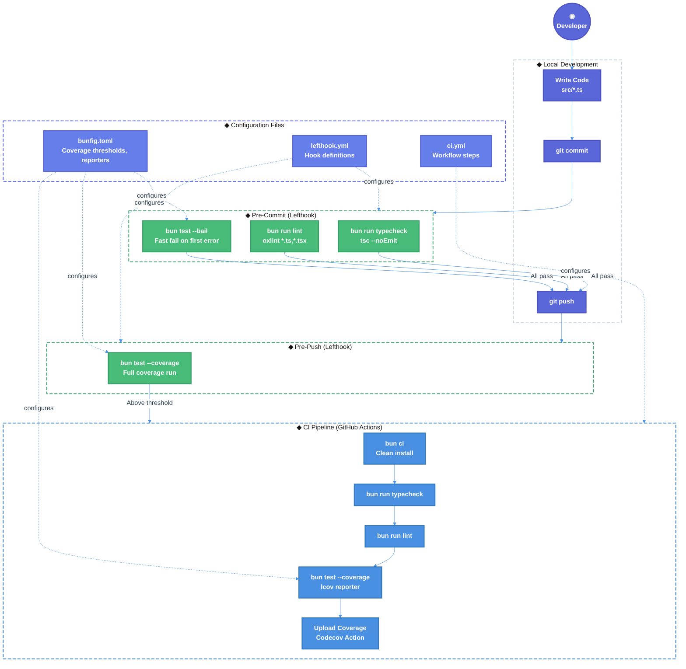

# Testing Infrastructure & Developer Setup

| Document Metadata      | Details                                                                                                                     |
| ---------------------- | --------------------------------------------------------------------------------------------------------------------------- |
| Author(s)              | Developer                                                                                                                   |
| Status                 | Draft (WIP)                                                                                                                 |
| Team / Owner           | Atomic CLI                                                                                                                  |
| Created / Last Updated | 2026-02-14 / 2026-02-14                                                                                                    |

> **Research basis:** [`research/docs/2026-02-14-testing-infrastructure-and-dev-setup.md`](../research/docs/2026-02-14-testing-infrastructure-and-dev-setup.md)

## 1. Executive Summary

The Atomic CLI has **5 test files covering ~5% of 101+ source files** with 20 passing tests. An additional 104 tests were removed after becoming stale ([`research/docs/2026-02-12-bun-test-failures-root-cause-analysis.md`](../research/docs/2026-02-12-bun-test-failures-root-cause-analysis.md)). Tests are disabled in CI ([`.github/workflows/ci.yml:38-40`](../.github/workflows/ci.yml)). No coverage tooling, pre-commit hooks, `bunfig.toml`, or developer onboarding documentation exists. This spec proposes establishing a production-grade testing infrastructure: configuring Bun coverage with thresholds, installing pre-commit hooks via Lefthook, re-enabling CI test gates with coverage upload, writing targeted new tests for untested core modules (prioritized by testability tiers), and creating a `DEV_SETUP.md` with contributing guidelines linked from `README.md`.

## 2. Context and Motivation

### 2.1 Current State

- **Test framework:** Bun built-in test runner (`bun test`), zero external test dependencies
- **Test files:** 5 colocated `*.test.ts` files with 20 tests / 51 assertions, all passing
- **Coverage:** ~5% estimated (no coverage tooling configured to measure precisely)
- **CI:** Tests commented out in `ci.yml` with `# TODO: Re-enable after fixing failing tests`; tests only run in `publish.yml` before release builds
- **Pre-commit hooks:** None configured
- **Configuration:** No `bunfig.toml` exists; all Bun defaults
- **Developer docs:** No `DEV_SETUP.md` or contributing guide

**Existing test quality is high** — the 5 files test real behavior (filesystem I/O, data transformations, error handling, SDK snapshot building) using proper patterns (fixtures, tmpdir cleanup, typed mocks, edge cases). They do NOT test trivial behavior.

> **Source:** [`research/docs/2026-02-14-testing-infrastructure-and-dev-setup.md` § Current Test Suite Audit](../research/docs/2026-02-14-testing-infrastructure-and-dev-setup.md)

### 2.2 The Problem

- **No safety net:** Tests disabled in CI means regressions ship silently. The 104 stale tests demonstrate what happens when testing discipline lapses — source code evolved but tests were never updated ([`research/docs/2026-02-12-bun-test-failures-root-cause-analysis.md`](../research/docs/2026-02-12-bun-test-failures-root-cause-analysis.md)).
- **No coverage visibility:** Without coverage tooling, there's no way to measure progress or enforce thresholds.
- **No development guardrails:** Developers can commit untested, unlinted, or type-broken code without any pre-commit validation.
- **No onboarding path:** New contributors have no documented setup guide, testing conventions, or anti-patterns to avoid.
- **Critical modules untested:** The graph workflow engine (12 files), config system, command registry, model operations, telemetry (12 files), SDK adapters (18 of 19 files), and UI utilities (35 of 38 files) have zero test coverage.

## 3. Goals and Non-Goals

### 3.1 Functional Goals

- [ ] Configure `bunfig.toml` with coverage thresholds, reporters, and test timeouts
- [ ] Establish a measured coverage baseline by running `bun test --coverage`
- [ ] Install Lefthook for pre-commit hooks (typecheck + lint + test) and pre-push hooks (coverage)
- [ ] Re-enable tests in `.github/workflows/ci.yml` with coverage reporting
- [ ] Write new tests for Tier 1 pure functions (highest value, easiest to test)
- [ ] Write new tests for Tier 2 state machines and builders (medium complexity)
- [ ] Create `DEV_SETUP.md` with prerequisites, commands, testing conventions, and anti-patterns
- [ ] Add a "Contributing Guide" section to `README.md` linking to `DEV_SETUP.md`
- [ ] Refactor identified anti-patterns in existing tests where practical

### 3.2 Non-Goals (Out of Scope)

- [ ] We will NOT write integration tests requiring live SDK connections (Tier 3) in this phase
- [ ] We will NOT add a code formatter (Prettier/dprint/Biome) — oxlint-only is the current intentional approach
- [ ] We will NOT automate E2E tests (manual tmux-based E2E testing remains per `src/CLAUDE.md`)
- [ ] We will NOT remediate the 104 previously stale tests (covered separately in [`specs/bun-test-failures-remediation.md`](./bun-test-failures-remediation.md))
- [ ] We will NOT add external test dependencies (jest, vitest, sinon, etc.)
- [ ] We will NOT move test files to a `tests/` directory — colocated `*.test.ts` files remain the convention

## 4. Proposed Solution (High-Level Design)

### 4.1 System Architecture Diagram



### 4.2 Architectural Pattern

We are adopting a **layered quality gate** pattern:

1. **Pre-commit** (fast): Parallel typecheck + lint + bail-on-first-failure tests — catches obvious issues instantly
2. **Pre-push** (thorough): Full coverage run — enforces coverage thresholds before code reaches remote
3. **CI** (authoritative): Full test + coverage + upload — the definitive quality gate for PRs

This matches the research recommendation of keeping pre-commit fast (developer experience) while saving heavy coverage for pre-push and CI ([`research/docs/2026-02-14-testing-infrastructure-and-dev-setup.md` § Pre-Commit Hook Configuration](../research/docs/2026-02-14-testing-infrastructure-and-dev-setup.md)).

### 4.3 Key Components

| Component | Responsibility | Technology | Justification |
|-----------|---------------|------------|---------------|
| Test Runner | Execute tests, generate coverage | Bun built-in | Already in use, zero config, fast, native coverage support |
| Coverage Config | Threshold enforcement, reporters | `bunfig.toml` | Bun's native config format; fails build if below threshold |
| Pre-Commit Hooks | Fast quality gates on commit/push | Lefthook (Go) | Parallel execution, glob filtering, fast native binary |
| CI Test Gate | Authoritative quality enforcement | GitHub Actions | Re-enable existing commented-out test step + coverage upload |
| Developer Docs | Onboarding & conventions | `DEV_SETUP.md` | Centralized setup guide, testing anti-patterns |

## 5. Detailed Design

### 5.1 `bunfig.toml` Configuration

**New file:** `bunfig.toml` (project root)

> **Reference:** [Bun Test Configuration](https://bun.sh/docs/runtime/bunfig#test-runner), [`research/docs/2026-02-14-testing-infrastructure-and-dev-setup.md` § Recommended: bunfig.toml Configuration](../research/docs/2026-02-14-testing-infrastructure-and-dev-setup.md)

```toml
[test]
# Coverage
coverage = true
coverageThreshold = { lines = 0.85, functions = 0.85 }
coverageReporter = ["text", "lcov"]
coverageDir = "coverage"
coverageSkipTestFiles = true
coveragePathIgnorePatterns = [
  "src/cli.ts",
  "src/version.ts"
]

# Execution
timeout = 10000
```

**Key decisions:**
- **85% threshold** for lines and functions — the research-recommended target, though the initial baseline is ~5%. The threshold should be set to the current baseline + 5% initially, then ramped up incrementally toward 85% as new tests are written.
- **lcov reporter** — standard format for CI/Codecov integration
- **text reporter** — human-readable console output for local development
- **10s timeout** — prevents hanging tests; matches Bun's recommendation for async operations
- **Skip test files** — excludes `*.test.ts` from coverage metrics
- **Ignore entry points** — `cli.ts` and `version.ts` are not unit-testable in isolation

**`.gitignore` update:** Add `coverage/` to prevent generated reports from being committed.

### 5.2 Lefthook Pre-Commit Hook Configuration

**Install:**
```bash
bun add --dev lefthook
bunx lefthook install
```

**New file:** `lefthook.yml` (project root)

> **Reference:** [Lefthook Usage Guide](https://lefthook.dev/usage/commands.html), [`research/docs/2026-02-14-testing-infrastructure-and-dev-setup.md` § Pre-Commit Hook Options](../research/docs/2026-02-14-testing-infrastructure-and-dev-setup.md)

```yaml
pre-commit:
  parallel: true
  commands:
    typecheck:
      run: bun run typecheck
    lint:
      glob: "*.{ts,tsx}"
      run: bun run lint
    test:
      run: bun test --bail

pre-push:
  commands:
    test-coverage:
      run: bun test --coverage
```

**Why Lefthook over Husky:**

| Criteria | Lefthook | Husky |
|----------|----------|-------|
| Parallel execution | ✅ Built-in | ❌ Manual |
| Glob-based file filtering | ✅ Built-in | ❌ Manual |
| Speed | ✅ Go binary, fast | ⚠️ Node.js, slower |
| Configuration | ✅ Version-controlled YAML | ⚠️ Shell scripts |
| Skip mechanism | ✅ `--no-verify` | ✅ `--no-verify` |

> **Research note:** Both tools are Bun-compatible. Lefthook is recommended due to parallel execution and built-in glob filtering. If the team prefers fewer binary dependencies, Husky is a viable alternative ([`research/docs/2026-02-14-testing-infrastructure-and-dev-setup.md` § Pre-Commit Hook Options](../research/docs/2026-02-14-testing-infrastructure-and-dev-setup.md)).

**`package.json` update:** Add a `postinstall` script to auto-install hooks:
```json
"postinstall": "lefthook install"
```

### 5.3 CI Pipeline Update

**File:** `.github/workflows/ci.yml`

Re-enable the commented-out test step and add coverage upload:

```yaml
- name: Run tests with coverage
  run: bun test --coverage --coverage-reporter=lcov

- name: Upload coverage
  uses: codecov/codecov-action@v3
  with:
    file: ./coverage/lcov.info
```

This replaces the current commented-out block at lines 38-40.

### 5.4 New Test Files — Tier 1: Pure Functions (Highest ROI)

> **Source:** [`research/docs/2026-02-14-testing-infrastructure-and-dev-setup.md` § Tier 1: Pure Functions & Data Transformers](../research/docs/2026-02-14-testing-infrastructure-and-dev-setup.md)

These modules contain pure functions with no external dependencies, making them the easiest and highest-value targets for testing:

| New Test File | Source File | What to Test | Expected Tests |
|--------------|-------------|--------------|----------------|
| `src/graph/types.test.ts` | `src/graph/types.ts` | Type guards: `isGraphNode`, `isConditionalEdge`, etc. — wrong guards = wrong workflow routing | 8-12 |
| `src/graph/annotation.test.ts` | `src/graph/annotation.ts` | Annotation reducers: merge, replace, append strategies — state management correctness | 6-10 |
| `src/ui/utils/format.test.ts` | `src/ui/utils/format.ts` | `truncateText`, `formatDuration`, `formatRelativeTime`, `wrapText` — user-facing display logic | 10-15 |
| `src/sdk/tools/schema-utils.test.ts` | `src/sdk/tools/schema-utils.ts` | JSON Schema ↔ Zod conversions, schema merging — tool integration foundation | 8-12 |
| `src/models/model-operations.test.ts` | `src/models/model-operations.ts` | Model list filtering, cost calculations, capability checks | 6-10 |
| `src/utils/platform.test.ts` | `src/utils/platform.ts` | `isWindows`, `isMac`, `isLinux`, platform path resolution — cross-platform correctness | 4-6 |
| `src/config/index.test.ts` | `src/config/index.ts` | Config loading, merging, validation, default generation | 8-12 |

**Estimated impact:** 50-77 new tests, bringing coverage from ~5% to ~25-30%.

### 5.5 New Test Files — Tier 2: State Machines & Builders

| New Test File | Source File | What to Test | Expected Tests |
|--------------|-------------|--------------|----------------|
| `src/graph/builder.test.ts` | `src/graph/builder.ts` | Graph construction, edge wiring, node registration | 8-12 |
| `src/graph/compiled.test.ts` | `src/graph/compiled.ts` | Graph execution, state transitions, conditional routing | 10-15 |
| `src/ui/commands/registry.test.ts` | `src/ui/commands/registry.ts` | Command registration, lookup, alias resolution | 6-10 |
| `src/ui/commands/builtin-commands.test.ts` | `src/ui/commands/builtin-commands.ts` | Command execution, argument parsing | 8-12 |
| `src/ui/tools/registry.test.ts` | `src/ui/tools/registry.ts` | Tool renderer lookup, icon/label resolution | 6-8 |

**Estimated impact:** 38-57 new tests, bringing coverage from ~25-30% to ~55-65%.

### 5.6 Testing Patterns & Conventions

All new tests must follow these patterns, derived from analysis of the existing high-quality tests and documented anti-patterns:

#### Pattern: Import from `bun:test`
```typescript
import { describe, expect, test } from "bun:test";
```

#### Pattern: Colocated test files
Place `*.test.ts` next to the source file it tests.

#### Pattern: Filesystem tests with cleanup
```typescript
const root = await mkdtemp(join(tmpdir(), "atomic-test-"));
try {
  // test logic
} finally {
  await rm(root, { recursive: true, force: true });
}
```

#### Pattern: Typed inline mocks
```typescript
const mockClient = {
  mcp: { status: async () => ({ data: { /* ... */ } }) },
} satisfies Partial<SdkClient>;
```

#### Anti-Patterns to Avoid

> **Source:** [`research/docs/2026-02-14-testing-infrastructure-and-dev-setup.md` § Testing Anti-Patterns Identified](../research/docs/2026-02-14-testing-infrastructure-and-dev-setup.md)

1. **❌ Substring matching on rendered output** — Test structured data, not concatenated strings. The `transcript-formatter.hitl.test.ts:34-35` pattern of `expect(rendered).toContain(...)` is fragile to whitespace/ordering changes.
2. **❌ Coupling to implementation details** — Don't check color hex values, emoji characters, or internal method call counts. This is the root cause of 104 stale tests ([`research/docs/2026-02-12-bun-test-failures-root-cause-analysis.md`](../research/docs/2026-02-12-bun-test-failures-root-cause-analysis.md)).
3. **❌ Testing private internals via type casting** — Minimize `as unknown as Harness` patterns. Consider extracting logic into standalone pure functions instead.
4. **✅ Test behavioral contracts** — Focus on inputs → outputs, not how the function achieves the result.
5. **✅ Test edge cases** — Empty inputs, partial failures, null returns, boundary values.

### 5.7 Existing Test Refactoring

Two existing anti-patterns should be addressed:

1. **`src/ui/utils/transcript-formatter.hitl.test.ts:34-35`** — Refactor from substring matching on joined string to assertions on the structured `lines` array returned by `formatTranscript`.

2. **`src/sdk/opencode-client.mcp-snapshot.test.ts:12-14`** — Evaluate extracting `buildOpenCodeMcpSnapshot` into a standalone pure function to eliminate the `as unknown as OpenCodeSnapshotHarness` casting pattern. If extraction is not practical, document why the casting is justified.

### 5.8 `DEV_SETUP.md` Structure

**New file:** `DEV_SETUP.md` (project root)

```markdown
# Developer Setup

## Prerequisites
- Bun (latest)
- Git
- At least one coding agent CLI installed (claude, copilot, or opencode)

## Getting Started
1. Clone the repository
2. Run `bun install` (automatically installs git hooks via Lefthook)
3. Run `bun test` to verify setup

## Development Commands
| Command | Description |
|---------|-------------|
| `bun test` | Run all tests with coverage |
| `bun test --bail` | Stop on first failure (fast feedback) |
| `bun run typecheck` | TypeScript type checking |
| `bun run lint` | Run oxlint |
| `bun run lint:fix` | Auto-fix linting issues |
| `bun run dev` | Run CLI in development mode |

## Testing
### Running Tests
### Writing Tests (patterns & conventions)
### Coverage Requirements (>85% lines & functions)
### Testing Anti-Patterns to Avoid

## Pre-Commit Hooks
### What Runs (typecheck + lint + test on commit; coverage on push)
### Skipping Hooks (`git commit --no-verify` for emergencies)

## Project Structure
Brief `src/` module map

## CI/CD
What CI checks run on PRs
```

### 5.9 `README.md` Integration

Add a "Contributing Guide" section after the "FAQ" section and before "License":

```markdown
## Contributing Guide

See [DEV_SETUP.md](DEV_SETUP.md) for development setup, testing guidelines, and contribution workflow.
```

Update the Table of Contents to include `- [Contributing Guide](#contributing-guide)`.

## 6. Alternatives Considered

| Option | Pros | Cons | Reason for Rejection |
|--------|------|------|---------------------|
| **Vitest** instead of Bun test | Rich plugin ecosystem, VS Code integration | Adds external dependency, slower startup than native Bun | Project philosophy is zero external test dependencies; Bun built-in is sufficient |
| **Husky** instead of Lefthook | Pure Node.js, lighter weight, no Go binary | No parallel execution, manual glob filtering | Lefthook's parallel execution and glob support provide better DX with minimal overhead |
| **Shell script** for hooks | Zero dependencies | Not cross-platform, not version-controlled, not shareable | Does not meet cross-platform requirements |
| **Start at 85% threshold immediately** | Aggressive quality target | Current baseline is ~5%, would block all commits | Impractical — must ramp incrementally from measured baseline |
| **Separate `tests/` directory** | Cleaner `src/` tree | Historical `tests/` dir became stale and was removed; discoverability suffers | Colocated tests are easier to maintain and discover alongside source |
| **Add Prettier/Biome formatter** | Code consistency | Scope creep; oxlint-only is the current approach | Out of scope per Non-Goals |

## 7. Cross-Cutting Concerns

### 7.1 Developer Experience

- **Pre-commit speed:** Pre-commit runs typecheck, lint, and tests in **parallel** to minimize wait time. Tests use `--bail` to fail fast on first error.
- **Emergency bypass:** `git commit --no-verify` and `git push --no-verify` skip hooks when needed. Document in `DEV_SETUP.md`.
- **Coverage ramp:** Set initial threshold to measured baseline + 5%, then incrementally increase toward 85% to avoid blocking existing development.

### 7.2 CI/CD Impact

- Re-enabling tests in `ci.yml` means PRs will be blocked if tests fail — this is the intended behavior.
- Coverage uploads to Codecov provide PR-level coverage delta comments, making coverage regression visible during code review.
- The publish workflow (`publish.yml:52`) already runs `bun test` — no changes needed there.

### 7.3 Maintenance

- **Test staleness prevention:** The core lesson from 104 stale tests is to test behavioral contracts, not implementation details. Anti-patterns are documented in `DEV_SETUP.md` and enforced through code review.
- **Coverage drift:** CI coverage thresholds prevent coverage from regressing. The threshold should only increase over time, never decrease.

## 8. Migration, Rollout, and Testing

### 8.1 Deployment Strategy (Phased Rollout)

- [ ] **Phase 1: Foundation** — Create `bunfig.toml`, run coverage baseline, add `coverage/` to `.gitignore`
- [ ] **Phase 2: Guardrails** — Install Lefthook, create `lefthook.yml`, add `postinstall` hook, re-enable CI tests with coverage upload
- [ ] **Phase 3: Tier 1 Tests** — Write tests for pure functions (graph types, annotation, format, schema-utils, model-operations, platform, config). Target: ~5% → ~30% coverage
- [ ] **Phase 4: Tier 2 Tests** — Write tests for state machines (graph builder, compiled, command registry, builtin-commands, tool registry). Target: ~30% → ~60% coverage
- [ ] **Phase 5: Documentation** — Create `DEV_SETUP.md`, update `README.md` with Contributing Guide section
- [ ] **Phase 6: Refinement** — Refactor existing test anti-patterns, ramp coverage threshold toward 85%

### 8.2 Coverage Threshold Ramp

| Phase | Target Coverage | Threshold Setting |
|-------|----------------|-------------------|
| Phase 1 (Baseline) | Measure actual ~5% | `coverageThreshold` = measured baseline |
| Phase 3 (Tier 1) | ~30% | `coverageThreshold = { lines = 0.25, functions = 0.25 }` |
| Phase 4 (Tier 2) | ~60% | `coverageThreshold = { lines = 0.55, functions = 0.55 }` |
| Phase 6 (Target) | ≥85% | `coverageThreshold = { lines = 0.85, functions = 0.85 }` |

### 8.3 Test Plan

- **Unit Tests:** All new tests are unit tests targeting pure functions (Tier 1) and state machines (Tier 2)
- **Integration Tests:** Deferred to future work (Tier 3 modules requiring SDK mocking)
- **E2E Tests:** Remain manual per `src/CLAUDE.md` E2E testing guidelines (tmux-based)
- **Verification:** Run `bun test --coverage` after each phase to confirm coverage improvement matches estimates

## 9. Open Questions / Unresolved Issues

- [ ] **Coverage baseline:** What is the exact current line/function coverage? Must be measured by running `bun test --coverage` before setting initial thresholds.
- [ ] **Graph engine testability:** Several `src/graph/` files import from `@opentui/core` — are the type guards and reducers genuinely pure functions, or do they have runtime dependencies that complicate unit testing?
- [ ] **Lefthook vs Husky final decision:** Lefthook is recommended but adds a Go binary dependency. Does the team prefer the parallel execution benefits, or the lighter footprint of Husky?
- [ ] **Test isolation infrastructure:** At what point should shared test utilities (`beforeAll`, `afterAll`, helper functions) be introduced? Current scale (5 files) doesn't need it; at ~20+ files it likely will.
- [ ] **MCP config discovery tests:** The 5 failing tests documented in [`research/docs/2026-02-14-failing-tests-mcp-config-discovery.md`](../research/docs/2026-02-14-failing-tests-mcp-config-discovery.md) are a separate issue from the 104 stale tests. Should they be fixed as part of this effort or tracked independently?
- [ ] **Initial coverage threshold:** Should the initial `bunfig.toml` threshold match the measured baseline (preventing regression) or be set slightly higher (forcing immediate improvement)?

## Appendix A: Files to Create

| File | Purpose |
|------|---------|
| `bunfig.toml` | Bun test runner configuration with coverage thresholds |
| `lefthook.yml` | Pre-commit and pre-push hook definitions |
| `DEV_SETUP.md` | Developer onboarding and contributing guide |

## Appendix B: Files to Modify

| File | Change |
|------|--------|
| `package.json` | Add `lefthook` to devDependencies, add `postinstall` script |
| `.github/workflows/ci.yml` | Uncomment test step (lines 38-40), add coverage upload step |
| `.gitignore` | Add `coverage/` directory |
| `README.md` | Add "Contributing Guide" section linking to `DEV_SETUP.md`, update ToC |

## Appendix C: Module Coverage Map

Current state with proposed test additions:

```
src/
├── cli.ts                    # Entry point — excluded from coverage
├── version.ts                # Version constant — excluded from coverage
├── commands/
│   ├── init.test.ts          ✅ Has tests (3 tests)
│   └── ...                   ❌ Untested (Tier 3 — deferred)
├── config/
│   └── index.ts              🆕 Tier 1 — new tests planned (8-12 tests)
├── graph/
│   ├── types.ts              🆕 Tier 1 — new tests planned (8-12 tests)
│   ├── annotation.ts         🆕 Tier 1 — new tests planned (6-10 tests)
│   ├── builder.ts            🆕 Tier 2 — new tests planned (8-12 tests)
│   ├── compiled.ts           🆕 Tier 2 — new tests planned (10-15 tests)
│   └── ...                   ❌ Untested (deferred)
├── models/
│   └── model-operations.ts   🆕 Tier 1 — new tests planned (6-10 tests)
├── sdk/
│   ├── opencode-client.mcp-snapshot.test.ts  ✅ Has tests (3 tests)
│   └── tools/
│       └── schema-utils.ts   🆕 Tier 1 — new tests planned (8-12 tests)
├── telemetry/                ❌ Untested (Tier 3 — deferred)
├── ui/
│   ├── commands/
│   │   ├── registry.ts       🆕 Tier 2 — new tests planned (6-10 tests)
│   │   └── builtin-commands.ts 🆕 Tier 2 — new tests planned (8-12 tests)
│   ├── tools/
│   │   └── registry.ts       🆕 Tier 2 — new tests planned (6-8 tests)
│   └── utils/
│       ├── format.ts          🆕 Tier 1 — new tests planned (10-15 tests)
│       ├── hitl-response.test.ts       ✅ Has tests (5 tests)
│       ├── transcript-formatter.hitl.test.ts  ✅ Has tests (1 test) — refactor planned
│       └── mcp-output.test.ts          ✅ Has tests (8 tests)
├── utils/
│   └── platform.ts           🆕 Tier 1 — new tests planned (4-6 tests)
└── workflows/                ❌ Untested (deferred)
```

**Total new tests estimated:** 88-134 (Tier 1: 50-77, Tier 2: 38-57)
**Total tests after implementation:** ~108-154 (existing 20 + new 88-134)
