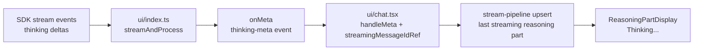

# Atomic CLI Thinking Stream Isolation — Technical Design Document / RFC

| Document Metadata      | Details           |
| ---------------------- | ----------------- |
| Author(s)              | lavaman131        |
| Status                 | Draft (WIP)       |
| Team / Owner           | Atomic CLI (TUI)  |
| Created / Last Updated | Pending RFC entry |

## 1. Executive Summary

The current TUI thinking pipeline can incorrectly group reasoning text from different stream producers into a single `Thinking...` block, resulting in mixed and confusing assistant output. The primary issue is identity loss: thinking deltas are accumulated as one mutable string, then routed through metadata and rendering paths that do not consistently preserve stream-level source identity. This RFC proposes end-to-end stream isolation for thinking updates by introducing a stable `thinkingSourceKey`, keyed accumulation maps, and deterministic message/part targeting in the stream pipeline. The result is that each stream updates only its own reasoning state, even when callbacks interleave during stream handoffs or interruptions. Expected impact: elimination of cross-stream reasoning contamination, improved correctness under concurrent or overlapping stream paths, and reduced regressions by aligning this feature with existing keyed-state patterns already used in SDK and UI layers. Research-driven references: `research/docs/2026-02-23-thinking-tag-stream-grouping.md`, `research/docs/2026-02-16-atomic-chat-architecture-current.md`, `research/docs/2026-02-12-tui-layout-streaming-content-ordering.md`.

## 2. Context and Motivation

### 2.1 Current State

Thinking output currently flows through this path:



- In `streamAndProcess`, thinking chunks are appended via single-string concatenation (`thinkingText += message.content`) and repeatedly emitted as one aggregated value.
- `ThinkingMetaEvent` currently carries text/timing fields but no stream/source identifier.
- Chat metadata handling applies updates to a shared `streamingMessageIdRef`, which can change as stream ownership transitions.
- The parts pipeline updates the last streaming reasoning part positionally, not by source identity.

Research references: `research/docs/2026-02-23-thinking-tag-stream-grouping.md`, `research/docs/2026-02-09-token-count-thinking-timer-bugs.md`, `research/docs/2026-02-16-atomic-chat-architecture-current.md`.

### 2.2 The Problem

- **User Impact:** Thinking text can appear merged across producers, showing malformed concatenated reasoning lines and reducing trust in output.
- **Product Impact:** Perceived instability in the TUI stream renderer, especially in sessions with interruptions, queueing, or sub-agent activity.
- **Technical Debt:** Metadata and rendering paths rely on shared mutable pointers and positional upserts rather than keyed correlation, which is inconsistent with other map-based state patterns in the codebase.

Research references: `research/docs/2026-02-23-thinking-tag-stream-grouping.md`, `research/docs/2026-02-12-tui-layout-streaming-content-ordering.md`.

## 3. Goals and Non-Goals

### 3.1 Functional Goals

- [ ] Guarantee that thinking deltas from different producers are never merged into a single reasoning stream unless explicitly intended.
- [ ] Preserve correct message targeting for thinking updates during stream interleaving, interruption, and stream generation changes.
- [ ] Keep reasoning rendering behavior compatible with current parts-based UI while making source routing deterministic.
- [ ] Maintain SDK parity (Claude/OpenCode/Copilot) by requiring provider-native source IDs for thinking metadata routing and failing fast when thinking events lack identity.
- [ ] Add automated regression coverage for cross-stream thinking contamination scenarios.

### 3.2 Non-Goals (Out of Scope)

- [ ] Full redesign of all message/text/tool streaming architecture.
- [ ] Changes to markdown rendering semantics for non-thinking content.
- [ ] New user-facing settings for thinking display format.
- [ ] Reworking pinned/inline task panel behavior unrelated to thinking stream identity.

## 4. Proposed Solution (High-Level Design)

### 4.1 System Architecture Diagram

```mermaid
flowchart TB
    classDef sdk fill:#4a90e2,stroke:#357abd,color:#fff
    classDef ui fill:#667eea,stroke:#5a67d8,color:#fff
    classDef pipe fill:#48bb78,stroke:#38a169,color:#fff
    classDef store fill:#718096,stroke:#4a5568,color:#fff

    A[SDK clients\nthinking events]:::sdk --> B[Stream Identity Adapter\nresolve thinkingSourceKey]:::ui
    B --> C[streamAndProcess\nkeyed accumulators]:::ui
    C --> D[thinking-meta event\n{ thinkingSourceKey, targetMessageId, ... }]:::ui
    D --> E[chat meta router\nvalidate stream generation + target]:::ui
    E --> F[stream-pipeline upsert\nby source key]:::pipe
    F --> G[Reasoning part registry\nsourceKey -> partId]:::store
    G --> H[ReasoningPartDisplay\nstable isolated blocks]:::pipe
```

### 4.2 Architectural Pattern

- Adopt a **Keyed Stream Correlation** pattern for thinking metadata.
- Treat thinking updates as **source-scoped state transitions** rather than message-global mutable text.
- Use deterministic correlation objects (`thinkingSourceKey`, `targetMessageId`, optional provider metadata) to route and upsert safely.

### 4.3 Key Components

| Component                                              | Responsibility                                                                       | Technology Stack                 | Justification                                              |
| ------------------------------------------------------ | ------------------------------------------------------------------------------------ | -------------------------------- | ---------------------------------------------------------- |
| Stream Identity Adapter (`ui/index.ts`)                | Resolve source key per thinking producer and attach correlation metadata             | TypeScript, existing stream loop | Eliminates identity loss at ingress point                  |
| Thinking Meta Router (`ui/chat.tsx`)                   | Apply thinking events only to bound message and active generation                    | React state + refs               | Prevents shared-ref misrouting during handoffs             |
| Stream Pipeline Upsert (`ui/parts/stream-pipeline.ts`) | Upsert reasoning parts by source key registry instead of positional last-part update | TypeScript parts pipeline        | Deterministic updates under interleaving                   |
| Reasoning Renderer (`reasoning-part-display.tsx`)      | Render isolated thinking content with current UX semantics                           | OpenTUI React components         | Preserves user-facing behavior while improving correctness |

Research references: `research/docs/2026-02-23-thinking-tag-stream-grouping.md`, `research/docs/2026-02-16-opencode-message-rendering-patterns.md`, `research/docs/2026-02-16-atomic-chat-architecture-current.md`.

## 5. Detailed Design

### 5.1 Internal Event Interfaces

Define a source-aware thinking metadata contract (names may be adjusted during implementation):

```ts
type ThinkingSourceKey = string;

interface ThinkingMetaEvent {
    type: "thinking-meta";
    thinkingSourceKey: ThinkingSourceKey;
    targetMessageId: string;
    streamGeneration: number;
    thinkingText: string;
    thinkingMs?: number;
    includeReasoningPart?: boolean;
    provider?: "claude" | "opencode" | "copilot" | "unknown";
}
```

Contract notes:

- `thinkingSourceKey` is mandatory for all thinking events.
- `targetMessageId` is captured at stream start and remains immutable for that source key.
- `streamGeneration` prevents stale callbacks from writing into newer streams.

Research references: `research/docs/2026-02-23-thinking-tag-stream-grouping.md`, `research/docs/2026-02-16-atomic-chat-architecture-current.md`.

### 5.2 Data Model / State Schema

Use explicit keyed maps to track active thinking state:

| Store                   | Key                 | Value                       | Lifecycle                                                               |
| ----------------------- | ------------------- | --------------------------- | ----------------------------------------------------------------------- |
| `thinkingTextBySource`  | `thinkingSourceKey` | accumulated text snapshot   | Created on first thinking chunk, cleared on stream completion/interrupt |
| `messageBySource`       | `thinkingSourceKey` | immutable `targetMessageId` | Bound at stream start, cleared at source finalize                       |
| `reasoningPartBySource` | `thinkingSourceKey` | reasoning part id/index     | Created on first upsert, reused for updates, removed at finalize        |
| `generationBySource`    | `thinkingSourceKey` | `streamGeneration`          | Used for stale-event rejection                                          |

This mirrors existing map-based patterns used in SDK session and UI streaming state management.

Research references: `research/docs/2026-02-23-thinking-tag-stream-grouping.md`, `research/docs/2026-02-16-atomic-chat-architecture-current.md`.

### 5.3 Algorithms and State Management

Core algorithm for processing thinking events:

```text
On stream start:
1) Resolve thinkingSourceKey from provider-native stream identity
2) Bind thinkingSourceKey -> targetMessageId and streamGeneration

On thinking chunk:
3) Validate event streamGeneration matches generationBySource
4) Append chunk to thinkingTextBySource[sourceKey]
5) Emit ThinkingMetaEvent with sourceKey + targetMessageId + full snapshot

On chat meta handling:
6) Reject event if targetMessageId no longer exists or generation mismatch
7) Route event directly to stream-pipeline with source key

On pipeline upsert:
8) Find/create reasoning part via reasoningPartBySource[sourceKey]
9) Update only that part's content/timing

On finalize/interrupt:
10) Mark source closed and cleanup all source-scoped maps
11) Ignore late events for closed source
```

### 5.4 Message and Rendering Behavior

- Keep current `Thinking...` visual affordance and markdown rendering semantics.
- Render concurrent sources as separate reasoning blocks, each bound to a unique `thinkingSourceKey`.
- Preserve compatibility with single-source streams (no visible behavior change expected in standard runs).

Research references: `research/docs/2026-02-23-thinking-tag-stream-grouping.md`, `research/docs/2026-02-12-tui-layout-streaming-content-ordering.md`, `research/docs/2026-02-15-ui-inline-streaming-vs-pinned-elements.md`.

### 5.5 Failure Modes and Guards

- **Late event after finalize (selected policy):** strictly drop event and increment diagnostic counter.
- **Missing provider-native ID with thinking event present:** fail fast with an explicit stream error (contract violation).
- **Non-reasoning models:** do not error solely due to missing reasoning identity when no thinking events are emitted.
- **Generation mismatch:** reject as stale callback.
- **Missing message binding:** no-op with debug log entry.
- **Registry desync:** recreate mapping on first valid event and continue.

### 5.6 Testing Approach (Design-Level)

- Unit tests for source key generation and message binding invariants.
- Unit tests for stale generation rejection.
- Unit tests for per-source upsert in stream pipeline.
- Integration tests simulating interleaved thinking chunks across two active sources.
- Regression test for observed broken output example (concatenated thinking text).
- SDK parity tests ensuring all clients provide stable provider-native source keys for reasoning-capable paths.
- Contract tests ensuring missing source identity on emitted thinking events raises a clear error, while non-reasoning runs proceed normally.

## 6. Alternatives Considered

| Option                                            | Pros                                                    | Cons                                                                   | Reason for Rejection                                |
| ------------------------------------------------- | ------------------------------------------------------- | ---------------------------------------------------------------------- | --------------------------------------------------- |
| Keep current shared string + shared message ref   | Minimal code change                                     | Cross-stream contamination remains; race-prone                         | Does not solve root cause                           |
| Message-level isolation only (no source key)      | Simpler than full correlation                           | Fails when multiple producers target same message during overlap       | Insufficient for concurrent paths                   |
| Provider-specific fixes only (Claude path first)  | Fast narrow mitigation                                  | Leaves SDK parity gaps; complexity duplicated per provider             | Inconsistent and fragile                            |
| **Selected: Source-keyed correlation end-to-end** | Deterministic routing, SDK parity, regression-resistant | Requires coordinated type/state updates and strict identity validation | Best alignment with existing keyed-map architecture |

## 7. Cross-Cutting Concerns

### 7.1 Security and Privacy

- No new external API surface or privilege boundary changes.
- No additional sensitive data persisted; only transient in-memory routing keys.
- Logging for diagnostics should avoid recording full thinking text in non-debug mode.

### 7.2 Observability Strategy

- Add counters for dropped stale thinking events and missing binding events.
- Add lightweight debug traces for source-key lifecycle: create/update/finalize/drop.
- Keep telemetry additive and guard under existing diagnostics flags.

### 7.3 Scalability and Capacity Planning

- Map-based state is bounded by number of active streams in a session.
- Cleanup on finalize/interrupt prevents unbounded growth.
- Expected overhead is low relative to existing per-stream metadata handling.

## 8. Migration, Rollout, and Testing

### 8.1 Deployment Strategy

- [ ] **Phase 1:** Add source-aware metadata types and stream identity adapter.
- [ ] **Phase 2:** Route thinking meta through chat and pipeline using keyed targeting.
- [ ] **Phase 3:** Add regression tests for interleaving/stale callbacks and verify SDK parity.
- [ ] **Phase 4:** Enable diagnostics counters and validate behavior across CLI chat paths.

### 8.2 Data Migration Plan

- No persisted schema migration required.
- In-memory state migration is handled by default initialization and cleanup logic.

### 8.3 Test Plan

- **Unit Tests:** source key generation, event validation, keyed upsert behavior.
- **Integration Tests:** multi-source interleaving, stream handoff/interrupt transitions.
- **End-to-End Tests:** reproduce prior grouping bug and verify isolated reasoning rendering.
- **Manual Validation:** run chat sessions with each SDK, interruption flows, and queued follow-up prompts.

Research references: `research/docs/2026-02-23-thinking-tag-stream-grouping.md`, `research/docs/2026-02-09-token-count-thinking-timer-bugs.md`.

## 9. Open Questions / Unresolved Issues

- [x] **Canonical source key format:** `thinkingSourceKey` is provider-native only; no synthetic fallback for thinking metadata routing.
- [x] **UI behavior for concurrent sources:** Render separate reasoning blocks per `thinkingSourceKey`.
- [x] **Late-event policy:** Strictly drop post-finalize thinking events and track diagnostics.
- [x] **Provider parity contract:** Fail fast when a thinking event lacks stable source identity; do not fail non-reasoning model runs that emit no thinking events.

Research references: `research/docs/2026-02-23-thinking-tag-stream-grouping.md`.
