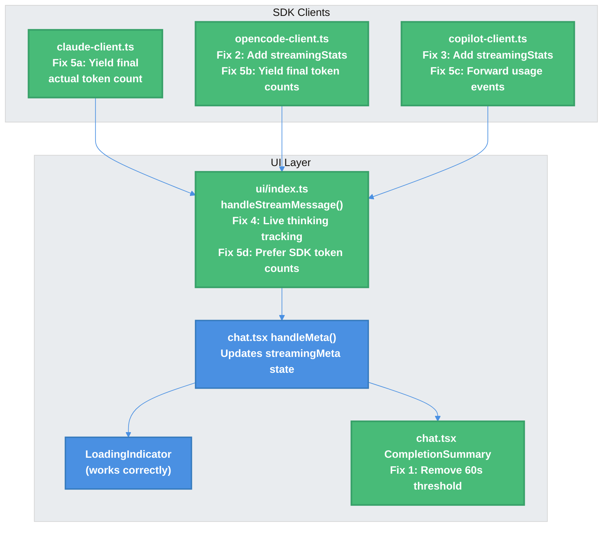

# Token Count & Thinking Timer Display Bugs — Technical Design Document

| Document Metadata      | Details     |
| ---------------------- | ----------- |
| Author(s)              | Alex Lavaee |
| Status                 | Draft (WIP) |
| Team / Owner           | Atomic CLI  |
| Created / Last Updated | 2026-02-09  |

## 1. Executive Summary

Multiple display and data accuracy bugs exist in the Atomic CLI TUI's streaming metadata pipeline. The thinking timer ("thought for Xs") never shows for OpenCode and Copilot SDKs because their clients yield `type: "thinking"` messages without the `metadata.streamingStats` field that the UI handler requires. All three SDKs provide actual token counts — Claude via `message_delta` events, OpenCode via `result.data.info?.tokens`, and Copilot via `assistant.usage` events — but the UI ignores all of them and relies on a `charCount / 4` character-based estimation. The Claude client also has a `message_delta` accumulation bug: it uses `+=` on a cumulative value, causing potential double-counting. This spec proposes five targeted fixes across the UI and SDK layers to restore the target display format with accurate token counts: `✶ Fermenting… (6m 22s · ↓ 16.7k tokens · thought for 54s)`.

> **Research reference**: [`research/docs/2026-02-09-token-count-thinking-timer-bugs.md`](../research/docs/2026-02-09-token-count-thinking-timer-bugs.md)

## 2. Context and Motivation

### 2.1 Current State

The streaming metadata pipeline has three layers:

```
SDK Client (claude/opencode/copilot)
  → yields AgentMessage { type, content, role, metadata? }
    → ui/index.ts handleStreamMessage() processes stream
      → calls onMeta({ outputTokens, thinkingMs }) on each chunk
        → chat.tsx handleMeta() updates streamingMeta state
          → LoadingIndicator renders during streaming
          → CompletionSummary renders after completion (if >= 60s)
```

**During streaming**, the `LoadingIndicator` component (`src/ui/chat.tsx:751`) receives and displays token counts via `streamingMeta` — but the counts are estimated via `charCount / 4` (`src/ui/index.ts:671`) rather than using actual SDK-reported token counts. When streaming ends, the `LoadingIndicator` unmounts (`message.streaming` becomes `false`) and the `CompletionSummary` component (`src/ui/chat.tsx:854`) is supposed to take over — but it is gated behind `durationMs >= 60000` at `src/ui/chat.tsx:1309`.

**For thinking duration**, `ui/index.ts:674-681` only updates `thinkingMs` when it sees `message.metadata.streamingStats`. Only the Claude SDK provides this field; OpenCode and Copilot SDKs yield thinking messages without any metadata.

### 2.2 The Problem

- **Token accuracy gap**: All three SDKs provide actual token counts (Claude via `message_delta`, OpenCode via `result.data.info?.tokens`, Copilot via `assistant.usage` events), but the UI ignores all of them and uses `Math.round(charCount / 4)` — a rough heuristic that can deviate significantly from actual usage, especially for code-heavy or non-English content.
- **Claude `message_delta` bug**: The current code at `claude-client.ts:479` uses `outputTokens += usage.output_tokens`, but the Anthropic API's `message_delta.usage.output_tokens` is cumulative (total so far), not incremental. This double-counts if `message_delta` fires more than once.
- **SDK parity gap**: OpenCode and Copilot users never see "thought for Xs" even for long responses, because their SDKs don't provide `streamingStats` metadata.
- **Claude SDK gap**: Even for Claude, thinking duration only updates at `content_block_stop` (end of each thinking block), not in real-time during active thinking.

## 3. Goals and Non-Goals

### 3.1 Functional Goals

- [ ] **G1**: Show `CompletionSummary` (duration, token count, thinking time) for completed responses >= 60 seconds, with accurate (not estimated) data
- [ ] **G2**: Display real-time "thought for Xs" during streaming for all three SDKs (Claude, OpenCode, Copilot)
- [ ] **G3**: Propagate `streamingStats` metadata from OpenCode and Copilot SDK clients so the UI handler can update thinking duration
- [ ] **G4**: Provide live thinking duration updates during active thinking blocks (not just at block end)
- [ ] **G5**: Replace `charCount / 4` estimation with actual SDK-reported token counts — Claude via `message_delta` events during streaming, OpenCode via `result.data.info?.tokens` at completion, Copilot via `assistant.usage` events per-turn

### 3.2 Non-Goals (Out of Scope)

- [ ] Refactor the `AgentMessage` type system or `MessageMetadata` interface
- [ ] Modify the `LoadingIndicator` component behavior during streaming (it already works correctly)
- [ ] Add per-chunk real-time token counts — no SDK provides this; token events fire at message/turn boundaries

## 4. Proposed Solution (High-Level Design)

### 4.1 System Architecture Diagram

The fix touches five points in the pipeline, highlighted below:



### 4.2 Fix Overview

| Fix   | File                                 | Description                                                                           | Bug Addressed                                 |
| ----- | ------------------------------------ | ------------------------------------------------------------------------------------- | --------------------------------------------- |
| Fix 1 | `src/ui/chat.tsx:1309`               | Keep `>= 60000` threshold; ensure `CompletionSummary` shows accurate SDK token counts | Token/thinking data was estimated, not actual |
| Fix 2 | `src/sdk/opencode-client.ts:949-954` | Add wall-clock thinking timing and emit `streamingStats` metadata                     | No thinking timer for OpenCode                |
| Fix 3 | `src/sdk/copilot-client.ts:311-318`  | Add wall-clock thinking timing and emit `streamingStats` metadata                     | No thinking timer for Copilot                 |
| Fix 4 | `src/ui/index.ts:673-682`            | Add live wall-clock thinking estimation for all SDKs during active thinking           | Thinking timer only updates at block end      |
| Fix 5 | SDK clients + `src/ui/index.ts`      | Replace `charCount / 4` with actual SDK token counts propagated via `streamingStats`  | Inaccurate token estimation across all SDKs   |

## 5. Detailed Design

### 5.1 Fix 1: CompletionSummary Data Accuracy

**File**: `src/ui/chat.tsx:1309`

**Current code**:
```typescript
{!message.streaming && message.durationMs != null && message.durationMs >= 60000 && (
  <box marginTop={1}>
    <CompletionSummary durationMs={message.durationMs} outputTokens={message.outputTokens} thinkingMs={message.thinkingMs} />
  </box>
)}
```

**Change**: Keep the `>= 60000` threshold (1 minute). The threshold itself is correct — the `LoadingIndicator` already shows live stats during streaming for shorter responses. The real fix is ensuring that the `outputTokens` and `thinkingMs` baked into the `ChatMessage` at completion (via `handleComplete` at `chat.tsx:3695-3696`) contain **actual SDK-reported values** rather than `charCount / 4` estimates. This is achieved by Fixes 2-5, which propagate real data through the `streamingMeta` pipeline.

For testing, temporarily lower to `>= 5000` (5 seconds) to verify end-to-end data flow without waiting a full minute.

### 5.2 Fix 2: OpenCode Thinking Metadata

**File**: `src/sdk/opencode-client.ts`

**Current code** (`line 949-954`):
```typescript
} else if (part.type === "reasoning" && part.text) {
  yield {
    type: "thinking" as const,
    content: part.text,
    role: "assistant" as const,
  };
}
```

**Change**: Add wall-clock timing variables before the stream loop and emit `streamingStats` metadata with each thinking yield.

```typescript
// Before the streaming loop, declare:
let reasoningStartMs: number | null = null;
let reasoningDurationMs = 0;

// In the reasoning handler:
} else if (part.type === "reasoning" && part.text) {
  if (reasoningStartMs === null) {
    reasoningStartMs = Date.now();
  }
  yield {
    type: "thinking" as const,
    content: part.text,
    role: "assistant" as const,
    metadata: {
      streamingStats: {
        thinkingMs: reasoningDurationMs + (Date.now() - reasoningStartMs),
        outputTokens: 0,
      },
    },
  };
}

// After the reasoning handler, when a non-reasoning part arrives:
if (part.type !== "reasoning" && reasoningStartMs !== null) {
  reasoningDurationMs += Date.now() - reasoningStartMs;
  reasoningStartMs = null;
}
```

This mirrors the Claude SDK's approach (`src/sdk/claude-client.ts:437-471`) but provides intermediate updates during thinking rather than only at block end.

**SDK note**: The OpenCode `ReasoningPart` type exposes `time: { start: number, end?: number }` fields. Per investigation of the `sst/opencode` source: `time.start` is set via `Date.now()` at `reasoning-start`, `time.end` via `Date.now()` at `reasoning-end`, and a flush handler guarantees `reasoning-end` is always emitted. However, `time.end` is only set when reasoning **completes** — during active reasoning, only `time.start` is available. Additionally, Atomic's SSE handler (`opencode-client.ts:448-498`) ignores reasoning parts entirely during streaming; they're only processed post-completion from `result.data.parts`. Wall-clock tracking in the Atomic client provides equivalent real-time accuracy and is consistent across all three SDKs.

### 5.3 Fix 3: Copilot Thinking Metadata

**File**: `src/sdk/copilot-client.ts`

**Current code** (`line 311-318`):
```typescript
} else if (event.type === "assistant.reasoning_delta") {
  hasYieldedDeltas = true;
  chunks.push({
    type: "thinking",
    content: event.data.deltaContent,
    role: "assistant",
  });
  notifyConsumer();
}
```

**Change**: Same wall-clock approach as OpenCode:

```typescript
// Before the event loop, declare:
let reasoningStartMs: number | null = null;
let reasoningDurationMs = 0;

// In the reasoning_delta handler:
} else if (event.type === "assistant.reasoning_delta") {
  if (reasoningStartMs === null) {
    reasoningStartMs = Date.now();
  }
  hasYieldedDeltas = true;
  chunks.push({
    type: "thinking",
    content: event.data.deltaContent,
    role: "assistant",
    metadata: {
      streamingStats: {
        thinkingMs: reasoningDurationMs + (Date.now() - reasoningStartMs),
        outputTokens: 0,
      },
    },
  });
  notifyConsumer();
}

// When non-reasoning events arrive after reasoning:
if (event.type !== "assistant.reasoning_delta" && reasoningStartMs !== null) {
  reasoningDurationMs += Date.now() - reasoningStartMs;
  reasoningStartMs = null;
}
```

**SDK note**: Copilot provides `assistant.usage` events with a `duration` field, but no explicit reasoning duration. The Copilot SDK also does not provide timing data on individual `reasoning_delta` events. Wall-clock tracking is the only viable approach.

### 5.4 Fix 4: Live Thinking Duration in UI Handler

**File**: `src/ui/index.ts`

**Current code** (`line 673-682`):
```typescript
else if (message.type === "thinking" && message.metadata) {
  const stats = message.metadata.streamingStats as
    | { thinkingMs: number; outputTokens: number }
    | undefined;
  if (stats) {
    thinkingMs = stats.thinkingMs;
    onMeta?.({ outputTokens: Math.round(charCount / 4), thinkingMs });
  }
}
```

**Change**: Add a local wall-clock tracker so thinking duration updates in real-time for all SDKs, even those without `streamingStats`. When `streamingStats` is present, prefer that authoritative value.

```typescript
// Declare before the stream loop (alongside charCount and thinkingMs):
let thinkingStartLocal: number | null = null;

// Replace the thinking handler:
else if (message.type === "thinking") {
  // Start local wall-clock timer on first thinking message
  if (thinkingStartLocal === null) {
    thinkingStartLocal = Date.now();
  }

  const stats = message.metadata?.streamingStats as
    | { thinkingMs: number; outputTokens: number }
    | undefined;

  if (stats) {
    // Authoritative value from SDK — use it and reset local timer
    thinkingMs = stats.thinkingMs;
    thinkingStartLocal = null;
  } else {
    // Live estimation: accumulated + current block duration
    thinkingMs = thinkingMs + (Date.now() - thinkingStartLocal);
    // Don't reset thinkingStartLocal — keep accumulating
  }
  onMeta?.({ outputTokens: Math.round(charCount / 4), thinkingMs });
}

// When a non-thinking message arrives and we were tracking thinking:
if (message.type !== "thinking" && thinkingStartLocal !== null) {
  thinkingMs = thinkingMs + (Date.now() - thinkingStartLocal);
  thinkingStartLocal = null;
}
```

**Interaction with Fixes 2 & 3**: With Fixes 2 and 3 in place, OpenCode and Copilot will already provide `streamingStats` on each thinking chunk. Fix 4 provides a defense-in-depth fallback — if an SDK doesn't provide stats, the UI still shows live thinking duration. This also gives live thinking for the Claude SDK, which currently only reports at `content_block_stop`.

**Note on double-counting**: The `thinkingStartLocal` tracker in the UI layer and the `streamingStats` from the SDK may diverge slightly due to message buffering latency. When `streamingStats` is present, it always takes precedence. The local tracker is only used when `streamingStats` is absent.

### 5.5 Fix 5: Replace `charCount / 4` with Actual SDK Token Counts

The `charCount / 4` heuristic at `src/ui/index.ts:671` is used uniformly for all SDKs, even though each SDK provides actual token counts — they're just not propagated to the UI. No SDK provides per-chunk real-time token counts, but all three report actual counts at message or turn boundaries.

**Approach**: Use `charCount / 4` to keep the display updating continuously during active streaming. Each SDK yields a final metadata message carrying the actual token count once it becomes available (at or near the end of the stream). The UI handler picks up this count for the final `onMeta` call, which `handleComplete` captures into the `ChatMessage`. The `CompletionSummary` then displays the accurate count.

#### 5.5.1 SDK Capability Matrix for Token Counts

| SDK      | Token Source                     | When Available                                   | Fields                                                                                         | Granularity           |
| -------- | -------------------------------- | ------------------------------------------------ | ---------------------------------------------------------------------------------------------- | --------------------- |
| Claude   | `message_delta` stream event     | Once, near end of stream (before `message_stop`) | `usage.output_tokens` (cumulative)                                                             | Per-message           |
| Claude   | `assistant` message (completion) | Per-turn                                         | `message.usage.input_tokens`, `message.usage.output_tokens`                                    | Per-turn              |
| OpenCode | `result.data.info?.tokens`       | After `session.prompt()` resolves                | `tokens.input`, `tokens.output`, `tokens.reasoning`, `tokens.cache.read`, `tokens.cache.write` | Per-prompt (end only) |
| Copilot  | `assistant.usage` event          | Once per assistant turn                          | `inputTokens`, `outputTokens`, `cacheReadTokens`, `cacheWriteTokens`                           | Per-turn              |

#### 5.5.2 Fix 5a: Claude — Fix `message_delta` Accumulation + Yield Actual Token Count

**File**: `src/sdk/claude-client.ts`

The Claude client tracks `outputTokens` from `message_delta` events at line 475-482, but has two issues:

1. **Bug**: The code does `outputTokens += usage.output_tokens` (additive). Per the Anthropic API docs, `message_delta.usage.output_tokens` is **cumulative** (total output tokens so far), not incremental. If `message_delta` fires more than once, this double-counts. Fix: use direct assignment.
2. **Gap**: The `outputTokens` value is only surfaced via `streamingStats` on `content_block_stop` thinking yields (line 470), never on text deltas.

**Change 1**: Fix the `message_delta` handler at line 475-482 — use assignment instead of addition:

```typescript
// Before (BUG — double-counts if message_delta fires more than once):
if (usage?.output_tokens) {
  outputTokens += usage.output_tokens;
}

// After (CORRECT — cumulative value, direct assignment):
if (usage?.output_tokens) {
  outputTokens = usage.output_tokens;
}
```

**Change 2**: After the `for await` streaming loop exits, yield a final metadata-only message with the actual `outputTokens`:

```typescript
// After the for-await loop over newQuery:
if (outputTokens > 0 || thinkingDurationMs > 0) {
  yield {
    type: "text" as const,
    content: "",
    role: "assistant" as const,
    metadata: {
      streamingStats: {
        outputTokens,
        thinkingMs: thinkingDurationMs,
      },
    },
  };
}
```

The `message_delta` event fires before `message_stop`, so `outputTokens` holds the final cumulative count by the time the loop exits. The UI receives the real count in one final `onMeta` call.

#### 5.5.3 Fix 5b: OpenCode — Yield Final Token Counts at Completion

**File**: `src/sdk/opencode-client.ts`

The OpenCode SDK provides no token events during streaming. Token data (`result.data.info?.tokens`) is only available after `session.prompt()` completes (line 1003).

**Change**: After the existing token extraction at line 1003-1014, yield a metadata-only message with actual token counts:

```typescript
// After line 1014 (existing token extraction from result.data.info?.tokens):
const tokens = result.data.info?.tokens;
if (tokens) {
  sessionState.inputTokens = tokens.input ?? sessionState.inputTokens;
  sessionState.outputTokens = tokens.output ?? 0;
  // ... existing cache token logic ...

  // Yield actual token counts to UI
  yield {
    type: "text" as const,
    content: "",
    role: "assistant" as const,
    metadata: {
      streamingStats: {
        outputTokens: sessionState.outputTokens,
        thinkingMs: reasoningDurationMs,
      },
    },
  };
}
```

The empty-content text message won't affect the displayed message (the UI appends empty string — no visible change). The `streamingStats` updates the UI's token count right before streaming ends.

#### 5.5.4 Fix 5c: Copilot — Forward `assistant.usage` Event Token Data

**File**: `src/sdk/copilot-client.ts`

The Copilot SDK emits `assistant.usage` events per-turn with `inputTokens` and `outputTokens`. These are handled by `handleSdkEvent` (line 434) which updates `state.inputTokens` and `state.outputTokens`, but this data never reaches the streaming generator's `eventHandler` (line 302).

**Change**: Add `assistant.usage` handling in the streaming generator's `eventHandler` to forward token counts:

```typescript
// Inside the eventHandler function (line 302), add:
} else if (event.type === "assistant.usage") {
  chunks.push({
    type: "text",
    content: "",
    role: "assistant",
    metadata: {
      streamingStats: {
        outputTokens: state.outputTokens,
        thinkingMs: reasoningDurationMs,
      },
    },
  });
  notifyConsumer();
}
```

**Ordering note**: The `eventHandler` (line 302) and `handleSdkEvent` (line 225) are both wildcard subscriptions on the same `sdkSession.on()` event bus. The Copilot SDK dispatches events synchronously via `_dispatchEvent`, iterating the handler `Set` in insertion order. Since `handleSdkEvent` is registered first (line 225, during `wrapSession`), it always executes before the streaming `eventHandler` (line 349, during `stream()`). By the time the streaming handler fires, `handleSdkEvent` has already accumulated `state.outputTokens += event.data.outputTokens`. Therefore, `state.outputTokens` already reflects the current turn — just read it directly. Do **not** add `event.data.outputTokens` on top, as that would double-count.

#### 5.5.5 Fix 5d: UI Handler — Use SDK Token Counts When Present

**File**: `src/ui/index.ts`

**Current code** (line 668-671):
```typescript
if (message.type === "text" && typeof message.content === "string") {
  onChunk(message.content);
  charCount += message.content.length;
  onMeta?.({ outputTokens: Math.round(charCount / 4), thinkingMs });
}
```

**Change**: Check each message for `streamingStats.outputTokens`. When present, use it; otherwise continue with the `charCount / 4` estimation. No additional state variable is needed — each `onMeta` call independently decides the source:

```typescript
if (message.type === "text" && typeof message.content === "string") {
  if (message.content.length > 0) {
    onChunk(message.content);
    charCount += message.content.length;
  }

  // Use SDK-reported token count if present, otherwise estimate
  const stats = message.metadata?.streamingStats as
    | { outputTokens?: number; thinkingMs?: number }
    | undefined;
  if (stats?.thinkingMs != null) {
    thinkingMs = stats.thinkingMs;
  }
  const outputTokens = (stats?.outputTokens && stats.outputTokens > 0)
    ? stats.outputTokens
    : Math.round(charCount / 4);

  onMeta?.({ outputTokens, thinkingMs });
}
```

**Behavior per SDK**:
- **Claude**: Text deltas carry no `streamingStats` → `charCount / 4` keeps the display updating throughout streaming. After the streaming loop exits, the final metadata message (Fix 5a) carries the real `outputTokens`. This becomes the last `onMeta` call, and `handleComplete` captures it into the `ChatMessage`.
- **OpenCode**: Same pattern — `charCount / 4` during active streaming, then Fix 5b's metadata message provides the real count at completion.
- **Copilot**: Same pattern — `charCount / 4` during text streaming within a turn, then Fix 5c's `assistant.usage` forwarding provides the real count at the end of each turn.

The thinking handler (Fix 4) should also use SDK counts when present:

```typescript
// In the thinking handler, replace the onMeta call:
const stats = message.metadata?.streamingStats as
  | { outputTokens?: number }
  | undefined;
const outputTokens = (stats?.outputTokens && stats.outputTokens > 0)
  ? stats.outputTokens
  : Math.round(charCount / 4);
onMeta?.({ outputTokens, thinkingMs });
```

### 5.6 Data Flow After Fixes

```
1. SDK Client yields text deltas (during active streaming)
   → ui/index.ts: charCount += content.length
   → no streamingStats on these messages → uses Math.round(charCount / 4)
   → calls onMeta({ outputTokens: estimated, thinkingMs })
   → chat.tsx: handleMeta() → setStreamingMeta(meta)
   → LoadingIndicator updates continuously: "✶ Fermenting… (12s · ↓ ~1.2k tokens)"

2. SDK Client yields thinking messages (during active thinking)
   → ui/index.ts: updates thinkingMs from streamingStats OR local wall-clock
   → calls onMeta({ outputTokens: estimated, thinkingMs })
   → LoadingIndicator updates: "✶ Fermenting… (15s · ↓ ~1.2k tokens · thought for 3s)"

3. SDK yields final metadata message (at/near end of stream)
   Claude: after streaming loop exits (outputTokens from message_delta)
   OpenCode: after session.prompt() resolves (tokens from result.data.info)
   Copilot: on assistant.usage event (per-turn)
   → ui/index.ts: streamingStats.outputTokens > 0 → uses real count
   → calls onMeta({ outputTokens: actual, thinkingMs })
   → LoadingIndicator shows accurate count: "✶ Fermenting… (18s · ↓ 1.4k tokens · thought for 5s)"

4. Streaming ends
   → handleComplete() captures finalMeta from streamingMetaRef (actual count)
   → Bakes into ChatMessage { durationMs, outputTokens, thinkingMs }
   → LoadingIndicator unmounts
   → CompletionSummary renders: "✻ Worked for 18s · ↓ 1.4k tokens · thought for 5s"
```

## 6. Alternatives Considered

| Option                                                                                             | Pros                                                                                                      | Cons                                                                                                                 | Reason for Rejection                                                                      |
| -------------------------------------------------------------------------------------------------- | --------------------------------------------------------------------------------------------------------- | -------------------------------------------------------------------------------------------------------------------- | ----------------------------------------------------------------------------------------- |
| Only fix the 60s threshold (Fix 1 alone)                                                           | Simplest change, shows token count for all responses                                                      | Thinking timer still broken for OpenCode/Copilot; token counts still estimated                                       | Doesn't address thinking timer or token accuracy bugs                                     |
| Move all timing to UI layer only (no SDK changes)                                                  | Single-layer fix, no SDK client changes needed                                                            | UI can't distinguish thinking from text without SDK cooperation; token counts remain estimated                       | Less accurate; SDKs already have the data, just need to propagate it                      |
| Use SDK-provided timing fields (OpenCode `ReasoningPart.time`, Copilot `assistant.usage.duration`) | More accurate than wall-clock                                                                             | OpenCode `time.end` only set at reasoning completion (not real-time); Copilot has no per-block timing                | Wall-clock is consistent across all SDKs and matches existing Claude approach             |
| Keep `charCount / 4` for token estimation                                                          | No SDK changes needed for tokens                                                                          | Inaccurate: 4 chars/token is a rough English-text heuristic; code, JSON, and non-Latin scripts deviate significantly | All SDKs provide actual counts — no reason to estimate                                    |
| **Selected: Wall-clock timing + SDK token counts + UI fallback (Fixes 1-5)**                       | Consistent approach across all SDKs; actual token counts when available; defense-in-depth via UI fallback | Slight wall-clock inaccuracy for thinking; token counts may arrive late in stream (estimation used until then)       | **Selected**: Uses real data from each SDK while maintaining consistent fallback behavior |

## 7. Cross-Cutting Concerns

### 7.1 Type Safety

The `MessageMetadata` interface (`src/sdk/types.ts:150-166`) uses an index signature `[key: string]: unknown`, so adding `streamingStats` to metadata is already type-compatible. No type changes are needed.

However, the `streamingStats` object is currently untyped (cast via `as` in the UI handler). A follow-up could add:

```typescript
interface StreamingStats {
  thinkingMs: number;
  outputTokens: number;
}
```

to `MessageMetadata` for better type safety. This is not required for the fix but is recommended.

### 7.2 Performance

- Wall-clock `Date.now()` calls are cheap (~nanoseconds). Adding them per-chunk is negligible.
- The `onMeta` callback triggers React state updates (`setStreamingMeta`). This is already happening on every text chunk (`src/ui/index.ts:671`), so adding it for thinking chunks adds no new overhead pattern.

### 7.3 Backwards Compatibility

- `CompletionSummary` already gracefully handles missing `outputTokens` and `thinkingMs` (renders only duration if no other data is present). Lowering the threshold won't cause display regressions.
- SDK clients adding `metadata.streamingStats` to existing `type: "thinking"` yields is additive — no consumers break.
- The `ui/index.ts` handler change is backwards-compatible: it still accepts `streamingStats` when present and falls back to wall-clock when not.

## 8. Migration, Rollout, and Testing

### 8.1 Deployment Strategy

All five fixes can ship together in a single PR. No feature flags or phased rollout required — these are display-only bug fixes with no data model or API changes.

### 8.2 Test Plan

- **Unit Tests**:
  - `CompletionSummary` renders with actual SDK token counts (not `charCount / 4` estimates)
  - Claude client `message_delta` handler uses direct assignment (`=`) not additive (`+=`) for `outputTokens`
  - OpenCode client yields `streamingStats` metadata on thinking messages
  - Copilot client yields `streamingStats` metadata on thinking messages
  - `handleStreamMessage` updates `thinkingMs` for messages without `streamingStats` (wall-clock fallback)
  - `handleStreamMessage` prefers `streamingStats.thinkingMs` when present
  - Claude client yields final metadata message with actual `outputTokens` after streaming loop exits
  - OpenCode client yields final metadata message with actual token counts from `result.data.info?.tokens`
  - Copilot client yields metadata message with actual token counts from `assistant.usage` events
  - `handleStreamMessage` uses `streamingStats.outputTokens` when present and > 0, falls back to `charCount / 4` otherwise
  - `handleStreamMessage` skips `onChunk` for empty-content metadata messages (no UI artifacts)

- **Integration / E2E Tests**:
  - Test with Claude SDK: verify thinking timer shows during active thinking (not just at block end)
  - Test with OpenCode SDK: verify "thought for Xs" appears during and after streaming
  - Test with Copilot SDK: verify "thought for Xs" appears during and after streaming
  - Test with `>= 5000` threshold: verify `CompletionSummary` renders with accurate (not estimated) token count for short responses
  - Test response with no thinking: verify `CompletionSummary` shows duration and tokens but not thinking
  - Restore `>= 60000` threshold after verification
  - Test token count accuracy: compare displayed token count against actual SDK-reported count (should match exactly at completion for all three SDKs)
  - Test transition from estimation to actual: verify no visual glitch when `charCount / 4` switches to SDK count mid-stream

- **Manual Testing**:
  - `bun run ~/Documents/projects/atomic/src/cli.ts chat -a claude` — ask a question requiring thinking, verify live "thought for Xs" counter and accurate token count at completion
  - `bun run ~/Documents/projects/atomic/src/cli.ts chat -a opencode` — same test; verify token count updates from estimate to actual at completion
  - `bun run ~/Documents/projects/atomic/src/cli.ts chat -a copilot` — same test; verify token count updates when `assistant.usage` event fires
  - For all three: verify that after the response completes, `CompletionSummary` shows: `✻ Worked for Xs · ↓ X.Xk tokens · thought for Xs` with accurate (not estimated) token counts

## 9. Resolved Questions

The following questions were investigated during spec development. All are resolved.

- [x] **Threshold value**: Keep `>= 60000` (1 minute) for production. The `LoadingIndicator` already shows live stats during streaming for shorter responses. Use `>= 5000` (5 seconds) temporarily during testing to verify end-to-end data flow.

- [x] **OpenCode `ReasoningPart.time` fields**: Investigated via `sst/opencode` source. The fields **are reliably populated** — `time.start` is set via `Date.now()` at `reasoning-start`, `time.end` via `Date.now()` at `reasoning-end`, and the flush handler guarantees `reasoning-end` is always emitted. However, they are **not useful for real-time tracking**: `time.end` is only set when reasoning completes, and Atomic's SSE handler (`opencode-client.ts:448-498`) ignores reasoning parts entirely during streaming — they're only processed post-completion from `result.data.parts`. Wall-clock timing in the Atomic client provides equivalent accuracy and is consistent across all three SDKs. `ReasoningPart.time` could be used as a validation/calibration tool in a follow-up to measure IPC latency.

- [x] **Wall-clock vs. SDK timing divergence**: No logging or assertions needed. Both sources use `Date.now()` wall-clock timing. The divergence is bounded by message buffering latency (negligible for this use case). When `streamingStats` is present, it takes precedence; the local tracker is only a fallback.

- [x] **Claude `message_delta` accumulation semantics**: Confirmed via Anthropic API docs: `message_delta.usage.output_tokens` is **cumulative** (total output tokens so far), not incremental. The `message_delta` event can fire one or more times per stream. The current code at `claude-client.ts:479` (`outputTokens += usage.output_tokens`) is a **bug** — it double-counts if `message_delta` fires more than once. Fix 5a corrects this to a direct assignment: `outputTokens = usage.output_tokens`.

- [x] **Empty-content text messages**: Confirmed safe. The placeholder assistant message is created at `chat.tsx:3617-3620` **before** streaming starts with `content: ""` and `streaming: true`. `handleComplete` at `chat.tsx:3638` locates the message by `streamingMessageIdRef.current` and does not depend on `handleChunk` having been called. The `onChunk("")` call would be a no-op anyway (`msg.content + "" === msg.content`), but the `content.length > 0` guard in Fix 5d avoids the unnecessary React state update. Since the metadata messages arrive **after** real text chunks in all three SDKs, `handleChunk` will have already been called with real content by the time the empty-content metadata message arrives.

- [x] **Copilot event ordering**: Confirmed deterministic. The Copilot SDK's `_dispatchEvent` iterates a `Set` of wildcard handlers in insertion order, synchronously. `handleSdkEvent` (registered at line 225 during `wrapSession`) always fires before the streaming `eventHandler` (registered at line 349 during `stream()`). By the time the streaming handler fires for an `assistant.usage` event, `handleSdkEvent` has already executed `state.outputTokens += event.data.outputTokens`. Fix 5c therefore reads `state.outputTokens` directly (not `state.outputTokens + event.data.outputTokens`, which would double-count).

## Appendix: Key File References

| File                         | Line(s)   | Description                                                                          |
| ---------------------------- | --------- | ------------------------------------------------------------------------------------ |
| `src/ui/chat.tsx`            | 318-321   | `StreamingMeta` interface                                                            |
| `src/ui/chat.tsx`            | 731-738   | `formatTokenCount()` helper                                                          |
| `src/ui/chat.tsx`            | 751-789   | `LoadingIndicator` component (streaming display)                                     |
| `src/ui/chat.tsx`            | 854-875   | `CompletionSummary` component (post-completion display)                              |
| `src/ui/chat.tsx`            | 1292-1313 | `CompletionSummary` render gate (`>= 60000` threshold — keeping as-is)               |
| `src/ui/chat.tsx`            | 1400      | `streamingMeta` useState declaration                                                 |
| `src/ui/chat.tsx`            | 3644-3654 | `handleComplete` captures `finalMeta` into message                                   |
| `src/ui/chat.tsx`            | 3727-3730 | `handleMeta` callback                                                                |
| `src/ui/index.ts`            | 627-631   | `handleStreamMessage` signature with `onMeta`                                        |
| `src/ui/index.ts`            | 662-671   | **BUG**: Token estimation uses `charCount / 4` instead of SDK counts                 |
| `src/ui/index.ts`            | 673-682   | **BUG**: Thinking handler requires `streamingStats`                                  |
| `src/sdk/claude-client.ts`   | 437-471   | Claude thinking block tracking (reference implementation)                            |
| `src/sdk/claude-client.ts`   | 475-482   | **BUG**: `message_delta` uses `+=` but `output_tokens` is cumulative — should be `=` |
| `src/sdk/claude-client.ts`   | 489-493   | Claude text delta yield (no token metadata attached)                                 |
| `src/sdk/claude-client.ts`   | 601-607   | Claude post-completion token extraction into session state                           |
| `src/sdk/opencode-client.ts` | 949-954   | **BUG**: OpenCode thinking yield without metadata                                    |
| `src/sdk/opencode-client.ts` | 1003-1014 | OpenCode post-completion token extraction from `result.data.info`                    |
| `src/sdk/opencode-client.ts` | 1044-1047 | OpenCode fallback `charCount / 4` estimation                                         |
| `src/sdk/copilot-client.ts`  | 302-347   | Copilot streaming event handler (no token forwarding)                                |
| `src/sdk/copilot-client.ts`  | 311-318   | **BUG**: Copilot thinking yield without metadata                                     |
| `src/sdk/copilot-client.ts`  | 434-442   | Copilot `assistant.usage` handler (accumulates tokens in state only)                 |
| `src/sdk/copilot-client.ts`  | 446-452   | Copilot `session.usage_info` handler (context window tracking)                       |
| `src/sdk/types.ts`           | 145       | `MessageContentType` includes `"thinking"`                                           |
| `src/sdk/types.ts`           | 150-166   | `MessageMetadata` interface (index signature allows `streamingStats`)                |
